# PDVD electronics noise: data vs. simulation

Per-channel electronics-noise RMS for ProtoDUNE Vertical Drift, comparing real data against the noise-only simulation. Generated by `noise_rms_compare.py`.

## Question

Is the PDVD electronics-noise simulation consistent with data?

## Inputs and method

- **Data**: PDVD `run039324`, event 0 — raw pre-NF ADC frames (`protodune-orig-frames-anode{0-7}.tar.bz2`), all 8 anodes.
- **Simulation**: noise-only run of the production noise chain (`pdvd_sim/wct-sim-noise-only.jsonnet`): `EmpiricalNoiseModel` + `AddNoise` + `Digitizer`, configuration taken verbatim from `cfg/pgrapher/experiment/protodunevd/sim.jsonnet`.
- **Noise RMS**: per channel, replicating WireCell sigproc `Derivations::CalcRMS` (`sigproc/src/Derivations.cxx`) — a one-pass 4.5σ clip that excludes signal samples, then the population RMS of the rest. Measured on the raw ADC waveform, before noise filtering.
- Anodes 0-3 are the **bottom** drift volume, 4-7 the **top**.

## Result — the simulation is NOT consistent with data

Median noise RMS over all channels of each drift volume / plane:

| region | plane | data [ADC] | sim [ADC] | sim/data | data [mV] | sim [mV] |
|--------|-------|-----------:|----------:|---------:|----------:|---------:|
| bottom | U | 7.88 | 13.21 | 1.68 | 0.674 | 1.129 |
| bottom | V | 8.17 | 13.19 | 1.62 | 0.698 | 1.127 |
| bottom | W | 7.30 | 10.97 | 1.50 | 0.624 | 0.937 |
| top | U | 13.42 | 9.11 | 0.68 | 1.638 | 1.112 |
| top | V | 12.91 | 9.11 | 0.71 | 1.576 | 1.112 |
| top | W | 13.21 | 8.55 | 0.65 | 1.613 | 1.044 |

Two clear failures:

1. **The top/bottom ordering is inverted.** In data the top drift volume is markedly noisier than the bottom (top ≈ 13 ADC vs bottom ≈ 7-8 ADC). In simulation it is the opposite — the bottom is noisier than the top (bottom ≈ 11-13 ADC vs top ≈ 8.5-9 ADC).
2. **Both regions are mis-normalised.** The simulation **overestimates bottom** noise by roughly 1.6-1.8× and **underestimates top** noise by roughly 0.65×.

### Voltage-equivalent view

ADC-count RMS folds in the digitizer LSB, which differs by drift volume (bottom span 1.4 V → 85.4 µV/count; top span 2.0 V → 122.1 µV/count, at 14-bit resolution). Converting to voltage (mV columns above) shows the physical picture: the **model produces a nearly uniform ≈1.1 mV** RMS in both volumes, whereas the **real detector has a quiet bottom (≈0.6 mV) and a loud top (≈1.6 mV)**. The bottom noise spectra file over-predicts; the top noise spectra file under-predicts.

### Contributing factor: no coherent noise in the simulation

The PDVD sim adds noise with `AddNoise` (`IncoherentAddNoise`) only — there is no `CoherentAddNoise` in `sim.jsonnet`. Real data noise is incoherent + coherent. Missing coherent noise can only make the sim *lower* than data, so it contributes to the top under-prediction but cannot explain the bottom *over*-prediction — that is a mis-normalised incoherent spectra file (`pdvd-bottom-noise-spectra-v1.json.bz2`).

## Per-anode comparison

### anode 0 (bottom)

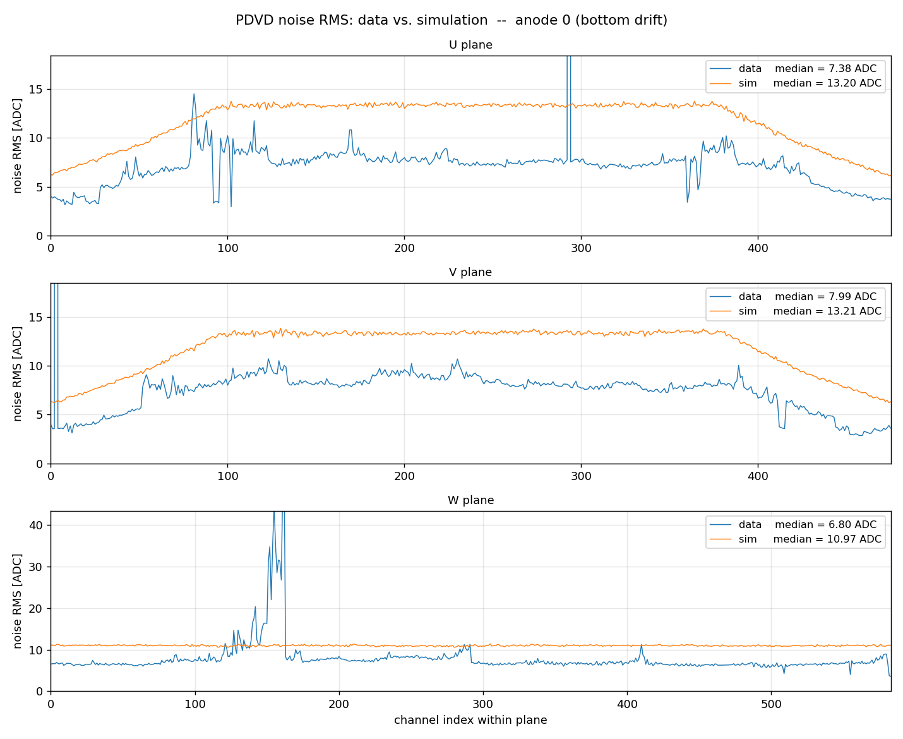

### anode 1 (bottom)

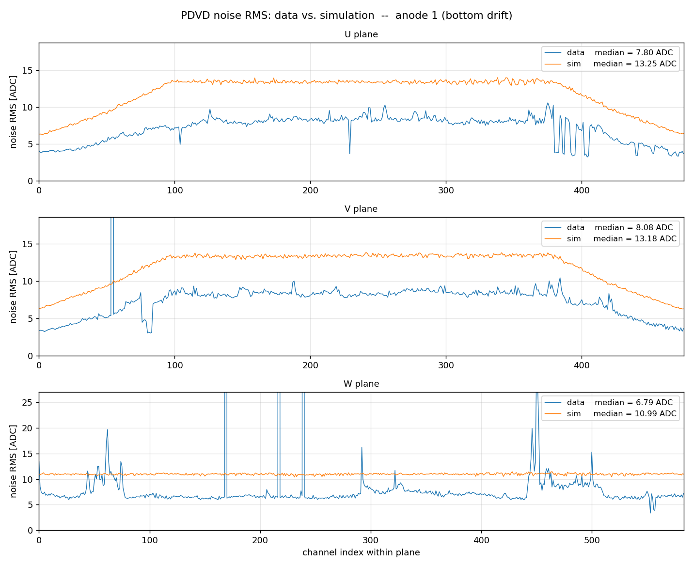

### anode 2 (bottom)

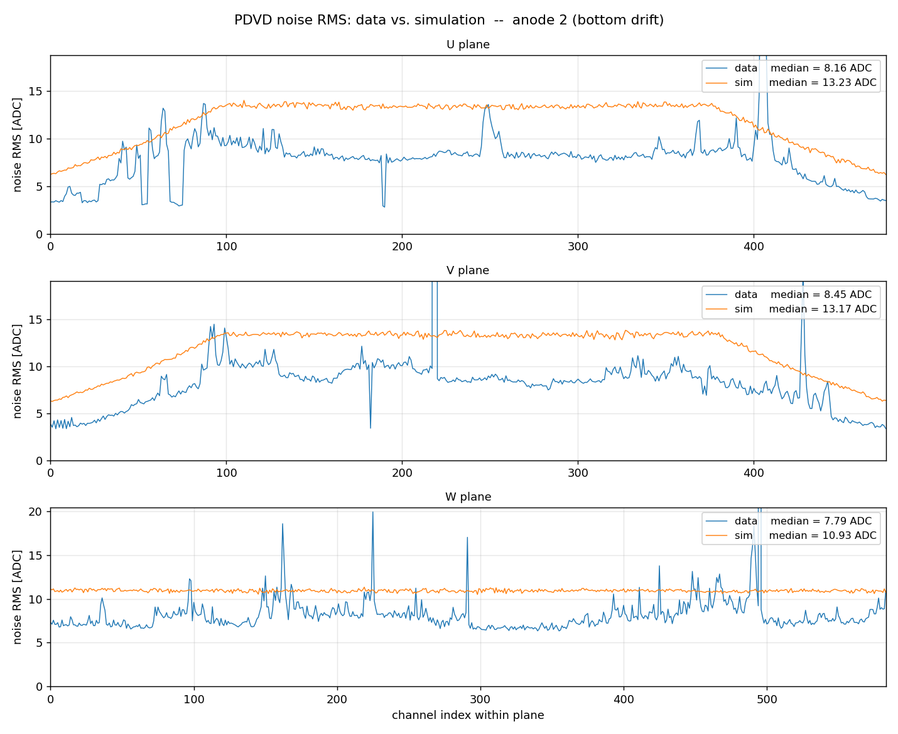

### anode 3 (bottom)

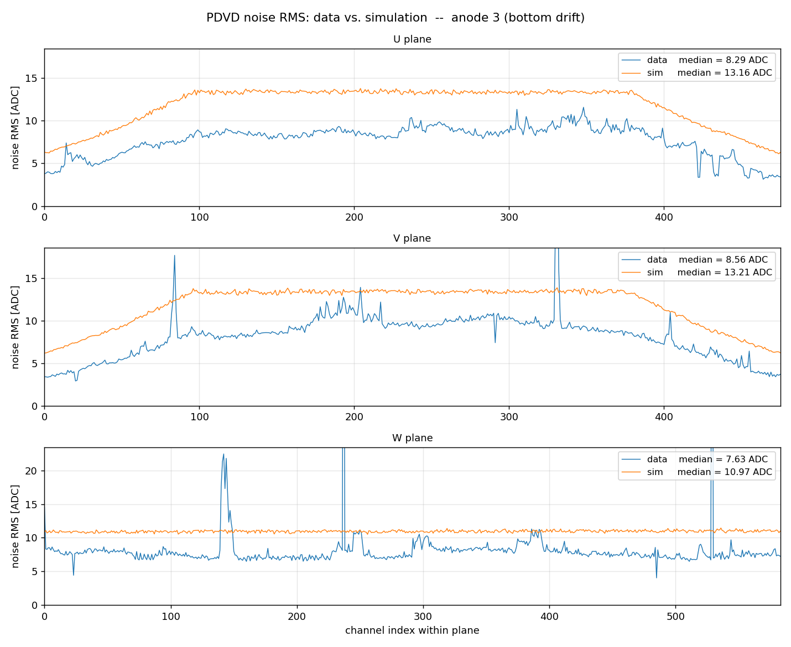

### anode 4 (top)

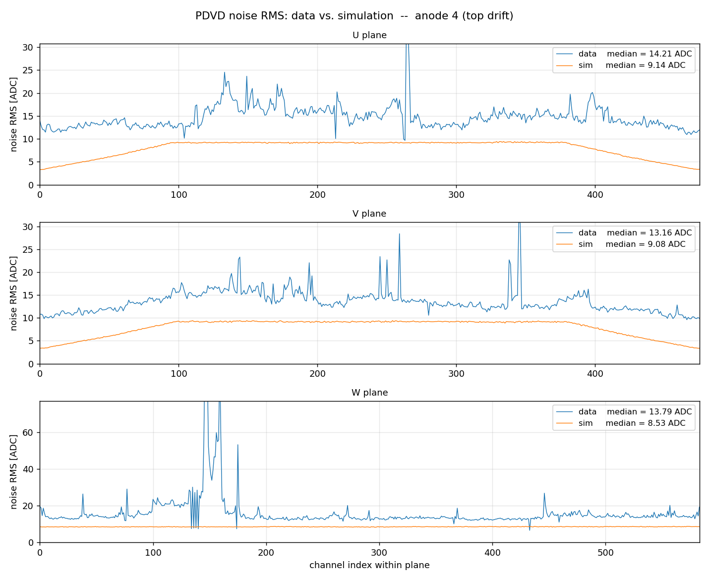

### anode 5 (top)

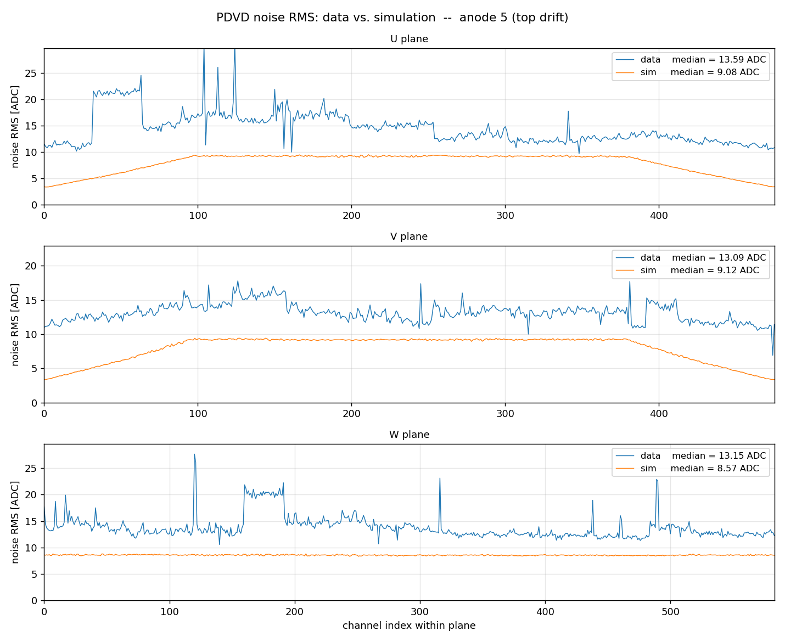

### anode 6 (top)

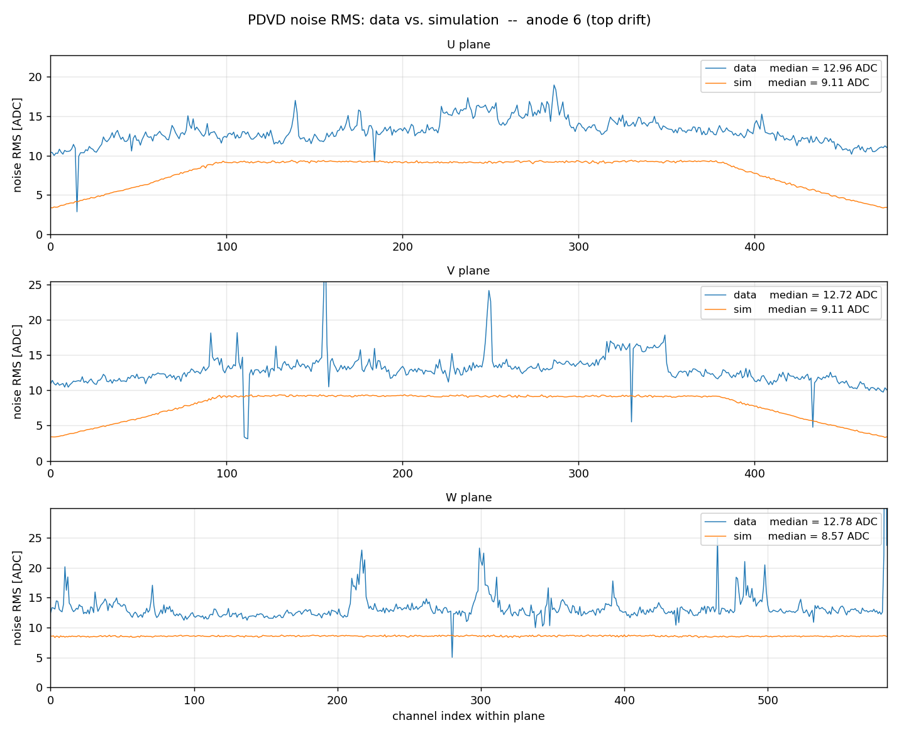

### anode 7 (top)

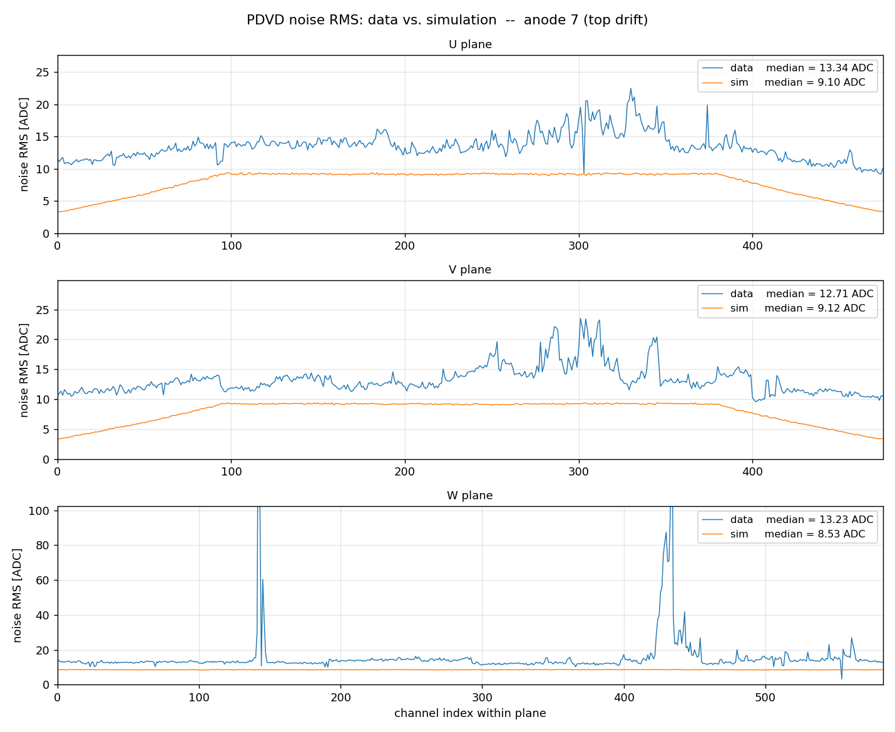

## Summary across anodes

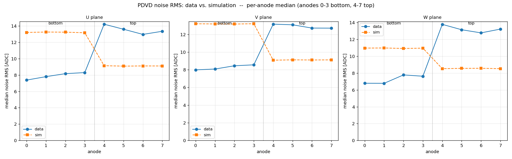

Per-source overviews (all 8 anodes overlaid):

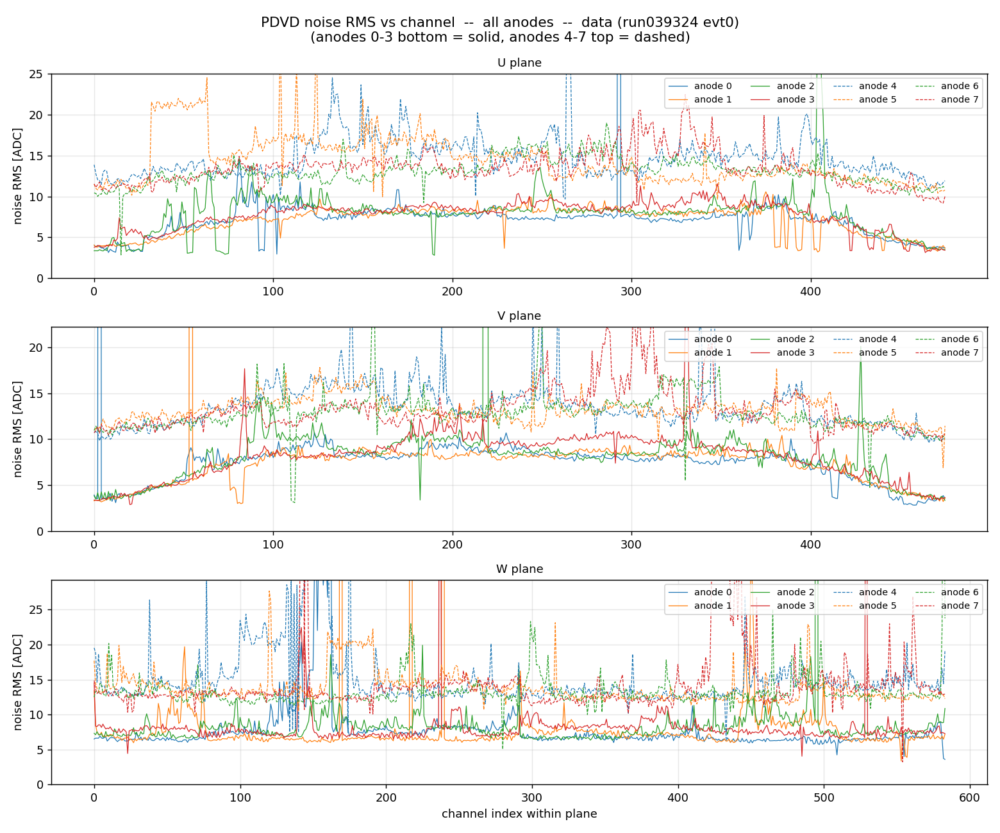

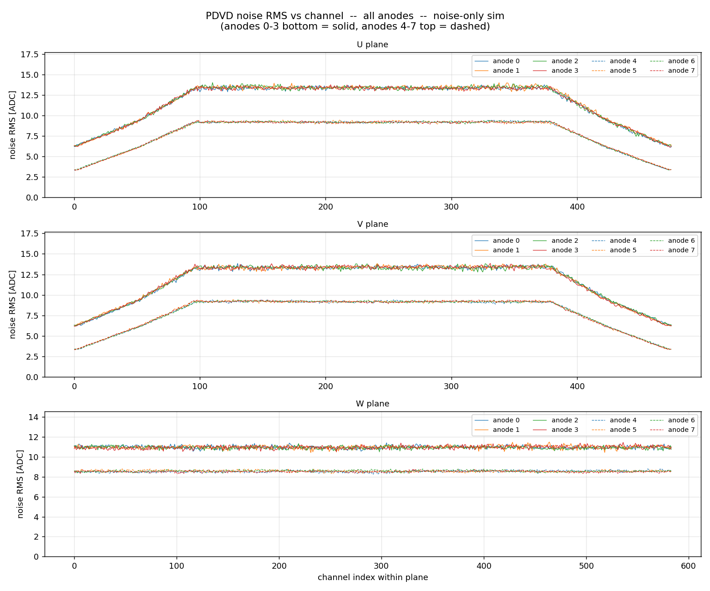

## Full per-anode / per-plane table

| anode | region | plane | data [ADC] | sim [ADC] | sim/data |
|------:|--------|-------|-----------:|----------:|---------:|
| 0 | bottom | U | 7.38 | 13.20 | 1.79 |
| 0 | bottom | V | 7.99 | 13.21 | 1.65 |
| 0 | bottom | W | 6.80 | 10.97 | 1.61 |
| 1 | bottom | U | 7.80 | 13.25 | 1.70 |
| 1 | bottom | V | 8.08 | 13.18 | 1.63 |
| 1 | bottom | W | 6.79 | 10.99 | 1.62 |
| 2 | bottom | U | 8.16 | 13.23 | 1.62 |
| 2 | bottom | V | 8.45 | 13.17 | 1.56 |
| 2 | bottom | W | 7.79 | 10.93 | 1.40 |
| 3 | bottom | U | 8.29 | 13.16 | 1.59 |
| 3 | bottom | V | 8.56 | 13.21 | 1.54 |
| 3 | bottom | W | 7.63 | 10.97 | 1.44 |
| 4 | top | U | 14.21 | 9.14 | 0.64 |
| 4 | top | V | 13.16 | 9.08 | 0.69 |
| 4 | top | W | 13.79 | 8.53 | 0.62 |
| 5 | top | U | 13.59 | 9.08 | 0.67 |
| 5 | top | V | 13.09 | 9.12 | 0.70 |
| 5 | top | W | 13.15 | 8.57 | 0.65 |
| 6 | top | U | 12.96 | 9.11 | 0.70 |
| 6 | top | V | 12.72 | 9.11 | 0.72 |
| 6 | top | W | 12.78 | 8.57 | 0.67 |
| 7 | top | U | 13.34 | 9.10 | 0.68 |
| 7 | top | V | 12.71 | 9.12 | 0.72 |
| 7 | top | W | 13.23 | 8.53 | 0.64 |

## Caveats

- **Per-region comparison is valid**: data and sim use the same ADC scale within a drift volume, so data-vs-sim within bottom (or within top) is apples-to-apples. The top-vs-bottom comparison instead folds in the different LSB — hence the mV columns.
- **Residual signal in data**: event 0 is a real triggered event. The one-pass `CalcRMS` clip leaves a small (~5-10%) residual-signal bias on the busier (top) planes; a 3-pass iterative clip cross-check gave data top U/V/W ≈ 12.8/12.9/13.0 ADC vs the 14.2/13.2/13.8 reported here. This does not change any conclusion.
- **Tick period**: data is 512 ns/tick (native, pre-resampler), sim is 500 ns/tick. This is a sub-1% effect on ADC-count RMS and is not corrected.
- The simulation was run with `nticks = 10000`; data frames have 6250 (bottom) / 6400 (top) ticks — ample statistics for a per-channel RMS in both cases.

## Conclusion

The PDVD electronics-noise simulation does **not** reproduce the data. The two input noise-spectra files need re-tuning: `pdvd-bottom-noise-spectra-v1.json.bz2` over-predicts the bottom drift volume and `pdvd-top-noise-spectra-v2.json.bz2` under-predicts the top, so the characteristic quiet-bottom / loud-top pattern seen in data is absent — in fact inverted — in simulation. Adding a coherent-noise component would further widen the top gap. See `pdvd_noise_simulation.md` for how the noise model is built.
