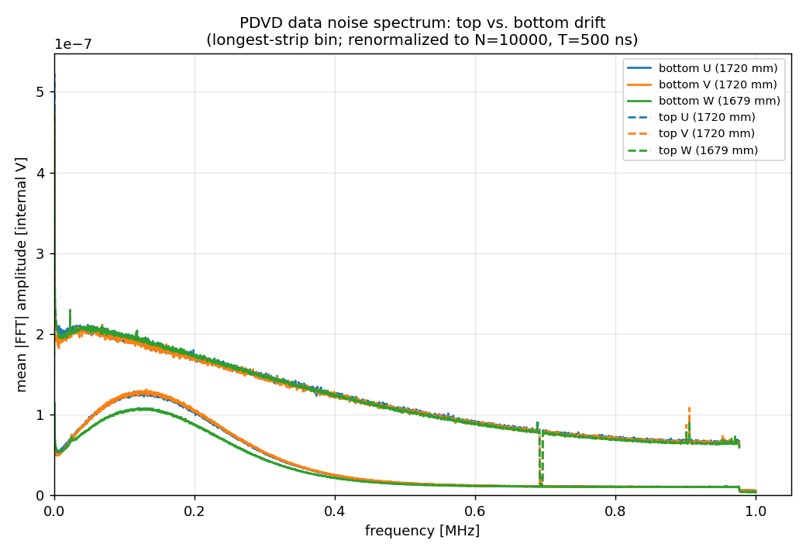
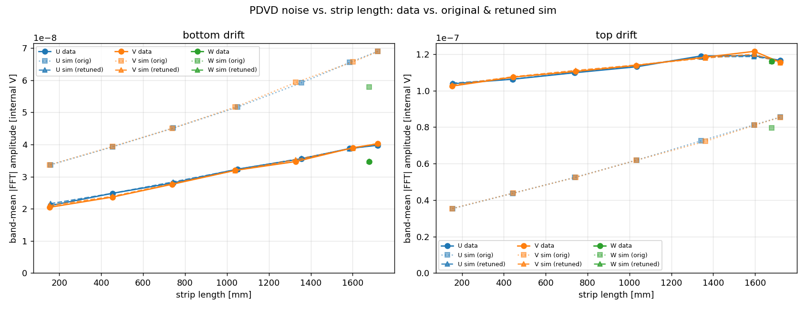
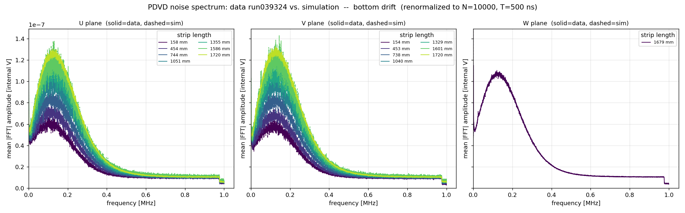
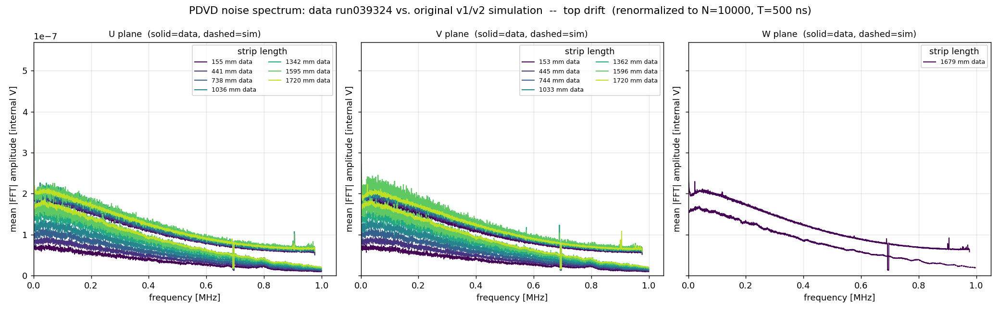

# PDVD electronics-noise frequency spectra: data vs. simulation

Per-channel electronics-noise **amplitude spectra** for ProtoDUNE Vertical
Drift, extracted from data run039324, used to **re-derive the simulation's
noise-spectra files**, and the resulting data/simulation consistency check.
Companion to [`pdvd_noise_simulation.md`](pdvd_noise_simulation.md) (how the
noise simulation is built) and [`noise_rms_comparison.md`](noise_rms_comparison.md)
(the earlier time-domain RMS study that motivated this work).

## Question

The earlier RMS study found the PDVD electronics-noise simulation **did not
match data**: it over-predicted the bottom drift and under-predicted the top.
The simulation adds *incoherent* noise only (`AddNoise`, no `CoherentAddNoise`),
drawn channel-by-channel from `EmpiricalNoiseModel` spectra files. Were those
files mis-tuned, and can they be re-derived directly from data?

## Result — yes; the re-derived spectra make simulation and data agree to ~3%

The original spectra did not match data. Re-deriving them from run039324
produces the files
(`pdvd-bottom-noise-spectra-7d8mVfC-v1`, `pdvd-top-noise-spectra-v3`) which are
**now the PDVD noise-spectra files** in
`cfg/pgrapher/experiment/protodunevd/params.jsonnet`. The bottom over-prediction
was largely a **gain mismatch** — see
[`electronics_gain_and_noise.md`](electronics_gain_and_noise.md): the original
bottom file was a 14 mV/fC spectrum used unscaled at the 7.8 mV/fC readout gain.

| | original spectra: sim / data | re-derived spectra: sim / data |
|---|---|---|
| bottom drift (U/V/W, all strip lengths) | 1.59 – 1.74 (sim too loud) | **1.00 – 1.03** |
| top drift (U/V/W, all strip lengths) | 0.34 – 0.74 (sim too quiet, wrong slope) | **0.99 – 1.01** |

With the re-derived spectra the simulation reproduces the data noise spectrum to
**≤2.7 % in every plane / drift region / strip-length bin**.

## Inputs and method

- **Data** — PDVD `run039324`, **11 events** (`evt_0..evt_10`), all 8 anodes,
  the **post-NF** waveform (`protodune-sp-frames-raw-anode{0-7}.tar.bz2`, frame
  tag `raw<N>` — the noise-filter output of `pdvd/wct-nf-sp.jsonnet`). The
  simulation models incoherent noise only and NF removes coherent noise from
  data, so the post-NF data is the like-for-like target (same footing as
  `noise_rms_comparison.md`). Bottom anodes 0-3 are 6400 ticks @ 500 ns; top
  anodes 4-7 are 6400 ticks @ 512 ns.
- **Simulation** — the noise-only sim `pdvd_sim/wct-sim-noise-only.jsonnet`
  (`EmpiricalNoiseModel → AddNoise → Digitizer`), 10000 ticks @ 500 ns.
- Scripts: `noise_spectrum.py` (extraction), `noise_spectrum_compare.py`
  (data/sim comparison), `build_noise_spectra.py` (writes the spectra files).

### Signal masking, FFT, averaging

For each channel of each event: the robust noise RMS is taken from the 16–84
percentile spread; a channel-event is **used only if it is signal-free** — no
sample beyond 6σ (a real track, or a hot ADC code, flags it; ~6400 Gaussian
samples never reach 6σ). This drops the cosmic-contaminated channel-events
outright instead of zero-padding them, which would leak signal across all
frequencies. Of run039324 ~68 % (bottom) / 78 % (top) of channel-events carry a
flagged feature; the surviving signal-free set — hundreds to thousands of
channel-events per strip-length bin — is ample and unbiased for a noise
measurement (a channel's noise does not depend on whether a cosmic crossed it
in that event).

Each surviving waveform is median-subtracted and Fourier transformed
(`numpy.rfft`); `|FFT|` is averaged over channels **and events**, grouped by
drift region, wire plane, and strip-length bin. The averaged `|FFT|` is the
**mean amplitude spectrum** — exactly the `amps` field consumed by
`EmpiricalNoiseModel`.

### Strip length — geometry and a worked example

`EmpiricalNoiseModel` selects a channel's spectrum by **wire length**, computed
as the **sum of the channel's wire-segment lengths**
(`m_anode->wires(chid)` → `Σ ray_length`, `EmpiricalNoiseModel.cxx:342-346`).
A PDVD channel may read **two** wire segments jumpered across CRP boundaries —
1552 of 12288 channels are two-segment. The data here are binned by the **same**
summed-segment length, so a data bin and a sim bin hold the same channels.

Worked example — channel 189 (a two-segment induction channel), from
`protodunevd-wires-larsoft-v3.json.bz2`:

```
  segment 0:  1704.73 mm
  segment 1:    15.77 mm   (the short jumper)
  -------------------------
  total    :  1720.50 mm   = 172.05 cm   -> EmpiricalNoiseModel wirelen
```

Cross-check: `PDVD_strip_length.json.bz2` (the physical PDVD strip lengths)
lists channel 189 at 171.96 cm — agreement to 0.05 %. Across the detector the
geometry's maximum summed length, **1720.5 mm = 172.05 cm**, equals the physical
strip maximum (171.96 cm): **no simulated wire exceeds the real geometry**, so
no channels need to be excluded. The induction (U, V) planes span ~10–1720 mm
with ~63 % of channels at the full 1720.5 mm; the **collection (W) plane is
single-length, 1679 mm** for every channel, so it has no strip-length
dependence to resolve.

Strip-length binning follows the simulation's own scheme (3 induction wire-length
anchors, refined here to **7 bins** to resolve the dependence; **1 bin** for the
single-length W plane).

### Normalization (read this — it is the subtle part)

The `EmpiricalNoiseModel` `amps` are in **WireCell internal voltage units**,
where `units::volt = 1e-6` (`Units.h`). The conversion from a digitized ADC
count is

```
amp_internal  =  ADC * span_realvolt * 1e-6 / 16384
```

with the digitizer fullscale span = 1.4 V (bottom) / 2.0 V (top), 14-bit. The
`1e-6` factor was **verified by a closure test**: the noise-only sim was run
with the *existing* spectra files, the extraction above was applied to its
output, and the result reproduced the input JSON `amps` as a flat ratio of
`1.0e6` (= `units::volt`) — to 0.1 % across the band, ~1 % only at the Nyquist
edge. This validated the whole recipe before any data was touched.

Further points (see `pdvd_noise_simulation.md` for the model internals):

- `amps` is the **mean** amplitude `E|FFT|`; `AddNoise` applies the mean→mode
  factor √(2/π) at generation time, so the file stores the mean as-is.
- `const` is set to **0**: the measured spectrum already includes the
  white-noise floor, and the model forms `μ = √(amps² + const²)`.
- **`nsamples` bookkeeping.** `E|FFT(f)|` scales as `√(N/T)` for `N` samples at
  period `T`; the model rescales by `√(10000/nsamples)`. To make the model
  reproduce the measured physical spectrum, the file stores
  `nsamples = N_data · 500 / T_data` and `period = 500 ns`:
  **bottom 6400** (6400 @ 500 ns), **top 6250** (6400 @ 512 ns). `amps` is then
  the measured `|FFT|` with no further fudge factor.
- Inter-source comparison renormalizes every spectrum to a common
  (N=10000, T=500 ns) footing: `amp_ref = amp · √((10000/500)/(N/T))`.
- The `gain`/`shaping` JSON fields are inert metadata for PDVD — with an empty
  `chanstat` the model applies no gain/shaping correction
  (`EmpiricalNoiseModel.cxx:368-377`). The run039324 front-end gain is
  7.8 mV/fC (bottom), the default in the NF/SP chain
  `cfg/pgrapher/experiment/protodunevd/params.jsonnet`.

## What was wrong with the original spectra

Extracting the data spectra and comparing them to a noise-only simulation that
used the **original** spectra (the bottom file now renamed
`pdvd-bottom-noise-spectra-14mVfC-v1`; the top `pdvd-top-noise-spectra-v2`)
showed two distinct failures (band-mean amplitude, renormalized to N=10000,
T=500 ns):

| region | plane | strip len [mm] | sim / data, original spectra |
|---|---|---:|---:|
| bottom | U | 158 → 1720 | 1.60 → 1.74 |
| bottom | V | 154 → 1720 | 1.65 → 1.71 |
| bottom | W | 1679 | 1.67 |
| top | U | 155 → 1720 | 0.34 → 0.73 |
| top | V | 153 → 1720 | 0.34 → 0.74 |
| top | W | 1679 | 0.69 |

The bottom was uniformly **~1.65× too loud**. This is explained by a **gain
mismatch**: the original bottom file's `gain` field is `2.243e-12`, bit-identical
to the PDHD **14 mV/fC** spectra file, while run039324 (and the simulation) use
the **7.8 mV/fC** front-end gain. With `chanstat` empty the model applies no
gain rescaling, so a 14 mV/fC noise spectrum was injected unscaled at 7.8 mV/fC
— expected over-prediction 14/7.8 = 1.79×, matching the observed ~1.65×. (The
residual strip-length-dependent part is a separate shape mismatch.) See
[`electronics_gain_and_noise.md`](electronics_gain_and_noise.md).

The top was **too quiet and had the wrong strip-length slope** — the simulated
top noise rose 2.4× with length while the data's barely moves.

## The re-derived spectra files

`build_noise_spectra.py` writes the measured spectra into drop-in
`EmpiricalNoiseModel` files:

| file | drift | entries | `nsamples` |
|---|---|---|---|
| `pdvd-bottom-noise-spectra-7d8mVfC-v1.json.bz2` | bottom (anodes 0-3) | U=7, V=7, W=1 | 6400 |
| `pdvd-top-noise-spectra-v3.json.bz2` | top (anodes 4-7) | U=7, V=7, W=1 | 6250 |

Each entry carries the measured spectrum on a 512-point frequency grid;
`const = 0`; `period = 500 ns`. The bottom file is named for the 7.8 mV/fC
readout gain (PDHD convention) and its `gain` field is set accordingly.
**Leave-one-out cross-check** — dropping a middle induction wire-length entry
and reconstructing it by the model's linear interpolation from its neighbours
reproduces the measured bin to **2–5 % in the mean** (larger only at the
small-amplitude high-frequency tail), confirming the strip-length binning is
fine enough.

In `params.jsonnet` (`files.noises`) the bottom file is selected by front-end
gain — `pdvd-bottom-noise-spectra-7d8mVfC-v1` at 7.8 mV/fC (the default) or
`pdvd-bottom-noise-spectra-14mVfC-v1` at 14 mV/fC — the same convention PDHD
uses. The earlier mis-tuned defaults are no longer the active configuration.

## Results

### Top vs. bottom drift



The two drift volumes have **different cold electronics** and behave very
differently:

- **Bottom** — a smooth bump peaking near 0.13 MHz and falling to the noise
  floor by ~0.4 MHz. Amplitude ~0.6–1.0 ×10⁻⁷ (internal V) at full strip length.
- **Top** — ~2× higher and a different shape: high at low frequency, a slow
  roll-off, and a sharp analog **step at ~0.69 MHz** plus a narrow line near
  0.9 MHz. Verified pre-NF (`protodune-orig-frames`) ≈ post-NF: the step is the
  **top-electronics analog response**, not an NF artifact.

### Strip-length dependence



- **Bottom induction (U, V)** — noise rises ~2× from the shortest (~158 mm) to
  the longest (1720 mm) strips, the expected capacitance-driven trend.
- **Top induction (U, V)** — nearly **flat**: only ~15 % from short to long
  strips. The top noise is dominated by a large strip-length-**independent**
  component.
- **Collection (W)** — single strip length (1679 mm), one spectrum per region.

### Data vs. simulation — the consistency check




With the re-derived spectra in place, the simulation reproduces the data
spectrum **frequency-by-frequency and strip-length-bin-by-bin**:

| region | data / sim (range over all planes & strip lengths) |
|---|---|
| bottom | 0.97 – 1.00 |
| top | 0.99 – 1.01 |

Worst single-bin deviation **2.7 %** (top V, 1596 mm, the lowest-statistics
bin). The band-mean amplitude is the frequency integral of the spectrum, so
this is equivalent to a per-bin noise-RMS agreement of the same few percent —
the ~1.65× / 0.34–0.74× discrepancies of the original spectra are gone.

## Caveats

- **Comparison footing.** Post-NF data vs. raw noise-only sim — the established
  PDVD methodology (`noise_rms_comparison.md`, `noise_spectrum.py`). The
  re-derived spectra are therefore tuned to the **post-NF / incoherent** noise.
  They are the correct input for a noise-only simulation; using them as raw
  electronics-noise input to a full *sim → NF → SP* physics chain would
  **double-count** the NF stage. NF on PDVD also slightly attenuates the
  incoherent noise it keeps, biasing the absolute scale by a few percent.
- **Short induction strips.** The shortest induction bin is centred at ~158 mm;
  the few channels below it are flat-extrapolated by the model, which slightly
  over-states their noise (visible as data/sim ≈ 0.97 at the 158 mm bin).
- **Top high-frequency features.** The ~0.69 MHz step and the ~0.9 MHz line are
  carried into the spectra (they are real, in the data); the 512-point grid
  resolves them to ~1 part in 512, adequate for the noise RMS.
- **Coherent noise** is still **not** simulated. This work retunes only the
  incoherent spectra; a `CoherentAddNoise` component would be a separate study.

## Reproduce

```
cd pdvd/nf_plot
./noise_spectrum.py --source data         # 11 events, ~4 min
cd ../../pdvd_sim && ./run_sim_noise.sh    # noise-only sim (uses the retuned spectra)
cd ../pdvd/nf_plot
./noise_spectrum.py --source sim
./noise_spectrum_compare.py               # data/sim comparison plots & table
```

To regenerate the spectra files themselves from the data extraction:
`./build_noise_spectra.py` → `wire-cell-data/pdvd-bottom-noise-spectra-7d8mVfC-v1.json.bz2`
and `pdvd-top-noise-spectra-v3.json.bz2`.

## Conclusion

The PDVD electronics-noise simulation mismatch is explained by the
`EmpiricalNoiseModel` spectra files: the bottom was ~1.65× too loud (largely a
14-vs-7.8 mV/fC gain mismatch, see
[`electronics_gain_and_noise.md`](electronics_gain_and_noise.md)), the top too
quiet with the wrong strip-length dependence. Re-deriving the spectra directly
from run039324 — with the normalization pinned by a closure test — produces
`pdvd-bottom-noise-spectra-7d8mVfC-v1` / `pdvd-top-noise-spectra-v3`, which **are
now the PDVD noise-spectra files** and bring the simulation into **agreement with
data to ≤3 %** across both drift regions, all three planes, and the full
strip-length range.
