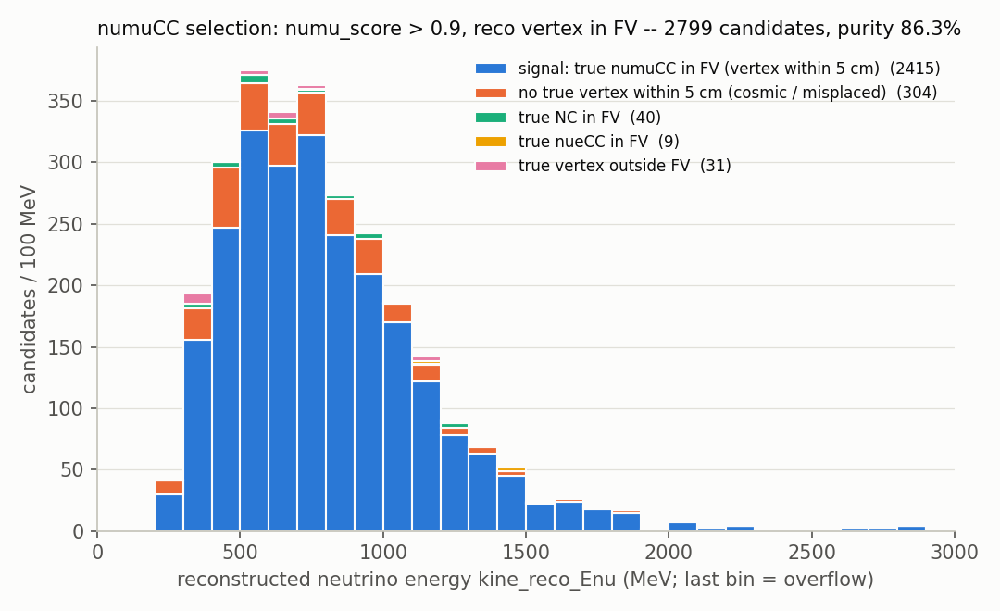
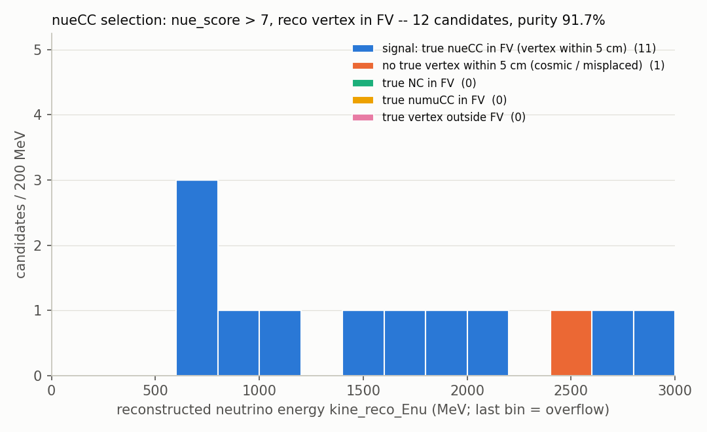
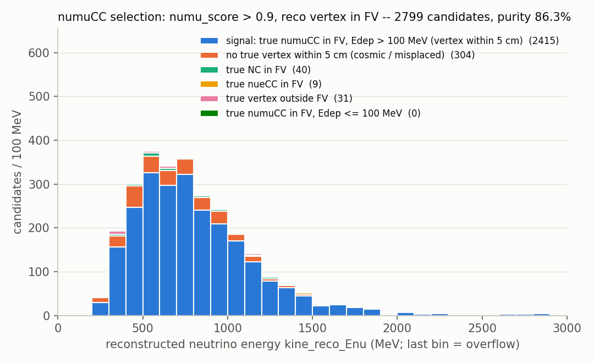
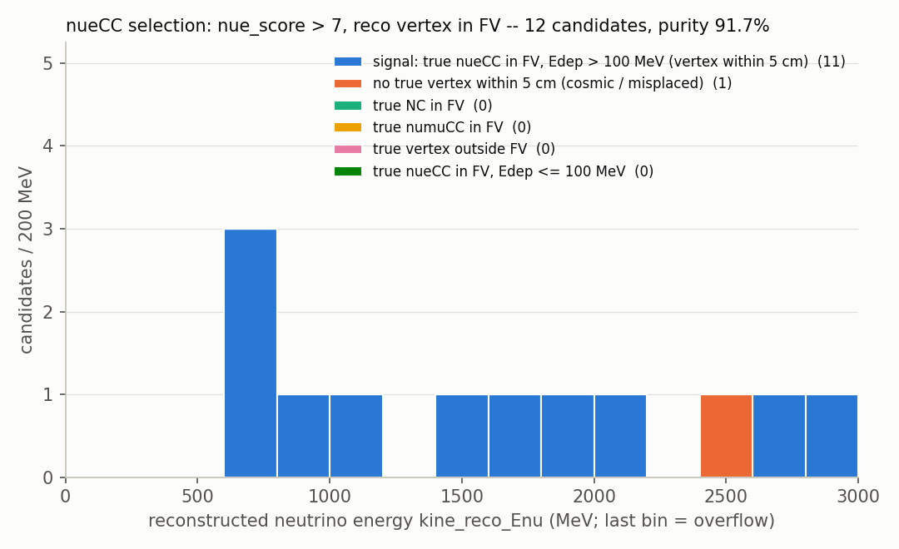
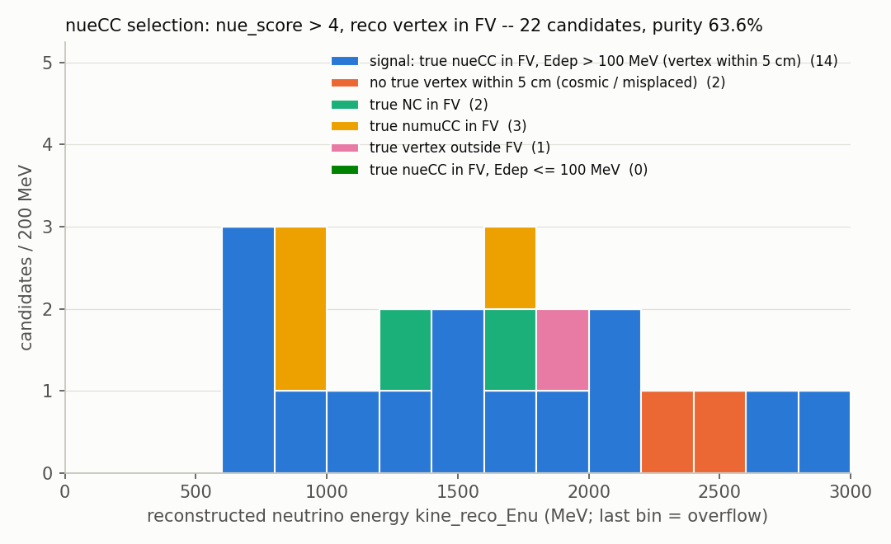

# 107 — SBND MC production: where the truth is, and whether the cosmic taggers agree with the neutrino PR

Doc number 107 (claimed 2026-09-14). Analysis only: no toolkit code or config is
changed, and the sample is read-only.

## Repro

```bash
cd /home/xqian/toolkit-dev/wcp-porting-img/sbnd/sbnd_xin
# sbnd_mc_data -> /nfs/data/1/xqian/sbnd_data/run (tracking-pr/, bee/, logs/, summary-merged.csv)
python3 d107_truth_tagger_consistency.py --run sbnd_mc_data --out products/d107 \
    > ~/tmp/d107_run.log 2>&1; echo rc=$?
# -> products/d107/{candidates.tsv, truth.tsv, summary.txt}
# rc=0, "events 13216 candidate rows 6236 truth interactions 23738"
python3 d107_tables.py products/d107 > ~/tmp/d107_tables.out 2>&1; echo rc=$?
```

`summary.txt` holds the section 2 and 4.1/4.3/4.4 census counts. Every table in
sections 4.2, 4.5, 4.6 and 5 is printed by `d107_tables.py` from `candidates.tsv`
and `truth.tsv` (column names as in each table). The production script refuses to
write into an existing output dir.

## 0. Answers in brief

| Question | Answer |
|---|---|
| Where is the reco? | `tracking-pr/tracking-pr_<tag>.root`. `T_tagger` holds `numu_score`, `nue_score`, `neutrino_type`, the ~1200 tagger/BDT variables and the `act_*` cosmic-tagger arrays. `T_kine` holds `kine_reco_Enu`. Both have one row per neutrino candidate. |
| Where is the truth (type, Enu, vertex)? | **Only in Bee**, in `bee/bee_<tag>.zip::data/0/0-mc.json`. The tracking-pr ROOT files carry **no** truth branches. |
| Does mc.json hold truth or reco particle flow? | **Both, in one tree.** The truth interaction nodes (id 9000000+) come from larwirecell's `TensorSetLabeler`. Our reco PF is grafted under a single `reco nu …` node (id 19999999, children ≥ 20000000), or a `no reco neutrino candidate (…)` marker replaces it. Each node is unambiguous by id and text (section 2.2). |
| Vertex quality / numuCC / nueCC selection (FV 5<\|x\|<190, \|y\|<190, 10<z<450 cm; match = vertex within 5 cm) | Vertex within 5 cm for 67.7 % of true ν in the FV (80.0 % numuCC). numuCC with `numu_score>0.9`: efficiency **69.0 %**, purity **86.3 %**. nueCC with `nue_score>7.0`: 11/31 = 35.5 % efficiency and 11/12 purity, which is statistics-limited in this BNB sample (section 5.5). Requiring true Edep > 100 MeV in the signal raises the vertex number to 73.5 % and leaves both selections unchanged. At `nue_score>4.0` the nueCC purity is 14/22 = 63.6 % (efficiency 14/31) (section 5.6). Without the true-vs-reco vertex match, numuCC reads efficiency 77.0 % and purity 94.7 % (event level); the nueCC numbers are unchanged (section 5.7). |
| Why do 20 of the 31 true nueCC fail `nue_score > 7.0`? | **7 never get a candidate vertex within 5 cm:** 2 have no in-window candidate, 1 has the wrong cluster picked, and 4 have the vertex 17–35 cm off. **13 have a good vertex but fail the score:** 10 have the EM shower misreconstructed (`nue_score` < 4), and 3 sit just below the cut (4–7). The categories were assigned by hand. The per-event list and a Bee set are in section 5.8 and `sbnd_xin/bee/d107nue31/d107nue31.index.txt`. |
| Is the PR candidate the non-cosmic one? | **Yes, in 6236/6236 rows, by construction.** The per-bundle `pick()` skips any activity with TGM, STM or `lm_flag>0` (section 3). The informative numbers are the residuals in section 4. |

## 1. The sample

| Item | Value |
|---|---|
| Path | `sbnd_xin/sbnd_mc_data` → `/nfs/data/1/xqian/sbnd_data/run` |
| Input | 1000 reco1 files, `…/v10_14_02_03/prodgenie_corsika_proton_rockbox0p1_sbnd/Gen2_2026/CV/reco1/…` (BNB ν with rockbox + CORSIKA cosmics) |
| Chain | lar (`wcls-img-clus-matching-xin.jsonnet` + `pr-operating-point.jsonnet`): imaging, clustering, Q/L matching, PR, taggers, BDT scorers |
| Events | 13 217 in `summary-merged.csv`. 13 216 have rc=0 (1 087 were re-run after rc=126 in `summary.csv`); 1 (`r471_s18_e33`, retry:1) has rc=11 with no products and audit FAIL (`logs/audit_9040_r471_s18_e33.txt`: `tracking_visitor ran but tracking-pr.root is missing`). |
| Products | 13 216 `tracking-pr_*.root`, 13 216 `bee_*.zip`. `nugraph/` and `work/` are empty. |

The production log confirms the per-bundle selection ran. For example,
`logs/missing_10000_r717_s93_e26.log` contains
`TaggerCheckNeutrino: [nu_per_bundle] gid 1000006: candidate main cluster 14 …`.

## 2. Where things are

### 2.1 tracking-pr ROOT (reco only)

| Tree | Writer | Rows | Use |
|---|---|---|---|
| `T_tagger` | `root/src/UbooneTaggerOutputVisitor.cxx:107` | one per candidate (`nu<i>` slot, `:83-89`, filled `:1237`) | `numu_score`, `nue_score`, `neutrino_type`, `cosmict_*`, `nu_x/y/z`, `cluster_id`, `matched_flash_gid`, `nu_index`, `act_*` |
| `T_kine` | same, `:1160` | aligned 1:1 with `T_tagger` (`:1237-1238`) | `kine_reco_Enu`, `kine_nu_*_corr`, π⁰ and MCS energies |
| `T_cluster` | `root/src/SbndPrMagnifyTrackingVisitor.cxx` | one per cluster | `is_main`, `is_associated`, `flash_id`, `length_cm`, `cluster_t0_us`. **Its `tgm/stm/fc/lm/beam_flash` columns are always 0 (section 4.3).** |
| `T_rec_charge`, `T_proj_data`, `Trun`, `T_bad_ch` | `SbndPrMagnifyTrackingVisitor` | — | track-fit charge, projections, run info |

If an event has no candidate, `UbooneTaggerOutputVisitor` returns early (`:72-75`,
"no TrackFitting in grouping"). **Such a file then has no `T_tagger` or `T_kine`
at all.** That is the case for 7 078 of the 13 216 events.

### 2.2 Bee `0-mc.json`: truth and reco particle flow in one forest

Bee draws one particle tree per event, so the SBND chain grafts the reco flow onto
the truth tree. The graft is `MultiAlgBlobClustering::pf_set_particles`
(`clus/src/MultiAlgBlobClustering.cxx` ~3040-3081), enabled by
`cfg/pgrapher/experiment/sbnd/clus.jsonnet:2737-2743`
(`merge_metadata_key: 'bee_pf_truth'`, `merge_node_text: 'reco nu'`,
`emit_empty: true`). The result is the truth forest at top level plus one reco
summary node.

| Top-level node | id range | text | Written by |
|---|---|---|---|
| **truth interaction** | `9000000 + nu_idx` (children = G4 trackids ≥ 1e7) | `"<n> <flav> <QE\|RES\|DIS\|MEC\|COH\|NuEEL> <CC\|NC> Etot <E> MeV Edep <D> MeV T <t> us"`, `data.start` = vertex | larwirecell `aiml/TensorSetLabeler.cxx` |
| **reco summary** | exactly `19999999` (= `merge_id_offset - 1`); every descendant ≥ 20000000 | `"reco nu <Enu> MeV numu <s> nue <s>"`, with children `"nu <i> (gid <g>, cluster <c>)"` → particles | `pf_summary_node` (`MultiAlgBlobClustering.cxx` ~2994) |
| **no-candidate marker** | — | `"no reco neutrino candidate (no TrackFitting)"` | `MultiAlgBlobClustering.cxx` ~1387 |

**Full-sample check** (`summary.txt`):
- 6 138 events have exactly one reco node and 7 078 exactly one marker; there are 0 other top-level nodes.
- Reco-node presence equals `T_tagger` presence in 13 216/13 216 events.
- The reco node's Enu equals `T_kine` `kine_reco_Enu` of the primary slot in 6 138/6 138.
- The reco scores are the primary candidate's (`nu_index` 0). A second candidate's scores appear only in `T_tagger`.

Without the labeler (data, or the standalone `run_pr_chain_batch.sh` runs), the same
file holds only the reco node. That is the "mc.json stores reco PF" case.

**Truth node definitions**, from the labeler source (read-only fetch of
`HaiwangYu/larwirecell` branch `dev-v10_14_02_02` @ `a02a1a4d`; the text format
matches every node in the sample):

| Field | Definition | Source |
|---|---|---|
| `Etot` | true incoming neutrino energy, `MCTruth.GetNeutrino().Nu().Momentum(0).E()` × 1e3 | `TensorSetLabeler.cxx:726-729` |
| `Edep` | sum of `sim::SimEnergyDeposit::Energy()` over deposits whose track belongs to this interaction (visible energy) | `:678-705` |
| vertex | `Nu().Position(0)`, generator coordinates in cm (no SCE, no drift) | `:723-726`, `:848-852` |
| `T` | `Position(0).T()` × 1e-3, interaction time in µs (sample range 0.009-1.634) | `:730` |
| `CC/NC` | `MCNeutrino::CCNC()` | `:725`, `:842` |
| mode | `MCNeutrino::InteractionType()` name | `:121-124` |

Caveats on the truth tree:
- **Particle floor:** MCParticles need KE > 10 MeV (`pf_ke_min`).
- **Beam neutrinos only:** with `pf_nu_only` (default true) there are no cosmics at all.
- **Not a full interaction list:** an interaction gets a node only if it has ≥ 1 kept particle. Use it with care as an efficiency denominator.
- **Stale header:** `TensorSetLabeler.h:125-128` still says the node energy is Edep only. The code writes both Etot and Edep.

The labeler also puts `nu_pdg/nu_ccnc/nu_int_type/nu_energy/nu_vtx_*` into the tensor-set
metadata. That metadata is not persisted in these products, and the nugraph HDF5
output is empty here.

**Sample content:** 23 738 truth interactions in 13 216 events.
- Interactions per event: 1 in 5 634 events, 2 in 5 223, 3 in 1 858, 4 in 431, 5+ in 70.
- Flavour: numu 23 493, nue 245.
- Mode: QE 12 477, RES 5 971, MEC 3 214, DIS 1 990, COH 84, NuEEL 2.
- 24 events have every interaction at Edep = 0 (rockbox, outside the TPC).

## 3. How the neutrino candidate is chosen (production path)

Production knobs (`sbnd/pr-operating-point.jsonnet`):
- `nu_per_bundle=true` (:32), `nu_per_bundle_min_length=15` (:33)
- `evaluate_demoted_mains=true` (:27), `restore_demoted_mains=true` (:42)
- `neutrino_type_bitmask=true` (:31)
- `nu_skip_cosmic=true` (:154), `nu_skip_cosmic_bundle=true` (:155)
- `nu_fallback_demoted_mains=true` (:151), `nu_selected_as_main=true` (:152)
- `skip_cosmic_companions=true` (:239)

1. **Cosmic taggers.**
   - `TaggerCheckTGM` / `TaggerCheckSTM` / `TaggerCheckFC` evaluate in-scope, in-beam-window **main** clusters, and demoted mains when `evaluate_demoted_mains` is on. They set `Flags::TGM` / `STM` / `FC` (`TaggerCheckTGM.cxx:327`, `TaggerCheckSTM.cxx:641`, `TaggerCheckFC.cxx:216`).
   - The Q/L LM tagger stamps the scalar `lm_flag` (0 pass, 1 low energy, 2 light mismatch) on every cluster of a matched bundle (`match/src/QLMatching.cxx:3703-3705`).
   - Associated clusters are never tagger candidates.
2. **Per bundle** (`clus/src/TaggerCheckNeutrino.cxx:2117-2353`): activities are the in-window mains and demoted mains grouped by `matched_flash_gid`. Every activity is recorded in `act_*` (`:2230-2247`). Then `pick()` runs (`:2251-2296`):
   ```cpp
   if (m_nu_skip_cosmic) { if (tgm || stm || lm > 0) continue; }   // :2254-2263
   if (c != legacy_main && per_bundle_min_len > 0 && c->get_length() < per_bundle_min_len) continue;
   if (!best || c->get_length() > best->get_length()) best = c;    // longest wins
   ```
   `pick()` runs first over the bundle's mains. If none survives, it runs over the demoted mains (`:2297-2299`). If still none, the bundle yields **no row** (`:2300-2304`).
3. **Companions.** The associated clusters of that gid are the candidate's companions. TGM/STM-tagged companions ≥ 15 cm are dropped. A companion is never promoted to candidate.
4. **Neutrino PR.** Candidates are sorted longest-first (`nu_index` 0 = primary), and the full neutrino PR (vertex, particle ID, taggers, BDTs) runs once per candidate into slot `nu<i>`.

The owner's picture ("the main cluster is judged first; if it is cosmic, e.g. TGM,
look at the neutrino candidate") is right. It happens **within one Q-L bundle**
(one flash gid): a cosmic-tagged main is skipped, the longest untagged main of the
same bundle wins, and failing that the longest untagged demoted main. The saved
`T_tagger`/`T_kine` row describes that surviving candidate, not the cosmic.

`act_is_demoted = 1` means `Flags::demoted_main`: a piece restored by
`ClusteringUnmergeBundle` that was a main before the flash-time merge. **It does not
mean "tagged cosmic"**; a cosmic-tagged main is simply skipped and keeps its flags.

The prototype (`prototype_base/wire-cell/pid/apps/wire-cell-prod-nue.cxx:1335-1363`)
builds a `NeutrinoID` for every in-beam flash-TPC pair, with no TGM/STM/LM veto, no
length order and no demoted fallback. There the cosmic verdicts only reach later
analysis via `T_match.event_type`. The veto is a deliberate toolkit addition.

## 4. Consistency of the cosmic taggers with the PR output (full sample)

Rows = `T_tagger` rows: 6 236 in 6 138 events (6 040 events with 1 row, 98 with 2).
`act_*` covers 19 820 activities: 483 with TGM=1, 134 with STM=1, 10 415 with FC=1.

### 4.1 The selected activity is never cosmic-tagged, by construction

| Selected activity (`act_is_selected==1`) | Rows |
|---|---|
| exactly one selected per row | 6 236 / 6 236 |
| TGM=0, STM=0, `lm_flag`≤0 | **6 236 / 6 236** |

Zero tagged candidates is what `pick()` guarantees, not independent evidence that
the taggers and PR agree. The measurements are the residuals below.

### 4.2 Bundles where a cosmic tag changed the choice

| Bundle status (`bundle_has_vetoed`, `sel_demoted`) | Rows | Candidate vertex within 5 cm of a true ν vertex | median distance |
|---|---|---|---|
| no tagged activity in the bundle | 5 653 (5 502 with a vertex) | 0.684 | 1.7 cm |
| tagged activity vetoed → another **main** chosen | 371 (362) | 0.655 | 1.7 cm |
| tagged activity vetoed → **demoted-main fallback** chosen | 212 (212) | 0.472 | 7.7 cm |

Every one of the 212 demoted-main selections follows a TGM/STM veto. There are 0
rows where a demoted main was chosen in a bundle with no tagged activity, so the
15 cm floor alone never forced the fallback here.

After a veto, the other-main choice associates with a true neutrino vertex about as
often as an untouched bundle. The demoted-main fallback is visibly weaker (0.47,
with 34 % of rows > 50 cm from any true vertex).

**Example of a good fallback: `r471_s69_e12`.**
- Bundle gid 1000002 has 7 activities, one TGM/STM-vetoed.
- The fallback picked demoted main 13.
- It sits 2.1 cm from a true numu QE CC vertex (Etot 587.8, Edep 444.8 MeV).
- Reco: Enu 489.6 MeV, numu 2.57, `neutrino_type` 4.

Bundles where **every** activity was vetoed yield no row, so this production output
cannot count them. They are among the 7 078 no-candidate events.

### 4.3 `T_cluster` tagger columns are unusable (defect, reported not fixed)

`T_cluster.tgm/stm/fc/lm/beam_flash` are 0 in **all** 13 216 files, while `act_*`
has 483 TGM, 134 STM and 10 415 FC. The cause: `SbndPrMagnifyTrackingVisitor.cxx:349-353`
reads the lowercase `Flags::tgm / short_track_muon / fully_contained /
light_mismatch / beam_flash`. Only `ClusteringTaggerFlagTransfer.cxx:90,102`
(uBooNE verdict import, not in the SBND pipeline) sets those. The SBND taggers set
uppercase `Flags::TGM/STM/FC`, and LM is the scalar `lm_flag`, not a flag.

**Use `act_tgm/act_stm/act_fc/act_lm`**, not `T_cluster`, for tagger verdicts.
Changing the writer would change the ROOT output values, so it would need a
default-OFF knob and a gate. It is not done here.

### 4.4 The LM arm never fired

`act_lm` = 0 on all 19 820 activities. There is not a single −1 (absent), so the LM
tagger ran and passed every in-window activity. In this sample every veto in 4.2
came from TGM/STM; the LM condition of `pick()` never removed anything.

### 4.5 `T_tagger.cluster_id` is not always the candidate

| `cluster_id` vs selected `act_cluster_id` (`cid_relation`) | Rows | vertex within 5 cm |
|---|---|---|
| same | 5 748 | 0.691 |
| another activity of the bundle | 109 | 0.431 |
| not in `act_*` at all | 379 | 0.493 |

`cluster_id` is `main_cluster->get_cluster_id()` when the row is written
(`TaggerCheckNeutrino.cxx:3547`). The DL/traditional vertex step can repoint
`main_cluster` after selection (`swap_main_cluster`, comment at `:2413`). **For
"which activity did PR run on", use `act_cluster_id[argmax(act_is_selected)]`.**
The 488 repointed rows also associate worse with truth. Example: `r471_s25_e25`,
selected 11, `cluster_id` 29, vertex 279 cm from any true vertex.

### 4.6 `neutrino_type`, and the PR's own cosmic tagger

With `neutrino_type_bitmask`, bit 1 = cosmic (PR-level `NeutrinoTaggerCosmic`),
bit 2 = numu CC, bit 3 = NC, bit 5 = nue.

| `neutrino_type` | 4 | 8 | 6 | 10 | 0 | 40 | 36 |
|---|---|---|---|---|---|---|---|
| meaning | νμCC | NC | cosmic+νμCC | cosmic+NC | no vertex | nue+NC | nue+νμCC |
| rows | 3 399 | 1 838 | 576 | 244 | 160 | 18 | 1 |

- **No vertex:** the 160 `neutrino_type=0` rows are exactly the rows with the default vertex (0,0,0). The candidate got a row but no neutrino vertex.
- **Two cosmic flags agree:** `cosmict_flag` equals bit 1 of `neutrino_type` in 6 236/6 236 rows.

The PR-level cosmic tagger and TGM/STM measure different things, and they are
largely independent here:

| | `cosmict_flag`=0 | `cosmict_flag`=1 |
|---|---|---|
| bundle without a TGM/STM veto | 4 950 | 703 (12.4 %) |
| bundle with a TGM/STM veto | 466 | 117 (20.1 %) |

A bundle that already contained a tagged cosmic is somewhat more likely to have its
surviving candidate also called cosmic by the PR. The rate is 20 % vs 12 %, so most
fallback candidates pass the PR cosmic tagger.

## 5. Truth ↔ reco

**Method: association, not truth matching.** Each candidate is associated with the
**nearest** true interaction vertex in its event (3D distance, generator
coordinates vs `T_tagger` `nu_x/y/z`). In rockbox events with 1-5 interactions, a
large distance means the candidate is not at any true ν vertex (a cosmic, or a
secondary deposit). It is **not** a resolution tail.

The principled join, which is not done here, is Bee's `truth_trackid_labeled`
point set (per-point G4 trackid → interaction). Using it would turn "near a true
vertex" into "made of that interaction's charge".

### 5.1 Vertex association (6 076 rows with a vertex)

| < 3 cm | < 5 cm | < 20 cm | > 50 cm | median |
|---|---|---|---|---|
| 0.616 | 0.674 | 0.758 | 0.180 | 1.7 cm |

Every candidate within 5 cm is at an interaction with Edep > 0 (4 098/4 098). The
second candidate of a two-row event (`nu_index`=1: 98 rows, 72 of them with a vertex)
associates like the primary (0.639 within 5 cm).

Spot check `r471_s0_e10`:
- truth `1 numu QE CC Etot 1345.8 MeV Edep 671.1 MeV` at (−31.19, −26.57, 265.75);
- reco candidate cluster 4 (248.6 cm) at (−30.98, −26.47, 265.81), 0.25 cm away;
- Enu 811.7 MeV, numu 5.58, nue −15, `neutrino_type` 4;
- the event's second true interaction (MEC NC, Edep 0) produced nothing.

### 5.2 Scores by true class (candidates within 5 cm)

| True class | Rows | numu_score median | numu>0 | nue_score = −15 | nue>0 | νμCC bit | nue bit | cosmic bit |
|---|---|---|---|---|---|---|---|---|
| νμ CC | 3 449 | 3.01 | 0.921 | 0.924 | 0.009 | 0.887 | 0.001 | 0.075 |
| NC | 617 | −1.03 | 0.190 | 0.930 | 0.008 | 0.177 | 0.003 | 0.044 |
| νe CC | 32 | 0.35 | 0.625 | 0.094 | 0.656 | 0.344 | 0.281 | 0.031 |
| not near any true vertex (≥ 20 cm) | 1 470 | −1.20 | 0.269 | 0.917 | 0.010 | 0.352 | 0.002 | 0.281 |

`nue_score = −15` is the scorer's sentinel for candidates the nue BDT does not
evaluate. The BDT weights are the uBooNE-trained XMLs (`clus.jsonnet:2414-2440`),
so the scores are uncalibrated for SBND. The νe CC row has only 32 entries; the
sample has 245 true νe interactions.

### 5.3 Reco energy (candidates within 5 cm, `reco_Enu > 0`)

| True class | Rows | reco Enu / Etot: median [Q1, Q3] | reco Enu / Edep: median [Q1, Q3] |
|---|---|---|---|
| νμ CC | 3 449 | 0.738 [0.530, 0.911] | 1.184 [1.044, 1.336] |
| NC | 617 | 0.295 [0.165, 0.439] | 0.954 [0.756, 1.097] |
| νe CC | 32 | 0.802 [0.612, 1.006] | 0.995 [0.872, 1.123] |

`Edep` is the deposited energy; it omits the muon/pion masses, neutrinos, neutrons
and energy deposited outside the active volume. So `reco/Edep > 1` for νμ CC is
expected (e.g. the muon mass is added back), and `reco/Etot` is the number relevant
to a neutrino-energy measurement.

### 5.4 Why 7 078 events have no candidate

Candidate presence vs the largest true `Edep` in the event:

| max Edep (MeV) | Events | with a candidate | fraction |
|---|---|---|---|
| 0 | 24 | 0 | 0.000 |
| (0, 20) | 3 491 | 114 | 0.033 |
| [20, 50) | 1 046 | 169 | 0.162 |
| [50, 100) | 801 | 251 | 0.313 |
| [100, 200) | 1 221 | 517 | 0.423 |
| [200, 500) | 3 127 | 2 130 | 0.681 |
| ≥ 500 | 3 506 | 2 957 | 0.843 |

Almost half of the no-candidate events (3 401 of 7 078) have < 20 MeV deposited by any
neutrino: the interaction was upstream in the rockbox or outside the TPC, so the
"no candidate" is correct. The 114 candidates in those events are cosmic or
secondary activity called a neutrino. Above 500 MeV, 84 % of events have a
candidate. Per truth interaction with Edep ≥ 500 MeV, a candidate vertex lies
within 5 cm for 63.5 % (44.9 % at 200-500, 19.9 % at 100-200 MeV).

This is presence, not efficiency: there are no beam-window, FV or cosmic-overlap
cuts on the truth, and the truth tree drops interactions with no particle above
10 MeV.

## 5.5 Vertex quality, and numuCC / nueCC efficiency and purity (owner follow-up)

Repro (reads only `products/d107/`; writes the numbers and both figures):

```bash
cd /home/xqian/toolkit-dev/wcp-porting-img/sbnd/sbnd_xin
python3 d107_selection.py products/d107 docs/107_sel > ~/tmp/d107_sel.log 2>&1; echo rc=$?
# -> docs/107_sel/{d107_selection.txt, d107_enu_numucc.png, d107_enu_nuecc.png}
```

**Definitions** (the owner's choices):
- **FV:** 5 < |x| < 190, |y| < 190, 10 < z < 450 cm (standard analysis FV with the cathode excluded). This is not the toolkit's tagger FV box, which is nearly the whole active volume.
- **True vertex:** the generator vertex from mc.json. **Reco vertex:** `T_tagger` `nu_x/y/z`.
- **Match:** the candidate's reco vertex is within **5 cm** of the true vertex. This is still vertex association (section 5), not a charge-based match.
- **Selection:** score cut (`numu_score > 0.9` or `nue_score > 7.0`) **and** reco vertex in the FV.
- **Signal:** a true CC of that flavour with its true vertex in the FV. A matched CC outside the FV counts as background.
- **Efficiency** = true signal interactions with ≥ 1 matched selected candidate / true signal interactions in the FV.
- **Purity** = selected candidates matched to a signal interaction / selected candidates.
- **Intervals:** 68 % Wilson.
- **Flavour caveat:** mc.json flavour names are sign-blind (`TensorSetLabeler.cxx:107-108` maps ±14 to `numu` and ±12 to `nue`), so "numuCC" includes anti-numu CC.

The sample has 23 738 true interactions, **4 901 of them with the vertex in the FV**:
3 502 numuCC, 1 368 NC and 31 nueCC.

### Q1: reconstructed vertex within 5 cm, for true neutrinos in the FV

| Population (true vertex in FV) | Vertex within 5 cm |
|---|---|
| **all true neutrinos** | **3316/4901 = 67.7 %** [67.0, 68.3] |
| … only events that have a candidate | 3316/4276 = 77.5 % [76.9, 78.2] |
| true numuCC | 2802/3502 = 80.0 % [79.3, 80.7] |
| true NC | 490/1368 = 35.8 % [34.5, 37.1] |
| true nueCC | 24/31 = 77.4 % [69.1, 84.0] |
| Edep < 100 MeV | 54/462 = 11.7 % |
| 100 ≤ Edep < 300 MeV | 407/782 = 52.0 % |
| Edep ≥ 300 MeV | 2855/3657 = 78.1 % |

Numerator and denominator are per true interaction (pileup events count each FV
interaction). A miss includes "no candidate at all" as well as "candidate elsewhere".

### Q2 + Q3: numuCC, `numu_score > 0.9`

| Step (true numuCC in FV = 3 502) | Count | Fraction |
|---|---|---|
| a candidate vertex within 5 cm | 2 802 | 80.0 % |
| … and the reco vertex in FV | 2 789 | 79.6 % |
| … and `numu_score > 0.9` — **efficiency** | **2 415** | **69.0 %** [68.2, 69.7] |
| score-cut efficiency given a matched FV candidate | 2415/2789 | 86.6 % |

| Selected candidates (`numu_score > 0.9`, reco vertex in FV) | Count | Fraction |
|---|---|---|
| all selected (in 2 783 events) | 2 799 | |
| **signal: true numuCC in FV, vertex within 5 cm — purity** | **2 415** | **86.3 %** [85.6, 86.9] |
| no true vertex within 5 cm | 304 | 10.9 % |
| … of which the nearest true vertex is a numuCC 5-20 cm away (misplaced vertex) | 166 | 5.9 % |
| … nearest is a numuCC 20-50 cm away | 33 | 1.2 % |
| … nearest true vertex > 50 cm away (cosmic / other activity) | 90 | 3.2 % |
| … nearest is an NC, 5-50 cm away | 15 | 0.5 % |
| true NC in FV | 40 | 1.4 % |
| true vertex outside FV | 31 | 1.1 % |
| true nueCC in FV | 9 | 0.3 % |

Without the reco-FV requirement there are 3 427 candidates, of which 2 423 are signal
(70.7 %). So the reco-FV cut removes 628 candidates, only 8 of them signal.

The 5 cm match makes purity conservative. Over half of the unmatched background
(166 + 33 of 304) is a real numuCC whose reco vertex landed 5-50 cm away. Counting
those as signal would give about 93 %, and only ~3 % of the selection is more than
50 cm from any true vertex.



### Q4: nueCC, `nue_score > 7.0`

| Step (true nueCC in FV = **31**) | Count | Fraction |
|---|---|---|
| a candidate vertex within 5 cm | 24 | 77.4 % |
| … and the reco vertex in FV | 24 | 77.4 % |
| … and `nue_score > 7.0` — **efficiency** | **11** | **35.5 %** [27.5, 44.4] |
| score-cut efficiency given a matched FV candidate | 11/24 | 45.8 % |

| Selected candidates (`nue_score > 7.0`, reco vertex in FV) | Count | Fraction |
|---|---|---|
| all selected | 12 | |
| **signal: true nueCC in FV — purity** | **11** | **91.7 %** [80.2, 96.8] |
| no true vertex within 5 cm | 1 | 8.3 % |

**These nueCC numbers are statistics-limited and should not be quoted as the nueCC
performance.** This is a BNB numu-dominated sample with only 245 true νe
interactions, and 31 of them in the FV.
- **The 7.0 cut:** of the 32 matched true nueCC candidates (any vertex position), the scores sorted are 3×(−15), −9.1 … 6.6, then 7.16, 9.6, 10.5 … 14.95. So 13 of 32 pass.
- **Candidates passing looser cuts** (reco vertex in FV): 67 at `nue_score > 0`, 22 at > 4, 12 at > 7.
- **Weights:** the scores come from the uBooNE-trained BDT weights (section 5.2).
- **Why the other 20 fail:** see section 5.8, event by event, with the Bee set.

A proper nueCC efficiency/purity needs the intrinsic-nue sample (doc 102's nueCC
set) for signal and this sample for the numu/NC/cosmic background.



Both figures: stacked `kine_reco_Enu`, last bin = overflow, with category counts in
the legend. The categories and colours are the same on both, in fixed order; an
empty category keeps its legend entry so the two plots stay comparable.

## 5.6 Signal with true Edep > 100 MeV, and the nueCC cut at 4 (owner follow-up)

Repro:

```bash
cd /home/xqian/toolkit-dev/wcp-porting-img/sbnd/sbnd_xin
python3 d107_selection.py products/d107 docs/107_sel_edep100 --edep-min 100 \
    --cuts numu:0.9,nue:7.0,nue:4.0 > ~/tmp/d107_sel_edep100.log 2>&1; echo rc=$?
# section 5.5 numbers plus the nue > 4 line under the original definition:
python3 d107_selection.py products/d107 docs/107_sel --cuts numu:0.9,nue:7.0,nue:4.0
```

**Refined signal:** a true CC of that flavour, vertex in the FV, **and true deposited
energy `Edep` > 100 MeV**. `Edep` is the labeler's sum of `SimEnergyDeposit` energy
from that interaction's particles (section 2.2).
- **Selection:** the score cut plus reco vertex in the FV, exactly as in section 5.5.
- **Low-Edep CC:** a selected candidate matched to a signal-flavour CC in the FV with `Edep` ≤ 100 MeV counts as background.
- **Q1 denominator:** also restricted to `Edep` > 100 MeV.

The rerun of the section 5.5 definition with the updated script reproduces every
section 5.5 number. Only the header text changes, plus the added nue > 4 block.

### Q1 with Edep > 100 MeV

| Population (true vertex in FV, Edep > 100 MeV) | Vertex within 5 cm | (sec 5.5, no Edep cut) |
|---|---|---|
| **all true neutrinos** | **3262/4439 = 73.5 %** [72.8, 74.1] | 67.7 % |
| … only events that have a candidate | 3262/4128 = 79.0 % | 77.5 % |
| true numuCC | 2801/3500 = 80.0 % | 80.0 % |
| true NC | 437/908 = 48.1 % [46.5, 49.8] | 35.8 % |
| true nueCC | 24/31 = 77.4 % | 77.4 % |

The Edep cut removes 462 low-activity FV interactions, 460 of them NC. That is where
the all-neutrino number moves from 67.7 % to 73.5 %.

### numuCC and nueCC with Edep > 100 MeV

| Selection | True signal in FV (Edep > 100 MeV) | Efficiency | Selected | Purity |
|---|---|---|---|---|
| `numu_score > 0.9` | 3 500 | **2415/3500 = 69.0 %** [68.2, 69.8] | 2 799 | **2415/2799 = 86.3 %** [85.6, 86.9] |
| `nue_score > 7.0` | 31 | **11/31 = 35.5 %** [27.5, 44.4] | 12 | **11/12 = 91.7 %** [80.2, 96.8] |
| `nue_score > 4.0` | 31 | **14/31 = 45.2 %** [36.5, 54.1] | 22 | **14/22 = 63.6 %** [53.0, 73.1] |

**The Edep requirement does not move the selection numbers.**
- **numuCC:** only 2 of the 3 502 true numuCC in the FV have `Edep` ≤ 100 MeV, and neither was selected. The efficiency denominator drops by 2 and the purity is unchanged.
- **nueCC:** all 31 true nueCC in the FV have `Edep` > 100 MeV.
- **Low-Edep background:** the category "same CC in FV, Edep ≤ 100 MeV" is empty in all three selections.

**nueCC at `nue_score > 4.0`:** purity is **14/22 = 63.6 %** [53.0, 73.1], identical
with and without the Edep cut. Loosening from 7.0 to 4.0 gains 3 signal (11 → 14)
and 7 background (1 → 8). The 8 background candidates are:

| Background at `nue_score > 4.0` | Count |
|---|---|
| true numuCC in FV (vertex within 5 cm) | 3 |
| true NC in FV (vertex within 5 cm) | 2 |
| no true vertex within 5 cm (nearest: an NC at 20-50 cm, a numuCC > 50 cm) | 2 |
| true vertex outside FV | 1 |

Without the reco-FV requirement, 27 candidates pass, with 14 signal (51.9 %). The
statistics warning of section 5.5 applies even more here, since each background
candidate moves the purity by ~4 %. The background composition (numuCC and NC
leaking in above 4) is the part worth checking against the intrinsic-nue sample.







## 5.7 Efficiency and purity without the true-vs-reco vertex requirement (owner follow-up)

Repro: the same two commands as sections 5.5 and 5.6. `d107_selection.py` now also
prints a `-- no vertex requirement (sec 5.7) --` block for every cut, in
`107_sel/d107_selection.txt` and `107_sel_edep100/d107_selection.txt`. Adding the
block changed no earlier line and no figure; the regenerated PNGs are byte-identical.

The selection is unchanged (score cut + reco vertex in FV), and so is the signal
(true CC of that flavour, vertex in FV, Edep > 100 MeV). **Only the 5 cm match
between the reco and true vertex is dropped.** Two ways to associate without it:
- **Event level:** a true signal interaction counts as found if its event has ≥ 1 selected candidate. A selected candidate counts as signal if its event contains ≥ 1 true signal interaction. In a pileup/cosmic event this can credit the wrong cluster, so it is the **loose bound**.
- **Nearest truth:** each selected candidate is assigned to its nearest true interaction at **any** distance.

| Selection (signal Edep > 100 MeV) | Efficiency: 5 cm match (5.6) | event level | nearest truth | Purity: 5 cm match (5.6) | event level | nearest truth |
|---|---|---|---|---|---|---|
| `numu_score > 0.9` | 69.0 % | **2695/3500 = 77.0 %** [76.3, 77.7] | 2648/3500 = 75.7 % | 86.3 % | **2651/2799 = 94.7 %** [94.3, 95.1] | 2650/2799 = 94.7 % |
| `nue_score > 7.0` | 35.5 % | **11/31 = 35.5 %** | 11/31 | 91.7 % | **11/12 = 91.7 %** | 11/12 |
| `nue_score > 4.0` | 45.2 % | **14/31 = 45.2 %** | 14/31 | 63.6 % | **14/22 = 63.6 %** | 14/22 |

Without the Edep cut (section 5.5 signal), numuCC reads efficiency 2696/3502 = 77.0 %
and purity 2652/2799 = 94.7 %. The nueCC rows are unchanged.

**numuCC.** Dropping the match raises efficiency by 8 points and purity by 8.4 points.
- **Mostly vertex resolution, not selection:** purity gains 236 candidates (2415 → 2651). For 235 of them the nearest true interaction is itself the signal numuCC.

  | Distance to that signal vertex | Candidates |
  |---|---|
  | 5-20 cm | 157 |
  | 20-50 cm | 25 |
  | > 50 cm | 53 (a badly misplaced vertex, or a different cluster, in a signal event) |

  The remaining 1 is within 5 cm of a numuCC in the FV that fails Edep > 100 MeV, in an event that also holds a signal numuCC.
- **Pileup is not inflating the loose bound:** the event-level and nearest-truth numbers agree within 1.3 points on efficiency and 1 candidate on purity.
- **Event-level background (148 candidates, events with no signal numuCC):**

| The event contains | Candidates |
|---|---|
| no true neutrino in the FV (out-of-FV ν or cosmic only) | 73 |
| only NC in the FV | 65 |
| a nueCC in the FV (no numuCC) | 9 |
| a numuCC in the FV that fails Edep > 100 MeV | 1 |

**nueCC.** Nothing moves: every selected candidate is either within 5 cm of a true
nueCC vertex or in an event with no nueCC in the FV at all.
- **Background at `nue_score > 7.0` (1):** an event with only an NC in the FV.
- **Background at `nue_score > 4.0` (8):** 3 events with only NC in the FV, 3 with a numuCC, and 2 with no true neutrino in the FV.

So the three numuCC columns bracket the answer. The 5 cm match is the strict bound
(69.0 % / 86.3 %); dropping the match gives about 77 % / 95 %.

## 5.8 The 31 true nueCC event by event: why 20 fail the cut (owner follow-up)

These are the 31 signal nueCC of section 5.5: true nueCC with the vertex in the FV. All 31 also have Edep > 100 MeV, so section 5.6 has the same set.

On 2026-09-14 each event was examined in its Bee display and its `mc.json`, comparing the truth with the reconstructed particle flow, and given a failure category.
- **Bee set (31 events, uploaded 2026-09-14):** https://www.phy.bnl.gov/twister/bee/set/27f7c3e0-2c54-4ef2-aed6-d32799a8f991/event/list/ . The set is in the order of the table below, so Bee event *i* is row *i*.
- **Annotated index:** `sbnd_xin/bee/d107nue31/d107nue31.index.txt` (wcp `30121ad8`). It has one row per event with the category, the truth, the vertex distance, both scores, the reconstructed particles at the vertex, and the nue sub-tagger flags that are 0.

**Measured vs judged.** The categories are **hand-assigned**. They are not an owner scan, and no script produces them. The numbers were re-checked on 2026-09-19:
- **Vertex distance and scores:** all 31 index rows match `products/d107/candidates.tsv` (distance from the reco to the true vertex, `nue_score`, `numu_score`).
- **Failing flags:** the flags listed as failing match the `T_tagger` flags that are 0 in the event's `tracking-pr` ROOT file for all 29 events that have a `T_tagger` row. The flags checked are mip, mip_quality, gap, pio, br1–br4, stem_len, lem, vis, hol, lol, tro, stw, spt, sig, mgo, mgt, anc, cme, brm and stem_dir.
- **One index omission:** row 7 also fails **br2** (`br_filled` = 1, `br2_flag` = 0). The table below includes it; the committed index file does not.

Repro of the check (read-only). Every row should print `ok`, and the flags should print `same` everywhere except row 7:

```bash
cd /home/xqian/toolkit-dev/wcp-porting-img/sbnd/sbnd_xin
python3 - <<'EOF'
import csv, math, re, uproot
rd = lambda p: list(csv.DictReader(open(p), delimiter="\t"))
C, T = rd("products/d107/candidates.tsv"), rd("products/d107/truth.tsv")
fv = lambda x, y, z: 5 < abs(x) < 190 and abs(y) < 190 and 10 < z < 450
S = {(t["run"], t["subrun"], t["event"]): [float(t[k]) for k in ("vx", "vy", "vz")] for t in T
     if t["flav"] == "nue" and t["ccnc"] == "CC" and fv(*[float(t[k]) for k in ("vx", "vy", "vz")])}
FL = ("mip mip_quality gap pio br1 br2 br3 br4 stem_len lem vis hol lol tro stw spt sig mgo mgt anc cme"
      " brm stem_dir").split()
n = 0
for l in open("bee/d107nue31/d107nue31.index.txt"):
    if l.startswith("#"): continue
    i, ev, cat, tru, vtx, nue, numu, pf, note = l.rstrip("\n").split("\t"); n += 1
    key = re.match(r"r(\d+)_s(\d+)_e(\d+)", ev).groups()
    cs = [c for c in C if (c["run"], c["subrun"], c["event"]) == key and c["vertex_default"] == "0"]
    if vtx == "-":
        print(i, ev, "no candidate", "ok" if not cs else "DIFF"); continue
    c = min(cs, key=lambda c: math.dist([float(c[k]) for k in ("nu_x", "nu_y", "nu_z")], S[key]))
    d = math.dist([float(c[k]) for k in ("nu_x", "nu_y", "nu_z")], S[key])
    ok = abs(d - float(vtx)) < 0.06 and all(abs(float(c[k]) - float(v)) < 0.006
                                            for k, v in (("nue_score", nue), ("numu_score", numu)))
    t = uproot.open(f"/nfs/data/1/xqian/sbnd_data/run/tracking-pr/tracking-pr_{ev}.root")["T_tagger"]
    a = t.arrays([f + "_flag" for f in FL] + ["nue_score"], library="np")
    j = min(range(t.num_entries), key=lambda k: abs(a["nue_score"][k] - float(nue)))
    root = sorted(f for f in FL if a[f + "_flag"][j] == 0)
    m = re.search(r"fails ([a-z0-9_]+(?:, [a-z0-9_]+)*)", note)
    idx = sorted(m.group(1).split(", ") if m else [])
    print(i, ev, "vtx/scores", "ok" if ok else "DIFF", "| flags", "same" if root == idx else f"ROOT {root} vs index {idx}")
print("index rows", n, "true nueCC in FV", len(S))
EOF
# -> rows 0-1 "no candidate ok"; rows 2-30 "vtx/scores ok"; flags "same" except
#    7 r713_s47_e30 ... ROOT ['br2', 'gap', 'stem_dir'] vs index ['gap', 'stem_dir']
#    last line: index rows 31 true nueCC in FV 31
```

### How the categories add up to section 5.5

| Stage | Category | Events | Bee # |
|---|---|---|---|
| **No candidate within 5 cm (7)** | No in-window candidate: the cluster nearest the ν (7–22 cm away) is 340–478 cm long and matched to an out-of-window flash | 2 | 0–1 |
| | Wrong cluster: the ν piece (0.6 cm from the true vertex) lost "longest wins" to an 85 cm activity in the same flash bundle | 1 | 2 |
| | Vertex 17–35 cm off: 3 on the right cluster, 1 moved off the ν piece onto another cluster | 4 | 3–6 |
| **Candidate within 5 cm, `nue_score` < 4 (10)** | EM reconstruction; subcategories listed below | 10 | 7–16 |
| **Candidate within 5 cm, 4 < `nue_score` < 7 (3)** | Just below the cut, with the electron energy right | 3 | 17–19 |
| **Selected, `nue_score` > 7 (11)** | | 11 | 20–30 |

- **The funnel:** 2 + 1 + 4 = 7 events have no candidate within 5 cm, so 31 − 7 = **24**. That is the "candidate vertex within 5 cm" row of section 5.5 Q4.
- **The 13 score failures:** 24 = 11 selected + 3 just below + 10 EM, so the 13 of 24 that fail the score cut (11/24 = 45.8 %) are the 10 EM cases plus the 3 near misses.
- **The looser cut:** at `nue_score > 4.0` the 3 near misses pass, which gives the 14/31 of section 5.6.
- **The 10 EM cases:**
  - shower energy too low: 2 (#9, #12);
  - shower split, with a pion reconstructed as a muon: 2 (#10, #13);
  - a π⁰ or extra photon present: 3 (#7, #15, #16);
  - stem not MIP-like: 1 (#8);
  - two true photons found but the electron over-collected: 1 (#11);
  - a 103 MeV electron beside a 474 MeV π⁻: 1 (#14).
- **Three events never get a nue score** (#2, #4, #5, `nue_score` = −15). `T_tagger` has `mip_filled` = 0 and `br_filled` = 0: no electron shower is found at the reco vertex, so the nue BDT never runs and −15 is its default (doc 112).
- **Failing sub-tagger flags on the 13 events with a matched candidate (#7–19):**
  - mip: 6 (#8, 12, 13, 14, 15, 16)
  - cme: 4 (#9, 10, 13, 15)
  - stem_dir: 4 (#7, 11, 15, 17)
  - br3, br4, gap, mgt, mip_quality, tro: 2 each
  - br2, hol, lem: 1 each
  - none: #19 (score 6.56)

### The 20 that fail

In the "True" column, the mode is followed by the true Eν and the true electron kinetic energy, both in MeV. Other notable true particles are in parentheses. "vtx" is the distance from the reco to the true vertex in cm. The note is the index's evidence text; PF means the reconstructed particle flow.

| Bee # | Event | Category | True | vtx | nue | numu | Note |
|---|---|---|---|---|---|---|---|
| 0 | `r713_s5_e5` | NO CANDIDATE | RES 853 MeV, e- 204 | - | - | - | no in-window candidate: nearest cluster (21.8 cm) is 478 cm long and matched to a flash at 144.7 us; the only in-window activity is a 1.5 cm blob with lm_flag=1 |
| 1 | `r715_s99_e39` | NO CANDIDATE | QE 826 MeV, e- 589 | - | - | - | 0 in-window mains: the nu charge is 7.0 cm from a 340 cm cluster matched to a flash at 48.5 us |
| 2 | `r480_s49_e45` | WRONG CLUSTER | QE 333 MeV, e- 236 | 135.9 | -15 | 0.83 | the nu piece (33.4 cm activity, 0.6 cm from the true vertex) lost "longest wins" to an 85 cm activity of the same flash bundle; PR cosmic tagger fires on the pick |
| 3 | `r717_s40_e27` | VERTEX MOVED OFF THE NU PIECE | QE 464 MeV, e- 344 | 17.0 | -11.78 | -1.53 | nu attached to a 430 cm STM-tagged cosmic (vetoed); the 32.6 cm companion (1.0 cm from the true vertex) was selected, but the final main cluster/vertex sits 17 cm away (cluster 60, 38 cm from the true vertex); shower as pi0; fails mip, pio, stw |
| 4 | `r711_s8_e28` | VERTEX MISPLACED | RES 989 MeV, e- 247 | 32.5 | -15 | -0.13 | right cluster (contains the true vertex) but reco vertex 32 cm away; no e- shower at the reco vertex |
| 5 | `r716_s81_e4` | VERTEX MISPLACED | QE 359 MeV, e- 290 | 34.7 | -15 | -0.18 | right cluster, vertex 35 cm away; no e- shower at the reco vertex; PF has mu-/pi+ nodes with no true muon or pion |
| 6 | `r713_s81_e37` | VERTEX MISPLACED | MEC 1417 MeV, e- 1227 | 19.1 | 2.21 | -0.22 | right cluster, vertex 19 cm off; shower found but split (869+100+27 vs 1227); no failing sub-flag, low BDT score |
| 7 | `r713_s47_e30` | EM MISRECO, pi0 in final state | RES 906 MeV, e- 170 (+pi0 89) | 0.9 | 1.32 | 1.15 | primary e- 142 MeV next to a reconstructed pi0; fails gap, br2, stem_dir (br2 missing from the index) |
| 8 | `r714_s30_e17` | EM STEM NOT MIP-LIKE | RES 1951 MeV, e- 656 (+pi+ 365, 286) | 0.2 | 2.57 | 1.55 | e- found (540 vs 656) but fails mip (stem dQ/dx); the two true pi+ appear as mu- 161, pi+ 107, pi+ 45 |
| 9 | `r714_s38_e41` | SHOWER ENERGY LOW | DIS 4438 MeV, e- 1237 (+pi+ 2006, p 1028) | 2.5 | -1.42 | 1.31 | shower 448 vs 1237; no pi+ track in the PF (two neutron nodes 378/496 MeV); fails br4, cme; numu_cc_flag on |
| 10 | `r715_s66_e15` | SHOWER SPLIT + MUON-LIKE PION | DIS 2487 MeV, e- 542 (+pi+ 1337) | 1.2 | 2.68 | 3.62 | shower split into e- 358 + gamma 364; muon-like track mu- 802 (true pi+ 1337); fails cme; numu_cc_flag on |
| 11 | `r718_s14_e22` | TWO PHOTONS + ELECTRON | MEC 1820 MeV, e- 661 (+gamma 453, 405) | 1.0 | 3.04 | -1.11 | both true photons found (335/438) but e- over-collected (889 vs 661); fails gap, stem_dir |
| 12 | `r718_s35_e16` | SHOWER ENERGY LOW | QE 810 MeV, e- 348 | 0.5 | -2.74 | 0.61 | e- 115 vs 348; PF has pi+ 136 with no true pion; fails mip, br3, hol |
| 13 | `r719_s17_e35` | SHOWER SPLIT + MUON-LIKE PION | DIS 1099 MeV, e- 299 (+pi+ 225) | 0.7 | -1.58 | 1.89 | e- split (132+46 vs 299); muon-like track mu- 205 (true pi+ 225); fails mip, cme; numu_cc_flag on |
| 14 | `r719_s22_e22` | LOW-ENERGY ELECTRON | RES 1041 MeV, e- 103 (+pi- 474) | 0.4 | -7.34 | 0.48 | 103 MeV electron beside a 474 MeV pi-; fails mip, br3, lem |
| 15 | `r720_s39_e3` | EXTRA PHOTON / pi0-LIKE | DIS 2252 MeV, e- 272 (+pi+ 207, pi- 138, 396) | 1.5 | -9.13 | 2.65 | e- energy right (267 vs 272) but an extra gamma 261 + pi0 120 and a mu- 238 (no true muon); fails mip, tro, mgt, cme, stem_dir |
| 16 | `r720_s68_e10` | pi0 CONFUSION | RES 1596 MeV, e- 722 (+pi0 449) | 4.5 | -4.16 | -0.82 | electron and pi0 photons share energy (e- 439 vs 722, gamma 729); fails mip, mip_quality, mgt |
| 17 | `r717_s80_e46` | MARGINAL 4&lt;nue&lt;7 | DIS 3524 MeV, e- 597 | 1.8 | 4.86 | 1.00 | e- right (611 vs 597); extra mu- 186 (no true muon); fails mip_quality, stem_dir |
| 18 | `r711_s57_e6` | MARGINAL 4&lt;nue&lt;7 | QE 2039 MeV, e- 1387 (+p 612) | 0.8 | 5.59 | -0.66 | e- right (1426 vs 1387); the 612 MeV proton is absent from the PF; fails br4, tro |
| 19 | `r716_s54_e16` | MARGINAL 4&lt;nue&lt;7 | RES 2264 MeV, e- 1799 | 3.2 | 6.56 | -1.81 | e- right (1831 vs 1799); no failing sub-flag; BDT just below 7 |

**The 11 selected (#20–30)** have vertices 0.3–2.8 cm from the true vertex and `nue_score` from 7.16 to 13.13. The index marks six as clean (#23, 24, 26, 27, 29, 30), with the reconstructed electron energy within 12 % of the truth. The other five:
- **#20** passes just above the cut (7.16), even though it fails mip, mip_quality and hol and has a 68 MeV mu- stub.
- **#21** has both true pions missing from the PF and fails cme.
- **#22** fails gap.
- **#25** is an anti-νe CC (e+ 691 MeV, energy right), which the sign-blind flavour naming counts as nueCC.
- **#28** is selected with half the true shower energy (234 vs 458 MeV).

**Reading.** Of the 20 failures:
- **7 are upstream of the nue BDT:** candidate selection or vertex placement. None of these can be recovered by moving the score cut.
- **10 are EM reconstruction around a good vertex:** a split or under-collected shower, pion/π⁰ confusion, or a stem that is not MIP-like.
- **3 are score-level near misses.**

These are 31 events from a BNB sample, so the category fractions carry the same statistics caveat as section 5.5. They show which failure modes to look for in the intrinsic-nue sample; they do not measure how often each happens.

## 6. Open items (reported, not fixed)

1. **`T_cluster` tagger columns always 0** (section 4.3). They read the lowercase uBooNE-import flags. A fix needs a default-OFF knob in `SbndPrMagnifyTrackingVisitor` plus a gate.
2. **`T_tagger.cluster_id` ≠ selected activity** in 488/6 236 rows (section 4.5). The branch name suggests "the candidate". Either document that it is post-swap, or add the selected id as its own branch (schema change behind a knob).
3. **Labeler header comment stale** (`TensorSetLabeler.h:125-128`: "energy = Edep, not the neutrino total energy"). The code writes both. This lives in larwirecell, not this repo.
4. **BDT weights are uBooNE-trained**, so the SBND score cuts are uncalibrated (section 5.2).
5. **Demoted-main fallback** candidates associate with a true vertex in 47 % of cases vs 68 % for ordinary candidates (section 4.2). This is a candidate for a hand scan before anyone relies on those 212 rows.

## 7. Recommended next step

Replace the nearest-vertex association (section 5) with a charge-based truth match:
- read `truth_trackid_labeled` from the same Bee zip;
- assign each selected activity's points to G4 trackid → interaction;
- record the purity and the matched interaction per `T_tagger` row.

With that in hand, re-cut sections 4.2 and 5.2 into neutrino-signal vs
cosmic-contaminated candidates. Then a Bee scan set of the 212 demoted-main
fallback rows would show whether the fallback should keep its current gate.
