# Y-Z imaging coverage over 1000 data events — anode frame seam at z ≈ 250 cm (doc 37)

Owner question: map the Y-Z coverage of the imaging output separately for the
two TPC drift sides over the 1000-event MCP2025C data sample, and look with a
contour view for local structure in the *middle region* of the Y-Z plane —
the band where the two components of the anode are connected and some
channels are dead.

Pure analysis: **no code or config change**, no reconstruction re-run.  All
inputs are our own pipeline products (imaging generated by `run_img_evt.sh`
from our SP frames — M11 satisfied).

## Repro

```bash
cd /nfs/data/1/xqian/toolkit-dev/wcp-porting-img/sbnd/sbnd_xin
# inputs: work-mcp1000/evt<ID>/icluster-apa{0,1}-{active,masked}.npz
#         (1000 events, 0 missing; from run_img_evt.sh on
#          input_files_reco1/staged-mcp2025c-1000evt SP frames)
python3 yz_coverage.py accumulate --work-root work-mcp1000 \
    --out pics/yz_coverage/yz-hist-mcp1000-v2.npz
python3 yz_coverage.py plot --hist pics/yz_coverage/yz-hist-mcp1000-v2.npz \
    --out-dir pics/yz_coverage
```

(The round-1 numbers below were made from the corner/center-fill histograms
of `yz-hist-mcp1000.npz`; the v2 file is a superset adding the
blob-interior fills of Round 2 with identical corner/center content.)

## Method

Blob nodes are read directly from the icluster cluster-graph npz
(`*_bnodes`; layout per `toolkit/aux/docs/ClusterArrays.org`: col 2 = signal
`val`, col 14 = `ncorners`, cols 15.. = up to 12 blob corners as (y, z) pairs
in mm).  Per anode/side (APA0 = east, x < 0; APA1 = west, x > 0 — the
`run_bee_img_evt.sh` convention) four 1 cm × 1 cm (z, y) histograms are
accumulated over all 1000 events:

- `charge` — blob `val` summed at the blob's corner-mean (y, z);
- `nblob`  — blob count at the corner-mean;
- `ncorner` — every valid corner filled (finer coverage proxy);
- `dead`   — same corner fill for the *masked* (dead-channel) graph.

Figures (`pics/yz_coverage/`): `yz-ncorner.png`, `yz-charge.png` (full-face
maps), `yz-contour.png` (smoothed contour view), `yz-dead.png` (dead-region
maps), `yz-profiles.png` (1D y/z projections), `yz-middle-zoom.png`
(z 180–320, |y| < 60 with contours), `yz-seam-quant.png` (quantitative seam
panels).  Round 2 adds `yz-cover.png` and `yz-seam-density.png` from the
blob-interior fill; round 3 adds `yz-overlay-middle.png` (density + dead
overlay, middle region, full Y) and `yz-coherence.png`; round 4 puts the FV
boundaries on `yz-cover.png` and adds `yz-fv-edges.png` (1D roll-off at each
of the four faces) and `yz-fv-edge-maps.png` (2D zoom per face).

**Read rounds 2 and 3 first if you only want the physics answer** — round 1
below fills blob *corners*, which is biased toward blob boundaries and
inflates apparent occupancy at dead-channel columns.

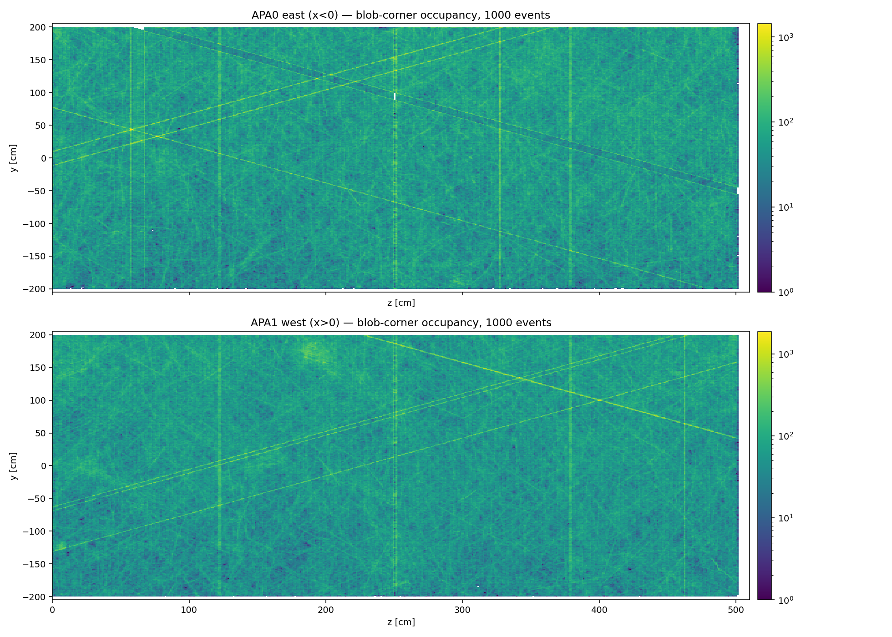

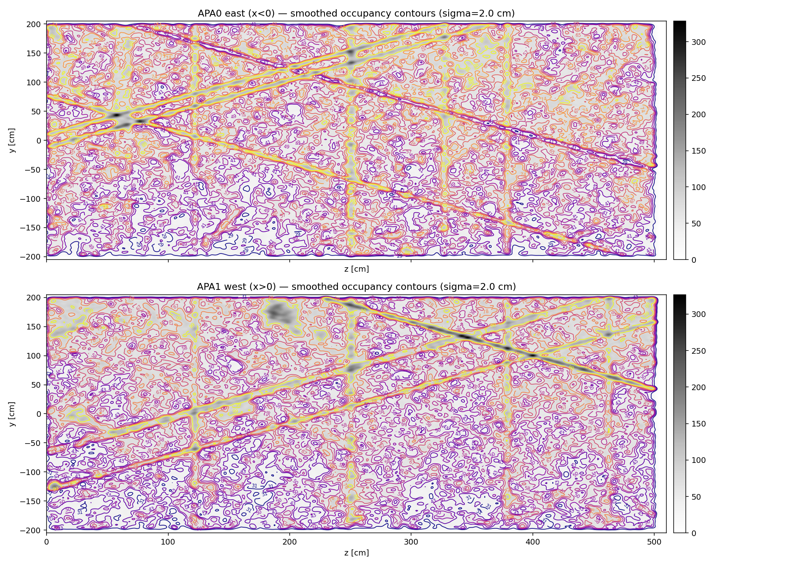

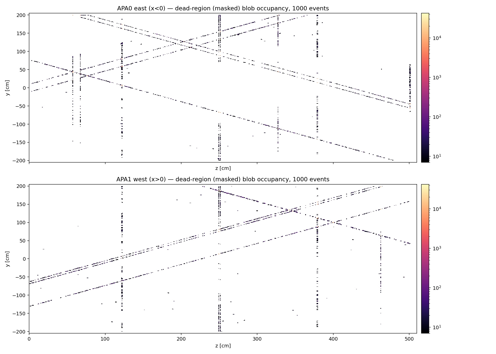

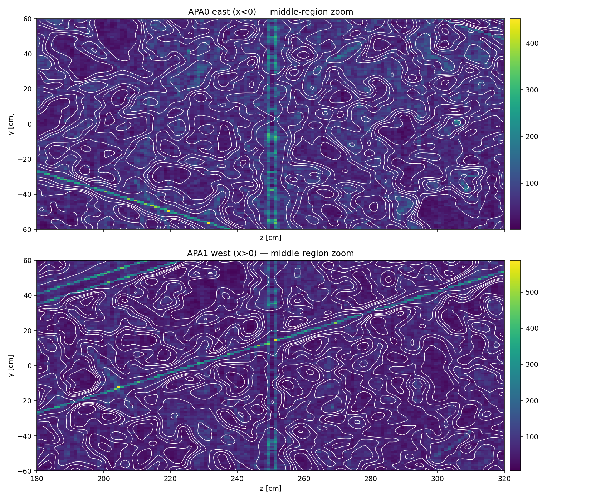

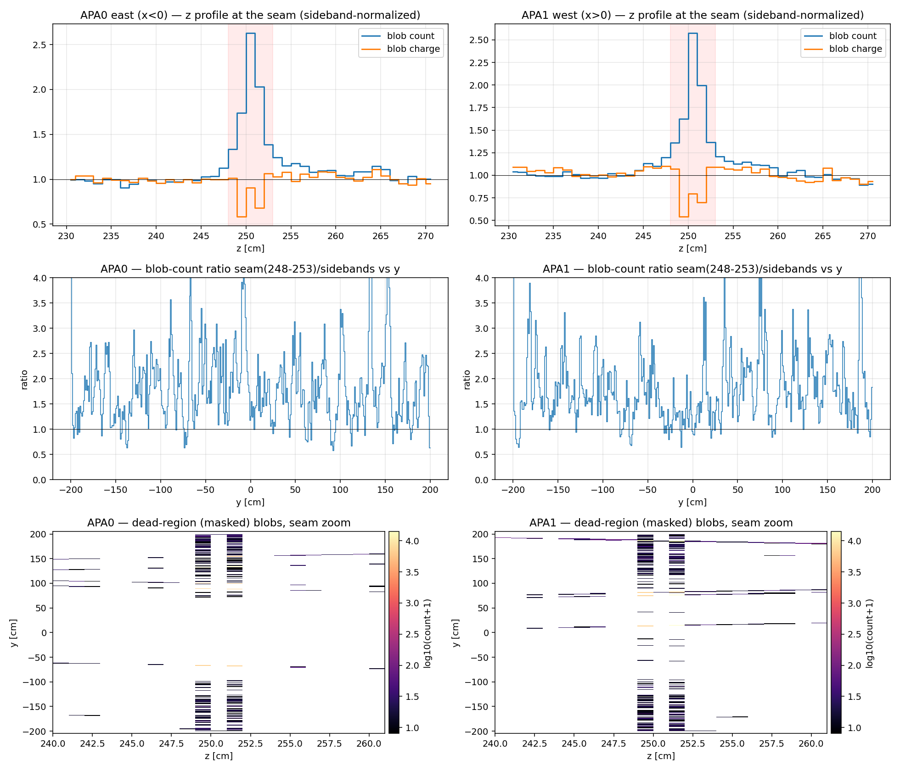

## Findings

**1. The middle-region structure is real and identical on both sides: a
double column of dead collection channels at z ≈ 249.5 and 251.5 cm.**
The dead-region maps show two ~1 cm-wide vertical dead columns separated by
~1 cm of live wires, at the *same z* in APA0 and APA1 — the junction where
the two halves of each anode frame connect.  In the active imaging this
seam band (z 248–253) shows, on **both** sides:

| quantity (seam / sidebands) | APA0 east | APA1 west |
|---|---|---|
| blob count            | ×1.79 (peak bin ×2.6) | ×1.77 (peak bin ×2.6) |
| blob charge           | ×0.84 (dip bins ×0.55–0.75) | ×0.83 (dip ×0.53–0.70) |

i.e. blob multiplicity balloons while net charge *drops* ~16% — the classic
dead-collection signature: imaging falls back to two-view (U,V) blobs over
the dead W wires, inflating occupancy while losing collection charge.  The
seam is therefore not a coverage hole but a ~3 cm-wide *low-charge,
blob-inflated curtain* crossing the full height of both TPCs.

**2. y-structure inside the seam.**  There is no continuous y-gap.  The
blob-count ratio vs y stays ≥ 1 almost everywhere; isolated 2–6 cm spots dip
below ×0.75 (APA0: y ≈ 90–94 cm down to ×0.45, plus y ≈ 62, −72, −136;
APA1: y ≈ −68/−70, −194) — places where masked *induction* channels cross
the seam and even the 2-view fallback degrades.  The dead-map dashing along
the seam is concentrated at |y| ≳ 70 cm (dense runs −200..−96 and 72..200 on
both sides), with the central |y| ≲ 60 cm band comparatively clean.

**3. Two more shared structural columns at z ≈ 122 and 378 cm.**  Both APAs
also show dead columns at z = 120.5–122.5 and 378.5–379.5 cm — exactly
midway between the seam and the detector ends (spacing 128 cm: 122 ↔ 250 ↔
378).  Same-z appearance on *both* independent anodes ⇒ structural (frame
quarter-point supports/combs), not random electronics.  They carry the same
×1.7–1.8 blob-count inflation but little or no net charge loss (charge ratio
×0.96/×1.03 at 122, ×0.89/×1.07 at 378) — narrower dead spans than the seam.

**4. Per-side (electronics) dead columns.**  Only-APA0: z ≈ 57.5–58.5,
67.5, 76.5–77.5, 193.5, 203.5, 211.5–212.5, 221.5, 327.5 (the strongest
single column, 1639× the dead-map median), 500.5–501.5.  Only-APA1:
z ≈ 340.5–342.5, 345.5–347.5, 399.5–400.5, 462.5 (1166×).  Each appears in
the active maps as a bright ×2–3.4 occupancy stripe.

**5. Diagonal dead-induction bands.**  Both sides show dashed diagonal dead
lines (single masked U/V channels).  APA0 additionally has a *broad*
diagonal occupancy-deficit band running from (z ≈ 230, y ≈ 200) down to
(z ≈ 505, y ≈ −55) — a contiguous block of dead induction channels wide
enough to suppress three-view blob formation along its whole length.  APA1
has a prominent double-parallel bright line (lower-left to upper-right) and
a mild broad excess patch around (z ≈ 190, y ≈ 170).

**6. Edges and artifacts.**  Coverage ends at z ≈ 501 cm (last bins empty —
active-volume edge).  The fine sawtooth comb in the 1D y-profile is a
fill artifact of the discrete blob-corner lattice (wire-crossing positions),
not detector structure; it is absent from the blob-center fill at the same
scale.  The overall y-trend (occupancy rising toward y = +200) is the cosmic
illumination, not efficiency.

## Round 2 — blob-interior density: is there dead volume beyond the declared dead area?

Owner follow-up: the corner fill is biased exactly where the question lives —
blobs *end* at the dead-channel boundary, so their corners pile up there and
can hide (or fake) density structure.  Round 2 rasterizes every blob's convex
(y, z) polygon instead: each 1 cm bin whose center lies inside the polygon
gets +1 (`cover`), blob charge is spread uniformly over its covered bins
(`qspread`), and the masked graph gets the same interior fill (`deadcover`
= footprint of the declared ≥2-plane dead volume).  Charge is conserved by
construction (checked: raster sum = Σval to 4 digits).

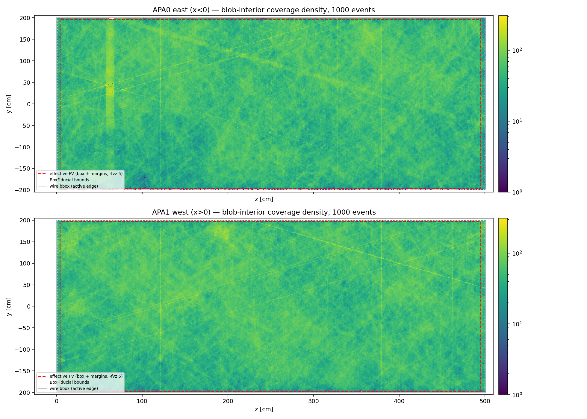

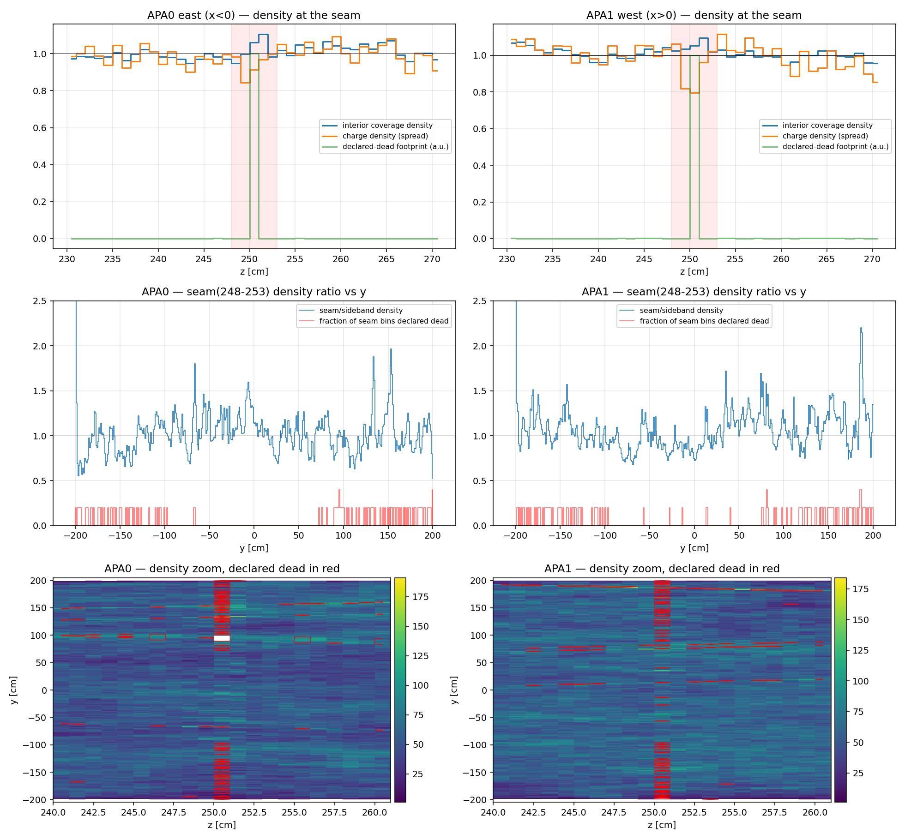

**Answer: no additional dead-volume structure in the middle region.**
With unbiased area sampling the seam band (z 248–253, |y| ≤ 199) has
coverage density **×1.016 (APA0) / ×1.041 (APA1)** of the sidebands — the
round-1 ×1.8 "excess" was pure corner pile-up, and there is no deficit
either: the two-view blobs formed over the dead collection columns fully
tile the seam (slightly over-covering, since 2-view blobs are fatter than
the true activity).  Band-integrated charge density is ×0.95/×0.94, the
loss localized to the two 1 cm dead-W columns (per-bin dips to ×0.79–0.84).

Census of genuinely low-density seam bins (density < 0.25× the sideband
y-expectation):

| | low bins | of which declared dead | zero-coverage bins | all declared? |
|---|---|---|---|---|
| APA0 east | 14 | 13 | 10 (z 249.5–251.5, y 90–98) | yes — all 10 |
| APA1 west | 1 | 1 | 1 (y ≈ −198) | yes |

The only real hole is the APA0 patch at (z 249.5–251.5, y 90–98 cm) — and it
sits entirely inside the `deadcover` footprint, i.e. it is exactly the
expected ≥2-plane dead volume where the seam's dead collection columns cross
declared-dead induction channels (the white patch bordered red in the
`yz-seam-density.png` zoom).  The single undeclared low bin (APA0 z 250.5,
y −190.5, ×0.24) is one isolated bin at the edge of the dense declared-dead
dashing near the bottom corner — statistics, not structure.

Note the inversion between the fills: regions that are *bright* in the
corner/count maps (dead-channel columns and the APA0 broad diagonal band)
become *flat or slightly bright* in interior density — dead-plane areas are
covered by inflated 2-view blobs, so they cost charge accuracy and blob
quality, not geometric coverage.

## Round 3 — overlay density with the dead footprint; what is left low?

Owner follow-up: overlay the two sets of information and inspect the
*remaining* pieces — low-density regions that the dead blobs (2-plane dead)
cannot explain — and do the middle region over the **entire Y range,
top vs bottom**.  Run with

```bash
python3 yz_coverage.py plot   --hist pics/yz_coverage/yz-hist-mcp1000-v2.npz \
                              --out-dir pics/yz_coverage
python3 yz_coverage.py census --hist pics/yz_coverage/yz-hist-mcp1000-v2.npz
```

**"Declared dead" is thresholded, not boolean-ever.**  Summed over 1000
events the masked-graph footprint is sharply bimodal: a bin is either hit by
a dead blob in essentially *every* event (`deadcover` ≈ 7000 = 7 slices ×
1000 events) or in a handful (≤ 35).  Counting "dead blob ever seen here" as
explained would let a single-event dead blob mask a real hole — the wrong
direction for a hunt like this.  A bin is therefore called **persistent
2-plane dead** only when a dead blob sits there in ≥ 50% of events:
77 bins on APA0, 22 on APA1.  Transient dead blobs are drawn separately
(thin white) so nothing is hidden.

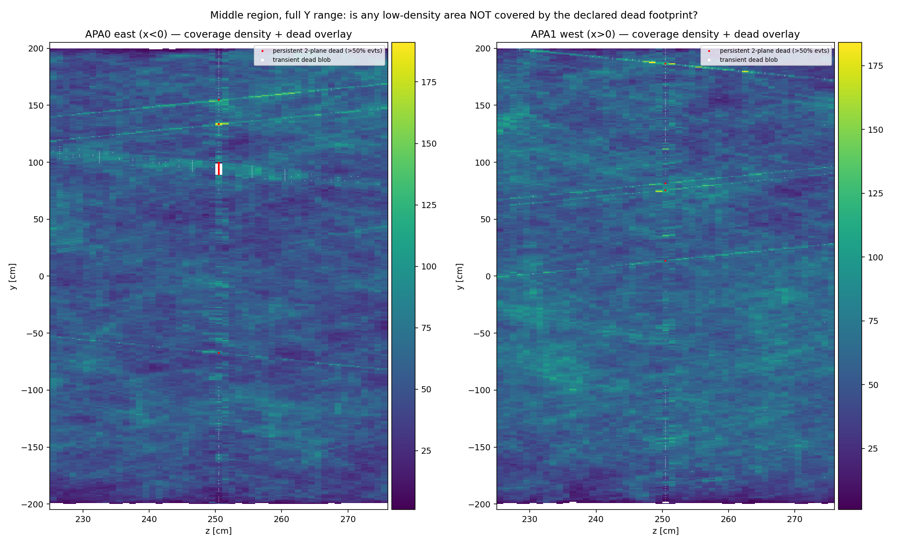

**The cosmic-texture floor must be measured before any deficit is claimed.**
The density map is dominated by individual bright cosmic tracks, so bin
counts are *not* Poisson: measured per-bin scatter of density/expectation is
σ = 0.246 (APA0) / 0.230 (APA1) against a Poisson expectation of 0.141 /
0.137 — over-dispersed by ×1.7.  A naive Poisson cut (R < 0.7, −3σ) flags
~3100 bins in ~1260 "regions" per side; that is track texture, not
structure, and reporting it would have been meaningless.

The discriminator that does work is **coherence across y**: a detector
structure is a *column* — deficient in most y-bands at the same z — while
texture is not.  Splitting the face into 20 y-bands of 20 cm and taking each
band's local z-ratio against its own ±22 cm sidebands gives a texture floor
of 11/20 (APA0) and 10/20 (APA1) deficient bands at the 99th percentile.

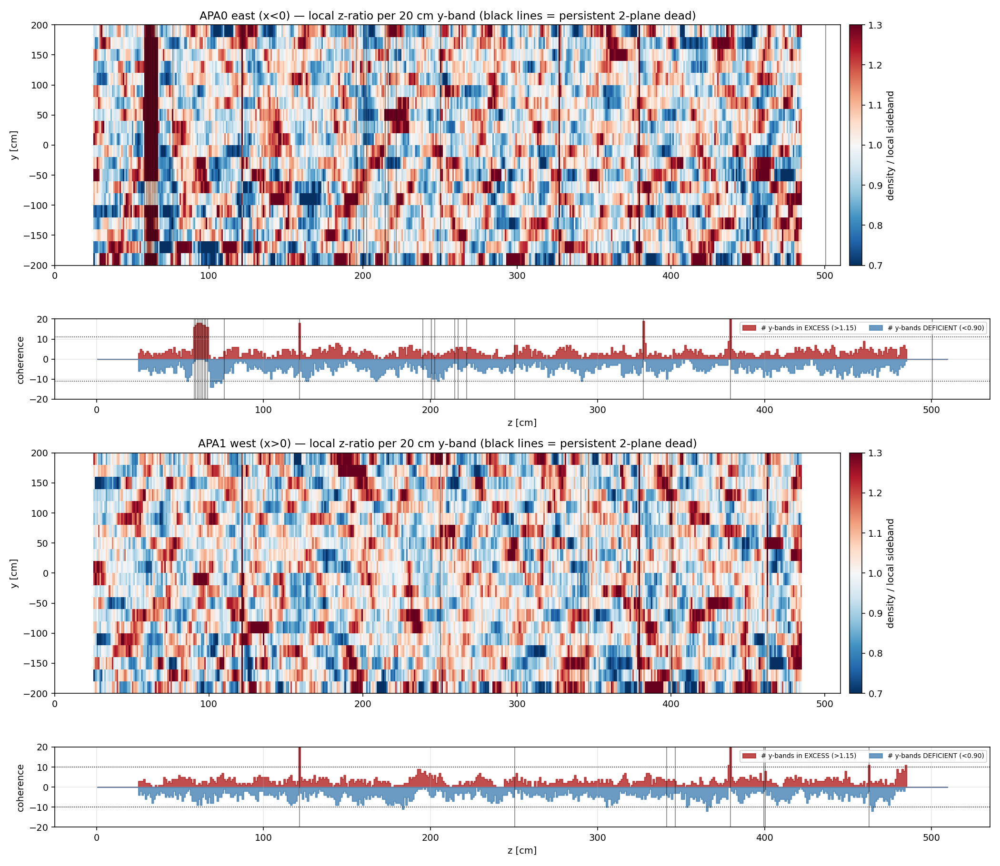

### Middle region, full Y range — no unexplained deficit

Seam band z 248–253, coverage density relative to sidebands:

| | all y | TOP (y > 0) | BOTTOM (y < 0) |
|---|---|---|---|
| APA0 east | 1.020 | 1.002 | 1.040 |
| APA1 west | 1.039 | 1.102 | 0.981 |

Per 40 cm y-slice the ratio wanders between 0.86 and 1.23 on both sides with
no systematic trend — that spread is the texture floor, and top and bottom
are statistically indistinguishable.  **There is no y-region of the seam,
top or bottom, where coverage is suppressed.**  Zero-coverage bins in the
seam over the full y range: 10 on APA0, **all 10 inside the persistent dead
footprint** (z 250.5, y 90–98); 1 on APA1, at y = −198.5, i.e. the last
live bin at the bottom edge, carrying only a transient dead blob — an edge
effect, not a volume.

### The remaining pieces, whole face

Dead-plane columns show up as coherent **excess**, never deficit — the
2-view blobs formed over a dead collection plane over-tile the region:

| side | z [cm] | y-bands in excess | mean ratio |
|---|---|---|---|
| APA0 | 379.5 / 327.5 / 121.5 | 20/20, 19/20, 18/20 | 1.44 / 1.38 / 1.44 |
| APA0 | 59.5–66.5 (dead cluster) | 16–18/20 | 1.45–1.67 |
| APA1 | 121.5 / 379.5 / 462.5 | 20/20, 20/20, 11/20 | 1.49 / 1.58 / 1.24 |

**One coherent deficit survives, and it is not in the middle region:**

| side | z [cm] | y-bands deficient | coverage ratio (all y / top / bottom) | charge ratio | persistent-dead bins inside |
|---|---|---|---|---|---|
| **APA0** | **68.5–74.5** | **14/20** (floor 11) | **0.812 / 0.848 / 0.762** | 0.919 | **0** |

A ~7 cm-wide column running the full height of the east TPC with ~19% less
coverage than its surroundings, containing no declared 2-plane dead volume.
It sits immediately downstream of APA0's largest dead-channel cluster
(z ≈ 57–67, the +60% excess above), i.e. the two are almost certainly the
same electronics problem seen from both sides — but the deficit itself is
*not* accounted for by any dead blob and is the one place in either TPC
where imaging genuinely loses coverage.

Marginal candidates sitting essentially at the texture floor, listed for
completeness and **not** claimed as structure: APA1 z 464–466 (0.939, 12/20,
adjacent to the dead column at 462.5), APA1 z 365–367 (0.926, 12/20),
APA0 z 125–127 (0.930, 11/20, adjacent to the dead column at 121.5).

### What this does and does not say

The overlay classifies a deficit as "explained" only if it coincides with
the persistent 2-plane dead footprint — nothing else is subtracted.  A
region with a *single* dead plane produces no dead blob and would therefore
appear here as "unexplained"; that is the most likely reading of the APA0
z 68–75 column, and it is a prose explanation, not part of the
classification.  Confirming it needs the per-plane channel-status list,
which this analysis does not use.

## Round 4 — are the FV faces consistent with where coverage actually ends?

Owner follow-up: draw the four Y-Z fiducial boundaries on the round-2
density map and zoom each edge, to check the FV in the code against the
measured point density.

**FV geometry, read from `cfg/pgrapher/experiment/sbnd/clus.jsonnet`**
(three nested levels, all drawn):

| level | source | y [cm] | z [cm] |
|---|---|---|---|
| wire bbox (physical active edge) | comments at `overall.FV_*` | ±200.312 | −0.15 … 501.15 |
| `sbnd_pr_fv` BoxFiducial bounds | bbox inset 1 cm | ±199.312 | 0.85 … 500.15 |
| **effective FV** (box + `sbnd_pr_fv_margins`) | y ±2.5, z_min +3, z_max −`tgm_fv_zmax_margin` | **±196.812** | **3.85 … 495.15** |

The effective z_max uses the production `-fvz 5`; the doc-35 interior face
(`-fvzi 3`) sits at 497.15 and is drawn separately in the z_max panel.


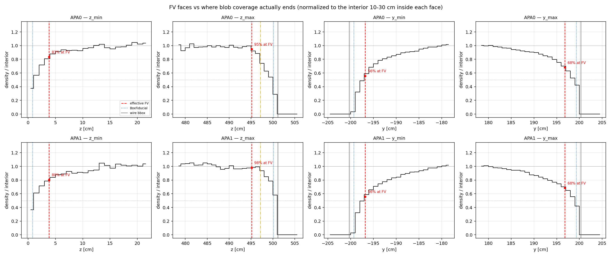

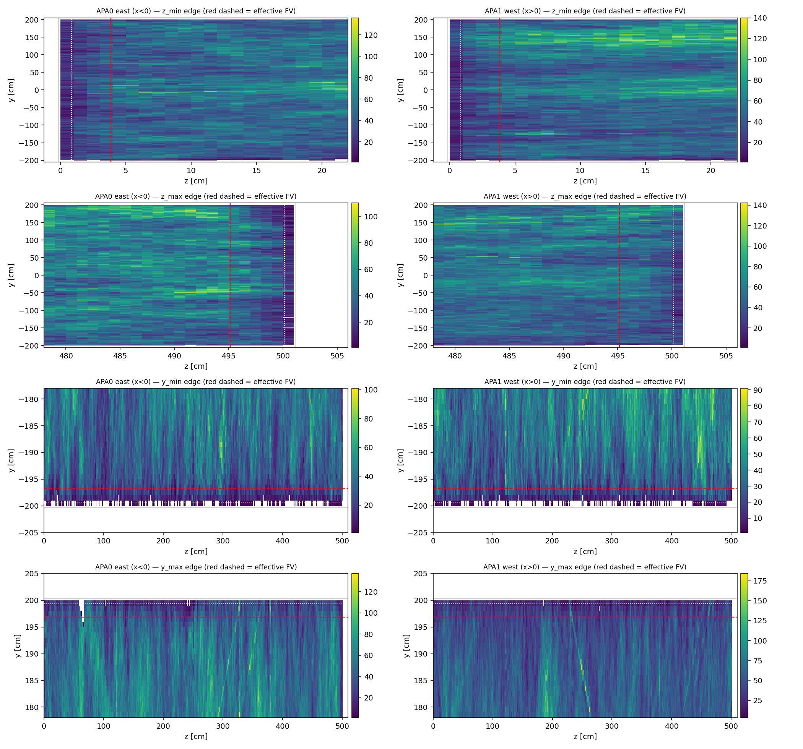

### Result: every FV face sits inside live, fully-reconstructing volume

Each face is normalized to its own interior reference 10–30 cm inside (a
global plateau is meaningless — the cosmic illumination rises ~40% from
bottom to top).  Three independent measures at the FV face:

| face | effective FV | blob **area** @FV | blob **count** @FV | **charge** @FV | last live bin | FV → last live |
|---|---|---|---|---|---|---|
| z_min | 3.85 | 0.83 / 0.80 | 1.07 / 1.07 | 1.13 / 1.05 | ≤ 0.5 | ≥ 3.4 cm |
| z_max | 495.15 | 0.95 / 0.98 | 1.06 / 1.04 | 0.98 / 1.07 | 500.5 | 5.4 cm |
| y_min | −196.812 | 0.56 / 0.56 | 0.92 / 0.94 | 0.90 / 0.91 | −199.5 | 2.7 cm |
| y_max | +196.812 | 0.68 / 0.68 | 0.98 / 0.94 | 0.97 / 1.02 | +199.5 | 2.7 cm |

(values APA0 / APA1)

**The y-face area dip is blob geometry, not lost coverage.**  Taken alone,
the area-density curve at the y faces (0.56 / 0.68) looks like the FV cuts
into a half-dead region.  It does not: blob **count** and **charge** are
90–102% of interior at the same y.  What shrinks is the size of each blob —
mean covered area falls from ~5.0 bins in the interior to 2.8 at y = +198
and 1.8 at y = −198, because the three-plane wire overlap narrows toward the
top and bottom of the frame.  Tracks there are still found, with full
charge; their blobs are simply thinner.  Reading the area map alone would
have produced the wrong conclusion.

**Consistency verdict, face by face:**

- **z_max (495.15)** — best matched and most conservative.  Area density is
  flat at ~1.0 all the way to the face (0.95/0.98 *at* the cut), then rolls
  off, reaching zero at 501.2 = the wire bbox.  5.4 cm of live margin, a
  consequence of the doc-32 widening; the doc-35 interior face at 497.15
  sits at ~85% area with full count.
- **z_min (3.85)** — 0.83/0.80 area, count and charge slightly *above*
  interior.  Coverage continues to the wire bbox; 3.4 cm of live margin
  (the measured "last live" is limited by the histogram starting at z = 0,
  not by the detector, so the true margin to the bbox is 4.0 cm).
- **y_min / y_max (±196.812)** — 2.7 cm of live margin on each side, with
  full reconstruction efficiency at the cut.  Symmetric in the code, and
  the detector is symmetric in *efficiency*; only blob width is mildly
  asymmetric (1.8 vs 2.8 bins at |y| = 198), which does not justify moving
  either face.

**No FV face is placed outside the active volume, and none cuts into a
region that is already dead** — the current Y-Z fiducial boundaries are
consistent with the measured coverage, with 2.7–5.4 cm of live margin
everywhere.  The one place where an FV face abuts a genuinely dead region is
the APA0 y_max edge at z ≈ 65–70 cm, the top end of the east dead-channel
cluster from round 3 (visible as the notch in the y_max zoom).

## Interpretation / follow-ups

- The user-suspected "local structure in the middle region" is confirmed and
  fully characterized: the frame-junction seam is a 2-column dead-W band at
  z ≈ 249.5/251.5 cm on both drift sides, reconstructed as inflated 2-view
  blobs with ~16% net charge deficit, plus isolated true holes where masked
  induction channels cross it.
- Downstream consumers see the seam as a thin low-charge curtain, the same
  topology class the W-keyed dead-gap column registry
  (`docs/…dead-gap` knob, default OFF) was built for; z ≈ 250 (and the
  quarter-point columns at 122/378) are natural entries if that knob is ever
  enabled for trajectory/containment logic.
- The APA0 broad diagonal dead-induction band is prominent in the raw
  corner/count maps and worth remembering when hand-scanning east-side
  events with apparently broken tracks between z ≈ 230–505 cm — though
  round 3 shows it does not cost geometric *coverage*.
- **The only genuinely under-covered region in either TPC is APA0
  z ≈ 68–75 cm** (~19% low, full height, no declared dead volume inside).
  Everything else that looks structural in the raw maps is either a
  dead-plane column — which *over*-covers via 2-view blobs — or cosmic-track
  texture.  Worth a per-plane channel-status check on the east APA around
  z ≈ 57–77 cm.

## Caveats

- Occupancy is cosmic-weighted, not an efficiency map; only *relative* local
  structure (stripes, bands, holes) is meaningful.
- Round-1 blob footprints are filled at corners/centers, not rasterized
  polygons; sub-cm effects near hole edges are smeared by the ~cm blob size.
  Rounds 2–4 use the rasterized interior instead.
- The z histogram starts at z = 0 while the wire bbox reaches −0.15 cm, so
  the very first bin is slightly clipped and the measured "last live bin" at
  the z_min face is a histogram limit, not a detector limit.
- Blob-**area** density and blob-**count** density answer different
  questions.  Area is the right measure for "is this volume covered"; count
  and charge are the right measures for "is reconstruction working here".
  They diverge near the y faces (round 4) and near dead-plane columns
  (round 2) — always check both before calling a dip a coverage loss.
- The masked-graph "dead" maps show where dead-region *blobs* form (masked
  channels crossing in ≥2 planes), so the y-dashing along a dead-W column
  marks crossings with masked induction channels — it does not mean the W
  channel is alive in between.
