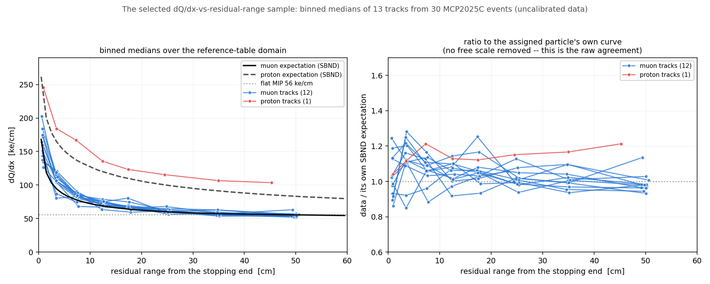
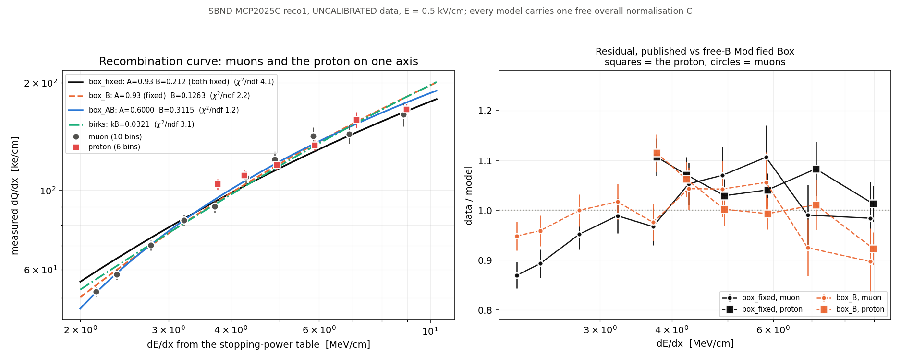
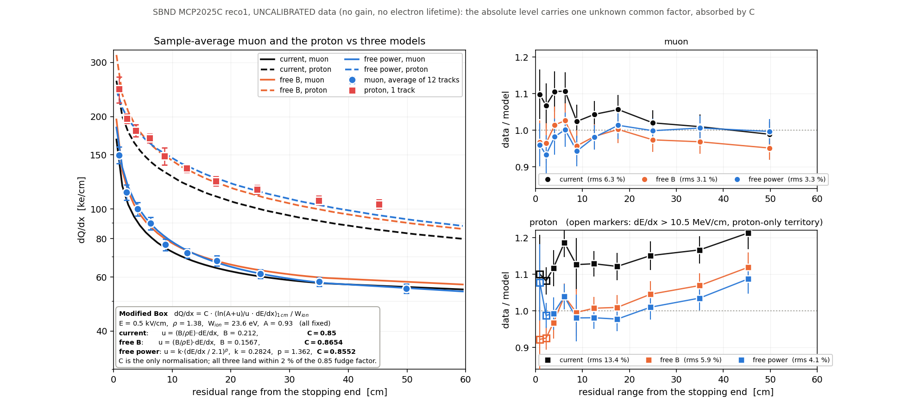
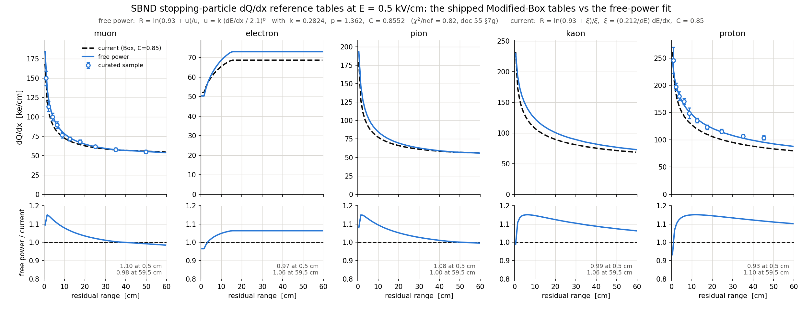
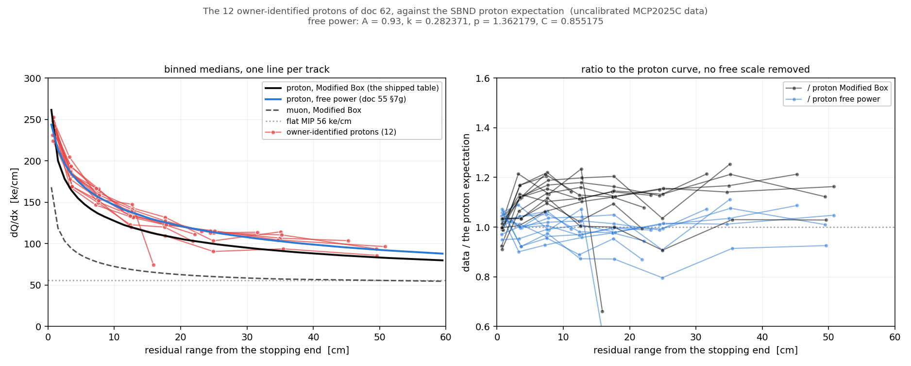
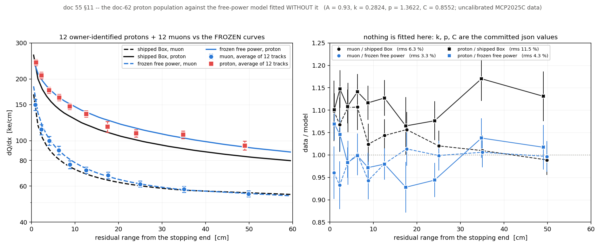
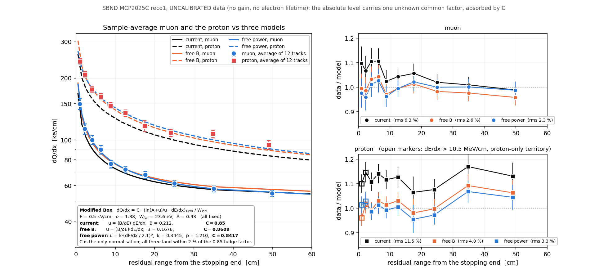

# 55 — dQ/dx vs residual range for three hand-scanned bundles, against the SBND
per-particle expectation

Three bundles picked out of the `d55ton` hand scan — one flagged in the scan as
*"proton from outside (check with prediction)"* and two believed to be muons —
put on the SBND dQ/dx reference curves of [48](48_sbnd-dqdx-tables-and-mip.md).

**Result:** the flagged bundle sits on the **proton** curve and is a factor
**1.9** above the **muon** curve; both believed muons sit on the muon curve to
**±2 %**. The separation is measured *relative to muons in the same
uncalibrated sample*, so the missing gain/lifetime calibration cancels — this is
not an absolute-scale claim. The STM tagger nonetheless accepted all three,
because on the `flag_strong_check = false` path nothing gates on `ratio1` (§5).

**§§6–8 extend this to all 30 events and revise the proton reading.** The curated
sample is 12 muon-like tracks and 1 proton-like track
([`../dqdx_rr_sample/`](../dqdx_rr_sample/)). Moved into the dE/dx plane, the
proton agrees with the muons to **1.024 ± 0.07** — its 14 % excess against *its
own table* is the published Modified Box under-predicting the upper half of the
dE/dx range, which it does for muons too. A single shape change (A = 0.93 kept,
**B ≈ 0.13** instead of 0.212 at 0.5 kV/cm) halves the χ² and removes the proton
offset; §7d says why that is a measured direction and not yet a recommendation.

**§10 rebuilds all five expectation curves** — muon, electron, pion, kaon,
proton — under the free-power form of §7g, with the electron held flat into the
stopping end, and writes them into `nusel_display/stm_ref_dqdx.json` alongside
the Modified-Box tables the running config still uses.

**§11 closes §9 item 3 with a proton *population*:** the 12 usable protons the
owner hand-identified in [62](62_stm-baseline-and-protons.md), 59 points above
10.5 MeV/cm where the original sample had 5. Identified by eye and so
independent of their charge, they land at **k_muon = 1.69–1.93** — and the §7g
free-power model, **fitted without any of them**, describes them to **median
0.991, rms 4.3 %**, where the shipped Modified-Box proton table reads
**1.122 / 11.5 %**.
§7g.6's leftover 9 % particle-dependent offset does not survive: proton/muon at
matched dE/dx is **1.012** over 7 bins. §§6–10 and their figures are the record
of the 12-muon/1-proton sample and are left as written; §11 has its own files.

**§12 re-fits the three bundles under the 4.0 / 8.8 diffusion revert** of
[66](66_diffusion-revert-validation.md) (2026-07-27). The trajectory, `npts` and
median `dx` are identical to the digit; the proton candidate holds at **1.91×**
the muon curve and the two muons at 0.98 / 1.04, so every reading above stands.
`reduced_chi2` moves in both directions, so these three do not favour either
diffusion pair.

*(Doc number: 54 is taken by the in-flight TGM/STM perf campaign,
`run_perf54_nusel.sh`.)*

---

## Repro

```bash
cd /nfs/data/1/xqian/toolkit-dev/wcp-porting-img/sbnd/sbnd_xin
python3 stmfit_particle_overlay.py -o pics/stmfit_dqdx_particle_overlay.png \
  "work-mcp1000b-d55ton:289343:90:evt 289343  grp 5, t=1.363 us, main 9  (proton cand.)" \
  "work-mcp10-d55ton:285999:220:evt 285999  grp 12, t=0.705 us, main 22  (muon)" \
  "work-mcp10-d55ton:286065:30:evt 286065  grp 8, t=1.260 us, main 3  (muon)"

# the doc-42 muon re-read against the SBND table (section 4a):
python3 stmfit_particle_overlay.py \
  "archive/stm-docs40-49/work-mcp10-stmon:286241:80:evt 286241 (doc 42 muon)"

# and the proof that doc 42's table was against the uBooNE curves (section 4a):
git show 6099ed0:sbnd/sbnd_xin/nusel_display/stm_ref_dqdx.json > /tmp/ref_ub.json
python3 stmfit_particle_overlay.py --ref /tmp/ref_ub.json --mip 50000 \
  "archive/stm-docs40-49/work-mcp10-stmon:286241:80:doc42 muon"

# section 10 -- the five free-power tables and the json they are written into:
python3 dqdx_rr_sample/make_ref_tables.py --dry-run          # print, write nothing
python3 dqdx_rr_sample/make_ref_tables.py \
    --json nusel_display/stm_ref_dqdx.json \
    -o dqdx_rr_sample/ref_tables_free_power.png

# section 11 -- the doc-62 proton population.  Nothing is re-run; every
# tracking-stm.root already exists in work-mcp1kall-d59k.
python3 dqdx_rr_sample/collect_proton_sample.py --verbose \
    --merge dqdx_rr_sample/sample_points_p12.tsv \
    --plot  dqdx_rr_sample/proton_sample_p12.png
python3 dqdx_rr_sample/proton_model_check.py \
    --points dqdx_rr_sample/sample_points_p12.tsv \
    -o dqdx_rr_sample/proton_vs_frozen_model_p12.png
python3 dqdx_rr_sample/fit_recombination.py \
    --points dqdx_rr_sample/sample_points_p12.tsv --plane rr --zoo
python3 dqdx_rr_sample/plot_muon_proton_models.py \
    --points dqdx_rr_sample/sample_points_p12.tsv \
    -o dqdx_rr_sample/muon_proton_vs_models_p12.png
```

Nothing was re-run. All four `tracking-stm.root` files already existed; the
`d55ton` arm is the one the live scan viewer on :5011 serves, which is where the
three bundles were flagged.

`stmfit_particle_overlay.py` is **new**. `stmfit_showcase.py` keeps its
hard-coded muon-only reference and flat-50 line — doc 42's Repro block cites it
with specific arguments and those are part of that record; the one change §10
had to make to it is that its reference key is now pinned to `MuonDeDxBox`, so
that it goes on reading the same curve it always did after the json grew a
second set (§10.4). Its numbers are unchanged.

---

## 0. The three bundles

Block id in `T_rec_charge` is `cluster_id * 10 + pass`, and `cluster_id` is the
bundle's `main_id` in `nusel_evt<ID>/nusel-evt<ID>.tsv` — the same number the
scan viewer prints as "main N". Every row below was read back from that tsv, so
the viewer string the bundles were flagged by is tied to the block that was
plotted:

| viewer string | work root | main_id | block | in_beam | STM | label |
|---|---|---:|---:|---:|---:|---|
| `grp 5 t=1.363 us main 9` | `work-mcp1000b-d55ton` | 9 | 90 | 1 | 1 | STM |
| `grp 12 t=0.705 us main 22 + companions 8` | `work-mcp10-d55ton` | 22 | 220 | 1 | 1 | STM |
| `grp 8 t=1.260 us main 3 + companions 2` | `work-mcp10-d55ton` | 3 | 30 | 1 | 1 | STM |

All three are the in-beam bundle of their event and all three carry the STM
(stopping-muon) tag. Fit geometry, from the fitted trajectory itself
(`rr = 0` is the candidate stopping end; the pass runs from the detector-boundary
end inward, doc 42 §2):

| event | fit L (cm) | boundary end (x, y, z) cm | stopping end (x, y, z) cm | median dx | median χ²/ndf |
|---|---:|---|---|---:|---:|
| 289343 m9 | 50.6 | (−29.2, **199.4**, 265.0) | (−6.3, 179.5, 304.7) | 0.667 | 1.20 |
| 285999 m22 | 26.5 | (**−200.3**, 92.2, 302.3) | (−179.8, 79.7, 312.3) | 0.643 | 1.36 |
| 286065 m3 | 249.5 | (−165.7, **199.5**, 350.5) | (−132.9, −10.5, 455.8) | 0.626 | 1.79 |

Bold = the coordinate that is at a detector face (`FV_ymax = 199.312`,
`FV_xmin = −201.05`, `cfg/pgrapher/experiment/sbnd/clus.jsonnet:82-87`). So
289343 m9 does enter from outside through the **top** face and stop 50 cm later
near the cathode — "proton from outside" is geometrically consistent. 286065 m3
enters through the top too; 285999 m22 enters at the TPC0 anode face.

**The three `median dx` values agree to 6 %.** That matters: a dQ/dx excess can
always be faked by an underestimated path length, and 289343 m9's sampling
pitch is not anomalous, so its excess is in `dQ`, not in `dx`.

---

## 1. The reference

`nusel_display/stm_ref_dqdx.json`, the dump of the compiled config's
`LinterpFunction` tables — i.e. the exact curves `eval_stm` compares against.
It carries **two** particles, `MuonDeDx` and `ProtonDeDx`, both on
`start = 0.5`, `step = 1`, 60 entries, so the domain is **rr = 0.5 – 59.5 cm**.
Those are the SBND versions (Modified Box at 0.5 kV/cm × 0.85, doc 48 §1), not
the shipped MicroBooNE ones — the file was regenerated in commit `0462fb2`.

Nothing was synthesized to widen "various particles" beyond what that file
holds. Pion/kaon/electron curves do exist in
`sbnd/particle_dataset.jsonnet`, but pulling them from a second source for a
proton-vs-muon question would put two provenances in one figure for no gain.
Extending the json is listed in §9 item 6.

The third line on the plot is the flat **56 ke/cm** MIP reference — SBND's
`mip_dqdx` (doc 48 §6, `sbnd/clus.jsonnet:513`), which is what
`eval_stm_core`'s `ref_flat` not-stopping hypothesis uses and what the `d55ton`
runs were configured with. It is **not** the uBooNE 50 ke/cm that
`stmfit_showcase.py` draws.

Outside 0.5 – 59.5 cm no ratio is quoted. `np.interp` clamps above the last
node, which would silently compare against a flat line and manufacture a
plausible number; those cells read `--` instead. This bites only 286065 m3,
whose fit path runs to 249.5 cm.

---

## 2. The figure


Top: binned medians of all three, on both curves plus the flat MIP line, over
the reference domain. Bottom: every fitted point of each track over its full fit
path.

---

## 3. Numbers

Binned median fitted dQ/dx, with the ratio to each curve. `/MIP` is against the
flat 56 ke/cm.

**289343 main 9** (the flagged bundle) — 77 points, L = 50.6 cm:

| rr bin (cm) | n | fit ke/cm | muon | ratio | proton | ratio | /MIP |
|---|---:|---:|---:|---:|---:|---:|---:|
| 0 – 2 | 4 | 245.8 | 147.5 | 1.67 | 235.9 | **1.04** | 4.39 |
| 2 – 5 | 4 | 184.2 | 95.1 | 1.94 | 165.7 | **1.11** | 3.29 |
| 5 – 10 | 7 | 167.0 | 78.2 | 2.13 | 137.7 | **1.21** | 2.98 |
| 10 – 15 | 8 | 135.6 | 69.0 | 1.97 | 120.2 | **1.13** | 2.42 |
| 15 – 20 | 7 | 123.3 | 64.3 | 1.92 | 109.9 | **1.12** | 2.20 |
| 20 – 30 | 15 | 115.6 | 60.4 | 1.91 | 100.4 | **1.15** | 2.06 |
| 30 – 40 | 16 | 106.6 | 57.4 | 1.86 | 91.4 | **1.17** | 1.90 |
| 40 – 60 | 16 | 103.6 | 56.2 | 1.84 \* | 85.4 | **1.21** \* | 1.85 |

**285999 main 22** — 42 points, L = 26.5 cm:

| rr bin (cm) | n | fit ke/cm | muon | ratio | proton | ratio | /MIP |
|---|---:|---:|---:|---:|---:|---:|---:|
| 0 – 2 | 3 | 164.5 | 160.9 | **1.02** | 252.6 | 0.65 | 2.94 |
| 2 – 5 | 6 | 103.8 | 94.2 | **1.10** | 164.4 | 0.63 | 1.85 |
| 5 – 10 | 8 | 68.1 | 77.1 | **0.88** | 135.7 | 0.50 | 1.22 |
| 10 – 15 | 8 | 67.2 | 69.1 | **0.97** | 120.4 | 0.56 | 1.20 |
| 15 – 20 | 8 | 66.0 | 64.1 | **1.03** | 109.5 | 0.60 | 1.18 |
| 20 – 30 | 9 | 64.5 | 61.0 | **1.06** | 101.8 | 0.63 | 1.15 |

**286065 main 3** — 394 points, L = 249.5 cm:

| rr bin (cm) | n | fit ke/cm | muon | ratio | proton | ratio | /MIP |
|---|---:|---:|---:|---:|---:|---:|---:|
| 0 – 2 | 3 | 159.8 | 154.2 | **1.04** | 244.2 | 0.65 | 2.85 |
| 2 – 5 | 5 | 111.3 | 95.8 | **1.16** | 166.9 | 0.67 | 1.99 |
| 5 – 10 | 7 | 88.4 | 78.4 | **1.13** | 137.9 | 0.64 | 1.58 |
| 10 – 15 | 8 | 63.4 | 69.1 | **0.92** | 120.5 | 0.53 | 1.13 |
| 15 – 20 | 8 | 59.7 | 63.9 | **0.93** | 109.2 | 0.55 | 1.07 |
| 20 – 30 | 16 | 61.4 | 60.3 | **1.02** | 100.0 | 0.61 | 1.10 |
| 30 – 40 | 15 | 56.9 | 57.4 | **0.99** | 91.5 | 0.62 | 1.02 |
| 40 – 60 | 33 | 51.9 | 55.7 | **0.93** \* | 83.3 | 0.62 \* | 0.93 |
| 60 – 100 | 62 | 50.4 | — | — | — | — | 0.90 |
| > 100 | 237 | 49.3 | — | — | — | — | 0.88 |

\* bin extends past the 59.5 cm reference domain; the ratio uses only the
in-domain part.

Summary — the median **point-by-point** ratio over the reference domain, which is
the quantity that can be compared *between* tracks:

| track | n pts in domain | fit / muon | fit / proton |
|---|---:|---|---|
| 289343 m9 (flagged) | 76 | **1.91**  [1.79 – 1.98] | **1.14**  [1.09 – 1.23] |
| 285999 m22 | 41 | **0.99**  [0.89 – 1.18] | 0.58  [0.51 – 0.69] |
| 286065 m3 | 93 | **0.98**  [0.86 – 1.16] | 0.60  [0.53 – 0.73] |
| 286241 c8 (doc 42, §4a) | 94 | **0.99**  [0.90 – 1.12] | 0.62  [0.54 – 0.70] |

Brackets are the 16–84 % spread of the per-point ratio, i.e. point scatter, not
an uncertainty on the median.

---

## 4. Reading

**The prediction check the scan asked for comes out proton.** 289343 m9 is at
1.14 of the proton curve and 1.91 of the muon curve. The two believed muons —
and doc 42's independent third muon — are at 0.98–0.99 of the muon curve and
0.58–0.62 of the proton curve. Every track lands within 14 % of one curve and is
off the other by 1.6–1.9×; the three groups do not overlap.

**Why the missing calibration does not undo this.** MCP2025C reco1 is *data*
with no gain and no electron-lifetime correction applied anywhere downstream of
the fit (doc 42 §0; the lifetime correction is not even ported, doc 48 §8 item
3), so no absolute dQ/dx here is trustworthy on its own. But the three muons
*measure* that residual offset: it is 0.98–0.99 against the SBND muon table,
i.e. ≲ 2 %. Whatever multiplicative miscalibration is left is therefore small,
and 289343 m9's 1.91 against the same table in the same sample cannot be
absorbed into it. **The argument is a ratio of ratios and the calibration
cancels; it does not depend on the absolute scale being right.**

**Shape alone would have been weaker.** 289343 m9's Bragg contrast —
peak(0–2 cm) / plateau(40–60 cm) = 245.8 / 103.6 = **2.37** — sits *below* both
the muon table's 2.62 and the proton table's 2.76 over the same span, on 4
points in the leading bin. Read as contrast this track is not clearly either.
What separates it is that its dQ/dx is high **at every residual range**, which
is what a heavier particle of the same range does, and the level is calibrated
by the control muons. The rr-dependence still matters — it is what makes the
proton ratio flat (1.04–1.21) rather than trending — but the discriminating
number is the level relative to the muon controls.

**This does not identify the particle from truth.** MCP2025C carries no
`simb::`/`sim::` products (doc 42 §0), so there is no truth to check against;
the statement is "consistent with the proton hypothesis and inconsistent with
the muon hypothesis, given these tables", not "is a proton". A proton–muon
degeneracy could still be broken the wrong way by a defect common to the
reference pair, e.g. the undocumented ×0.85 (doc 48 §8 item 2) — though that is
a flat factor and so cancels in the muon-controlled comparison too.

### 4a. Doc 42's "normalization high by 10–25 %" was against the uBooNE table

Doc 42 §4 measured evt 286241 c8 at 1.07–1.31 of expectation and read it as an
uncalibrated-data offset. That comparison used `stm_ref_dqdx.json` **as it stood
at commit `6099ed0`, which held the MicroBooNE curves** (`MuonDeDx[0] = 123417`);
doc 48's `0462fb2` replaced them with the SBND ones (`MuonDeDx[0] = 168151`,
+12 % at plateau to +36 % at the peak). Re-read against the SBND table, that same
fit gives **0.99** — the row in §3's summary table.

**This is proven, not inferred from commit dates.** Feeding the `6099ed0`
version of the json back in reproduces doc 42 §4's table *cell for cell* —
every fitted value, every expectation, every ratio:

| rr bin | doc 42 fit / exp / ratio | reproduced with the `6099ed0` json |
|---|---|---|
| 0 – 2 | 151.5 / 115.8 / 1.31 | 151.5 / 115.8 / 1.31 |
| 2 – 5 | 95.6 / 77.4 / 1.24 | 95.6 / 77.4 / 1.24 |
| 5 – 10 | 74.7 / 65.7 / 1.14 | 74.7 / 65.7 / 1.14 |
| 10 – 15 | 74.3 / 59.3 / 1.25 | 74.3 / 59.3 / 1.25 |
| 15 – 20 | 67.3 / 55.8 / 1.21 | 67.3 / 55.8 / 1.21 |
| 20 – 30 | 56.5 / 52.9 / 1.07 | 56.5 / 52.9 / 1.07 |
| 30 – 40 | 57.5 / 50.8 / 1.13 | 57.5 / 50.8 / 1.13 |
| 40 – 60 | 54.9 / 49.7 / 1.10 | 54.9 / 49.7 / 1.10 |
| 60 – 100 | 57.1 / — | 57.1 / — |
| > 100 | 52.9 / — | 52.9 / — |

The `expected` column is the fingerprint: doc 42's 20–30 cm expectation is
**52.9** ke/cm, which is the uBooNE table there; the SBND table gives **60.4**
(§3, 289343's 20–30 row). Median fit/muon over the domain is **1.14** against
the uBooNE json and **0.99** against the SBND one — the ratio 1.15 is the table
ratio over these residual ranges. `git log 0462fb2..HEAD` also shows doc 42
untouched since the swap, so its §4 could not have been rewritten against the
new tables. The cell-for-cell match doubles as a check of this doc's own decode
against a committed independent record.

So the ~15 % excess doc 42 reported was, to within its own precision, **the
field difference between 0.273 and 0.5 kV/cm**, not a calibration offset. Two
consequences worth recording:

- Doc 42 §4's reading ("normalization is high by ~10–25 %") should be read as
  *against the uBooNE reference*. It is not evidence of a residual SBND
  calibration offset. Doc 42 is left as written; this is the correction.
- Doc 48 §4's framing — the tables are "physically right and calibration-wise
  premature", with the 30-event scan showing STM tags lost because the reference
  moved ~12 % while the data did not — now has four SBND muons landing at
  0.98–0.99 against the new tables. That is evidence *for* the new tables and
  **against** there being a large uncorrected charge offset in this sample. It
  does not settle doc 48 §4 (which is retracted as noise-floor-limited anyway,
  and covers four different events).

---

## 5. What the STM evaluator itself did

`T_stm_eval`, the per-trial dump `save_stm_fit` writes, on the accepted trial of
each bundle:

| track | strong | verdict | ks1 | ks2 | ratio1 | ratio2 | 1 / ratio1 |
|---|---:|---:|---:|---:|---:|---:|---:|
| 289343 m9 | 0 | 1 | 0.0084 | 0.1061 | **0.5204** | 0.4015 | **1.922** |
| 285999 m22 | 0 | 1 | 0.0189 | 0.1177 | 0.9658 | 0.7034 | 1.035 |
| 286065 m3 | 0 | 1 | 0.0218 | 0.1172 | 0.9916 | 0.7707 | 1.008 |

`ratio1 = Σ ref_muon / Σ data` (`TaggerCheckSTM.cxx:1652`), so `1/ratio1` is the
tagger's own data-over-muon-reference number, computed inside the tagger from its
own sampling. It reproduces §3's independent decode — **1.922 vs 1.91** on the
flagged track, 1.035 / 1.008 vs 0.99 / 0.98 on the muons. That is a cross-check
of the whole `q → dQ → dQ/dx` decode of `stmfit_particle_overlay.py`, not just of
the conclusion.

**All three were accepted, and on this path `ratio1` is not consulted.** With
`flag_strong_check = false`, `eval_stm_core` accepts at
`TaggerCheckSTM.cxx:1694`: `ks1 - ks2 < -0.02 && ((ks2 > 0.09 && |ratio2-1| >
0.1) || ratio2 > 1.5 || ks2 > 0.2)`. For 289343 m9 that is
−0.0977 < −0.02 and ks2 = 0.106 > 0.09 and |0.4015−1| = 0.60 > 0.1 → accept.
`ks1` is *area-normalized* (`util/src/KSTest.cxx:216-238`, doc 48 §3 reading 3),
so a track whose charge is uniformly 1.9× the muon reference still gets a
small `ks1` — the shape matches, only the scale does not, and the scale
information lives entirely in `ratio1`. The strong branch at `:1699` **does**
gate on `fabs(ratio1-1) < 0.1`: 289343 m9 would fail it at 0.48, and both muons
would pass at 0.034 and 0.008.

Stated plainly and no further: on the non-strong path a stopping proton with a
clean Bragg *shape* is accepted as a stopping muon, and the one quantity that
distinguishes them here is the one that branch ignores. Whether that is a defect
depends on what the STM tag is for — a cosmic-induced stopping proton is still
cosmic background, so rejecting the bundle may be the right outcome reached by
the wrong hypothesis. **No code was changed and no threshold was tuned**; §6
lists this as an open item, not a fix.

---

## 6. The curated sample from all 30 events — `dqdx_rr_sample/`

Sweeping every `T_rec_charge` block in all three `d55ton` arms (131 blocks in 30
events) and keeping only those whose dQ/dx-vs-rr shape is highly consistent with
an SBND expectation curve leaves **13 tracks: 12 muon-like and 1 proton-like.**
They live in [`../dqdx_rr_sample/`](../dqdx_rr_sample/) with a README; the three
bundles of §§0–5 are all in the set.

```bash
python3 dqdx_rr_sample/collect_dqdx_rr_sample.py --plot dqdx_rr_sample/sample_overlay.png
python3 dqdx_rr_sample/collect_dqdx_rr_sample.py --verbose   # why each block dropped
```

Cuts, in order, with the value each rejected block failed on printed by
`--verbose`: ≥ 40 fitted points; ≥ 6 populated profile bins reaching rr < 2 cm
and rr ≥ 22 cm; **Bragg contrast** = median dQ/dx(rr < 2)/median dQ/dx(20–40 cm)
**≥ 2.0**; median reduced χ² ≤ 2.5; **free-scale shape residual ≤ 10 %** against
at least one of muon/pion/kaon/proton.

Two things about the selection that are worth stating plainly because they shape
what the sample can be used for:

1. **The electron curve is excluded as a hypothesis.** Above 15 cm it is 44
   identical entries (doc 48 §5) — a flat line — so *every* through-going track
   matches it to 6–16 %. Left in, it would have swept in 30-odd non-stopping
   passes. This is the single most important cut in the script.
2. **Shape does not identify the particle; the overall scale does.** Over
   0.5–60 cm the muon, pion, kaon and proton dQ/dx curves have nearly the same
   *shape* and differ mostly in scale: on a typical selected track the four
   shape residuals agree to < 1.5 % of each other while the free scales they
   need differ by 1.7×. So the assignment is by scale, and the scale is
   calibrated by the muon population itself — 12 tracks needing k = 0.98–1.11
   against the SBND muon curve. The one track needing k = 1.90 is the proton.

| particle | n | k against its own curve | Bragg contrast | fit L (cm) |
|---|---:|---|---|---|
| muon | 12 | 0.98 – 1.11 | 2.13 – 3.39 | 26.5 – 392.3 |
| proton | 1 | 1.14 | 2.21 | 50.6 |



**One clean proton in 30 events, and that is not a selection failure.** The STM
fit only runs on STM *candidate* clusters, so the sample is conditioned on that
pre-selection; and cosmic-induced stopping protons long enough to give a 6-bin
profile are genuinely rare. Anyone who needs a proton population should widen
the input, not the cuts.

> **§11 did exactly that** — 12 protons hand-identified by the owner over 393
> events, with these cuts deliberately *not* applied (only 6 of the 12 would
> pass them, and the ones they would drop are the short, all-Bragg tracks that
> carry the lever arm). The sample below is left as the record of §§6–10.

### 6a. The near misses, named

Five blocks with a real Bragg rise failed, and the reasons are recorded so the
boundary is auditable rather than hand-drawn:

| block | contrast | shape rms | χ² | why dropped |
|---|---:|---:|---:|---|
| 288287 blk100 | 2.23 | 6.3 % (proton) | 1.80 | **scale in no window**: k_muon = 1.40, k_proton = 0.84 — between the muon band and the proton. Genuinely ambiguous; see below. |
| 288067 blk140 | 2.21 | 12.8 % | 1.79 | shape rms |
| 290201 blk90 | 3.11 | 13.6 % | 1.26 | shape rms |
| 286329 blk190 | 2.06 | 11.4 % | 2.58 | χ² (and shape rms 11.4 %) |
| 289849 blk10 | 2.97 | 20.1 % | 3.07 | χ² |

**288287 blk100 is the one that matters.** Its shape is as good as anything in
the sample and it sits 40 % above the muon curve and 16 % below the proton curve
— i.e. between the two hypotheses, where neither a muon nor a proton should be.
Its STM pass status is 2 (not accepted). A merged or partly overlapping cluster
double-counting some charge would look exactly like this. It is **excluded, not
resolved**; §9 item 2 lists it.

---

## 7. Can one recombination model describe all of it?

The prompt was: the muons look reasonable but the proton reads high, at
E ≈ 0.5 kV/cm, with the other parameters and the overall normalisation free — is
there a better model?

```bash
python3 dqdx_rr_sample/fit_recombination.py -o dqdx_rr_sample/recomb_fit.png
python3 dqdx_rr_sample/fit_recombination.py --rr-max 60    # robustness variant
```

### 7a. The right axis to ask the question on

A recombination model is a function of **dE/dx**, not of residual range. So the
sample was moved into that plane: each measured point's rr was mapped to dE/dx
through the same `pion_travel/stopping.root` graphs `convert_field.C` uses to
build the tables, averaged over that point's own `dx` window (the measurement is
a segment average, so the model must be too). Then

  dQ/dx = C · R(dE/dx) · (dE/dx)/W_ion,  W_ion = 23.6 eV, ρ = 1.38, E = 0.5 kV/cm

with `C` free in every fit — it absorbs the gain, the mean lifetime attenuation
and (for Modified Box) the ×0.85 fudge. The segment average is taken **inside**
`R`: a measured point is dQ integrated over its own ~0.65 cm `dx` divided by
`dx`, and `R` is concave, so ⟨R(dE/dx)·dE/dx⟩ ≠ R(⟨dE/dx⟩)·⟨dE/dx⟩ and Jensen
puts the difference in the *same* direction as the excess measured below. It had
to be checked rather than assumed: `--dumb-average` does it the wrong way and
moves the fitted B by **0.2 %** (0.1263 → 0.1265), so on this sample the concern
is real in principle and negligible in practice. Two families:

| | R | shape params |
|---|---|---|
| Modified Box | ln(A + ξ)/ξ,  ξ = (B/ρE)·dE/dx | A, B; published 0.93, 0.212 |
| Birks | 1/(1 + k_B′·dE/dx),  k_B′ = k_B/ρE | k_B; ICARUS 0.0486 (A_B degenerate with C) |

The fit runs on **dE/dx-binned medians with equal treatment per bin**, because
76 % of the 3380 points sit in one MIP bin (dE/dx 2.0–2.3, the long plateau of
the through-going part of each muon) and a point-weighted fit would have almost
no lever arm on the shape of R. Bin errors are the standard error of the mean of
ln(dQ/dx) added in quadrature with a 3 % systematic floor. Coverage:

| | points | dE/dx (MeV/cm) | drift (µs) | bins |
|---|---:|---|---|---:|
| muon | 3304 | 2.12 – 9.45 | 5 – 1288 | 10 |
| proton | 76 | 3.58 – 23.4 | 1106 – 1251 | 6 |

The muon and proton ranges **overlap over 3.5–10.5 MeV/cm** — six shared bins.
That overlap is what makes the question answerable at all.

### 7b. The proton is not high — at matched dE/dx it agrees with the muons

Model-independent, no fit involved, just the two sets of binned medians:

| dE/dx bin (MeV/cm) | muon (ke/cm) | proton (ke/cm) | proton/muon | ± |
|---|---:|---:|---:|---:|
| 3.5 – 4.0 | 90.1 | 104.1 | 1.155 | 5.1 % |
| 4.0 – 4.6 | 109.0 | 110.3 | 1.012 | 5.2 % |
| 4.6 – 5.4 | 122.0 | 118.0 | 0.967 | 6.3 % |
| 5.4 – 6.5 | 142.0 | 133.8 | 0.942 | 6.6 % |
| 6.5 – 8.0 | 143.7 | 157.6 | 1.096 | 7.9 % |
| 8.0 – 10.5 | 162.9 | 168.8 | 1.036 | 8.2 % |

**Median proton/muon at matched dE/dx = 1.024, scatter 7.0 % over 6 bins** —
consistent with 1 well inside the per-bin errors, and with no trend. A
recombination model is a function of dE/dx alone; this column being flat at 1 is
exactly the condition under which one such model can describe both particles.
**It is satisfied.**

So the §3 picture — proton at 1.14 of its own curve, muons at 0.98 of theirs —
is **not a proton-specific effect.** It is an artefact of comparing each particle
against its own *rr*-parameterised table with rr-uniform bin weights. The
proton's 0.5–50 cm of residual range samples dE/dx 3.6–23 MeV/cm; a muon's same
rr range samples 2.1–10. The published Modified Box curve under-predicts the
measured charge in the upper part of that span **for muons too** (§7c), and the
proton simply lives there.

That is the direct answer to "the proton's measurement seems higher": it is
higher than *its table*, not higher than a muon of the same dE/dx.

### 7c. What the data does say about the model



| model | shape params | χ²/ndf | rms of ln(data/model) | muon median | proton median |
|---|---|---:|---:|---:|---:|
| Modified Box, published | A = 0.93, B = 0.212 | **4.09** | 6.98 % | 0.986 | **1.056** |
| Modified Box, B free | A = 0.93, **B = 0.1263** | **2.18** | 5.69 % | 0.988 | **1.006** |
| Birks, k_B free | **k_B = 0.0321** | 3.09 | 6.41 % | 0.988 | 1.017 |
| Modified Box, A and B free | A = 0.600 (at the bound), B = 0.3115 | 1.17 | 4.13 % | 0.993 | 1.007 |

16 bins (10 muon, 6 proton), one free normalisation, 3 % systematic floor.

Four readings:

1. **The published parameters at 0.5 kV/cm leave a real, structured residual.**
   χ²/ndf = 4.1 on 16 bins with one free normalisation. The residual is not
   noise: it runs from **0.87 at dE/dx = 2.15** up to ≈ 1.05–1.10 above
   4 MeV/cm, and the low end is the 2567-point bin whose error is the 3 %
   systematic floor. The measured dQ/dx rises with dE/dx *faster* than Modified
   Box(0.93, 0.212) at 0.5 kV/cm does.
2. **One parameter fixes it, and fixes the proton with it.** Holding A at the
   published 0.93 and freeing B gives **B = 0.126**, χ²/ndf 4.09 → 2.18, and the
   proton's median residual 1.056 → **1.006**. Nothing was tuned *at* the proton
   — B was fitted to muons and proton together on equal footing, and the proton
   falling onto the curve is a consequence, not an input.
3. **Birks is not the better family.** Its best k_B = 0.0321 (0.66 × ICARUS)
   reaches χ²/ndf 3.09 — better than the published Modified Box, worse than
   Modified Box with the same number of free shape parameters. On this sample
   the choice of family matters less than the value of the one shape parameter.
4. **A and B are strongly degenerate, so "A = 0.6" is not a measurement.** With
   B refitted at each fixed A:

   | A | B | C | χ²/ndf |
   |---:|---:|---:|---:|
   | 0.60 | 0.3115 | 1.2209 | 1.08 |
   | 0.70 | 0.2609 | 1.1251 | 1.24 |
   | 0.80 | 0.2068 | 1.0164 | 1.50 |
   | 0.90 | 0.1466 | 0.8841 | 1.96 |
   | **0.93** | **0.1263** | **0.8358** | **2.18** |
   | 1.00 | 0.0719 | 0.6853 | 3.22 |
   | 1.10 | 0.1082 | 0.6547 | 9.16 |

   χ²/ndf falls monotonically as A falls, with no minimum inside the range — the
   two-parameter fit runs to whatever lower bound it is given. And A well below
   ~0.9 is unphysical: R = ln(A+ξ)/ξ → 1 as ξ → 0 requires A = 1, so a small A
   has no zero-density limit. **The honest output is one number, B ≈ 0.13 at the
   published A = 0.93, not a new (A, B) pair.**

### 7c-bis. The MIP bin does not drive it

One bin — muon dE/dx 2.0–2.3 — holds 2567 of the 3380 points, and its error is
the 3 % systematic floor rather than its 0.3 % statistical error, so it pulls
harder than any other. That floor is a *choice*, and those points are almost all
at rr > 60 cm — outside the reference-table domain, and mostly from three long
tracks. So the free-B fit was repeated with every arm that could plausibly be
carrying it:

| arm | bins | B | χ²/ndf | muon median | proton median |
|---|---:|---:|---:|---:|---:|
| baseline (3 % floor) | 16 | **0.1263** | 2.18 | 0.988 | 1.006 |
| 2 % floor | 16 | 0.1219 | 3.66 | 0.991 | 1.003 |
| 5 % floor | 16 | 0.1314 | 1.02 | 0.985 | 1.010 |
| 10 % floor | 16 | 0.1370 | 0.31 | 0.983 | 1.014 |
| rr ≤ 60 cm (table domain) | 16 | 0.1403 | 1.73 | 0.978 | 1.010 |
| rr ≤ 30 cm | 14 | 0.1504 | 0.92 | 0.980 | 1.009 |
| **MIP muon bin dropped entirely** | 15 | **0.1431** | 1.98 | 0.979 | 1.011 |

B moves over **0.122 – 0.150** across all seven arms — and **deleting the MIP bin
outright still gives 0.143**, against the published 0.212. The systematic floor
sets the χ² (as it must) but barely moves B. Every arm sits 29–42 % below 0.212
and puts the proton within 1.4 % of the curve. The direction is not an artefact
of the one dominant bin, of the floor choice, or of the out-of-domain plateau.

### 7d. B is degenerate with the field, and that is the uncomfortable part

Only β′ = B/(ρE) enters. The fit gives β′ = **0.183 cm/MeV** where the tables
use 0.307 at 0.5 kV/cm. Equivalently, **keeping B = 0.212 the data prefers an
effective field of 0.84 kV/cm — 1.68× SBND's nominal 0.5.**

That is not a plausible field error. SBND's 0.5 kV/cm is pinned independently by
the drift velocity (`energy_loss/docs/efield_from_drift_velocity.md`; the
configured 1.563 mm/µs), and a 65 % field error would be a gross one. So the
preferred reading of B ≈ 0.13 is *not* "the field is wrong". It is one of:

- **(A, B) genuinely differ at 0.5 kV/cm** from the ArgoNeuT/MicroBooNE values
  fitted at 0.273–0.5 kV/cm — possible, and doc 48 §8 item 8 already asks for
  SBND's own `ModBoxA`/`ModBoxB`; or
- **the reconstructed dQ/dx carries a dE/dx-dependent instrumental bias** that
  mimics reduced quenching — high local charge density is exactly where
  deconvolution, charge sharing and the `dx` estimate are hardest.

This sample cannot separate those two. What it *can* do is close off the cheap
alternative explanations, which §7e does.

### 7e. Three alternative explanations, tested and closed

**Not the Bragg peak.** The trend is present entirely away from the stopping end:
the muon residual runs 0.87 → 0.90 → 0.95 → 0.99 over dE/dx 2.15 → 3.22, which
for a muon is rr ≈ 100 cm → 10 cm. And §7c-bis's `rr ≤ 30 cm` arm — nothing but
the Bragg *approach*, no plateau at all — still gives B = 0.150.

**Not the drift.** The dE/dx trend survives at fixed drift time, which a
lifetime cannot fake. Each cell below is the median dQ/dx in that (dE/dx, drift)
cell divided by the same column's MIP cell, so a common gain and a common
attenuation both cancel and only the shape of R is left:

| dE/dx (MeV/cm) | 0–300 µs | 300–600 µs | 600–900 µs | ModBox(0.93, 0.212) |
|---|---:|---:|---:|---:|
| 2.0 – 2.3 | 1.000 | 1.000 | 1.000 | 1.001 |
| 2.3 – 2.6 | 1.168 | 1.145 | 1.020 | 1.087 |
| 2.6 – 3.0 | 1.394 | 1.338 | 1.324 | 1.241 |
| 3.0 – 3.5 | 1.476 | 1.544 | 1.687 | 1.404 |
| 3.5 – 4.6 | 1.980 | 1.657 | 2.182 | 1.628 |
| 4.6 – 6.5 | 2.038 | 2.318 | 2.776 | 1.981 |
| 6.5 – 10.5 | 3.355 | — | — | 2.595 |

The `2.0 – 2.3` row is 1.000 by construction and carries no information. Of the
**16 remaining filled cells the data exceeds the model in 15**, in every drift
band. Individual cells hold 6–90 points so any one is noisy; the sign is not.

**And the lifetime, measured, goes the wrong way for the proton.** Binning only
the MIP band (dE/dx 2.0–2.5) by drift time — where recombination is constant, so
the drift dependence is clean:

| drift (µs) | n | median dQ/dx (ke/cm) |
|---|---:|---:|
| 0 – 200 | 240 | 57.03 |
| 200 – 400 | 649 | 53.35 |
| 400 – 600 | 581 | 53.37 |
| 600 – 800 | 545 | 50.34 |
| 800 – 1000 | 726 | 51.56 |
| 1000 – 1300 | 172 | 50.13 |

An exponential through all six gives **τ = 9.2 ms** (13 % attenuation over the
full 1290 µs drift); the 0–200 µs bin sits above the next two, and dropping it
gives **τ = 13.1 ms** (9 %). The honest statement is **order 10 ms**, with the
steeper of the two slopes leaning on one bin — a sensible LAr purity and the
first number this chain has produced for it, not a calibration. Note where that
leaves the proton: it sits at drift **1106–1251 µs**, the
most attenuated corner of the whole sample. Applying a lifetime correction moves
the proton **up**, not down. So attenuation is not the residual proton offset
either — and after the B refit there is no offset left to explain.

### 7f. The two models against the average muon and the proton

The recombination question was answered in the dE/dx plane (§7b, §7c) because
that is where a recombination model lives. This section puts the answer back in
the plane the tables are written in, which is where it has to be read:

```bash
python3 dqdx_rr_sample/plot_muon_proton_models.py \
    -o dqdx_rr_sample/muon_proton_vs_models.png
```



Both curves are built with **`convert_field.C`'s own recipe** — recombination
applied pointwise on the fine dE/dx grid, then averaged over the 1 cm bin, on
centres 0.5 … 59.5 cm — so each is literally "what the `*DeDx` table would be".
Curve 1 is checked against `stopping_ave_dQ_dx_sbnd.root` before anything is
drawn: **max relative deviation 8.1e-4 (muon), 1.5e-4 (proton)**, so the black
curves *are* the shipped tables, not a re-derivation of them.

**Normalisations, since a curve is meaningless without one:**

| | A | B | **C** | what C is |
|---|---:|---:|---:|---|
| current expectation | 0.93 | 0.212 | **0.85** | `convert_field.C`'s undocumented fudge — the *only* normalisation in the shipped tables |
| best fit | 0.93 | **0.1263** | **0.8358** | fitted, and it lands **0.98×** the 0.85 |

That C = 0.836 sits within 2 % of the fudge factor 0.85 is worth pausing on: the
fit was free to put the normalisation anywhere and chose essentially the number
already in the code. **All of the improvement is in B, none of it in the overall
scale** — which also means the fit says nothing new about the ×0.85 and does not
resolve doc 48 §8 item 2.

Data: muon = the mean over the 12 tracks of each track's median dQ/dx in the rr
bin (so no single 400 cm track dominates), error bar = s.e.m. across tracks;
proton = its one track, error bar = s.e.m. of the points in the bin.

| rr (cm) | ⟨dE/dx⟩ mu / p | muon (ke/cm) | / current | / best fit | proton (ke/cm) | / current | / best fit |
|---:|---:|---:|---:|---:|---:|---:|---:|
| 0.8 | 7.8 / 20.1 | 167.4 ± 8.0 | 1.158 | 0.977 | 268.4 ± 28.4 | 1.148 | 0.889 \* |
| 2.2 | 5.1 / 12.5 | 115.0 ± 5.5 | 1.082 | 0.965 | 197.3 ± 3.5 | 1.080 | 0.876 \* |
| 4.0 | 4.1 / 9.7 | 100.8 ± 3.9 | 1.107 | 1.014 | 180.1 ± 5.8 | 1.129 | 0.938 |
| 6.2 | 3.5 / 8.0 | 90.4 ± 3.2 | 1.112 | 1.039 | 170.2 ± 2.5 | 1.190 | 1.008 |
| 8.8 | 3.1 / 7.0 | 76.9 ± 2.4 | 1.028 | 0.975 | 148.7 ± 8.7 | 1.128 | 0.969 |
| 12.5 | 2.8 / 6.1 | 71.9 ± 1.2 | 1.044 | 1.004 | 135.6 ± 1.1 | 1.130 | 0.987 |
| 17.5 | 2.6 / 5.3 | 67.9 ± 1.6 | 1.058 | 1.030 | 123.3 ± 1.8 | 1.123 | 0.996 |
| 25.0 | 2.4 / 4.6 | 61.5 ± 0.9 | 1.021 | 1.006 | 115.6 ± 1.8 | 1.158 | 1.044 |
| 35.0 | 2.3 / 4.1 | 58.0 ± 0.9 | 1.011 | 1.004 | 106.6 ± 1.2 | 1.167 | 1.069 |
| 50.0 | 2.2 / 3.6 | 55.1 ± 0.9 | 0.991 | 0.989 | 103.6 ± 2.2 | 1.244 | 1.157 |
| | | **median** | **1.051** | **1.004** | **median** | **1.139** | **0.992** |
| | | **rms of ln ratio** | **7.5 %** | **2.3 %** | **rms of ln ratio** | **14.4 %** | **8.0 %** |

The same rr means very different dE/dx for the two particles, hence the two
⟨dE/dx⟩ columns. **\*** = above dE/dx 10.5 MeV/cm, the top of the range the fit
actually constrained (open markers in the figure); those two bins are the
proton's Bragg tip and both curves extrapolate there.

Three things to take from it:

1. **On the muon the improvement is large and clean.** rms of ln(data/model)
   **7.5 % → 2.3 %**, and the residual stops trending: the current model runs
   1.16 → 0.99 monotonically from the Bragg peak to the plateau, the best fit
   scatters about 1.00 with no slope. Ten bins, 12 tracks, one free number.
2. **On the proton the mean offset goes away but structure remains.** 1.139 →
   0.992 in the median, 14.4 % → 8.0 % in rms — but the residual tilts from
   0.89 at the Bragg tip to 1.16 at rr = 50 cm. Part of that is honest
   extrapolation (the two starred bins); the far end, rr 25–50 cm, is
   dE/dx 3.6–4.6 where the muon is *fine*. One track's worth of proton is
   therefore still not fully described, and the tilt is the shape of what is
   missing.
3. **The current tables are within ~5 % of the average muon above rr ≈ 8 cm** and
   10–16 % low across the Bragg region. That is the practical statement for the
   STM tagger, whose `ratio1` accept gate is ±10 %.

If the tables were rebuilt with the best fit they would move by:

| rr (cm) | muon current | muon fit | ratio | proton current | proton fit | ratio |
|---:|---:|---:|---:|---:|---:|---:|
| 0.5 | 168 287 | 205 571 | 1.222 | 261 628 | 344 905 | 1.318 |
| 2.5 | 103 297 | 115 229 | 1.116 | 178 240 | 218 986 | 1.229 |
| 5.5 | 83 854 | 90 232 | 1.076 | 147 607 | 175 298 | 1.188 |
| 10.5 | 71 637 | 75 016 | 1.047 | 125 737 | 145 138 | 1.154 |
| 20.5 | 62 330 | 63 692 | 1.022 | 105 130 | 117 621 | 1.119 |
| 40.5 | 56 683 | 56 937 | 1.004 | 87 960 | 95 431 | 1.085 |
| 59.5 | 54 658 | 54 536 | 0.998 | 79 877 | 85 236 | 1.067 |

**Printed for scale, not proposed.** The muon plateau barely moves (0.2 %) while
the Bragg peak moves +22 %, so the muon Bragg contrast rises 3.08 → 3.77 — and
doc 48 §2–§3 showed contrast is exactly what `ks1` responds to. Changing these
tables changes STM verdicts; §7d's β′↔E degeneracy has to be resolved first, and
§9 item 1 is the gate.

§7f's free-B curve still leaves the proton mis-shaped — 0.88–0.93 across the
rising edge and +12 % at rr = 50 cm. §7g goes after that.

---

### 7g. A wider model zoo, and one that follows the proton's shape

Free-B Modified Box removes the proton's mean offset but not its *shape*: under
it the proton reads 0.92 at the Bragg tip and 1.12 at rr = 45 cm (§7f). §7g asks
whether any other recombination form does better, with Birks explicitly in scope.

```bash
python3 dqdx_rr_sample/fit_recombination.py --plane rr --zoo   # the table below
python3 dqdx_rr_sample/fit_recombination.py --zoo --min-in-bin 3  # dE/dx plane
python3 dqdx_rr_sample/plot_muon_proton_models.py \
    -o dqdx_rr_sample/muon_proton_vs_models.png
```

### 7g.1 Which plane the fit is weighted in changes the answer

§7c fitted in the **dE/dx plane** — the plane a recombination model lives in.
But rr 10–60 cm is four bins in the residual-range plane and sits inside a
*single* dE/dx bin, so the two weightings are genuinely different, and they do
not prefer the same parameters. `--plane rr` was added for that reason; it uses
the same machinery on rr-binned rows (muon = geometric mean over the 12 tracks
of each track's median, error = s.e.m. across tracks; 10 bins per particle).

Since the question is about the *shape of the curve as drawn*, §7g quotes the
rr-plane fits, and reports the dE/dx-plane values alongside as the spread.

### 7g.2 The zoo

Twelve families, each with a free overall `C` on top of the shape parameters, all
fitted to muon and proton together. `rms mu` / `rms p` are of ln(data/model) over
that particle's own bins — `rms p` is the column the question is about. For scale,
the per-bin errors are 4.4 % (muon) and 4.9 % (proton), so a model at or below
those is describing the data as well as this sample can tell.

| model | shape params | fitted | χ²/ndf | rms mu | rms p |
|---|---|---|---:|---:|---:|
| Modified Box, published | A = 0.93, B = 0.212 | — | 2.46 | 5.5 % | 5.2 % |
| Modified Box, free B | B | 0.1567 | 1.65 | 3.1 % | 6.0 % |
| Modified Box, free A and B | A, B | 0.600 (at bound), 0.333 | 0.87 | 3.0 % | 3.7 % |
| **Modified Box, free power** | **k, p** | **0.2824, 1.362** | **0.82** | **3.3 %** | **4.1 %** |
| Modified Box, A = 1, free power | k, p | 0.0435, 1.992 | 1.29 | 3.2 % | 6.1 % |
| Modified Box, A + k + p | A, k, p | 0.719, 0.733, 1.120 | 0.84 | 3.4 % | 3.4 % |
| **Birks** | k_B | 0.0440 | 2.06 | 3.9 % | 6.0 % |
| **Birks, free power** | k, p | 0.0287, 1.751 | 1.36 | 3.3 % | 6.3 % |
| **Birks + escape floor** | k, f | 0.134, **0.000** | 2.19 | 3.9 % | 6.0 % |
| **Birks, quadratic** | k₁, k₂ | 0.0197, 0.0153 | 1.42 | 3.3 % | 7.1 % |
| Box/Birks convex mix | k, w | 0.290, 0.532 | 1.71 | 3.2 % | 5.8 % |
| pure power law | b | 0.2425 | 4.24 | 5.0 % | 11.1 % |

### 7g.3 Birks, since it was asked for specifically

**The Birks family does not fix the proton, in any variant tried.** Plain Birks
(one shape parameter, like free-B Modified Box) is *worse* than free-B on the
joint χ² (2.06 vs 1.65) and identical on the proton (6.0 %). Adding a second
parameter does not help where it is needed:

- **escape floor** — `R = (1−f)/(1+u) + f`, the Doke-Birks idea that a fraction
  of the charge always escapes so quenching saturates: the fit drives **f → 0
  exactly**, i.e. it collapses back to plain Birks. The data does not want a
  floor.
- **free power** — `R = 1/(1 + k(dE/dx/2.1)^p)`, p = 1.75: improves the joint χ²
  to 1.36 but leaves the proton at **6.3 %**, no better than one-parameter Birks.
- **quadratic** — `R = 1/(1 + k₁z + k₂z²)`: χ²/ndf 1.42, proton **7.1 %**, the
  worst of the two-parameter set on the proton.

The pattern is consistent: Birks' `1/(1+u)` falls too fast at large `u`, so
every Birks variant buys muon agreement at the proton's expense. The proton
needs a curve whose *logarithmic* saturation is retained while the quenching
variable grows faster than linearly — which is exactly what the winner is.

### 7g.4 The winner: Modified Box with a free power on dE/dx

Keep the Modified Box logarithm and the published A = 0.93; make the quenching
variable grow as a power of dE/dx instead of linearly:

> **R = ln(A + u) / u,  u = k · (dE/dx / 2.1 MeV/cm)^p,  A = 0.93**
>
> **rr plane:  k = 0.2824, p = 1.362, C = 0.8552**  (χ²/ndf 0.82)
> **dE/dx plane: k = 0.2348, p = 1.501, C = 0.8506**  (χ²/ndf 0.84)

p = 1 recovers the standard form with k = (B/ρE)·2.1, so the published model is
k = 0.645, p = 1. **The data wants a smaller quenching strength at MIP and a
steeper growth with dE/dx**, and it wants that at χ²/ndf 0.82–0.84 — the best of
every family tried, in both planes, with two shape parameters.

Adding a third (A free as well) does **not** improve it: χ²/ndf 0.84, and A runs
to 0.72 (rr plane) or 0.96 (dE/dx plane) depending on the weighting, i.e. A is
unconstrained once p is free. Two parameters is where this sample stops.

Note also that all three normalisations land within 2 % of the 0.85 fudge factor
— C = 0.850 / 0.865 / 0.855 for current / free-B / free-power. The fit keeps
choosing the number already in the code.


### 7g.5 What it fixes, in the two places that were wrong

| rr (cm) | ⟨dE/dx⟩ p | proton data | / current | / free B | / **free power** |
|---:|---:|---:|---:|---:|---:|
| 0.9 | 19.7 | 245.8 | 1.101 | **0.922** | **1.078** \* |
| 2.3 | 12.5 | 197.3 | 1.082 | **0.926** | **0.988** \* |
| 3.8 | 9.9 | 180.1 | 1.117 | 0.967 | 0.993 |
| 6.2 | 8.0 | 170.2 | 1.187 | 1.040 | 1.039 |
| 8.7 | 7.0 | 148.7 | 1.126 | 0.996 | 0.981 |
| 12.4 | 6.0 | 135.6 | 1.129 | 1.007 | 0.981 |
| 17.4 | 5.3 | 123.3 | 1.122 | 1.009 | 0.977 |
| 24.5 | 4.6 | 115.6 | 1.151 | 1.045 | 1.010 |
| 35.0 | 4.1 | 106.6 | 1.167 | 1.069 | 1.035 |
| 45.3 | 3.7 | 103.6 | **1.213** | **1.119** | **1.087** |
| | | **median** | 1.128 | 1.008 | 1.001 |
| | | **rms of ln ratio** | **13.4 %** | **5.9 %** | **4.1 %** |

\* above dE/dx 10.5 MeV/cm, where only the proton constrains the curves.

- **The rising edge is fixed.** Free-B sat at 0.92 on both of the two innermost
  bins — the model 8 % high, which is what looked wrong. Free-power gives 1.078
  and 0.988. The muon behaves the same way: 0.967 → 0.960 on the first bin, no
  worse, while everything from rr = 15 cm out moves onto 1.00 (0.968–1.002 →
  0.997–1.014).
- **rr = 45 cm improves but does not close**: 1.213 → 1.119 → **1.087**. It is
  the single worst point left, at 2.4 σ of its own error bar.
- **Overall the proton rms falls 13.4 % → 4.1 %**, below the 4.9 % per-bin error.
  On the muon, 6.3 % → 3.3 %.

### 7g.6 Why the last 9 % at rr = 45 cm is probably not the model's fault

At rr = 45 cm the proton is at dE/dx = 3.7 MeV/cm. The **muon** at its own
rr = 4 cm is at dE/dx = 4.0 and reads 0.982 of the same curve, while the proton
reads 1.087. That is a **9 % particle-dependent difference at essentially the
same dE/dx** — and a recombination model is a function of dE/dx alone, so *no*
`R(dE/dx)` can remove it, however many parameters it has. §7b saw the same thing
from the other side (proton/muon = 1.155 ± 0.051 in the 3.5–4.0 MeV/cm bin, the
one bin of six that is not consistent with 1).

So the honest reading is that the remaining proton residual is not a missing
term in the recombination model. It is either a fluctuation in a single track's
outermost 16 points — that bin is the *entering* end of the track, next to the
detector boundary — or something particle- or track-specific in the
reconstruction. A second proton would settle it; §9 item 3.

> **Settled in §11.5, and it is the fluctuation.** With 12 protons the
> 3.5–4.0 MeV/cm bin falls from 1.155 to **1.085** at the same ± 5 % (the muon
> side of it is unchanged and floor-limited, so the error bar does not shrink) —
> 3.0 σ off 1 becomes 1.7 σ, and it is no longer the outlier: three of the seven
> matched-dE/dx bins now sit *below* 0.99 and the median is **1.012**. There is
> no coherent particle-dependent offset left to explain.

### 7g.7 Caveats on the free-power form

1. **It is empirical.** p ≠ 1 has no derivation behind it here. A quenching
   variable growing faster than linearly in dE/dx is what one would expect if the
   effective ionisation-column density rises faster than dE/dx does, but this
   sample cannot test that, and the form was chosen because it fits, not because
   it was predicted.
2. **The A < 1 pathology moves closer.** `ln(A+u)/u` with A = 0.93 goes negative
   below u = 0.07 — a defect the *published* model already has, at
   dE/dx = 0.23 MeV/cm. With p = 1.36 that zero moves up to **0.75 MeV/cm**
   (p = 1.50 → 0.94). Still far below anything in liquid argon, where a MIP is
   2.1 MeV/cm and nothing falls under ~1.5, but it is closer, and any generator
   asked to extrapolate must be bounded. The A = 1 variant has no such defect and
   is honest about the cost: χ²/ndf 1.29, proton 6.1 % — no better on the proton
   than free-B.
3. **p depends on the weighting**: 1.36 (rr plane) to 1.50 (dE/dx plane). Quote
   it as **p ≈ 1.4 ± 0.1**, not to three digits.
4. **Everything in §7d still applies.** k and p are degenerate with the field in
   the same way B was, the sample is 12 muons and 1 proton of uncalibrated data,
   and a dE/dx-dependent reconstruction bias would look identical to a change in
   R. The shipped tables were **not** touched.

---

## 8. Answer, in three sentences

The muons are fine: 12 of them land at 0.98–1.11 of the SBND muon curve, and the
sample-average muon goes from 7.5 % rms against the current tables to **2.3 %**
against the refitted B, with the residual trend gone (§7f). The proton is *not* high — at
matched dE/dx it agrees with the muons to 1.024 ± 0.07, and its apparent 14 %
excess against its own table is the published Modified Box under-predicting the
upper half of the dE/dx range, which it does for muons too. There **is** a better
model, and freeing B is not it: keeping the Modified Box logarithm and A = 0.93
but letting the quenching variable grow as **u = k·(dE/dx/2.1)^p with p ≈ 1.4**
reaches χ²/ndf 0.82, fixes the proton's rising edge, and drops the proton
residual from 13.4 % to 4.1 % — below the data's own per-bin error — while every
Birks variant tried (plain, free power, escape floor, quadratic) leaves the
proton at 6–7 % (§7g). None of it is a recommendation to change the shipped
tables: k and p are degenerate with the field exactly as B was, the sample is
12 muons and 1 proton of uncalibrated data, a dE/dx-dependent reconstruction bias
would look identical, and the one residual that survives — the proton 9 % high at
rr = 45 cm — is a *particle-dependent* difference at fixed dE/dx that no
recombination model can absorb by construction.

**Amended by §11.** Two of those three closing caveats were about having one
proton, and both are now answered on twelve: the free-power model describes a
proton population it was never fitted to (median 0.991, rms 4.3 %), and the "particle-
dependent difference no recombination model can absorb" was that one track's
outermost bin — matched-dE/dx proton/muon is 1.012 over 7 bins. What is
**unchanged** is the part that was never about statistics: k and p stay
degenerate with the field, the data stays uncalibrated, a dE/dx-dependent
reconstruction bias would still look identical to a change in R, and none of
this is a recommendation to rebuild the shipped tables.

---

## 9. Open items — none of these were done here

1. **The shipped tables were not touched.** `particle_dataset.jsonnet` still
   carries A = 0.93, B = 0.212 at 0.5 kV/cm. Acting on §7c would move every
   `*DeDx` curve and every STM verdict with it (doc 48 §4 measured what that
   costs), and §7d's degeneracy is unresolved. Re-fitting on calibrated data with
   a real proton population is the gate, not this sample.
   [57](57_dqdx-constants-audit.md) traces exactly where that cost lands:
   `TaggerCheckSTM` reads the **muon** curve and nothing else, the PR chain's
   track PID reads muon + proton + electron, and the pion and kaon `*DeDx`
   tables have no reader at all.
2. **288287 blk100** (§6a) — k_muon = 1.40, between the hypotheses, STM status 2.
   Worth a hand scan for cluster merging; it is the only such case in 30 events.
3. ~~**A proton population.**~~ — **done in §11.** Doc 62's 12 hand-identified
   protons carry 59 points above 10.5 MeV/cm instead of 5, and the frozen §7g
   model describes them to 4.3 % without being refitted. The *lever arm* is
   therefore no longer missing; note that it does **not** by itself decide
   between §7d's two readings ("SBND's (A, B) differ" vs "a dE/dx-dependent
   reconstruction bias") — that still needs calibrated data (§11.7).
4. **The τ of §7e is a by-product, not a calibration.** 9.2 ms over all six drift
   bins, 13.1 ms without the 0–200 µs bin — order 10 ms, from 12 muons in one
   30-event set, with no position dependence and no cross-check against a purity
   monitor. It does say the missing lifetime correction is worth ~10 % end to
   end, which is the size of the effect doc 48 §8 item 3 is about.
5. **The dE/dx side of the fit inherits `stopping.root`.** If those
   stopping-power graphs are wrong, β′ absorbs it. They were not re-derived here.
6. ~~**Extend `stm_ref_dqdx.json` to all five particles**~~ — **done in §10**,
   and under both models: five `*DeDxBox` curves (the tables the config holds)
   and five `*DeDx` curves (the free-power fit). The shipped tables themselves
   are still untouched; item 1 above is the one that is still open.
7. **Decide whether the non-strong accept path should see `ratio1`** (§5). Needs
   a population, not this one track: how many `d55ton` STM tags have
   `1/ratio1 > 1.5`? `T_stm_eval` is dumped for every `-stm-fit` event, so the
   count is a query over the existing 30-event set, not a re-run.
8. **Truth.** Everything here is fitted-vs-model on data. The MC sample and
   `dump_truth_sed.C` of doc 42 §7 are the way to confirm a proton is a proton.
9. **The reference domain stops at 59.5 cm** for both curves, so 286065 m3's
   190 cm of plateau has no expectation to compare against and 289343 m9's
   40–60 cm bin is partly out of domain. Both are `convert_field.C` loop bounds,
   not physics limits (doc 48 §5 makes the same point for the electron curve).
10. **Doc 42 §4's table** still quotes the uBooNE-referenced ratios (§4a). Left
   as the historical record; a reader who wants the SBND numbers has the Repro
   line above.

---

## 10. All five reference tables under the free-power model

Asked for after §7g: rebuild the SBND dQ/dx-vs-residual-range expectation for
**every** particle with the free-power form, keep the electron flat into the
stopping end, and put the result in the json.

Generator: [`../dqdx_rr_sample/make_ref_tables.py`](../dqdx_rr_sample/make_ref_tables.py).
It does not hard-code the model parameters — it imports `fit_recombination.py`
and re-fits in the residual-range plane at run time, so the tables cannot drift
away from the fit they claim to come from. The values that went into the
committed json are recorded in its `_meta` block:

> **R = ln(A + u)/u,  u = k·(dE/dx / 2.1 MeV/cm)^p,  A = 0.93**
> **k = 0.2824, p = 1.3622, C = 0.8552**,  χ²/ndf = 0.82, 20 bins from 13 tracks

### 10.1 The recipe is `convert_field.C`'s, unchanged apart from R

Same grid (60 bins, centres 0.5 … 59.5 cm), same 10-point average inside each
bin, and the average is taken on the **dQ/dx** side — recombination applied
pointwise on `stopping.root`'s 1000-point dE/dx graph *first*, then binned. R is
concave, so the other order is a different number.

The `*Box` curves in the json are **copied verbatim** off
`stopping_ave_dQ_dx_sbnd.root` — they claim to be the tables the config holds, so
they are those numbers, not a reimplementation that agrees to 1e-3. The
reimplementation is the *gate*: the generator rebuilds all five tables with the
**published** Box parameters, checks them against the shipped ROOT file, and
refuses to write anything if any of the five misses. If the recipe ever stops
reproducing the shipped table, the free-power tables built with that same recipe
are not trustworthy either. It does not miss:

| | muon | electron | pion | kaon | proton |
|---|---|---|---|---|---|
| max relative deviation | 8.1e-4 | 5.1e-7 | 1.1e-3 | 1.8e-4 | 1.5e-4 |

So the only thing that differs between the two sets of curves below is R.

Electron, as asked and as in `convert_field.C`'s `electron_flat_end = true`:
**no rise into the stopping end** — the 0.5 cm bin is held at the 1.5 cm value
(50.3 ke/cm), so the curve goes flat into rr → 0 rather than spiking to the
hand-set 100/180 ke/cm of `convert.C`. Everything above 15 cm is still the
`ele1.dat` clamp, not electron physics.

### 10.2 The figure



One panel per particle — dashed ink is the table the config holds today, solid
blue is the free-power table, and the row below is the ratio. The muon and
proton panels carry the curated sample's binned points (§6), the only two
particles this sample constrains.

### 10.3 What actually changes

The free-power curve is **above** the current one between dE/dx ≈ 2.3 and
≈ 21 MeV/cm, peaking at **+15 % near 6 MeV/cm**, and **below** it outside that
window (−19 % at 50, −25 % at 66 MeV/cm). Every per-particle difference below
follows from where that particle's dE/dx range sits relative to that window.

| | rr = 0.5 cm | 2.5 | 4.5 | 9.5 | 19.5 | 39.5 | 59.5 | peak/plateau |
|---|---|---|---|---|---|---|---|---|
| **muon** current | 168.3 | 103.3 | 88.3 | 73.3 | 62.9 | 56.8 | 54.7 | 3.08 |
| **muon** free power | 184.2 | 118.0 | 99.1 | 79.3 | 65.2 | 56.8 | 53.8 | 3.42 |
| ratio | 1.094 | 1.142 | 1.122 | 1.081 | 1.036 | 1.000 | 0.985 | |
| **pion** ratio | 1.079 | 1.148 | 1.133 | 1.098 | 1.054 | 1.012 | 0.996 | 3.19 → 3.46 |
| **kaon** ratio | 0.989 | 1.133 | 1.148 | 1.147 | 1.125 | 1.089 | 1.063 | 3.39 → 3.15 |
| **proton** ratio | 0.932 | 1.102 | 1.132 | 1.150 | 1.145 | 1.122 | 1.102 | 3.28 → 2.77 |
| **electron** ratio | 0.965 | 0.988 | 1.015 | 1.047 | 1.063 | 1.063 | 1.063 | 0.76 → 0.69 |

(values in ke/cm; peak/plateau is the 0.5 cm bin over the 59.5 cm bin.)

Three things worth stating plainly:

1. **The Bragg ends move in opposite directions.** Muon and pion rise
   (+9 %, +8 %) because their innermost bin only reaches dE/dx ≈ 26–30 MeV/cm,
   still inside the window where the new form is higher. Kaon and proton *fall*
   (−1 %, −7 %) because theirs reach 50 and 66 MeV/cm, past the upper crossover.
   The muon's peak/plateau contrast goes **3.08 → 3.42** and the proton's
   **3.28 → 2.77** — doc 48 §4 already established that contrast is what changes
   reconstruction, not the absolute scale, so this is not a cosmetic change.
2. **The muon plateau barely moves** (54.7 → 53.8 ke/cm, −1.5 %). That is not
   luck: the plateau bin is where most of the sample's muon points are, so it is
   what fixes C. The overall scale is unchanged in the only place it was
   measured — C = 0.8552 against the shipped 0.85, a 0.6 % difference.
3. **Only muon and proton are constrained by data.** The pion, kaon and electron
   tables are the *same* R applied to their own `stopping.root` dE/dx graphs.
   Nothing in this sample tests them; they move because R moved.

One consequence worth having in front of you, for the bundle this doc opened
with. Re-reading 289343 blk 90 against the free-power curves instead of the
config's (`--ref-set fit`), its median ratio to the **proton** curve goes
**1.14 → 1.01** and to the muon curve 1.91 → 1.83. The flagged track lands on
its own particle's curve, which is what §7g predicted for a shape the model now
follows; the muon separation is untouched.

Extrapolation, honestly: the fit was constrained to dE/dx ≤ 30 MeV/cm. The top
dE/dx each table's innermost bin actually samples (at rr = 0.05 cm) is muon 26,
electron 3, pion 30, kaon 50, proton 66 MeV/cm — so **muon, pion and electron
stay inside the fit domain everywhere**, and only the kaon and proton Bragg
peaks extrapolate, by about a factor 2. That is where the −7 % on the proton's
0.5 cm bin comes from, and it is the least trustworthy number in the table. The
generator asserts every table is finite, positive, below 1e6 e/cm and monotone
in rr rather than trusting the form to behave.

### 10.4 The json now carries two sets of five, and that is deliberate

[`nusel_display/stm_ref_dqdx.json`](../nusel_display/stm_ref_dqdx.json) went from
2 curves to 10:

| keys | model | what they are |
|---|---|---|
| `MuonDeDx`, `ElectronDeDx`, `PionDeDx`, `KaonDeDx`, `ProtonDeDx` | free power | the best current description of real SBND stopping tracks |
| `…DeDxBox` (same five) | Modified Box, C = 0.85 | the tables `sbnd/particle_dataset.jsonnet` actually holds, verbatim — what `TaggerCheckSTM` compares against. Bit-identical to the two curves the json carried before this section. |
| `_meta` | — | provenance: parameters, χ²/ndf, fit domain, generator, caveats |

The shipped tables were **not** rebuilt (§9 item 1 still gates that), so the
tagger still runs on Box. Keeping both sets is what makes that survivable: a
consumer that reports on a *tagger decision* needs the config's table, and a
consumer that shows the *physics expectation* needs the fit. Three consumers were
re-pointed accordingly:

- `nusel_scan_viewer.py` — `MIP_DQDX` is derived from the muon plateau, and the
  free-power plateau would have rounded it to **55000** while the config still
  says 56000. It is now anchored on `MuonDeDxBox`, and still computes 56000
  exactly (checked directly against the committed json). The STM panel draws the
  tagger's curve solid *and* the free-power muon dotted, so the gap between what
  the tagger believes and what the data say is visible on the panel rather than
  assumed away. *That renderer change is compile-checked and the MIP value is
  checked; the Bokeh panel itself was not launched.*
- `stmfit_showcase.py` — reference key pinned to `MuonDeDxBox`. Doc 42 quotes its
  numbers against the config table; letting it silently follow the fit would
  repeat exactly the failure §4a had to write up. Re-run on doc 42's muon
  (`-r archive/stm-docs40-49/work-mcp10-stmon -e 286241 -b 80`) and diffed
  against the pre-change script on the pre-change json: **every digit
  identical**.
- `stmfit_particle_overlay.py` — new `--ref-set {box,fit,both}`, **default
  `box`**, so every ratio in §§2–3 above reproduces unchanged (re-run and
  checked: 1.91 vs muon / 1.14 vs proton for 289343 blk 90, and 1.14 for the
  §4a doc-42 muon against the archived uBooNE json). `--particles` is a
  comma-separated list selecting which of the five to draw. Keys starting with
  `_` are skipped, and a pre-doc-55 json with only one set still works under
  every `--ref-set`.

### 10.5 What this is and is not

It **is** a complete, reproducible set of five SBND expectation curves under the
model that best describes the sample of §6, with the electron's stopping-end rise
removed as asked, and with the curves the running config uses preserved beside
them for comparison.

It is **not** a recalibration. Everything in §7g.7 and §7d still holds: k and p
are degenerate with the field, the sample is 12 muons and 1 proton of
*uncalibrated* data, a dE/dx-dependent reconstruction bias would look identical
to a change in R, and the pion/kaon/electron curves have no data behind them at
all. Nothing in `energy_loss/` or `sbnd/particle_dataset.jsonnet` was modified.

---

## 11. A proton *population* — doc 62's hand-identified protons (§9 item 3, closed)

§9 item 3 named the one thing this study could not do: *"One track cannot
separate 'SBND's (A, B) differ' from 'the reconstruction has a dE/dx-dependent
bias'. Protons at high dE/dx are the lever arm, and this sample has 5 points
above 10.5 MeV/cm."*

[62](62_stm-baseline-and-protons.md) supplies the population — **13 bundles the
owner identified as protons by eye** while adjudicating the :5012 hand scan.
Twelve are usable and they carry **59 points above 10.5 MeV/cm** instead of 5.

**The result, before any of the detail.** The free-power model of §7g — fitted
on 12 muons and the *one* proton, and frozen in
`nusel_display/stm_ref_dqdx.json` before doc 62 existed — describes the enlarged
proton population to **median 0.991, rms 4.3 %**. The shipped Modified-Box
proton table reads **1.122 / 11.5 %** on the same data. Nothing was refitted to
get those numbers; §11.4 refits separately and reports what moves.

### 11.1 Where the sample comes from, and why it is a better sample

`scan-d59k/proton-list.tsv` → `dqdx_rr_sample/collect_proton_sample.py` →
`proton_index.tsv` (13 rows, one per owner-identified proton) and
`proton_points.tsv` (789 fitted points). Blocks are read from the doc-59
1000-event production arm `work-mcp1kall-d59k`; nothing was re-run.

Three things about the provenance matter more than the size:

1. **The identification is independent of the charge.** Doc 55's own selector
   assigned particles *by scale* — §6 says so outright: "a track needing
   k_muon ~ 1.9 is proton-like". Every later statement about the proton's
   normalisation therefore carried a circularity. Here the owner identified the
   protons from the event display, so **k_proton is a measurement**, not a
   definition.
2. **Doc 55's automatic cuts are deliberately not applied.** Only **6 of the 12**
   would survive them (`npts ≥ 40`, `≥ 6 bins`, `rr_max ≥ 22 cm`, `χ² ≤ 2.5`,
   shape rms ≤ 10 %), and the ones they would remove — 72828 at 9.7 cm,
   168388 at 12.3 cm — are the *most* valuable tracks in the set, because a
   short proton is almost entirely Bragg region and that is where the lever arm
   is. §11.6 refits on the strict 6 to show it changes nothing.
3. **The two work roots are the same reconstruction.** 289343 main 9 is doc 55's
   original proton and appears in both `work-mcp1000b-d55ton` and
   `work-mcp1kall-d59k`; its 77 points are **bit-identical** (`x, y, z, q, nq,
   rr` all equal, same `dQdx_scale`/`dQdx_offset`). The collector checks this on
   every run and **refuses to merge** if it ever stops being true — d59k sits
   after docs 56/57/60 and `dQ_dx_fit`'s output cannot be assumed untouched. It
   is taken from d59k in the merged file and dropped from the old one, so it is
   counted once.

**One exclusion, on model-independent grounds.** 397920 main 8 is dropped: its
fitted main is 278.9 cm over 453 points, and the owner's own comment places its
proton *at a vertex* — i.e. as one prong of a multi-prong object. The fitted
block is therefore the event, not the proton, whatever its charge says. (It
reads k_muon = 0.91 with a 35 % shape residual, which is what a muon-like main
looks like; but the reason to exclude it is the geometry, not the charge.) The
other at-a-vertex proton, 404684 main 9, has a 78.8 cm proton-like main and is
kept; §11.6 refits without it too.

### 11.2 The twelve tracks

`dqdx_rr_sample/proton_index.tsv`. `k` is the free scale the binned profile
needs against each SBND curve; `rms` is the shape residual left after taking
that scale out. **Nothing in this table was cut on.**

| event:main | npts | L (cm) | χ² | contrast | k_muon | k_proton | rms_p % | drift (µs) |
|---|---:|---:|---:|---:|---:|---:|---:|---:|
| 72828:7 | 17 | 9.7 | 2.45 | — | 1.89 | 1.12 | 8.4 | 21 |
| 168388:6 | 22 | 12.3 | 1.86 | — | 1.93 | 1.13 | 7.7 | 139 |
| 174488:3 | 29 | 16.5 | 2.50 | — | 1.75 | 1.03 | 20.6 | 551 |
| 389544:13 | 38 | 23.7 | 1.93 | 2.36 | 1.78 | 1.05 | 3.5 | 909 |
| 291345:12 | 41 | 24.3 | 1.02 | 2.23 | 1.80 | 1.06 | 4.3 | 831 |
| 59377:7 | 44 | 26.0 | 1.76 | 2.02 | 1.89 | 1.11 | 3.4 | 375 |
| 389962:5 | 52 | 32.6 | 2.72 | 2.04 | 1.89 | 1.12 | 7.9 | 254 |
| 61313:18 | 64 | 39.8 | 3.80 | 2.26 | 1.93 | 1.14 | 7.2 | 50 |
| 289343:9 | 77 | 50.6 | 1.20 | 2.21 | 1.90 | 1.14 | 4.6 | 1178 |
| 404684:9 | 126 | 78.8 | 1.89 | 2.71 | 1.69 | 1.02 | 5.3 | 1248 |
| 409084:12 | 132 | 81.5 | 1.45 | 2.03 | 1.83 | 1.10 | 7.2 | 668 |
| 386838:16 | 147 | 90.4 | 1.31 | 2.16 | 1.86 | 1.12 | 5.0 | 825 |
| | | | | **median** | **1.88** | **1.11** | | |

*(contrast needs ≥ 3 points at rr < 2 cm and ≥ 3 in 20–40 cm; the three shortest
tracks do not reach the second window.)*



Left: the same twelve tracks as binned medians, on the shipped Modified-Box
proton curve, the §7g free-power proton curve and — for the separation — the
muon curve and the flat 56 ke/cm MIP line. Right: each track divided by the
proton expectation with **no free scale removed**, i.e. the raw agreement. The
blue family (free power) sits on 1.0; the black family (shipped Box) sits at
1.1–1.2. §11.3 is that picture reduced to numbers.

**This is the headline.** Twelve tracks identified by eye, with no reference to
their charge, land at **k_muon = 1.69–1.93** and **k_proton = 1.02–1.14**. A
population sitting coherently at ~1.9 × the muon expectation and within 14 % of
the proton expectation is what doc 61 §5d's `dqdx-normalisation` class was, and
doc 62 §3a already said so from the display alone. The charge agrees.

For scale: doc 55's 12 *muons* needed k_muon = 0.98–1.11 (§6). The two
populations do not come close to overlapping, and the muons calibrate the scale
the protons are measured against — the argument of §4 with 12 protons instead of
one.

### 11.3 The frozen model against the new population — the actual test

```bash
python3 dqdx_rr_sample/proton_model_check.py \
    --points dqdx_rr_sample/sample_points_p12.tsv \
    -o dqdx_rr_sample/proton_vs_frozen_model_p12.png
```

`proton_model_check.py` **fits nothing**. It reads k, p and C out of
`_meta.canonical_keys` in the committed json — A = 0.93, k = 0.282371,
p = 1.362179, C = 0.855175 — and evaluates that curve on the enlarged sample.
A model that has to be refitted to follow new data has not been tested by it.



Proton, binned in residual range exactly as §7f/§7g bin it (geometric mean over
tracks of each track's median; error = s.e.m. across tracks):

| rr (cm) | ⟨dE/dx⟩ | ntrk | data (ke/cm) | ± % | / shipped Box | / **frozen free power** |
|---:|---:|---:|---:|---:|---:|---:|
| 1.0 | 17.9 | 10 | 241.3 | 3.4 | 1.101 | 1.069 \* |
| 2.3 | 12.3 | 12 | 208.4 | 3.6 | 1.147 | 1.046 \* |
| 4.0 | 9.6 | 12 | 176.3 | 3.4 | 1.108 | 0.983 |
| 6.3 | 7.9 | 12 | 162.6 | 3.5 | 1.141 | 0.998 |
| 8.8 | 7.0 | 12 | 147.1 | 3.4 | 1.116 | 0.972 |
| 12.5 | 6.0 | 11 | 135.1 | 3.5 | 1.127 | 0.980 |
| 17.4 | 5.3 | 10 | 117.1 | 6.1 | 1.065 | 0.928 |
| 24.0 | 4.7 | 9 | 108.6 | 4.0 | 1.076 | 0.944 |
| 34.8 | 4.1 | 6 | 107.1 | 4.3 | 1.170 | 1.038 |
| 49.0 | 3.6 | 4 | 94.7 | 4.9 | 1.131 | 1.017 |
| | | | **median** | | **1.122** | **0.991** |
| | | | **rms of ln ratio** | | **11.5 %** | **4.3 %** |

\* above dE/dx 10.5 MeV/cm — but that caveat now means something different: on
the old sample those bins were *one track*, and now they are 10 and 12.

The muon side of the same run is unchanged by construction (the same 12 tracks):
**1.050 / 6.3 %** against the shipped table, **0.990 / 3.3 %** against the frozen
free-power curve.

Three readings:

1. **The model predicted a population it was not fitted to.** 4.3 % rms against
   a per-bin error of ~4 %, on eleven tracks the fit never saw. That is the
   strongest statement doc 55 has been able to make about the free-power form,
   and it is the one thing a one-track fit could not deliver.
2. **§7g.5's tilt was one track's.** The single proton ran from 1.101 at the
   Bragg tip to **1.213** at rr = 45 cm against the shipped Box — "the single
   worst point left, at 2.4 σ" (§7g.5). The population runs 1.101 → 1.131 over
   the same span: essentially flat at ~1.12, with the 1.065 and 1.170 bins
   scattering either side of it. The *offset* against the shipped table is real
   and reproduces on twelve tracks; the *tilt* does not.
3. **The proton is ~12 % above the shipped proton table, robustly.** Doc 55
   measured 1.128 on one track; twelve give 1.122. This is not a fluctuation,
   and it is the same statement as §7c reading 1: the published Modified Box at
   0.5 kV/cm under-predicts the upper half of the dE/dx range.

### 11.4 The refit — what moves, and what does not

```bash
python3 dqdx_rr_sample/fit_recombination.py \
    --points dqdx_rr_sample/sample_points_p12.tsv --plane rr --zoo
python3 dqdx_rr_sample/fit_recombination.py \
    --points dqdx_rr_sample/sample_points_p12.tsv --zoo --min-in-bin 3
python3 dqdx_rr_sample/plot_muon_proton_models.py \
    --points dqdx_rr_sample/sample_points_p12.tsv \
    -o dqdx_rr_sample/muon_proton_vs_models_p12.png
```



| | frozen (12 mu + 1 p) | refit (12 mu + 12 p) |
|---|---|---|
| rr plane | k = 0.2824, p = 1.3622, C = 0.8552, χ²/ndf 0.82 | **k = 0.3445, p = 1.2096, C = 0.8417, χ²/ndf 0.42** |
| dE/dx plane | k = 0.2348, p = 1.501, C = 0.8506, χ²/ndf 0.84 | **k = 0.2744, p = 1.3189, C = 0.8342, χ²/ndf 0.49** |

**p moves down and toward the published form** (p = 1 recovers standard Modified
Box). §7g.7 item 3 asked for it to be quoted as p ≈ 1.4 ± 0.1 because of the
plane-to-plane spread; on the enlarged sample the honest quote is **p ≈ 1.3
± 0.1**, and the two ranges overlap. C lands at 0.834–0.842, still within 2 % of
`convert_field.C`'s 0.85 — the fit has now chosen that number on four independent
occasions.

The zoo, refitted in the rr plane. `rms p` is the column the shape question is
about; per-bin errors are 4.4 % (muon) and 4.1 % (proton), so a model at or below
those is fitting noise:

| model | shape params | fitted | χ²/ndf | rms mu | rms p |
|---|---|---|---:|---:|---:|
| Modified Box, published | A = 0.93, B = 0.212 | — | 1.51 | 4.6 % | 4.3 % |
| Modified Box, free B | B | 0.1676 | 0.82 | 2.6 % | 4.2 % |
| Modified Box, free A and B | A, B | 0.6527, 0.3126 | 0.40 | 2.2 % | 3.0 % |
| **Modified Box, free power** | **k, p** | **0.3445, 1.2096** | **0.42** | **2.2 %** | **3.2 %** |
| Modified Box, A + k + p | A, k, p | 0.749, 0.762, 1.041 | 0.43 | 2.2 % | 3.0 % |
| Birks | k_B | 0.0461 | 0.99 | 3.2 % | 4.3 % |
| Birks, free power | k, p | 0.0571, 1.369 | 0.65 | 2.6 % | 3.7 % |
| Birks + escape floor | k, f | 0.140, **0.000** | 1.04 | 3.2 % | 4.3 % |
| Birks, quadratic | k₁, k₂ | 0.0832, 0.0059 | 0.70 | 2.7 % | 3.8 % |
| pure power law | b | 0.2862 | 3.77 | 5.6 % | 8.0 % |

Every §7g conclusion survives the tenfold increase in proton data:

- **Free-power still wins** among two-parameter forms with a physical
  zero-density limit, and the three-parameter version does not improve on it.
  `box_AB` matches it at χ²/ndf 0.40, but A = 0.65 has the same defect §7c
  reading 4 named — `ln(A+ξ)/ξ → 1` as ξ → 0 requires A = 1.
- **Birks still does not fix the proton, in any variant.** Plain Birks leaves it
  at 4.3 %, the escape floor still collapses to f = 0 exactly, and the quadratic
  and free-power variants reach 3.7–3.8 % — all worse than free-power Box with
  the same parameter count. §7g.3's pattern holds.
- **The published parameters are better than §7g thought, but not good.**
  χ²/ndf 2.46 → 1.51 and proton rms 5.2 % → 4.3 %, because the enlarged proton
  set is less extreme than the single track was. It is still the worst of the
  fitted families and still leaves the 12 % offset of §11.3.

**How much of p is the muons?** Fitted to the **protons alone**, free-power Box
gives k = 0.578, p = 1.056 (rms 2.7 %) in the rr plane and k = 0.381, p = 1.200
(rms 1.4 %) in the dE/dx plane — in both planes ≈ 0.12–0.15 *below* the joint
value. So the protons by themselves prefer a slightly gentler power and the
muons pull it up. The cost of insisting on one curve for both is small: in the
rr plane the joint fit sits 0.5 % above the proton's own floor (3.2 % vs 2.7 %)
and 0.2 % above the muon's (2.2 % vs 2.0 %). That tension is real and worth
recording, but it is inside the ±0.1 spread quoted on p — and far smaller than
Birks', whose proton-only floor is *the same* 2.6 % yet whose joint fit lands at
4.3 %, i.e. it gives up 1.6 % where free power gives up 0.5 %.

### 11.5 §7g.6's open question, answered: no particle-dependent offset

§7g.6 ended on the one residual no recombination model could absorb: at
dE/dx ≈ 3.7 MeV/cm the proton read 1.087 of the free-power curve while the muon
at the same dE/dx read 0.982 — "a 9 % particle-dependent difference at
essentially the same dE/dx… A second proton would settle it; §9 item 3."

Model-independent, no fit involved — the two sets of binned medians at matched
dE/dx (`proton_model_check.py`). **Two error columns, and only the second is
comparable with §7b**: `± tot` folds in the same 3 % per-bin systematic floor
`fit_recombination.bin_data` uses, which is what §7b's column was; `± stat` is
the s.e.m. of the two medians alone.

| dE/dx bin (MeV/cm) | n mu | n p | muon (ke/cm) | proton (ke/cm) | proton/muon | ± stat | **± tot** |
|---|---:|---:|---:|---:|---:|---:|---:|
| 3.0 – 3.5 | 76 | 141 | 82.4 | 83.4 | 1.012 | 2.2 % | 4.8 % |
| 3.5 – 4.0 | 39 | 114 | 90.1 | 97.8 | 1.085 | 2.7 % | 5.0 % |
| 4.0 – 4.6 | 24 | 104 | 109.0 | 107.6 | 0.987 | 4.8 % | 6.4 % |
| 4.6 – 5.4 | 17 | 122 | 122.0 | 116.4 | 0.954 | 4.6 % | 6.3 % |
| 5.4 – 6.5 | 13 | 98 | 142.0 | 133.2 | 0.938 | 5.0 % | 6.6 % |
| 6.5 – 8.0 | 9 | 82 | 143.7 | 152.2 | 1.059 | 5.6 % | 7.1 % |
| 8.0 – 10.5 | 6 | 54 | 162.9 | 171.5 | 1.053 | 6.9 % | 8.1 % |
| | | | | **median** | **1.012** | | spread **5.1 %** |

**Median proton/muon at matched dE/dx = 1.012 over 7 bins**, against §7b's
1.024 on 6. The 3.5–4.0 bin — the single bin §7g.6 was built on — falls from
**1.155 to 1.085**, like-for-like at **± 5.1 % → ± 5.0 %**: ten times more
proton data does *not* shrink that error bar, because the muon side of the bin
is still the same 39 points and is still floor-limited. What changed is the
central value, from 3.0 σ off 1 to **1.7 σ**.

Read as a column rather than a bin, the case is stronger than that one number.
1.085 is now the only entry above 1.06 while three others sit *below* 0.99; the
scatter about 1 is 5.1 % with no trend in dE/dx, which is the size of the per-bin
error itself. There is no coherent particle-dependent offset — and the noisy side
is the muon (6–76 points per bin above 3.5 MeV/cm, against the proton's 54–141),
which is exactly the side this campaign did not enlarge.

So §7g.6's alternative reading — "a fluctuation in a single track's outermost 16
points" — is the one that survives. **The condition under which one R(dE/dx) can
describe both particles is satisfied**, and this time on a population.

### 11.6 Two checks the one-track sample could not run

**Drift.** Doc 55's proton sat at 1106–1251 µs, the most attenuated corner of the
sample, so its normalisation and the electron lifetime were entangled — §7e could
only argue the sign. This population spans **21–1248 µs** (per-track means).
Fitting ln(data / frozen free power) against drift across the 12 tracks:

| | slope over 1290 µs | implied τ |
|---|---:|---:|
| the 12 protons | −9.6 % | 13.4 ms |
| the 12 muons (per-track) | −4.9 % | 26 ms |
| §7e, muon MIP band binned in drift | −9 to −13 % | 9.2 / 13.1 ms |

**The two muon rows disagree by 2× and the per-track one is the crude
estimator**, not a second measurement: it assigns each track a single *mean*
drift, and a 392 cm muon spans most of the drift by itself, so the regressor
smears the very coordinate it is fitting. §7e's row bins the points themselves
and is the number to use. The protons are short enough (10–90 cm, and drifting
roughly along their own extent only in part) for the per-track estimator to be
meaningful, which is why their row is quoted at all.

With that caveat, the protons — a different particle over a different dE/dx
range — independently reproduce the order-10 ms attenuation §7e measured on
muons. That is a
consistency check on the whole decode, and it is why the per-track ratios in
`proton_model_check.py`'s output run from 1.05 at 20 µs down to 0.92 at 1248 µs.
It is **still not a calibration** — §9 item 4 stands.

**Robustness.** The rr-plane free-power refit and the frozen-model residual,
under every subset that could plausibly be carrying the result:

| arm | n protons | k | p | proton / frozen | rms |
|---|---:|---:|---:|---:|---:|
| all 12 | 12 | 0.3445 | 1.210 | 0.991 | 4.3 % |
| only the 6 passing doc 55's automatic cuts | 6 | 0.3551 | 1.220 | 0.972 | 3.5 % |
| without 174488 (20.6 % shape residual) | 11 | 0.3386 | 1.227 | 0.988 | 3.6 % |
| without 404684 (the other at-a-vertex proton) | 11 | 0.3195 | 1.257 | 0.995 | 4.4 % |

k moves over 0.32–0.36 and p over 1.21–1.26; the frozen curve reads 0.97–1.00
with a 3.5–4.4 % residual in every arm, against the shipped Box's 1.10–1.13 at
10–13 %. Nothing here rests on a particular track or on the choice to keep the
short ones.

### 11.7 What this does and does not change

**It closes §9 item 3.** The lever arm is there: 59 points above 10.5 MeV/cm
against 5, proton dE/dx coverage 3.0–24.6 MeV/cm in 10 bins against 3.6–23.4 in
6, and — the part that actually mattered — a *population* whose track-to-track
spread can be seen (per-track ratios 0.92–1.05 against the frozen curve) rather
than assumed.

**It does not resolve §7d.** k and p remain degenerate with the drift field
exactly as B was; a dE/dx-dependent reconstruction bias still looks identical to
a change in R; and the data is still uncalibrated (no gain, no lifetime). Twelve
protons make the *measurement* solid without touching either alternative
explanation. §9 item 3 asked for the lever arm and got it; what it cannot do by
itself is tell you which of §7d's two readings is right.

**Nothing was rebuilt.** `sbnd/particle_dataset.jsonnet` still carries A = 0.93,
B = 0.212; `stm_ref_dqdx.json` still carries the frozen §10 tables and was **not**
regenerated with the refit — §9 item 1 is still the gate. For scale, if it were:
the muon table moves +1.3 % at rr = 0.5 cm, −2.9 % at 2.5, and +1.2 % at the
plateau; the proton table moves **+11 %** at rr = 0.5 cm and −1 to −3 %
everywhere else. That +11 % is the same extrapolation §10.3 flagged — the proton's
innermost bin samples dE/dx ≈ 66 MeV/cm and the data still stops at 24.6, so it
remains the least trustworthy number in the set. The three consumers of §10.4 are
untouched. The
§§6–10 figures are also untouched: they are the record of the 12-muon/1-proton
sample and the tables above them are computed from it. The new figures are
separate files.

**Doc 62's own reading is confirmed from the charge side.** §3a of that doc said
the `dqdx-normalisation` class *is* the proton signature rather than a
normalisation or `dx` artifact. Twelve tracks at k_muon ≈ 1.88 with a
proton-shaped profile, agreeing with a proton recombination curve to 4 %, is that
claim measured.

---

## 12. Re-fit under the 4.0 / 8.8 diffusion revert (2026-07-27)

**Every physics reading of §§1–5 survives.** The diffusion coefficients the track
fit assumes were reverted from `DL = 6.5781, DT = 13.1349` to sbndcode's
`DL = 4.0, DT = 8.8 cm²/s` ([66](66_diffusion-revert-validation.md)), which
narrows the fit's predicted transverse footprint by ~18 % (σ_T,W ×0.82 at full
drift). The three bundles were re-fitted on both sides of that change, same
binary, same input pctree, differing only in the `DL`/`DT` pair.

### Repro

```bash
cd /nfs/data/1/xqian/toolkit-dev/wcp-porting-img/sbnd/sbnd_xin
python3 stmfit_particle_overlay.py -o pics/stmfit_dqdx_particle_overlay_d66.png \
  "work-stmcamp-d66new:289343:90:evt 289343 main 9  4.0/8.8 (proton cand.)" \
  "work-stmcamp-d66old:289343:90:evt 289343 main 9  6.5781/13.1349" \
  "work-stmcamp-d66new:285999:220:evt 285999 main 22  4.0/8.8 (muon)" \
  "work-stmcamp-d66old:285999:220:evt 285999 main 22  6.5781/13.1349" \
  "work-stmcamp-d66new:286065:30:evt 286065 main 3  4.0/8.8 (muon)" \
  "work-stmcamp-d66old:286065:30:evt 286065 main 3  6.5781/13.1349"
```

Figure: [`pics/stmfit_dqdx_particle_overlay_d66.png`](../pics/stmfit_dqdx_particle_overlay_d66.png)
(six traces, old and new for each bundle, on the same `box` reference set the
§§2–3 ratios use). The published
`pics/stmfit_dqdx_particle_overlay.png` is left as the §§1–5 record.

The `main_id`s are unchanged from the d55ton epoch — 289343 main **9**, 285999
main **22**, 286065 main **3** — so the block ids 90/220/30 the Repro block at
the top of this doc uses still resolve, and all three are still `label=STM` with
`stmfit=eval` in both arms.

### 12.1 The trajectory does not move at all

| bundle | npts | fit path L | median `dx` | verdict |
|---|---|---|---|---|
| 289343 main 9 | 77 → 77 | 50.6 → 50.6 cm | 0.667 → 0.667 cm | status 0 → 0 |
| 285999 main 22 | 42 → 42 | 26.5 → 26.5 cm | 0.643 → 0.643 cm | status 0 → 0 |
| 286065 main 3 | 394 → 394 | 249.5 → 249.5 cm | 0.626 → 0.626 cm | status 0 → 0 |

Identical to the digit printed. That is the expected shape of the change: `DL`/`DT`
enter only the *predicted charge footprint* used to apportion measured charge
among fitted points, not the point positions or the path. So `dx` — a geometric
quantity — is untouched, and only `dQ` moves.

### 12.2 The particle identification is unchanged

Median `fit / reference` over the reference domain (rr 0.5–59.5 cm):

| bundle (owner reading) | /MuonBox old | /MuonBox new | /ProtonBox old | /ProtonBox new |
|---|---|---|---|---|
| 289343 main 9 — *"proton from outside"* | 1.91 | **1.91** | 1.14 | **1.14** |
| 285999 main 22 — believed muon | 0.99 | **1.04** | 0.58 | 0.60 |
| 286065 main 3 — believed muon | 0.98 | **0.98** | 0.60 | 0.60 |

- The flagged bundle still sits on the **proton** curve (1.14) and is a factor
  **1.91** above the **muon** curve — the doc's headline "factor 1.9" is
  reproduced to two digits, unmoved.
- Both believed muons still sit on the muon curve: 0.98 and 1.04. The §1
  headline said "±2 %"; under the revert it is **−2 % / +4 %**, i.e. 285999
  drifts from 0.99 to 1.04 while 286065 does not budge. That is the one number
  in §§1–5 this change touches, and it touches it by 5 % on one of three
  bundles — within the [16–84 %] spread already quoted for it
  (old 0.89–1.18, new 0.91–1.25).

The separation that matters — proton at 1.91 vs muons at ~1.0 against the same
curve, in the same uncalibrated sample — is a factor **1.8**, versus 1.9 before.
No reading changes.

### 12.3 Fit quality: no systematic direction

| bundle | median `reduced_chi2` old | new |
|---|---|---|
| 289343 main 9 | 1.20 | **1.06** |
| 285999 main 22 | 1.36 | **1.51** |
| 286065 main 3 | 1.79 | **1.81** |

One improves, one worsens, one is flat — so on these three there is no evidence
that either diffusion pair fits SBND data better. That is worth stating
explicitly because a 18 % narrower footprint *could* have shown up as a
systematic χ² shift and does not. It also means these three bundles cannot be
used to argue the revert is the physically better choice; the case for 4.0/8.8 is
that it is what the samples on disk were simulated with, not a fit-quality
measurement (doc 66 §0).

### 12.4 What was NOT redone

§§6–11's curated sample (12 muons + 1 proton) and the §11 twelve-proton
population are **left as published**. Their collectors
(`dqdx_rr_sample/collect_dqdx_rr_sample.py`, `collect_proton_sample.py`) read
per-event roots by tag, so re-pointing them at `work-stmcamp-d66new` is
mechanically possible, but the recombination fits of §§7–10 that consume them
(and the reference tables in `nusel_display/stm_ref_dqdx.json` those fits
produced) would all have to be refitted to stay self-consistent — a doc-55-scale
piece of work, not a footnote to a constants revert. §12.1's result is the reason
that is not urgent: `dx` does not move, and §§7–10 fit *dE/dx vs residual range*,
where the ~2–5 % `dQ` shift seen here is well inside the 4.3 % rms the §11 model
already carries. Flagged rather than silently skipped.

---

Companion docs: [57](57_dqdx-constants-audit.md) (who actually reads these
curves, and every hardcoded charge-scale constant around them),
[48](48_sbnd-dqdx-tables-and-mip.md) (where these curves come
from), [47](47_stm-bragg-reference-sbnd-retune.md) (why they had to be replaced),
[42](42_stm-fit-showcase-evt286241.md) (one fit end to end, and the uncalibrated-
data caveat), [41](41_stm-fit-dump.md) (what `save_stm_fit` writes).
