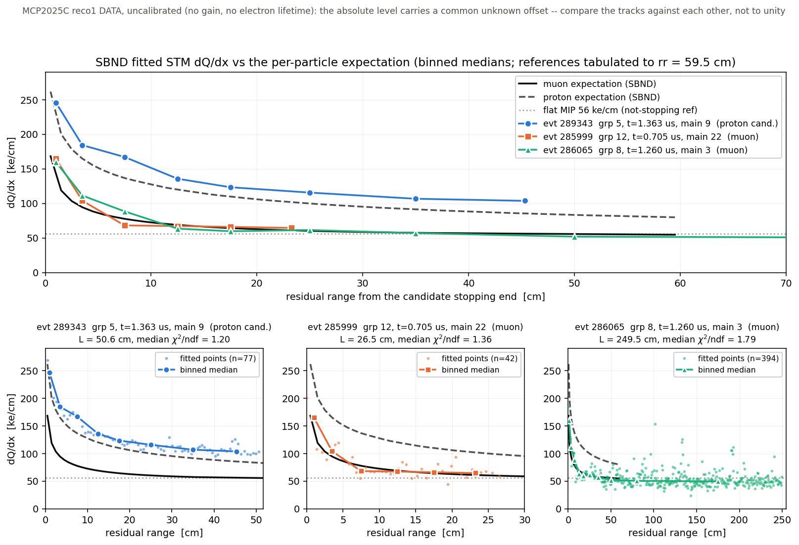

# 55 — dQ/dx vs residual range for three hand-scanned bundles, against the SBND
per-particle expectation

Three bundles picked out of the `d55ton` hand scan — one flagged in the scan as
*"proton from outside (check with prediction)"* and two believed to be muons —
put on the SBND dQ/dx reference curves of [48](48_sbnd-dqdx-tables-and-mip.md).

**Result:** the flagged bundle sits on the **proton** curve and is a factor
**1.9** above the **muon** curve; both believed muons sit on the muon curve to
**±2 %**. The separation is measured *relative to muons in the same
uncalibrated sample*, so the missing gain/lifetime calibration cancels — this is
not an absolute-scale claim. The STM tagger nonetheless accepted all three,
because on the `flag_strong_check = false` path nothing gates on `ratio1` (§5).

*(Doc number: 54 is taken by the in-flight TGM/STM perf campaign,
`run_perf54_nusel.sh`.)*

---

## Repro

```bash
cd /nfs/data/1/xqian/toolkit-dev/wcp-porting-img/sbnd/sbnd_xin
python3 stmfit_particle_overlay.py -o pics/stmfit_dqdx_particle_overlay.png \
  "work-mcp1000b-d55ton:289343:90:evt 289343  grp 5, t=1.363 us, main 9  (proton cand.)" \
  "work-mcp10-d55ton:285999:220:evt 285999  grp 12, t=0.705 us, main 22  (muon)" \
  "work-mcp10-d55ton:286065:30:evt 286065  grp 8, t=1.260 us, main 3  (muon)"

# the doc-42 muon re-read against the SBND table (section 4a):
python3 stmfit_particle_overlay.py \
  "archive/stm-docs40-49/work-mcp10-stmon:286241:80:evt 286241 (doc 42 muon)"

# and the proof that doc 42's table was against the uBooNE curves (section 4a):
git show 6099ed0:sbnd/sbnd_xin/nusel_display/stm_ref_dqdx.json > /tmp/ref_ub.json
python3 stmfit_particle_overlay.py --ref /tmp/ref_ub.json --mip 50000 \
  "archive/stm-docs40-49/work-mcp10-stmon:286241:80:doc42 muon"
```

Nothing was re-run. All four `tracking-stm.root` files already existed; the
`d55ton` arm is the one the live scan viewer on :5011 serves, which is where the
three bundles were flagged.

`stmfit_particle_overlay.py` is **new**. `stmfit_showcase.py` was deliberately
left untouched — doc 42's Repro block cites it with specific arguments, and its
hard-coded muon-only reference and flat-50 line are part of that record.

---

## 0. The three bundles

Block id in `T_rec_charge` is `cluster_id * 10 + pass`, and `cluster_id` is the
bundle's `main_id` in `nusel_evt<ID>/nusel-evt<ID>.tsv` — the same number the
scan viewer prints as "main N". Every row below was read back from that tsv, so
the viewer string the bundles were flagged by is tied to the block that was
plotted:

| viewer string | work root | main_id | block | in_beam | STM | label |
|---|---|---:|---:|---:|---:|---|
| `grp 5 t=1.363 us main 9` | `work-mcp1000b-d55ton` | 9 | 90 | 1 | 1 | STM |
| `grp 12 t=0.705 us main 22 + companions 8` | `work-mcp10-d55ton` | 22 | 220 | 1 | 1 | STM |
| `grp 8 t=1.260 us main 3 + companions 2` | `work-mcp10-d55ton` | 3 | 30 | 1 | 1 | STM |

All three are the in-beam bundle of their event and all three carry the STM
(stopping-muon) tag. Fit geometry, from the fitted trajectory itself
(`rr = 0` is the candidate stopping end; the pass runs from the detector-boundary
end inward, doc 42 §2):

| event | fit L (cm) | boundary end (x, y, z) cm | stopping end (x, y, z) cm | median dx | median χ²/ndf |
|---|---:|---|---|---:|---:|
| 289343 m9 | 50.6 | (−29.2, **199.4**, 265.0) | (−6.3, 179.5, 304.7) | 0.667 | 1.20 |
| 285999 m22 | 26.5 | (**−200.3**, 92.2, 302.3) | (−179.8, 79.7, 312.3) | 0.643 | 1.36 |
| 286065 m3 | 249.5 | (−165.7, **199.5**, 350.5) | (−132.9, −10.5, 455.8) | 0.626 | 1.79 |

Bold = the coordinate that is at a detector face (`FV_ymax = 199.312`,
`FV_xmin = −201.05`, `cfg/pgrapher/experiment/sbnd/clus.jsonnet:82-87`). So
289343 m9 does enter from outside through the **top** face and stop 50 cm later
near the cathode — "proton from outside" is geometrically consistent. 286065 m3
enters through the top too; 285999 m22 enters at the TPC0 anode face.

**The three `median dx` values agree to 6 %.** That matters: a dQ/dx excess can
always be faked by an underestimated path length, and 289343 m9's sampling
pitch is not anomalous, so its excess is in `dQ`, not in `dx`.

---

## 1. The reference

`nusel_display/stm_ref_dqdx.json`, the dump of the compiled config's
`LinterpFunction` tables — i.e. the exact curves `eval_stm` compares against.
It carries **two** particles, `MuonDeDx` and `ProtonDeDx`, both on
`start = 0.5`, `step = 1`, 60 entries, so the domain is **rr = 0.5 – 59.5 cm**.
Those are the SBND versions (Modified Box at 0.5 kV/cm × 0.85, doc 48 §1), not
the shipped MicroBooNE ones — the file was regenerated in commit `0462fb2`.

Nothing was synthesized to widen "various particles" beyond what that file
holds. Pion/kaon/electron curves do exist in
`sbnd/particle_dataset.jsonnet`, but pulling them from a second source for a
proton-vs-muon question would put two provenances in one figure for no gain.
Extending the json is listed in §6.

The third line on the plot is the flat **56 ke/cm** MIP reference — SBND's
`mip_dqdx` (doc 48 §6, `sbnd/clus.jsonnet:513`), which is what
`eval_stm_core`'s `ref_flat` not-stopping hypothesis uses and what the `d55ton`
runs were configured with. It is **not** the uBooNE 50 ke/cm that
`stmfit_showcase.py` draws.

Outside 0.5 – 59.5 cm no ratio is quoted. `np.interp` clamps above the last
node, which would silently compare against a flat line and manufacture a
plausible number; those cells read `--` instead. This bites only 286065 m3,
whose fit path runs to 249.5 cm.

---

## 2. The figure



Top: binned medians of all three, on both curves plus the flat MIP line, over
the reference domain. Bottom: every fitted point of each track over its full fit
path.

---

## 3. Numbers

Binned median fitted dQ/dx, with the ratio to each curve. `/MIP` is against the
flat 56 ke/cm.

**289343 main 9** (the flagged bundle) — 77 points, L = 50.6 cm:

| rr bin (cm) | n | fit ke/cm | muon | ratio | proton | ratio | /MIP |
|---|---:|---:|---:|---:|---:|---:|---:|
| 0 – 2 | 4 | 245.8 | 147.5 | 1.67 | 235.9 | **1.04** | 4.39 |
| 2 – 5 | 4 | 184.2 | 95.1 | 1.94 | 165.7 | **1.11** | 3.29 |
| 5 – 10 | 7 | 167.0 | 78.2 | 2.13 | 137.7 | **1.21** | 2.98 |
| 10 – 15 | 8 | 135.6 | 69.0 | 1.97 | 120.2 | **1.13** | 2.42 |
| 15 – 20 | 7 | 123.3 | 64.3 | 1.92 | 109.9 | **1.12** | 2.20 |
| 20 – 30 | 15 | 115.6 | 60.4 | 1.91 | 100.4 | **1.15** | 2.06 |
| 30 – 40 | 16 | 106.6 | 57.4 | 1.86 | 91.4 | **1.17** | 1.90 |
| 40 – 60 | 16 | 103.6 | 56.2 | 1.84 \* | 85.4 | **1.21** \* | 1.85 |

**285999 main 22** — 42 points, L = 26.5 cm:

| rr bin (cm) | n | fit ke/cm | muon | ratio | proton | ratio | /MIP |
|---|---:|---:|---:|---:|---:|---:|---:|
| 0 – 2 | 3 | 164.5 | 160.9 | **1.02** | 252.6 | 0.65 | 2.94 |
| 2 – 5 | 6 | 103.8 | 94.2 | **1.10** | 164.4 | 0.63 | 1.85 |
| 5 – 10 | 8 | 68.1 | 77.1 | **0.88** | 135.7 | 0.50 | 1.22 |
| 10 – 15 | 8 | 67.2 | 69.1 | **0.97** | 120.4 | 0.56 | 1.20 |
| 15 – 20 | 8 | 66.0 | 64.1 | **1.03** | 109.5 | 0.60 | 1.18 |
| 20 – 30 | 9 | 64.5 | 61.0 | **1.06** | 101.8 | 0.63 | 1.15 |

**286065 main 3** — 394 points, L = 249.5 cm:

| rr bin (cm) | n | fit ke/cm | muon | ratio | proton | ratio | /MIP |
|---|---:|---:|---:|---:|---:|---:|---:|
| 0 – 2 | 3 | 159.8 | 154.2 | **1.04** | 244.2 | 0.65 | 2.85 |
| 2 – 5 | 5 | 111.3 | 95.8 | **1.16** | 166.9 | 0.67 | 1.99 |
| 5 – 10 | 7 | 88.4 | 78.4 | **1.13** | 137.9 | 0.64 | 1.58 |
| 10 – 15 | 8 | 63.4 | 69.1 | **0.92** | 120.5 | 0.53 | 1.13 |
| 15 – 20 | 8 | 59.7 | 63.9 | **0.93** | 109.2 | 0.55 | 1.07 |
| 20 – 30 | 16 | 61.4 | 60.3 | **1.02** | 100.0 | 0.61 | 1.10 |
| 30 – 40 | 15 | 56.9 | 57.4 | **0.99** | 91.5 | 0.62 | 1.02 |
| 40 – 60 | 33 | 51.9 | 55.7 | **0.93** \* | 83.3 | 0.62 \* | 0.93 |
| 60 – 100 | 62 | 50.4 | — | — | — | — | 0.90 |
| > 100 | 237 | 49.3 | — | — | — | — | 0.88 |

\* bin extends past the 59.5 cm reference domain; the ratio uses only the
in-domain part.

Summary — the median **point-by-point** ratio over the reference domain, which is
the quantity that can be compared *between* tracks:

| track | n pts in domain | fit / muon | fit / proton |
|---|---:|---|---|
| 289343 m9 (flagged) | 76 | **1.91**  [1.79 – 1.98] | **1.14**  [1.09 – 1.23] |
| 285999 m22 | 41 | **0.99**  [0.89 – 1.18] | 0.58  [0.51 – 0.69] |
| 286065 m3 | 93 | **0.98**  [0.86 – 1.16] | 0.60  [0.53 – 0.73] |
| 286241 c8 (doc 42, §4a) | 94 | **0.99**  [0.90 – 1.12] | 0.62  [0.54 – 0.70] |

Brackets are the 16–84 % spread of the per-point ratio, i.e. point scatter, not
an uncertainty on the median.

---

## 4. Reading

**The prediction check the scan asked for comes out proton.** 289343 m9 is at
1.14 of the proton curve and 1.91 of the muon curve. The two believed muons —
and doc 42's independent third muon — are at 0.98–0.99 of the muon curve and
0.58–0.62 of the proton curve. Every track lands within 14 % of one curve and is
off the other by 1.6–1.9×; the three groups do not overlap.

**Why the missing calibration does not undo this.** MCP2025C reco1 is *data*
with no gain and no electron-lifetime correction applied anywhere downstream of
the fit (doc 42 §0; the lifetime correction is not even ported, doc 48 §8 item
3), so no absolute dQ/dx here is trustworthy on its own. But the three muons
*measure* that residual offset: it is 0.98–0.99 against the SBND muon table,
i.e. ≲ 2 %. Whatever multiplicative miscalibration is left is therefore small,
and 289343 m9's 1.91 against the same table in the same sample cannot be
absorbed into it. **The argument is a ratio of ratios and the calibration
cancels; it does not depend on the absolute scale being right.**

**Shape alone would have been weaker.** 289343 m9's Bragg contrast —
peak(0–2 cm) / plateau(40–60 cm) = 245.8 / 103.6 = **2.37** — sits *below* both
the muon table's 2.62 and the proton table's 2.76 over the same span, on 4
points in the leading bin. Read as contrast this track is not clearly either.
What separates it is that its dQ/dx is high **at every residual range**, which
is what a heavier particle of the same range does, and the level is calibrated
by the control muons. The rr-dependence still matters — it is what makes the
proton ratio flat (1.04–1.21) rather than trending — but the discriminating
number is the level relative to the muon controls.

**This does not identify the particle from truth.** MCP2025C carries no
`simb::`/`sim::` products (doc 42 §0), so there is no truth to check against;
the statement is "consistent with the proton hypothesis and inconsistent with
the muon hypothesis, given these tables", not "is a proton". A proton–muon
degeneracy could still be broken the wrong way by a defect common to the
reference pair, e.g. the undocumented ×0.85 (doc 48 §8 item 2) — though that is
a flat factor and so cancels in the muon-controlled comparison too.

### 4a. Doc 42's "normalization high by 10–25 %" was against the uBooNE table

Doc 42 §4 measured evt 286241 c8 at 1.07–1.31 of expectation and read it as an
uncalibrated-data offset. That comparison used `stm_ref_dqdx.json` **as it stood
at commit `6099ed0`, which held the MicroBooNE curves** (`MuonDeDx[0] = 123417`);
doc 48's `0462fb2` replaced them with the SBND ones (`MuonDeDx[0] = 168151`,
+12 % at plateau to +36 % at the peak). Re-read against the SBND table, that same
fit gives **0.99** — the row in §3's summary table.

**This is proven, not inferred from commit dates.** Feeding the `6099ed0`
version of the json back in reproduces doc 42 §4's table *cell for cell* —
every fitted value, every expectation, every ratio:

| rr bin | doc 42 fit / exp / ratio | reproduced with the `6099ed0` json |
|---|---|---|
| 0 – 2 | 151.5 / 115.8 / 1.31 | 151.5 / 115.8 / 1.31 |
| 2 – 5 | 95.6 / 77.4 / 1.24 | 95.6 / 77.4 / 1.24 |
| 5 – 10 | 74.7 / 65.7 / 1.14 | 74.7 / 65.7 / 1.14 |
| 10 – 15 | 74.3 / 59.3 / 1.25 | 74.3 / 59.3 / 1.25 |
| 15 – 20 | 67.3 / 55.8 / 1.21 | 67.3 / 55.8 / 1.21 |
| 20 – 30 | 56.5 / 52.9 / 1.07 | 56.5 / 52.9 / 1.07 |
| 30 – 40 | 57.5 / 50.8 / 1.13 | 57.5 / 50.8 / 1.13 |
| 40 – 60 | 54.9 / 49.7 / 1.10 | 54.9 / 49.7 / 1.10 |
| 60 – 100 | 57.1 / — | 57.1 / — |
| > 100 | 52.9 / — | 52.9 / — |

The `expected` column is the fingerprint: doc 42's 20–30 cm expectation is
**52.9** ke/cm, which is the uBooNE table there; the SBND table gives **60.4**
(§3, 289343's 20–30 row). Median fit/muon over the domain is **1.14** against
the uBooNE json and **0.99** against the SBND one — the ratio 1.15 is the table
ratio over these residual ranges. `git log 0462fb2..HEAD` also shows doc 42
untouched since the swap, so its §4 could not have been rewritten against the
new tables. The cell-for-cell match doubles as a check of this doc's own decode
against a committed independent record.

So the ~15 % excess doc 42 reported was, to within its own precision, **the
field difference between 0.273 and 0.5 kV/cm**, not a calibration offset. Two
consequences worth recording:

- Doc 42 §4's reading ("normalization is high by ~10–25 %") should be read as
  *against the uBooNE reference*. It is not evidence of a residual SBND
  calibration offset. Doc 42 is left as written; this is the correction.
- Doc 48 §4's framing — the tables are "physically right and calibration-wise
  premature", with the 30-event scan showing STM tags lost because the reference
  moved ~12 % while the data did not — now has four SBND muons landing at
  0.98–0.99 against the new tables. That is evidence *for* the new tables and
  **against** there being a large uncorrected charge offset in this sample. It
  does not settle doc 48 §4 (which is retracted as noise-floor-limited anyway,
  and covers four different events).

---

## 5. What the STM evaluator itself did

`T_stm_eval`, the per-trial dump `save_stm_fit` writes, on the accepted trial of
each bundle:

| track | strong | verdict | ks1 | ks2 | ratio1 | ratio2 | 1 / ratio1 |
|---|---:|---:|---:|---:|---:|---:|---:|
| 289343 m9 | 0 | 1 | 0.0084 | 0.1061 | **0.5204** | 0.4015 | **1.922** |
| 285999 m22 | 0 | 1 | 0.0189 | 0.1177 | 0.9658 | 0.7034 | 1.035 |
| 286065 m3 | 0 | 1 | 0.0218 | 0.1172 | 0.9916 | 0.7707 | 1.008 |

`ratio1 = Σ ref_muon / Σ data` (`TaggerCheckSTM.cxx:1652`), so `1/ratio1` is the
tagger's own data-over-muon-reference number, computed inside the tagger from its
own sampling. It reproduces §3's independent decode — **1.922 vs 1.91** on the
flagged track, 1.035 / 1.008 vs 0.99 / 0.98 on the muons. That is a cross-check
of the whole `q → dQ → dQ/dx` decode of `stmfit_particle_overlay.py`, not just of
the conclusion.

**All three were accepted, and on this path `ratio1` is not consulted.** With
`flag_strong_check = false`, `eval_stm_core` accepts at
`TaggerCheckSTM.cxx:1694`: `ks1 - ks2 < -0.02 && ((ks2 > 0.09 && |ratio2-1| >
0.1) || ratio2 > 1.5 || ks2 > 0.2)`. For 289343 m9 that is
−0.0977 < −0.02 and ks2 = 0.106 > 0.09 and |0.4015−1| = 0.60 > 0.1 → accept.
`ks1` is *area-normalized* (`util/src/KSTest.cxx:216-238`, doc 48 §3 reading 3),
so a track whose charge is uniformly 1.9× the muon reference still gets a
small `ks1` — the shape matches, only the scale does not, and the scale
information lives entirely in `ratio1`. The strong branch at `:1699` **does**
gate on `fabs(ratio1-1) < 0.1`: 289343 m9 would fail it at 0.48, and both muons
would pass at 0.034 and 0.008.

Stated plainly and no further: on the non-strong path a stopping proton with a
clean Bragg *shape* is accepted as a stopping muon, and the one quantity that
distinguishes them here is the one that branch ignores. Whether that is a defect
depends on what the STM tag is for — a cosmic-induced stopping proton is still
cosmic background, so rejecting the bundle may be the right outcome reached by
the wrong hypothesis. **No code was changed and no threshold was tuned**; §6
lists this as an open item, not a fix.

---

## 6. Open items — none of these were done here

1. **Extend `stm_ref_dqdx.json` to all five particles** (pion, kaon, electron
   too). `docs/emit_jsonnet_dedx.py` in the `energy_loss` repo already emits all
   five from `pion_travel/stopping_ave_dQ_dx_sbnd.root`; the json dump was only
   ever muon + proton because that is what the viewer panel needed. A
   proton/kaon separation question would need it.
2. **Decide whether the non-strong accept path should see `ratio1`** (§5). Needs
   a population, not this one track: how many `d55ton` STM tags have
   `1/ratio1 > 1.5`? `T_stm_eval` is dumped for every `-stm-fit` event, so the
   count is a query over the existing 30-event set, not a re-run.
3. **Truth.** Everything here is fitted-vs-model on data. The MC sample and
   `dump_truth_sed.C` of doc 42 §7 are the way to confirm a proton is a proton.
4. **The reference domain stops at 59.5 cm** for both curves, so 286065 m3's
   190 cm of plateau has no expectation to compare against and 289343 m9's
   40–60 cm bin is partly out of domain. Both are `convert_field.C` loop bounds,
   not physics limits (doc 48 §5 makes the same point for the electron curve).
5. **Doc 42 §4's table** still quotes the uBooNE-referenced ratios (§4a). Left
   as the historical record; a reader who wants the SBND numbers has the Repro
   line above.

---

Companion docs: [48](48_sbnd-dqdx-tables-and-mip.md) (where these curves come
from), [47](47_stm-bragg-reference-sbnd-retune.md) (why they had to be replaced),
[42](42_stm-fit-showcase-evt286241.md) (one fit end to end, and the uncalibrated-
data caveat), [41](41_stm-fit-dump.md) (what `save_stm_fit` writes).
