# Doc 83 — MCS CPU cost, and why some tracks read KE_MCS >> KE_range

Owner ask (2026-08-26): looking at doc 80's money plot
(`80_mcs/mcs_vs_range_scatter.png`), two questions doc 80 never answered.
(1) How fast is the MCS code compared with the PR stage as a whole — is it
negligible? (2) Some tracks read KE_MCS much larger than KE_range: is that
mis-ID (an electron typed as a muon), an incomplete muon (part of the track
lost, testable with the Bragg peak), or over-clustering (two tracks with a
kink reconstructed as one)? Find the track and understand the issue, using the
PR display where useful, with plots in this doc.

**Status.** MCS costs ~0.2% of the PR stage per active event — three
independent measurements agree, and the arm-level A/B noise floor (~66 ms/evt)
is >6x bigger than the whole MCS cost, so it cannot even see it. The outlier
tail (18/134 contained muons at ratio > 1.5) is **mostly a
reconstruction-fragmentation signal, not an MCS defect**: 12/18 have another
track-like PR fragment *touching* the selected segment (a broken/mis-split
trajectory — the toy statistical null predicts only ~2.6 outliers from angle-
count statistics alone, ~7x fewer than the 18 observed), and the ambiguity
score already flags 16/18 of them on its own. A provisional "single dominant
kink angle" reading did **not** survive a replay-fidelity check and is
retracted below — read that correction before the classification table. These
are **SBND data events** (doc 80 §18's "MC" label was wrong: the batch log
records `reality=data` and the input art file carries no `simb::MCTruth`
products) with no truth available; every conclusion below is from
reconstruction-internal evidence — dQ/dx, geometry, and the estimator's own
likelihood.

## Repro block

```bash
cd /nfs/data/1/xqian/toolkit-dev/toolkit/sbnd_xin

# Part 1: cost, from the existing ON/OFFB/REF arms (no new run)
python3 scripts/mcs83_cost.py --out docs/83_mcs --out-exist-ok \
  --on work-mcp1k-mcs80on --offb work-mcp1k-mcs80offb --ref work-mcp1k-mcs80ref \
  --bench-clouds docs/83_mcs/clouds

# Part 2/3: outlier + low-side deep dive (harvests clouds, replays through
# mcs_probe, censuses fragmentation/Bragg/ambiguity), from the same ON arm
python3 scripts/mcs83_outliers.py --out docs/83_mcs --out-exist-ok \
  --arm work-mcp1k-mcs80on

# case-study panels (static; reuses pr_display's own reference dQ/dx tables)
python3 scripts/mcs83_panels.py --arm work-mcp1k-mcs80on --out docs/83_mcs \
  "287621:6007:6:short fragment, adjacent pi/mu-tagged pieces" \
  "406796:11000:11:touching fragment, replay-unverified" \
  "282899:7014:7:genuine Bragg peak, statistics-limited" \
  "291570:17000:17:long track, single large-angle scatter" \
  "286681:3004:3:LOW-SIDE, busy multi-prong vertex"

# NOT run for this doc (the static panels above already answer the question
# from tracking-pr.root alone) -- to explore any of these events
# INTERACTIVELY instead (click particles, toggle wire planes), re-run with
# the display stage on and serve:
SBND_MCS=1 PR_EXTRA_STAGES=pr_display PR_JOBS=6 \
  ./run_pr_chain_batch.sh work-mcp1k-grp0825 work-mcp1k-mcs83disp data \
  $(cut -f1 docs/83_mcs/outliers.tsv | tail -n +2)   # or any event list of interest
./pr_display/serve_pr_display.sh 5017 '../work-mcp1k-mcs83disp/pr_evt*/calib-pr-evt*.json'
```

## 1. Cost: three independent numbers, all negligible

Doc 80 §17 only said "negligible… inside the same log second as its
neighbours"; §7.2's numbers were `trim_trajectory` complexity *estimates*, and
the "1.91 segs/2.45 angles" line in doc 80 §18 is the cathode-excision cost,
**not** a runtime. There was no wall-clock number anywhere. There now are
three, independent, and they agree.

**(a) In-situ bracket.** Every ON-arm log line (`work-mcp1k-mcs80on`, 1000
events) carries an `[HH:MM:SS.mmm]` timestamp, and the MCS sentinel
(`clus/src/MuonMCSDriver.cxx:278`) is emitted right after the
`TaggerCheckNeutrino timing: fill_kine_tree took…` perf line, with only a
trivial field-stamp block between — the delta brackets the whole call (an
*upper* bound: it also includes that stamp block and the spdlog format call,
and it cannot see the cheaper early-exit paths).

397 `mcs:` log lines total: 290 completed invocations, 107 "selected muon too
short" skips, zero of any other skip variant. Per completed invocation:

| p0 | p25 | p50 | p75 | p90 | p99 | max | mean |
|----|-----|-----|-----|-----|-----|-----|------|
| 0.0 | 3.0 | 6.0 | 12.0 | 25.0 | 49.6 | 78.0 | 10.0 ms |

(`docs/83_mcs/cost_hist.png`, `cost_brackets.tsv`.) Summed: 2907 ms of MCS work
across all 1000 events. Two denominators, both from the log's own
`MABC timing: … (cumulative … ms)` epilogue (the true PR-stage total per
event — the job's `Timer: Total wall-sec` line is dominated by tensor-file
I/O and is the wrong denominator):

- over **all 1000 events**: PR-stage median 727 ms/event; MCS amortized
  2.91 ms/event = **0.40%** of that.
- over the **289 events where MCS actually ran**: PR-stage median is bigger
  (4896 ms/event — these events do more work generally, e.g. the BDT scorers);
  MCS amortized 10.1 ms/event = **0.21%** of that.

**(b) Clean micro-benchmark**, `mcs_upstream/dumper/mcs_probe bench` (new tool,
links the *installed* `libWireCellMcs` — the estimator that actually ran, not
the raw upstream source `mcs_dump.cxx` links): replaying 12 real harvested
`muon_segments`-mode clouds (67–233 points, 300 reps each), `run()` median
scales from 0.82 to 5.0 ms (`docs/83_mcs/bench_scaling.png`, `trim_trajectory`
dominates as cloud size grows, matching doc 80 §7.2's `O(N² log N)` shape —
`form_segs` stays under 0.15 ms throughout). At the single **largest**
`muon_segments`-mode cloud that fired anywhere in the whole 1000-event arm
(evt 280972, 806 points, 483 cm track): `run()` = 33.8 ms (`trim`=23.2 ms,
`form_segs`=0.8 ms, `estimate_energy`=9.8 ms) — still two orders of magnitude
below the ~5 s PR-stage total for an active event.

**(c) The noise floor.** `work-mcp1k-mcs80offb` and `work-mcp1k-mcs80ref` are
two independently-built knob-OFF binaries already gate-**proven** to produce
byte-identical `tracking-pr.root` output (doc 80 round 2/3, `hash_archive.py`
+ `mcs_root_gate.py`, 100/100 + 50/50 PASS) — so their whole per-event *work*
is provably identical, and their per-event wall-time spread over the shared
35 events IS the measurement noise floor a same-arm comparison lives in:
core-sec delta median −10 ms (−0.14%), p90 285 ms, max 431 ms. The paired
ON−OFFB delta (same 35 events) is median +27 ms, mean −172 ms, sd 880 ms —
**indistinguishable from that noise**, both far above the ~10 ms/event MCS
cost measured directly in (a). The doc therefore does **not** report a signed
ON-minus-OFF arm delta as "the cost" — it would be a noise-floor number
dressed up as a measurement.

**Not done:** a `chrono` timer at the call site under the existing `m_perf`
gate (matching the 11 sibling `TaggerCheckNeutrino timing:` emitters) would
give an exact number including early exits. Not worth a rebuild+re-run at
0.2%; named here as the one-line follow-up if that precision is ever wanted.

## 2. The high-side tail

Population: contained muons (`isfc==1`, the doc 80 Part A sample) with a valid
range comparator — 134 total. 18 have `ke_mcs / ke_range_toolkit > 1.5`
(14 above 2x). This section re-joins T_kine/T_tagger/log-sentinel keyed on
`kine_mcs_segment_id` **exactly** (doc 80's join used `cluster_id` alone,
which misreads the sentinel on the 8 events with two bundles in one cluster —
a free precision fix, `scripts/mcs83_outliers.py`, not applied retroactively
to doc 80's own `mcs_joined.tsv`).

### Step 0 — is the tail already self-flagged?

Ambiguity quintile edges over the 134 contained muons: `[0, 0.096, 0.234,
0.501, 0.729, 0.97]`. **16/18 outliers sit in the top quintile** (amb ≥
0.729 — a side likelihood basin nearly as probable as the best fit); residue
(low-ambiguity outliers) = **2**. This matches doc 80 Part C's finding that
`ambiguity_MCS` is a strong flag at the high end — for physics use, an
ambiguity cut removes almost the entire tail (§4).

### Step 2 — the statistical null: how much of the tail is just "few angles"?

`nseg14` (14 cm MCS segments used) for the 18 ranges 3–14, median 5 — i.e.
2–13 measured scattering angles. A muon fit from that few angles has real
estimator variance even with *zero* reconstruction defect. `mcs_probe
synthetic` draws angles from the tune's own double-Gaussian at the
Bragg-degraded local energy (`ke_from_rr(rr_from_ke(T) − distance_i)`, the
same physics the estimator scores against) and re-runs the shipped
`estimate_energy` 4000 times per bucket:

| nseg14 | T (median, MeV) | N contained here | N outliers here | toy P(ratio>1.5) | toy P(ratio>2.0) |
|---|---|---|---|---|---|
| 3 | 132 | 10 | 5 | 0.091 | 0.036 |
| 4 | 155 | 7 | 2 | 0.041 | 0.009 |
| 5 | 189 | 14 | 2 | 0.032 | 0.004 |
| 6 | 235 | 14 | 2 | 0.030 | 0.005 |
| 7 | 255 | 17 | 1 | 0.015 | 0.002 |
| 8 | 275 | 13 | 2 | 0.008 | 0.001 |
| 9 | 324 | 10 | 2 | 0.010 | 0.000 |
| 10 | 352 | 9 | 1 | 0.007 | 0.000 |
| 14 | 511 | 6 | 1 | 0.004 | 0.000 |

Summed over these buckets: pure angle-count statistics predicts **~2.6**
muons above 1.5x and **~0.6** above 2x. **Observed: 18 and 14.** The toy
null explains roughly a **sixth to a seventh** of the tail — most of it needs
a reconstruction-level explanation, not just "the estimator is noisy at low
segment count" (`docs/83_mcs/toy_null.png`).

### Steps 3/4 — mis-ID and the Bragg test

**Mis-ID of the selected segment itself: ruled out.** Every one of the 18
selected segments is internally pure `particle_id==13` (pdg semantics in this
tree) — no electron- or proton-tagged points mixed into the segment MCS
actually measured. (Mis-ID reappears, indirectly, in the fragmentation census
below — of an *adjacent*, non-selected fragment.)

**Bragg test** (`T_rec_charge[real_cluster_id==segid]`, dQ/dx recipe from
`dqdx_rr_sample/collect_dqdx_rr_sample.py`, contrast = `med(dQ/dx, rr<2) /
med(dQ/dx, 20≤rr<40)`, ≥2 = genuine stopping track): **8/18 outliers show a
genuine Bragg rise** on the selected segment alone (contrast ≥ 2) —
for those, the fragment truly stops, so its own local range/energy accounting
is not wrong; the excess is on the MCS side (few-angle variance, §2 step 2).
The other 10 do not clear the threshold. Median contrast: outliers 1.72 vs
matched controls 2.42 (`docs/83_mcs/bragg_contrast.png`) — the tail is
systematically *less* likely to show a real Bragg peak than a typical
contained muon, consistent with truncation being enriched in this population.

### Step 4b — fragmentation/adjacency census (the incomplete-muon test)

For every outlier, every *other* track-like (`|pdg| ∈ {13, 211, 2212}`)
`real_cluster_id` group sharing the same parent PR cluster, and its closest
point-to-point distance to the selected segment's own cloud:

**12/18 outliers have another track-like fragment touching or within 10 cm**
of the selected segment. The clearest case, `evt287621 seg6007`
(`docs/83_mcs/outlier_evt287621_seg6007.png`): the selected 55 cm, 93-point
muon fragment sits flush against a **pion-tagged** 42-point fragment
(`real_cluster_id=6019`, `pdg=211`), which itself connects to a *second*
muon-tagged fragment (`rid=6020`, 88 points) — all three visibly form **one
continuous trajectory** in the X-Z/Y-Z projections. The dQ/dx profile of the
selected 55 cm piece alone sits *above* the muon reference curve and close to
the proton curve near the stopping end, which is odd for a segment tagged
`pdg=13` — consistent with a single physical track that pattern recognition
broke into three pieces and mis-tagged the middle one. This is exactly the
owner's "part of the muon lost" hypothesis, compounded with an adjacent
mis-ID rather than a mis-ID of the segment MCS actually saw.

### Step 5 — kink/over-clustering: a finding that did NOT survive verification

An initial pass masked the single largest inter-segment angle (via the
shipped `angle_keep` mechanism — the exact cathode-excision code path,
`WireCell::Mcs::detail::estimate_energy`) and re-minimised; 5/18 outliers
showed the residual collapse by ≥50%, a candidate "one dominant kink angle"
signature. **This did not survive a fidelity check and is retracted.**

The cloud harvest for the replay uses the selected segment's own first/last
on-disk `T_rec_charge` point as a **proxy** for `vtx_start`/`vtx_end` — the
driver's real endpoints are the PR graph's fitted `Vertex::fit().point`,
which is not stored per-point in this tree. `trim_trajectory` is sensitive to
that choice on short, marginal tracks. Checking `mcs_probe replay`'s own
`ke_MCS` against the shipped `kine_mcs_energy`: **only 8/18 outliers
reproduce within 20%**, vs **13/15 matched controls** — outliers are
markedly harder to replay exactly, itself consistent with them being the
short/marginal tracks where the exact endpoint matters most. Restricting the
kink test to the 8 replay-verified outliers: **0/8** show the ≥50% collapse
(`docs/83_mcs/lnl_curves.png` — the likelihood curves for this verified
subset are broad and shallow, flat over hundreds of MeV past the minimum,
which is the real story: not one bad angle, but too few angles overall to
pin down a basin). **All 5 provisional "kink" flags were unverified
replays**; there is no reliable evidence of a single dominant merged-track
angle in this sample. A proper check would need the true fitted vertex
points from the PR graph (a C++-side dump, not reachable from ROOT alone) —
listed as an open item, not attempted here.

One directionally-consistent piece of corroborating (not proof-grade, same
endpoint-proxy caveat) evidence: outliers have systematically *smaller*
median per-muon scattering angle than matched controls at the same `nseg14`
(`docs/83_mcs/angle_spectrum.png`). A **small** realized angle sample pushes
the fit toward a **higher** KE (less scattering expected there) — exactly
the direction of every one of these outliers, and exactly what "too few
angles, unlucky draw" predicts.

### Classification (18 outliers)

| tag | count | meaning |
|---|---|---|
| adjacent fragment (FRAG) | 12/18 | another track-like PR piece touches the selected segment |
| genuine Bragg on the segment (BRAGG-OK) | 8/18 | the selected fragment itself really stops |
| FRAG ∩ BRAGG-OK | 6/18 | stops at the far end, but may still be missing entrance-side track |
| neither FRAG nor BRAGG-OK | 5/18 | closest to "MCS-fit statistics alone", per the toy null |
| single-dominant-angle (kink) | **0/8 replay-verified** | retracted, see step 5 |

Case-study panels (`docs/83_mcs/outlier_evt*.png`): `evt287621` (fragmentation
example above), `evt406796` (touching fragment, replay-unverified — the
masking response for this one should NOT be read as a confirmed kink, see
step 5), `evt282899` (genuine Bragg peak, contrast 4.4, yet still an outlier —
the few-angle-statistics case), `evt291570` (the longest track in the sample,
220 cm/14 segments, no nearby fragment, flat dQ/dx — possibly not a true
stopping muon despite the `isfc==1` tag, worth an owner look).

## 3. The four low-side violators (doc 80 Part B, deferred there)

Doc 80 Part B flagged 4 exiting muons with `E_MCS < E_range(visible)` — the
opposite sign, "for a later look". Same machinery, on the 4:

| evt | seg | ratio | amb | nseg14 | Bragg contrast | nearest fragment |
|---|---|---|---|---|---|---|
| 286681 | 3004 | 0.09 | **1.000** | 4 | 0.97 | touching (0.0 cm), **pdg=2212 (proton)** |
| 315849 | 11000 | 0.17 | **1.000** | 5 | 0.93 | 68 cm away |
| 172788 | 26004 | 0.78 | 0.065 | 8 | 1.85 | touching (0.0 cm) |
| 349241 | 15001 | 0.78 | 0.958 | 3 | 4.02 | touching (0.0 cm) |

Two of the four (286681, 315849) sit at the ambiguity ceiling (1.000 —
Part C's own "garbage flag" threshold), so their MCS numbers are already
self-flagged as unusable. `evt286681` (`docs/83_mcs/outlier_evt286681_seg3004.png`)
is a **busy multi-prong vertex**: the selected 3004 fragment is short and
visibly bent, sitting in a cluster with a dozen+ small fragments including
two **proton-tagged** pieces (`rid=3005, 3006`, `pdg=2212`) touching it
directly — an over-clustering/busy-vertex read, not a clean single muon. The
other two (172788, 349241) have low-to-moderate ambiguity and a genuine
Bragg rise (1.85, 4.02) yet still read low relative to the (larger) *visible*
range used for the exiting-population denominator — plausibly the visible
range itself is inflated by a merged prong at the busy end (172788 and
349241 both have a touching fragment too), which doc 80's own machinery
cannot distinguish from a real longer muon without a look at the vertex.
None of the 4 needed the replay-fidelity caveat of §2 step 5 for this
reading — the finding here rests on the fragmentation/ambiguity census
alone.

## 4. What this means for using MCS

- **Cost**: no reservation. ~0.2–0.4% of the PR stage per active event,
  sub-millisecond-to-tens-of-ms per call even at the largest cloud seen in
  1000 events; nowhere near the ~66 ms/event noise floor of the arms
  themselves. Doc 80's production-flip recommendation is unaffected.
- **The high-side tail is a data-quality flag more than an MCS bug.** For
  physics use, an **ambiguity cut** (`amb ≲ 0.5`, following doc 80 Part C's
  own reading of the score) removes 16/18 of these outliers directly, and the
  toy null (§2 step 2) shows the estimator's *own* statistical floor at low
  `nseg14` accounts for only a small fraction of what remains — most of the
  tail traces to broken/mis-split trajectories the pattern-recognition stage
  produced, which an ambiguity cut also happens to catch (broken tracks give
  few, poorly-constrained angles).
- **This is a reconstruction finding worth its own follow-up, not a fix
  here** (CLAUDE.md §5 tie-breaker: report, don't fix in the same change).
  The concrete lead is `evt287621`: three real_cluster_id fragments
  (6007/6019/6020) that visibly form one continuous trajectory, with the
  middle one mis-tagged `pdg=211`. Whether `pf_muon` selection should walk
  across such adjacent same-cluster fragments (not just `long_muon`'s
  vertex-chain) is an owner decision outside this doc's scope.
- **No kink/over-clustering defect is confirmed** in this sample once the
  replay-fidelity gate is applied (§2 step 5) — do not carry the earlier
  5/18 "kink" reading forward.

## 5. Open items

- A proper endpoint (not the on-disk-point proxy used here) would let the
  kink test and the lnL-curve plot cover all 18 outliers instead of 8; needs
  a C++-side dump of the PR graph's fitted `Vertex::fit().point`, not
  reachable from `tracking-pr.root` alone.
- The `evt287621`-style fragmentation is worth a dedicated PR-quality census
  across the full sample (how often does a `pf_muon`-selected segment sit
  flush against another track-like fragment, muon-selected or not) —
  this doc only characterizes it on the 18+4 muons MCS already flagged.
  A fresh label/arm, per M13, not this doc's existing outputs.
  Owner-facing check: `evt291570`'s flat dQ/dx despite an `isfc==1` tag is
  worth a look — it may not be a true stopping muon.
  Interactive follow-up: `PR_EXTRA_STAGES=pr_display` + the live viewer
  (Repro block) on any of these events, for click-through particle-flow and
  wire-plane views the static panels here don't show.
- No MC truth is available for this sample (data, not MC — see the Status
  correction above); every conclusion here is reconstruction-internal. If an
  MC sample with truth is ever run through this same MCS chain, comparing
  true pdg/KE against these same proxies would settle the ambiguous cases
  (the 5/18 with neither FRAG nor BRAGG-OK evidence) directly.

## Money plots

**Cost**

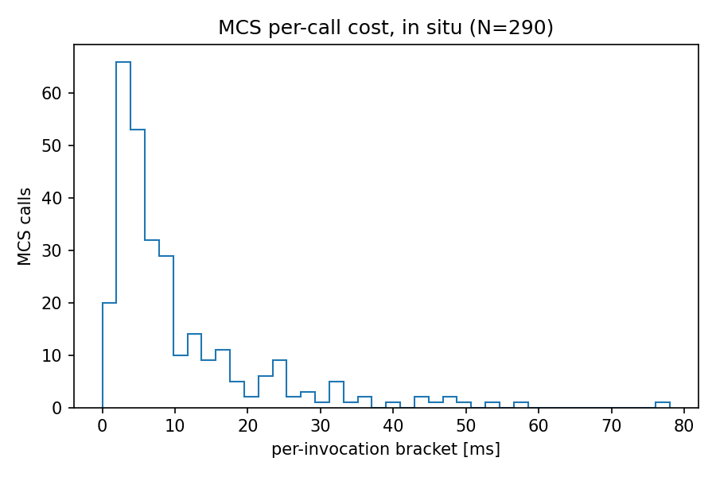

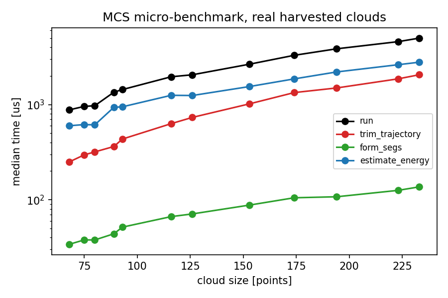

**The high-side tail: mechanism**

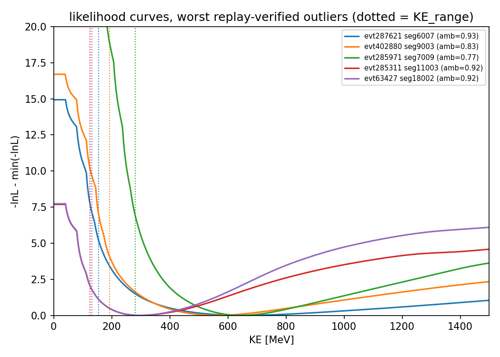

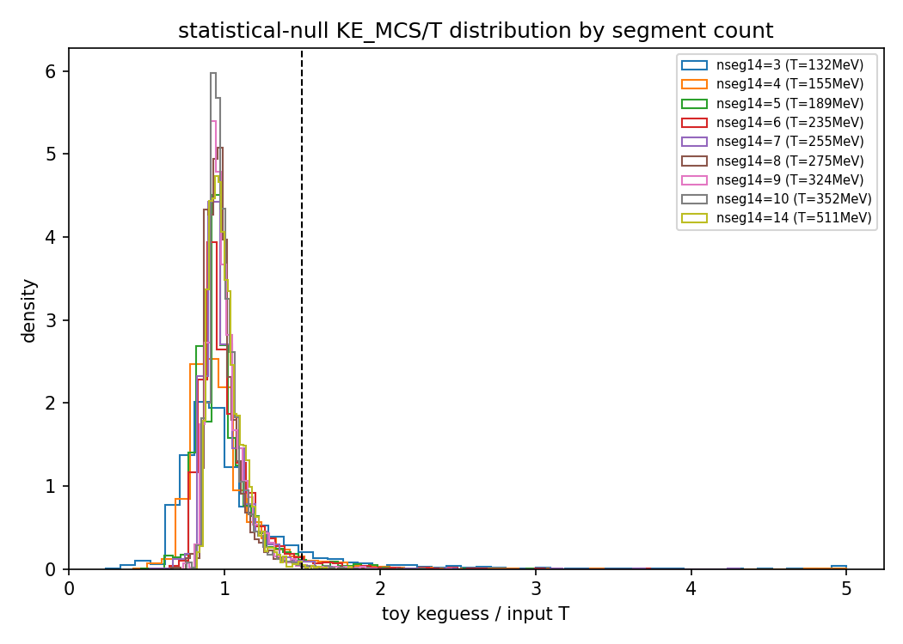

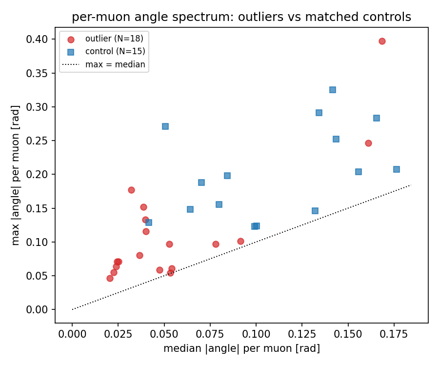

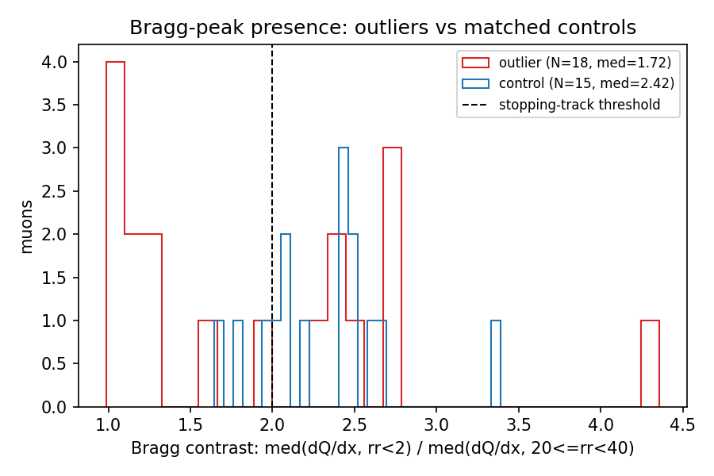

**Case studies** (X-Z / Y-Z projections of the whole parent cluster, coloured
by PR fragment; dQ/dx vs residual range for the selected segment against the
muon/pion/proton reference curves — the same tables the interactive PR
display plots against)

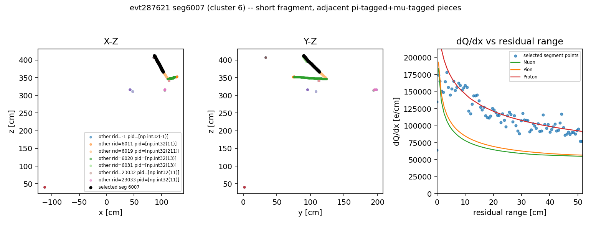

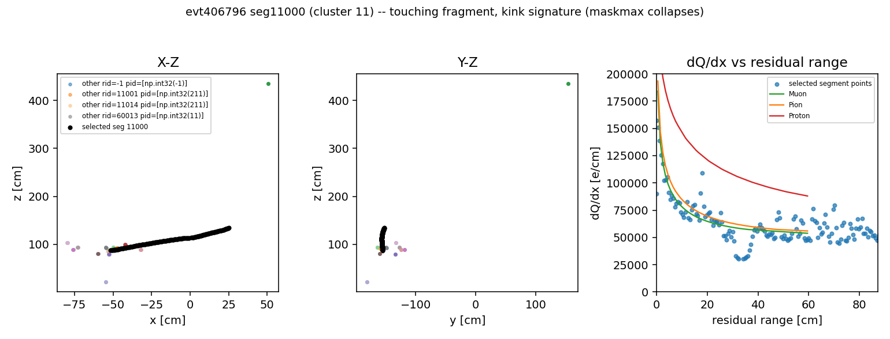

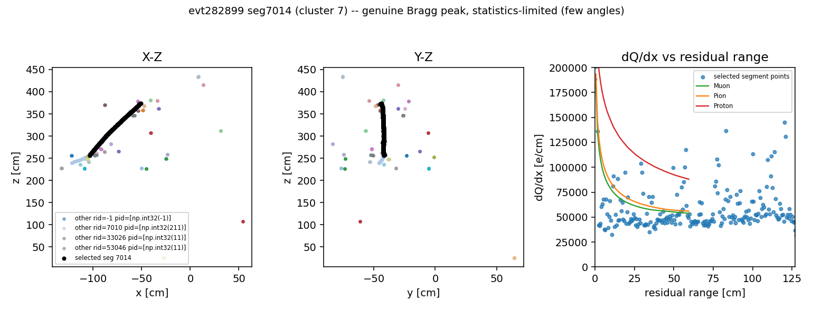

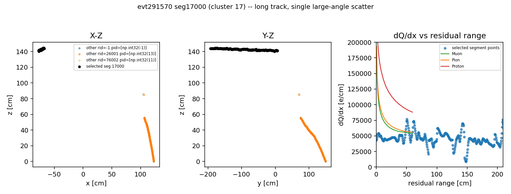

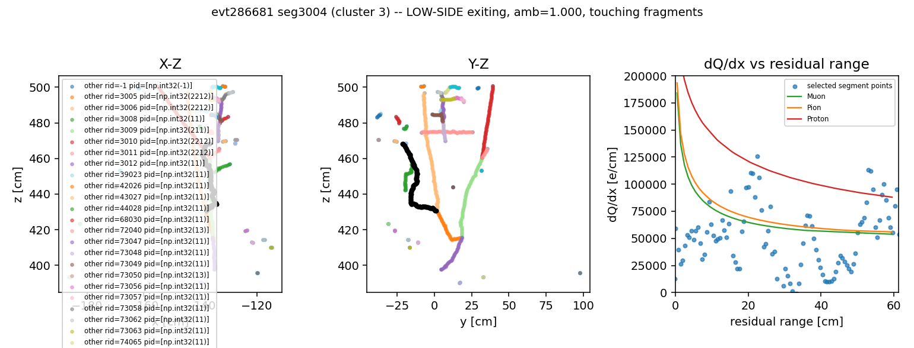
