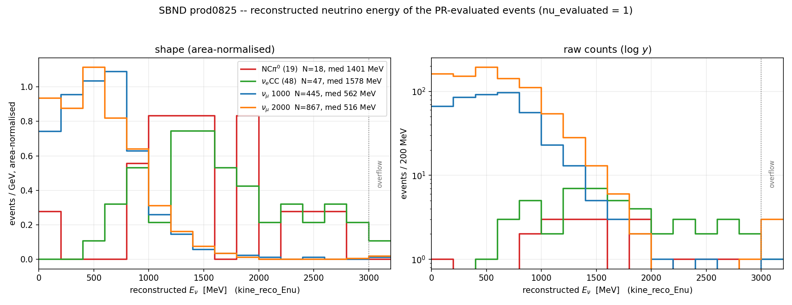
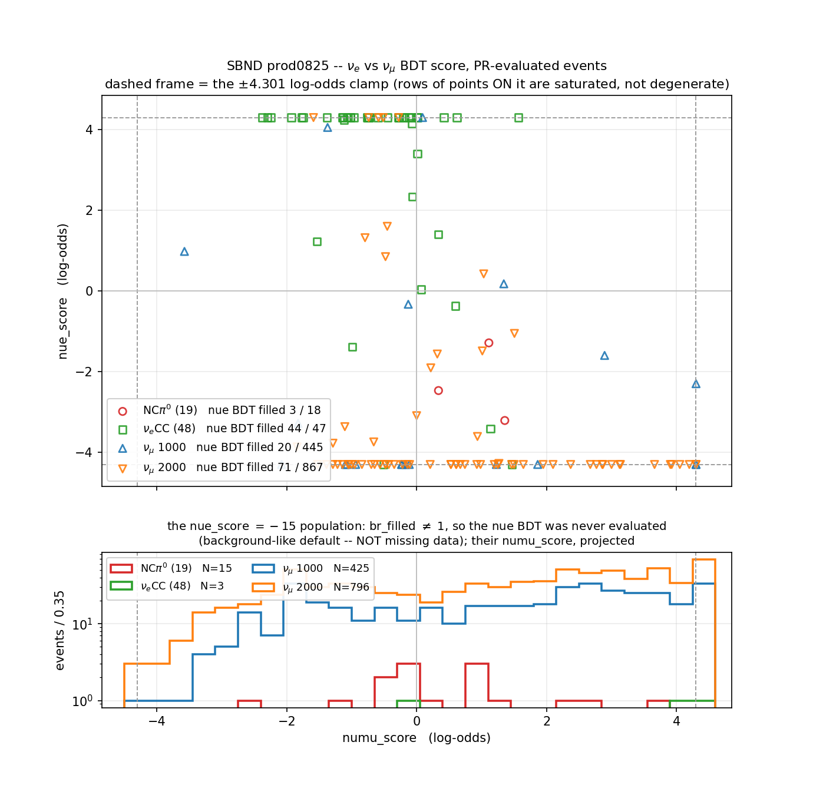
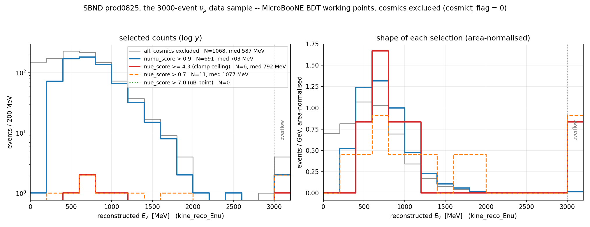
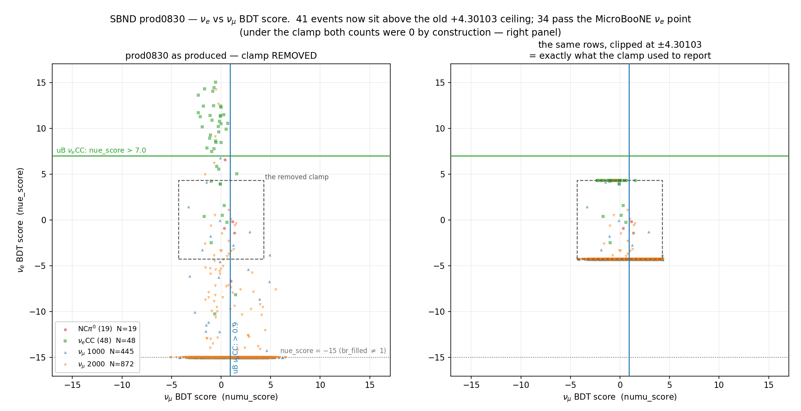
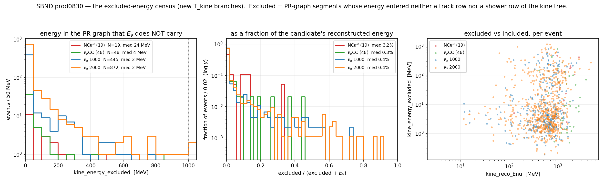
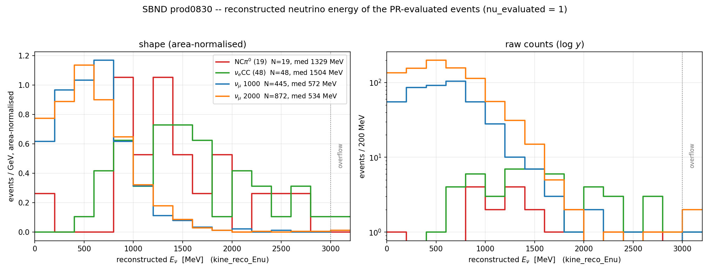
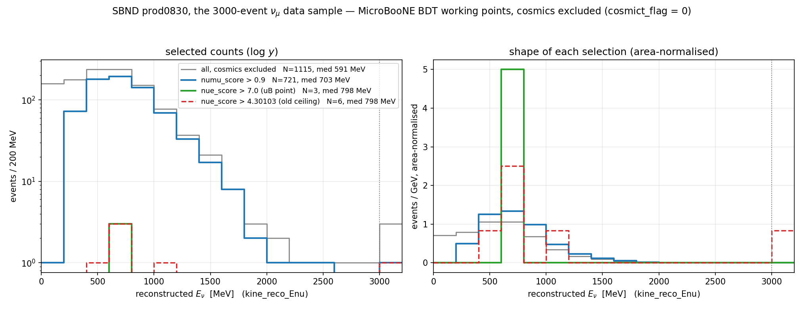

# 85 — Reconstructed energy and BDT scores of the four SBND production samples; the MicroBooNE working points; removing the score clamp and adding an excluded-energy variable (round 2)

Three figures over the **whole** `prod0825` PR product (3067 events, four
samples), the MicroBooNE νμ/νe BDT working points applied to them (§7 — the νe
one does **not** transfer, and why), and six Bee sets.

**Two rounds, and they have different natures — read the scope line of each.**

| round | sections | arm | code |
|---|---|---|---|
| **1** (2026-08-30, morning) | §1–§8 | `prod0825` | **none changed.** A read-out: `pr_scores_table.py` over `work-<sample>-prod0825`, then matplotlib. No knob moved, no A/B, no arm regenerated. |
| **2** (2026-08-30, §9) | §9 | `prod0830` | **two production changes**, owner-requested: the BDT score clamp §7.1 identified is removed, and T_kine gains an excluded-energy census. Not byte-identical, deliberately unknobbed, and the arm is re-produced. |

§9 supersedes §3, §5 and §7 wherever they quote a νe number or a Bee link;
the round-1 text is kept because those sets were hand-scanned as they stand
and a superseded measurement is still a record of what was measured.

## Repro block

```bash
cd wcp-porting-img/sbnd/sbnd_xin

# 1. the per-event score tables (T_tagger / T_kine scalars + nusel labels)
mkdir -p products/prod0825
for s in nuecc48 ncpi0 mcp1k mcp2k; do
  python3 pr_scores_table.py --root work-$s-prod0825 --sample $s \
      --out products/prod0825/$s-scores-prod0825.tsv
done

# 2. both figures, the summary table, and the three Bee pick lists
python3 scripts/analysis/d85_dists.py          # -> docs/85_dists/

# 3. the Bee zips (LOCAL; the upload below is a separate owner authorisation)
mkdir -p bee/d85
for c in cosmiclike nuelike neither; do
  python3 scripts/bee/make_pr_bee.py \
      -q work-mcp1k-grp0825   -q work-mcp2k-grp0825 \
      -p work-mcp1k-prod0825  -p work-mcp2k-prod0825 \
      -o bee/d85/d85-$c.zip $(cat docs/85_dists/d85-$c.txt)
  ./upload-to-bee.sh bee/d85/d85-$c.zip        # owner-authorised 2026-08-30
done

# 4. sec 7: the MicroBooNE working points, its figure and its three Bee sets
python3 scripts/analysis/d85b_cuts.py         # -> docs/85_dists/d85b-*
mkdir -p bee/d85b
python3 scripts/bee/make_pr_bee.py -q work-nuecc48-grp0825 -p work-nuecc48-prod0825 \
    --allow-unevaluated -o bee/d85b/d85b-nuecc-failnue.zip \
    $(cat docs/85_dists/d85b-nuecc-failnue.txt)
for c in ncpi0-numupass ncpi0-nearmiss; do
  python3 scripts/bee/make_pr_bee.py -q work-ncpi0-grp0825 -p work-ncpi0-prod0825 \
      -o bee/d85b/d85b-$c.zip $(cat docs/85_dists/d85b-$c.txt)
done

# 5. the fudge-flip caveat of sec 4, measured not assumed
for a in off98 onfudge98; do for s in nuecc48 ncpi0 mcp1k mcp2k; do
  python3 pr_scores_table.py --root work-pr132-$a-$s --sample $s \
      --out /home/xqian/tmp/d85/$a-$s.tsv
done; done
```

## 1. The samples, and what "the ones with PR" means

All four are **data** selections — there is no truth label anywhere in this
document, so "NCπ⁰" and "ν<sub>e</sub>CC" name the *sample selection*, not the
per-event interaction, and the two ν<sub>μ</sub> samples are beam data, not a
ν<sub>μ</sub>CC-truth subset.

| sample | source | events | provenance |
|---|---|---:|---|
| `ncpi0` | `input_files_reco1/extracted-ncpi0` | 19 | NC π⁰ sideband (doc 71 §3) |
| `nuecc48` | `extracted-2025fall-48evt-fsprod` | 48 | ν<sub>e</sub>CC-selected 2025-fall data (doc 71, doc pr/115) |
| `mcp1k` | `staged-mcp2025c-1000evt` | 1000 | MCP2025C reco1, first 1000 entries (doc 59) |
| `mcp2k` | `staged-mcp2025c-2nd-2000evt` | 2000 | MCP2025C reco1, 2nd 2000 entries |

**Population = `nu_evaluated == 1`.** That flag is set iff the PR log carries
`TaggerCheckNeutrino: selected main cluster …`, i.e. iff `TaggerInfo`/`KineInfo`
were filled for real. Anything else holds struct *defaults* run through the
BDTs and is blanked by `pr_scores_table.py` rather than reported — plotting it
would manufacture a spike at the sentinel values.

| | ncpi0 | nuecc48 | mcp1k | mcp2k |
|---|---:|---:|---:|---:|
| events in sample | 19 | 48 | 1000 | 2000 |
| **PR-evaluated** | **18** | **47** | **447** | **879** |
| …of which `cosmic-tagged` | 0 | 1 | 36 | 74 |
| − degenerate (§1.1) | 0 | 0 | 16 | 33 |
| − no `tracking-pr.root` row at all | 0 | 0 | 2 | 12 |
| **plotted** | **18** | **47** | **429** | **834** |

Three honest caveats on that table:

* the evaluated population is **not** a neutrino-purity cut — 110 of the 1326
  evaluated ν<sub>μ</sub>-sample events carry the chain's own `cosmic-tagged`
  event label, and they are in the histograms.
* 14 evaluated events (2 mcp1k, 12 mcp2k) have no `T_tagger`/`T_kine` values at
  all — not a blank energy field but a missing ROOT row; 8 of the 14 are
  cosmic-tagged. Counted as evaluated, absent from both figures.
* 49 more are degenerate — next section. They are what would otherwise make
  the first energy bin and one spike of the score plot look like physics.

### 1.1 The degenerate class: 49 evaluated events with no reconstruction

`TaggerCheckNeutrino` emits its `selected main cluster …` line — so
`nu_evaluated = 1` — even when the main it picked is an **unmerge shard a
couple of cm long**. `unmerge_bundle`/`unmerge_assoc` run *before* the tagger
and mint PR-internal cluster idents, so the tagger can select one of those
(this is exactly the non-joinability `pr_scores_table.py`'s own docstring
warns about). `KineInfo` then never fills — and, unlike the
`nu_evaluated == 0` case, **nothing blanks the row**.

Three signatures coincide *exactly* on these events:

| signature | value |
|---|---|
| `kine_reco_Enu` | `0.0` exactly |
| `nu_x/y/z_cm` | `(0, 0, 0)` exactly |
| `numu_score` | `-1.9416895` — the *same* value for every one of them (the BDT on a default feature vector) |

They number **16 mcp1k + 33 mcp2k = 49**, and **0 in ncpi0/nuecc48**. Median
selected-main length is 1.5–1.8 cm (max 52 cm); 47 of the 49 are
`cosmic-tagged`.

**They are excluded from both figures**, by the energy+vertex test (not by
hard-coding the score value) in `d85_dists.py:degenerate()`. Left in, all 49
would sit in the 0–200 MeV bin — a quarter of the mcp1k first bin — and in a
single 49-event spike at `numu_score = -1.94`. That is a reconstruction
failure mode worth its own investigation; it is not an energy spectrum.

## 2. Reconstructed neutrino energy



`kine_reco_Enu` (MeV) from `T_kine`, four samples overlaid. **Left** is
area-normalised — this is the panel to read for shape, because 18 against 834
events on a common count axis makes two of the four samples invisible.
**Right** is raw counts on a log *y*. The bin at 3000–3200 MeV is an explicit
**overflow** bin, not a clip: 1 nuecc48, 1 mcp1k and 3 mcp2k events live there
(max 4654 MeV). The 49 degenerate events of §1.1 are out.

| | ncpi0 | nuecc48 | mcp1k | mcp2k |
|---|---:|---:|---:|---:|
| N | 18 | 47 | 429 | 834 |
| min / median / max [MeV] | 126 / **1401** / 2768 | 428 / **1578** / 3948 | 11 / **575** / 3583 | 3 / **530** / 4654 |

The two ν<sub>μ</sub>-beam samples land on top of each other (median 575 vs
530 MeV) — expected, they are consecutive slices of the same MCP2025C data, and
their agreement is the only internal consistency check this figure offers. The
two hand-selected samples sit a factor 2.5–3 higher and are much flatter. That
is a **selection** statement, not a physics one: `ncpi0` and `nuecc48` were
picked as π⁰/EM-rich events, and the ncpi0 curve is 18 events across 15 bins,
so every structure in it is within its own Poisson noise.

## 3. ν<sub>e</sub> BDT score vs ν<sub>μ</sub> BDT score



Three features of this plot are real and would otherwise read as defects:

1. **`nue_score = -15` is not missing data.** `UbooneNueBDTScorer.cxx:1991`
   assigns it when `br_filled != 1` — "background-like default; matches
   prototype `default_val = -15`". The nue BDT was never evaluated for those
   events. It is the *majority* of the ν<sub>μ</sub> samples, so it gets its own
   bottom panel (their `numu_score`, projected) instead of crushing the top
   panel's scale.
2. **Both scores saturate at ±4.301.** Both are
   `log10((1+v)/(1-v))` of an xgboost output clamped to ±0.9999. The rows of
   points sitting exactly on the dashed frame are that clamp — and that clamp
   is a toolkit addition the prototype does not have, which is a bigger deal
   than a plotting artefact: see **§7.1**.
3. **`cosmic_flag` is not usable as a discriminator here** and is deliberately
   absent from the figure: it is 1 for 1307 of the 1326 evaluated
   ν<sub>μ</sub>-sample events (it is the struct default, and nothing in the
   scored path overwrites it). The live cosmic-side handle is the nusel
   `event_label`, which is what section 5 uses.

| | ncpi0 | nuecc48 | mcp1k | mcp2k |
|---|---:|---:|---:|---:|
| plotted (both scores, non-degenerate) | 18 | 47 | 429 | 834 |
| **nue BDT filled** (`> -15`) | **3** | **44** | **20** | **71** |
| median `numu_score` | +0.57 | −0.45 | +1.79 | +1.59 |
| at the `numu_score` clamp | 0 | 1 | 31 | 70 |

The separation the plot is for: the ν<sub>e</sub>CC sample fills the nue BDT
**44/47** and piles up at `nue_score = +4.30`, while the same BDT fills for only
**20/429** and **71/834** of the ν<sub>μ</sub>-sample events. Median
`numu_score` runs the other way (+1.79/+1.59 for the ν<sub>μ</sub> samples,
−0.45 for ν<sub>e</sub>CC). NCπ⁰ fills the nue BDT 3/18 and all three land
*negative* (−3.21 … −1.29) — on this sample of 18 the nue BDT is not being fooled
by the π⁰.

## 4. Caveat that matters: prod0825 predates the 0.84 fudge flip

`prod0825` was produced 2026-08-25. `kine_shower_fudge_factor` flipped
**0.80 → 0.84** in SBND production on 2026-08-29 (doc pr/132 §1, commit
`d9814518`). Since `E = … / recom / fudge`, current production returns
*slightly lower* shower energy than what is plotted above. Measured, per sample,
on the pr/132 98-event arms (`work-pr132-off98-*` = 0.80 vs
`work-pr132-onfudge98-*` = 0.84):

| sample | events | median Δ | range |
|---|---:|---:|---|
| nuecc48 | 48 | **−3.9 %** | −4.8 … −0.4 % |
| ncpi0 | 19 | **−3.5 %** | −4.4 … −0.3 % |
| mcp1k (98-subset) | 14 | **−3.4 %** | −32.4 … −0.9 % |
| mcp2k (98-subset) | 17 | **−3.0 %** | −4.7 … −0.8 % |

So the shift is a near-uniform few-percent compression, comparable across all
four samples — it does **not** distort the sample-to-sample comparison in §2,
and it is far below the 2.5–3× median separation between the hand-selected and
beam samples. Two things to keep straight:

* the ceiling is the naive `0.80/0.84 = ×0.952` (−4.8 %); events land above it
  in proportion to how much of their energy is shower-flagged.
* one event moved far more than scaling can explain — **mcp1k evt 64591,
  944.5 → 638.5 MeV (−32.4 %)**. That is the documented *indirect* coupling
  (pi0 acceptance → `calculate_kinematics` recompute → `kine_charge`,
  pr/126 §2.6/§4f), not a scale factor. It is one event of 98.
* the mcp1k/mcp2k rows are the EM-enriched 98-event scan subset, not a random
  draw from the 1000/2000, so treat them as an order of magnitude rather than
  the full-sample number.

Re-running the 3067-event chain at 0.84 was not done: at order 1 min/event it
is ~10 h at the standing job caps, which is not a reasonable cost for a
distribution plot. (That rate is a spot check, not a measured mean — prod0825
was pruned and only one of its per-event logs still carries its `Timer: Total`
line, at 77 s.) If the owner wants the figures at the exact current operating point, that
is the price and it should be a fresh tag (`prod0830`), never a write into
`prod0825` (M13).

## 5. Three Bee hand-scan sets from the ν<sub>μ</sub> samples

Drawn from the **1263** `mcp1k`+`mcp2k` events that are PR-evaluated, carry both
scores, and are not degenerate (§1.1) — the same population as the figures.
Event ids do not collide between mcp1k and mcp2k (checked: 0 overlaps), so each
category is one Bee set spanning both.

**These are rank-order cuts, not thresholds.** There is no documented
`numu_score` / `nue_score` operating point anywhere in these docs, so each
category is "the 10 most extreme by the named score" within its pool. Say so
before quoting any of them as a selection.

Charge cloud = `work-mcp{1k,2k}-grp0825` (Q/L), PR layers =
`work-mcp{1k,2k}-prod0825` — the same arm as both figures.

### 5.1 Cosmic-like — [Bee set 7b4ee14a](https://www.phy.bnl.gov/twister/bee/set/7b4ee14a-13c3-4a66-b1ff-abf0034c1df8/event/list/)

Pool: the **55** plotted events the chain itself labels `cosmic-tagged`
(in-beam bundle tagged TGM/STM/LM); picked the 10 lowest `numu_score`, i.e.
where the tagger and the BDT agree. That 55 is what is left of the **931**
cosmic-tagged events in the two samples: 931 → 110 evaluated (**821** never got
a selected main cluster at all — no scores; they would need
`--allow-unevaluated` to reach Bee) → 63 non-degenerate (**47** are the §1.1
shard class, unsurprisingly concentrated here) → **55** with a ROOT row (8 lack
one). So this set is the cosmic-like events the chain actually *scored*, not
the cosmic population.

| Bee | sample | run | event | numu | nue | E [MeV] | link |
|---:|---|---:|---:|---:|---:|---:|---|
| 0 | mcp2k | 18259 | 172262 | −3.588 | −15 | 347 | [event/0](https://www.phy.bnl.gov/twister/bee/set/7b4ee14a-13c3-4a66-b1ff-abf0034c1df8/event/0/) |
| 1 | mcp1k | 18255 | 401450 | −3.575 | +0.982 | 1609 | [event/1](https://www.phy.bnl.gov/twister/bee/set/7b4ee14a-13c3-4a66-b1ff-abf0034c1df8/event/1/) |
| 2 | mcp2k | 18259 | 172012 | −3.359 | −15 | 462 | [event/2](https://www.phy.bnl.gov/twister/bee/set/7b4ee14a-13c3-4a66-b1ff-abf0034c1df8/event/2/) |
| 3 | mcp2k | 18255 | 319275 | −3.168 | −15 | 514 | [event/3](https://www.phy.bnl.gov/twister/bee/set/7b4ee14a-13c3-4a66-b1ff-abf0034c1df8/event/3/) |
| 4 | mcp2k | 18255 | 75113 | −2.850 | −15 | 200 | [event/4](https://www.phy.bnl.gov/twister/bee/set/7b4ee14a-13c3-4a66-b1ff-abf0034c1df8/event/4/) |
| 5 | mcp2k | 18255 | 91609 | −2.653 | −15 | 49 | [event/5](https://www.phy.bnl.gov/twister/bee/set/7b4ee14a-13c3-4a66-b1ff-abf0034c1df8/event/5/) |
| 6 | mcp2k | 18255 | 414442 | −2.441 | −15 | 427 | [event/6](https://www.phy.bnl.gov/twister/bee/set/7b4ee14a-13c3-4a66-b1ff-abf0034c1df8/event/6/) |
| 7 | mcp2k | 18255 | 73038 | −2.243 | −15 | 51 | [event/7](https://www.phy.bnl.gov/twister/bee/set/7b4ee14a-13c3-4a66-b1ff-abf0034c1df8/event/7/) |
| 8 | mcp2k | 18255 | 287332 | −2.211 | −15 | 284 | [event/8](https://www.phy.bnl.gov/twister/bee/set/7b4ee14a-13c3-4a66-b1ff-abf0034c1df8/event/8/) |
| 9 | mcp1k | 18255 | 288327 | −1.961 | −15 | 523 | [event/9](https://www.phy.bnl.gov/twister/bee/set/7b4ee14a-13c3-4a66-b1ff-abf0034c1df8/event/9/) |

Bee 1 (evt 401450) is the odd one and worth a look first: cosmic-tagged, most
cosmic-like `numu_score` in the whole pool, and yet the nue BDT filled and
returned **+0.98** at 1609 MeV.

### 5.2 ν<sub>e</sub>CC-like inside the ν<sub>μ</sub> samples — [Bee set 7dfadf68](https://www.phy.bnl.gov/twister/bee/set/7dfadf68-bfe2-4d7c-8391-70a1d6b13912/event/list/)

Pool: the **1204** `nu-candidate` events; picked the 10 highest `nue_score`.
Six of the ten are *at* the +4.301 clamp, so their internal order is arbitrary —
they are tied, not ranked.

| Bee | sample | run | event | numu | nue | E [MeV] | link |
|---:|---|---:|---:|---:|---:|---:|---|
| 0 | mcp1k | 18255 | 64409 | +0.091 | **+4.301** | 1077 | [event/0](https://www.phy.bnl.gov/twister/bee/set/7dfadf68-bfe2-4d7c-8391-70a1d6b13912/event/0/) |
| 1 | mcp2k | 18255 | 75954 | −0.587 | **+4.301** | 753 | [event/1](https://www.phy.bnl.gov/twister/bee/set/7dfadf68-bfe2-4d7c-8391-70a1d6b13912/event/1/) |
| 2 | mcp2k | 18259 | 176502 | −1.589 | **+4.301** | 4600 | [event/2](https://www.phy.bnl.gov/twister/bee/set/7dfadf68-bfe2-4d7c-8391-70a1d6b13912/event/2/) |
| 3 | mcp2k | 18259 | 176533 | −0.515 | **+4.301** | 688 | [event/3](https://www.phy.bnl.gov/twister/bee/set/7dfadf68-bfe2-4d7c-8391-70a1d6b13912/event/3/) |
| 4 | mcp2k | 18255 | 291072 | −0.276 | **+4.301** | 830 | [event/4](https://www.phy.bnl.gov/twister/bee/set/7dfadf68-bfe2-4d7c-8391-70a1d6b13912/event/4/) |
| 5 | mcp2k | 18255 | 394167 | −0.738 | **+4.301** | 482 | [event/5](https://www.phy.bnl.gov/twister/bee/set/7dfadf68-bfe2-4d7c-8391-70a1d6b13912/event/5/) |
| 6 | mcp1k | 18255 | 386442 | −1.371 | +4.055 | 267 | [event/6](https://www.phy.bnl.gov/twister/bee/set/7dfadf68-bfe2-4d7c-8391-70a1d6b13912/event/6/) |
| 7 | mcp2k | 18255 | 281567 | −0.453 | +1.604 | 1897 | [event/7](https://www.phy.bnl.gov/twister/bee/set/7dfadf68-bfe2-4d7c-8391-70a1d6b13912/event/7/) |
| 8 | mcp2k | 18255 | 396222 | −0.795 | +1.321 | 4654 | [event/8](https://www.phy.bnl.gov/twister/bee/set/7dfadf68-bfe2-4d7c-8391-70a1d6b13912/event/8/) |
| 9 | mcp2k | 18259 | 47212 | −0.480 | +0.852 | 1342 | [event/9](https://www.phy.bnl.gov/twister/bee/set/7dfadf68-bfe2-4d7c-8391-70a1d6b13912/event/9/) |

Bee 2 and 8 are also the two highest-energy events in the entire ν<sub>μ</sub>
population (4600 and 4654 MeV) — worth checking whether the ν<sub>e</sub>-like
score and the energy have a common cause. Bee 9 (evt 47212) is the pr/120
backward-stem-guard event, already hand-scanned in that round.

### 5.3 ν<sub>μ</sub>-sample events that are neither — [Bee set f6c75e50](https://www.phy.bnl.gov/twister/bee/set/f6c75e50-8f04-4283-9ad5-ddac614add75/event/list/)

Pool: the **1120** `nu-candidate` events whose nue BDT never filled
(`nue_score = -15`); picked the 10 lowest `numu_score` — i.e. accepted as a
neutrino candidate by the chain, then rejected by the ν<sub>μ</sub> BDT and never
even offered to the ν<sub>e</sub> one. The first four are at the −4.301 clamp
and so are tied.

| Bee | sample | run | event | numu | nue | E [MeV] | link |
|---:|---|---:|---:|---:|---:|---:|---|
| 0 | mcp1k | 18255 | 391766 | **−4.301** | −15 | 837 | [event/0](https://www.phy.bnl.gov/twister/bee/set/f6c75e50-8f04-4283-9ad5-ddac614add75/event/0/) |
| 1 | mcp2k | 18255 | 99563 | **−4.301** | −15 | 1348 | [event/1](https://www.phy.bnl.gov/twister/bee/set/f6c75e50-8f04-4283-9ad5-ddac614add75/event/1/) |
| 2 | mcp2k | 18259 | 160031 | **−4.301** | −15 | 947 | [event/2](https://www.phy.bnl.gov/twister/bee/set/f6c75e50-8f04-4283-9ad5-ddac614add75/event/2/) |
| 3 | mcp2k | 18259 | 180698 | **−4.301** | −15 | 732 | [event/3](https://www.phy.bnl.gov/twister/bee/set/f6c75e50-8f04-4283-9ad5-ddac614add75/event/3/) |
| 4 | mcp2k | 18255 | 99284 | −4.123 | −15 | 13 | [event/4](https://www.phy.bnl.gov/twister/bee/set/f6c75e50-8f04-4283-9ad5-ddac614add75/event/4/) |
| 5 | mcp1k | 18255 | 62613 | −4.123 | −15 | 805 | [event/5](https://www.phy.bnl.gov/twister/bee/set/f6c75e50-8f04-4283-9ad5-ddac614add75/event/5/) |
| 6 | mcp2k | 18255 | 70766 | −3.928 | −15 | 660 | [event/6](https://www.phy.bnl.gov/twister/bee/set/f6c75e50-8f04-4283-9ad5-ddac614add75/event/6/) |
| 7 | mcp2k | 18255 | 93234 | −3.924 | −15 | 29 | [event/7](https://www.phy.bnl.gov/twister/bee/set/f6c75e50-8f04-4283-9ad5-ddac614add75/event/7/) |
| 8 | mcp2k | 18259 | 173450 | −3.800 | −15 | 788 | [event/8](https://www.phy.bnl.gov/twister/bee/set/f6c75e50-8f04-4283-9ad5-ddac614add75/event/8/) |
| 9 | mcp2k | 18255 | 321235 | −3.662 | −15 | 465 | [event/9](https://www.phy.bnl.gov/twister/bee/set/f6c75e50-8f04-4283-9ad5-ddac614add75/event/9/) |

Bee 4 and 7 carry `kine_reco_Enu` of **13** and **29 MeV** while still being
accepted as neutrino candidates — the two cheapest checks in this set for
whether the candidate is real at all.

## 7. The MicroBooNE BDT working points applied here

### 7.1 The νe working point does not transfer — the toolkit clamps the score

The two working points, as this repo records them
(`toolkit/clus/docs/tagger/tagger_validation_plan.md:229`, "representative
working points, e.g. nue_score > 7.0, numu_score > 0.9"), plus the cosmic
verdict `cosmict_flag == 0` (the OR of the ten cosmic tests,
`NeutrinoTaggerCosmic.cxx:1384`; **`cosmic_flag` is not this** — it is a BDT
input equal to `!cosmict_flag_9`, and it reads 1 on 1307 of 1326 events, §3).

Prototype and toolkit use the **same formula**,
`score = log10((1+v)/(1−v))` on the raw BDT output `v`. They differ in one
line: the toolkit **added a clamp** `v → [−0.9999, 0.9999]`
(`root/docs/examination/bdt-scorers-examination.md` Bug 1, marked fixed;
`UbooneNueBDTScorer.cxx:1986-1989`, `UbooneNumuBDTScorer.cxx:586-590`). The
prototype has none, so its range is bounded only by float precision: **≈ ±15**
— which is also why the "not filled" sentinel is `-15`, chosen to sit just
below the physical floor.

The clamp caps |score| at 4.301, and the two scorers disagree with each other
by one type:

| scorer | clamp variable | ceiling | seen in the data |
|---|---|---:|---:|
| `UbooneNueBDTScorer` | `float val1` | **4.3009362** | nue ceiling 4.300936 |
| `UbooneNumuBDTScorer` | `double val1` | **4.3010083** | numu clamp 4.301008 |

Two independent pieces of evidence, and they are worth keeping distinct.

**(a) The clamp is what bites, not a forest that saturates on its own.** If the
xgboost forest simply topped out just under 0.9999, the approach to the ceiling
would be empty and the pile-up would be its own natural endpoint. It is not:
both scores climb *continuously* to the ceiling and then hit a delta function.

| | distinct values in the approach | at the ceiling |
|---|---|---:|
| `nue_score` | 3.402, 4.055, 4.159, 4.242 | **38** at 4.300936 |
| `numu_score` | 24 distinct values, 4.182 … 4.297 | **98** at 4.301008 |

```bash
awk -F'\t' 'NR>1 && $15==1 && $24!="" && $24+0>3.0 && $24+0<4.4 {print $24}' \
    products/prod0825/*-scores-prod0825.tsv | sort -g | uniq -c   # $23 for numu
```

That is a live distribution being truncated.

**(b) The prototype really does exceed 4.301.**
`qlport/docs/perf-optimization.md:194` records uBooNE ev6786 at toolkit
`nue_score +4.30` vs **prototype +10.7**. That is one event, quoted inside a
perf-round note rather than a score-range study — it establishes *that* the
prototype goes past the toolkit ceiling, which is the load-bearing claim. The
**≈ ±15** figure is not measured here: it is inferred from the choice of `-15`
as the "background-like default", a value only meaningful if it sits below the
real floor.

**Consequence.** `nue_score > 7.0` requires `v > 0.9999998`; the clamp erases
everything above `v = 0.9999`. The cut therefore selects **0 events in all
four samples, by construction** — and the 32 of 47 νeCC events sitting at
exactly 4.300936 are precisely the ones whose true score is *somewhere above*
4.30, with no way to tell which of them would clear 7.0. That is the
information destroyed before it reaches `T_tagger`: not the existence of a
signal region, but all ordering inside it.

This was **reported, not fixed** at the time: removing the clamp changes
production output unconditionally (escalation rules 1 and 4). **The owner then
decided to remove it — see §9.** Everything below this line is the
*clamped* read-out and is superseded there; it is kept because the Bee sets of
§7.3–§7.5 were built from it. Two corrections §9 makes to the text above: the
prototype range is **±16.25562**, computed, not the "≈ ±15" inferred here; and
the toolkit's own `float`-vs-`double` split is a second, older divergence
independent of the clamp. Until it was decided, this document used the only
reachable stand-in,

> **NUE_SEL** = `nue_score >= 4.30` — the clamp ceiling, a **strict superset**
> of the MicroBooNE selection

and reports `nue_score > 0.7` (the *other* number in that same validation-plan
doc, §4.1.4 — the doc is internally inconsistent) beside it as a bracket. The
νμ working point is unaffected: 0.9 ⇒ `v > 0.776`, far below the clamp.

### 7.2 The νμ sample under each working point



The 3000-event νμ data sample (mcp1k + mcp2k), **cosmics excluded**
(`cosmict_flag == 0`), same population as §1 otherwise.

| selection | mcp1k | mcp2k | total | median E<sub>ν</sub> |
|---|---:|---:|---:|---:|
| all, cosmics excluded | 359 | 709 | **1068** | 587 MeV |
| `numu_score > 0.9` | 240 | 451 | **691** | 703 MeV |
| `nue_score >= 4.30` (ceiling) | 1 | 5 | **6** | 792 MeV |
| `nue_score > 0.7` | 3 | 8 | **11** | 1077 MeV |
| `nue_score > 7.0` (uB point) | 0 | 0 | **0** | — |

195 of the 1263 plotted νμ-sample events are cosmic-flagged and drop out
before any BDT cut. The νμ selection keeps 65 % of what is left and pushes the
median up 587 → 703 MeV, as a CC selection should. The νe rows are the §7.1
story in numbers: 6 events at the ceiling, 0 at the working point that is
supposed to define the selection.

### 7.3 νeCC events the νe selection does NOT keep — [Bee set 4e5c2cda](https://www.phy.bnl.gov/twister/bee/set/4e5c2cda-0b88-46e6-90ab-0151771da5df/event/list/)

**16 of 48** fail `nue_score >= 4.30`. (Under the literal MicroBooNE cut all
48 fail — §7.1 — so this set is the meaningful reading of the question.)

| Bee | run | event | numu | nue | E [MeV] | label | link |
|---:|---:|---:|---:|---:|---:|---|---|
| 0 | 18342 | 30504 | −0.989 | −1.388 | 1251 | nu-candidate | [event/0](https://www.phy.bnl.gov/twister/bee/set/4e5c2cda-0b88-46e6-90ab-0151771da5df/event/0/) |
| 1 | 18304 | 38856 | +0.597 | −0.367 | 1280 | nu-candidate | [event/1](https://www.phy.bnl.gov/twister/bee/set/4e5c2cda-0b88-46e6-90ab-0151771da5df/event/1/) |
| 2 | 18259 | 52672 | −0.509 | **−4.301** | 928 | nu-candidate | [event/2](https://www.phy.bnl.gov/twister/bee/set/4e5c2cda-0b88-46e6-90ab-0151771da5df/event/2/) |
| 3 | 18255 | 69314 | +3.960 | **−15** | 1499 | nu-candidate | [event/3](https://www.phy.bnl.gov/twister/bee/set/4e5c2cda-0b88-46e6-90ab-0151771da5df/event/3/) |
| 4 | 18259 | 111412 | +0.072 | +0.037 | 1019 | nu-candidate | [event/4](https://www.phy.bnl.gov/twister/bee/set/4e5c2cda-0b88-46e6-90ab-0151771da5df/event/4/) |
| 5 | 18259 | 116962 | +1.469 | **−4.301** | 773 | **cosmic-tagged** | [event/5](https://www.phy.bnl.gov/twister/bee/set/4e5c2cda-0b88-46e6-90ab-0151771da5df/event/5/) |
| 6 | 18255 | 122660 | −0.064 | +2.339 | 1334 | nu-candidate | [event/6](https://www.phy.bnl.gov/twister/bee/set/4e5c2cda-0b88-46e6-90ab-0151771da5df/event/6/) |
| 7 | 18264 | 137238 | +1.136 | −3.415 | 739 | nu-candidate | [event/7](https://www.phy.bnl.gov/twister/bee/set/4e5c2cda-0b88-46e6-90ab-0151771da5df/event/7/) |
| 8 | 18255 | 163543 | +0.332 | +1.402 | 1270 | nu-candidate | [event/8](https://www.phy.bnl.gov/twister/bee/set/4e5c2cda-0b88-46e6-90ab-0151771da5df/event/8/) |
| 9 | 18255 | 196649 | −1.117 | +4.242 | 1614 | nu-candidate | [event/9](https://www.phy.bnl.gov/twister/bee/set/4e5c2cda-0b88-46e6-90ab-0151771da5df/event/9/) |
| 10 | 18255 | 235435 | −0.210 | **−15** | 428 | nu-candidate | [event/10](https://www.phy.bnl.gov/twister/bee/set/4e5c2cda-0b88-46e6-90ab-0151771da5df/event/10/) |
| 11 | 18255 | 389538 | **+4.301** | **−15** | 986 | nu-candidate | [event/11](https://www.phy.bnl.gov/twister/bee/set/4e5c2cda-0b88-46e6-90ab-0151771da5df/event/11/) |
| 12 | 18355 | 400474 | −0.069 | +4.159 | 1799 | nu-candidate | [event/12](https://www.phy.bnl.gov/twister/bee/set/4e5c2cda-0b88-46e6-90ab-0151771da5df/event/12/) |
| 13 | 18255 | 423981 | +0.013 | +3.402 | 2133 | nu-candidate | [event/13](https://www.phy.bnl.gov/twister/bee/set/4e5c2cda-0b88-46e6-90ab-0151771da5df/event/13/) |
| 14 | 18255 | 447477 | — | — | — | nu-candidate (no PR evaluation) | [event/14](https://www.phy.bnl.gov/twister/bee/set/4e5c2cda-0b88-46e6-90ab-0151771da5df/event/14/) |
| 15 | 18255 | 469665 | −1.534 | +1.225 | 876 | nu-candidate | [event/15](https://www.phy.bnl.gov/twister/bee/set/4e5c2cda-0b88-46e6-90ab-0151771da5df/event/15/) |

Three of these are worth a look first: **69314** and **389538** have the νe BDT
*never filled* (`-15`) while the νμ BDT is strongly positive (+3.96, +4.30 at
the clamp) — they were routed away from the νe path entirely; **116962** is a
νeCC-sample event the chain labels `cosmic-tagged`; and **196649 / 400474**
(+4.24, +4.16) miss the ceiling by less than 0.06, i.e. by the clamp's own
rounding rather than by anything physical.

### 7.4 NCπ⁰ events passing the νμ selection — [Bee set 0133c243](https://www.phy.bnl.gov/twister/bee/set/0133c243-b77e-45d1-b57c-55303db14b8a/event/list/)

**8 of 18** evaluated NCπ⁰ events pass `numu_score > 0.9`; all 8 are
non-cosmic (`cosmict_flag = 0`).

| Bee | run | event | numu | nue | E [MeV] | link |
|---:|---:|---:|---:|---:|---:|---|
| 0 | 18259 | 18625 | +2.409 | −15 | 1478 | [event/0](https://www.phy.bnl.gov/twister/bee/set/0133c243-b77e-45d1-b57c-55303db14b8a/event/0/) |
| 1 | 18345 | 21073 | +0.932 | −15 | 1019 | [event/1](https://www.phy.bnl.gov/twister/bee/set/0133c243-b77e-45d1-b57c-55303db14b8a/event/1/) |
| 2 | 18255 | 56982 | +1.112 | −1.285 | 1231 | [event/2](https://www.phy.bnl.gov/twister/bee/set/0133c243-b77e-45d1-b57c-55303db14b8a/event/2/) |
| 3 | 18255 | 71372 | +2.626 | −15 | 2597 | [event/3](https://www.phy.bnl.gov/twister/bee/set/0133c243-b77e-45d1-b57c-55303db14b8a/event/3/) |
| 4 | 18255 | 142421 | **+3.602** | −15 | 2768 | [event/4](https://www.phy.bnl.gov/twister/bee/set/0133c243-b77e-45d1-b57c-55303db14b8a/event/4/) |
| 5 | 18255 | 180801 | +1.356 | −3.210 | 1324 | [event/5](https://www.phy.bnl.gov/twister/bee/set/0133c243-b77e-45d1-b57c-55303db14b8a/event/5/) |
| 6 | 18261 | 285567 | +0.987 | −15 | 1935 | [event/6](https://www.phy.bnl.gov/twister/bee/set/0133c243-b77e-45d1-b57c-55303db14b8a/event/6/) |
| 7 | 18255 | 506746 | +1.112 | −15 | 1926 | [event/7](https://www.phy.bnl.gov/twister/bee/set/0133c243-b77e-45d1-b57c-55303db14b8a/event/7/) |

Bee 4 (**142421**, `numu_score +3.60`, 2768 MeV) is the strongest νμ-like NCπ⁰
event in the sample and the same event flagged in the earlier rescan as "a
major shower not tagged as shower" — the two observations are likely the same
defect seen from two sides.

### 7.5 NCπ⁰ passing cosmic *or* the νe selection — **empty**, and the nearest misses — [Bee set b6e6fefd](https://www.phy.bnl.gov/twister/bee/set/b6e6fefd-df80-4c81-be3d-2da90318d74e/event/list/)

**0 of 18.** No NCπ⁰ event is cosmic-tagged by either handle (`cosmict_flag`
is 0 on all 18; the nusel `event_label` is `nu-candidate` on all 19), and none
reaches `nue_score >= 4.30`. Only **three** have the νe BDT filled at all, and
all three are negative — so on this sample the νe selection is not being fooled
by π⁰s, with the §7.1 caveat that the ceiling proxy is looser than the real cut
and the sample is 19 events.

The set below is those three nearest misses, not a passing selection:

| Bee | run | event | numu | nue | E [MeV] | link |
|---:|---:|---:|---:|---:|---:|---|
| 0 | 18255 | 56982 | +1.112 | −1.285 | 1231 | [event/0](https://www.phy.bnl.gov/twister/bee/set/b6e6fefd-df80-4c81-be3d-2da90318d74e/event/0/) |
| 1 | 18259 | 37112 | +0.336 | −2.468 | 1539 | [event/1](https://www.phy.bnl.gov/twister/bee/set/b6e6fefd-df80-4c81-be3d-2da90318d74e/event/1/) |
| 2 | 18255 | 180801 | +1.356 | −3.210 | 1324 | [event/2](https://www.phy.bnl.gov/twister/bee/set/b6e6fefd-df80-4c81-be3d-2da90318d74e/event/2/) |

## 8. What this document is not

* **Not efficiency or purity.** No truth is used, no selection cut is applied
  beyond `nu_evaluated == 1` and the §1.1 degenerate cut, and the plotted
  population still contains 55 chain-labelled cosmics in the two
  ν<sub>μ</sub> samples (56 across all four). Nothing here says how well the BDTs work.
* **Not the current operating point** — §4. Add ~3–4 % downward to every energy
  to reach production as of 2026-08-30.
* **Not a MicroBooNE-equivalent selection** — §7.1. The νμ working point
  transfers; the νe one is unreachable under the toolkit's score clamp, and
  every νe number *in round 1* uses a strictly looser stand-in. **§9 removes
  the clamp and applies the real cut**; this bullet describes §1–§7 only.
* **Not a gate.** No A/B, no hash comparison, no claim of byte-identicality is
  made or needed: the arms were read, not produced.

## 9. Round 2 — the clamp removed, an excluded-energy variable added, the arm re-produced

Round 1 ended by *reporting* the score clamp of §7.1 and not fixing it, on
escalation rules 1 and 4. The owner then asked for two production-quality
changes and a re-production:

> 1. remove the clamp of v, so that this would be consistent with the prototype
> 2. … for the parts not included in the Enu, it would be useful to have another
>    variable Excluded_Energy or something to calculate those and store in the TKine

Both are in, both are **unconditional** — no default-OFF knob, because a knob
that kept the clamp would defeat the request — and the four samples are
re-produced as `prod0830`.

### Repro (round 2)

```bash
# toolkit: four commits, then build + install + the M1 freshness proof
#   59f75bb8  root: remove the BDT score clamp
#   546f52a8  clus: add the excluded-energy census to T_kine
#   bd99f443  clus: fix the census counting leftover showers twice  (§9.1.1)
#   23129773  root: correct the quoted ceiling to 16.25562
wcbuild                                     # rc=0; see §9.1.2 on the retries
./build/root/wcdoctest-root                 # 4030/4030
./build/clus/wcdoctest-clus                 # 2579/2579

cd wcp-porting-img/sbnd/sbnd_xin
# Pin the binary: a concurrent session shares local/lib, and a wcbuild of
# theirs mid-run would build half this arm with different bytes (§9.3).
cp -a /nfs/data/1/xqian/toolkit-dev/local/lib/. /home/xqian/tmp/prod0830-libsnap/
export LD_LIBRARY_PATH=/home/xqian/tmp/prod0830-libsnap:$LD_LIBRARY_PATH

# stage B only, from the SAME Q/L input prod0825 read (M11), fresh tag (M13)
for s in nuecc48 ncpi0 mcp1k mcp2k; do
  PR_GROUP_SIZE=16 PR_JOBS=16 PR_EXTRA_STAGES=pr_display \
      ./run_pr_chain_batch.sh work-$s-grp0825 work-$s-prod0830 data
  python3 pr_scores_table.py --root work-$s-prod0830 --sample $s \
      --out products/prod0830/$s-scores-prod0830.tsv
done

python3 scripts/analysis/d85r2_prod0830.py        # -> docs/85r2_dists/
scripts/bee/build_d85r2_bee.sh                    # -> bee/d85r2/ (LOCAL only)
```

### 9.1 What changed

**(1) The log-odds transform** (`toolkit 59f75bb8`). Both scorers clamped the
forest output `v` to ±0.9999 before `score = log10((1+v)/(1−v))`. Gone. The
νe scorer additionally carried `v` in a `float`; that narrowing predates the
clamp, caps |score| near 7.5 on its own, and is also gone — `eval_xgb()`
already returns a `double`, and the prototype declares `double val1` at both
sites (`NeutrinoID_nue_bdts.h:300`, `NeutrinoID_numu_bdts.h:94`).

The **one** guard kept is the degenerate one the transform actually needs, and
it is the reason this is not simply a deletion. `TmvaGradForest::evaluate`
returns `tanh(sum)`, which rounds to **exactly** 1.0 in `double` once
`sum > ~18.4` — `log10(2/0) = +inf` — and returns the **−999** sentinel when
any input variable is NaN, which makes the ratio negative and the log `NaN`.
Either lands non-finite in a `T_tagger` float branch and in every downstream
cut. `bdt_log_odds_score` (`TmvaGradForest.h/.cxx`) pulls `|v| ≥ 1` and
non-finite `v` to the neighbouring double: a **1.1e-16** move, versus the
clamp's move of 1e-4, and it logs every hit. So the hazard the clamp was added
for stays closed while the live distribution is untouched.

Resulting range: **±16.25562** (`log10(2 / 2⁻⁵³)`). This *replaces* §7.1's
"≈ ±15", which was inferred from the `-15` sentinel rather than computed —
the sentinel does sit below the floor, but the floor is −16.25562, not −15.

**(2) `T_kine` gains five branches** (`toolkit 546f52a8`), filled at the end of
`fill_kine_tree`:

| branch | meaning |
|---|---|
| `kine_energy_excluded` | MeV; `_main + _other` |
| `kine_energy_excluded_main` | MeV; the part in the **same cluster** as the main vertex |
| `kine_energy_excluded_other` | MeV; the part in a **different** cluster |
| `kine_n_excluded` | segments behind the sums |
| `kine_energy_flagged` | MeV; the rows `kine_energy_included` flags `!= 1` |

**"Excluded" is defined against what the sum actually consumed**, not against a
flag: a PR-graph segment whose kinetic energy entered *neither* a
`push_segment_kine` row *nor*, as a member, a `push_shower_kine` row.
Membership is recorded inside those two helpers rather than reused from
`used_segments`, which is pre-seeded with every shower's members including
showers the walk never counts — reusing it would have understated the answer.

**`kine_energy_flagged` is deliberately not part of that sum**, and this is the
one thing worth reading twice. `kine_energy_included` is named as though it
gates the energy sum. It does not, in either codebase: `kine_reco_Enu` sums
`kine_energy_particle` **unconditionally** (`NeutrinoKinematics.cxx`, "Total
reconstructed neutrino energy"; prototype `NeutrinoID_kine.h:249-256`). Rows
flagged `!= 1` are *inside* `kine_reco_Enu`. The variable is reported beside
the excluded sum so the two can never be mistaken for each other.

The block is read-only with respect to the reconstruction: it runs after the
Enu sum, appends to no `kine_*` vector, writes only the new scalars, and
compares clusters by **id**, never by pointer order. The `T_kine` *schema*
does change — unlike the `nu_per_bundle` and `mcs_output` blocks these
branches are unknobbed, because an arm that carries them must be readable as
one.

**Three scope limits, stated rather than discovered later.**

1. **It is a segment-level sum.** For an *uncounted shower* it adds up the
   member segments' fitted kinetic energies, not the shower's charge-based
   `kine_best` — which is the quantity `kine_reco_Enu` would have used had the
   shower been admitted. The two differ. Read `kine_energy_excluded` as "KE
   carried by graph segments the sum never consumed", not as "the Enu this
   candidate would have had".
2. **Segments with no fitted particle contribute zero**, so the variable is a
   floor on unconsumed *reconstructed* energy and says nothing about charge
   with no track fit at all.
3. **The PR graph is not the neutrino.** It spans the clusters the tagger
   associated with the candidate, and on data that includes over-clustered
   cosmic activity. `kine_energy_excluded` is therefore an **upper bound** on
   "energy this neutrino lost", not an estimate of it; `_main` (same cluster
   as the vertex) is the part most defensibly the candidate's own. A
   distance- or direction-gated variant is the obvious next refinement if the
   owner wants the narrower quantity — deliberately not invented here.

### 9.1.1 The census's own bug, and why the first `prod0830` was thrown away

**Symptom.** The first prod0830 attempt reached nueCC48 and NCπ⁰ before this
was caught. Its excluded energies looked like a physics result and were not
one: NCπ⁰ median excluded **550.7 MeV, 32 % of the candidate's reconstructed
energy**, over a median of 44 segments. That number is wrong and appears
nowhere else in this document.

**Root cause.** `546f52a8` recorded "what the Enu sum consumed" *inside* the
two push helpers. There is a third site: the **leftover shower pass**
("Remaining showers not yet attached to the traversal above") is a full inline
duplicate of `push_shower_kine` and never calls it. Every shower admitted
there was summed into `kine_reco_Enu` **and then counted again as excluded** —
precisely the thing the variable is defined not to contain.

**Why it hid.** Nothing about the output looks wrong. The excluded energy is
supposed to be a number nobody has seen before, so "larger than expected" is
not a signal, and NCπ⁰ being shower-rich makes a large value *plausible*. The
only reason it did not ship is that the census log line carries counters that
have to be consistent with each other: on SBND ncpi0 114446 it printed
`n_counted=1` against a **five-row** kine tree.

**Fix** (`bd99f443`). Not a third recording site — "remember to record at
every push site" is the invariant that just failed. The shower half of the
counted set is **derived once**, at the census, from `used_showers`: all three
push sites insert into it immediately after pushing their row (`:301`, `:369`,
`:583`), and a shower's `kine_best` covers all of its members, so the
derivation is exact and does not depend on which site ran.
`push_shower_kine` now records nothing. The log line gains `n_kine_rows` and
`n_used_showers`, the two counters that make the inconsistency obvious.

**Verification.** The two events that exposed it, re-run:

| event | excluded before → after | `n_excluded` | counters after |
|---|---|---|---|
| ncpi0 114446 | 12.0 → **5.0** MeV | 6 → 2 | `n_counted=5, n_kine_rows=5, n_used_showers=4` |
| ncpi0 105946 | 540.3 → **149.5** MeV | 51 → 8 | `n_counted=44, n_kine_rows=18, n_used_showers=17` |

3.6× on 105946. The partial arm is parked as `void-prod0830partial-<s>` and
the campaign was re-run from scratch. `kine_reco_Enu` is unaffected in both
attempts — the census never touches it.

### 9.1.2 Two build-mechanics notes, for the next person

Both cost time and neither is a code defect:

* `wcdoctest-root` failed to link with `undefined reference to
  bdt_log_odds_score` even though `build/root/libWireCellRoot.so` **had** the
  symbol. The test links the **installed** lib, so the first build after
  adding a symbol needs `./wcb install --targets=WireCellRoot` before the test
  target can link — the ordinary `wcbuild` cycle deadlocks on itself once.
* The same shape recurred as `undefined reference to nue_tagger` from
  `local/lib/libWireCellClus.so`. Not M3's "file too short" and not fixed by
  re-running: the installed lib was 5 MB **smaller** than the freshly built
  one and 17 s older, i.e. an install that raced its own build. `./wcb
  install` on its own fixed it. Diagnose this by comparing `nm -C` on
  `build/<pkg>/lib*.so` against `local/lib/lib*.so`, not by reading the error.

### 9.2 Why the clamp was there — the owner's question, answered

It was a **bug fix, and an over-broad one**. It arrived in `9834d25f`
(2026-04-12, "root: fix 21 bugs …"), whose changelog line is *"BDT scorers:
log-odds division by zero"*, from the audit at
`root/docs/examination/bdt-scorers-examination.md` **Bug 1**:

> The log-odds transformation … produces `+inf` when `val1 == 1.0` … **The
> prototype code (using `TMath::Log10`) would have the same issue, so this may
> be a known limitation, but a clamp like `val1 = std::clamp(val1, -0.9999,
> 0.9999)` would be safer.**

So the divergence from the prototype was deliberate and knowing — the audit
says as much in the same sentence — and the hazard it names is real (§9.1
shows both `v == 1` and the `-999` sentinel are reachable). What went wrong is
the **magnitude**: the singularity is at `|v| = 1`, and the guard was placed at
`0.9999`, twelve orders of magnitude short of it in the quantity that matters
(`1 − v`). That does not guard a distribution, it truncates one. The suggested
value was taken from the audit verbatim, with no measurement of where the live
scores actually sat.

Two consequences, both invisible until §7.1 measured them: MicroBooNE's
`nue_score > 7.0` selected **zero events by construction**, and every
strongly-signal-like event was flattened onto a single value with its ordering
destroyed. The float narrowing in the νe scorer is older still and was never
flagged at all.

### 9.3 The arm

`work-<sample>-prod0830`, the same 3067 events, **stage B only** from the same
`work-<sample>-grp0825` Q/L input `prod0825` read — so the two arms cannot
differ through their input (M11), and no imaging or Q/L was regenerated.

`prod0830` also inherits every SBND config flip shipped between 08-25 and
08-30 (the 0.84 shower fudge of §4, the pi0 round-3 trio). **A
prod0825-vs-prod0830 diff is therefore not a clamp measurement**, and none is
used as one. The clamp is isolated exactly and without a second arm instead:
clamping `v` at ±0.9999 is, because the transform is monotone, *the same map*
as clipping the **score** at ±4.30103. So the clamped counterfactual is
`clip(score, ±4.30103)` computed from prod0830's own rows — that is the right
panel of the figure in §9.4, and every clamp claim below rests on it. (Exact
for `numu_score`; for `nue_score` it reproduces the old value to ~1e-5 rather
than exactly, because the old code also rounded `v` to `float` before
clamping.)

**A concurrent session shares this tree**, and that needed two guards rather
than one assurance. It was mid-round on the pr/132 K16/K17 shower knobs
throughout, and committed K17 (`a58e78e4`) while this arm was running.

*Config.* Its knobs are `null`-defaulted and key-suppressed, so the compiled
config is unaffected — checked directly, on a per-event compiled JSON of this
arm, after its last edit to `wct-pr-perevt.jsonnet`:
`shower_em_backext_perp_cm` **absent**, `shower_em_backext_len_cm` **absent**,
`shower_em_collinear_{deg,dis_cm,host_mev}` **absent**; the shipped production
flips all present at their production values —
`kine_shower_fudge_factor = 0.84`, `pi0_readmit_retyped = true`,
`pi0_admit_type3 = true`, `pi0_attached_partner_min_mev = 28`,
`stem_backfill_back_dvtx = 45`, `shower_pass4_prune_gap2 = 25`.

*Binary.* A config proof does not cover this. `wire-cell` loads plugins from
the shared `local/lib`, one `dlopen` per group job at job start, so **a
`wcbuild` of theirs part-way through would have built half this arm with
different bytes and left nothing in the output to say so** — a silent
two-binary arm, which is worse than a failure. `local/lib` was therefore
snapshotted to a private directory and `LD_LIBRARY_PATH` pointed at it, so
every group job of this arm loads the same file. Verified in the running
process, not assumed: `/proc/<pid>/maps` of a live group job shows
`/home/xqian/tmp/prod0830-libsnap/libWireCellClus.so`, and the snapshot's md5
is re-checked when the campaign ends. The pinned binary is toolkit
`bd99f443` (`23129773` on top of it is comment- and test-only).

### 9.4 The population, and the score plane with the clamp gone

3067 events, **rc=0 on every one**, four samples, one binary. Population is
§1's — `nu_evaluated == 1` minus the §1.1 degenerate class, whose test is
imported from `d85_dists.py` so the two rounds cannot drift apart.

| | ncpi0 | nuecc48 | mcp1k | mcp2k | all |
|---|---:|---:|---:|---:|---:|
| events | 19 | 48 | 1000 | 2000 | 3067 |
| PR-evaluated | 19 | 48 | 461 | 905 | 1433 |
| − degenerate (§1.1) | 0 | 0 | 16 | 33 | 49 |
| **scored** | **19** | **48** | **445** | **872** | **1384** |
| median E<sub>ν</sub> [MeV] | 1329 | 1504 | 572 | 534 | — |

Evaluated counts move against §1 (18→19, 47→48, 447→461, 879→905) — that is
the config flips of §9.3, not the clamp, which cannot change whether an event
evaluates. The degenerate class is **identically 16 + 33 = 49**, the same
events as round 1: a reconstruction failure the flips did not touch.



The left panel is the arm as produced; the right is the **same rows** clipped
at ±4.30103, i.e. exactly what the clamp reported (§9.3). Read them as
before-and-after with no other difference, because there is none.

| | count |
|---|---:|
| events above the old +4.30103 νe ceiling | **41** |
| …passing MicroBooNE's `nue_score > 7.0` | **34** |
| events above the old +4.30103 νμ ceiling | **110** |
| `nue_score` exactly −15 (`br_filled != 1`) | 1242 of 1384 |
| `nue_score` in (−16.26, −14.9) and **not** the sentinel | **0** |

Two things worth saying plainly.

**The νe working point now separates the samples the way a working point
should.** 31 of 48 νeCC-selected events pass `nue_score > 7.0`; 0 of 19 NCπ⁰
do; 3 of 1317 νμ-sample events do. Under the clamp all four numbers were 0.
This is not an efficiency measurement — there is no truth here (§8) — but a
cut that selected nothing now selects 65 % of the νe-selected sample and
0.2 % of the νμ beam sample, and that ordering is the thing the clamp
destroyed.

**The −15 sentinel is now inside the physical range and that is a latent
hazard, measured rather than assumed.** With |score| reaching 16.26, a real
background-like score can fall below −15 and be indistinguishable from "the
νe BDT never ran". In these 1384 events it does not happen once — every row
below −14.9 is exactly −15. So the collision is real in principle and empty
in practice on this arm. Code that means "not filled" should nevertheless
test equality with −15, not `< -14.9`; round 1's `d85_dists.py` used the
latter and `d85r2_prod0830.py:unfilled()` no longer does.

### 9.5 The excluded-energy census — the kine-side denominator pr/131 could not build



| sample | median excluded | median excluded / (excluded + E<sub>ν</sub>) |
|---|---:|---:|
| ncpi0 | 23.8 MeV | **3.2 %** |
| nuecc48 | 3.7 MeV | **0.27 %** |
| mcp1k | 2.1 MeV | **0.40 %** |
| mcp2k | 2.2 MeV | **0.44 %** |

**This is the measurement doc pr/131 named and could not make.** That round
put a denominator under the *PF* tree — 0.77 % of near-candidate
reconstructed charge reaches no PF output — and listed under *What is NOT
established*: "**No kine-side denominator.** See §5. Everything here is the
PF tree", because "the 0.77 % is 'reaches no PF output', not 'missing from
Enu'". The five new branches are that kine-side number, per candidate, on
every event. It lands at **0.3–3.2 %**, the same order as the PF-side 0.77 %
while gating differently — which is the corroboration to want, not an
identity to expect.

The distribution is steeply falling with a long tail: the median event is
missing single-MeV crumbs, and the tail is where the variable earns its
keep. The NCπ⁰ sample is an order of magnitude higher than the others
(3.2 % against 0.3–0.4 %), consistent with π⁰-rich topologies scattering EM
material the walk does not reach — but see scope limit 3 of §9.1 before
reading that as lost neutrino energy.

`kine_energy_flagged` — the rows `kine_energy_included` marks `!= 1` — is
nonzero on essentially every event and is **inside** `kine_reco_Enu`. It is
in the tables so that nobody re-derives the wrong quantity from the flag.

### 9.6 Reconstructed energy, and the νμ sample under both working points



Same construction as §2 on the new arm; the ~3–4 % downward shift §4 predicted
from the 0.84 fudge flip is now *in* the numbers rather than a correction to
apply (mcp1k 575→572, mcp2k 530→534 MeV medians, both within the flip's own
scatter).



The 3000-event νμ data sample, cosmics excluded (`cosmict_flag == 0`):

| selection | mcp1k | mcp2k | total | median E<sub>ν</sub> |
|---|---:|---:|---:|---:|
| all, cosmics excluded | 370 | 745 | **1115** | 591 MeV |
| `numu_score > 0.9` | 249 | 472 | **721** | 703 MeV |
| `nue_score > 7.0` (uB point) | 0 | 3 | **3** | 798 MeV |
| `nue_score > 4.30103` (old ceiling) | 1 | 5 | **6** | 798 MeV |

Round 1 could only report the third row through the ceiling stand-in, as
"6 events at the ceiling, bracketing an unknown". It is now 3, exactly.

### 9.7 Six Bee sets, rebuilt on the new arm

Same six categories as §5 and §7, recomputed — the membership changes because
the scores do. Built by `scripts/bee/build_d85r2_bee.sh`; **the upload is a
separate owner authorisation** and the links go in below once given.

| set | definition | n |
|---|---|---:|
| `cosmiclike` | cosmic-tagged νμ-sample, **lowest** `numu_score`; rank order, no threshold; pool 56 of 1317 | 10 |
| `nuelike` | νμ-sample `nu-candidate`, **highest** `nue_score`; pool 1256. Unlike round 1 these are genuinely **ordered** — 14.2, 12.6, 9.1, 6.8, 6.2, 4.9 … where the clamp put the top of this list all on 4.300936 | 10 |
| `neither` | `nu-candidate` with `nue_score` **exactly** −15, lowest `numu_score`; pool 1170 | 10 |
| `nuecc-failnue` | nueCC48 events **not** passing `nue_score > 7.0` — 17 of 48, and now the real cut, where round 1 could only use the ceiling superset | 17 |
| `ncpi0-numupass` | NCπ⁰ passing `numu_score > 0.9` — 7 of 19 | 7 |
| `ncpi0-nearmiss` | **no** NCπ⁰ event passes `cosmict_flag == 1` **or** `nue_score > 7.0` (0 of 19, as in round 1 §7.5); these are the 5 whose νe BDT filled at all | 5 |

The 17 νeCC failures split into two mechanisms, which is worth a scanner's
time: **4** (69314, 137238, 235435, 389538) have `nue_score` = −15 — the νe
BDT never ran on them at all — while the other 13 were scored and lost, six
of them between 3.9 and 5.8, i.e. near-misses rather than rejections.

### 9.8 What round 2 does not claim

* **Not efficiency or purity.** §8 still applies in full: no truth, no
  selection beyond `nu_evaluated == 1` and the degenerate cut, cosmics still
  in the plotted population.
* **Not a clamp-vs-flips decomposition of anything but the score.** The clamp
  is isolated exactly (§9.3) *for the score*; every other prod0825→prod0830
  difference is the config flips and is not attributed here.
* **Not a byte-identical gate.** This round changes production output on
  purpose. The claim is the opposite of byte-identicality, and the
  before-arm is `products/prod0825/` on disk plus the clipped counterfactual.
* **`kine_energy_excluded` is not "energy the neutrino lost"** — the three
  scope limits of §9.1 are load-bearing, especially the third.

## Artifacts

| what | path |
|---|---|
| score tables (4 samples, 3067 rows) | `products/prod0825/<sample>-scores-prod0825.tsv` |
| figures | `docs/85_dists/d85_enu.png`, `docs/85_dists/d85_bdt.png` |
| summary numbers behind §2/§3 | `docs/85_dists/d85-summary-prod0825.tsv` |
| Bee pick lists + their scores | `docs/85_dists/d85-{cosmiclike,nuelike,neither}.{txt,tsv}` |
| Bee zips + index/UUID sidecars | `bee/d85/d85-*.{zip,index.txt,prid-map.txt,url}` |
| §7 figure + census | `docs/85_dists/d85b_numusample_cuts.png`, `docs/85_dists/d85b-numusample-census.tsv` |
| §7 Bee pick lists | `docs/85_dists/d85b-{nuecc-failnue,ncpi0-numupass,ncpi0-nearmiss}.{txt,tsv}` |
| §7 Bee zips + sidecars | `bee/d85b/d85b-*.{zip,index.txt,prid-map.txt,url}` |
| plotting + picking scripts | `scripts/analysis/d85_dists.py` (§2/§3/§5), `scripts/analysis/d85b_cuts.py` (§7) |

All six round-1 Bee sets uploaded 2026-08-30 with owner authorisation and
verified reachable (HTTP 200 on `event/list/` and `event/0/`).

### Round 2 (§9)

| what | path |
|---|---|
| toolkit commits | `59f75bb8` (clamp), `546f52a8` (census), `bd99f443` (census fix), `23129773` (ceiling constant) |
| the arm | `work-{nuecc48,ncpi0,mcp1k,mcp2k}-prod0830`, 3067 events, rc=0 on all |
| score tables (now 34 columns) | `products/prod0830/<sample>-scores-prod0830.tsv` |
| figures | `docs/85r2_dists/d85r2_{enu,bdt,excluded,numusample_cuts}.png` |
| summary + census | `docs/85r2_dists/d85r2-summary-prod0830.tsv`, `d85r2-numusample-census.tsv` |
| Bee pick lists + scores | `docs/85r2_dists/d85r2-<set>.{txt,tsv}` |
| Bee zips + index sidecars | `bee/d85r2/d85r2-<set>.{zip,index.txt,prid-map.txt}` |
| scripts | `scripts/analysis/d85r2_prod0830.py`, `scripts/bee/build_d85r2_bee.sh` |
| the discarded first attempt | `void-prod0830partial-<sample>` (§9.1.1) — delete when the round is closed |

**The binary pin was not precautionary theatre.** `local/lib/libWireCellClus.so`
md5 was `4e7087cb…` when the campaign started and `ffa455c0…` when it
finished — the concurrent session rebuilt part-way through, exactly the
scenario §9.3 describes. The private snapshot is byte-unchanged across the
run, so all 3067 events came from one binary. Without the pin this arm would
have been silently built by two.
