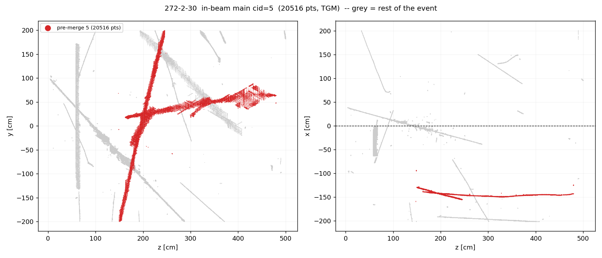
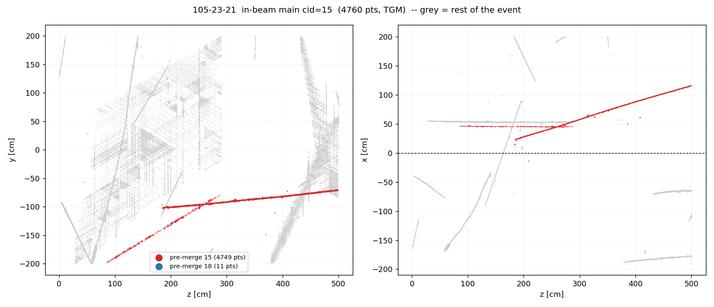
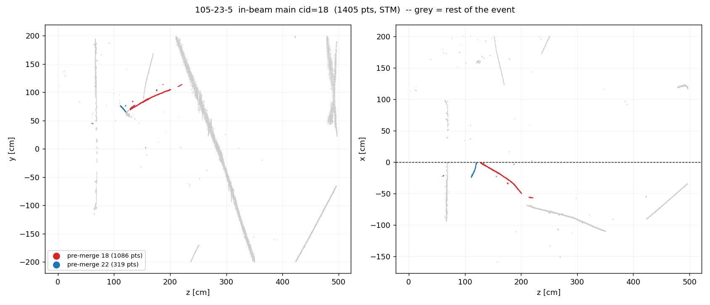

# Doc 96 — the three doc-95 scan findings: why nothing separated 272-2-30 and 105-23-21, and why 105-23-5's long track has no fitted trajectory

**Status: investigation only. No C++, no jsonnet, no knob, no production
change.** The owner's instruction for this round was "understand the problem
before doing a fix, which can be possible next round". Both diagnostic arms
below are proven to reproduce the production clustering **byte-identically**
(md5 of the `clustering-global` Bee layer, §1.2), so nothing here is a
different reconstruction being described.

Answers in one line each:

| owner's note | answer |
|---|---|
| `272-2-30  separation not working???` | **Never separated.** The two tracks arrive from *imaging* already in one blob-connected cluster and no pass ever splits them. `ClusteringSeparate`'s two judges both return false (`dec1=0 dec2=0`), so it is not even a separation candidate — and structurally could not be, because the intruding track never exits the detector (§5.1). |
| `105-23-21  separation not working???` | **Never separated.** Same shape: one cluster from imaging onward. Here `ClusteringSeparate`'s `dec1` *does* fire, but every downstream angle/length gate rejects — the merged object runs along the beam (`angbeam=72.7°`) and the gates only admit near-beam-perpendicular clusters. Underneath that: the cluster does have two real wall exits on two faces, and `dec2` sees **neither**, because SBND's FV thresholds put them out of reach (§5.2). Worth flagging separately: **neither of the two pieces reaches two walls on its own**, so the TGM verdict exists only because they are one cluster (§3.1). |
| `105-23-5  missing a long track somehow? (-19.6, 90.3, 163.1)` | **Not a track-fitting failure.** That point is inside a 982-point / 94.7 cm cluster that `TaggerCheckSTM` tagged **STM**, and `nu_skip_cosmic` therefore refuses it as a neutrino candidate. `TaggerCheckNeutrino` picked a 28.4 cm fragment instead, and the `track_fit` layer only ever draws the selected candidate's PR graph. The 95 cm track is the *only* one of the bundle's nine clusters left out; eight fragments of 1–9 cm are drawn. |

707-18-12 is out of scope this round at the owner's request.

**Owner follow-ups, 2026-09-02:**

| question | answer |
|---|---|
| 105-23-5's long track is on the cathode at one end and mid-detector at the other — where does its STM **entry point** come from? | **From the cathode.** The only entry test in `check_stm_conditions` is "is `pts.front()` outside the fiducial volume", and SBND's `FV_xmax` for APA0 is −2.5 cm while the cathode is at −0.45 — so the drift-direction fiducial bound *is* the cathode. The track reaches x = −0.50. Nothing crosses there: **zero** TPC1 charge within 40 cm of the cathode in a ±20 cm y–z window, nearest TPC1 point 49.9 cm away. `cathode_guard` only ever examines the *stop* end. §7. |
| Are the other two promising to separate in `clustering_separate`? | **272-2-30: yes**, and by two independent levers that already exist default-OFF — `track_recarve` alone splits it into 412 cm + 343 cm, and so does a 15 cm FV inset; the split survives the whole chain. **105-23-21: only with the FV inset *and* the far-point knobs together**, and the second piece lands inside a different 28389-point cluster, so I would not call that split clean. **105-23-5: no** — its join is the flash merge, which this pass never sees. §8. |

The mechanisms in §8 are not hypothetical: `clus/docs/clustering-separate-fv.md`
diagnoses both blindnesses on PDHD, ships the fixes, and enables them on
PDHD/PDVD. That doc's parenthetical "SBND is untouched (its FV was already
inset)" is what §6.1 measures to be false (§10).

**The finding that outgrew the three events (§6.1):** censusing
`ClusteringSeparate`'s gate over all 25 events shows `JudgeSeparateDec_2`
accepting **0 of 74 in-time clusters** — including 0 of the 33 longer than
250 cm — while accepting 11 of 99 out-of-time ones. No in-time cluster in the
sample ever reaches `nout = 2` or `nsurf = 2`. In SBND the **boundary route**
(`dec2` and the `nout`/`nsurf` counters that feed it) is inert for in-time
clusters *as a class*, and in-beam bundles are in-time by construction.
This is not "the pass does nothing": `dec1 = 1` on 8 of those 74, and
105-23-21 is one of them — it is rejected by the angle ladder further down, not
by `dec2`. §5.2 has the arithmetic; §7 has what to do about it.

## Repro block

```bash
cd /nfs/data/1/xqian/toolkit-dev/toolkit/sbnd_xin   # symlink into wcp-porting-img/sbnd/sbnd_xin

# A. per-clustering-step Bee trace (doc 51 knob `trace_bee`, default OFF)
./scripts/d96_trace_run.sh                 # -> work-dbg25a-trace95, ~1 min
python3 scripts/d96_trace_attrib.py work-dbg25a-ql work-dbg25a-trace95 30 5
python3 scripts/d96_trace_attrib.py work-dbg25a-ql work-dbg25a-trace95 21 15
python3 scripts/d96_trace_attrib.py work-dbg25a-ql work-dbg25a-trace95 5  18

# B. ClusteringSeparate gate quantities (permanent env hatch, log-only)
./scripts/d96_sepdbg_run.sh                # -> work-dbg25a-sepdbg95 + SEPDBG lines
grep SEPDBG /home/xqian/tmp/d96/sepdbg-evt30.log

# C. what the over-clustered mains are made of, and the panels
python3 scripts/d96_two_track.py
python3 scripts/d96_panels.py              # -> docs/96_sep/d96-*.png

# D. the sec 6.1 census: the gate over all 25 events, in-time vs out-of-time
./scripts/d96_sepdbg_census.sh             # -> work-dbg25{a,b}-sepcensus95, ~8 min
python3 scripts/d96_sepdbg_parse.py
python3 scripts/d96_extreme_census.py      # the measured negative, sec 6.3

# E. sec 8 feasibility probes -- config-level A/B on the event's OWN production
#    compiled config (the `off` arm must reproduce production byte-identically)
python3 scripts/d96_recarve_probe.py 30 21 5      # off / on(track_recarve)
python3 scripts/d96_fvinset_probe.py 30 21 5      # pdhdlike (FV inset + 3 knobs)
ARMS="off on pdhdlike" ./scripts/d96_recarve_run.sh 30 21 5

# saved outputs under docs/96_sep/: 96-trace-attrib.txt, 96-sepdbg.txt,
#   96-two-track.txt, 96-sepdbg-census.txt, 96-extreme-census.txt
```

Source of the three events: doc 95's Bee set
`e3d1d867-d34e-42a2-9709-1954fdfde54b`, indices 8, 10, 11. Operating point
`ref/prod-2026-09-03`, `reality=sim`, group-a work roots
`work-dbg25a-ql` / `work-dbg25a-pr`. Binary pinned to
`~/tmp/doc94r3b-libsnap` (md5-equal to `local/lib` at launch).

---

## 1. Method

### 1.1 Why the doc-51 tool could not be reused

`scripts/analysis/stm/stm_merge_attribution.py` identifies the two pieces by
running connected components at a 5 cm gap on the *final* cluster. That is
exactly what cannot work here: the owner's finding is over-clustering of
**touching** tracks, so the pieces are one connected component in the final
geometry by construction (measured contact distance 0.35 cm and 0.46 cm, §2.1
and §3.1).

`scripts/d96_trace_attrib.py` inverts the question. It takes the final
production main's point cloud as a fixed reference set and, for every
`trace_bee` layer, reports how *that same set of points* was partitioned into
clusters at that step. The merge step is the one where two comparable-mass
groups collapse into one — not merely where the cluster count drops, since
`cluster_id_order: 'tree'` renumbers after every step and a 5-point crumb
joining also moves the count.

### 1.2 Reproduction proof

Both diagnostic arms are separate Q/L jobs with extra flags, so they have to be
shown to reproduce the clustering being attributed. Doc 51 checked point counts;
this round checks the whole layer:

| event | main | production (n, far-pair) | `-trace-bee` arm | `WCT_SEP_DEBUG=1` arm | `clustering-global` md5 |
|---|---|---|---|---|---|
| 272-2-30 | cid 5 | 20516, 422.58 cm | identical | identical | **equal to production, both arms** |
| 105-23-21 | cid 15 | 4760, 439.09 cm | identical | identical | **equal to production, both arms** |
| 105-23-5 | cid 18 | 1405, 178.81 cm | identical | identical | **equal to production, both arms** |

(`len_main_cm` in `nusel-evt*.tsv` is 117.0 for 105-23-5, not 178.8: that column
measures within the *dominant pre-merge component*, by design — see
`nusel_extract.py:437`.)

### 1.3 Scope check, done before the trace

`clustering_separate` is a **per-APA** visitor, so the question "did
`ClusteringSeparate` split this?" is only well posed for a single-APA object.
Histogramming each main by drift side first:

| event | points in APA0 (x<0) | points in APA1 (x>0) |
|---|---|---|
| 272-2-30 | 20516 | 0 |
| 105-23-21 | 11 | 4749 |
| 105-23-5 | 1405 | 0 |

All three are single-APA objects (105-23-21 carries an 11-point crumb across
the cathode that the all-APA flash merge grafts on at the very last step). The
question is well posed for all three.

---

## 2. 272-2-30 (Bee idx 8) — never separated

### 2.1 What the cluster is



`scripts/d96_two_track.py` decomposes the 20516-point main into two direction
groups:

| object | pts | far-pair | end 1 | end 2 |
|---|---|---|---|---|
| 0 | 9786 | **411.6 cm** | (−129.5, −199.6, 149.6) — **0.3 cm from the bottom wall** | (−154.5, 200.0, 245.2) — **0.0 cm from the top wall** |
| 1 | 8472 | **317.0 cm** | (−139.2, 18.5, 165.3) — 62.3 cm from the nearest face | (−142.9, 64.3, 478.9) — 22.1 cm from the downstream wall |

They touch at **(−142.3, 16.1, 195.9), closest approach 0.35 cm**, opening
angle **66.7°**. About that contact, object 0 carries 4496 / 4961 points on
either side (it passes straight through) while object 1 carries 7862 / 342
(it terminates there): a **T**, not an **X**.

Object 0 alone is wall-to-wall, so the TGM verdict is right *for object 0*.
The merge attaches 8472 points of a second, unrelated 317 cm track to it.

### 2.2 The step-by-step trace — the fusion predates every clustering pass

From `docs/96_sep/96-trace-attrib.txt` (largest groups of the final main's own
points at each step, APA0):

| step | groups the 20516 final points occupy |
|---|---|
| tr00 ClusteringPointed | **12:20188** 16:198 25:54 36:18 32:16 |
| tr01 ClusteringLiveDead | 12:20188 … (unchanged) |
| tr02 ClusteringExtend | 11:20188 … |
| tr03/04 ClusteringRegular | 101:20386 … |
| tr05 ClusteringParallelProlong | 99:20386 … |
| tr06 ClusteringClose | 88:20398 … |
| tr07 ClusteringExtendLoop | 84:20452 … |
| **tr08 ClusteringSeparate** | **83:20452 — no change** |
| tr09 ClusteringConnect1 | 79:20452 … |
| tr10 ClusteringDeghost | 66:20460 … |
| tr11 ClusteringExamineXBoundary | 55:20460 … |
| **tr12 ClusteringProtectOverclustering** | **69:20456 — 4 points split off** |
| tr13 ClusteringNeutrino | 69:20456 (unchanged) |
| tr14 ClusteringIsolated | **6:20516** — absorbs the remaining crumbs |
| tr15 / all-APA tr00–tr09 | one cluster throughout |

**98.4 % of the final main is one cluster at the very first trace layer.**
`ClusteringPointed` is not a merge pass — it only deletes empty blobs and
clusters (`clus/src/clustering_pointed.cxx:50-73`) — so tr00 is effectively
the imaging output. The two tracks were fused by **blob adjacency in imaging**,
before any clustering visitor ran. There is no "separated then re-merged"
history to find.

### 2.3 Why `ClusteringSeparate` declined

`WCT_SEP_DEBUG=1` (`clus/src/clustering_separate.cxx:30`, a permanent log-only
hatch kept precisely for this kind of re-diagnosis) prints the gate for our
cluster — identified unambiguously by its length, which matches the PR log's
`activity 5 (L 486.7 cm)` to four digits:

```
SEPDBG dec2  ident=84 len=486.724 nout=1 noutx=0 nsurf=1 nindep=2 nfar=0 outx=0
             hy=199.965 ly=-199.619 hz=479.55 lz=149.4 hx=-127.495 lx=-155.004
SEPDBG gate  ident=84 len=486.724 nblob=1247 dec1=0 dec2=0 nindep=4
             r1=0.368611 r2=0.000258714 angbeam=51.7762
```

`JudgeSeparateDec_2`'s acceptance (`clustering_separate.cxx:3155`) is

```
(num_outside_points > 1 && independent_surfaces.size() > 1
 || num_outside_points > 2 && cluster_length > 250 cm
 || num_outx_points > 0)
&& (independent_points.size() > 2 || independent_points.size() == 2 && num_far_points > 0)
```

With `nout=1`, `nsurf=1`, `noutx=0` the entire first conjunct is false, so
`dec2=0` regardless of the second. (`nout=1` despite the cluster exiting
*both* the top and bottom walls: `hy = 199.965` is a real top-wall exit and it
is unreachable by the "outside" test, §5.2. That does not change this event's
verdict — §5.1 shows the second conjunct fails independently — but it is the
same arithmetic that decides 105-23-21.) `dec1=0` as well, and the whole
`flag_dec1` recovery ladder at `:2333-2404` — including the
`pca_ratio1 > 0.2` branch that would have run `Separate_2` and counted 60 cm
sub-tracks, which is exactly the right test here (`r1=0.3686`) — is gated
behind `flag_dec1`, so none of it runs. The SBND-only extra judge is ON in
production (`sbnd_boundary_tag: true` in the compiled config) but requires
**two dense hull tips within 10 cm of the upstream z wall**
(`JudgeSeparateDec_SBND_boundary`, `:146-174`); this cluster spans
z ∈ [149.4, 479.6] and has none, so it returns false at step 1.

### 2.4 Why no later pass split it either

- **`ClusteringProtectOverclustering` (tr12)** logged
  `Separate_overclustering: npoints=20460 ncomp=8`, but `ncomp` is the count
  *before* the pass re-links components (`clustering_protect_overclustering.cxx:298`);
  the net effect on this cluster was 4 points. Both this pass and
  `connect_graph_relaxed*` split on **charge deserts along the connecting
  path**, and there is no desert here: the two tracks physically cross at
  0.35 cm.
- **All-APA passes** (tr00–tr09) never touch it.
- **`ClusteringProtectBundle` in the PR chain** — the last splitter — refuses
  by design once the TGM verdict exists:
  ```
  OC53SKIP member ident=5 nblobs=1249 main=1 convicted TGM=1 STM=0 lm=0 -- never split
  split 0 bundle cluster(s) into 0 extra cluster(s) (1 convicted main(s) skipped, ...)
  ```

---

## 3. 105-23-21 (Bee idx 11) — never separated, and the TGM verdict rests on the merge

### 3.1 What the cluster is



| object | pts | far-pair | end 1 | end 2 |
|---|---|---|---|---|
| 0 | 3864 | 329.7 cm | (22.0, −102.9, 185.4) — **97.1 cm from the nearest face** | (116.4, −70.8, 499.6) — 1.4 cm from the downstream wall |
| 1 | 831 | 236.6 cm | (46.7, −196.9, 84.9) — 3.0 cm from the bottom wall | (45.7, −77.6, 289.2) — **122.4 cm from the nearest face** |

Contact **(45.4, −100.2, 249.8), closest approach 0.46 cm**, opening angle
**29.3°**. Object 1 terminates at the contact (712 / 69 points either side);
object 0 passes through (741 / 2971).

**Neither object alone reaches two walls.** Each has one end deep inside the
detector (97 and 122 cm from any face). The TGM tag therefore exists only
because the two are one cluster — `TaggerCheckTGM` already sees the anomaly and
reports **3 extreme groups** for this cluster (a single track has 2):

```
component_extreme_wcps: cluster 15 1 component(s), 1 above 10.0 cm -> 3 extreme group(s)
visit: TaggerCheckTGM: cluster 15 -> TGM=true
```

**Two readings, and I am not picking between them** (CLAUDE.md §5.4):
(a) two crossing cosmics, in which case the TGM is a merge artefact and one of
the two pieces deserves its own verdict; (b) **one** muon entering the bottom
wall, scattering 29° at the contact and exiting downstream, in which case TGM
is correct and there is nothing to split. **The arm counts do not discriminate here.** They would
(object 0 carries 741 points on the far side of the contact, object 1 carries
69, which a clean kink should not produce) except that both of those arms —
68.3 cm and 45.5 cm — sit inside the ±50 cm window where a 29° RANSAC
assignment is unreliable, i.e. exactly where the measurement cannot be trusted.
This is an owner call on the display; the numbers do not settle it.

### 3.2 The trace

APA1 layers, final main's 4749 APA1 points:

| step | groups |
|---|---|
| tr00 ClusteringPointed | **31:4526** 27:159 4:19 6:14 16:12 |
| tr03 ClusteringRegular | 33:4685 … |
| tr06 ClusteringClose | 30:4690 … |
| **tr08 ClusteringSeparate** | **28:4690 — no change** |
| tr12 ClusteringProtectOverclustering | 17:4690 — no change |
| tr14 ClusteringIsolated | 6:4749 — absorbs the crumbs |
| all-APA tr09 ExamineBundles | 15:4760 — grafts the 11-point APA0 crumb |

Again **95 % of the object is one cluster at tr00**, i.e. from imaging.

### 3.3 Why `ClusteringSeparate` declined — a different reason from §2.3

```
SEPDBG dec2  ident=28 len=449.635 nout=0 noutx=0 nsurf=0 nindep=0 nfar=0 outx=0
SEPDBG gate  ident=28 len=449.635 nblob=577 dec1=1 dec2=0 nindep=3
             r1=0.0262956 r2=4.18669e-05 angbeam=72.7066
```

`dec1=1`, so unlike 272-2-30 this cluster *does* enter the recovery ladder with
3 independent points. But no independent point is above `det_FV_ymax`
(the highest is y = −69.4), so the `flag_top` branch is skipped and the
`else` branch at `:2380-2393` applies. Every clause there requires
`angbeam < 4 / 25 / 28 / 35 / 30°`, and this cluster has **`angbeam = 72.7°`**
— `angbeam` is `|angle(main PCA axis, beam) − 90°|`, so 72.7° means the merged
object runs *nearly along the beam*, and the ladder only admits clusters close
to beam-**perpendicular**. `pca_ratio1 = 0.026` also fails the `> 0.55` escape.
The SBND boundary judge fails the same way as §2.3 (z ∈ [84.9, 499.6], nothing
within 10 cm of the upstream wall).

`ClusteringProtectBundle` again refuses after the verdict:
`OC53SKIP member ident=15 nblobs=577 main=1 convicted TGM=1 STM=0 lm=0 -- never split`.

---

## 4. 105-23-5 (Bee idx 10) — the "missing long track"



The owner's point **(−19.6, 90.3, 163.1)** sits inside the 982-point cluster
that the PR job numbers 18 (nearest charge 0.21 cm; 406 points of cluster 18
within 20 cm, and no other cluster within 20 cm at all). Every step of what
happens to it:

1. **Q/L, per-APA.** The final in-beam main is two comparable pieces from tr00
   onward — 982 and 283 points — and `ClusteringSeparate` leaves them separate.
   `ClusteringIsolated` (tr14) absorbs the crumbs into each, giving 1086 and
   319 points.
2. **Q/L, all-APA `ClusteringExamineBundles` (tr09).** The **flash merge**
   joins them into one bundle main of 1405 points. This is the only true MERGE
   step in any of the three events' traces, and it is what `n_frag = 2` in
   `nusel-evt5.tsv` records.
3. **PR chain, `ClusteringUnmergeBundle`.** The merge is undone
   (`cluster 18: 342 blobs -> main 232 + 1 associated holding 110`,
   `cluster 1801: demoted_main`), then `:prassoc` splits further. Nine PR
   clusters result:

| PR cid | pts | length | in `track_fit`? | came from Q/L pre-merge component |
|---:|---:|---:|:--|:--|
| **18** | **982** | **94.7 cm** | **no** | 18 |
| 22 | 283 | 27.7 cm | yes | 22 |
| 55 | 47 | 8.7 cm | yes | 18 |
| 52 | 34 | 2.4 cm | yes | 18 |
| 54 | 15 | 1.4 cm | yes | 18 |
| 71 | 15 | 1.6 cm | yes | 22 |
| 70 | 13 | 3.6 cm | yes | 22 |
| 53 | 8 | 1.0 cm | yes | 18 |
| 69 | 8 | 1.0 cm | yes | 22 |

4. **`TaggerCheckSTM`** tags cluster 18 STM. It is a clean accept — no guard
   fires: `entry_rise: cluster 18 L_stop=95.9cm body=0.94MIP(76pts)
   ent=0.67MIP(5pts) rise=0.71 kink=13.0deg at L=72.9cm` and
   `detect_proton: proton_muon_guard: end matches the muon hypothesis
   (ks1=0.017, ratio3=1.030); not a proton`. Cluster 22 is *rejected* as STM
   by `accept_guards: fit bridges a 12.4 cm charge desert (one-objectness)`.
5. **`ClusteringProtectBundle`** opens the bundle but never splits the
   convicted main: `OC53SKIP member ident=18 ... convicted TGM=0 STM=1 --
   never split`. It does split cluster 22 (110 blobs → 96 + 3 fragments).
6. **`TaggerCheckNeutrino`** — the actual cause:

```
[nu_per_bundle] legacy winner is cluster 22 (L 28.4 cm); it is exempt from the 15.0 cm floor
[nu_per_bundle] gid 1 activity 18 (L 95.4 cm) cosmic-tagged (TGM=false STM=true lm_flag=0); not a candidate
[nu_per_bundle] gid 1 activity 69/70/71 (L 1.5/3.8/2.5 cm) under the 15.0 cm floor; not a candidate
[nu_per_bundle] gid 1: candidate main cluster 22 (t0 1.505 us, L 28.4 cm, 7 associated) of 5 evaluated
selected main cluster 22 (t0 1.505 us, L 28.4 cm, 7 associated)
```

   The exclusion is `nu_skip_cosmic` (`TaggerCheckNeutrino.cxx:2010-2018`),
   `true` in the SBND production config. Cluster 18 also never appears as a
   *companion*, because companions must carry the `associated_cluster` flag and
   cluster 18 kept `main_cluster`; `skip_cosmic_companions` (also `true`,
   floor `cosmic_companion_min_length = 15` cm) would have dropped it anyway.

7. **The Bee `track_fit` layer** iterates the segments of the *selected
   fitter's* PR graph (`MultiAlgBlobClustering.cxx:941-1000`), which is built
   from the candidate main plus its associated clusters. Cluster 18 is in
   neither list, so it contributes no fitted trajectory. Net effect: the layer
   draws eight fragments of 1–9 cm and omits the single 95 cm track.

**So: not a bug in the track fitting, and nothing failed silently.** Every step
did what it is configured to do. The composite behaviour is the surprise the
owner spotted — the largest object in the bundle is the one object the fitted
display does not show, and the reason is a *verdict*, not a fit failure.

That reframes the finding: **105-23-5 is Bee idx 10, one of the five
never-tuned-on STM calls doc 95 flagged for scanning.** "Is the long track
missing?" and "is this new STM call correct?" are the same question. If cluster
18 is a neutrino, the display is the symptom and the STM accept is the defect;
if it is a genuine stopping cosmic, the display is correct and the only thing
worth changing is that it says so.

For the record, cluster 18's geometry: 116.9 cm from **(1.3, 72.2, 128.2)** —
on the cathode, `cathode_guard` reports `stop x=-49.13cm ... cathode_x=-0.45cm
dist=48.68cm` — to (−58.8, 114.1, 219.3), 58.8 cm into APA0. The other
pre-merge component (319 points, 106.1 cm far-pair) is scattered activity
around the cathode end, and it is what the PR chain fitted.

---

## 5. Why `ClusteringSeparate` missed them — and it is NOT the same reason twice

`JudgeSeparateDec_1/2` are **boundary-topology** tests: collect the cluster's
extreme points, keep the ones outside the fiducial volume as "independent
points", count how many distinct detector faces those exits touch, and split
when a cluster shows more exits than one track can. The two events fail that
test for genuinely different reasons, and conflating them would point the next
round at the wrong lever.

### 5.1 272-2-30 — structural: there is no third exit to find

| object | end 1 | end 2 |
|---|---|---|
| 0 (411.6 cm) | 0.3 cm from the bottom wall | 0.0 cm from the top wall |
| 1 (317.0 cm) | **62.3 cm from the nearest face** | **22.1 cm from the downstream wall** |

The intruding track does not leave the detector at either end. So the merged
cluster's physical boundary topology is exactly **two exits**, top and bottom —
which is precisely the signature of a single through-going cosmic. `dec2`'s
second conjunct is what encodes that: it demands `independent_points > 2`, or
`== 2` with a far point. This cluster has `nindep = 2, nfar = 0`, and no
fiducial-volume retuning can add a third exit that does not physically exist.
**A boundary-exit judge is the wrong instrument for this event, full stop.**

### 5.2 105-23-21 — thresholds: two real exits, both unreachable

Here the topology *is* there and the judge cannot see it:

| exit | position | SBND "outside" threshold | verdict |
|---|---|---|---|
| object 1, bottom | y = −196.93, **3.0 cm from the wall** | `y < FV_ymin = −199.31` | missed by 2.4 cm |
| object 0, downstream | z = 499.65, **1.4 cm from the wall** | `z > FV_zmax + margin = 503.15` | **threshold is past the wall (501.0)** |

Hence the logged `nout=0 noutx=0 nsurf=0` on a 449.6 cm cluster that plainly
touches two different faces. This is threshold arithmetic, not topology.

Two caveats I am not glossing over. First, *counting* those two exits would
satisfy only the **first** conjunct; the second still wants a third exit or a
far point, and two exits on two faces is also what a correct through-going
cosmic looks like — so this round cannot claim a retune would have split the
event, only that the judge never saw its real boundary topology. Second, the
reachability defect is general, not specific to this cluster:

| face | uBooNE threshold (prototype `2dtoy/src/ToyClustering_separate.h:168-187`) | uBooNE wall† | headroom | SBND threshold | SBND wall | headroom |
|---|---|---|---|---|---|---|
| y-top | `y > 104` | 116.5 | 12.5 cm | `y > 201.81` | 199.965 | **−1.85 cm — unreachable** |
| y-bottom | `y < −99.5` | −116.5 | 17.0 cm | `y < −199.31` | −199.965 | 0.65 cm |
| z-down | `z > 1025` | 1036.8 | 11.8 cm | `z > 503.15` | 501.0 | **−2.15 cm — unreachable** |
| z-up | `z < 12` | 0 | 12.0 cm | `z < −2.15` | 0 | **−2.15 cm — unreachable** |
| x-cathode | `x > 255` | 256.35 | 1.35 cm | `x > −2.5` | −0.45 | 2.05 cm |
| x-anode | `x < 1` | 0 | 1.0 cm | `x < −201.05` | −201.45 | 0.40 cm |

† uBooNE active volume from the prototype itself, `uboone_light_app/apps/wire-cell-photonlib-pred.cxx:53-55`: x [0, 256.35], y [−116.5, 116.5], z [0, 1036.8] cm. SBND's is the `AnodePlane` sensvol banner printed in every Q/L log: apa0 face0 [(−201.45, −199.965, 0) → (−0.45, 199.965, 501)] cm.

The **C++ translation is faithful** — every prototype constant maps onto
`FV_* ± FV_*_margin` exactly (101.5/104 → `FV_ymax`/`+2.5`; 1022/1025 →
`FV_zmax`/`+3`; 15/12 → `FV_zmin`/`−3`; −99.5 → `FV_ymin` with no margin,
reproducing the prototype's own asymmetry; 1/255 and −1/257 → `FV_xmin`/`xmax`
and their ±2 cm margins). The divergence is entirely in the SBND **FV values**:
uBooNE's fiducial volume is inset 12–17 cm from the y and z walls, so
`FV + margin` still lands inside the detector, whereas SBND's is the active
volume minus 1 cm (`cfg/pgrapher/experiment/sbnd/clus.jsonnet:129-138`,
"wires Y bbox ± 1 cm"), chosen for the containment taggers, where
"FV ≈ the active volume" is the right thing.

Consequence, and it is visible in the log rather than inferred: across these
three events **every** cluster that reaches `dec2 = 1` also carries `outx = 1`,
i.e. it got there through the third disjunct `num_outx_points > 0`, which fires
on *out-of-time* clusters whose apparent x is past the anode (for instance
`dec2 ident=10 len=316.449 nout=1 noutx=1 nindep=3 outx=1` →
`gate … dec1=1 dec2=1`). Our three are in-time in-beam bundles, so that route
is closed to them as well. §6.1 measures how general this is.

**Two readings, not picked** (CLAUDE.md M15 / §5.4): either the separation
judge should get its own fiducial volume, decoupled from the tagger FV that
`select_scope_fv` hands it today; or the `+ margin` convention needs an
SBND-specific translation. Both are behaviour changes and belong in a knobbed
round with a gate, not here.

## 6. What this round establishes, and what it does not

### 6.1 The measurement §5.2 demanded: `dec2`'s boundary route is dead for in-time SBND clusters

`scripts/d96_sepdbg_census.sh` re-ran every one of doc 95's 25 events with
`WCT_SEP_DEBUG=1` (log-only; the arms reproduce production byte-identically,
§1.2) and `scripts/d96_sepdbg_parse.py` censused every cluster that reaches the
gate. Output: `docs/96_sep/96-sepdbg-census.txt`.

| population | n | `nout` histogram | `nsurf` histogram | first conjunct of `dec2` satisfied | `dec2 = 1` |
|---|---:|---|---|---:|---:|
| **in-time** (`outx = 0`) | 74 | `{0: 45, 1: 29}` | `{0: 45, 1: 29}` | **0 (0.0 %)** | **0 (0.0 %)** |
| in-time, longer than 250 cm | 33 | `{0: 14, 1: 19}` | `{0: 14, 1: 19}` | 0 | **0 / 33** |
| out-of-time (`outx = 1`) | 99 | `{1: 72, 2: 23, 3: 3, 4: 1}` | `{1: 81, 2: 18}` | 98 (99.0 %) | 11 (11.1 %) |

**No in-time cluster in the whole sample ever reaches `nout = 2` or
`nsurf = 2`** — including 33 clusters over 250 cm, the through-going-cosmic
regime where two exits on two faces is the *normal* configuration. Every
`dec2 = 1` in the sample is an out-of-time cluster arriving through the third
disjunct `num_outx_points > 0`.

So this is not a property of the owner's two events. In SBND,
`JudgeSeparateDec_2`'s boundary route is **inert for in-time clusters as a
class**, and in-beam neutrino bundles are in-time by construction. That route
currently carries no information about them either way — it does not
mis-separate correct tracks, it simply never looks. §5.2's arithmetic is the
reason, and this table is the consequence at population scale (25 events;
the 3067-event confirmation is step 1 of §7).

**Scope of the claim, precisely.** This is about `dec2` and the counters
feeding it, *not* about `ClusteringSeparate` as a whole. `dec1 = 1` on 8 of the
74 in-time clusters (10.8 %), and 105-23-21 is one of them: it enters the
`flag_dec1` recovery ladder and is rejected there, by the beam-angle gates
(§3.3), not by the boundary route. Anything that revives the boundary route
therefore only gets a cluster *to* the ladder — it still has to clear it
afterwards. §7 step 2 measures the first half only.

### 6.2 Established

- No pass ever separated and re-merged anything. For 272-2-30 and 105-23-21 the
  tracks are fused **in imaging**, by blob adjacency, before the first
  clustering visitor. For 105-23-5 the two pieces stay separate through the
  whole per-APA pipeline and are joined once, by the all-APA flash merge, which
  the PR chain then undoes.
- `ClusteringSeparate` misses the two events for **two different reasons**:
  272-2-30 is structural (the intruding track has no detector exit at either
  end, so no fiducial retuning creates the third exit `dec2` needs — §5.1);
  105-23-21 is threshold arithmetic (two real wall exits on two faces, both
  outside SBND's reachable bands — §5.2). The proximate log symptoms differ
  too: `dec1=0 dec2=0` versus `dec1=1` rejected by the beam-angle ladder at
  `angbeam = 72.7°`.
- Gap-based splitters cannot help either event: the tracks touch at 0.35 and
  0.46 cm. There is no charge desert for `Separate_overclustering` or
  `connect_graph_relaxed*` to reject. (The same family's "one-objectness" test
  *did* fire inside 105-23-5, on cluster 22, for exactly the reason it exists:
  a real 12.4 cm desert.)
- Once a TGM/STM verdict exists, `ClusteringProtectBundle` will not split the
  convicted main — by design, and logged (`OC53SKIP`).
- 105-23-5's long track is missing from `track_fit` because of a *verdict*
  (`nu_skip_cosmic` on an STM tag), not a fit failure. It is the only one of
  nine clusters in the bundle left out, and the eight that are drawn are 1–9 cm
  fragments.

### 6.3 Measured and rejected in this round

- `TaggerCheckTGM`'s **extreme-group count** looked like a free flag: 5 and 3 on
  these two events against 2 for a clean track, and it already runs on every
  in-beam main. Censused over doc 95's 25 events
  (`scripts/d96_extreme_census.py`, `docs/96_sep/96-extreme-census.txt`):
  49 mains, counts spanning 0–25, and **7 of 14 TGM-tagged mains (50 %) already
  have ≥ 3**. It measures raggedness — delta rays, blob noise — not
  over-clustering. Dead; do not build on it.

### 6.4 Not established, deliberately

- Whether 105-23-21 is two crossing cosmics or one 29°-scattered muon (§3.1).
  Two readings, presented, not picked; the arm counts fall inside the window
  where the measurement is unreliable, so they do not break the tie.
- Whether counting 105-23-21's two exits would have split it. §8.3 now answers
  the mechanical half — with the FV inset **and** the far-point knobs it does
  separate — but not the physics half: 908 of its points land in a different
  28389-point cluster, and whether that is their right home is still the §3.1
  question the arm counts could not settle.
- Whether the STM accept on 105-23-5's cluster 18 is right. That is a hand-scan
  question, and it is the same question doc 95 already put to the owner.
- Whether 272-2-30's object 1 hides anything: 62 cm inside the detector at one
  end, 22 cm from the downstream wall at the other, so on its own it would be
  judged, not automatically tagged.

## 7. Follow-up 1 (owner, 2026-09-02) — how does 105-23-5's long track have an entry point at all?

The owner's objection: that track sits **on the cathode at one end and in the
middle of the detector at the other**, so where does the entry point a stopping
muon requires come from?

**Measured answer: the "entry" is the cathode, and the tagger never checks that
an entry is physically reachable.**

`check_stm_conditions` walks the fitted path `pts`, treats `pts.front()` as the
entry and `pts.back()` as the stop, and the only entry test anywhere in it is
`fiducial_utils->inside_fiducial_volume(pts.front())`
(`TaggerCheckSTM.cxx:3563-3590`): TGM needs **both** ends outside, STM continues
when the front is outside and the back is inside. "Outside the fiducial volume"
is the whole definition of an entry — there is no test that the outside end lies
on a face a cosmic could have come through.

And in SBND the drift-direction fiducial bound **is the cathode**:
`FV_xmax` for APA0 is **−2.5 cm** while the cathode plane sits at −0.45 cm
(`cfg/pgrapher/experiment/sbnd/clus.jsonnet:129-138`; sensvol banner). PR
cluster 18 runs x ∈ [−49.89, **−0.50**] — 11 of its points are within 0.5 cm of
the cathode, 65 within 2 cm, 168 within 5 cm. So its cathode end is outside the
fiducial in x, and reads as an entry.

**Nothing crosses the cathode there.** If this were the TPC0 half of a
cathode-crossing cosmic there would be matching charge just inside TPC1:

| search box around the cathode end (−1.75, 71.3, 129.9) | TPC1 points found |
|---|---|
| 0.45 < x < 10 cm, \|Δy\|, \|Δz\| < 20 cm | **0** |
| 0.45 < x < 20 cm, same | **0** |
| 0.45 < x < 40 cm, same | **0** |

The nearest TPC1 charge of any kind is **49.9 cm** away (cluster 45, at
x = 36.7). What *is* at that end, in TPC0, is the other pre-merge component and
its fragments — PR clusters 22 (283 pts), 54 (15) and 71 (15) inside a 25 cm
box. That is the object the PR chain then selected as the neutrino candidate.

So the topology is "activity at the cathode with a 95 cm track leading away from
it", not "a muon entering through the cathode". The STM accept requires the
second reading and nothing in the tagger can tell them apart.

**And the one guard that knows about the cathode looks at the other end.**
`cathode_guard` (doc 63 round 3) evaluates `pts[k]` with `k` = the kink/stop
index (`TaggerCheckSTM.cxx:2158-2182`) — the *stop*, vetoing a Bragg-like end
that is really drift-boundary truncation. It logged
`stop x=-49.13cm … cathode_x=-0.45cm dist=48.68cm` and correctly stayed silent:
the stop is 48.7 cm from the cathode. **No guard in the family examines the
entry end.** That is the gap the owner has found, and it is a different gap from
the doc-94 family's (which all read the stop end — see
`feedback_owner_kink_discriminator`).

This does not by itself prove the STM verdict wrong — a track could genuinely
begin near the cathode for other reasons — but it removes the reason to believe
it, and it names a candidate guard for the next round: *an entry end within a
few cm of the cathode, with no charge across the cathode within a matched
window, is not an entry.* On this event that predicate is unambiguous (0 points
in every window tested, nearest 49.9 cm).

## 8. Follow-up 2 (owner) — are the other two feasible to separate in `ClusteringSeparate`?

Yes for one, conditionally for the other — and, unexpectedly, **the mechanisms
already exist, are default-OFF, and are enabled on PDHD/PDVD today.**

`clus/docs/clustering-separate-fv.md` diagnoses precisely the two blindnesses of
§5 on PDHD run 27409 and ships a fix set: 15 cm y/z FV insets (config-only) plus
the knobs `far_point_x_cut` / `far_point_mid_dis` / `dec1_guard_main_angle` /
`track_recarve`. Its `track_recarve` section is a description of §5.1 written
before I got there:

> Two crossing tracks whose arms end INSIDE the volume expose at most one
> surface contact, so neither Dec_2 nor the angle ladders can ever fire on
> them. … its own validation (two long thin arms, fair shares, interior
> crossing) does the actual discrimination.

That doc also says **"SBND is untouched (its FV was already inset, plus the
`sbnd_boundary_tag`)"**. §6.1 measures that claim to be wrong: SBND's FV is
inset 0.65–2.05 cm, not the ~15 cm the same doc identifies as the uBooNE
operating point, and the consequence is the identical `nout=0 noutx=0 nsurf=0`
blindness the doc reports for PDHD.

### 8.1 The probe

Rather than argue from gate constants, I ran them. Each arm patches the event's
**own production compiled config** — so the only difference from production is
the listed keys — and redirects output paths into a scratch tree
(`scripts/d96_recarve_probe.py`, `d96_fvinset_probe.py`, `d96_recarve_run.sh`).
The `off` arm (paths moved, nothing else) reproduces production **byte-identically**
on all three events (md5 of the `clustering-global` layer), which is what makes
the other arms attributable.

| arm | 272-2-30 (main 20516 pts / 422.6 cm) | 105-23-21 (main 4760 pts / 439.1 cm) |
|---|---|---|
| production (paths only) | 1 piece: 20438 pts / 423 cm | 1 piece: 4752 pts / 439 cm |
| `track_recarve` | **2 pieces: 10576 / 412 cm + 9856 / 343 cm** | 1 piece (no fire) |
| FV inset 15 cm | **2 pieces: 10487 / 412 cm + 9798 / 343 cm** | 1 piece |
| `far_point` knobs | 1 piece | 1 piece |
| FV inset + `far_point` | **2 pieces: same as above** | **2 pieces: 3846 / 333 cm + 908 pts absorbed into a 28389-pt host** |
| full PDHD/PDVD point | **2 pieces: same** | **2 pieces: same as above** |

### 8.2 272-2-30 — promising, by two independent existing levers

`track_recarve` fires exactly once and reports

```
Separate track_recarve: len 486.724 cm split into arms 10608 / 9844 npoints,
    cross frac 0.56278 / 0.126344, resid 2.82947 / 6.78415 cm
```

— which matches §2.1's independent RANSAC decomposition (9786 / 8472 plus 2258
ambiguous): two thin arms (2.8 and 6.8 cm rms), a "T" (one crossing fraction
interior at 0.56, the other at 0.13, i.e. one track ending on the other). The
15 cm FV inset reaches the same split by the ordinary `Separate_1` path.

**The split survives the whole Q/L chain** — the final all-APA clustering shows
two clusters of 412 cm and 343 cm, not a re-merge. And it changes the physics
downstream: the two halves are flash-matched **separately**, the 412 cm
through-going cosmic moving by a rigid **+88.17 cm** in x (sd 0.14 cm — a
different flash, not a distortion) while the 343 cm track keeps the beam flash
at Δx = 0.00 ± 0.16 cm. So after the split the in-beam bundle's main is the
343 cm track alone and the through-going cosmic has left the beam bundle. That
is the point of separating it, and it is also why this cannot ship without a
verdict-level A/B.

### 8.3 105-23-21 — separates only under two levers at once, and not cleanly

Neither the FV inset nor the `far_point` knobs alone moves it; **both together**
do. This is consistent with §5.2: the inset makes the two real wall exits
countable (first conjunct), and the far-point knobs supply the second conjunct
that two exits alone do not satisfy.

But the outcome is not a clean two-track split. 3846 points become a 333 cm
object (§3.1's object 0); the other 908 points end up **inside a different,
28389-point host cluster**. Whether that is the right home for them is exactly
the §3.1 question the arm counts could not settle — and it is a re-partition
across cluster boundaries, not a two-way carve. I am not calling it correct.

### 8.4 105-23-5 — not reachable this way, as expected

Unchanged in every arm. Its two pieces were never one cluster at the per-APA
stage (§4 step 1); the join is the all-APA flash merge, which `ClusteringSeparate`
never sees.

## 9. Recommended next step

§8 changes the shape of the next round: it is not "design a separator", it is
"decide whether to adopt an existing, validated one".

1. **The cheapest real decision first — the FV.** SBND's separation blindness is
   one config edit away from the PDHD/PDVD operating point, and that edit is
   already written and validated on two detectors. It is **owner-decision
   territory** (CLAUDE.md §5.1) because `select_scope_fv` shares the FV with
   `clustering_neutrino` and the containment taggers, so an inset is not
   confined to separation and cannot be made byte-identical-when-off as a config
   change. The clean alternative is a **separation-only FV** (or an inset knob on
   `ClusteringSeparate`), which *can* default to today's values and be
   byte-identical when off. I recommend that shape.
2. **`track_recarve` is the cheaper, better-contained first flip.** It is
   already a knob, default OFF, byte-identical when off, with its own internal
   validation, and on 272-2-30 it does the right thing on its own with no FV
   change at all. The round is: flip it for SBND, gate byte-identity on the
   standard manifest with the knob off, then census how often it fires and hand
   the owner a Bee set of every firing event. PDHD/PDVD experience says it fires
   rarely and only on genuine X/T topologies; SBND has never measured that.
3. **Only then the verdict-level question.** §8.2 shows the split re-does the
   flash matching, so the metric is not "did it split" but what happens to
   TGM/STM/nu-candidate counts on the 3067-event sample. That is the same
   harness doc 94 used.
4. **Independent, and still the cheapest thing on the list:** the owner's
   verdict on Bee idx 10 (§4, §7). §7 now gives it a mechanism to test — if the
   cathode end is a fictitious entry, that is a new guard in the doc-94 family
   and it is the only one of the three findings that touches an STM verdict
   directly.

The §6.1 production-scale confirmation and the junction-signature probe are both
**superseded** by §8: the population question is now "how often does
`track_recarve` fire on SBND and is it right", which is a knob flip and a census,
not new instrumentation.

## 10. Reported, not fixed

- **`clus/docs/clustering-separate-fv.md` states "SBND is untouched (its FV was
  already inset, plus the `sbnd_boundary_tag`)".** §6.1 measures the opposite:
  SBND's FV is inset 0.65–2.05 cm against that doc's own ~15 cm criterion, and
  `dec2 = 1` on 0 of 74 in-time clusters — the same blindness the doc diagnoses
  for PDHD. `sbnd_boundary_tag` does not compensate: it requires two dense hull
  tips within 10 cm of the **upstream z wall**, which neither event has (§2.3,
  §3.3). I have not edited that doc — it is a toolkit-repo file describing
  another detector's round, and correcting someone else's conclusion is the
  owner's call.
- **§7 — no guard examines the STM entry end.** `cathode_guard` reads the stop;
  the whole doc-94 family reads the stop. An entry end on the cathode with no
  charge across it is unguarded.
- `clustering_separate.cxx:2363` — the `pca_ratio1 > 0.2` recovery branch that
  runs `Separate_2` and counts 60 cm sub-tracks would recognise 272-2-30
  (`r1 = 0.369`) but is unreachable for it, sitting inside
  `if (!flag_proceed && flag_dec1 && ...)` with `dec1 = 0`. Moot now that §8.2
  shows `track_recarve` reaches the same event.
- The `Separate_overclustering: npoints=… ncomp=…` log line reports the
  component count **before** the pass re-links components
  (`clustering_protect_overclustering.cxx:298`), so `ncomp=8` on a cluster that
  ends up losing 4 points is not a contradiction. Anyone reading it as "it split
  into 8" will misdiagnose.
