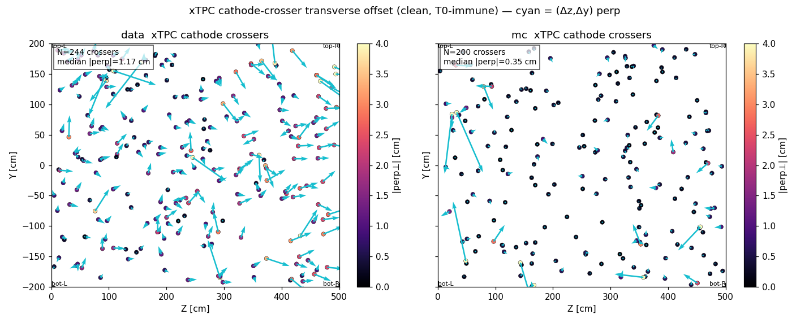
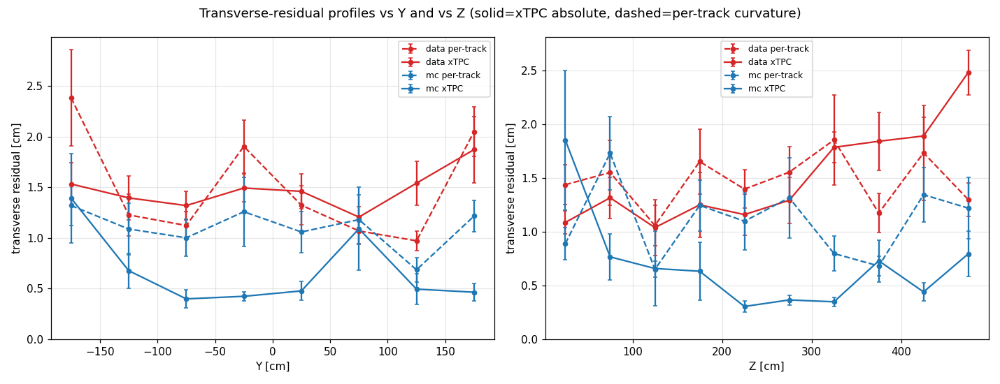
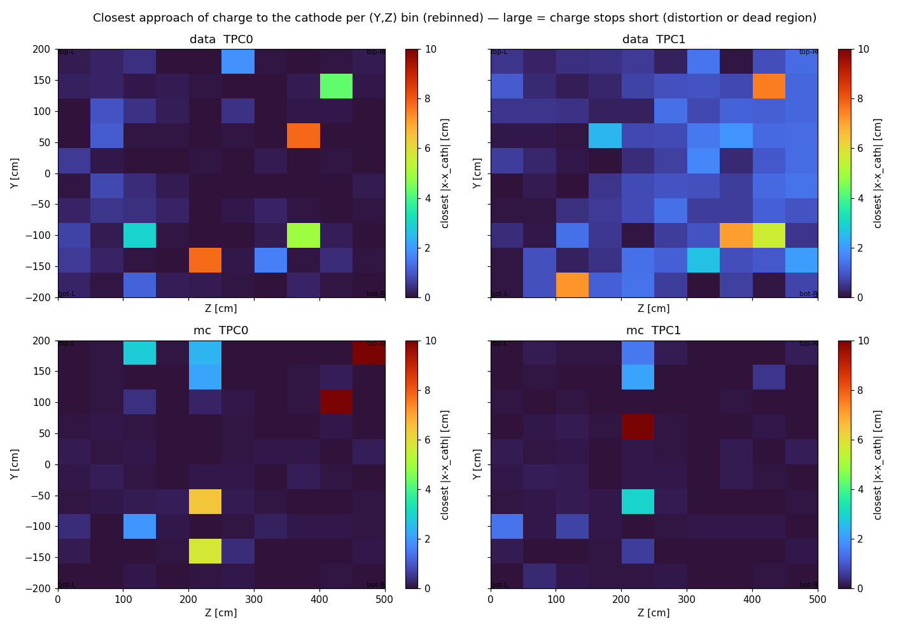
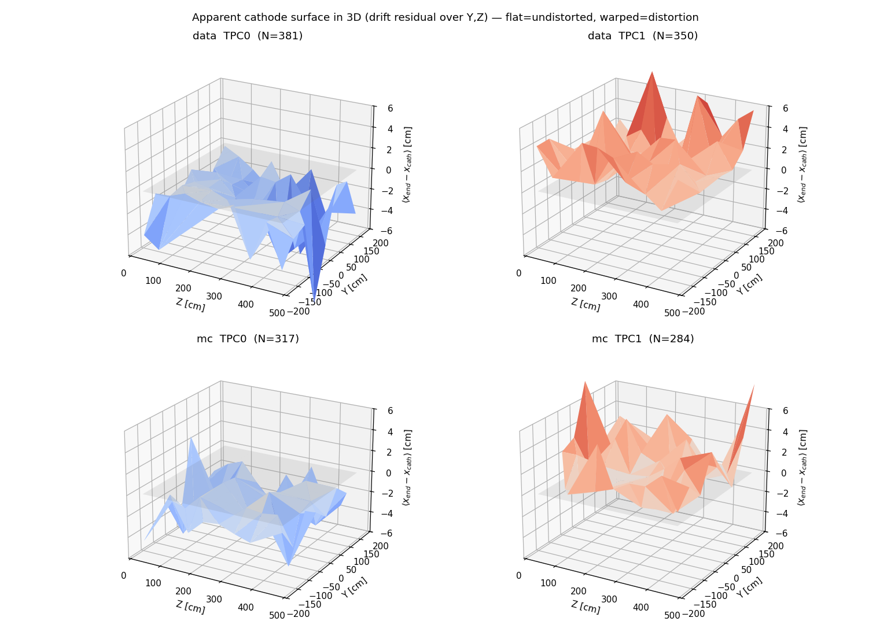
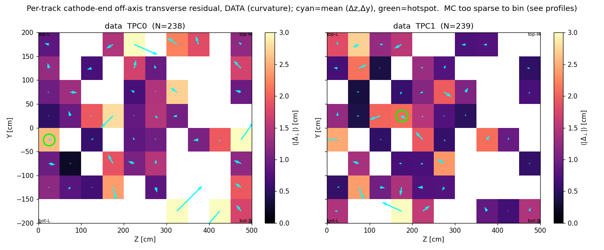
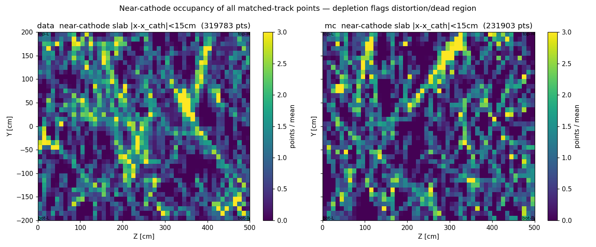
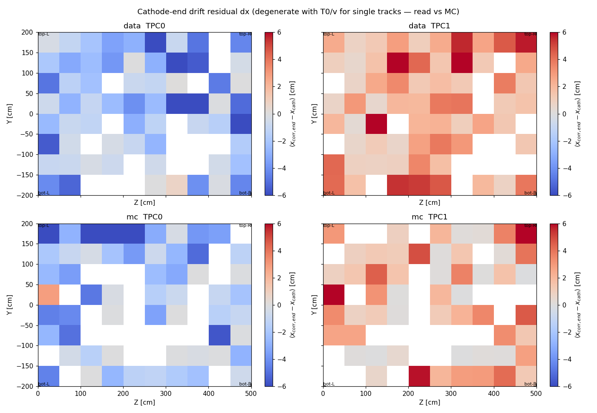
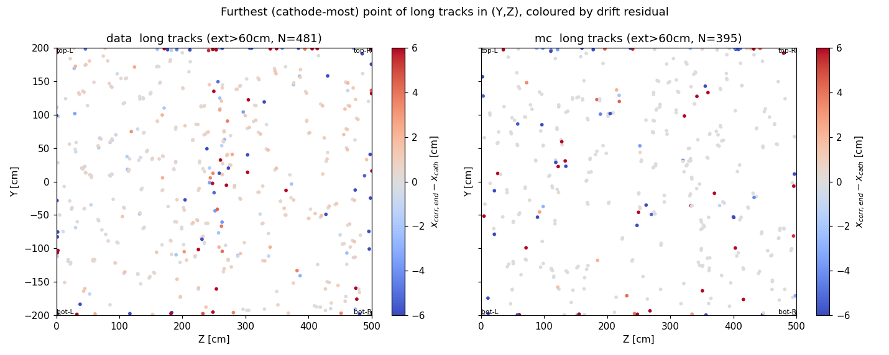

# SBND cathode-plane field-cage distortion map

## Why

SBND is suspected to have a field-cage distortion near the cathode plane,
concentrated in one top corner of the detector. After Q/L matching + the
per-cluster T0 correction every matched cosmic is reconstructed at its true
drift position, so the reconstructed geometry near the central cathode
(x = `cathode_x` ≈ ±0.45 cm) can be used to **map** the distortion across the
(Y, Z) plane (Y vertical, Z beam) and localise the problem.

This extends [`cathode-crossing-diagnostic.md`](cathode-crossing-diagnostic.md),
which measured the *aggregate* TPC0/TPC1 cathode offset (data ≈ 1.4 cm vs
MC ≈ 0.5 cm transverse), into a **spatially resolved** field over the cathode plane.

## Data

- **Source:** per-event calib dump `work/ql_evt<ID>/calib-evt<ID>.json`
  (`QLMatching::dump_calib`, `match/src/QLMatching.cxx:1626`), produced with the
  existing observation-only flags:
  ```
  SBND_DATA_DIR=input-3files-lan-reco2/{1,2,3} ./run_ql_evt.sh data all -calib -cathode-diag
  ./run_ql_evt.sh data all -calib -cathode-diag      # 10 extra (input-1file) data events
  ./run_ql_evt.sh mc   all -calib -cathode-diag      # 10 original MC reference events
  ```
  These flags default OFF and leave the matched output byte-identical, so nothing
  in the reco path changes.
- **MC baseline (`input-10files-mc`, 118 events).** Those 10 files share the
  event-id space 1–50, so they are first remapped to globally-unique ids
  (`uid = 700000 + file·1000 + evt`, `build_mcbase_stage.py`) and then run through
  the **full chain — imaging + clustering + QLMatching** with `run_mcbase.sh`
  (parallel, 64 CPU; uses the new `SBND_INPUT_DIR` override added to `_runlib.sh`):
  ```
  python3 build_mcbase_stage.py          # stage 10 files -> unique ids
  ./run_mcbase.sh                        # per file: run_img_evt.sh + run_ql_evt.sh -calib -cathode-diag
  ```
  The analysis classifies any id ≥ 700000 (plus the 10 small original ids) as MC.
- **Sample:** 160 data events (150 lan-reco2 + 10) vs **128 MC** (118 baseline +
  10 reference) — a real, statistically-useful low-distortion baseline (MC's
  cathode offset is ≈ ⅓ of data).
- **T0-corrected position** of a cluster in its `auto_selected` bundle:
  `x_corr = x_raw + sign_offset · flash_time_us · drift_speed_cm_per_us`
  (y, z unchanged). The cathode-most point of a cathode-reaching track should
  land at `cathode_x`.
- The clean **xTPC** signal comes from the vetted `QLCATHODE` log lines
  (`dump_cathode_diag`, `QLMatching.cxx:1854`): for each cross-cathode track the
  two TPC halves must meet at the cathode, so the perpendicular (transverse)
  component of the connecting vector — `perp = conn − (conn·d̂)d̂` with
  `d̂ = unit(dir0 + dir1)` — is the artifact-immune distortion (the drift x part
  is degenerate with T0/velocity).

Analysis script: [`../cathode_distortion.py`](../cathode_distortion.py)
(parallel JSON load + plotting; `python3 cathode_distortion.py -j 16`).

## Method — six (Y, Z) views

| plot | what it isolates |
|---|---|
| `cathode_coverage_yz.png`            | near-cathode slab occupancy of **all** matched-track points (depletion ⇒ distortion / dead region) |
| `cathode_xresidual_yz.png`           | mean `dx = x_corr,end − cathode_x` (drift; **T0/velocity-degenerate** for single tracks — read vs MC) |
| `cathode_transverse_residual_yz.png` | per-track cathode-end **off-axis** transverse residual vs the full-track PCA axis (distortion **curvature**); data only — MC too sparse to bin |
| `cathode_xtpc_perp_yz.png`           | **xTPC** transverse offset scatter + (Δz, Δy) quiver — the clean, T0-immune signal |
| `cathode_profiles.png`               | transverse residual vs Y and vs Z (xTPC absolute, per-track curvature), data vs MC |
| `cathode_furthest_points_yz.png`     | cathode-most point of long tracks, coloured by `dx` |
| `cathode_surface_3d.png`             | the **apparent cathode as a 2-D surface in 3-D**: mean `dx` over (Y, Z) — flat ⇒ undistorted, warped ⇒ drift-direction distortion |
| `cathode_closest_yz.png`             | per-(Y, Z)-bin **closest approach** of charge to the cathode (`min \|x_corr − cathode_x\|`, rebinned) — large ⇒ charge stops short (distortion / dead region) |

The transverse (Y, Z) components are artifact-immune; the drift (x) component is
degenerate with T0/drift-velocity for single-TPC tracks and is shown only
relative to MC.

## Results

**The distortion is real, grows downstream, and peaks in the top-right corner.**

- **xTPC transverse offset:** data median **1.17 cm** vs MC **0.35 cm**
  (≈ 3.3× excess; 244 data vs 200 MC crosser pairs) — reproduces the aggregate
  1.4 / 0.5 cm of the crossing diagnostic via an independent path, now with a
  real MC baseline. (`cathode_xtpc_perp_yz.png`)
- **Z dependence:** the offset rises from ≈ 1.0 cm at low Z to ≈ 2.5 cm at
  Z ≳ 450 cm, while MC stays flat at ≈ 0.3–0.8 cm. **Y dependence:** data is
  above MC across all Y and largest at the |Y| extremes (≈ 2 cm). The excess
  therefore concentrates in the **corners**. (`cathode_profiles.png`)
- **Hotspot (auto-found, clean xTPC signal):** largest |perp| ≈ **3.0 cm** at
  **(Z ≈ 450, Y ≈ 150) cm — high-Z, high-Y = the top-right corner**, exactly the
  suspected field-cage region.
- **Closest-approach map** (`cathode_closest_yz.png`): in **data TPC1** the
  charge stops systematically ~1–2 cm short of the cathode toward high Z, with an
  ~8 cm cell at the **top-right corner**, whereas MC reaches the cathode (≈ 0)
  almost everywhere — independent corroboration of the same corner.
- **3-D apparent-cathode surface** (`cathode_surface_3d.png`): the data TPC1
  surface is visibly warped vs the flatter MC sheets (drift-direction view; this
  component is T0-degenerate per track but averages to the systematic shape).
- **Per-track curvature** (off-axis residual) is data > MC in aggregate
  (median 0.89 vs 0.52 cm) but spatially noisy; it corroborates the excess
  without localising as cleanly as the xTPC signal.
- **Occupancy** of all near-cathode matched-track points (≈ 320k data points)
  shows the cosmic coverage; no large clean acceptance hole stands out, so the
  signal is a *displacement* field, not a dead region.










## Caveats

- **MC is now a real baseline (128 events)**, statistically comparable to the
  160 data events: the data-vs-MC contrast in the 1-D profiles and aggregate
  medians is robust. MC is a *low*-, not zero-, distortion baseline. (The 2-D
  off-axis map is still shown data-only — per-track curvature is noisy per cell.)
- The corner-resolved signal rests on **244 xTPC crosser pairs** (data); a single
  (Y, Z) corner bin holds only a handful, so the hotspot location is indicative,
  not yet a precise measurement.
- Single-track `dx` is **degenerate** with T0 / drift-velocity; only the
  transverse (Y, Z) components are clean. The per-track off-axis residual
  measures distortion **curvature** (a gradient), not the absolute offset.

## Next steps

- **More DATA is now the binding constraint.** The MC baseline is in hand
  (128 events); the limit is the data xTPC-crosser sample (~1.6/event → 244
  pairs over the whole plane). ~10× more *data* would turn the indicative
  top-right hotspot into a quantitative, statistically-significant (Y, Z)
  distortion map (a single corner bin currently holds only a handful of pairs).
- Once the corner is pinned, correlate (Z ≈ 450, Y ≈ 150) with the GDML
  field-cage geometry (`sbnd_geometry/sbnd_v02_06.gdml`) to identify the physical
  panel/feature responsible.
- If the displacement field is reproducible, consider a **(Y, Z)-binned transverse
  correction** feeding the existing `pos_offset` / `T0Correction` path (currently a
  single rigid offset, `pos_offset` in `cfg/.../sbnd/clus.jsonnet`) — design /
  measure only, kept toggleable + default-OFF per project convention.
- Cross-check against an independent SCE / space-charge expectation if a model
  becomes available; a true space-charge field would also bow tracks in x, which
  the drift-degeneracy currently hides.
