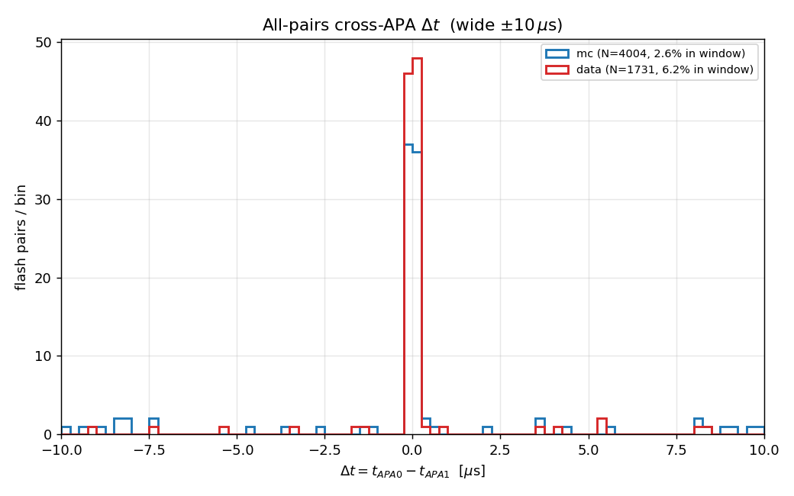
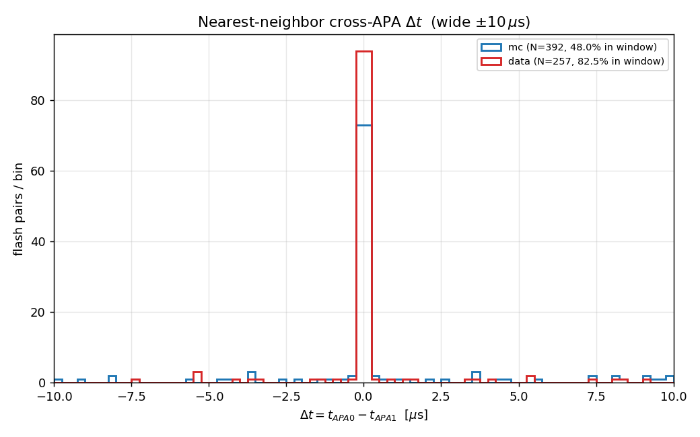
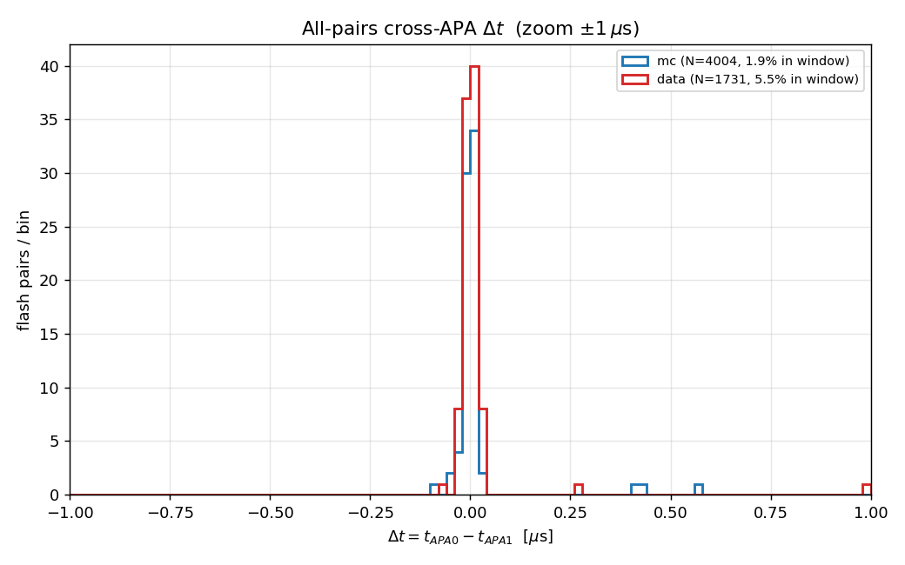
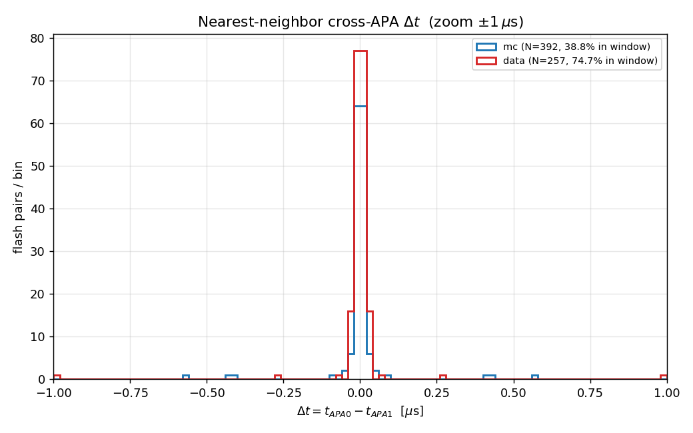
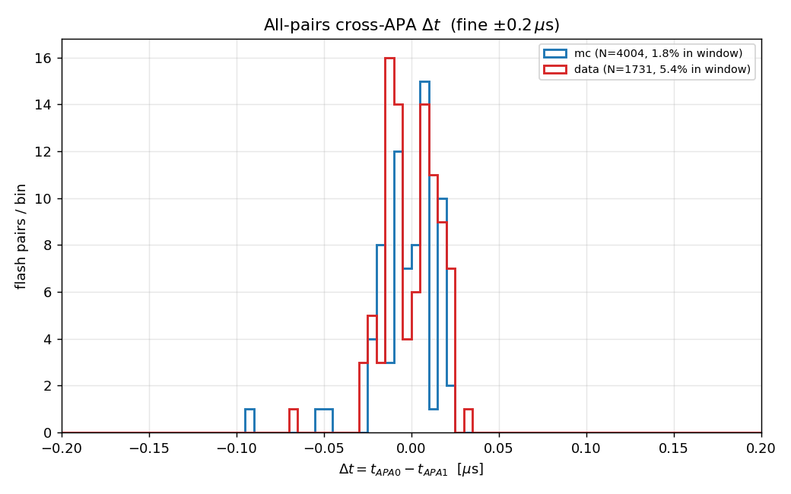
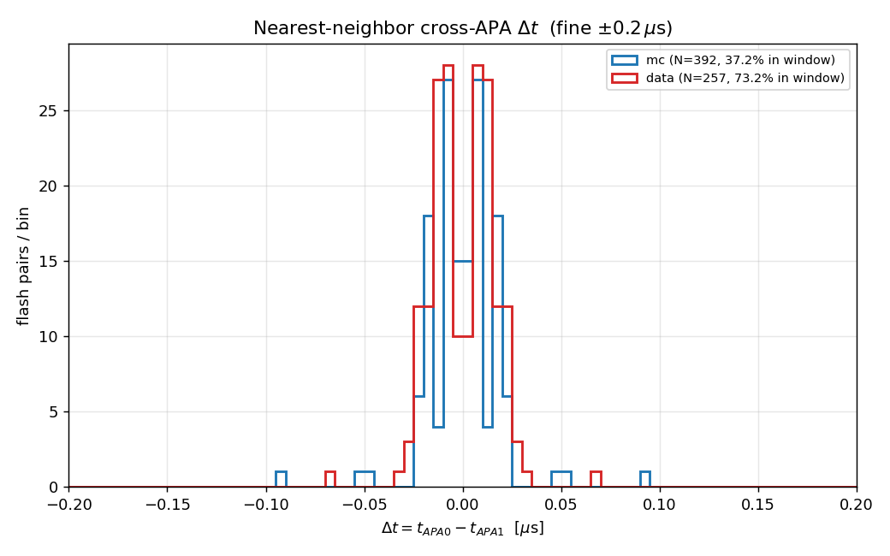
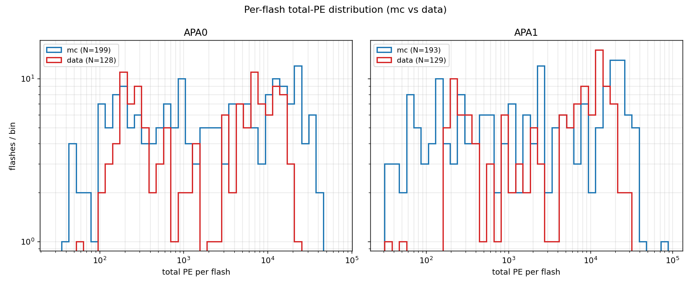
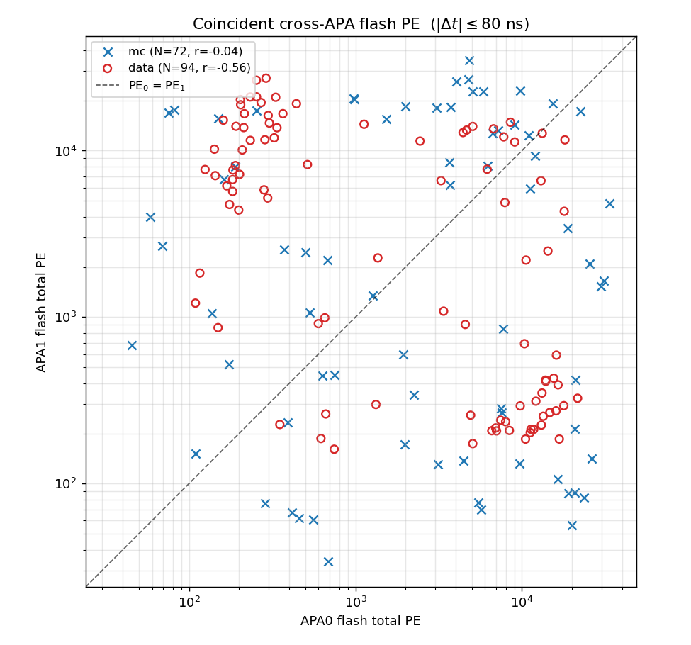
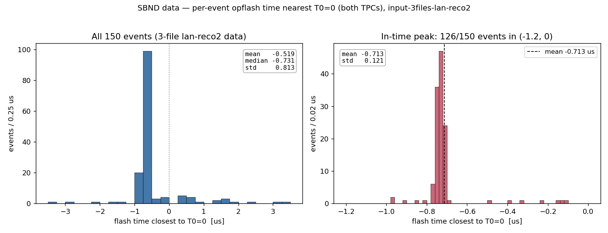

# SBND cross-APA flash coincidence

## Purpose

In SBND the optical **flash** information is reconstructed and stored **separately for
each APA / TPC** (APA0 and APA1). A real scintillation event illuminates both TPCs, so
the two APAs should report a flash at essentially the same time. This note quantifies
that coincidence: the distribution of

```
Δt = t(APA0 flash) − t(APA1 flash)
```

computed within each event, separately for **simulation (mc)** and **data**.

## Data layout

Flash archives (one per APA, per mode):

| mode | path |
|------|------|
| mc   | `input_files/input-10evt-mc/opflash_apa{0,1}.tar.gz` |
| data | `input_files/input-10evt-data/opflash_apa{0,1}.tar.gz` |

Each archive holds, per event, `opflash_tensor_<EVENT>_0_array.npy` of shape
`[nflash, 313]`:

- **column 0** — flash time in **nanoseconds** (WCT units; spans ≈ ±1.2 ms, the drift window),
- **columns 1–312** — per-channel photo-electrons (PE) for the 312 SBND OpDet channels.

Each mode has 10 events with matching event IDs across APA0/APA1 (mc: 2, 9, 11, …;
data: 659242, 659286, …). Per event there are ~8–29 flashes per APA.

## Method

For every flash we record `time_ns`, `total_pe = Σ PE`, and `nchan_hit`. All flashes are
dumped (no PE cut) to **`flash_dump.csv`** — one row per flash, columns
`mode, event, apa, flash_index, time_ns, total_pe, nchan_hit` (649 flashes total: 392 mc,
257 data).

Coincidence Δt is computed **within the same event only** (cross-event pairs are
meaningless), two ways:

- **All-pairs** — `t0[i] − t1[j]` for every (APA0, APA1) flash pair. Shows the
  coincidence peak on top of the combinatorial background.
- **Nearest-neighbor** — for each flash, the signed Δt to the *closest* flash in the
  other APA (taken in both directions). Isolates the peak; large |Δt| values are flashes
  with no genuine partner ("orphans").

No PE threshold is applied. The per-flash total-PE distribution is shown separately.

Reproduce with:

```bash
python3 flash_coincidence.py            # default zoom = ±1 µs
python3 flash_coincidence.py --zoom 0.5 # custom zoom half-window in µs
```

## Results

### Wide window (±10 µs) — the requested first look




The coincidence peak is **entirely confined to the central bin** even at ±10 µs — the
±10 µs window is far wider than the actual coincidence. Fractions of pairs landing inside
±10 µs:

| metric | mc | data |
|--------|----|----|
| nearest-neighbor | 48 % | 82 % |
| all-pairs | 2.6 % | 6.2 % |

Already a clear difference: **data flashes are much more tightly coincident** across APAs,
while a large fraction of **mc** nearest-neighbor pairs fall *outside* ±10 µs — i.e. mc has
many flashes with no cross-APA partner nearby.

### Zoom (±1 µs)




Even at ±1 µs the peak occupies only the few central 20 ns bins.

### Fine zoom (±0.2 µs, 5 ns bins) — the coincidence resolved




The cross-APA coincidence is a sharp peak centred on Δt = 0 with a half-width of only a
few tens of ns:

- nearest-neighbor core (|Δt| ≤ 1 µs): **68 % within ≈ 16 ns, 95 % within ≈ 45 ns**,
- the peak is centred on zero with **no measurable inter-APA timing offset**: using the
  all-pairs metric (consistent `t0 − t1`, no symmetrization), the core (|Δt| ≤ 50 ns) has
  mean ≈ −1.0 ns (mc) / +0.5 ns (data), i.e. zero to ~1 ns; the spread is std ≈ 13 ns.
- **A reproducible feature:** both the all-pairs and nearest-neighbor histograms show a
  small *depletion* in the innermost ±5 ns with symmetric shoulders near ±10 ns. Because
  it survives in the un-symmetrized all-pairs metric it is **not** a plotting artifact;
  it most likely reflects flash-time reconstruction quantization (the optical-tick grid),
  but the exact cause is not pinned down here and is flagged for follow-up.

So the two TPCs see the same flash to within **a few tens of nanoseconds**, with no net
time offset between APA0 and APA1.

### Per-flash PE distribution



Total PE per flash spans ~30 to 10⁵ in both modes and both APAs. **mc has an excess of
low-PE flashes** (down to ~40 PE) relative to data, which peaks toward higher PE
(≳ 10⁴). These extra low-PE mc flashes are the most likely source of the larger mc
"orphan" tail seen in the nearest-neighbor distributions — low-PE flashes that have no
matching partner in the other APA.

### Coincident cross-APA PE correlation (±80 ns window)

Using a **±80 ns** coincidence window (which captures essentially the whole peak), each
APA0 flash is matched to its nearest APA1 partner within the window, and the two total-PE
values are plotted against each other (data = red open circles, mc = blue crosses):



72 mc pairs and 94 data pairs. The structure is **anti-correlated** rather than lying on
the PE₀ = PE₁ diagonal:

- **Data (r = −0.56 in log PE)** splits into two lobes — high PE in one APA paired with low
  PE in the other. This is the expected cathode-side signature: scintillation light from
  activity near one APA's photodetectors gives a large flash there and a small one in the
  far APA, and vice-versa. So the *relative* PE of the two APAs encodes which drift volume
  the light came from.
- **mc (r = −0.04)** is much more scattered and lacks this clean anti-correlation,
  indicating the simulated inter-APA light sharing does not reproduce the data as cleanly
  — worth following up in the optical/photon-propagation model.

## Takeaways

1. The cross-APA flash coincidence is real and **very sharp: a few tens of ns** (68 %
   within ~16 ns). The originally requested ±10 µs window is ~3 orders of magnitude too
   wide.
2. **Data is cleaner than mc**: ~82 % of data nearest-neighbor pairs fall within ±10 µs
   vs only ~48 % for mc. mc produces more low-PE "orphan" flashes without a cross-APA
   partner, consistent with the PE distribution.
3. For a coincidence cut, **±50–100 ns** captures essentially all genuine cross-APA
   matches while rejecting the combinatorial/orphan background.

## In-time flash time relative to T0=0

A separate question (not the cross-APA Δt above): in each event, where does the
**in-time / beam flash** sit relative to T0=0? The opflash tar holds *all* flashes of
the event (cosmics across the full ±1.2 ms readout); the in-time flash is the one with
**min |time|**, taken across both APAs. This was measured on the larger
**`input_files/input-3files-lan-reco2/`** data sample (3 source files × 50 events =
150 events; each bundle dir `1/2/3` has its own `opflash_apa{0,1}.tar.gz`).



| quantity | value |
|---|---|
| events | 150 |
| median (all) | **−0.731 µs** |
| in-time peak, t ∈ (−1.2, 0) µs | **126/150** events, mean **−0.713 µs**, std **0.121** |
| mean (all) | −0.519 µs (pulled by a ~24-event off-time tail) |

The closest-to-T0 flash is sharply peaked at **≈ −0.71 µs** — i.e. data's in-time flash
sits **below** zero, consistent with the standard 10-event data sample (≈ −0.74 µs) and on
the **opposite side of zero from MC** (which lands at +0.4 to +1.6 µs; MC interaction times
are not locked to a fixed trigger window the way triggered data is). ~24 events fall in a
scattered off-time tail (no in-time flash reconstructed near zero — cosmic-only events or a
missed beam flash). *(Note: `BEE-links.md` flags all three files as SIGSEGV in the larsoft
bundle dump, but the frames/imaging/opflash outputs are intact, so this extraction is
unaffected.)*

Reproduce with `python3 flash_t0_lan_reco2.py` (run from `sbnd_xin/`).

## Files

- `flash_coincidence.py` — analysis + plotting script.
- `flash_dump.csv` — all 649 flashes (mc + data, both APAs).
- `flash_t0_lan_reco2.py` — per-event in-time flash time vs T0 (3-file lan-reco2 sample).
- `pics/flash_coinc_{allpairs,nearest}_{wide,zoom,fine}.png` — Δt histograms.
- `pics/flash_pe_dist.png` — per-flash total-PE distribution.
- `pics/flash_pe2d_coinc.png` — coincident (±80 ns) cross-APA PE scatter, data vs mc.
- `pics/flash_t0_lan_reco2.png` — per-event flash time nearest T0=0 (3-file lan-reco2 data).
