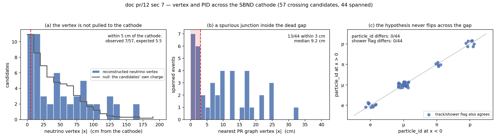
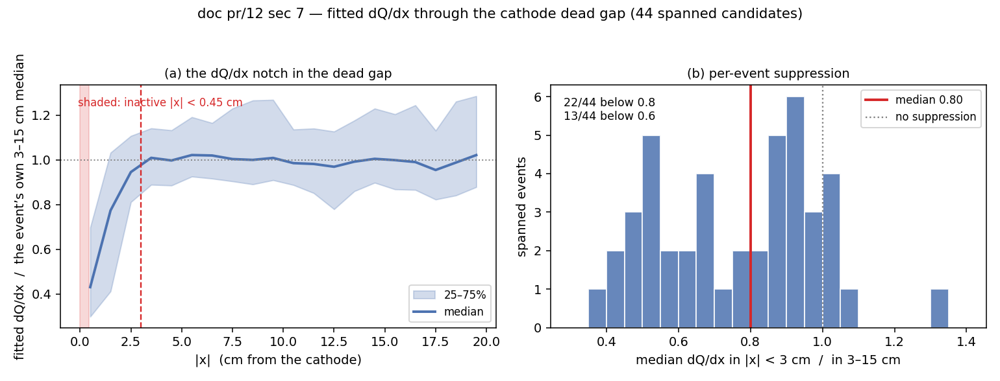

# Doc pr/12 — What the PR chain does with a neutrino candidate that crosses the cathode

**Status: DONE (measurement + Bee displays).** No toolkit C++ or jsonnet is changed by
this round, so no A/B gate applies and none is claimed. Everything below is read out of
outputs the PR chain already writes.

Question (owner): in the two SBND data samples — 1000 MCP2025C events and the 48 Lynn
nueCC events — find neutrino interactions with part of a track passing through the
central cathode, and establish whether such a track is reconstructed as **two** tracks
instead of one, and whether the neutrino vertex and the other PR steps are affected.
Deliver Bee links carrying img-global together with the PR layers (track-vs-shower
sub-clustering, dQ/dx).

**Headline**

| | |
|---|---|
| Candidates whose fitted trajectory and/or charge crosses the cathode | **57** of the **619** evaluated candidates (9.2%), drawn from 1048 events — 54 mcp1k, 3 nueCC48 |
| Fit crosses the cathode | 45: **44 as a single segment, 1 as two segments** |
| "Two tracks instead of one" — a genuine split at the cathode | **1/45 (2%)** — nueCC48 evt 267597 |
| Fit does **not** cross while the charge does | **12** — but in **7 of them the far half is a different Q/L bundle, matched to a different, out-of-beam flash**, so the PR chain never receives it (§6). Only **1** is a PR-side failure on a joined cluster |
| Spurious PR vertex within 3 cm of the cathode | **13/44** spanned events, plus the 1 split |
| Track/shower flag flipping across the cathode | **0/44** |
| `particle_id` flipping across the cathode | **0/44** |
| Neutrino vertex within 5 cm of the cathode | **7/57 observed vs 5.5 expected** from the candidates' own charge — no attraction (§7 fig, panel a) |
| dQ/dx suppression in the gap (median of \|x\|<3 cm over 3–15 cm) | **0.80**; 22/44 below 0.8, 13/44 below **0.6**; the pooled profile bottoms at **0.43** in the 0–1 cm bin |
| Transverse (y,z) offset measured at the crossing | median **1.08 cm** — an independent confirmation of doc 14's data cathode offset |

So the answer to the question as posed is: **the PR chain does not turn a
cathode-crossing track into two tracks.** Of the 50 candidates whose two halves are one
Q/L cluster by the time the PR job sees them, **44 are fitted as a single segment across
the cathode**, absorbing both the ~0.9 cm dead gap and the ~1 cm transverse offset (§4);
**1** is split in two (§5); **5** are not fitted across at all (§6).

What does go wrong sits **upstream of PR**: in 7 of the 12 candidates whose charge
crosses the cathode but whose fit does not, the far half is a *separate Q/L bundle
matched to a different flash* — out of the beam window, T0 differing by 2.4–12 µs — so
cathode_connect (T0 window 800 ns) rightly left them apart and the beam-window gate
handed the PR chain only the in-beam half (§6). What the PR chain itself contributes is
milder: a spurious graph vertex in the dead gap in 13/44 spanned events, and a 20–40%
dQ/dx notch there (§7).

## Repro

```bash
cd wcp-porting-img/sbnd/sbnd_xin

# 1. Selection net: census over the doc pr/11 population arms (binary 289d78e4).
python3 scripts/analysis/cathode/cathode_nu_census.py --root work-mcp1kall-pr11v3 --sample mcp1k   --out /home/xqian/tmp/c3_mcp1k.tsv
python3 scripts/analysis/cathode/cathode_nu_census.py --root work-nuecc48-pr11v3  --sample nuecc48 --out /home/xqian/tmp/c3_nuecc.tsv
python3 scripts/analysis/cathode/cathode_nu_census.py --merge /home/xqian/tmp/c3_mcp1k.tsv /home/xqian/tmp/c3_nuecc.tsv \
        --out docs/pr/12_cathode-census-pr11v3.tsv --summary

# 2. Authoritative arm: the 57 selected events re-run at HEAD (3fe65876).
export PR_TIMEOUT=1800
PR_JOBS=16 ./run_pr_chain_batch.sh work-mcp1kall-d59k work-mcp1kall-cath01 data \
    51051 52085 52195 53427 56463 57575 58321 59003 59025 59247 60933 61579 63603 \
    166738 169620 169824 172656 173234 276836 280972 281595 284013 285531 285929 \
    285971 286241 286400 287654 288952 289559 289832 292384 292643 313979 315497 \
    316729 348691 349549 350297 352233 353223 353751 392200 392552 395610 395654 \
    398690 399118 404244 404684 406796 407280 409634 492913
PR_JOBS=3  ./run_pr_chain_batch.sh work-nuecc48-nuf   work-nuecc48-cath01  data \
    214469 267597 437699

# --ql-root turns on the join test of sec 6 (was the far half even in the candidate's
# cluster in the PR job's input?) -- without it a fit stopping at the cathode is
# indistinguishable from a tracking failure.
python3 scripts/analysis/cathode/cathode_nu_census.py --root work-mcp1kall-cath01 --ql-root work-mcp1kall-d59k \
        --sample mcp1k   --out /home/xqian/tmp/f_mcp1k.tsv
python3 scripts/analysis/cathode/cathode_nu_census.py --root work-nuecc48-cath01  --ql-root work-nuecc48-nuf \
        --sample nuecc48 --out /home/xqian/tmp/f_nuecc.tsv
python3 scripts/analysis/cathode/cathode_nu_census.py --merge /home/xqian/tmp/f_mcp1k.tsv /home/xqian/tmp/f_nuecc.tsv \
        --out docs/pr/12_cathode-census.tsv --summary     # every table below

# sec 6 flash-t0 table: the near/far bundle ids are the ql_cid_near / ql_cid_far columns;
# their t0 / in_beam come from the Q/L per-event table
awk 'NR==1 || $4==<bundle>' work-mcp1kall-d59k/nusel_evt288952/nusel-evt288952.tsv

# 3. The sec-7 figures.
python3 scripts/analysis/cathode/cathode_plots.py --census docs/pr/12_cathode-census.tsv \
        --root mcp1k=work-mcp1kall-cath01 --root nuecc48=work-nuecc48-cath01 \
        --outdir docs/pics

# 4. Bee sets (13 pathological + 44 spanned).
python3 scripts/bee/make_pr_bee.py -q work-mcp1kall-d59k -q work-nuecc48-nuf \
                       -p work-mcp1kall-cath01 -p work-nuecc48-cath01 \
                       -o cath_broken.zip  <chunk A ids>
python3 scripts/bee/make_pr_bee.py ... -o cath_spanned.zip <chunk B ids>
./upload-to-bee.sh cath_broken.zip ; ./upload-to-bee.sh cath_spanned.zip
```

**Freshness proof (M1).** `local/lib/libWireCellClus.so` mtime `2026-07-31 11:08:52` >
last source edit `clus/src/NeutrinoTaggerNuE.cxx 11:08:31`; md5
`07a78447c72af893f2c2e501b920d8d5` (Clus) / `1e0908bee5c2369265886552dea70bfb` (Root)
recorded **before and after** both arms and unchanged — a concurrent session shares this
tree, so all 57 events provably ran on one binary, HEAD `3fe65876`. 57/57 `rc=0`.

**pr11v3 → HEAD comparison.** All 57 events were re-classified on the fresh arm and
compared column by column against the pr11v3 census (`cls`, `gap3d_cm`, `dyz_cm`,
`seg_neg`, `seg_pos`, `vtx_absx`, `n_fit`, `n_seg`, `qgap3d_cm`, `nu_x`, `dqdx_ratio`):
**57/57 identical, 0 class changes.** The `out_edges` determinism fix (`3fe65876`) moves
`nue_score`, not the cathode geometry, so the pr11v3 selection net was valid.

## 1. Encodings — read from source, not inferred

The classification rests on three encodings; all three were confirmed in the writers
before any number was quoted.

- `T_rec_charge.sub_cluster_id` **==** `.real_cluster_id` — the two branches are bound to
  the *same* variable (`root/src/SbndPrMagnifyTrackingVisitor.cxx:378-379`), filled as
  `seg->cluster()->get_cluster_id()*1000 + seg->get_graph_index()` (`:522`). A change of
  this value therefore means **a different fitted segment**. Vertex rows carry `-1`
  (`:484`) because `include_vertex_points` appends the PR-graph vertex fit points.
  `.cluster_id` is `reco_mother_cluster_id` (`:375`) — the event's main cluster, repeated
  on every row, *not* a per-row id.
- `q` / `nq` = `dQ*dQdx_scale + dQdx_offset` and `dx` in cm (`:363-364`, `:497-498`);
  `Trun` carries the scale/offset (0.1 / −1000 on SBND), so
  `dQ/dx = (q − offset)/scale / nq`.
- `vertices-global` = every PR graph vertex, `q = 15000` iff `kNeutrinoVertex`
  (`clus/src/MultiAlgBlobClustering.cxx:1011`), id `cluster*1000 + vertex graph index`.

**Two exclusions decide the headline, and both were nearly missed.**

1. `sub_cluster_id == -1` rows must be dropped before the segment-continuity test. They
   are vertex fit points and occur on *both* sides of the cathode, so leaving them in
   makes the negative-side and positive-side segment sets share `-1` in every event —
   every crosser then looks spanned and the split rate reads a spurious **0/63**.
2. `T_tagger` `nu_(x,y,z) == (0,0,0)` exactly is an unfilled sentinel, not a vertex at
   the cathode. 50 of the 629 evaluated events in the doc pr/11 census carry it (none in
   this doc's 57, which is why the vertex table below is clean).

A third trap, found by measurement: a first pass classified crossers by "≥3 fitted points
within 6 cm of the cathode on both sides" and reported **13/63 torn**. Re-measured with
the *nearest cross-cathode pair*, those 13 have fit gaps of 12–14 cm — they are two
unrelated objects each ending near the cathode, not one track split in two. The
nearest-pair definition below is the one used throughout.

## 2. Method

For each event with a real candidate (`TaggerCheckNeutrino: selected main cluster …` in
the log — the only reliable signal, per pr_scores_table.py), take the candidate's fitted
trajectory from `T_rec_charge`, drop the `-1` vertex rows, and find the closest pair of
fitted points straddling x = 0.

| class | definition |
|---|---|
| `spanned` | nearest cross-cathode pair < 4 cm apart in 3D **and** both points in the **same** segment |
| `split` | same proximity, **different** segments — the track is two tracks at the cathode |
| `eroded` | points on both sides, nearest pair ≥ 4 cm — the fit does not reach across |
| `one-sided` | fitted points on one side of x = 0 only |
| `no-contact` | no fitted point within 6 cm of the cathode on either side |
| `tiny` | fewer than 10 fitted segment points |

Then, independently of the fit, the **charge**: in a 10 cm (y,z) tube centred on the
fit's cathode-end point (one tube per side, smaller gap kept — for `eroded` events the
two ends can be 12+ cm apart, so a single tube on their midpoint would sit on neither
track), find the closest cross-cathode pair of `clustering-global` points. `qgap ≤ 4 cm`
means the charge runs continuously through the cathode whatever the fit did.

For the events where charge crosses but the fit does not, one further test separates "the
fit dropped half the track" from "a different particle happens to pass within 10 cm":
take the local fit direction at the cathode end (PCA of that segment's 10 nearest points,
oriented outward) and measure the perpendicular distance of the far-side charge from that
extrapolation. `q_extrap_n` counts far-side charge points within 3 cm of the extrapolated
line and ahead of the endpoint.

## 3. Population

1048 events (1000 mcp1k + 48 nueCC48) → 619 with a selected neutrino candidate.

| class | mcp1k | nueCC48 | all |
|---|---|---|---|
| spanned | 43 | 1 | **44** |
| split | 0 | 1 | **1** |
| eroded | 76 | 9 | 85 |
| one-sided | 23 | 4 | 27 |
| no-contact | 340 | 32 | 372 |
| tiny | 90 | 0 | 90 |
| **total** | 572 | 47 | **619** |

Of the 85 `eroded` and 27 `one-sided`, only **12** have charge continuous across the
cathode; the other 100 are candidates with two unrelated objects near the cathode plane,
which the nearest-pair definition correctly declines to call crossers.

Candidates whose **charge** crosses (`qgap ≤ 4 cm`): **53** — spanned 40, split 1,
eroded 6, one-sided 6. The doc's working set is the union of "fit crosses" and "charge
crosses" = **57 events**, which is also the Bee set.

> **Scope substitution, stated explicitly.** The owner approved "all 63 crossers" when 63
> was the crude count from the superseded ≥3-fitted-points-within-6-cm-on-both-sides
> definition. That definition does not survive the nearest-pair refinement (§1), so the
> delivered set is the 57 events above. Recomputed on the final point set (the original
> 63 also counted the `sub_cluster_id == -1` vertex rows) the crude rule yields **59**
> events. Against the delivered 57: **48 in common, 11 crude-only** (all `eroded`, i.e.
> two unrelated objects each ending near the cathode), **9 delivered-only** (6
> `one-sided` + 3 `eroded`). The 6 `one-sided` events could never have been in the crude
> set — it required fitted points on *both* sides, and those events have none on one
> side, which is precisely what makes them interesting.

## 4. The crossing survives as one track — 44/45

Where the fit does reach across the cathode it almost always does so as a **single
fitted segment**: 44 of 45. Typical numbers (median over the 44):

- nearest cross-cathode fit pair **2.03 cm** apart, with the two points at
  |x| ≈ 0.66 cm — i.e. the fit runs right up to the ±0.45 cm dead-gap edge on both sides;
- **18 / 18.5** fitted points within 6 cm of the cathode on the two sides;
- transverse offset across the gap **dyz = 1.08 cm** (quartiles 0.84 / 1.61) — this is
  doc 14's data cathode misalignment (≈1.4 cm transverse, ≈0.5 cm in MC), re-measured
  here on the PR trajectory fit rather than on cluster geometry, by a completely
  independent method. The fit absorbs that kink without breaking.

Five longest examples:

| event | L (cm) | fit gap (cm) | dyz (cm) | segment | dQ/dx ratio | nearest vertex \|x\| (cm) |
|---|---|---|---|---|---|---|
| 280972 | 511.4 | 1.80 | 1.00 | 7001 | 0.857 | 12.18 |
| 292384 | 460.5 | 2.40 | 2.03 | 19004 | 1.015 | 9.29 |
| 407280 | 352.5 | 2.40 | 1.81 | 16003 | 0.504 | 13.20 |
| 286400 | 338.3 | 2.26 | 1.27 | 11003 | 0.564 | 2.16 |
| 281595 | 326.4 | 3.00 | 2.30 | 20001 | 0.899 | 21.83 |

## 5. The one genuine split — nueCC48 evt 267597

The single `split` event is the picture the question describes. A PR graph vertex sits at
**x = −0.62 cm**, exactly on the dead-gap edge (`q = 0`, so not the neutrino vertex —
the main vertex of this event is 80 cm away at x = +80.36). Incident structure:

| within | segments (id, x-range, npts) |
|---|---|
| 3 cm of the vertex | `12070` x ∈ [−7.24, −0.62], 16 pts — the incoming track;  `12053` x ∈ [−1.06, −0.62], **2 pts** — a stub |
| 6 cm | + `5039` x ∈ [+1.31, +4.41], 13 pts — the continuation on the other TPC |

So the incoming trajectory terminates at a vertex on the cathode, sprouts a 2-point stub,
and the far side continues as a *separate* segment that is not attached through the gap.
Its dQ/dx ratio in the gap is 1.373 — the fit compensates by inflating dQ/dx where the
charge is missing. Nearest-pair fit gap 3.02 cm, dyz 1.86 cm.

## 6. The fit stops at the cathode (12 events) — and why it is mostly not a PR failure

These are candidates whose charge runs through the cathode (charge gap ≤ 4 cm) while the
fitted trajectory does not. **8 of the 12** have the far-side charge lying on the fit's
own extrapolation, so the missing half is not a random neighbour. The obvious reading is
"the PR fit dropped half a track". **That reading is wrong for 7 of the 8**, and the
check that shows it is the one asking whether the PR chain was ever *given* both halves.

**The join test.** The PR job's input is the post-Q/L pctree, whose clustering the
`ql_evt<ID>/mabc-all-apa.zip` `clustering-global` layer records — after `cathode_connect`
(`cfg/pgrapher/experiment/sbnd/clus.jsonnet:84,376`, on with `cathode_x_cut = 5 cm`,
`drift_cut = 8 cm`, `flash_t0_window = 800 ns`). In the same 10 cm (y,z) tube used for
the charge test, do the near-side and far-side charge share a Q/L `cluster_id`?

(`scripts/analysis/cathode/cathode_nu_census.py --ql-root …`, column `ql_joined`; the tube is centred on the same
probe point at which the charge test found the crossing.)

| class | halves in one Q/L cluster | not joined |
|---|---|---|
| spanned | **44** | 0 |
| split | **1** | 0 |
| eroded | 5 | 1 |
| one-sided | 0 | **6** |

The control is decisive: **every** candidate whose two halves are one Q/L cluster and
whose fit reaches the cathode from both sides is fitted across it (44 spanned + the 1
split, 45/45). All 7 not-joined events are ones where the fit does not cross — because
the far half was never in the candidate's cluster.

Run over the whole 619-candidate population (`12_cathode-census-pr11v3.tsv`) the same
test covers 68 candidates with charge on both sides and gives the same picture:
spanned 44/0, split 1/0, eroded 15/1, one-sided 0/7 — **not one** `spanned` or `split`
candidate is unjoined, and **every** unjoined one fails to be fitted across.

**Why they are not one cluster.** For each of the 8 aligned events, the near and far
bundles read out of the Q/L per-event table (`nusel_evt<ID>/nusel-evt<ID>.tsv`):

| sample | event | near bundle | its flash t0 (µs) | in beam | far bundle | its flash t0 (µs) | in beam |
|---|---|---|---|---|---|---|---|
| mcp1k | 288952 | 2 | +2.177 | **1** | 14 | −4.323 | 0 |
| mcp1k | 169824 | 10 | +1.328 | **1** | 19 | −3.141 | 0 |
| mcp1k | 56463 | 12 | +1.185 | **1** | 17 | +5.746 | 0 |
| mcp1k | 59003 | 18 | +1.578 | **1** | 22 | −0.750 | 0 |
| nueCC48 | 437699 | 11 | +1.593 | **1** | 3 | +13.656 | 0 |
| mcp1k | 392200 | 27 | +0.683 | **1** | 15 | +3.113 | 0 |
| mcp1k | 398690 | 17 | +2.057 | **1** | 8 | −5.132 | 0 |
| mcp1k | 406796 | 9 | +0.699 | **1** | 9 | +0.699 | **1** |

Seven of the eight: the far half is a **separate Q/L bundle matched to a different
flash**, 2.4–12 µs away and **outside the beam window**. `cathode_connect`'s 800 ns T0
gate cannot join bundles that far apart, and the beam-window gate (doc 56) then hands
`TaggerCheckNeutrino` only the in-beam bundle. The PR chain never sees the far half, and
fitting only the near half is the correct behaviour given its input.

Whether those pairs are genuinely one particle is a **Q/L-matching** question, not a PR
one, and this doc does not settle it. It is worth asking: at SBND's ~0.16 cm/µs drift a
6.5 µs T0 difference moves x by only ~1 cm, so the two halves would line up across the
cathode whichever flash each was matched to — the alignment is not an artefact of the
mismatched T0s. See the existing cross-TPC consistency knobs (`cull_cross_tpc`,
`xtpc_joint_*`) for the machinery that already exists in that area.

**The one real PR-side case: evt 406796.** Near and far are the *same* in-beam bundle 9
(t0 +0.699 µs, L 108.7 cm), i.e. `cathode_connect` did join the halves, the charge gap is
3.65 cm and 42 far-side charge points sit 1.46 cm from the extrapolation — and the fit
still stops 4.66 cm short. This is the only event in the sample where the PR trajectory
fit demonstrably failed to cross a cluster it owned. The 5 joined `eroded` events are the
milder version of the same thing (fit gap over 4 cm on a joined cluster).

**Off-axis remainder.** 4 events (348691, 315497, 287654, 52195) have far-side charge at
d⊥ 5.0–9.2 cm with 0 points on the extrapolation — charge crosses the cathode nearby, but
not along this candidate.

## 7. Effect on the other PR steps



- **Neutrino vertex — not pulled to the cathode** (panel a). No sentinel `(0,0,0)` rows
  in the 57. 7/57 have a genuine neutrino vertex within 5 cm of the cathode, but "7" is
  only meaningful against where the vertex *could* have landed: taking each candidate's
  own fitted-point |x| distribution as the null (each event weighted equally), the
  expectation is **5.5**. Observed 7 vs expected 5.5 — no attraction. The grey step in
  panel (a) is that null; the reconstructed vertices track it across the whole range.
  In evt 267597, where a PR vertex *does* land on the gap edge, that vertex is not the
  neutrino vertex (it carries `q = 0`).
- **Spurious vertex activity in the gap** (panel b). 13 of the 44 spanned events
  nevertheless have a PR graph vertex within 3 cm of x = 0 (median nearest-vertex |x|
  over all spanned: 9.2 cm), and the shaded 0–3 cm band is the single most populated
  region of the distribution. The track is not broken there, but the graph acquires a
  junction at the gap.
- **Track vs shower, and PID — stable** (panel c). Every spanned event lies on the
  diagonal: `particle_id` differs across the cathode in **0/44**, `flag_shower` in
  **0/44**, across all four hypotheses present (e, μ, π, p). Whatever the gap does, it
  does not flip a track into a shower or change the particle hypothesis.
- **dQ/dx — a notch at a fixed detector location.**



  Panel (a) pools every fitted point of the 44 spanned candidates, each event first
  normalised to its **own** 3–15 cm median so detector-wide dQ/dx differences between
  events cannot create the feature. The profile is flat at 1.0 from ~3 cm outward and
  collapses to **0.43 in the 0–1 cm bin** — the notch is confined to, and centred on,
  the inactive |x| < 0.45 cm band. Panel (b) is the per-event ratio the tables quote:
  median **0.80**, 22/44 below 0.8, 13/44 below **0.6**, worst 0.356.

  This is charge that is physically absent, not a fit failure — but any logic that reads
  dQ/dx shape (STM Bragg matching, MIP identification, the kink finder) sees a 20–40%
  dip, at the same place in the detector, on every cathode-crossing track. Not
  investigated further here.

Both figures come from `scripts/analysis/cathode/cathode_plots.py` (see the Repro block); they read the same
census TSV and the same arms as every table above.

## 8. Bee displays

Two sets, both carrying **img-global, clustering-global, op (flash↔cluster), dead areas**
from the Q/L arm and **track_fit (dQ/dx), shower_track (track/shower + per-particle
sub-clustering), vertices (PR graph, neutrino vertex q=15000), mc (particle-flow tree)**
from the at-HEAD PR arm. Built by `scripts/bee/make_pr_bee.py` — a fork-by-duplication of
`scripts/bee/make_stmfit_bee.py` (M10: that script stays byte-untouched for `scripts/bee/make_scan_bee.sh`).

| set | events | link | index file |
|---|---|---|---|
| the 13 pathological cases (split first, then fit-stops-at-cathode) | 13 | https://www.phy.bnl.gov/twister/bee/set/f9d2ed52-617d-4835-a228-730feeaf84e1/event/list/ | `cath_broken.index.txt` |
| the 44 clean spanned crossings, longest first | 44 | https://www.phy.bnl.gov/twister/bee/set/94030ab6-f527-4544-9a56-fadb2bc5f9d3/event/list/ | `cath_spanned.index.txt` |

Bee index *i* is line *i*+1 of the index file; `<zip>.prid-map.txt` maps each PR cluster
id to the img-global id it was relabelled to, so a colour in the display can be traced
back to an event id and a PR cluster/segment. Bee index 0 of the first set is evt 267597,
the split; indices 1–8 are the eight fit-stops-at-cathode cases in §6, 9–12 the four
off-axis ones. Validated offline before upload: 7/7 layers present and non-empty on all
57 events.

Reading the display: `shower_track` colours by `real_cluster_id = cluster*1000 + segment`
— deliberately **not** remapped — so each fitted segment gets its own colour and a split
at the cathode is visible as a colour change at x ≈ 0. `track_fit` carries dQ/dx as
`q = dQ*0.1 − 1000`.

## 9. Caveats

- **The 1000-event sample is data**, where the in-beam bundle is dominantly cosmic: 54 of
  the 57 crossers are mcp1k in-beam bundles, most of which are cosmic rays rather than
  neutrino interactions. The reconstruction behaviour measured here is a property of the
  PR chain and applies to either, but the neutrino-enriched cases are the 3 nueCC48
  events — and one of those (267597) is the single genuine split, another (437699) is a
  split-flash case from §6. With n = 3 that is an observation, not a rate.
- No MC arm was run, so there is no truth vertex and no MC-vs-data contrast on the
  cathode offset (MC's is ≈1/3 of data's — doc 14). That contrast would separate "the
  fit is defeated by the 1.4 cm data misalignment" from "the fit is defeated by the gap
  itself"; it is the obvious next measurement and is **not** made here.
- The charge test uses a 10 cm (y,z) tube and a 4 cm gap threshold. Both are stated
  parameters of `scripts/analysis/cathode/cathode_nu_census.py` (`--radius`, `--gap`), not tuned to an outcome;
  the extrapolation test in §6 is what carries the "same track" claim.
- `no-contact` events are excluded by construction: their candidate has no fitted point
  within 6 cm of the cathode, so the candidate does not cross whatever charge exists
  elsewhere in the event.

## 10. What would fix it — proposal only, nothing implemented

Recorded for the owner's decision; any of these changes PR output unconditionally and
would need a default-OFF knob plus the usual gates (CLAUDE.md §5.1).

1. **The Q/L side first, not the PR side.** 7 of the 8 aligned §6 cases are two bundles
   with flash T0s 2.4–12 µs apart whose charge is nevertheless collinear across the
   cathode to within 0.4–2.4 cm. Either the flash assignment is wrong for one half, or
   they really are two particles. A targeted study — take these 7, look at the flash PE
   patterns and at whether a joint cross-cathode hypothesis scores better — would settle
   it, and is a prerequisite for any PR-side work on this class. Nothing in the PR chain
   can fix an input it is not given.
2. **Cathode-aware trajectory continuation (small, PR-side).** Only evt 406796 and the 5
   joined `eroded` events are cases where the fit failed to cross a cluster it owned.
   Allowing a segment to continue across a ≤4 cm gap when the far-side charge is on-axis
   would recover them — a handful of events, so a modest gain and a modest risk.
3. **Suppress vertex creation inside the dead gap.** 13/44 spanned events plus evt 267597
   acquire a PR graph vertex within 3 cm of x = 0. A vertex sitting inside a known
   inactive region is an artefact of the gap, not physics.
4. **Flag, or correct, the dQ/dx notch.** A fixed 20–40% dip at |x| < 3 cm is a known
   detector effect; the fitted dQ/dx could carry a validity flag there so Bragg/MIP logic
   can skip it rather than fit through it.

Items 2 and 3 would also need re-validation of every tagger that consumes the PR graph
(TGM/STM/FC and the neutrino taggers) — **not** bit-identical by construction.
