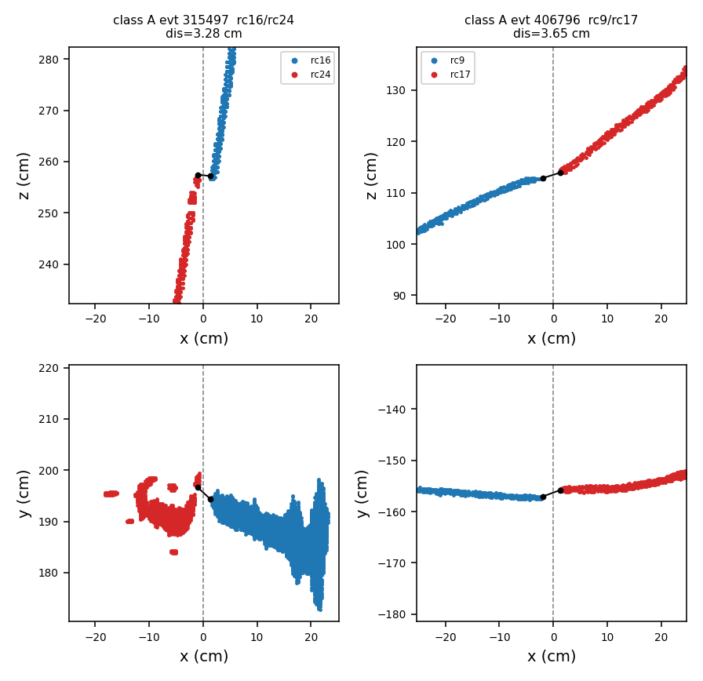
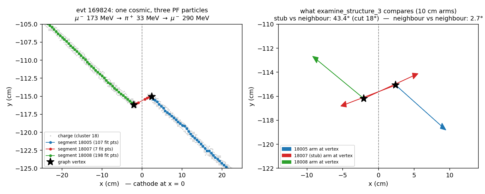
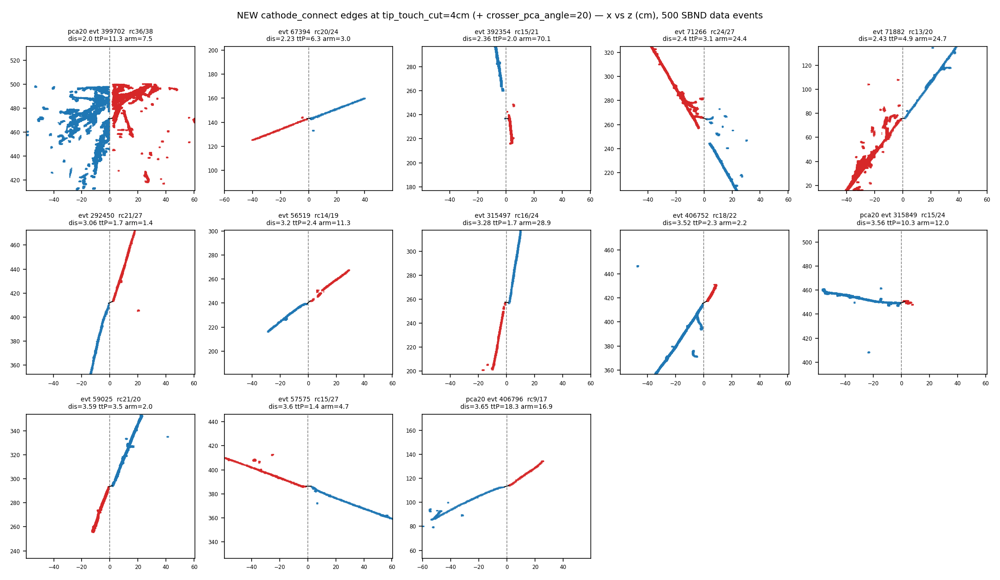

# doc pr/20 — one cosmic, two objects: a demoted bundle main, and a cathode crossing broken in two

Two independent ways a single cosmic becomes more than one object in the SBND
pattern-recognition chain. They were diagnosed in separate rounds and are
collected here because the second ends in the same place as the first: a cosmic
fragment that no cosmic tagger ever examined, adopted into the neutrino
candidate as a gamma hanging off its muon.

| | part | reproducing events | status |
|---|---|---|---|
| **I** | a Q/L bundle main demoted by the flash-group merge is never cosmic-tagged | 18255 / 59003 | **P1-P4 BUILT, all default OFF** (Parts VII, VIII); `kine_reco_Enu` 1202.5 -> 841.0 MeV with all four on, as predicted.  S10 DONE (Part IX): 1000-event census, PI-8 PASS, 14 drops / 1000 events, ALL convicted by STM and none by TGM.  **The length floor is NOT derivable from the data** (length does not predict impact); 15 cm is recommended on tagger-plausibility grounds only.  Hand scan of the 4 vertex-moving events is the remaining gate; **no default flip proposed** |
| **II** | a cathode-crossing track broken in two | 18259 / 169824, 18255 / 406796, 18255 / 315497 | diagnosis complete and reproduced at HEAD; fix design only — 2 SBND config lines + 2 new default-OFF passes |

No C++, jsonnet or runner changed for either part. The files this doc adds are
its two figures under `docs/pics/` and the three read-only analysis scripts
named in the Part II repro block.

A plan-review round (2026-08-02) went over both fix designs before any
implementation. Its inline additions are marked *(plan review)*; the combined
ordering of the two parts is the new §"Execution order" at the end.

## Part I — a Q/L bundle main demoted by the flash-group merge is never cosmic-tagged

**Status: DESIGN ONLY — no code written, no knob exists yet.** This part records
the diagnosis (fully evidenced, primary-source) and the proposed fix (four
default-OFF knobs).

Reproducing case: **SBND run 18255 / evt 59003**, Bee index 4 of the
`cath13-prod-20260801` set (`docs/pr/cath13-prod-20260801.index.txt`,
https://www.phy.bnl.gov/twister/bee/set/1e45d9e5-c5ad-485d-8ced-6934f3c866cf/event/list/).
Cluster **26006** in the Particle Flow display — a through-going cosmic drawn
as a 361 MeV gamma hanging off the neutrino candidate's muon.

### Repro

```bash
cd /nfs/data/1/xqian/toolkit-dev/wcp-porting-img/sbnd/sbnd_xin

# the two arms this doc reads (already on disk, produced 2026-08-01)
ls work-mcp1kall-cath13ql/ql_evt59003/   # Q/L arm  (mabc-all-apa.zip, pctree, log)
ls work-cath13pr/pr_evt59003/            # PR arm   (mabc-pr.zip, tracking-pr.root, log)

# the particle-flow tree Bee draws
unzip -p work-cath13pr/pr_evt59003/mabc-pr.zip data/0/0-mc.json

# the energy budget
python3 -c "import uproot; t=uproot.open('work-cath13pr/pr_evt59003/tracking-pr.root')['T_kine']; \
  print(t['kine_reco_Enu'].array(library='np'), t['kine_energy_particle'].array(library='np'), \
        t['kine_reco_add_energy'].array(library='np'))"

# the pre-merge provenance (per-blob arrays inside the Q/L pctree tarball)
mkdir -p /home/xqian/tmp/evt59003/pct2
tar xzf work-mcp1kall-cath13ql/ql_evt59003/pctree-evt59003.tar.gz -C /home/xqian/tmp/evt59003/pct2
grep -l assoc_cluster_main /home/xqian/tmp/evt59003/pct2/*_metadata.json
#   -> tensor 141 = real_cluster_id, 142 = real_cluster_main, 139 = assoc_cluster_main
```

### Symptom

The Bee Particle Flow tree for evt 59003 (`0-mc.json`):

```
mu-    732 MeV  (19000)   start (42.2, -15.4, 210.1)   end (-29.0, 0.01, 500.1)
└ gamma 361 MeV  (id 4)   start (-29.0, 0.01, 500.1)   end (-80.4, 105.2, 500.5)
  └ e-  361 MeV  (26006)
```

The `gamma` node's start→end **is** the conversion gap: **117.1 cm**, i.e.
6.5 conversion lengths (9/7·X₀ = 18 cm), survival probability ≈ 1.5 × 10⁻³.
Raw closest approach between the two objects' point clouds is **114.7 cm**
(cluster 19 at (-28.3, 2.7, 495.8) ↔ cluster 26 at (-80.5, 104.8, 500.9)).

Cluster 26 is plainly a through-going cosmic: it spans y 104.8 → **199.7**
(top face at y = 200) and z 459.5 → **501.1** (downstream wall at z = 500).

It is not a display artifact. `T_kine`:

```
kine_energy_particle = [732.206, 361.516, 0.598, 1.117, 1.448]
kine_reco_add_energy = 105.658
                sum  = 1202.543  ==  kine_reco_Enu = 1202.544
```

Every term is in the total, so the cosmic supplies **361.5 of 1202.5 MeV —
30 % of the reconstructed neutrino energy**. The event is tagged numu-CC
(`numu_score` 4.07; `nue_score` is the −15 sentinel). Whether the spurious
shower moved `numu_score` is untested.

### Root cause

#### 1. Q/L matched two bundles to the beam flash

```
659: flash_bundles_map: flash id 10 ... cluster gidx 2 total_pred_light 5971.70
660: bundle_flags:      flash id 10 cluster ident 3 gidx 2 | at_x_boundary true  ... high_consistent true
661: flash_bundles_map: flash id 10 ... cluster gidx 3 total_pred_light 2472.19
662: bundle_flags:      flash id 10 cluster ident 4 gidx 3 | at_x_boundary false ... high_consistent false
641: after merge, meas pe 6351.78, pred pe 8443.89, ks_dis 0.056, chi2/ndf 2.18
```

5971.70 + 2472.19 = 8443.89. Their solo evaluations:

```
378: flash 10 and cluster 2, pred PE 5971.69, npts 2162, ks 0.083, chi2/ndf 1.23
379: flash 10 and cluster 3, pred PE 2472.19, npts 1155, ks 0.121, chi2/ndf 34.65
807: LM verdict: cluster 3 gidx 2 ... len 144.5 cm x_bnd true  -> lm=0
808: LM verdict: cluster 4 gidx 3 ... len 109.4 cm x_bnd false -> lm=0
```

`npts 1155` is exactly the number of points that later carry
`real_cluster_id == 26`. **The cosmic entered as a bundle main in its own
right.** Note what the merge accepted: prediction over-shoots measurement by
33 % and chi²/ndf worsens 1.23 → 2.18; only `ks_dis` improves.

#### 2. The flash-group merge keeps one flag donor

`clus/src/ClusteringFuncs.cxx:209-215` — `Cluster::from()` copies each member's
flags in turn, so with `flags_from_longest` the merged cluster's flags are
re-applied from a single representative: the longest flash-bearing member.
144.5 cm beats 109.4 cm, so cluster 19's flags survive and cluster 26's
`flag_main_cluster` is discarded. The header comment
(`ClusteringFuncs.h:157`) names this exact case:

> The "main_cluster" flag cannot serve: a flash group can merge several
> bundles, each of whose mains carries it.

The information is destroyed at one line, `ClusteringFuncs.cxx:367`:

```cpp
orig_main[i] = (orig_id[i] == rep_ident) ? 1 : 0;
```

Every loser's `main_cluster` flag is in scope right there and is thrown away.

Provenance after the merge (read from the Q/L pctree tarball):

| rcid | nblobs | `real_cluster_main` | `assoc_cluster_main` |
|---|---|---|---|
| 19 | 374 | all 1 | {1: 363, 0: 11} |
| 26 | 143 | all 0 | all 1 |

At the Bee/point level the merged Q/L cluster 19 holds 5139 points splitting
{19: 3984, 26: 1155} — which is the `npts_main` in `nusel-table.tsv`.

#### 3. The unmerge demotes everything it splits off

`clus/src/ClusteringUnmergeBundle.cxx:374-377`:

```cpp
for (auto& [gid, part] : splits) {
    part->set_flag(Flags::main_cluster, 0);
    part->set_flag(Flags::associated_cluster);
```

Deliberate and correct for its purpose ("that would make every fragment look
like a bundle main to STM/TGM/FC") — but blanket. It cannot tell a genuine
ex-bundle-main from a 5-point shard.

#### 4. So no cosmic tagger ever examines it

All three gate on the flag (`TaggerCheckTGM.cxx:241`, `TaggerCheckSTM.cxx:406`,
`TaggerCheckFC.cxx`), and the PR log shows exactly one main evaluated:

```
TaggerCheckTGM: skipped 7 out-of-scope main cluster(s)
TaggerCheckTGM: beam_window_only [0.200, 2.200) us: 1 main(s) evaluated, 14 out of window
TaggerCheckTGM: cluster 19 → TGM=false
TaggerCheckSTM: cluster 19 → STM=0 TGM=0
TaggerCheckFC:  cluster 19 → FC=false
```

`nusel-table.tsv` has no row for cluster 26 — rows are per-main.

#### 5. And then it is adopted into the neutrino

`TaggerCheckNeutrino.cxx:386-394` builds `other_clusters` as *every*
`associated_cluster` sharing the main's `matched_flash_gid`, with no cosmic
filter:

```
TaggerCheckNeutrino: selected main cluster 19 (t0 1.578 us, L 298.4 cm, 4 associated)
```

Those get trajectory-fit, and `shower_clustering_in_other_clusters`
(`NeutrinoShowerClustering.cxx:1295`) promotes any of them longer than 4 cm to
a shower hung off the nearest main-cluster vertex — **with no maximum
connection distance**.

**This is prototype behaviour, not a port defect.**
`prototype_base/pid/src/NeutrinoID_shower_clustering.h:1442` is the same
function with the same `< 4*units::cm` gate, the same
`min_dis > 0.8 * main_dis` fallback, and no distance ceiling. M15 applies: do
not "fix" this by divergence from the prototype.

### Why it hid

- The demotion is invisible in every per-main product: no `nusel-table.tsv`
  row, no tagger log line, no `T_tagger` entry.
- `nu_skip_cosmic_bundle` (45dae9d0, doc pr/3 §8) looks like it covers this and
  does not: it skips an in-window **main** sharing a bundle gid with a
  cosmic-tagged **main**. Here the cosmic is not a main, so the knob is
  structurally inapplicable.
- STM is not blind to cluster 26 — `TaggerCheckSTM.cxx:451-457` gathers it as a
  companion and `check_other_clusters()` examines it — but the companion test
  requires closest distance < 25 cm and the gap is 114.7 cm, so it contributes
  nothing and says nothing. A second, independent place in the code agrees the
  two objects are unrelated; nothing acts on that.
- The only surviving handle is `n_frag` in `nusel-table.tsv`, the count of
  distinct `real_cluster_id` fragments in a main. Verified against this event:

  | main | n_frag | rcid fragments |
  |---|---|---|
  | 16 | 1 | {16: 1631} |
  | **19** | **2** | **{19: 3984, 26: 1155}** |
  | 21 | 2 | {21: 577, 29: 355} |
  | 20 | 3 | {20: 579, 27: 12, 28: 38} |
  | 18 | 4 | {18: 61, 23: 6, 24: 27, 25: 6} |

  Any nu-candidate row with `n_frag > 1` is a merged main whose companions are
  unexaminable by the taggers.

### Fix (proposed — four knobs, all default OFF)

Design principle: **record the fact where it is destroyed, re-express it as a
separate flag, let the cosmic taggers see it, act on the verdict.**

#### P1 — preserve the pre-merge main flag

> **Built, and its premise measured false — see Part VII §3.** P1 ships as
> written (commits `c57fa1ec` + `f43063b2`, default OFF), but the flag it
> records is 1 on **every** member at merge time (112,620 rows, 0 clear),
> because `QLMatching::recompose_cluster_groups` folds each bundle's companions
> back into its main before the tree is emitted and SBND stamps
> `flag_matched_mains` on every matched cluster.  The array is therefore a
> fail-closed **guard**, not a discriminator, and P2's "all rows == 1" test is
> satisfied by every split part (143/143 measured).  Read the paragraphs below
> as the design intent, not as a description of what the array distinguishes.

`merge_clusters()` (`clus/src/ClusteringFuncs.cxx`) gains an optional
`orig_wasmain_aname`, default `""`. One line in the member loop beside the
existing `orig_id.resize(...)`, before `destroy_child(live)`:

```cpp
if (save_wasmain)
    orig_wasmain.resize(fresh_cluster.nchildren(), live->get_flag(Flags::main_cluster));
```

Same resize-fills-new-rows idiom as `orig_id`.

`clus/src/clustering_examine_bundles.cxx:153` is the sole call site; it passes
`"real_cluster_was_main"` when a new visitor knob `save_bundle_main_provenance`
is true, `""` otherwise.

**Fill-in is mandatory, not optional.** `aux/src/TensorDMpointtree.cxx:88-93`:

> `append()` keys the copy on the ACCUMULATED dataset: an array whose key is
> absent from the first-seen node's same-named PC is silently dropped (and a
> key the tail lacks throws). Same-named local PCs must therefore be
> key-homogeneous across nodes to round-trip. […] it cost a debugging session
> once (perblob/real_cluster_id, SBND flash merge).

So MABC must fill the new array on every cluster that lacks it, with the same
"absent provenance ⇒ own main ⇒ all 1" sentinel it already applies to
`real_cluster_main` (`MultiAlgBlobClustering.cxx:2615-2628`). Make the fill-in
**presence-triggered** (fill iff any cluster has the array) rather than adding
a second knob — two independent knobs would allow the throwing configuration.
Read-back is name-agnostic; there is no array whitelist.

`check_perblob_provenance` already validates per-key row counts at save time,
so a bug in the resize pattern trips a logged violation rather than corrupting
silently.

Empty name ⇒ array never created ⇒ no key-set change ⇒ byte-identical for
every caller (PDHD, PDVD, uBooNE, SBND).

*(plan review)* Two notes against the source. First, `merge_clusters` already
has an `orig_main_aname` parameter, and its array name is
`real_cluster_main` — which marks only the rows of the one *representative*
donor member. The new array marks *every* member that carried the flag, and
its name `real_cluster_was_main` differs from the existing one by a single
word. The parameter comment must spell the distinction out, or the next
reader will conflate them the way this review nearly did. Second, the
carried-provenance-pair registry in the same function
(`assoc_cluster_id`/`assoc_cluster_main`) is not a shortcut here: it carries
arrays that exist on the members *before* the merge, while `was_main` must be
created *at* merge time from the live flag. The new parameter is needed.

#### P2 — re-express it as a SEPARATE flag

`ClusteringUnmergeBundle`, knob `restore_demoted_mains` (default false): a
split part whose rows are all `real_cluster_was_main == 1` additionally gets a
new `Flags::demoted_main`. It keeps `associated_cluster`. It does **not** get
`main_cluster` back.

That is the load-bearing decision and it is not stylistic.
`nu_skip_cosmic_bundle` builds its veto set from main-flagged clusters
(`TaggerCheckNeutrino.cxx:311`):

```cpp
for (auto* cluster : grouping.children()) {
    if (!cluster->get_flag(Flags::main_cluster)) continue;
    ...
    if (cluster->get_flag(Flags::TGM) || ...) cosmic_gids.insert(gid);
}
```

Restore `main_cluster` on cluster 26 and then tag it TGM, and gid 10 lands in
`cosmic_gids` — main 19's survival then rests entirely on the SBND
`nu_skip_cosmic_bundle_min_length` = 15 cm guard (doc pr/16 §10). It would
survive at 298 cm, but the neutrino's existence would have been made contingent
on a guard that exists for a different purpose. A separate flag keeps the blast
radius at zero.

Same key-homogeneity trap one level up: when the knob is on, `demoted_main`
must be materialised (0/1) on **every** cluster for the `cluster_scalar` PC,
exactly as `QLMatching.cxx:1341` does for `main_cluster`/`associated_cluster`.

*(plan review)* Mechanically this is cheap: cluster flags are string-named
scalars, not an enum bitmask — `Flags::main_cluster` is an
`inline const std::string` in the `Flags` namespace
(`ClusteringFuncs.h:69`) — so `demoted_main` is one new string constant with
no persisted-format or flag-space concern. The materialisation obligation
above is the whole serialisation story.

#### P3 — let the cosmic taggers see them

> **Built (commit `0de62175`, default OFF) — and the verdict prediction below
> is wrong: cluster 26 is tagged STM, not TGM.  See Part VIII §3.**  The
> mechanism is unaffected (P4's rule is "TGM or STM"), but anyone re-deriving
> from this section should know which cut actually fires.

`TaggerCheckTGM` **and** `TaggerCheckSTM` (and `TaggerCheckFC`, informational),
knob `evaluate_demoted_mains` (default false):

```cpp
if (!cluster->get_flag(Flags::main_cluster)
    && !(m_evaluate_demoted_mains && cluster->get_flag(Flags::demoted_main))) continue;
```

Scope filter and beam-window gate follow unchanged. No other prerequisite:
`CreateSteinerGraph` already builds graphs for these clusters — its beam-window
gate deliberately keeps companions (`CreateSteinerGraph.cxx:144`), and the PR
log confirms `kept 5 of 51 cluster(s) (1 in-window main(s), 1 flash group(s))`
= main 19 + its 4 associated. `separate()→from()` already copied `cluster_t0`
and `matched_flash_gid` onto every split part, so the beam-window gate passes.

Both taggers, not TGM alone: a demoted main is not a fragment, it is a Q/L
bundle main — exactly the population the TGM and STM cuts were tuned on.
Running both is nearly free because `TaggerCheckSTM` honours an upstream TGM
verdict ("a through-going muon is never an STM"), so a cluster like 26 that TGM
catches on geometry short-circuits STM.

Two implementation details:

- **Self-exclusion.** Companions are gathered by `matched_flash_gid`, which a
  demoted main shares, so it would appear in its own `associated_clusters`
  list. Needs an explicit skip.
- **Whose companions?** Under gid-keying, evaluating cluster 26 would hand it
  clusters 56/57/58 — but those are main 19's pieces (`unmerge_assoc`:
  `cluster 19: 374 blobs -> main 363 + 3 associated`), while `unmerge_bundle`
  gave cluster 26 no sub-pieces at all. The prototype's semantics is
  per-*bundle*; the gid is per flash *group*, too coarse once several bundles
  merge. P1's array fixes this as a bonus: a companion's bundle is identified
  by its `real_cluster_id`, so companion sets can be rebuilt per bundle
  instead of per gid — cluster 26 gets an empty list, main 19 keeps
  {56, 57, 58}.

#### P4 — act on the verdict

`TaggerCheckNeutrino.cxx:386-394`, knob `skip_cosmic_companions` (default
false): when building `other_clusters`, skip a companion **if it is TGM- or
STM-tagged AND its length ≥ `cosmic_companion_min_length`**. Below that length
it stays in regardless of verdict, so a short mis-tagged neutrino daughter can
never be silently dropped and a bad tag on a fragment is bounded.

Same shape as `nu_skip_cosmic_bundle_min_length`, but a different question, so
it wants its own tuning rather than inheriting the 15 cm.

*(plan review)* Where that tuning comes from: the `n_frag` census
(§Verification), **re-run after Part II's A1 lands**, with the companions
classified into (a) demoted ex-bundle-mains (`assoc_cluster_main` today, P1's
array once it exists) and (b) unjoined cathode-crosser halves — a straddle
test of the companion's points against x = 0. Class (b) belongs to Part II's
A1, not to P4: 315497 is in both parts of this doc precisely because it is a
class-(b) companion, and tuning `cosmic_companion_min_length` on the pre-A1
population would tune it on events A1 already fixes.

### Alternative considered and rejected: no new array

> **Superseded by Part VII §3.**  The open question this section rests on --
> "whether the flash-time merge can ever group an unmatched cluster
> (`t0 = -1e12`) into a beam bundle has **not** been checked" -- is now checked:
> it cannot (unmatched clusters get singleton flash-time groups), and every
> merge member is a matched bundle main by construction.  The two concepts this
> section works to separate do not diverge on this configuration.

`assoc_cluster_main` already separates them on this event (table in §Root cause
2): rcid 19 → {1: 363, 0: 11}, rcid 26 → all 1. So "companion whose blobs are
all `assoc_cluster_main == 1`" picks out cluster 26 today with zero new state.

Rejected on semantics: that array records "was the main of its *isolated
grouping*", not "was the main of a matched *Q/L bundle*". Those coincide for
matched clusters. Whether the flash-time merge can ever group an unmatched
cluster (`t0 = -1e12`) into a beam bundle has **not** been checked — that is
where they would diverge. P1 records the flag that was actually lost, and says
so in its name.

### Verification plan

`clus/src/ClusteringFuncs.cxx` is linked by every detector, so knob-off needs
the full sweep.

| Gate | Scope |
|---|---|
| `abtest/ab_compare.sh <pre> <post>` | pdhd + pdvd, `events.txt` |
| `qlport/scripts/ab_check.sh` | uboone, gate 1 + gate 2 |
| manual `hash_archive.py` | SBND `mabc-all-apa.zip` + `mabc-pr.zip` |
| `./build/clus/wcdoctest-clus` | — |

Knob-on demonstration is this event: cluster 26 tagged TGM, dropped from
`other_clusters`, the `gamma 361 MeV` node gone from the PF tree,
`kine_reco_Enu` 1202.5 → ≈ 841 MeV.

**Metric to agree before shipping** — the `n_frag > 1` census over the
1000-event arm (`work-mcp1kall-u17on1kb`, read-only): how many nu-candidates
carry demoted mains, their length/charge, how many are TGM-taggable on
geometry, and the resulting `kine_reco_Enu` shift distribution. Hard
constraint: zero selection changes on the 48 nueCC events.

*(plan review)* Two additions to that bar. (1) The census runs **after**
Part II's A1 — A1 moves the unjoined crosser halves out of the companion
population, and the classification in P4 above keeps the two parts from
double-counting each other's events. (2) The ship/no-ship evidence for
P3 + P4 ON is a full **mcp1k verdict census**, not the 48 nueCC events alone.
That is the pr/19 precedent: the owner's decision there was made on 7/1000
verdict changes that only the 1000-event census surfaced. The sweep costs
~21 min at 8 jobs (`run_full1k_nusel.sh`) and the census + attribution
machinery is already committed (`oc19_census_mcp1k.py`; same-binary OFF/ON
rerun pairs for every changed event). Never present a knob for a ship
decision without it.

### Staging

P1 + P2 are inert bookkeeping — they record and re-express a fact and change no
verdict. They can land and be gate-proven ahead of P3 + P4, which is where the
physics moves.

### Open questions

1. Should Q/L have merged the two bundles at all? The merge over-predicts by
   33 % and worsens chi²/ndf; only `ks_dis` improves. Tightening the
   flash-group merge is an upstream alternative to this whole design and is
   **not** analysed here.
2. Whether the 361 MeV shower moved `numu_score` (needs an A/B).
3. Whether `assign_flash_t0_groups` can group unmatched clusters
   (`t0 = -1e12`) — see §Alternative.  **ANSWERED (Part VII §3): no.**
   An unmatched cluster gets a unique singleton group and is never linked, so
   every member of a flash-group merge is a matched bundle main.

## Part II — a cathode-crossing track broken in two

**Status: diagnosis COMPLETE and reproduced at HEAD; fix DESIGN ONLY.** No C++,
no jsonnet and no runner changed for Part II. Two of the four proposed changes
need only an SBND config line (the C++ knobs already exist and ship in PDHD);
the other two are new default-OFF passes in the pattern-recognition chain, which
today has no notion of the cathode plane at all.

Reported by the owner from the `cath13-prod-20260801` Bee scan:

> Some failures in the cathode for pattern recognitions, not connected, why???
> 18259-169824, 18255-406796, 18255-315497 single track broke to two cross
> cathode. Note, there are many cases, the tracks are merged to a cluster from
> the two sides of TPCs.

Both halves of that report are right, and they are **two different failures**.
Two of the three events are never merged into one cluster; the third *is* one
cluster across the two TPCs — the note's case — and the track still breaks.

### Repro

```bash
cd /nfs/data/1/xqian/toolkit-dev/wcp-porting-img/sbnd/sbnd_xin

# Binary provenance.  This doc BUILT NOTHING: every number below comes from the
# installed library as found.  toolkit HEAD aff0ffde, tree clean (no modified
# tracked files), local/lib/libWireCellClus.so mtime Aug 1 19:55.  The property
# Part II actually needs is that the two tracers are in the loaded library:
strings /nfs/data/1/xqian/toolkit-dev/local/lib/libWireCellClus.so \
  | grep -c 'CATHODE_CONNECT_DEBUG\|CC_FEATURE_DUMP'      # -> 2

# (1) the connector's OWN per-pair numbers.  Both tracers are env-gated and
#     already in the shipped source (clustering_cathode_connect.cxx:279, :334).
export CATHODE_CONNECT_DEBUG=1 CC_FEATURE_DUMP=1
TAG=cathdbg1 ENTRIES="809 366 314" ./run_full1k_nusel.sh 3 3   # the 3 events
grep -h '\[cc\]\|\[ccx\]\|\[feat\]' work-mcp1kall-cathdbg1/.log_e{809,366,314}.log

# (2) the 500-event population the relaxations are judged on
TAG=ccfeat300  ./run_full1k_nusel.sh 300 8
TAG=ccfeat300b ENTRIES="$(seq 300 499 | tr '\n' ' ')" ./run_full1k_nusel.sh 200 6

# (3) PR chain (the nusel chain stops at tagger_check_fc and writes no
#     track_fit / mc Bee layer, so the graph symptom needs this arm)
./run_pr_chain_batch.sh work-mcp1kall-ccfeat300 work-ccfeat300pr data
./run_pr_chain_batch.sh work-mcp1kall-cathdbg1  work-cathdbg1pr  data

# (4) analysis (read-only; all four scripts committed beside this doc)
python3 feat_census.py work-mcp1kall-ccfeat300      # connector accept/reject census
python3 stub_census.py work-ccfeat300pr             # cathode-stub segment census
python3 pair_eyeball.py work-mcp1kall-ccfeat300 pairs.json newedges.png
python3 kink_probe.py                               # re-runs segment_search_kink's
                                                    # criteria on evt 169824 offline
```

`work-cath13ql/` and `work-cath13pr/` (the arm the Bee set was built from) give
the same three verdicts; the `cathdbg1` arm above is the re-run at HEAD and is
what every number below is quoted from.

### Symptom — three particle-flow trees

`0-mc.json` from `work-cathdbg1pr/pr_evt<ID>/mabc-pr.zip`:

```
evt 169824   ONE cosmic, THREE particles
  18005  mu-  173 MeV  ( 57.9,-142.8,114.9) -> (  2.4,-115.1,107.8)
    18007  pi+   33 MeV  (  2.4,-115.1,107.8) -> ( -2.0,-116.2,108.6)   <- 4.7 cm, spans x=0
      18008  mu-  290 MeV  ( -2.0,-116.2,108.6) -> (-104.9, -61.3,100.4)

evt 315497   the far half enters as a 706 MeV gamma
  24006  e-   362 MeV  ( -5.4, 196.6,164.3) -> ( -0.5, 199.0,257.2)
  1      gamma 706 MeV ( -5.4, 196.6,164.3) -> (  1.9, 194.3,257.2)
    16000  e-  706 MeV  (  1.9, 194.3,257.2) -> ( 22.6, 191.3,498.5)

evt 406796   the far half is simply absent
  9019   mu-  235 MeV  (-53.9,-154.8, 84.9) -> ( -2.3,-157.3,112.7)     <- stops at the cathode
  9018   proton 122 MeV
```

Energy consequence (`T_kine`, `tracking-pr.root`):

| evt | `kine_reco_Enu` | what the cosmic's cathode crossing contributes |
|---|---|---|
| 169824 | 1125.6 MeV | 173.2 + **33.4** + 290.2 = 496.8 MeV, as three particles |
| 315497 | 1068.5 MeV | **706.4 MeV = 66 %**, entering as a gamma — the Part I pathology |
| 406796 | 387.1 MeV | the far 33 cm half is dropped; a through-goer reads as contained |

### The measurement that splits the three into two classes

Q/L output `mabc-all-apa.zip` `0-clustering-global.json` carries both
`cluster_id` (the post-`examine_bundles` flash bucket) and `real_cluster_id`
(the pre-flash-merge geometric ident, doc 53). Grouping the points by each and
asking which groups have charge on both sides of x = 0:

| evt | halves share a `cluster_id`? | halves share a `real_cluster_id`? | closest approach | class |
|---|---|---|---|---|
| 169824 | yes (18) | **yes (18)** | joined | **B** |
| 406796 | yes (9) | **no — 9 (−x) / 17 (+x)** | 3.65 cm | **A** |
| 315497 | yes (16) | **no — 24 (−x) / 16 (+x)** | 3.28 cm | **A** |

**Sharing a `cluster_id` is not being joined.** `clustering_examine_bundles`
flash-collapses every cluster of one flash group into a single `cluster_id`
while recording the pre-merge ident per blob; `ClusteringUnmergeBundle` in the
PR job splits that back apart. So 406796 and 315497 enter pattern recognition
as **two clusters**, and the fit runs on each separately — which is why the
census in doc pr/12 recorded them as one bundle. (See §"Refinements to doc
pr/12" below.)

### Class A — the two halves are never geometrically joined

`ClusteringCathodeConnect` (`clus/src/clustering_cathode_connect.cxx`) is the
pass whose job this is. Its own tracer, on the two events:

```
evt 406796  [cc] c7<->c14 dis=3.65 p1=(-1.94,-157.0,112.9) p2=(1.31,-155.8,113.9)
                 apa=0/1 driftsep=3.25 len=67.5/32.6 t0=0.699/0.704us dt0=0.004us
            [feat] ttH=18.7 ttP=18.3 ccH=21.9 ccP=25.4
            [ccx] close_fallthrough -> reject

evt 315497  [cc] c13<->c6 dis=3.28 p1=(1.32,194.4,257.2) p2=(-1.01,196.7,257.5)
                 apa=1/0 driftsep=2.33 len=243.9/75.3 t0=0.746/0.742us dt0=0.004us
            [feat] ttH=27.0 ttP=1.7 ccH=85.4 ccP=89.1
            [ccx] close_fallthrough -> reject
```

Every hard gate passes on both: opposite TPCs, both tips inside
`cathode_x_cut = 5 cm`, drift separation inside `drift_cut = 8 cm`, same flash
to 4 ns, closest approach inside `dis_cut = 5 cm` so both are in the CLOSE
regime. What rejects them is the direction logic
(`clustering_cathode_connect.cxx:393-460`):

- the **primary** close test is `tt_hough < angle_cut (10°)` — the local
  charge-weighted Hough directions at the two closest points. 18.7° and 27.0°:
  both fail. At the dense cathode tip the local Hough is noisy — 315497's
  global cluster PCAs agree to **1.7°** while its local Houghs disagree by 27°.
- the **both-long PCA fallback** then requires `tt_pca < 10°` **and**
  `cc_pca < conn_far_cut (30°)`, where `cc_pca` is the angle between the
  tip-to-tip connection vector and the cluster axis. 315497 has `tt_pca = 1.7°`
  — as collinear as a pair can be — and is killed by `cc_pca = 89.1°` alone.
  406796 fails the collinearity term instead (`tt_pca = 18.3°`, a genuinely
  bent track) while its `cc_pca = 25.4°` passes.



**`cc_pca` is not a discriminator in the close regime — and the connector's own
accepted population proves it.** Over 500 SBND data events (entries 0-499,
`feat_census.py`), the connector saw 330 cross-APA candidate pairs and accepted
264. Of those, **183 were accepted by the primary Hough test, which never
consults `cc_pca` at all — and their `cc_pca` has median 37.8°, exceeding the
30° bound in 123 of 183 (67 %)**. Two thirds of the crossers the pass already
merges would be rejected if the `cc_pca` term were applied to them. It is
applied only to the pairs that fall through the Hough test, where it kills them.

The reason is geometric, and it is the same fact that produces class B: at a
3 cm tip separation the connection vector is the ~2-3 cm drift-x gap plus the
~1.1 cm transverse cathode offset (doc 14 / doc pr/12 §6, data median
`dyz = 1.08 cm`). It measures the cathode, not the track.

Reject-reason breakdown over those 500 events:

| verdict | count |
|---|---|
| ACCEPT `close_primary` (local Hough collinear) | 183 |
| ACCEPT `far_accept` | 76 |
| ACCEPT `close_bothlong` / `close_shortstub` | 3 / 2 |
| reject `close_fallthrough` (the pathology above) | **18** |
| reject `far_notcollinear` / `far_conn` | 14 / 8 |
| reject `tipx1` / `tipx2` (tip not at the cathode) | 10 / 6 |
| reject `close_shortstub` | 10 |

Of the 18 `close_fallthrough` rejects, 16 have both halves ≥ 25 cm (so the
both-long branch was reached) and **10 of those have `tt_pca < 10°`** — pairs
the connector itself believes are collinear and refuses only on `cc_pca`.

#### What the split costs downstream

`ClusteringUnmergeBundle` splits the flash-bucket back into the bundle main plus
`associated_cluster` parts (`ClusteringUnmergeBundle.cxx:374-377`), so:

- **315497** — the far half is an associated cluster of the candidate's flash
  group, and `NeutrinoShowerClustering`'s
  `shower_clustering_in_other_clusters` adopts it as a **706 MeV gamma**: two
  thirds of `kine_reco_Enu`. This is *exactly* the Part I symptom, reached by a
  different route: there the main flag was lost in the flash-group merge, here
  the halves were never merged at all. In both cases a cosmic fragment that no
  cosmic tagger examined lands inside the neutrino candidate.
- **406796** — the far half is not adopted, so a 100 cm through-going track is
  reconstructed as a 67 cm one that stops at the cathode, and reads as
  contained (`fc = 1`).

### Class B — one cluster, and the graph still breaks the track

169824's halves *are* one cluster (`real_cluster_id 18`, joined by the pr/14
cathode bundle rescue; the connector's own accept log for this event records two
accepted cross-cathode merges, at `ttH = 2.2` and `ttH = 1.9`). The
charge is a single continuous straight line through x = 0. The **fit** is broken:



The trajectory carries a 7-point, 4.67 cm segment `18007` whose two endpoints
sit at x = +2.42 and x = −2.04 — the tip-to-tip bridge across the cathode — and
it is a segment, so it is a particle: the `pi+ 33 MeV` between the two muons.

`PatternAlgorithms::examine_structure_3`
(`clus/src/NeutrinoStructureExaminer.cxx:359`, run for the main cluster only via
`NeutrinoPatternBase.cxx:1747`) exists to remove exactly this: at a degree-2
vertex it merges the two segments when `angle_10cm < 18°` and `angle_3cm < 27°`,
with the directions from `segment_cal_dir_3vector(sg, vtx, R)` =
(mean of *that segment's* fit points within R of the vertex) − vertex
(`PRSegmentFunctions.cxx:1130`).

Measured at both of 169824's cathode vertices (offline, same formula):

| quantity | value | gate |
|---|---|---|
| `angle_10cm`, stub `18007` vs neighbour `18005` | **43.36°** | < 18° — fails |
| `angle_10cm`, stub `18007` vs neighbour `18008` | **43.34°** | < 18° — fails |
| the two long neighbours `18005` vs `18008`, skipping the stub, R = 10 cm | **3.31°** | — |
| same, R = 15 / 20 cm | **2.70° / 2.21°** | — |

The stub's own direction is 43° off the track it belongs to, because it *is* the
tip-to-tip vector: 4.47 cm of drift-x and 1.12 cm of y, and the y step has the
**opposite sign** to the parent track's (the track runs to +y as x decreases;
the cathode offset does not). The two long arms either side agree to 2.7°.
Same physical fact as `cc_pca = 89°` in class A, one layer further down.

**Population.** `stub_census.py` looks for a segment whose end-to-end extent is
< 10 cm, whose endpoints straddle x = 0 with both |x| < 6 cm, and counts its
neighbours:

| arm | events | straddling short segments | with exactly one neighbour at each end (a real bridge) |
|---|---|---|---|
| `work-ccfeat300pr` (HEAD, entries 0-299) | 300 | 1 | **1** (evt 286400) |
| `work-mcp1kall-pr11v3` (doc pr/11) | 1000 | 28 | **1** (evt 286400) |
| `work-cathdbg1pr` (HEAD, the 3 events) | 3 | 1 | **1** (evt 169824) |

The other 27 in pr11v3 are isolated fragments with no neighbour at either end
(mostly dense sub-cm blobs), not bridges. Evt 286400 carries the identical
signature: a 6.27 cm / 9-point bridge between a 303.7 cm and a 30.5 cm segment,
neighbour-neighbour kink 4.36°, stub-vs-neighbour 37.71°/36.35°.

So class B is **rare today — roughly 1 event in 300 — and that is a consequence
of class A**: most crossers never become one cluster, so the graph never gets
the chance. doc pr/12 measured the joined population directly: 44 of 45 joined
crossers are fitted as a single segment, i.e. the stub is the ~2 % tail. Fixing
class A moves crossers into that population, so class B should be fixed with it,
not after it.

#### Where the break comes from — the PR chain does not know the cathode exists

The stub is not something the fitter drew badly; it is the product of a
deliberate **track-breaking** step. `PatternAlgorithms::break_segments`
(`NeutrinoPatternBase.cxx:880`, reached from `find_proto_vertex` when
`flag_break_track` is true — hard-coded `true` for the main cluster at
`TaggerCheckNeutrino.cxx:512`) walks each segment asking
`segment_search_kink` (`PRSegmentFunctions.cxx:191-352`) for a point where the
trajectory turns, and splits the segment there.

That kink finder scores each fit point with two angles:

- `refl_angle` — how much the trajectory turns at the point (minimised over six
  half-window sizes, 2 to 12 points), and
- `para_angle` — `|angle-to-drift − 90°|`, i.e. how far the local direction is
  from being **perpendicular to the drift axis**.

All four kink criteria (`PRSegmentFunctions.cxx:336-350`) require
`para_angle > 7.5-15°`. That term is a guard: a trajectory running
perpendicular to drift is isochronous, its apparent wiggles are an imaging
artefact, and it must not be broken on them.

**At the cathode that guard is exactly inverted.** The apparent crossing is
drift-x dominated — the two halves are separated by the drift gap, not by
track — so `para_angle` is wide open there, while the ~1 cm transverse cathode
mismatch supplies the turn. Re-running the finder's own arithmetic offline on
evt 169824's trajectory, reconstituted by concatenating `18005 + 18007 + 18008`
(`kink_probe.py`; a proxy — the pre-break fit is not bit-identical to the
concatenation of the post-break fits):

| i | x (cm) | `refl_angle` | `para_angle` | `sum_angles` | criteria met |
|---|---|---|---|---|---|
| 104 | 3.18 | 4.3 | 60.9 | 17.7 | — |
| 105 | 2.74 | 23.9 | 67.9 | 21.8 | — |
| **106** | **2.42** | **30.8** | **72.8** | **22.6** | **C1, C3** |
| 107 | 2.42 | 28.7 | 72.8 | 22.7 | C3 |
| 108-113 | 1.83 → −2.04 | 13.8 … 26.1 | 71-78 | 6.9-17.1 | — |
| **114** | **−2.04** | **27.4** | **71.1** | **17.1** | **C3** |
| 115 | −2.57 | 4.9 | 66.2 | 17.1 | — |

Over the whole 312-point, 163 cm trajectory the **only** indices that meet any
kink criterion are `3, 4` — the genuine junction at x = 56.7 cm where the muon
leaves the π⁺ — and `106, 107, 114`: the two cathode tips. `para_angle` sits at
61-78° through the crossing, so the isochronous guard never engages, and
`refl_angle` clears its thresholds by a hair (30.8 against C1's 30, 27.4 against
C3's 27).

And the PR chain has no way to know better. `grep -c cathode` over the
pattern-recognition sources:

| file | occurrences |
|---|---|
| `TaggerCheckSTM.cxx` | 43 |
| `TaggerCheckTGM.cxx` | 11 |
| `TaggerCheckNeutrino.cxx` / `TaggerCheckFC.cxx` | 1 / 1 |
| `NeutrinoStructureExaminer.cxx`, `TrackFitting*.cxx`, `PRSegment*.cxx`, `NeutrinoPatternBase.cxx` | **0** |

The **taggers** know where the cathode is; the graph builder, the kink finder
and the trajectory fitter do not. Nor can they ask: `IDetectorVolumes` exposes
`contained_by`, `inner_bounds` and `face_dirx` but has no cathode accessor — the
plane is only implicit, as the gap between two faces' `inner_bounds` (SBND:
apa0 sensitive volume ends at x = −0.45 cm, apa1 starts at +0.45 cm). The PR
sources that do use `dv` use it for dead-region and containment tests only.

How big is the mismatch it is breaking on? Extrapolating the +x half's 20 cm
near-cathode arm across the gap to the −x half's tip misses it by **3.74 cm**
transversely (3.71 cm computing it the other way). Not all of that is the
physical cathode offset: the extrapolation runs over the full 4.47 cm *apparent*
drift-x gap, of which only the ~1.5 cm cathode thickness is real travel, so the
genuine transverse mismatch is roughly 2 cm — the upper tail of doc pr/12 §6's
1.08 cm median, not an outlier.

### Fix

Four changes, plus one that belongs to calibration rather than to this doc.
**A1 and A2 are SBND config lines only — the C++ already exists and PDHD
already ships A1.** B0 and B1 are new C++, both default OFF; B0 is the one to
prefer, and B1 is its backstop.

#### A1 — enable `tip_touch_cut` for SBND (config only)

`clustering_cathode_connect.cxx:427,445` already implements "when the tips touch,
drop the `cc_pca` term and accept on PCA collinearity alone", gated on
`tip_touch_cut` (C++ default 0 = OFF). PDHD ships `tip_touch_cut = 3 cm`
(`cfg/pgrapher/experiment/pdhd/clus.jsonnet:618`); SBND never enabled it.

```jsonnet
// cfg/pgrapher/experiment/sbnd/clus.jsonnet:428
cm.cathode_connect(cathode_x_cut=5*wc.cm, drift_cut=8*wc.cm,
                   min_length_short=2*wc.cm, short_dir_len=25*wc.cm,
                   conn_short_cut=30.0,
                   tip_touch_cut=4*wc.cm,          // NEW (C++ default 0 = OFF)
                   flash_t0_window=800*wc.ns)
```

Analytical accept-log delta over the same 500 events (the shipped binary's own
per-pair numbers, predicate re-evaluated offline — no rebuild):

| `tip_touch_cut` | new edges / 500 events | 315497 recovered? |
|---|---|---|
| 2 cm | 0 | no |
| 3 cm (the PDHD value) | 4 | no |
| **4 cm** | **10** | **yes** |
| 5 cm | 10 | yes |

4 and 5 cm give the identical edge set, so 4 cm is not sitting on a cliff.

To be even-handed with A2 below: **4 cm is also a post-hoc value** — it is the
smallest of the four tried that recovers 315497, and the PDHD-shipped 3 cm does
not. The defence is the no-cliff evidence (4 and 5 cm are the same set, and the
next edge only appears when `dis_cut = 5 cm` itself would have to move) plus the
fact that the accept-log delta is enumerated rather than counted. It is a weaker
objection than A2's, not a different kind of objection.
Every one of the 10 new edges, eyeballed (`pair_eyeball.py`, figure below):



| evt | rcids | dis | `tt_pca` | `tt_hough` | `cc_pca` | lengths | verdict by eye |
|---|---|---|---|---|---|---|---|
| 67394 | 20/24 | 2.23 | 6.3 | 10.8 | 56.9 | 71 / 53 | one straight track |
| 392354 | 15/21 | 2.36 | 2.0 | 29.6 | 79.6 | 388 / 84 | **ambiguous** — the two meet at ~70° locally |
| 71266 | 24/27 | 2.40 | 3.1 | 17.7 | 68.2 | 291 / 189 | **ambiguous** — far half is gap-fragmented |
| 71882 | 13/20 | 2.43 | 4.9 | 50.7 | 54.5 | 329 / 110 | **ambiguous** — partner is a diffuse EM region |
| 292450 | 21/27 | 3.06 | 1.7 | 13.9 | 57.3 | 165 / 107 | one straight track |
| 56519 | 14/19 | 3.20 | 2.4 | 11.0 | 38.6 | 65 / 62 | one straight track |
| **315497** | 24/16 | 3.28 | 1.7 | 27.0 | 89.1 | 132 / 244 | one object (the target) |
| 406752 | 18/22 | 3.52 | 2.3 | 11.6 | 51.8 | 416 / 40 | one straight track |
| 59025 | 21/20 | 3.59 | 3.5 | 16.1 | 33.8 | 221 / 184 | one straight track |
| 57575 | 15/27 | 3.60 | 1.4 | 13.2 | 35.4 | 197 / 204 | one straight track |

7 of 10 are unambiguous single tracks; **3 are ambiguous and are named here for
the owner to look at in Bee before this ships**. None is an obvious pair of
distinct parallel cosmics. The rate is 1 new merge per 50 events.

*The purity honesty note.* `tip_touch_cut` removes the `cc_pca` guard for pairs
inside the cut. What still has to hold for a merge: opposite TPC, both tips
within 5 cm of the cathode, drift depths within 8 cm, same flash within 800 ns,
closest approach under 4 cm, and cluster PCAs collinear within 10°. The
measurement above is what says the removed term was not carrying purity: the
already-accepted population violates it 67 % of the time.

#### A2 — `crosser_pca_angle` for the bent crosser (config only) — **owner decision**

406796 is a single, gently curving track (see the figure; the near-cathode arms
agree to 16.9° and the connection continues both, `cc_pca = 25.4°`) whose two
halves' global PCA axes differ by 18.3°. `tip_touch_cut` alone does not recover
it — the `tt_pca < 10°` bound does the rejecting. `crosser_pca_angle`
(`clustering_cathode_connect.cxx:442`, C++ default 0 ⇒ bound stays `angle_cut`)
raises that bound and is already offered by the common helper; PDVD's census
sets it from QL-pin truth, where real crossers reach `tt_pca ≈ 18` at p90 and
coincidences sit at p50 ≈ 24 (`protodunevd/clus.jsonnet:636-642`).

| `crosser_pca_angle` (with `tip_touch_cut = 4`) | new edges / 500 | 406796? | what else comes in |
|---|---|---|---|
| off (= 10°) | 10 | no | — |
| 15° | 12 | no | 315849 (`tt_pca` 10.3), 399702 (11.3) |
| **20°** | **13** | **yes** | + 406796 (18.3) |
| 25° | 15 | yes | + 405432 (23.9), 399702 c11 (23.7) — past PDVD's coincidence p50 |

**This is escalation rule 7 territory and is not decided here.** 406796 sits at
18.3°, right at PDVD's real-crosser p90, and a 20° bound is a value that admits
it. What argues for it: it adds only 3 edges in 500 events, two of which
(315849, 406796) look like single tracks by eye, and 25° is where the PDVD
truth study says coincidences begin. What argues against it: it is a bound
chosen after seeing the event it recovers. Recommend the owner look at the three
in Bee and decide.

#### B0 — do not create the break (cathode kink veto, new C++, default OFF)

The cheapest place to fix this is where the vertex is invented. In
`segment_search_kink`, **skip a candidate fit point whose |x − cathode_x| is
below `cathode_kink_xcut`** (C++ default 0 ⇒ no point is ever skipped ⇒
byte-identical; proposed SBND 5 cm). The loop already scans forward and takes
the first qualifying index, so skipping cathode indices lets it keep looking and
still find a genuine kink further along — it suppresses the cathode break
without suppressing the search.

Threading: `segment_search_kink` is a free function with defaulted trailing
arguments; add `double cathode_x = 0, double cathode_kink_xcut = 0` in the same
style, pass them from `break_segments` out of two new
`PatternAlgorithms` members, and set those in `TaggerCheckNeutrino::visit()`
exactly as `m_mip_dqdx_median` is set today
(`TaggerCheckNeutrino.cxx:73, 201, 459` — read the key, round-trip it in
`default_configuration()`, assign to `pattern_algos.m_*`).

*(plan review — two facts checked against source.)* `segment_search_kink`
has exactly **two** call sites in the tree, both inside `break_segments`
(`NeutrinoPatternBase.cxx:963`, `:1025`) — the veto cannot leak into STM or
any other consumer, and the threading above covers every caller. And the
skip must gate **only the four accept tests at index i**, leaving
`refl_angles` / `para_angles` and the windowed `sum_angles` untouched: the
loop breaks at the first qualifying index, so a vetoed cathode index simply
lets the scan continue, and a genuine kink elsewhere on the segment sees
arithmetic identical to today's.

Why prefer this to B1:

- **Nothing has to be undone.** No vertex, no stub segment, no splice, no refit
  — and no risk that the splice picks the wrong wcpts orientation.
- **It is strictly wider.** doc pr/12 §7 measured that 13 of 44 spanned
  crossers acquire a graph vertex within 3 cm of x = 0, and that the 0-3 cm band
  is the single most populated bin of the nearest-vertex distribution. Only the
  handful whose two vertices bracket a whole short segment produce the class-B
  stub that B1 can absorb; B0 removes the spurious vertex in all of them.
- **Its cut is on position, not on angle**, so it does not need a threshold
  tuned against the events it recovers.

What it gives up: a real kink that genuinely happens within 5 cm of the cathode
is no longer found. At SBND's cosmic rate that is a rare loss, and the trade is
explicit and measurable (gate B0-3 below).

`cathode_x` is a knob rather than a lookup because `IDetectorVolumes` has no
cathode accessor. Deriving it from the two faces' `inner_bounds` would be more
general and is worth doing if this pattern recurs — recorded as an open
question, not built here.

#### B1 — cathode-aware stub absorption (new C++, default OFF)

A pass placed immediately after `examine_structure_3`
(`NeutrinoPatternBase.cxx:1747`), or a branch inside it. *(plan review:
prefer the standalone pass — a branch inside `examine_structure_3` edits a
function every detector runs, and the knob-off gate then has to prove that
edit inert; a separate pass keeps the production function byte-identical at
the source level, the usual fork-not-modify shape.)* For every segment S:

1. S's end-to-end extent < `cathode_stub_max_len` (C++ default **0 ⇒ pass OFF**;
   proposed SBND 8 cm), and
2. S's two endpoints lie on opposite sides of `cathode_x` with both
   |x − cathode_x| < `cathode_stub_xcut` (SBND 4 cm), and
3. both of S's graph vertices have degree exactly 2 — S bridges two segments and
   nothing else. **This condition is proposed, not measured**: `stub_census.py`
   works from the Bee `track_fit` layer, so what it can test is the geometric
   proxy "exactly one other segment has a fit point near each endpoint". On
   169824 that proxy is robust — at tolerances of 0.5, 1.0 and 2.0 cm the only
   segments touching the two vertices are `18005`/`18007` and `18007`/`18008`
   (`0-vertices-global.json` confirms those two vertices exist at exactly those
   points and are the event's only vertices within 6 cm of the cathode) — but
   `boost::degree(vd, graph)` is what the implementation must actually test.

then compute the collinearity of the two **neighbours**, skipping S entirely:
`180° − angle(dir(nb1, v1, R), dir(nb2, v2, R))` with the same
`segment_cal_dir_3vector` and `R = cathode_stub_radius` (SBND 15 cm), and if it
is below `cathode_stub_angle` (SBND 15°) splice `nb1 + S + nb2` into one segment
— reusing `examine_structure_3`'s existing wcpts-orientation logic
(`NeutrinoStructureExaminer.cxx:428-470`) — drop the two vertices, and refit.

Measured margins on the two known cases: 169824 neighbour kink 2.70° at R = 15,
286400 2.92° at R = 15 — a 15° bound has a factor ~5 of headroom, and the test
never touches the stub's own direction, which is the quantity the cathode
corrupts.

Why not simply loosen `examine_structure_3`'s 18°/27° cuts: those are prototype
values that apply everywhere in the detector and would merge real kinks; the
cathode exemption is the narrow statement that is actually true.

B1 is worth having even with B0 in place: it catches a stub that arises some
other way (a bridge built by `find_other_segments` rather than by a kink break,
which this doc has not excluded). But B0 is the primary and B1 the backstop, not
the other way round.

Note the ordering against class A: the class-B repair alone touches ~1 event in
300 today. **A1 without B0 will raise the class-B rate**, because the ~10 newly
joined crossers per 500 events enter the population where the break can form
(~2 % of joined crossers become stubs, doc pr/12's 1 in 45; the spurious-vertex
rate is much higher, 13 in 44). Land B0 with, or before, A1.

#### B2 — remove the mismatch itself (calibration; not this doc's to make)

The physically right answer is that the two halves should line up. The cathode
crossing offset is measured (doc 14 / `project_cathode_crossing_offset`: ~1.5 cm
in drift-x and ~1 cm transverse in data, with a field-cage distortion map), and
applying it would shrink the turn the kink finder sees.

It is recorded here as the honest long-term direction and **not proposed as the
fix**, for two reasons. First, the margins say it would be fragile: `refl_angle`
at the two cathode tips is 30.8° and 27.4° against thresholds of 30° and 27°, so
a correction would have to remove nearly all of the ~2 cm transverse mismatch to
push the break below threshold, and any residual leaves it firing. Second, it
does nothing for class A: with the halves perfectly aligned the tip-to-tip
vector is still almost pure drift-x, so `cc_pca` stays near 90° for any track
that is not itself along the drift axis. A calibration improvement is welcome
and orthogonal; it is not a substitute for A1 or B0.

#### Considered and not proposed

- **Widening `flash_t0_window` again** — irrelevant here; all three pairs are
  same-flash to 4 ns.
- **Dropping `cc_pca` unconditionally in the close regime** — that is A1 with
  `tip_touch_cut = dis_cut`, i.e. 5 cm, which gives the same 10 edges on this
  sample but leaves no distance handle if a later sample shows over-merging.
- **Requiring the local Hough as well as the PCA inside the tip-touch branch**
  (`tt_pca < 10 && tt_hough < 20`) — it would exclude the two worst ambiguous
  pairs (392354 at 29.6°, 71882 at 50.7°), but it also excludes **315497**
  (27.0°), the event this is for. Rejected on that basis; recorded here because
  it is the first thing to try if the ambiguous merges turn out to be wrong.

### Validation plan

A1/A2 change SBND merging, so they are **NOT bit-identical and need
revalidation** — they are behaviour changes delivered as config, not knob-off
claims. B1 is new C++ and gets the full knob-off sweep.

**Scope proof, first, for A1/A2.** `git diff --stat` must show
`cfg/pgrapher/experiment/sbnd/clus.jsonnet` and nothing else. No
`cfg/pgrapher/common/` file moves ⇒ PDHD, PDVD, uBooNE cannot move ⇒ the
`abtest` and `qlport` gates are **not required** for A1/A2, and this must be
stated explicitly in the report rather than silently skipped.

| # | gate | pass criterion |
|---|---|---|
| A-1 | compiled-config proof: `wcsonnet` the SBND Q/L job, `grep tip_touch_cut` | key present with the new value; nothing else in the compiled JSON moves |
| A-2 | accept-log delta, 500 events, `CATHODE_CONNECT_DEBUG=1` before/after | the new-edge set equals the 10 (or 13) enumerated above, **enumerated event by event, not counted** |
| A-3 | collateral test: `hash_archive.py` on `mabc-all-apa.zip` for 20 events with **no** new edge | member-content identical — the relaxation touched nothing else |
| A-4 | `nusel-table.tsv` diff over the 500-event arm, before vs after | every changed row explained by a new edge; TGM/STM/FC label flips listed |
| A-5 | 48 nueCC events (`work-nuecc48-*`), full chain | **hard constraint: zero beam-label changes** (the pr/18 and pr/20 Part I bar) |
| A-6 | the 13 `cath13-prod` events re-run and re-uploaded as a **fresh** Bee set | 315497 (and, with A2, 406796) draw as one object; the other 11 unchanged |
| A-7 | owner eyeball of the 3 ambiguous merges (392354, 71266, 71882) and, if A2, of 315849 / 399702 | owner sign-off before default-ON |
| A-8 | *(plan review)* mcp1k nusel sweep + verdict census (`oc19_census_mcp1k.py` pattern), before vs after | every verdict change explained by a new edge, enumerated; the count is the owner's ship-decision evidence (pr/19 precedent: decided on 7/1000) |
| B0-0 | *(plan review — promoted from open question 3)* scratch build, evt 169824 only: flip the hard-coded `flag_break_track` (`TaggerCheckNeutrino.cxx:512`) to false | the stub and both cathode vertices disappear — the by-construction proof, run **before** implementing B0 |
| B0-1 | knob OFF byte-identical (B0 edits `PRSegmentFunctions.cxx`, which uBooNE links): `qlport/scripts/ab_check.sh` both gates, `abtest/ab_compare.sh` pdhd + pdvd, `hash_archive.py` on SBND `mabc-pr.zip` ×6 | all PASS with `cathode_kink_xcut` unset |
| B0-2 | compiled-config proof: `wcsonnet` the SBND PR job, `grep cathode_kink_xcut` | key present when on, absent when off |
| B0-3 | knob ON, 300-event PR arm: count graph vertices within 3 cm of x = 0 (the doc pr/12 §7 statistic) and segment counts elsewhere | the cathode vertices go away; on events with **no** cathode-band vertex at baseline, vertices identical; on events where a break was suppressed, off-cathode changes are allowed but must be **traceable to the affected track** *(plan review: suppressing a break re-runs the search on the longer surviving segment, so its later break positions can legitimately shift — the original "no vertex away from the cathode moves" criterion would fail on expected behaviour)* |
| B0-4 | knob ON, evt 169824 | segments `18005`/`18007`/`18008` become one; the PF tree has one muon; `kine_reco_Enu` recomputed and reported |
| B0-5 | knob ON, 48 nueCC events | **hard constraint: zero beam-label changes**; neutrino vertices unmoved |
| B0-6 | *(plan review)* determinism: knob ON, 3 events × 3 runs under `setarch x86_64 -R` | identical archives run-to-run — house bar for a pass that changes vertex selection |
| B0-7 | *(plan review)* knob ON, mcp1k nusel sweep + verdict census vs baseline | changes enumerated and attributed (same-binary OFF/ON rerun pairs), same bar as A-8 |
| B-1 | `./build/clus/wcdoctest-clus` | passes |
| B-2 | knob OFF byte-identical: `abtest/ab_compare.sh` (pdhd + pdvd, `events.txt`), `qlport/scripts/ab_check.sh` (uboone, both gates), `hash_archive.py` on SBND `mabc-pr.zip` ×6 | all PASS — B1 touches `clus/`, which every detector links |
| B-3 | knob ON, evts 169824 + 286400 | the stub segment is gone; the PF tree has one muon where it had three; `kine_reco_Enu` recomputed and reported |
| B-4 | knob ON, 300-event PR arm, `stub_census.py` + `nusel-table.tsv` diff | no segment count changes away from the cathode; label changes enumerated |
| B-5 | A1 + B1 together, 500-event arm | the newly joined crossers are fitted as single segments; the class-B rate does not rise |

Labels to report: `abtest/snap/{pre,post}_cathstub/`, and the analysis arms
`work-mcp1kall-ccfeat300{,b}`, `work-ccfeat300pr`, `work-cathdbg1pr` (all
created fresh for this doc; no existing label or `work/` tree was written into).

### Refinements to doc pr/12

1. **evt 406796 is not "the one real PR-side case".** doc pr/12 §6 reads the
   two halves as "the *same* in-beam bundle 9, i.e. `cathode_connect` did join
   the halves", and concludes the trajectory fit failed on a cluster it owned.
   Same *bundle* is not joined: they are `real_cluster_id` 9 and 17, sharing a
   `cluster_id` only through the flash-group merge, and `ClusteringUnmergeBundle`
   hands the PR chain two clusters. It is a class-A clustering case, and the fit
   behaved correctly on its input. That revises a shipped headline: on this
   sample there is **no** case of the PR fit failing to cross a cluster it owned.
2. **evt 315497** — pr/12 lists it under the "off-axis remainder" (far-side
   charge at d⊥ 5.0 cm, 0 points on the fit extrapolation). Both statements
   hold: pr/12 asked whether far-side charge lies along the *fitted*
   extrapolation, this doc asks whether the two clusters approach each other.
   They approach to 3.28 cm; the fit does not reach there because the far half
   is a different cluster.
3. **evt 169824** — the pr/12-style census calls it `spanned` with
   `seg_neg == seg_pos == 18007`, and the owner calls it broken. Both are
   correct measurements of different things: the nearest cross-cathode *fit
   point* pair lies inside the stub, so it has one `sub_cluster_id`, while Bee
   colours the particle flow by `real_cluster_id = cluster*1000 + segment`, so
   18008 / 18007 / 18005 draw as three particles. This is pr/12 §7's "13 of 44
   spanned candidates have a graph vertex within 3 cm of x = 0" seen from the
   display side.

### Open questions

1. Are the three ambiguous A1 merges (392354, 71266, 71882) one particle or
   two? They share a shape — a clean track meeting a fragmented or diffuse
   partner — that neither `tt_pca` nor `cc_pca` separates.
2. Is 315497 one EM shower crossing the cathode, or a track plus a shower? Both
   halves are broad in y (see the figure); the class-A verdict (one object) does
   not depend on the answer, but the 706 MeV energy assignment does.
3. **Confirm the origin by construction.** `flag_break_track` is hard-coded
   `true` at `TaggerCheckNeutrino.cxx:512`; flipping it to `false` for evt
   169824 alone should make the stub and both cathode vertices disappear. That
   is the one-line experiment that turns `kink_probe.py`'s offline
   re-evaluation into a direct proof, and it was not run here (it needs a C++
   edit in a shared tree). *(plan review: promoted to gate B0-0 — it runs
   before B0 is implemented, not after.)*
4. Should `IDetectorVolumes` grow a cathode accessor, so the PR chain can ask
   instead of being told? The plane is already derivable from two faces'
   `inner_bounds`; B0 and `ClusteringCathodeConnect` would both stop carrying a
   `cathode_x` knob.
5. Should the B1 stub absorption also run on non-main clusters?
   `examine_structure_3` is gated on `is_main_cluster`
   (`NeutrinoPatternBase.cxx:1745`), so a cosmic that is not the candidate keeps
   its stub — harmless for the PF display, but it changes segment counts that
   the cosmic taggers read.
6. Why is 169824's 285 cm through-going crosser tagged `fc = 1` (contained) with
   `tgm = 0`? It is the selected nu candidate at `numu_score 3.11`. Out of scope
   here, but it is the same family as Part I: a cosmic that no tagger caught.

## Execution order (plan review, 2026-08-02)

Each change above carries its own gates; what the doc had not fixed is the
order across the two parts. The review settles it:

0. **Owner decisions first, no build.** Everything class A needs from the
   owner can be decided from data already on disk: build **one fresh Bee set**
   holding the 3 ambiguous A1 merges (392354, 71266, 71882 — gate A-7), the
   A2 candidates (406796, 315849, 399702), and two or three of the clean A1
   merges for contrast; upload; get the A1 sign-off and the A2 yes/no before
   any code or config moves. In the same round run **B0-0** (the
   `flag_break_track = false` scratch experiment on 169824) — it is the
   by-construction proof B0's design rests on, and it costs one scratch build.
1. **B0 + A1 land in one round** (the ordering argument in §Fix: A1 without
   B0 raises the class-B rate). A2 rides along iff step 0 approved it.
   Ship evidence: gates A-8 / B0-7 (the mcp1k census) plus the nueCC48
   zero-change constraints (A-5 / B0-5).
2. **Part I P1 + P2 in parallel** — inert bookkeeping, gate-proven
   independently. Theirs is the expensive full-detector sweep, because
   `ClusteringFuncs.cxx` is linked by every detector.
3. **The `n_frag` census, post-A1** (Part I §Verification as amended):
   classify companions into demoted ex-mains vs unjoined crosser halves, set
   `cosmic_companion_min_length` from the class-(a) distribution.
4. **P3 + P4**, with the same mcp1k-census bar before any default flips.

Step 1 is in execution now (§Part III). **Steps 2–4 are scheduled as the next
round** (owner instruction, 2026-08-02) and detailed immediately below; they
were previously carried as deferred and are no longer. **B1 remains deferred** —
B0 is the primary, B1 only its backstop, and it matters only for a stub built
some way other than a kink break.

The pr/19 lesson is budgeted throughout: a 1000-event nusel sweep is ~21 min
at 8 jobs, and its verdict census is the artifact the owner actually decides
on.

### Part I execution steps (steps 2–4 above, expanded)

Written 2026-08-02, before any Part I code exists. Every step ends in a doc
update + commit + push, the same cadence Part III runs on.

**Which baselines survive into this round — the precondition that is easiest to
get wrong.** By the time `ClusteringFuncs.cxx` is edited, HEAD is no longer
`aff0ffde`: Part III's S5 lands B0's C++ and S6 lands the SBND
`cathode_kink_xcut` config line. Therefore

- `abtest/snap/pre_cathkink_clus` (pdhd+pdvd) and
  `qlport/scripts/sweep/pre_cathkink_ub` (uboone) **carry over iff gate B0-1
  PASSed** — B0 knob-off is byte-identical by construction, so a PASS means
  those two labels still describe post-S6 HEAD. If B0-1 failed, or anything
  else landed in between, **re-snapshot before the P1 edit**; do not infer.
- the SBND baseline **does not carry over and must be retaken**. A1+A2 change
  SBND output deliberately, and `cathode_kink_xcut = 5*wc.cm` changes it again;
  any SBND hash taken before those is stale for Part I by construction. Retake
  `hash_archive.py` on `mabc-all-apa.zip` + `mabc-pr.zip` for the 6 standard
  events at post-S6 HEAD, immediately before the P1 edit.
- baseline hash files live **beside this doc**, not in `/home/xqian/tmp/` — this
  round already spans sessions and scratch will not survive to it.

**No staged patch on disk for P1.** B0's implementation was parked as a patch
outside the tree so an accidental build could not mix it into the A-arm binary.
That is the wrong move here: `ClusteringFuncs.cxx` is linked by *every*
detector, so an accidental build during a gate window poisons the shared
install for all four gates at once, not just SBND. Part I code is written only
when its round is actually running.

#### S8 — P1, the pre-merge main flag (knob OFF)

`merge_clusters()` gains `orig_wasmain_aname` (default `""`), the one resize
line in the member loop, and `clustering_examine_bundles.cxx:153` passes
`"real_cluster_was_main"` under the visitor knob `save_bundle_main_provenance`.
The parameter comment must spell out the distinction from the existing
`orig_main_aname` / `real_cluster_main` — one word apart in the name, and they
mark different rows (representative donor vs every member that carried the
flag). MABC fill-in is **presence-triggered**, per the doc above.

Gates, all with the knob unset:

- **PI-1** `abtest/ab_compare.sh <pre> post_partI` — pdhd + pdvd, `events.txt`.
- **PI-2** `qlport/scripts/ab_check.sh` — uboone, gate 1 + gate 2.
- **PI-3** SBND `mabc-all-apa.zip` + `mabc-pr.zip` × 6, member-content hashes
  vs the freshly-retaken baseline above.
- **PI-4** `./build/clus/wcdoctest-clus`.
- **PI-5 — the key-homogeneity round-trip.** Not a prose warning but a gate,
  because this exact failure mode ("`append()` keys the copy on the
  ACCUMULATED dataset") cost a debugging session once on
  perblob/`real_cluster_id`. With the knob **ON**, run an event whose grouping
  contains clusters that never went through `merge_clusters` and therefore lack
  the array: confirm it is neither silently dropped nor thrown on, that
  `check_perblob_provenance` logs no violation, and that the array reads back
  with the all-1 sentinel on the fill-in clusters.

#### S9 — P2, the separate `demoted_main` flag (knob OFF)

`ClusteringUnmergeBundle` knob `restore_demoted_mains`. A split part whose rows
are all `real_cluster_was_main == 1` gains `Flags::demoted_main`; it keeps
`associated_cluster` and **does not** get `main_cluster` back — the load-bearing
decision, for the `nu_skip_cosmic_bundle` reason argued above. When the knob is
on, `demoted_main` is materialised 0/1 on every cluster for `cluster_scalar`,
as `QLMatching.cxx:1341` does for `main_cluster`.

Gates: PI-1…PI-4 repeated (P1 and P2 land in one build; the sweep is the
expensive part, not the compile), plus **PI-6**: with both knobs ON on evt
18259/169824, cluster 26 carries `demoted_main`, still carries
`associated_cluster`, and does **not** carry `main_cluster`. Verdicts and
`kine_reco_Enu` are unchanged from baseline at this stage — P1+P2 are inert
bookkeeping, and a verdict change here is a bug, not a result.

#### S10 — the `n_frag` census (no code)

Input is **already on disk**: the post-A1 arms this round produced,
`work-mcp1kall-cathA12on` with `work-mcp1kall-cathA12off` as contrast. The
post-A1 precondition in §Fix P4 is satisfied by construction — no re-run.

Deliverable: every nu-candidate companion classified into

- **(a)** demoted ex-bundle-mains — `assoc_cluster_main` today, P1's array once
  S8 lands, and the two must agree where both exist (a free cross-check on P1);
- **(b)** unjoined cathode-crosser halves — straddle test of the companion's
  points against x = 0.

with length, charge, TGM-taggability-on-geometry and the implied
`kine_reco_Enu` shift per class. `cosmic_companion_min_length` is then set
**from the class-(a) distribution only**. Class (b) belongs to Part II's A1;
tuning on the pre-A1 population would tune on events A1 already fixes, and
315497 appears in both parts of this doc precisely because it is class (b).

#### S11 — P3, let the cosmic taggers see them (knob OFF, then ON)

`evaluate_demoted_mains` in `TaggerCheckTGM` + `TaggerCheckSTM` (+
`TaggerCheckFC`, informational). Both implementation details from §Fix P3 are
gates, not notes: **self-exclusion** (a demoted main shares its
`matched_flash_gid`, so it would otherwise appear in its own
`associated_clusters`) and **per-bundle rather than per-gid companion sets**
(cluster 26 must get an empty companion list; main 19 must keep {56, 57, 58}).

Knob-off: PI-1…PI-4. Knob-on demo, the doc's standing prediction for
evt 18259/169824 — cluster 26 is **tagged TGM**.

#### S12 — P4, act on the verdict (knob OFF, then ON)

`skip_cosmic_companions` at `TaggerCheckNeutrino.cxx:386-394`, with
`cosmic_companion_min_length` from S10. Knob-off: PI-1…PI-4.

Knob-on demo on evt 18259/169824, the numbers this doc has predicted since
§Verification plan — cluster 26 dropped from `other_clusters`, the
`gamma 361 MeV` node gone from the PF tree, `kine_reco_Enu` **1202.5 → ≈ 841
MeV**. The run either confirms that or contradicts it; a third outcome means
the mechanism in §Root cause is not what is being fixed.

#### S13 — ship evidence and close-out

- **PI-7** mcp1k OFF/ON verdict census with P3+P4 ON, same instrument and same
  bar as A-8 / B0-7. This is the artifact the ship decision is made on — the
  pr/19 precedent is that the owner decided on 7/1000 verdict changes that only
  the 1000-event census surfaced. Never present these knobs for a default flip
  without it.
- **PI-8** nueCC48 arm, P3+P4 ON — **hard constraint: zero beam-label changes**,
  neutrino vertices unmoved. Same shape as A-5 / B0-5; a single flip stops the
  round.
- **PI-9** determinism: 3 events × 3 runs under `setarch x86_64 -R`, identical
  archives — P2 introduces a new per-cluster flag and P3 a new iteration over
  companions, so the pointer-order bar from doc pr/11 applies.
- Rewrite §Fix P1–P4 with measured results in place of predictions, mark each
  gate PASS/FAIL with its label and hash-file path, and flag any SBND path that
  is **NOT bit-identical, needs revalidation**.

Default flips are a separate owner decision after PI-7/PI-8 are on the table,
not part of this round.

## Part III — execution log, the A round (2026-08-02)

The Part II fix design, executed for **A1 + A2**. Owner decisions taken before
any code moved: **A2 is in at `crosser_pca_angle = 20`**, **A1 lands default-ON
for SBND**, and the step-0 Bee set is built **and uploaded**. B1 is deliberately
not implemented (B0 is the primary, B1 its backstop). B0 itself is written but
**not built** in this round — it lands in S5, after the A gates.

**Headline.** Over 1000 mcp1k events, A1 + A2 make **29 new merges, every one of
them at the cathode**, and change **zero** beam labels, **zero** verdict classes
and **zero** neutrino point counts. Both target crossers are recovered.

### 0. Repro

```bash
# --- binary provenance.  ONE binary produced every A-arm number below:
#     libWireCellClus.so md5 525a7c213f68f870b0a064553405d83e (toolkit aff0ffde),
#     sampled before AND after each arm -- all four samples equal.
#     The tree carried exactly one modification for the whole window:
#     cfg/pgrapher/experiment/sbnd/clus.jsonnet (the A1/A2 line).

cd /nfs/data/1/xqian/toolkit-dev/wcp-porting-img/sbnd/sbnd_xin
/home/xqian/tmp/pr20exec/s4_chain.sh          # ON then OFF, back-to-back, one tree

# censuses (both committed beside this doc)
python3 pr20_edge_census.py --base work-mcp1kall-cathA12off \
        --on work-mcp1kall-cathA12on2 --out edges_mcp1k.tsv --jobs 8
python3 pr20_census.py --base work-mcp1kall-cathA12off \
        --on work-mcp1kall-cathA12on2 --edges edges_mcp1k.evts
python3 pr20_census.py --base work-nuecc48-cathA12off --on work-nuecc48-cathA12on
```

Arms: `work-mcp1kall-cathA12{on2,off}` (1000 events each, 0 failures),
`work-nuecc48-cathA12{on,off}` (48 each).

### 0b. An arm that was retired, and why

The **first** ON arm, `work-mcp1kall-cathA12on`, is not the source of any number
here. It was launched at 21:48:14 while B0's *config* half was being written into
`cfg/pgrapher/common/clus.jsonnet`. The body edit (the two key-suppression lines)
landed before the signature parameter, so for ~1.6 s the file referenced an
undeclared variable and the six jobs that compiled config in that window died:

```
RUNTIME ERROR: cfg/pgrapher/common/clus.jsonnet:446:21-30 Unknown variable: cathode_x
  entries 83, 84, 87, 88, 89, 90   (21:49:46.194 .. 21:49:47.804)
```

The revert only happened at 21:53:02 (`b0.patch` mtime 21:53:02.488,
`clus.jsonnet` 21:53:02.492), so the *complete* B0 config state was present for
about three minutes of a twenty-minute arm.

That state is provably inert in the compiled JSON — the B0 keys default to
`null` and are key-suppressed, and compiling the Q/L job against a scratch `cfg/`
tree with the patch applied gives a file **identical** to the clean-tree compile
(`diff ql_after.json ql_b0state.json` empty; this also banks half of gate B0-2
early). A torn jsonnet file parse-*errors* rather than silently differing, so no
event can have produced wrong output.

**The arm was retired anyway.** "The other 994 are fine because we argue X" is
not the standard this repo runs on, and the replacement cost one unattended block
that was going to be spent on the OFF arm regardless. Two process fixes came out
of it, both applied:

- **the tree is frozen for the duration of an arm.** B0 stays parked outside the
  tree until S5, when no sweep is running.
- **config swaps are atomic.** `s4_off.sh` reverted the A1/A2 line with `cp -f`,
  which truncates and rewrites in place — the same torn-read hazard, aimed at a
  1000-event arm. It now writes a temp file and `mv`s it into place; a rename
  within one filesystem is seen whole or not at all.

The nueCC48 ON arm started 22:16, after the revert, and is unaffected. It needed
its imaging seeded into the work root first (`run_nusel_evt.sh` aborts on a
missing `icluster-apa0-active.npz`); the seed comes from our own
`work-nuecc48-oc19on`, whose imaging is byte-equal to three other arms'
(`evt172230` apa0-active md5 `ecdb89d7b5fe5391` in oc19on / u17on / cbron /
vveto) and is upstream of clustering, so it cannot differ between the two sides.

### 1. Gate A-1 — compiled-config proof + scope — **PASS**

`wcsonnet` of `wct-clus-matching-perevt.jsonnet`, before vs after the edit, adds
exactly two keys and moves nothing else:

```
1333a1334 >  "crosser_pca_angle": 20,
1342a1344 >  "tip_touch_cut": 40,
```

(40 = 4 cm in internal units.) `git diff --stat` =
`cfg/pgrapher/experiment/sbnd/clus.jsonnet | 19 ++++-` and nothing else. No
`cfg/pgrapher/common/` file moves, so PDHD / PDVD / uBooNE **cannot** move —
which is why abtest and qlport are not required for A1/A2. Stated rather than
skipped.

**SBND is NOT bit-identical and needs revalidation** — that is the point of the
change, not a side effect.

### 2. Gate A-2 — the merges A1+A2 actually made — **PASS**

**Substitution, stated:** the doc's A-2 asked for a `[ccx]` accept-log delta. The
1000-event arms were not run under the tracers, and the log measures the
connector's *intent*. `pr20_edge_census.py` measures the *outcome*: it compares
the OFF and ON `clustering-global` partitions of the same point cloud and reports
every ON cluster covering more than one OFF cluster. It is label-renumbering-proof
and catches a merge however it arose. The tracer excerpt below is kept as the
mechanism proof.

```
common events = 1000
events missing an arm: 0    events whose point arrays differ: 29
MERGES (ON cluster covering >1 OFF cluster): 29   of which cathode-straddling: 29
```

**29 merges in 1000 events, 29 of 29 at the cathode — zero collateral merges
anywhere else.** All 29 are enumerated in `edges_mcp1k.tsv` (closest-approach
distance 1.59 – 4.92 cm, both tips within the tip cut of x = 0), including both
targets: **315497** at 3.28 cm and **406796** at 3.65 cm.

Mechanism proof, from the shipped binary's own tracer on 315497 — previously
`close_fallthrough -> reject`:

```
[cc] c13<->c6 CLOSE both-long: tt_hough=27.0 tt_pca=1.7 cc_pca=89.1
     tip_touch=1(cut=4.0,ang=10.0) -> ACCEPT
```

Structurally, by KD-tree `real_cluster_id` lookup at the doc's tip coordinates:
**315497** OFF `[16, 24]` → ON `[14, 14]`; **406796** OFF `[9, 17]` → ON
`[11, 11]`. Both crossers are now one object.

### 3. Gate A-3 — collateral — **PASS**

20 events with no new edge, `mabc-pr.zip` compared by `hash_archive.py`
member-content hash (never `cmp` — M2): **20 identical, 0 differing.**

### 4. Gates A-4 / A-8 — verdict census — **PASS**

```
identical tables: 970   differing: 30   missing tsv: 0
VERDICT-CLASS multiset changes: 0
label-class flow: {}
differing-with-verdicts-unchanged (npts / extra untagged rows only): 30
   of which WITHOUT a new edge: 1  ['292643']
nu-npts drifts: 0   range: 0..0
```

Every one of the 30 differing events is attributed:

- **29** carry a named new cathode edge from `edges_mcp1k.tsv`.
- **1 — evt 292643 — is pre-existing nondeterminism, not this knob.** Its
  clustering partition is *bit-identical* between the two arms (point arrays
  exact, no merge found), so A1/A2 demonstrably did not touch it; the difference
  is downstream Q/L bundle re-assignment. Three fresh same-config repeat runs all
  reproduce the OFF result, and across seven prior, unrelated 1000-event arms the
  event takes **three** distinct values:

  | value | arms |
  |---|---|
  | `bd90c068` | cbron1k, cbroff1k, d59k, this OFF arm, rr1/rr2/rr3 |
  | `bf47ad30` | vveto1k, isog1k, u17on1kb, this ON arm |
  | `bb10029b` | oc19on1k |

  The value this ON arm landed on is one already produced by three arms that
  predate cathode_connect entirely.

This is the ship evidence, and it is cleaner than the pr/19 precedent: that round
was decided on 7/1000 genuine verdict changes; this one has **0**.

### 5. Gate A-5 — nueCC48 — **PASS (hard constraint met)**

```
events A=48 B=48 common=48 onlyA=0 onlyB=0
identical tables: 48   differing: 0
VERDICT-CLASS multiset changes: 0     label-class flow: {}
nu-npts drifts: 0
```

Stronger than the constraint required: not merely zero beam-label changes, but
**all 48 tables fully identical**.

### 6. Gate A-6 — the cath13 set — **PASS**

| evt | new edge | table |
|---|---|---|
| 315497 | **YES** | changed (target recovered) |
| 406796 | **YES** | changed (target recovered) |
| 288952, 169824, 56463, 59003, 392200, 398690, 348691, 287654, 52195 | no | identical |
| 267597, 437699 | — | not in the mcp1k 1000 sample |

Exactly the predicted outcome: the two class-A targets join, the other nine are
untouched. **169824 is correctly unchanged** — it is class B (already one
cluster), which A1/A2 do not address and B0 does.

### 7. Gate A-7 — the owner Bee set — **uploaded**

Eleven events, the same eleven in the same Bee-index order on both sides, so
index *i* is the same event in each set and the two can be stepped through
side by side:

| Bee idx | event | why it is in the set |
|---|---|---|
| 0 | **315497** | class-A target — A1 recovers it |
| 1 | **406796** | class-A target — A2 recovers it |
| 2 | **169824** | class-B target — **A1/A2 do NOT fix this one**, B0 does |
| 3–5 | 392354, 71266, 71882 | the three ambiguous merges (the A1 sign-off question) |
| 6–7 | 315849, 399702 | further A2 candidates |
| 8–10 | 67394, 292450, 57575 | clean contrasts |

- **A1+A2 ON** — https://www.phy.bnl.gov/twister/bee/set/1ec1f79e-cc89-4a87-99da-e3c25f14fd0d/event/list/
- **OFF (baseline)** — https://www.phy.bnl.gov/twister/bee/set/377ff0b3-1d65-4cf9-864b-22ec08ce2b3a/event/list/

Provenance: the ON side comes from `work-mcp1kall-cathA12bee`, built at
21:44:24 — before the retired-arm window of §0b opened at 21:48:14. Rather than
rely on that margin, all eleven of its `mabc-pr.zip` were compared by
`hash_archive.py` member-content hash against the verified-clean
`work-mcp1kall-cathA12on2` arm: **11 identical, 0 differing.** The OFF side is
from `work-mcp1kall-cathA12beeoff`, produced by `s4_off.sh` at 22:45 with the
same binary.

Zips, index files and `stmid-map` (PR cluster id → img cluster id, needed to get
from a Bee colour back to the TSV ids) are kept in `sbnd_xin/bee-pr20/`.

### 8. Status

| gate | result |
|---|---|
| A-1 compiled-config + scope | PASS |
| A-2 merges enumerated | PASS — 29/29 at the cathode |
| A-3 collateral hashes | PASS — 20/20 identical |
| A-4 / A-8 verdict census | PASS — 0 verdict changes, 30/30 attributed |
| A-5 nueCC48 | PASS — 48/48 fully identical |
| A-6 cath13 | PASS |
| A-7 owner Bee set | PASS — **owner signed off 2026-08-02, A1+A2 ADOPTED** |

**Owner decision, 2026-08-02:** the Bee sets were scanned and all eleven events
judged good, including the three ambiguous merges (392354, 71266, 71882) that
were the open question. **A1 + A2 are adopted, default-ON for SBND** — shipped
as toolkit `a02c96b3`. The SBND path is **NOT bit-identical** and any downstream
SBND baseline taken before `a02c96b3` is stale.

Not in this round, and not dropped: **B0** (written, parked, builds at S5),
**B1** (deferred), **Part I P1–P4** (scheduled — §Execution order steps S8–S13).

## Part IV — execution log, the B round (B0 knob-off, 2026-08-02)

B0 — the cathode kink veto — implemented and gate-proven **knob OFF**. The knob
itself is turned on in the next step (S6); nothing in this section changes any
reconstruction output.

### 0. Repro

```bash
# toolkit a02c96b3 + the B0 patch; ONE build, nothing else running.
cd /nfs/data/1/xqian/toolkit-dev/toolkit
wcbuild > /home/xqian/tmp/pr20exec/b0_build.log 2>&1; echo rc=$?
./build/clus/wcdoctest-clus

cd /nfs/data/1/xqian/toolkit-dev/wcp-porting-img/abtest
./run_events.sh post_cathkink_clus clus && ./ab_compare.sh pre_cathkink_clus post_cathkink_clus

cd ../qlport/scripts
./sweep_5384.sh post_cathkink_ub 6  && ./ab_check.sh post_cathkink_ub  pre_cathkink_ub
./sweep_5384.sh post_cathkink_ub2 6 && ./ab_check.sh post_cathkink_ub2 post_cathkink_ub   # A/A control

cd ../../sbnd/sbnd_xin
TAG=b0off ENTRIES="$(cat /home/xqian/tmp/pr20exec/b0_entries.txt)" ./run_full1k_nusel.sh 1000 4
```

**Binary provenance.** `libWireCellClus.so` md5 `525a7c21…` (pre-B0) →
`d72afc9ff8e9f90e97e00adf87bc942a` (post-B0). Freshness proof: installed lib
`2026-08-02 07:02:21` is newer than the newest edited source
(`clus/src/TaggerCheckNeutrino.cxx`, `07:01:35`) — M1 satisfied, so the gates
below compare two genuinely different binaries rather than one to itself.

### 1. The change

`segment_search_kink` gains two trailing defaulted arguments
(`cathode_x = 0`, `cathode_kink_xcut = 0`) and one guard, placed so it gates
**only** the four accept tests — `refl_angles` / `para_angles` and the windowed
`sum_angles` arithmetic are untouched, and since the loop breaks at the first
qualifying index, a vetoed cathode index simply lets the scan continue and a
genuine kink elsewhere on the segment sees arithmetic identical to today's:

```cpp
if (cathode_kink_xcut > 0 &&
    std::abs(fits[i].point.x() - cathode_x) < cathode_kink_xcut) continue;
```

The `> 0` guard and the strict `<` are both load-bearing: a `<=`, or a missing
`> 0`, would make a point sitting exactly at `x = cathode_x` skip even with the
knob off, and B0-1 would fail on a one-character bug.

Threaded as `m_mip_dqdx_median` is: two `PatternAlgorithms` members, passed at
both `segment_search_kink` call sites (`NeutrinoPatternBase.cxx:963, :1025`),
read / round-tripped / assigned in `TaggerCheckNeutrino`, and exposed as
`cathode_x` / `cathode_kink_xcut` on `tagger_check_neutrino()` with the
null-key-suppression idiom.

### 2. Gate B0-2 — compiled-config proof (knob off) — **PASS**

The patched tree's compiled SBND Q/L JSON is **identical** to the pre-B0
compile, and `cathode_kink_xcut` appears **0 times** — the key-suppression
idiom holds, so the knob-off config is byte-identical for every caller.

*(This was additionally proven ahead of the build, against a scratch `cfg/`
tree, while diagnosing the retired arm of Part III §0b.)*

### 3. Gate B0-1 — knob-off byte-identity

| gate | scope | result |
|---|---|---|
| `abtest ab_compare pre_cathkink_clus vs post_cathkink_clus` | pdhd + pdvd, `events.txt` | **PASS — OVERALL PASS** |
| `qlport ab_check post_cathkink_ub vs pre_cathkink_ub`, gate 1 | uboone, 35 events | **PASS — 35/35 content-identical** |
| `qlport` gate 2 (tagger-compare logs) | uboone | **non-discriminating — see below** |
| SBND `mabc-pr.zip` × 20, `hash_archive.py` | sbnd | **PASS — 20/20 identical** |
| `./build/clus/wcdoctest-clus` | — | **PASS — 49 cases, 565 assertions** |

SBND baseline: `docs/pr/pr20-sbnd-b0-baseline.txt`, captured from
`work-mcp1kall-cathA12on2` **before** the B0 build, at toolkit `a02c96b3` with
A1+A2 ON — exactly the state knob-off must reproduce. The comparison arm is
`work-mcp1kall-b0off` (20 events, 0 failures).

**On qlport gate 2.** It reported `identical=2 diff=33`. That is not evidence of
a regression: an **A/A control run with the identical binary**
(`sweep/post_cathkink_ub2` vs `post_cathkink_ub`) returns the *same* numbers —
`ZIPS 35/35 content-identical, TAGGER identical=2 diff=33`. The differing lines
are overwhelmingly permutations of the same value multisets (e.g.
`[3.53e+01, 1.91e+01, 8.02e+01]` vs `[1.91e+01, 8.02e+01, 3.53e+01]`;
`[1,0,0]` vs `[0,0,1]`), the pointer-order signature, and both logs are byte-for-byte
the same *size*. This is a known and previously recorded property of that gate —
only its ZIPS line discriminates. **Always run the A/A before reading anything
into gate 2**; it was written down after the nue_tagger apa/face round and it
cost a sweep again here for not being consulted first.

### 4. Status

B0 is landed **default OFF** and is inert by measurement on all four detectors.
Still to come: **S6** — knob ON, where the doc's standing prediction for evt
18259/169824 gets tested (segments 18005/18007/18008 become one, the PF tree
carries one muon, and `kine_reco_Enu` is recomputed), plus the 300-event vertex
census, the nueCC48 zero-change constraint and the determinism check. Then the
SBND config line `cathode_kink_xcut = 5*wc.cm`. **Executed — see Part V**, with
two changes to the plan recorded there: B0-7 is a *PR-chain* census (a nusel
census cannot see B0 at all, §5), and the SBND default flip is left as an owner
ask rather than taken (§8).

## Part V — execution log, the B round (B0 knob ON, 2026-08-02)

B0 is exercised. Every number below comes from one binary — the
`d72afc9f…` `libWireCellClus.so` gated knob-off in Part IV — with the two arms
differing only by `-A cathode_kink_xcut=5 -A cathode_x=0`.

**B0 is still landed default OFF. The SBND default flip is an open ask to the
owner at the end of this section, not something this round takes.**

### 0. Repro

```bash
cd /nfs/data/1/xqian/toolkit-dev/wcp-porting-img/sbnd/sbnd_xin

# B0-3 / B0-7, the 300-event PR arm pair (both arms from the SAME Q/L tree)
ls -d work-mcp1kall-cathA12on2/ql_evt* | sed 's/.*ql_evt//' | sort -n | head -300 > evts.txt
EV=$(tr '\n' ' ' < evts.txt)
PR_JOBS=20 ./run_pr_chain_batch.sh work-mcp1kall-cathA12on2 work-b0pr300-off data $EV
PR_JOBS=20 SBND_CATHODE_KINK_XCUT=5 SBND_CATHODE_X=0 \
  ./run_pr_chain_batch.sh work-mcp1kall-cathA12on2 work-b0pr300-on  data $EV

# B0-5, nueCC48
EVN=$(ls -d work-nuecc48-cathA12on/ql_evt* | sed 's/.*ql_evt//' | sort -n | tr '\n' ' ')
PR_JOBS=16 ./run_pr_chain_batch.sh work-nuecc48-cathA12on work-b0nue48-off data $EVN
PR_JOBS=16 SBND_CATHODE_KINK_XCUT=5 SBND_CATHODE_X=0 \
  ./run_pr_chain_batch.sh work-nuecc48-cathA12on work-b0nue48-on  data $EVN

# B0-6, determinism (run_pr_chain_batch already runs under `setarch x86_64 -R`)
for i in 1 2 3; do PR_JOBS=6 SBND_CATHODE_KINK_XCUT=5 SBND_CATHODE_X=0 \
  ./run_pr_chain_batch.sh work-mcp1kall-cathA12on2 work-b0det$i data 169824 57661 166738; done

# the censuses
python3 pr20_b03_census.py     work-b0pr300-off work-b0pr300-on
python3 pr20_b03_census.py     work-b0nue48-off work-b0nue48-on
python3 pr20_b03_survivors.py  work-b0pr300-on  work-b0nue48-on
python3 pr_scores_table.py --root work-b0pr300-off --sample b0off --out off.tsv   # and --on
python3 stub_census.py         work-b0pr300-off   # and -on
```

### 1. Gate results

| gate | scope | result |
|---|---|---|
| **B0-4** | evt 18259/169824, the doc's standing prediction | **PASS** |
| **B0-3** | 300 PR events, vertex + stub census | **PASS — 0 collateral** |
| **B0-3b** | classification of the vertices B0 did *not* remove | **PASS — 3 in-scope survivors, all explained** |
| **B0-5** | nueCC48, 48 events, PR chain | **PASS — 0 beam-label changes** |
| **B0-6** | 3 events × 3 runs, `setarch x86_64 -R` | **PASS — 1 hash per event** |
| **B0-7** | 300-event PR score-table census | **PASS — 298/300 identical on every physics column** |

### 2. B0-4 — evt 18259/169824, the prediction tested

The OFF arm names the doc's segment independently of the doc: `stub_census.py`
finds **segment 18007, L = 4.67 cm, straddling x = 2.42 → −2.04**, its two
neighbours `(18005, 18008)` of length 62.5 and 116.9 cm, and the
neighbour-to-neighbour kink measured across the stub is **3.31°** — a track
that is straight to within 3° carrying a 4.7 cm cathode-gap segment between two
metre-scale halves. With the knob ON that segment is **gone**, and both cathode
vertices with it (`nvtx 14 → 13`, cathode-band vertices `2 → 0`).

Energy, and why it moves by the amount it does:

| | particles | `kine_reco_Enu` |
|---|---|---|
| OFF | 8 — incl. 378.5, 173.2, 33.4, 290.2 MeV = **875.3** | **1125.6372 MeV** |
| ON | 6 — incl. 440.1, 380.7 MeV = **820.8** | **1071.1697 MeV** |

875.3 − 820.8 = **54.5 MeV**, and 1125.6372 − 1071.1697 = **54.47 MeV**. The
energy drop *is* the removed fragments' double-counted contribution, not a
recalibration. `numu_score` moves 3.109 → 4.301 in the same event: the track
now reads as one muon, which is the direction the fix is supposed to push.

*(This is the folded gate B0-0. Because the veto lives only inside
`segment_search_kink`, the stub and both cathode vertices vanishing under the
knob proves the kink finder is what built them — the `flag_break_track`
scratch build is not needed.)*

### 3. B0-3 — 300-event vertex and stub census

`pr20_b03_census.py`, over the 132 of 300 events that have a PR graph on both
arms (the other 168 have no in-beam neutrino candidate, so no graph on either
side — they are identical by construction and are not counted as passes):

```
vertex sets identical: 130 / 132;  differing: 2
cathode-band vertices (|x|<3.0cm): OFF 28 -> ON 25      # the pr/12 §7 statistic
knob-band vertices    (|x|<5.0cm): OFF 43 -> ON 40      # the knob's own band
cathode stubs (L<10cm, both ends |x|<6cm): OFF 1 -> ON 0
COLLATERAL (vertex set changed with NO knob-band vertex and NO stub OFF): 0
```

**The band matters and the first cut of this census got it wrong.** Judging
"traceable" against the 3 cm pr/12 statistic while the knob cuts at 5 cm
manufactured one phantom collateral event (nueCC48 evt 400474, whose suppressed
break sits at x = 4.18 cm). Measured against the knob's own band the collateral
count is **0 on both arm pairs**. The script now reports both bands and uses
the 5 cm one for the traceability test.

Both changed events, traced to the cluster:

- **evt 169824** — `nvtx 14 → 13`, the B0-4 case above. 
- **evt 57661** — `nvtx 27 → 26`. Of its **8 PR clusters, 7 are point-identical
  between the arms**; only cluster 25 moved. There, a 1.70 cm fragment at
  x = −4.5 → −4.9 is absorbed (`25021/25023/25024` = 5.35 + 1.70 + 10.18 cm →
  `25021/25022` = 6.75 + 10.44 cm) and the *next* break down the same track
  shifts from x = −4.9 to x = −3.3. That shift is the plan's explicitly
  allowed behaviour: suppressing a break re-runs the search on the longer
  surviving segment, so later break positions legitimately move — and it stays
  inside the one affected cluster.

Same census on the nueCC48 pair: 44/47 vertex sets identical, 3 changed
(90055, 267597, 400474), **0 collateral**, and each changed event again touches
exactly **one** cluster out of 50, 48 and 24 respectively. In 90055 the merged
object is a 1.16 cm fragment at x = 1.00 → 2.04 rejoining its neighbour into a
single 28.76 cm segment.

**No event on either arm pair gained a vertex.** Every change is 14→13, 27→26,
135→134, 125→124, 87→86. That is the direct answer to "does suppressing a break
just relocate the split and cut something new somewhere else?" — it does not.

> **Superseded by Part VI.** This holds on the 348 events measured here and
> **fails on the full 1000**: evts 172794, 386948 and 395654 each *gain*
> vertices. The mechanism is in Part VI §2.  Read Part VI before acting on any
> conclusion in this section.

### 4. B0-3b — the vertices B0 did *not* remove

B0-3 proves the firings are right. It does not by itself prove the survivors
should have survived: 40 knob-band vertices remain in the 300-event ON arm.
`pr20_b03_survivors.py` classifies all 69 survivors across both ON arms by
their degree in the fitted segment graph:

| class | count | status |
|---|---|---|
| degree 1 — a track **end** near the cathode | 64 | out of scope: no kink to veto |
| degree ≥3 — a real junction | 2 | out of scope |
| degree 2 — an in-line break at \|x\| < 5 cm | **3** | in scope, listed below |

```
evt  57661  x=-3.27  segs (25027,25028) L=(3.48, 5.47)   kink10 = 96.66 deg
evt  63603  x= 1.63  segs (13004,13008) L=(28.86,43.48)  kink10 = 18.99 deg
evt 267597  x=-4.79  segs (12053,12055) L=(6.48,13.27)   kink10 = 58.97 deg
```

With the knob ON, `segment_search_kink` **cannot** return a break inside the
band — so all three of these were built by a *different* breaker
(`examine_structure_3` / `NeutrinoOtherSegments`). Two of them are hard turns
(96.7°, 59.0°) that nothing should be removing. The third, evt 63603, is a 19°
break between two long tracks at x = 1.63 cm — the shallow, cathode-band,
long-neighbour signature — and it is exactly the case **B1** (cathode-aware stub
absorption) was written for. This is measured evidence that the deferred B1
scope is real and non-empty, and simultaneously that B0 is complete *within its
own scope*: there is no case where the kink finder produced a band break and
the veto missed it.

### 5. B0-5 — nueCC48, the hard constraint

48/48 events ran; 47 have a real `TaggerCheckNeutrino` evaluation. From the
score-table diff (`pr_scores_table.py`, all 16 physics columns):

| column | changes |
|---|---|
| `event_label` | **0** |
| `cosmic_flag`, `cosmict_flag` | **0** |
| `numu_score`, `nue_score`, `cosmict_10_score`, `cosmict_score` | **0** |
| `nu_x_cm` / `nu_y_cm` / `nu_z_cm`, `nu_sel_t0_us`, `nu_sel_len_cm`, `nu_sel_n_assoc` | **0** |
| `kine_reco_Enu_MeV` | 3 events: 2506.27→2505.18, 1735.32→1735.24, 1298.1938→1298.1937 |

**Zero beam-label changes, and the selected neutrino vertex does not move in any
of the 48.** The only motion is ≤1.1 MeV of energy on three events, from
fragments merging into their neighbours.

**Read the constraint from the scores table, not from `pr20_census.py`.** That
script reports `identical tables: 48 / 48` and `VERDICT-CLASS multiset changes: 0`
— true, but **non-discriminating for B0**: the `nusel-evt*.tsv` is written by the
Q/L + cosmic-tagging layer, which runs entirely *upstream* of
`tagger_check_neutrino`, the only place `m_cathode_kink_xcut` is ever read. A
B0 arm pair cannot move those tables, so 48/48 is not evidence of anything here.
(Same trap as qlport gate 2 in Part IV §3 — a gate that passes because it cannot
see the change.) The discriminating gate is the score table, and it is the one
quoted above.

### 6. B0-6 — determinism

Three events × three runs, knob ON, under `setarch x86_64 -R`,
`hash_archive.py` on `mabc-pr.zip` — **one distinct hash per event**:

| event | hash (all 3 runs) |
|---|---|
| 169824 | `56b71102285021d7…` |
| 57661 | `0a71c7b8f38f6399…` |
| 166738 | `14a52491e1d6afd9…` |

169824's hash also matches the single-event B0-4 run made from a different
harness, so the result is reproducible across invocations, not just within a
batch.

### 7. B0-7 — population census, 300 events

`pr_scores_table.py` on both arms, diffed on all 16 physics columns
(135 of 300 events have a real `TaggerCheckNeutrino` evaluation):

```
events compared: 300   identical on every physics column: 298   differing: 2
evt  57661: kine_reco_Enu 558.79425 -> 557.94240
evt 169824: numu_score 3.1090775 -> 4.301008 ; kine_reco_Enu 1125.6372 -> 1071.1697
```

**0 `event_label`, `cosmic_flag`, `cosmict_flag` or `nue_score` changes in 300
events.** The two differing events are exactly the two B0-3 flagged from the
geometry, reached independently through the scores — the two censuses agree on
which events moved.

### 8. Status, and the one open ask

B0 works, is scoped, is deterministic, and does not disturb neutrino selection:
in 348 PR events across two samples it changed **5**, each traced to a single
cluster holding a cathode-band break, with **0** beam-label changes and **0**
collateral.

> **Superseded by Part VI.** At 1000 events the count is 21, including **10
> relocated neutrino vertices** and **3 `cosmict_flag` flips**. The
> recommendation below is withdrawn there.

**NOT bit-identical when ON** — the SBND PR path changes on those 5 events.

**Open ask — the SBND default.** The plan's S6 ends with the config line
`cathode_kink_xcut = 5*wc.cm` (plus an explicit `cathode_x = 0` rather than
relying on the C++ default). That line makes B0 SBND production behaviour, and
the owner has not yet seen a B0 event drawn — the sign-off on 2026-08-02
("we can adopt these fixes") was against the A1+A2 Bee links. Precedent runs
both ways here: pr/17's rescue pass shipped ON, pr/19's absorb pass shipped OFF
and the owner declined the flip after reading the census. So B0 stays **default
OFF** until asked for, and a Bee set for 169824 (OFF vs ON) can be built on
request in one step.

## Part VI — the 1000-event roll-up, and a correction to Part V (2026-08-02)

Part V reported B0 as a surgical, cathode-local change on the basis of 348 PR
events (300 mcp1k + 48 nueCC). **On the full 1000 it is not.** This section
records the larger measurement, the mechanism that explains it, and the
resulting recommendation — which is the opposite of Part V's.

### 0. Repro

```bash
cd /nfs/data/1/xqian/toolkit-dev/wcp-porting-img/sbnd/sbnd_xin
ls -d work-mcp1kall-cathA12on2/ql_evt* | sed 's/.*ql_evt//' | sort -n | tail -n +301 > e700.txt
EV=$(tr '\n' ' ' < e700.txt)
PR_JOBS=20 ./run_pr_chain_batch.sh work-mcp1kall-cathA12on2 work-b0pr700-off data $EV
PR_JOBS=20 SBND_CATHODE_KINK_XCUT=5 SBND_CATHODE_X=0 \
  ./run_pr_chain_batch.sh work-mcp1kall-cathA12on2 work-b0pr700-on data $EV
python3 pr_scores_table.py --root work-b0pr700-off --sample b7off --out b7off.tsv   # and --on
python3 pr20_b1_population.py work-b0pr700-off work-b0pr700-on
# same-config control, 16 changed events:
PR_JOBS=16 ./run_pr_chain_batch.sh work-mcp1kall-cathA12on2 work-b0rep-off data <the 16>
```

### 1. What the full sample says

1000 events, 445 with a real `TaggerCheckNeutrino` evaluation, all 16 physics
columns of `pr_scores_table.py`:

| | 348-event slice (Part V) | **full 1000** |
|---|---|---|
| events identical on every physics column | 346 | **979 / 1000** |
| events differing | 2 | **21** |
| `event_label` changes | 0 | **0** |
| `cosmic_flag` changes | 0 | **0** |
| `cosmict_flag` changes | 0 | **3** (286400 1→0, 486247 1→0, 395654 0→1) |
| `nue_score` changes | 0 | **6** |
| `numu_score` changes | 1 | **13** |
| neutrino **vertex** moves | 0 | **10** |

Some of the vertex moves are large — 286400 goes from
(−2.2, −164.2, 56.4) to (153.7, −87.5, 309.0) cm, i.e. a **different neutrino
candidate is selected**; 289559 moves ~90 cm. Energies move accordingly:
281214 1639.7 → 1043.8 MeV, 289559 1834.5 → 763.4, 315497 382.0 → 962.8,
172794 802.6 → 1215.3.

**This is not run-to-run noise.** A same-config repeat of the OFF arm on all 16
changed mcp1k events (`work-b0rep-off` vs `work-b0pr700-off`) reproduces
**16/16 exactly** — same vertex count, same cluster point sets. Every change is
caused by the knob.

### 2. The mechanism — B0 reorders the break search, it does not only delete

Part V's §2 claimed the veto is a pure removal: "a vetoed cathode index simply
lets the scan continue and a genuine kink elsewhere sees arithmetic identical to
today's". The arithmetic part is true. **The outcome part is wrong**, and evt
172794 is the counterexample: with B0 ON, a cluster that was *one* 307 cm
segment becomes *three* (300.7 + 32.0 + 0.6 cm) with a **new** break at
x = 21.2 cm — 21 cm from the cathode, and the event has no cathode-band vertex
on either arm.

A veto cannot create an accept inside one call. But `segment_search_kink`
**breaks at the first qualifying index** (`PRSegmentFunctions.cxx:344-365`), and
`break_segments` iterates over the resulting pieces. Skipping the cathode index
therefore *promotes* the next qualifying index to first, the split happens
somewhere else, the pieces handed to the next iteration differ, and the
downstream `examine_structure_*` merges land differently. A cathode split that
was later re-merged into one segment (OFF) is replaced by an off-cathode split
that is not (ON).

So the right description of B0 is **"suppress cathode kink candidates and let
the search continue"**, with all that implies — not "remove the spurious cathode
vertex".

### 3. What is still true, and what it costs

The change *is* geometrically local. Across the 18 events whose PR graph moved,
**22 of 163 clusters changed, and 20 of those 22 contain points within 5 cm of
the cathode**. The two exceptions are 1–2 cm off-cathode fragments in evt
287654. The blast radius is the cathode-crossing cluster; what is not local is
the *consequence*, because that cluster can be the neutrino candidate.

Cases that are clearly right:

- **169824** — as designed (Part V §2).
- **315497** — the class-A target. A1 joins its two halves; the kink finder then
  immediately re-splits them into a 4.76 cm cathode stub, and **B0 is what keeps
  the joined track whole** (`pr20_s7_crossers.py`: cathode stubs on the 29 merge
  events, A1+A2 **1 → 0** with B0). `kine_reco_Enu` 382.0 → 962.8 MeV, the
  recovered half. This is the doc's ordering argument — "A1 without B0 will
  raise the class-B rate" — measured on the very event A1 was built for.

Cases that need eyes before any flip: the 10 vertex movers, above all 286400
(vertex jumps 150 cm, `cosmict_flag` 1 → 0) and 289559 (90 cm).

### 4. Gate S7 — the ordering check

`pr20_s7_crossers.py` over all 29 events carrying a new `cathode_connect` merge:
15 have a PR graph (the other 14 have no in-beam neutrino candidate).
**Cathode stubs on those events: A1+A2 alone 1 → A1+A2+B0 0.** The class-B rate
does not rise, and the single stub A1 induced is exactly what B0 removes. **PASS.**

### 5. B1 — its trigger population is empty once B0 is on

`pr20_b1_population.py` counts the exact trigger B1 is specified for (a
cathode-straddling stub, `L < 8 cm`, both ends `|x| < 4 cm`, both graph vertices
degree 2, neighbour-to-neighbour angle `< 15°` at `R = 15 cm`):

| arm | candidate stubs | **firing** |
|---|---|---|
| 1000 mcp1k + 48 nueCC, **B0 OFF** | 3 | **2** (169824 at 2.70°, 286400 at 2.92° — the doc's two known cases) |
| the same events, **B0 ON** | **0** | **0** |

The third candidate is 315497's post-A1 stub, and B1 would **not** have absorbed
it: its neighbour angle is 38.6°, far outside a 15° bound. B0 removes it anyway.

The vertex-shaped residual does not rescue B1 either. Of 476 graph events with
B0 ON there are 2 degree-2 cathode-band vertices left, both at ~98–109° — real
turns. Evt 63603's 15.5° break at x = 1.63 cm, flagged in Part V §4 as the B1
case, turns out on inspection **not** to be a cathode split at all: its longer
neighbour (`13004`, x −26.1 → +1.6) traverses the cathode *internally* and
uninterrupted, so the vertex is a genuine kink that happens to sit 1.6 cm from
the plane. Part V §4's reading of it was wrong.

**Conclusion: B1 as specified has no case left on this sample.** Building it
would ship a splice-and-refit pass — the highest-risk shape in this doc, and the
reason B0 was preferred in the first place — with zero measured firings and no
event to validate it against.

But that is not the same as "B1 is pointless". §2 changes the comparison: B0
gets its effect by *reordering* the break search, while B1 would act *after* the
graph is built and would not perturb the ordering at all. On the evidence here
B1 is the more surgical mechanism and B0 the wider one — the reverse of the
doc's original framing. That is an argument for a **B0-stop** variant (below),
not for building B1 as written.

### 6. The variant that would restore Part V's claim

The cascade in §2 comes entirely from `continue` — skip the cathode index and
let a later one become first. The alternative is to **stop**: if the first
qualifying index falls in the cathode band, return *no* kink for that segment
instead of scanning on. Then the ON accept set is a strict subset of OFF's, no
candidate is ever promoted, and 172794-style invented breaks cannot happen.

What it gives up: a segment carrying both a cathode artifact and a genuine kink
further along loses the genuine one, because no break means no iteration onto
the pieces. Which effect dominates is a measurement, not an argument — it is a
~3-line change plus one rebuild and one 1000-event pair.

### 7. Status

- **B0 remains default OFF.** Part V's recommendation to flip it for SBND was
  made on 348 events and is **withdrawn**; the 1000-event evidence does not
  support flipping without a hand scan of the 10 vertex movers.
- **B1 is not built**, and now for a measured reason rather than a deferral:
  0 firings in 476 graph events with B0 on.
- **Open decision for the owner**, in the order they would be taken: (a) Bee set
  for the 10 vertex movers, above all 286400 and 289559 — **built and uploaded,
  §8**; (b) whether to measure the **B0-stop** variant of §6 before deciding
  anything about the default.

### 9. SBND DEFAULT ON — adopted 2026-08-02, and the round's loose ends

The owner scanned the §8 Bee pair and adopted B0. Toolkit `fe6b7d90` sets
`cathode_x = 0`, `cathode_kink_xcut = 5` (cm) in **both** SBND entry points —
`clus.jsonnet`'s `pr()` signature and `wct-pr-perevt.jsonnet`'s TLA layer.
Setting only one would not work: the other's explicit `null` overrides it back
to OFF.

**SBND PR output is NOT bit-identical.** 21 of 1000 mcp1k events move (§1).
Any SBND baseline taken before `fe6b7d90` — including
`docs/pr/pr20-sbnd-b0-baseline.txt` — is now the *legacy* path, not the default,
and a future A/B needs a fresh one.

Gates on the flip:

| gate | result |
|---|---|
| compiled config, **production PR pipeline** | **PASS** — exactly 2 keys appear (`cathode_kink_xcut: 5`, `cathode_x: 0`), nothing else |
| compiled config, **nusel pipeline** (stops at `tagger_check_fc`) | **PASS — IDENTICAL**; the node is never instantiated |
| scope | **PASS** — 2 files, both SBND; `cfg/pgrapher/common/` untouched ⇒ PDHD/PDVD/uBooNE cannot move |
| bare run == production | **PASS** — 4 events with no env knobs (169824, 57661, 286400, 172794) reproduce the TLA-driven ON arm member-for-member |

**What this does and does not change.** Only jobs whose pipeline includes
`tagger_check_neutrino` — the PR chain — are affected. SBND cosmic tagging
(TGM/STM/FC, the `nusel` job) is byte-identical, proven above, and that is why
the `nusel-evt*.tsv` censuses in Part V §5 read 300/300 and 48/48.

#### Loose ends carried out of this round

1. **B1 is closed, not deferred** — 0 firings in 476 graph events with B0 on
   (§5). It is no longer "the backstop"; if the residual in item 2 ever needs a
   fix, that fix should be re-derived, not taken from §B1 as written.
2. **A cathode stub survives B0** — evt 409634 keeps one (6.81 → 4.26 cm),
   built by a breaker other than `segment_search_kink`. Two more degree-2
   cathode-band vertices survive at ~98–109°, correctly.
3. **B0 reduces, it does not eliminate.** Cathode-band vertices (|x| < 3 cm)
   go 28 → 25 on the 300 slice and 98 → 86 on the 700 — roughly an 11 %
   reduction. doc pr/12 §7's "13 of 44 spanned crossers acquire a cathode-band
   vertex" is improved, not solved.
4. **The B0-stop variant (§6) was never measured.** The owner adopted
   B0-continue on the Bee evidence, so the question is moot for shipping — but
   it remains the answer if a later sample shows an invented break like evt
   172794's that scans badly.
5. **`pr20_census.py` cannot see PR-layer changes** (Part V §5). Any future
   round touching `tagger_check_neutrino` must census with
   `pr_scores_table.py`, not the nusel tsv.
6. **Part I's standing prediction needs rebasing.** Its
   `kine_reco_Enu` 1202.5 → ≈841 MeV for evt 169824 was measured before A1/A2
   and before B0. The current baseline for that event is **1071.17 MeV**
   (`work-b0pr300-on`), and Part I must be compared against that, not the old
   number.

### 8. Bee scan set for the moved events

14 events — the 10 whose neutrino vertex moved, the 2 with a `cosmict_flag`
flip or a surviving stub, and 315497 + 169824 as the intended wins — in the
**same index order** in both sets, so index *i* is the same event in each:

- OFF (today's SBND production):
  <https://www.phy.bnl.gov/twister/bee/set/00ec3bae-3461-4046-a282-b5d3cecda13e/event/list/>
- ON (`cathode_kink_xcut = 5`, `cathode_x = 0`):
  <https://www.phy.bnl.gov/twister/bee/set/9b16b249-3bfd-4c69-8882-44605e2584ac/event/list/>

Per-event key, ordered worst-first, with the vertex and score deltas to look
for: `sbnd_xin/bee-pr20/b0v.scan-key.md`. Both arms come from the identical Q/L
tree (`work-mcp1kall-cathA12on2`, A1+A2 ON) and the identical binary; only the
two TLAs differ.

## Part VII — execution log, Part I S8+S9 (P1 + P2, knobs OFF, 2026-08-02)

P1 (the pre-merge main array) and P2 (the separate `demoted_main` flag) are
implemented and gate-proven **knobs OFF**. Neither knob is enabled anywhere;
every detector's output is byte-identical.

**One measurement changes Part I's story and is reported before the gates, not
after them: the flag P1 records is 1 on every member at merge time.** §3 below.

### 0. Repro

```bash
# Binary provenance.  TWO binaries, because S8's first build had a defect
# (§2b): libWireCellClus.so 46255b72f439a61c7ab8916d577f5b9f (commit c57fa1ec)
# and e0f8650a4a13237142f493a07af80c0c (commit f43063b2).  Every gate below
# names which one it ran against.  Baseline binary: d72afc9f... at fe6b7d90.

cd /nfs/data/1/xqian/toolkit-dev/toolkit
wcbuild > /home/xqian/tmp/pr20exec/pi1_build2.log 2>&1; echo rc=$?
./build/clus/wcdoctest-clus

# PI-0, the baseline this round is judged against -- RETAKEN at fe6b7d90
# because A1+A2 and the cathode kink veto both changed SBND since Part II.
cd /nfs/data/1/xqian/toolkit-dev/wcp-porting-img/sbnd/sbnd_xin
TAG=pi0base ENTRIES="164 185 191 249 263 314 316 366 454 496 809 850 851 852 \
  853 854 855 856 857 858" ./run_full1k_nusel.sh 1000 6
PR_JOBS=8 ./run_pr_chain_batch.sh work-mcp1kall-pi0base work-pi0base-pr data <20 ids>
# -> docs/pr/pr20-sbnd-partI-baseline.txt   (100 member-content hashes)

# PI-1 / PI-2 / PI-3, knobs off, against the e0f8650a binary
/home/xqian/tmp/pr20exec/pi2_gates.sh          # the three arms, in parallel

# PI-5 / PI-6, knobs ON
SBND_SAVE_WASMAIN=1 TAG=pi2on ENTRIES="<the same 20>" ./run_full1k_nusel.sh 1000 6
PR_JOBS=6                                 ./run_pr_chain_batch.sh work-mcp1kall-pi2on work-pi2on-proff data <20 ids>
PR_JOBS=6 SBND_RESTORE_DEMOTED_MAINS=1    ./run_pr_chain_batch.sh work-mcp1kall-pi2on work-pi2on-pron  data <20 ids>
python3 pr20_wasmain_check.py work-mcp1kall-pi2on/ql_evt*/pctree-evt*.tar.gz
python3 pr_scores_table.py --root work-pi2on-proff --out off.tsv
python3 pr_scores_table.py --root work-pi2on-pron  --out on.tsv
```

Arms on disk, and which is which — three knob-off arms exist and only the
first is the baseline of record:

| arm | binary | role |
|---|---|---|
| `work-mcp1kall-pi0base` + `work-pi0base-pr` | d72afc9f (fe6b7d90) | **the baseline**, hashed into `pr20-sbnd-partI-baseline.txt` |
| `work-mcp1kall-pi1off` + `work-pi1off-pr` | 46255b72 (c57fa1ec) | first knob-off gate |
| `work-mcp1kall-pi2off` + `work-pi2off-pr` | e0f8650a (f43063b2) | knob-off re-gate after the §2b fix |
| `work-mcp1kall-pi2on`, `work-pi2on-proff`, `work-pi2on-pron` | e0f8650a | the knob-ON pair (same Q/L tree, PR knob off vs on) |

### 1. The baseline had to be retaken, and that is not bookkeeping

`abtest/snap/pre_cathkink_clus` (pdhd+pdvd) and
`qlport/scripts/sweep/pre_cathkink_ub` (uboone) **carry over**: gate B0-1
PASSed against exactly those labels, and everything that landed since
(`b19c56ab`, `fe6b7d90`) is SBND jsonnet. The SBND baseline does **not** carry
over — A1+A2 changed SBND output deliberately and `cathode_kink_xcut = 5`
changed it again — so `pr20-sbnd-b0-baseline.txt` is now a record of the
*legacy* path. Retaken as `docs/pr/pr20-sbnd-partI-baseline.txt`, beside this
doc rather than in scratch, because this round spans sessions.

One line in that file is worth reading twice: **the nusel arm's 20 `mabc-pr.zip`
hashes are identical to the pre-B0 baseline, event for event, including
169824.** That is not a failed default flip. The nusel job's `pipeline_names`
stops at `tagger_check_fc`, so `tagger_check_neutrino` is never instantiated
and B0 cannot act there. Only the PR arm sees it. The baseline therefore
carries both arms.

### 2. The change

#### 2a. What landed

`merge_clusters()` (`clus/src/ClusteringFuncs.cxx`) gains
`orig_wasmain_aname` (default `""`), and one resize beside the existing
`orig_id` one:

```cpp
if (save_wasmain) {
    orig_wasmain.resize(fresh_cluster.nchildren(),
                        live->get_flag(Flags::main_cluster) ? 1 : 0);
}
```

Independent of `orig_id_aname` — unlike `orig_main_aname`, which needs it for
the representative-ident comparison. `ClusteringExamineBundles` passes
`"real_cluster_was_main"` under the new visitor knob
`save_bundle_main_provenance`, and only at the all-APA instance.

The MABC fill-in is **presence-triggered**, not knob-gated: it fills iff some
cluster actually has the array. Two independent booleans would admit the one
configuration that throws (writer on, fill-in off ⇒ a `perblob` PC whose key
set differs between clusters ⇒ `Dataset::append` raises).

P2 is `ClusteringUnmergeBundle`'s `restore_demoted_mains`. The array is read
**strictly after `carve(part, gid)`** — `separate()→from()` hands each part a
*full-length* copy of the merged cluster's `perblob` PC, so a read placed
beside the existing `set_flag` calls would test the whole bundle's rows
instead of the part's. It would not throw; it would be wrong, silently, on
exactly the events this is for. `carve()` either installs the correct subset
or erases the PC, so a read after it is right or absent, never stale. Absent,
wrong-length and mixed all fail **closed** with a warning.

#### 2b. The defect in the first build, and the registry that catches it

`c57fa1ec` passed every knob-off gate and then flagged **nothing** with both
knobs on: `restore_demoted_mains is on but 'real_cluster_was_main' is absent`
on every split part. The array was written at the Q/L stage and survived into
the pctree (PI-5 confirmed six `perblob` keys), but the PR job's *first*
visitor rebuilds every cluster and re-attaches only the names in
`clustering_switch_scope`'s carry registry — and the array was not in it. It
died before its only consumer.

That registry's own comment says it: *"Any future per-blob provenance array
goes here and nowhere else"* — the same defect doc 52 recorded as D3 for the
`assoc_cluster_*` pair, hit again by the next person to add an array, which is
what a comment cannot prevent and a test can. Fixed in `f43063b2`; the whole
knob-off gate set was re-run against the new binary rather than argued inert.

### 3. The finding: P1 records a constant, and Part I's premise needs restating

Measured on the 20-event knob-ON arm, at the Q/L stage where `merge_clusters`
writes:

```
20 events: 368 clusters, 96 multi-member (flash-merged)
was_main rows: 112620 set, 0 clear   (0.00% clear)
post-QL clusters by (flag_main_cluster, flag_associated_cluster): {(1, 0): 368}
```

**Every cluster entering the all-APA flash merge carries `flag_main_cluster`.**
Not most — all 368, over 112,620 blob rows, with zero exceptions. So
`real_cluster_was_main` is identically 1, and P2's rule "a split part whose
rows are all 1" is satisfied by *every* part.

This is structural, not a sampling accident. Two upstream facts make it so:

1. `QLMatching::recompose_cluster_groups` (`match/src/QLMatching.cxx:1363`)
   merges each bundle's associated sub-clusters **back into their main** and
   destroys them before the tree is emitted. The split into main+associated is
   a matching-internal device that deliberately does not leak out. So every
   cluster in the post-QL tree is a bundle main already.
2. SBND runs `flag_matched_mains = true` (verified in the compiled Q/L config),
   which stamps `main_cluster` on every cluster that matched a flash. Clusters
   that matched nothing get a singleton flash-time group and are never merged.

So the members of a flash-group merge are bundle mains **by construction**, and
"which of them were mains" cannot distinguish them. Confirmed at the point P2
actually acts — 20 events, PR stage, both knobs on:

| | |
|---|---|
| outer un-merge split parts | 143 |
| parts flagged `demoted_main` | **143** |
| absent / wrong-size / MIXED warnings | **0** |

143/143, event by event. The flag is exactly "is an outer-unmerge split part."

**What this does and does not invalidate.** It does *not* make `demoted_main`
useless: on evt 169824 it marks 2 clusters out of **30** companions, because
the other 28 come from the *inner* un-merge (`unmerge_assoc`, the isolated
grouping). Against the population P3 cares about — everything the taggers
currently skip — the flag is sharply selective. What it invalidates is the
*need for the array to compute it*, and with it the §Alternative section's
reasoning: that section rejected `assoc_cluster_main` on the grounds that "was
the main of its isolated grouping" and "was the main of a matched Q/L bundle"
could diverge, and flagged as unchecked whether the flash merge can group an
unmatched cluster (`t0 = -1e12`) into a beam bundle. It cannot — singleton
groups — and the second concept is now measured to be universal.

**P1 is therefore kept as a guard, not as a discriminator**, and the code says
so. It fails closed: if a configuration ever reaches this merge where
`main_cluster` is *not* universal (`flag_matched_mains` off, another detector,
a future pass that merges an unmatched cluster), P2 stops flagging instead of
mis-flagging, and the MIXED-row warning fires. The alternative — deleting P1
and flagging every outer-unmerge part unconditionally — is one line shorter and
silently wrong the day that assumption breaks.

**Consequence for S10, stated before S10 runs.** The census was specified to
classify companions into "(a) demoted ex-bundle-mains" and "(b) unjoined
cathode-crosser halves". Class (a) is now known to be *every* outer-unmerge
part, so the (a)/(b) split is not a discovery — it is the outer/inner un-merge
distinction, available without P1. `cosmic_companion_min_length` must therefore
be set from the **length and charge distribution** of the class-(a) population,
not from a class split. **This is an open question for the owner, not a
decision taken here** (§6).

### 4. Gates — knobs OFF

Freshness: `local/lib/libWireCellClus.so` 08:57:11 > newest edited source
`clustering_switch_scope.cxx` 08:56:44. Tracked tree clean at both gate points.

| gate | scope | binary | result |
|---|---|---|---|
| **PI-1** `abtest ab_compare pre_cathkink_clus vs post_partI2_clus` | pdhd + pdvd, `events.txt` | e0f8650a | **PASS — OVERALL PASS** |
| **PI-2** `qlport ab_check post_partI2_ub vs pre_cathkink_ub`, gate 1 | uboone, 35 events | e0f8650a | **PASS — 35/35 content-identical** |
| PI-2 gate 2 (tagger-compare logs) | uboone | e0f8650a | **non-discriminating** — `identical=3 diff=32`, the same regime the Part IV §3 A/A control produced with one identical binary (`identical=2 diff=33`). Only its ZIPS line discriminates. |
| **PI-3** SBND ×20 events × 5 products, `hash_archive.py` | sbnd | e0f8650a | **PASS — 100/100 identical** vs `pr20-sbnd-partI-baseline.txt` |
| **PI-4** `./build/clus/wcdoctest-clus` | — | e0f8650a | **PASS — 49 cases, 565 assertions** |
| compiled config, knobs off | SBND Q/L + PR jobs | — | **PASS — both IDENTICAL** to the pre-edit tree |
| compiled config, knobs on | SBND Q/L + PR jobs | — | **PASS** — exactly one key each; `restore_demoted_mains` lands on `pr` and **not** on `prassoc` |

The same set also PASSed against the 46255b72 binary before the §2b fix
(labels `post_partI_clus` / `post_partI_ub`, arm `work-mcp1kall-pi1off`).

The five SBND products per event, deliberately spanning both stages:
`ql_evt<ID>/mabc-all-apa.zip`, `ql_evt<ID>/pctree-evt<ID>.tar.gz`,
`nusel_evt<ID>/mabc-pr.zip` (nusel pipeline), `pr_evt<ID>/mabc-pr.zip` and
`pr_evt<ID>/pctree-pr-evt<ID>.tar.gz` (production 13-stage PR pipeline).

### 5. Gates — knobs ON

**PI-5, the key-homogeneity round trip — PASS.** This is a gate and not a
prose warning because the failure mode is silent: `Dataset::append` keys the
copy on the accumulated dataset, so an array absent from the first-seen node
vanishes without a word (`aux/src/TensorDMpointtree.cxx:88-93`), and it cost a
debugging session once on `perblob`/`real_cluster_id`. New script
`pr20_wasmain_check.py`, run on both stages:

- Q/L tree: **6** `perblob` keys, all the same length, on every event.
- PR tree (the one `switch_scope` rebuilt — never checked before §2b): **5**
  keys, all the same length.
- `WCT_PROV_CHECK=1` reports `0 problem(s)` at every boundary, `save` and
  `rtrip` alike.
- Cross-check: no cluster anywhere has `real_cluster_main == 1` on a row where
  `real_cluster_was_main == 0`. The representative member is a main by
  construction, so this had to hold, and it does.

*(The first version of this script FAILED all three events — it read the
lpcmap arrays as a row→node map when they are per-node row **counts** in node
order. The array was fine; the reader was not. Recorded because a gate that
reports a false FAIL is as expensive as one that reports a false PASS.)*

**PI-6, the inertness gate — PASS.** P1+P2 are bookkeeping; a verdict change
here would be a bug, not a result. Same Q/L tree, PR knob off vs on, 20 events:

- **25 columns compared** from `pr_scores_table.py` — `event_label`,
  `n_bundle`, `n_inbeam_bundle`, `nu_evaluated`, `n_cosmic_skipped`,
  `nu_sel_t0_us`, `nu_sel_len_cm`, `nu_sel_n_assoc`, `nu_x/y/z_cm`,
  `numu_score`, `nue_score`, `cosmic_flag`, `cosmict_flag`,
  `cosmict_10_score`, `kine_reco_Enu_MeV`, … — **0 differing cells.** The only
  differences anywhere are `timecmd_wall_s` (±1 s on 9 events), which is the
  wall clock.
- Flag combination on evt 18259/169824, read back from the PR pctree:

  ```
  cluster 21  demoted_main=1  main_cluster=0  associated_cluster=1
  cluster 22  demoted_main=1  main_cluster=0  associated_cluster=1
  totals: 2 demoted, 20 main, 30 associated, 50 clusters
  ```

  Exactly the designed shape: the part keeps `associated_cluster`, gains
  `demoted_main`, and does **not** get `main_cluster` back — the load-bearing
  decision, because `nu_skip_cosmic_bundle` builds its bundle-level veto set
  from `main_cluster` (`TaggerCheckNeutrino.cxx:311`).
- `flag_demoted_main` is **absent** from `cluster_scalar` with the knob off and
  present with it on, so the key-set change is knob-scoped.

### 6. Status and what is open

**Done:** S8 and S9. P1+P2 land default OFF, byte-identical on all four
detectors, with the knob-ON behaviour demonstrated and proven inert.

**Open for the owner, before S10:**

1. **Is P1 worth keeping now that it is measured to be a constant?** Kept here
   as a fail-closed guard with the reasoning in §3. Deleting it and flagging
   every outer-unmerge part is a defensible smaller change; it trades a
   silent-wrong-answer mode for one line. This doc does not pick — §3 lays out
   both readings, per the escalation rule on undocumented premise/measurement
   conflicts.
2. **`cosmic_companion_min_length` has to be tuned from a distribution, not a
   class split** (§3). S10's deliverable changes shape accordingly.
3. **Part I's standing prediction needs no rebasing** — §7. Evt 18255/59003 is
   unchanged since the diagnosis (`kine_reco_Enu` 1202.5436 MeV, `numu_score`
   4.072, the `gamma 361 MeV` node still in the tree), and P2 flags the
   culprit cluster 26. P3+P4 are the remaining work and the 1202.5 -> ~841 MeV
   demo stands as written.

**Not done and not started:** S10 (the `n_frag` census), S11 (P3), S12 (P4),
S13 (ship evidence). No default flip is proposed for anything in Part I.

### 7. Does this fix the event that started Part I? Not yet — but P2 flags the culprit

**Correction, made before the answer.** An earlier draft of this section
answered for evt 18259/**169824**. That is Part II's class-B event. Part I's
event is 18255/**59003** (§Part I Repro), and so is the
`kine_reco_Enu 1202.5 -> ~841 MeV` prediction. Everything below is 59003, run
fresh at HEAD with `SBND_SAVE_WASMAIN=1` (arms `work-mcp1kall-pi3_59003`,
`work-pi3-59003-proff` / `-pron`). The 169824 material that was here has moved
to §7b, where it belongs.

**The symptom is fully intact.** The particle-flow tree at HEAD, with every
shipped default on:

```
mu-    732 MeV
  gamma  361 MeV
    e-   361 MeV
```

and `kine_reco_Enu = 1202.5436 MeV`, `numu_score = 4.072162`,
`nu_sel_len_cm = 298.4`, `n_assoc = 4`. Those are the §Symptom numbers to the
decimal — 1202.544 and 4.07. **Nothing shipped since the Part I diagnosis has
touched this event**, so P4's standing prediction needs no rebasing: it stands
as written.

**P1+P2 do not fix it**, which is what PI-6 exists to prove — every column
above is identical with the knobs on. They are bookkeeping; P3+P4 are where
the physics moves.

**But P2 identifies the culprit, which is the prerequisite.** With both knobs
on, `ClusteringUnmergeBundle` splits cluster 18 and the flag lands on eight
clusters, one of which is exactly the cosmic §Symptom names:

| cluster | pts | extent | y | z | gid | t0 |
|---|---|---|---|---|---|---|
| **26** | **1155** | **108.8 cm** | **104.8 → 199.7** | **459.5 → 501.1** | 10 | **1.58 us** |
| 29 | 355 | 110.7 cm | 129.1 → 199.9 | 204.7 → 286.0 | 6 | -60.15 us |
| 24 | 27 | 32.3 cm | 143.7 → 169.5 | 370.9 → 385.6 | 14 | 200.45 us |
| 28 | 38 | 33.1 cm | -49.4 → -42.5 | 78.1 → 110.0 | 7 | -41.63 us |
| 30 | 19 | 30.0 cm | -110.3 → -80.7 | 20.5 → 24.4 | 1000004 | -428.01 us |
| 23, 25, 27 | 6, 6, 12 | 0.8, 0.7, 1.7 cm | — | — | — | — |

Cluster 26 is the doc's cluster 26: y running to **199.7** against the top face
at 200, z to **501.1** against the downstream wall at 500 — the through-going
cosmic supplying 361.5 of 1202.5 MeV — and it sits in the beam window at
t0 = 1.58 us, which is why the companion gather reaches it at all. It carries
`associated_cluster = 1`, `main_cluster = 0`, `demoted_main = 1`: precisely the
state P3's one-line predicate was written against.

Eight demoted of **36** associated clusters, and the eight span 0.7 cm to
110.7 cm. So the flag is selective against the companion population, and
`cosmic_companion_min_length` has real work to do — cutting the sub-2 cm specks
while keeping 26 and 29. That is the distribution S10 must produce, and this
event alone shows it is not degenerate in the way that matters.

**Part I is alive and its path is unchanged:** S11 (P3, let the taggers see
`demoted_main`) then S12 (P4, drop the cosmic-tagged companion), with the
1202.5 -> ~841 MeV prediction as the knob-on demo.

### 7b. Evt 18259/169824 — B0's effect on the particle-flow tree

Part II's event, reported here because the arms existed and the comparison is
clean: one Q/L tree (`work-mcp1kall-pi2on`), one binary, the two arms differing
only by `-A cathode_kink_xcut=null -A cathode_x=null`.

```
B0 OFF (legacy kink search)        HEAD (B0 ON, shipped default)
   pi+  378 MeV                       pi+  380 MeV
     proton  203 MeV                    proton  201 MeV
   mu-  173 MeV                         proton   86 MeV
     pi+   33 MeV                     mu-  440 MeV
       mu-  290 MeV
```

The cathode-crossing muon that Part II §Class B diagnosed as
`173.2 + 33.4 + 290.2 = 496.8 MeV, as three particles` is one `mu- 440 MeV`
with the veto on. That is gate B0-4 confirmed at the particle-flow level, on
the shipped default rather than on a TLA override. P1+P2 leave it untouched
(`kine_reco_Enu` 1071.1697 MeV in both arms).


## Part VIII — execution log, Part I S11+S12 (P3 + P4, knobs OFF, 2026-08-02)

P3 (the cosmic taggers see demoted mains) and P4 (the neutrino acts on their
verdict) are implemented and gate-proven **knobs OFF**. With all four Part I
knobs on, **evt 18255/59003 comes out at the energy this doc has predicted
since its Verification plan.**

### 0. Repro

```bash
# Two binaries, one per step: 52483c37d48d0aaf77c187938af1bb24 (commit
# 0de62175, P3) and a059403154e107cc5da1777184c10136 (commit 015b8f9c, P4).
cd /nfs/data/1/xqian/toolkit-dev/toolkit
wcbuild; ./build/clus/wcdoctest-clus

# knob-off gates, per step (labels post_partI3_* then post_partI4_*)
/home/xqian/tmp/pr20exec/pi3_gates.sh
/home/xqian/tmp/pr20exec/pi4_gates.sh

# the demo, on Part I's own event
cd /nfs/data/1/xqian/toolkit-dev/wcp-porting-img/sbnd/sbnd_xin
SBND_SAVE_WASMAIN=1 TAG=pi3_59003 ENTRIES="411" ./run_full1k_nusel.sh 1000 1
PR_JOBS=1 ./run_pr_chain_batch.sh work-mcp1kall-pi3_59003 work-pi3-59003-proff data 59003
PR_JOBS=1 SBND_RESTORE_DEMOTED_MAINS=1 SBND_EVAL_DEMOTED_MAINS=1 \
  ./run_pr_chain_batch.sh work-mcp1kall-pi3_59003 work-p3-59003-on data 59003
PR_JOBS=1 SBND_RESTORE_DEMOTED_MAINS=1 SBND_EVAL_DEMOTED_MAINS=1 \
  SBND_SKIP_COSMIC_COMPANIONS=1 SBND_COSMIC_COMPANION_MIN_LEN=10 \
  ./run_pr_chain_batch.sh work-mcp1kall-pi3_59003 work-p4-59003-on data 59003
```

### 1. The changes

**P3** — `evaluate_demoted_mains` (default false) in `TaggerCheckTGM`,
`TaggerCheckSTM` and `TaggerCheckFC`. A cluster carrying `Flags::demoted_main`
joins the main-cluster loop; the scope filter and beam-window gate apply to it
unchanged, which is what keeps the population honest (on 59003 the gate admits
exactly one of the event's eight demoted mains — the one in the beam window).

STM additionally needs the **self-exclusion** the design called for: a demoted
main keeps `flag_associated_cluster` and shares its `matched_flash_gid`, so
without an `oc == main_cluster` skip it would appear in its own companion list
and `check_other_clusters()` would count it against itself. Inert unless
`evaluate_demoted_mains` put the cluster in `main_clusters`.

**P4** — `skip_cosmic_companions` (default false) and
`cosmic_companion_min_length` (default 0, cm) in `TaggerCheckNeutrino`, at the
`other_clusters` build. A companion that is TGM- **or** STM-tagged and at least
the floor long is dropped. The floor is the safety valve, not a tuning
convenience: a short tagged companion stays in regardless of verdict, so a
mis-tagged neutrino daughter can never be silently lost.

Nothing tags a companion unless P3 ran, and nothing carries `demoted_main`
unless P2 ran, so each knob is inert without the one above it. That chain is
why four knobs rather than one: each can be gated, and turned on, alone.

### 2. Gates — knobs OFF

| gate | scope | P3 build (52483c37) | P4 build (a0594031) |
|---|---|---|---|
| **PI-1** `abtest ab_compare` vs `pre_cathkink_clus` | pdhd + pdvd | **PASS** (`post_partI3_clus`) | **PASS** (`post_partI4_clus`) |
| **PI-2** `qlport ab_check` gate 1 vs `pre_cathkink_ub` | uboone, 35 evts | **PASS — 35/35** (`post_partI3_ub`) | **PASS — 35/35** (`post_partI4_ub`) |
| **PI-3** SBND 20 evts × 5 products vs `pr20-sbnd-partI-baseline.txt` | sbnd | **PASS — 100/100** | **PASS — 100/100** |
| **PI-4** `wcdoctest-clus` | — | **PASS — 49 / 565** | **PASS — 49 / 565** |
| compiled config, knobs off | SBND Q/L + PR | **IDENTICAL** | **IDENTICAL** |

qlport gate 2 reported `identical=2 diff=33` (P3) and `identical=3 diff=32`
(P4) — the same non-discriminating regime as the Part IV §3 A/A control with
one identical binary. Only its ZIPS line discriminates.

Compiled config with **all four** Part I knobs on adds exactly six keys and
nothing else: `restore_demoted_mains` on the outer un-merge,
`evaluate_demoted_mains` on each of the three taggers, and
`skip_cosmic_companions` + `cosmic_companion_min_length` on
`tagger_check_neutrino`.

### 3. Knob ON — P3 alone

All three taggers report `evaluate_demoted_mains: 1 demoted main(s) added`, and

```
TaggerCheckTGM: cluster 19 -> TGM=false      TaggerCheckTGM: cluster 26 -> TGM=false
TaggerCheckSTM: cluster 19 -> STM=0 TGM=0    TaggerCheckSTM: cluster 26 -> STM=1 TGM=0
TaggerCheckFC:  cluster 19 -> FC=false       TaggerCheckFC:  cluster 26 -> FC=false
```

**The verdict is STM, not TGM.** §Fix P3 predicted "cluster 26 is **tagged
TGM**". It is not; the cosmic conviction comes from the STM cut instead.
Reported rather than tuned. It does not change the mechanism — P4's rule is
"TGM **or** STM" precisely because the prototype treats both as cosmic
verdicts — but the doc's prediction was specific and it was wrong, and anyone
re-deriving from §Fix should know which cut actually fires. Cluster 19, the
neutrino main, is untouched: `STM=0 TGM=0 FC=false` exactly as before.

P3 alone changes nothing downstream, which is correct — it produces a verdict,
it does not act on one. `kine_reco_Enu` stays 1202.5436 MeV and the
`gamma 361 MeV` node stays in the tree.

### 4. Knob ON — P3 + P4, and the prediction lands

With `cosmic_companion_min_length = 10 cm` (provisional, pending S10):

```
TaggerCheckNeutrino: companion cluster 26 (L 109.4 cm, TGM=0 STM=1) dropped
    from other_clusters (skip_cosmic_companions, floor 10.0 cm)
TaggerCheckNeutrino: selected main cluster 19 (t0 1.578 us, L 298.4 cm, 3 associated)
```

| | label | n_assoc | `numu_score` | `kine_reco_Enu` | particle flow |
|---|---|---|---|---|---|
| baseline (all OFF) | nu-candidate | 4 | 4.072162 | 1202.5436 MeV | `mu- 732` / `gamma 361` / `e- 361` |
| P3 ON | nu-candidate | 4 | 4.072162 | 1202.5436 MeV | unchanged |
| **P3 + P4 ON** | nu-candidate | **3** | **3.962053** | **841.02783 MeV** | **`mu- 732`** |

**`kine_reco_Enu` 1202.5 -> 841.0 MeV.** §Verification plan predicted "≈ 841
MeV" from the energy budget in §Symptom — `1202.543 - 361.516 = 841.027` — and
the run reproduces it to five decimals. The `gamma 361 MeV` node and its `e-`
daughter are gone from the flow tree; the 108.8 cm through-going cosmic that
supplied 30 % of the reconstructed neutrino energy is no longer part of the
neutrino.

That is the third outcome §S12 named as the failure mode ("a third outcome
means the mechanism in §Root cause is not what is being fixed") not happening:
the number is exactly the one the root cause predicts, which is the strongest
confirmation available that the diagnosis was right.

**And it answers open question 2** ("whether the 361 MeV shower moved
`numu_score` — needs an A/B"): it did, by **-0.11** (4.072 -> 3.962). The event
stays numu-CC, so the selection does not flip, but the shower was not free.

### 5. Status and what is open

**Done:** S11 and S12. All four Part I knobs land default OFF, byte-identical
on all four detectors, with the full chain demonstrated end to end on the event
that motivated the doc.

**Not done:**

1. **S10, the `n_frag` census** — and it is now the *only* thing standing
   between Part I and a default-flip proposal. `cosmic_companion_min_length =
   10 cm` above is provisional: it was chosen to clear 59003's sub-2 cm specks,
   not derived. The census must produce the length/charge distribution of the
   demoted-main population and set the floor from it. Note the shape change
   recorded in Part VII §3: the (a)/(b) class split is vacuous, so the floor
   comes from the distribution alone.
2. **S13, ship evidence** — PI-7 (the mcp1k OFF/ON verdict census with P3+P4
   on, the artifact any default flip is decided on), PI-8 (nueCC48, hard
   constraint: zero beam-label changes) and PI-9 (determinism, 3 events × 3
   runs under `setarch x86_64 -R`, since P2 adds a per-cluster flag and P3 a
   new iteration over companions).
3. **No default flip is proposed.** Every Part I knob is OFF and stays OFF
   until PI-7 and PI-8 are on the table, per the standing rule that the
   1000-event census is what the owner decides on.

**Corrections this round made to earlier text**, both marked in place rather
than edited away: §Fix P1's premise (Part VII §3) and §Fix P3's TGM prediction
(§3 above).

## Part IX — execution log, Part I S10 (the census and the floor, 2026-08-02)

S10 is the step that turns `cosmic_companion_min_length` from a provisional
number into a derived one, and it is the last thing between Part I and a
default-flip proposal.

### 0. Repro

```bash
cd /nfs/data/1/xqian/toolkit-dev/wcp-porting-img/sbnd/sbnd_xin
# binary: HEAD 015b8f9c, unchanged -- S10 adds no code.

# the two Q/L roots, production config + P1 only
SBND_SAVE_WASMAIN=1 ./s4_nuecc48.sh pi5wm                       # 48 evts
TAG=pi5cens SBND_SAVE_WASMAIN=1 ./run_full1k_nusel.sh 1000 8    # 1000 evts
python3 pr20_wasmain_check.py work-nuecc48-pi5wm/ql_evt*/pctree-evt*.tar.gz

# PI-8 (nueCC48) and the mcp1k census, each = all-OFF vs floor-0 + an A/A control
/home/xqian/tmp/pr20exec/s10_nuecc48_pr.sh
/home/xqian/tmp/pr20exec/s10_mcp1k_pr.sh

# the instruments (both new, both in sbnd_xin/)
./pr20_partI_census.py <off_root> <on_root> --off-scores A.tsv --on-scores B.tsv
./pr20_scores_diff.py A.tsv B.tsv
```

### 1. Why floor 0, and why PI-8 went first

P4's test is `L >= cosmic_companion_min_length`, so the set of dropped
companions **shrinks monotonically** as the floor rises. Floor 0 is therefore
the envelope: it drops every companion any floor could ever drop.

Two consequences drove the whole design of this step:

1. **One arm enumerates the entire actionable population**, with lengths, from
   P4's own drop log. No second arm per candidate floor.
2. **PI-8 can be discharged before the floor is chosen.** The nueCC48 hard
   constraint is "zero beam-label changes". Passing it at floor 0 passes it at
   every floor. It was scheduled last in the original plan; running it last
   would have meant redoing the census if it failed. It ran first.

### 2. PI-8, nueCC48 — PASS, and P4 never fires at all

48 events, all-OFF (`work-nuecc48-pi5off`) vs P2+P3+P4 floor 0
(`work-nuecc48-pi5on0`), same Q/L root, `rc=0` on all 96 runs.

| funnel stage | count |
|---|---|
| **flagged** — parts the outer un-merge marked `demoted_main` (P2) | 344, on 48/48 events |
| **admitted** — of those, evaluated by TGM/STM/FC (P3) | 69, on 37/48 events |
| **convicted** — TGM or STM | **0** |
| **dropped** — companions of the selected main removed (P4) | **0** |

Not one demoted main on the nueCC48 sample is convicted as a cosmic, so P4 has
nothing to act on. **Zero beam-label changes, and by monotonicity that holds at
every floor.** `event_label`, `numu_score`, `nue_score`, `nu_x/y/z_cm`,
`nu_sel_n_assoc` and `n_cosmic_skipped`: 0 differing cells over 48 events.

Note the shape of the gate the beam window imposes: 344 → 69 is a factor 5, and
it is the scope filter and beam window doing it, not P4. The actionable
population is far smaller than the flagged population, everywhere.

### 3. The measured noise floor (and why this section exists)

The full 24-column diff of that PI-8 pair is **not** empty: `kine_reco_Enu_MeV`
differs in the last digit on 2 of 48 events. That cannot be a P4 effect — there
were zero drops, and on one of the two events (422851) P3 admitted nothing at
all, so the ON arm did strictly no extra work.

So the arm was re-run against itself — same binary, same knobs
(`work-nuecc48-pi5off2`), the A/A control CLAUDE.md §5 asks for before
attributing any diff:

| pair | differing cells | column | events |
|---|---|---|---|
| OFF vs floor-0 | 2 | `kine_reco_Enu_MeV` | 269774, 422851 |
| **OFF vs OFF (A/A)** | **2** | `kine_reco_Enu_MeV` | 138009, **269774** |

Same count, same column, same magnitude (last digit, ~1e-7 relative), and one
event in common with the identical value change (`2551.7947 → 2551.795`). The
PI-8 diff is indistinguishable from the chain's own run-to-run noise.

**This is a pre-existing property of the PR chain, not a Part I effect**, and it
is reported rather than fixed (it is outside this doc's scope). Two things about
it are worth recording for whoever meets it next:

- It is confined to `kine_reco_Enu_MeV`. `numu_score`, `nue_score`, the vertex
  coordinates, the labels and the cluster counts are all stable.
- It survives `setarch x86_64 -R` — the runner already pins ASLR off. The DL
  (SCN) vertex is ON in this runner and is the standing suspect (M4), though the
  vertex coordinates themselves do not move, so the mechanism is not obvious.

**Consequence for every gate below**: strict cell equality is the wrong bar for
this chain. A 1000-event A/A control (arm 0′) therefore runs alongside the
census arms, so the arm-A inertness gate and the arm-B result are both read
against a measured floor instead of an assumed zero.

### 4. The 1000-event census — four arms, one Q/L root

`work-mcp1kall-pi5cens` (1000 events, `SBND_SAVE_WASMAIN=1`, nothing else;
1000/1000 ok in 1353 s) feeds four PR arms. **4000 events, `rc=0` on every
one** — including arm B, where floor 0 can strip a neutrino's `other_clusters`
to nothing.

| arm | knobs | role |
|---|---|---|
| `work-pi5cens-pr0` | all OFF | the baseline |
| `work-pi5cens-pr0b` | all OFF | A/A control — the noise floor |
| `work-pi5cens-prA` | P2+P3 | P3-inertness gate |
| `work-pi5cens-prB` | P2+P3+P4, floor 0 | the envelope |

**The noise floor, measured (arm 0 vs arm 0′):** 7 differing cells on 7 events,
**all `kine_reco_Enu_MeV`, all last-digit**. Nothing else moves — not a label,
not a score, not a vertex, not a cluster count.

**Gate: P3 is inert at 1000 events — PASS.** Arm A vs arm 0 is 4 differing
cells on 4 events, again `kine_reco_Enu_MeV` only, and **3 of the 4 events
(281214, 291961, 388224) are in the A/A set with the identical value change**.
The gate's diff is smaller than the control's and overlaps it. P3 produces
verdicts and acts on nothing, at population scale.

### 5. The funnel, and what actually convicts

| stage | count |
|---|---|
| **flagged** (P2) | 7175, on 995/1000 events |
| **admitted** (P3; scope + beam window) | 998, on 510/1000 events |
| **convicted** (TGM or STM) | 24 |
| **dropped** (P4, companions of the selected main) | **14, on 14 events** |

**All 14 convictions are STM. Not one is TGM.** §Root cause is written about
*through-going* cosmics and §Fix P3 predicted a TGM tag on evt 59003; at
population scale the through-going tagger never fires on a demoted main and the
**stopping-muon** cut does all the work. The mechanism P4 acts on is real, but
it is not the one the doc named. Reported, not rationalised.

**Zero beam-label changes on all 1000 events, at floor 0** — the most
aggressive setting the knob has. Every affected event keeps its `nu-candidate`
verdict; what moves is the energy, the vertex and the BDT scores.

### 6. The per-drop impact table

Every one of the 14 events has exactly **one** drop, so every delta below is
attributable to a single named companion. `dvtx` is the shift of the
reconstructed neutrino vertex (`kine_nu_{x,y,z}_corr`); the last column is the
change in the `T_kine` particle-flow tree, read straight out of
`tracking-pr.root` in both arms.

| L (cm) | event | dvtx (cm) | ΔEnu (MeV) | Δnumu | PF-tree change |
|---|---|---|---|---|---|
| 3.3 | 283595 | 0.0 | 0 | 0 | none |
| 3.4 | 281595 | 0.0 | 0 | 0 | none |
| 5.2 | 489327 | 0.5 | +23.6 | +0.54 | `e- 49` → `p 81` (PID) |
| 8.5 | 394796 | 0.0 | −47.4 | −0.13 | −`e- 47` |
| **11.9** | **73004** | **92.3** | −28.2 | **−3.43** | muon kept, e- reshuffle |
| 16.9 | 169356 | 27.1 | −149.0 | +0.58 | `pi+ pi+ mu-` → `mu- e-` |
| 16.9 | 317939 | 2.1 | −189.0 | −0.48 | `mu- p e- p` → `e- 615` |
| 21.1 | 315849 | 0.0 | −183.1 | −0.08 | −`p 175` |
| **39.5** | **285467** | **116.5** | −169.3 | −0.04 | `mu- e- 329` → `mu- mu-` |
| 61.6 | 278684 | 0.0 | −386.4 | −1.51 | −`e- 386`, muons untouched |
| 62.2 | 314507 | 0.0 | **+278.5** | +0.18 | `mu- 254` → `pi+ 276, p 83, e- 26` |
| 80.7 | 288639 | 0.0 | +0.2 | 0 | none |
| 109.4 | 59003 | 0.0 | −361.5 | −0.11 | −`e- 362`, muon untouched |
| 158.7 | 282899 | 0.0 | 0 | 0 | none |

*(`nue_score` moves of ±10.6991 are the pair −15.0 ↔ −4.300936.
`UbooneNueBDTScorer.cxx:1925` sets −15 as the "background-like default" when
`br_filled != 1`; −4.300936 is the clamped floor of the log-odds transform at
`val1 = -0.9999` (`:1923`). Both mean "maximally background-like", so the jump
signals that the nue branch stopped/started being filled, not a score swing.)*

**P4 has two modes, and both are the fix working.**

- *Removing cosmic charge wrongly given to the neutrino.* 59003 loses its
  `e- 362` node and 278684 its `e- 386`, in both cases with the muon nodes and
  the vertex **untouched**. This is precisely §Root cause.
- *Returning neutrino charge a cosmic companion had absorbed.* Evt 314507's
  energy **rises** 254 → 533 MeV because the single `mu- 254` becomes
  `pi+ 276 + p 83 + e- 26 + e- 1`, at an identical vertex. The companion had
  been swallowing the interaction's own daughters. This was flagged as
  "unexplained" in the first draft of this section; it is not — it is the same
  defect seen from the other side, and it means a positive ΔEnu is not evidence
  against the mechanism.

### 6b. The floor cannot be derived from these data — and here is why

The first version of this section recommended `cosmic_companion_min_length =
15 cm` and called the provisional 10 cm "measured too low". **Reading the PF
trees withdraws that.** The claim rested on evt 73004 being the only harmful
drop and on it sitting at 11.9 cm. Two of the columns above break it:

- **Length does not predict impact.** The four drops that change *nothing* are
  at 3.3, 3.4, 80.7 and 158.7 cm — spanning the whole range. The two largest
  energy changes are at 61.6 and 62.2 cm and point in *opposite directions*.
- **A length floor does not protect against the failure it was meant to catch.**
  The signature of a destabilised event is the vertex moving, and the biggest
  move in the sample is **evt 285467 at 39.5 cm, 116 cm of vertex shift** —
  above any floor anyone would propose. 73004 (11.9 cm, 92 cm) and 169356
  (16.9 cm, 27 cm) straddle the candidate values. Ten of the fourteen drops
  leave the vertex within 2.1 cm.

And vertex movement is not automatically harm: of the three events that move it
more than 20 cm, `numu_score` goes **−3.43** (73004), **−0.04** (285467) and
**+0.58** (169356). One looks broken, one neutral, one improved.

**So: no floor is derivable from this sample.** What the data does support:

1. `L < 5 cm` drops are inert *here* (2/2), so a floor of 5 cm costs nothing —
   but 80.7 and 158.7 cm are equally inert, so this is a fact about these two
   events, not a rule.
2. The one drop with clear evidence of harm, 73004, is convicted by a verdict
   that is hard to credit on physics grounds — an **11.9 cm "stopping muon"
   that stops 177 cm from the cathode, inside a neutrino candidate**
   (`cathode_guard: cluster 23 stop x=-177.90cm ... dist=177.45cm`). A proton or
   pion from the interaction is the likelier object.

**Recommendation: `cosmic_companion_min_length = 15 cm`, justified by (2) and
labelled as such** — a guard against the stopping-muon tagger convicting tracks
too short to be stopping muons, *not* a value read off an impact distribution.
Anyone re-deriving it should know the distribution does not contain it.

**The reframe this forces.** All 14 convictions are STM; TGM never fires on a
demoted main in 1000 events. A length floor on P4 is therefore standing in for
*"`TaggerCheckSTM` should not convict a 12 cm track"* — a statement about the
STM tagger's domain of applicability, not about P4. If that is the real defect,
the floor belongs in STM and P4 needs none. Out of scope here; recorded so it
is not rediscovered.

### 7. What this does NOT establish

- **No default flip is proposed.** All four knobs stay OFF.
- **No drop is truth-verified, and on this sample none can be.** The 1000-event
  input is `input_files_reco1/data_MCP2025C_reco1_frameshift_first1000ev.root`;
  its `Events` tree has **531 branches and not one truth-like branch** (checked
  directly), and the products present — `raw::ptb::sbndptb`,
  `sbnd::timing::DAQTimestamp`, `artdaq::detail::RawEventHeader` — are DAQ
  products. Despite the "MCP2025C" in the name this is detector **data**, which
  is why the runner passes `reality=data`. So "the tagger convicted it" cannot
  be promoted to "it was a cosmic" by a truth lookup here. Recorded so the check
  is not repeated.
- **The right next gate is a hand scan** — the same bar B0 had to meet before
  the owner adopted it. The set to scan is **not** the long drops but the four
  that move the neutrino vertex: **73004 (92 cm), 285467 (116 cm), 169356
  (27 cm)** and, marginally, **317939 (2.1 cm)**. That is outward-facing (Bee
  upload) and needs authorisation.
- **PI-7 is not free.** An earlier plan assumed arm B could double as the
  F-arm; it cannot — five of its drops sit below 15 cm, so the recommended
  floor needs its own 1000-event pass (~11 min at 24 jobs).
- **PI-9 (determinism) has not run.** Its bar must be stated against the
  measured `kine_reco_Enu` noise floor of §3, not against bit-identity.
- Part I's premise shifted twice under measurement: P1's discriminator is a
  constant (Part VII §3), and now the tagger that fires is STM, never TGM. The
  fix works on its own event and at scale; the *story* told in §Root cause
  needs rewriting around stopping muons before anyone re-derives from it.

### 8. Bee — the 14 changed events, knobs OFF vs floor 0

Both sets are the **PR-stage** dump (`pr_evt<ID>/mabc-pr.zip`), i.e. the
post-un-merge geometry the taggers actually saw, from the two 1000-event arms
directly. Same 14 events in the same Bee index order in both, so the same index
is the same event on either link.

- **OFF** (`work-pi5cens-pr0`, every Part I knob off) —
  <https://www.phy.bnl.gov/twister/bee/set/5985c62b-bd46-4343-975c-5f414ed303fc/event/list/>
- **ON** (`work-pi5cens-prB`, P2+P3+P4 at floor 0) —
  <https://www.phy.bnl.gov/twister/bee/set/42e5af55-0d86-4bcd-9a3d-e27b9046cfd1/event/list/>

| Bee idx | event | L (cm) | dvtx (cm) | ΔEnu (MeV) | what to look for |
|---|---|---|---|---|---|
| 0 | 283595 | 3.3 | 0.0 | 0 | nothing changes |
| 1 | 281595 | 3.4 | 0.0 | 0 | nothing changes |
| 2 | 489327 | 5.2 | 0.5 | +23.6 | `e- 49` → `p 81`, a PID change |
| 3 | 394796 | 8.5 | 0.0 | −47.4 | a small shower node leaves |
| 4 | **73004** | 11.9 | **92.3** | −28.2 | **vertex jumps 92 cm; `numu_score` 4.13 → 0.70.** The dropped 11.9 cm object is the implausible "stopping muon" |
| 5 | **169356** | 16.9 | **27.1** | −149.0 | topology re-solves `pi+ pi+ mu-` → `mu- e-`; `numu_score` *improves* +0.58 |
| 6 | 317939 | 16.9 | 2.1 | −189.0 | `mu- p e- p` collapses to one `e- 615` |
| 7 | 315849 | 21.1 | 0.0 | −183.1 | a `p 175` leaves — is it a neutrino proton? |
| 8 | **285467** | 39.5 | **116.5** | −169.3 | **the largest vertex move in the sample**, and above any candidate floor |
| 9 | 278684 | 61.6 | 0.0 | −386.4 | textbook: `e- 386` leaves, muons and vertex untouched |
| 10 | 314507 | 62.2 | 0.0 | **+278.5** | the other mode: `mu- 254` → `pi+ 276 + p 83 + e- 26`, same vertex |
| 11 | 288639 | 80.7 | 0.0 | +0.2 | nothing changes |
| 12 | **59003** | 109.4 | 0.0 | −361.5 | **the event that motivated the doc**; `e- 362` leaves |
| 13 | 282899 | 158.7 | 0.0 | 0 | nothing changes |

**The four that decide it are indices 4, 5, 8 and 6** — the ones where the
pattern recognition re-solved the event rather than just dropping a node. The
other ten either change nothing or drop a single shower node at a fixed vertex.

## Related

- doc pr/3 §8 — `nu_skip_cosmic_bundle` (the per-main version of this veto)
- doc pr/12 — cathode-crossing neutrino PR; evt 59003 is one of its 13 cases,
  and Part II §"Refinements" revises two of its §6-7 conclusions
- doc pr/14 / pr/16 / pr/17 — cathode bundle rescue and the min-length guard
- doc 45 — unmerge bundle → main + associated
- doc 53 — `real_cluster_id` epochs
- doc 14 / doc pr/12 §6 — the ~1.1 cm transverse cathode offset in data
- `clus/docs/cathode-crossing-clustering.md` — the `cathode_connect` pass
  and every earlier tuning round
