# doc pr/27 — a stage map of the SBND pattern-recognition chain

**Purpose.** A map of the PR ("NeutrinoID") chain, written to guide construction
of an SBND PR event display, and to guide the tuning rounds that come first.
It answers three questions per stage: *what does it do*, *what does it decide*,
and *where can a display read the answer*.

**Status.** Documentation only. No code, no config, no runs; nothing in this
doc changes any output. It is a reading of the source at the commit below.

**Scope note.** This is the *algorithm* map. The companion doc **pr/26**
(`26_pr-event-display.md`, written alongside `clus/src/PrDisplayDump.cxx`) is
the *dump schema* — the JSON a viewer actually reads. Read 27 for what the
stages are, 26 for the file format.

---

## Repro

```bash
# The commit every file:line anchor in this doc was verified against.
cd /nfs/data/1/xqian/toolkit-dev/toolkit && git rev-parse --short HEAD
#   11ef6f0b
cd /nfs/data/1/xqian/toolkit-dev/wcp-porting-img && git rev-parse --short HEAD
#   f1678ee

# Run the PR chain on one event (writes mabc-pr.zip, pctree-pr-evt<ID>.tar.gz,
# nusel-evt<ID>.tsv, tracking-stm.root under work/nusel_evt<ID>/):
cd /nfs/data/1/xqian/toolkit-dev/wcp-porting-img/sbnd/sbnd_xin
./run_nusel_evt.sh <EVT>          # single event, full nu-selection chain
./run_pr_evt.sh    <EVT>          # PR stage only
./run_pr_chain_batch.sh ...       # batch, also writes tracking-pr.root
```

### How far to trust the anchors

Anchors are `file:line` relative to `/nfs/data/1/xqian/toolkit-dev/toolkit/`.
Two tiers, and the difference matters:

* **Function-definition anchors** (`compare_main_vertices` `:760`,
  `do_multi_tracking` `:7712`, …) were **mechanically verified** at `11ef6f0b`
  by grepping the definition out of each source file. Trust these.
* **Call-site and inline-statement anchors** (the ordered sub-step tables, the
  scoring-term tables, the threshold citations) were traced from the source but
  only **spot-checked**, not individually re-read — the `compare_main_vertices`
  weight ladder, the `calc_conflict_maps` angle ladder, the `MyFCN` gate, the
  `improve_vertex` sequence and the DL rerank block were checked line by line;
  the rest were not. Expect a few lines of drift in the unchecked ones.

Spot-checking already caught two: the `MyFCN` fit gate is at `MyFCN.cxx:220`,
not `:214`, and the DL rerank terms sit ~5 lines later than first recorded.
Both are corrected here. **Treat the function or variable name as
authoritative and the line number as a hint** — that is true even without the
drift, since the tree moves.

---

## §0 How to read this

The owner's remembered step list was the starting point and is essentially
right. Eight major steps, in execution order:

1. Steiner graph building
2. Proto-vertex and track-segment finding
3. Topology / PID / direction
4. Neutrino vertex identification
5. EM shower clustering
6. Particle flow
7. Energy reconstruction
8. Taggers

Three corrections are folded in and stated where they land, rather than
silently absorbed:

* **Steiner graph building is not part of the PR component.** It is a separate
  upstream `IEnsembleVisitor` (`CreateSteinerGraph`) that runs earlier in the
  MABC pipeline. So are TGM, STM and FC; the LM verdict comes from
  `match/QLMatching` entirely outside `clus/`. `TaggerCheckNeutrino` *reads*
  their flags, it does not compute them. §1 draws this.
* **Track fitting is not one of the eight steps — it is the engine under all of
  them.** `TrackFitting::do_multi_tracking` is called roughly twenty times
  across the chain, after almost every structural edit, and `PR::Fit` is the
  per-point record every display quantity is ultimately drawn from. It gets
  §2, ahead of the eight.
* **The remembered "3-D vertex fitting" is two different fits.** A geometric
  one (`fit_vertex` → `MyFCN`) and a three-plane projection χ² one
  (`TrackFitting::multi_trajectory_fit`). `improve_vertex` alternates them.
  §12 resolves which is which.

### Depth is deliberately front-loaded

The near-term work is **optimizing everything up to and including the neutrino
vertex**. So:

* **§3–§6 carry the full treatment** — every sub-step anchored, a
  **decision-points** table giving the criterion, its numeric threshold and the
  knob that controls it where one exists, and a **"what to look at to judge
  this step"** list. That last one is the point of the whole exercise: a
  display that only draws the *result* cannot be used to tune a stage, because
  it never shows *why* the stage chose what it chose.
* **§7–§10 stay a map** — purpose, entry point, ordered sub-steps with anchors,
  state produced, where it is read. They are downstream consumers of the
  vertex, listed so the chain is complete and so it is visible what a vertex
  change propagates into.

Each step section carries the same four things: **entry point** · **sub-steps**
· **state after** · **display payload**.

---

## §1 Where PR sits in the pipeline

The PR chain is one visitor in an ordered list selected by `pipeline_names` in
`cfg/pgrapher/experiment/sbnd/wct-pr-perevt.jsonnet:101`. Everything before
`tagger_check_neutrino` is precondition.

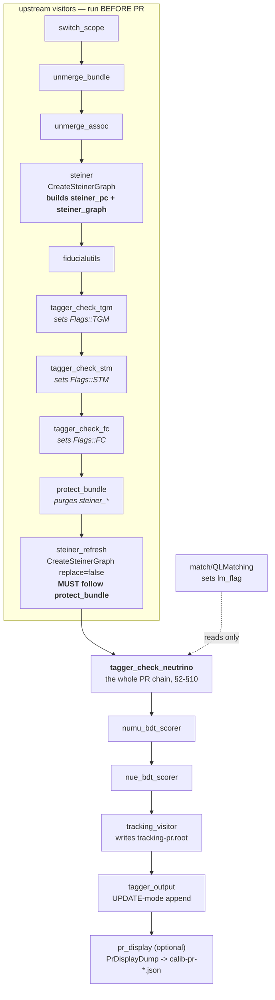

Ordering constraints, all documented in the jsonnet at `:85-99`:

* `steiner_refresh` **must** follow `protect_bundle` — `protect_bundle` purges
  `steiner_pc`/`steiner_graph`, and PR hard-requires them.
* BDT scorers after PR; `nue_bdt_scorer` after `numu_bdt_scorer`.
* `tagger_output` after `tracking_visitor` (it reopens the ROOT file in UPDATE
  mode).
* The display-relevant names are **not** in the default `pipeline_names`
  (`:101-103`). To get PR layers you append
  `['tagger_check_neutrino','numu_bdt_scorer','nue_bdt_scorer','tracking_visitor','tagger_output']`.

**Where the upstream flags are read**, so a display can show why a cluster was
or was not considered: `TaggerCheckNeutrino.cxx:342-343` (TGM/STM per-main),
`:361-364` (LM), `:425-427` (companion drop under `skip_cosmic_companions`).

**Entry point of everything below:** `TaggerCheckNeutrino::visit()`
`clus/src/TaggerCheckNeutrino.cxx:278`.

Candidate selection happens first (`:280-561`): beam-window main selection by
`cluster_t0` with a longest-length tie-break, the bundle-level cosmic veto, and
companion gathering by `matched_flash_gid`. It ends with
`m_track_fitter->preload_clusters(...)` at `:477` and construction of the
`PR::Graph` at `:495`.

---

## §2 The engine — `TrackFitting`

Not one of the eight steps. It is the thing every step calls to turn a *path
through points* into a *fitted trajectory with charge*, and it is re-run after
essentially every structural edit to the PR graph.

**Entry point:** `TrackFitting::do_multi_tracking(...)` `clus/src/TrackFitting.cxx:7712`.
Header `clus/inc/WireCellClus/TrackFitting.h`. Objective machinery in
`clus/src/MyFCN.cxx` and `TrackFitting_Util.cxx`.

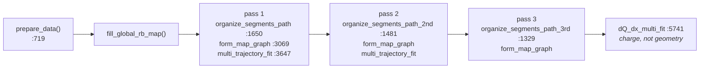

Three trajectory passes, then one dQ/dx pass. The three passes differ in how
the path is resampled before fitting (`organize_segments_path` variants); the
fit itself (`multi_trajectory_fit` → `trajectory_fit` `:4029` → `fit_point`
`:3415`) solves for each 3-D point from the three plane projections
simultaneously, with segments sharing a vertex constrained to meet there.

Other entry points worth knowing: `do_single_tracking` `:8298` (one segment),
`inherit_from` `:301` (a cheap throwaway fitter that borrows geometry — used
inside `compare_main_vertices_all_showers`), `assemble_fitted_charge_2d`
`:1136` (called once at the very end, `TaggerCheckNeutrino.cxx:865`).

### `PR::Fit` — the per-point display payload

`clus/inc/WireCellClus/PRCommon.h:119`. A `PR::Vertex` holds **one** `Fit`; a
`PR::Segment` holds a `std::vector<Fit>`. Everything a display plots per point
comes from here.

```
  Fit {
    point            WireCell::Point   fitted 3-D position         [cm-ish, WCT units]
    dQ, dx           double            calorimetry; dQ/dx is the ratio you plot
    pu, pv, pw       double            2-D projection, FRACTIONAL per-APA WIRE INDEX
    pt               double            2-D projection, RAW TICK
    paf              {int,int}         (apa, face) -- pu/pv/pw are meaningless without it
    reduced_chi2     double            three-plane weighted residual  [see caveat]
    index            int               valid() == (index >= 0)
    range            double            arc-length bookkeeping
    flag_fix         bool
  }

  seg.fits[i] = { x,y,z |  dQ, dx  |  pu, pv, pw, pt  |  apa, face  |  chi2 }
                 └─3-D──┘ └─calo──┘ └───2-D index────┘ └──which TPC─┘
```

**Two conventions that bite** (both fixed by doc **pr/7**):

* `pu/pv/pw` are **per-APA wire indices, not global channel numbers**, and they
  are fractional — the integer value is the wire *centre*. A viewer that bins
  them as channels will be off by the APA base offset; one that bins them
  naively will show a half-bin shift that is a histogram-axis artefact, not a
  fit error.
* `pt` is a **raw tick**. Divide by `nticks_per_slice` for a slice index.

**`reduced_chi2` caveat.** It is computed as `traj_reduced_chi2` inside
`dQ_dx_multi_fit` (`TrackFitting.cxx:6851`) — `sqrt((sum_U + sum_V + sum_W/4) /
(n_U + n_V + n_W))`, i.e. the collection plane is deliberately down-weighted by
4. It is copied onto **vertex** `Fit`s (`NeutrinoPatternBase.cxx:787`, `:796`)
but the equivalent per-interior-point copy at `:809` is **commented out**, so
segment-interior `reduced_chi2` generally stays at its `-1` initial value.
Check before plotting it per point. *Flagged, not fixed — pre-existing, and out
of scope for a documentation change.*

---

## §3 Steiner graph building

> **The skeleton.** Reduce a cluster's blob point cloud to a connected
> 1-D-ish tree that follows the charge, so that everything downstream works on
> a graph of ~hundreds of nodes rather than ~10⁵ points.

**Entry point:** `Steiner::CreateSteinerGraph::visit` `clus/src/CreateSteinerGraph.cxx:85`,
per-cluster body in the `process_cluster_steiner` lambda at `:172`.
Algorithm in `clus/src/SteinerGrapher.cxx` (+ `SteinerGrapher_helpers.cxx`,
`SteinerFunctions.cxx`, `Graphs.cxx`, `PAAL.h`).

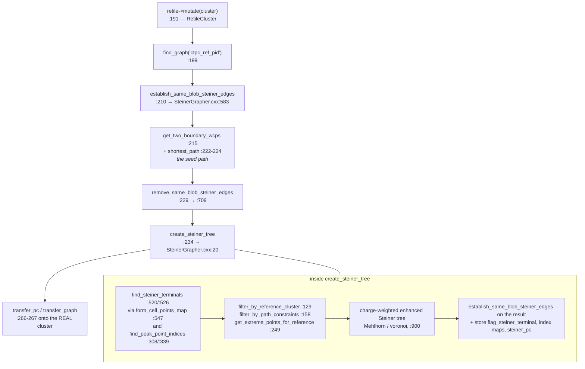

### Sub-steps

| # | what | anchor |
|---|---|---|
| 1 | early-out if `replace=false` and a graph already exists | `CreateSteinerGraph.cxx:185` |
| 2 | retile the cluster (`RetileCluster`, `improvecluster_2.cxx`) | `:191` |
| 3 | build the base graph `ctpc_ref_pid` (`make_graphs.cxx`, `connect_graph*.cxx`) | `:199` |
| 4 | add intra-blob Steiner edges | `:210` → `SteinerGrapher.cxx:583` |
| 5 | two boundary points + shortest path between them = seed | `:215`, `:222-224` |
| 6 | remove the intra-blob edges again | `:229` → `:709` |
| 7 | terminals: peak charge points per blob | `SteinerGrapher.cxx:520/:526`, `:547`, `:308/:339` |
| 8 | filter terminals against the reference cluster and the seed path | `:129`, `:158`, `:249` |
| 9 | charge-weighted enhanced Steiner tree (voronoi-based, **not** a direct PAAL call) | `:900`, voronoi at `:915`, edge selection `:920-1010` |
| 10 | store `flag_steiner_terminal`, index maps, the `steiner_pc` dataset | `:103-109` |
| 11 | transfer PC + graph onto the real cluster; prime the boundary index pair | `:266-267`, `:276` |

### Decision points

| criterion | effect | where |
|---|---|---|
| `replace` flag | `steiner` builds; `steiner_refresh` (`replace=false`) only fills gaps left by `protect_bundle` | `:185`; jsonnet `sbnd/clus.jsonnet:1237`, `:1250` |
| retiler component | which retiling is applied before graphing | `:52-53`, config key `retiler` (default `RetileCluster`) |
| terminal peak-finding | how many terminals survive → how bushy the tree is | `SteinerGrapher.cxx:308/:339` |
| `disable_dead_mix_cell` | whether dead/mixed cells can host terminals | `:520/:526` |

### State after

Two named artifacts on each cluster, both persisted and both **hard
preconditions** for everything downstream:

* point cloud **`steiner_pc`** — arrays `x_t0cor, y, z, wpid, flag_steiner_terminal`
* graph **`steiner_graph`**

`find_proto_vertex` returns `false` immediately if `steiner_pc` has <2 points
(`NeutrinoPatternBase.cxx:1952`), and `find_other_segments` returns at
`NeutrinoOtherSegments.cxx:33`. **A cluster with no Steiner graph gets no PR at
all** — that is the single most common reason a display shows an event with
charge but no segments.

### What to look at to judge this step

* the Steiner points overlaid on the blob point cloud — does the skeleton
  follow the charge or cut corners;
* `flag_steiner_terminal` drawn distinctly — terminals are what
  `find_other_segments` later hunts for, so a missing terminal is a missing
  branch;
* the seed path (boundary-to-boundary shortest path) versus the final segment —
  they should be close on a simple track;
* tree connectivity: an accidentally disconnected skeleton produces exactly one
  segment and a silently truncated event.

### Display payload

| quantity | source | carried today by |
|---|---|---|
| Steiner point positions | `steiner_pc` `x_t0cor,y,z` | **pctree** `steiner_pc`; `calib-pr-*.json` `steiner[]` |
| terminal flag | `steiner_pc` `flag_steiner_terminal` | same two |
| Steiner **edges** | `steiner_graph` | **nothing** — no artifact serializes the edge list |
| blob point cloud underneath | `3d` PC | pctree `3d`; Bee `clustering-global` |

---

## §4 Proto-vertex and track-segment finding

> **The skeleton becomes a topology.** Turn the Steiner tree into a graph of
> `PR::Vertex` nodes joined by `PR::Segment` edges, each segment a fitted 3-D
> trajectory. This is the step with the most moving parts, and the owner's
> instinct that it needs subdividing is right: **four** sub-steps.

**Entry point:** `PatternAlgorithms::find_proto_vertex(graph, cluster,
track_fitter, dv, flag_break_track, nrounds_find_other_tracks, flag_back_search)`
`clus/src/NeutrinoPatternBase.cxx:1945`.

Called three ways from `TaggerCheckNeutrino.cxx`:

| caller | args | line |
|---|---|---|
| main cluster | `break=true, nrounds=2, back_search=true` | `:565` |
| companion, >6 cm | `break=true, nrounds=2, back_search=false` | `:602` |
| companion, short | `break=false, nrounds=1, back_search=false`; on failure → `init_point_segment` `:2109` | `:615`, `:617` |

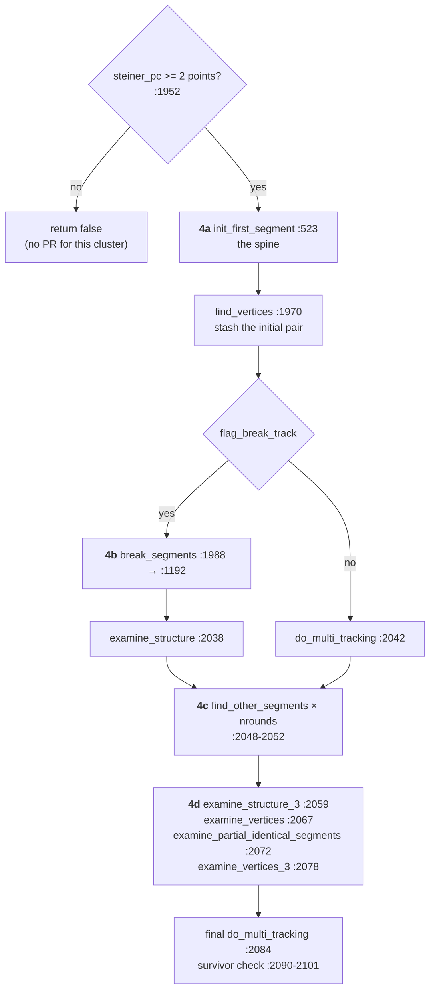

### 4a — `init_first_segment` — the spine

`NeutrinoPatternBase.cxx:523`. Pick the cluster's two extreme points, walk the
Steiner path between them, fit it. That single segment is the seed everything
else grows from, so **a bad endpoint here propagates into every later stage**.

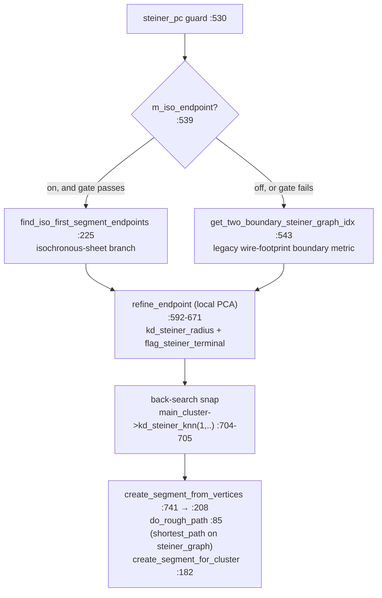

Decision points:

| criterion | threshold / knob | anchor |
|---|---|---|
| use the isochronous endpoint branch at all | `m_iso_endpoint` (**default off**) | `NeutrinoPatternBase.h:148` |
| iso gate: minimum cluster length | `m_iso_endpoint_min_length` = 40 cm | `.h:149` |
| iso gate: max drift extent | `m_iso_endpoint_max_xext` = 25 cm | `.h:150` |
| iso gate: extent as fraction of L | `m_iso_endpoint_xext_frac` = 0.35 | `.h:151` |
| iso gate: quantile trim on the extent measurement | `m_iso_endpoint_xext_quantile` = 0.02 | `.h:152` |
| iso: axis-tube radius for the extremum pick | `m_iso_endpoint_tube_radius` = 4 cm | `.h:171` |
| iso: sheet-aspect rejection | `m_iso_endpoint_min_aspect` = 0.12 | `.h:172` |
| endpoint trim retry | `m_endpoint_trim_retry` (default off) | `.h:190` |

The `m_iso_endpoint` family is governed by **doc pr/24**; the endpoint story
there (an inward-biased pick leaving a stub that `find_other_segments` then
claims as its own segment, putting a vertex in the middle of a straight track)
is the canonical example of why this sub-step deserves display attention.

### 4b — `break_segments` — split at kinks

`NeutrinoPatternBase.cxx:1192`. Walk each segment looking for a direction
change sharp enough to be a real vertex, and split there.

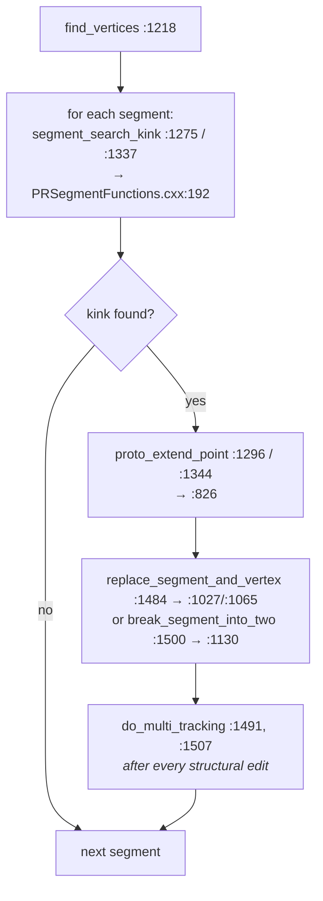

Related structural edits in the same file: `proto_break_tracks` `:945`,
`merge_nearby_vertices` `:1547`, `merge_two_segments_into_one` `:1698`,
`merge_vertex_into_another` `:1737`.

Decision points:

| criterion | threshold / knob | anchor |
|---|---|---|
| kink test dQ/dx reference | `m_mip_dqdx_median` = 43000 e⁻/cm | `.h:114` |
| cathode-region kink suppression | `m_cathode_x`, `m_cathode_kink_xcut` (both default 0 = inert) | `.h:180-181`; doc **pr/20 Part II** |
| break distance cut | `dis_cut` argument of `break_segments` | `:1192` |

### 4c — `find_other_segments` — grow the branches

`clus/src/NeutrinoOtherSegments.cxx:31`. Everything the spine did not cover is
re-examined: Steiner terminals not already claimed become seeds for new
segments. Run `nrounds` times (2 for the main cluster).

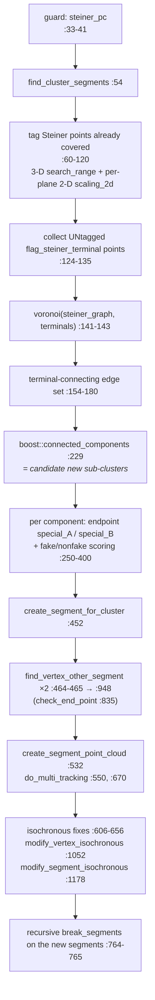

This is where a stub left behind by 4a becomes a *real segment with a vertex*.
If a display shows a straight track carrying an interior vertex with a
near-zero turn angle, this is the sub-step that created it, and 4a is the
sub-step that caused it.

Decision points:

| criterion | threshold | anchor |
|---|---|---|
| 3-D coverage radius for "already claimed" | `search_range` argument | `:31`, used `:60-120` |
| per-plane 2-D coverage | `scaling_2d` argument | `:31` |
| fake/nonfake component scoring | inline | `:250-400` |
| isochronous vertex/segment repair | `modify_*_isochronous` distance / angle / extend cuts | `:1052`, `:1178` |

### 4d — the `examine_*` families — clean up the topology

`clus/src/NeutrinoStructureExaminer.cxx`. A long tail of structural repairs.
Nothing here creates physics; everything here changes *which* segments and
vertices exist, so a display comparing before/after is the only sane way to
follow it.

| call | order in `find_proto_vertex` | anchor |
|---|---|---|
| `examine_structure` (→ `_2` `:169`, then `_1` `:25`) | after `break_segments` | `:13`; called `NeutrinoPatternBase.cxx:2038` |
| `examine_structure_3` (main cluster only) | after `find_other_segments` | `:359`; called `:2059` |
| `examine_vertices` (→ `examine_segment` `:963`, `_1` `:1388`, `_2` `:1494`, `_4` `:1705`) | next | `:2079`; called `:2067` |
| `examine_partial_identical_segments` | next | `:2109`; called `:2072` |
| `examine_vertices_3` (main cluster only, uses the initial pair) | last | `:2432`; called `:2078` |

Also present and used later, from §6: `examine_structure_4` `:490` (vertex
activity variant), `crawl_segment` `:702`, `get_local_extension` `:2373`,
`examine_structure_final` `:3510` (→ `_1` `:2649`, `_1p` `:2781`, `_2` `:3029`,
`_3` `:3216`), `examine_vertices_1p` `:1162`, `examine_vertices_4p` `:1618`.

### State after §4

A populated `PR::Graph`: vertices on nodes, segments on **edges**, every
segment carrying a fitted `std::vector<Fit>`. No PID yet, no direction, no
neutrino vertex. `find_proto_vertex` returns `false` if no segment survived
(`:2090-2101`), and the caller then falls back to `init_point_segment`.

### What to look at to judge §4

* **segment count and the interior junction turn angle.** A junction with a
  turn angle below ~10-15° that is absent when a knob is off is the signature
  of a spurious break. This is the metric doc pr/24 round 2 lacked and round 3
  added.
* endpoint position versus the visible charge tip — the axial shortfall, not
  the perpendicular one, is where the damage has historically been.
* which Steiner terminals stayed untagged after 4c (they are what generated
  each extra segment).
* per-segment `Σq` coverage: what fraction of the cluster's charge is inside
  some segment's association radius.
* the same graph before and after each `examine_*` call — currently only
  reachable through `WCT_DET_DEBUG` log text.

### Display payload

| quantity | accessor | carried today by |
|---|---|---|
| segment polyline | `Segment::fits()` | `calib-pr-*.json` `segments[].points[]`; Bee `track_fit-global` (**flat points, no grouping**) |
| vertex position (fitted) | `Vertex::fit()` | `calib-pr-*.json` `vertices[]`; Bee `vertices-global` |
| vertex position (pre-fit) | `Vertex::wcpt()` | **nothing** |
| `fit_distance()` = \|fit − wcpt\| | `Vertex::fit_distance()` `PRVertex.h:84` | `calib-pr-*.json` `vertices[].fit_distance` (**not** a fit displacement — pr/28) |
| whether the vertex fit ran (`flag_fix`) | `Vertex::flag_fix()` `PRVertex.h:74` | **nothing** — trace log only |
| graph degree at a vertex | `boost::out_degree` | `calib-pr-*.json` `vertices[].degree` |
| segment ↔ cluster provenance | `cluster_id*1000 + graph_index` | Bee encoded `real_cluster_id`; `calib-pr-*.json` `id` |
| associated points per segment | `dpcloud("associate_points")` | Bee `shower_track-global`; `calib-pr-*.json` `track_shower` |
| Steiner edges | `steiner_graph` | **nothing** |

---

## §5 Topology, PID and direction

> **Segments acquire identity.** Is this a track or a shower; if a track, what
> particle; and which way does it point.

**Entry points**, run in this order for every cluster
(`TaggerCheckNeutrino.cxx:569-579`, and again per companion at `:603-606` /
`:619-622`):

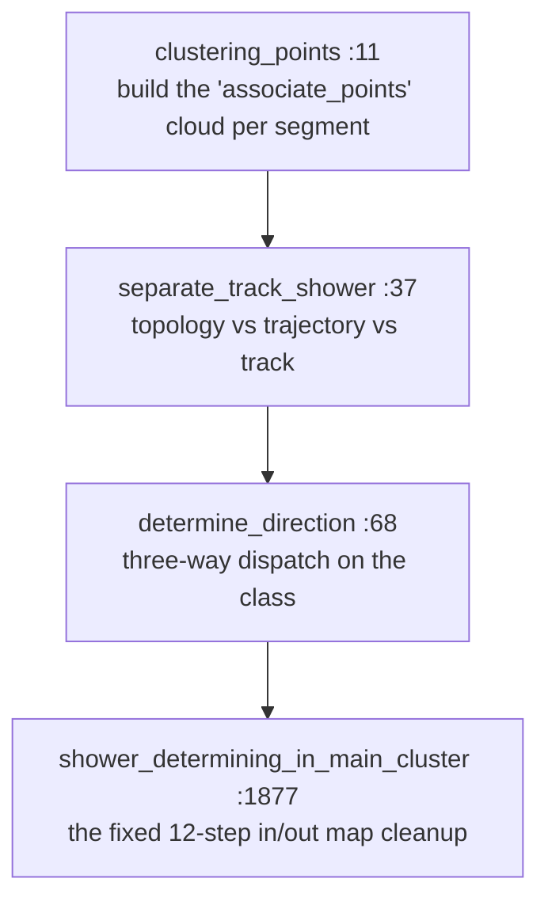

All four in `clus/src/NeutrinoTrackShowerSep.cxx`; the per-segment primitives
they call live in `clus/src/PRSegmentFunctions.cxx`.

### 5a — `clustering_points` `:11`

Collects the cluster's segments (`:19-24`) and calls `clustering_points_segments`
(`:30`) to build, per segment, the **`associate_points`** dynamic point cloud —
the blob points that belong to that segment. This is what the Bee
`shower_track` layer and the `calib-pr-*.json` `track_shower` block are drawn
from, and what §7 and §9 integrate charge over.

### 5b — `separate_track_shower` `:37`

Two predicates, in order:

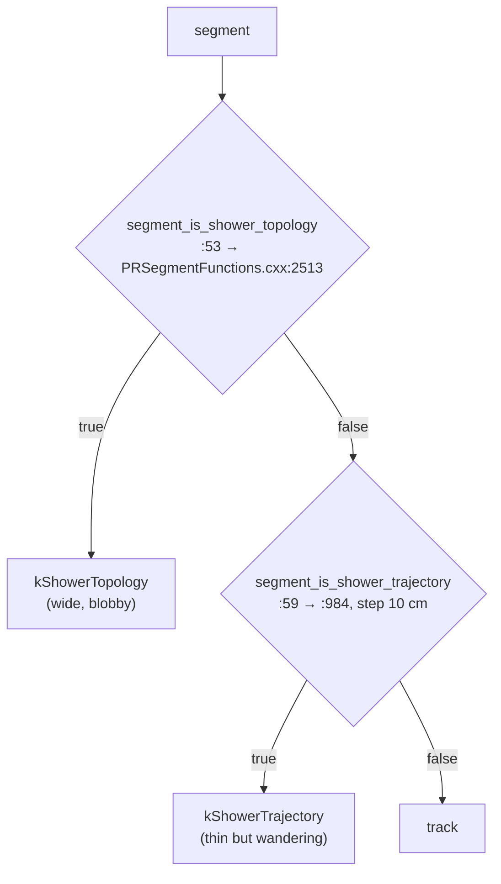

| criterion | threshold / knob | anchor |
|---|---|---|
| topology MIP reference | `m_mip_dqdx_median` = 43000 e⁻/cm | `.h:114` |
| topology length demotion | `m_shower_topo_demote_len` (default 0 = off; SBND 50 cm) | `.h:132`; doc **pr/25** |
| trajectory step size | 10 cm, call site | `NeutrinoTrackShowerSep.cxx:59` |
| trajectory MIP reference | `m_mip_dqdx` = 50000 e⁻/cm | `.h:113` |
| topology debug channel | `WCT_SHOWER_TOPO_DEBUG` | `PRSegmentFunctions.cxx:2543` |

### 5c — `determine_direction` `:68`

Resolves each segment's start/end vertex and degrees (`:83-111`), then
dispatches on the class:

| class | call | anchor | what it sets |
|---|---|---|---|
| `kShowerTrajectory` | `segment_determine_shower_direction_trajectory` | `:119` → `PRSegmentFunctions.cxx:1829` (delegates to `segment_determine_dir_track` `:1847`) | `dirsign`, PDG |
| `kShowerTopology` | `segment_determine_shower_direction` | `:123` → `:2208`; then PDG forced to 11 via `segment_cal_4mom` `:126` and `particle_score(100)` `:134` | `dirsign`, PDG=11 |
| track | `segment_determine_dir_track` | `:139` → `:1637`, which runs `segment_do_track_pid` `:1418` | `dirsign`, PDG, `dir_weak` |

Track PID (`segment_do_track_pid` `:1418`) compares the measured dQ/dx-vs-
residual-range profile against stopping-particle templates in both directions
and returns `(flag, pdg, ..., score)`. **The direction and the PID are decided
together** — that is why a wrong direction so often shows up as a wrong
particle.

| criterion | threshold / knob | anchor |
|---|---|---|
| proton direction vote | `m_proton_dir_vote` (default off), `m_proton_dir_score_max` = 0.25, `m_proton_dir_asym_min` = 1.3 | `.h:185-187`; doc **pr/8** |
| which `dir_weak` predicate the scorers read | `m_dir_weak_use_score` (**default false** ⇒ the stored `Segment::dir_weak()` flag, *not* `segment_is_dir_weak()`) | `.h:94`; `NeutrinoPatternBase.cxx:55-58`; doc **pr/6** |
| MIP dQ/dx scales | `m_mip_dqdx`, `m_mip_dqdx_median` | `.h:113-114`; doc **pr/8** |

**A display trap worth stating**: `seg_dir_weak()` is not
`segment_is_dir_weak()`. With `m_dir_weak_use_score` false — the default —
every scorer downstream reads the *stored flag*. A dumper that calls the free
function unconditionally will show a different weakness than the algorithm
used.

### 5d — `shower_determining_in_main_cluster` `:1877`

A fixed 12-call cleanup of the in/out topology maps. Order matters and is
hard-coded:

| # | call | impl |
|---|---|---|
| 1 | `examine_good_tracks` `:1884` | `:330` |
| 2 | `fix_maps_multiple_tracks_in` `:1888` | `:443` |
| 3 | `fix_maps_shower_in_track_out` `:1892` | `:508` |
| 4 | `improve_maps_one_in` `:1896` | `:577` |
| 5 | `improve_maps_shower_in_track_out` `:1900` | `:684` |
| 6 | `improve_maps_no_dir_tracks` `:1904` | `:828` |
| 7 | `improve_maps_shower_in_track_out(..., false)` `:1908` | `:684` |
| 8 | `improve_maps_multiple_tracks_in` `:1912` | `:1303` |
| 9 | `fix_maps_shower_in_track_out` `:1916` | `:508` |
| 10 | `judge_no_dir_tracks_close_to_showers` `:1920` | `:1392` |
| 11 | `examine_maps` `:1924` | `:1470` |
| 12 | `examine_all_showers` `:1928` | `:1549` |

Helpers used throughout: `calculate_num_daughter_showers` `:164`,
`calculate_num_daughter_tracks` `:221`, `find_cont_muon_segment_nue` `:276`.

### State after §5

Every segment has: a class (`kShowerTopology` / `kShowerTrajectory` / track),
a `dirsign` (+1 / 0 / −1), a `dir_weak` flag, a `ParticleInfo` (PDG, mass,
4-momentum, kinetic energy) and a `particle_score`. The in/out maps at each
vertex are consistent. **This is the input the vertex scorer consumes** — §6's
entire ranking is a function of these labels.

### What to look at to judge §5

* per segment: class, `dirsign` **drawn as an arrow**, `dir_weak` as a visual
  distinction (weak directions are what the vertex scorer discounts), PDG,
  `particle_score`;
* the dQ/dx-vs-residual-range curve per segment against the stopping templates
  — this is what `segment_do_track_pid` actually decided on, and the STM
  viewer already has a panel shaped exactly like it;
* the in/out map at each vertex — how many tracks in, how many showers out;
* which of the 12 cleanup calls changed a label (currently log-only).

### Display payload

| quantity | accessor | carried today by |
|---|---|---|
| track/shower class | `Segment::flags_any(kShower*)` | `calib-pr-*.json` `segments[].flag_shower`; Bee `shower_track` q=0/15000 |
| PDG | `Segment::particle_info().pdg()` | `calib-pr-*.json` `particle_id`; Bee `mc` tree label |
| `dirsign` | `Segment::dirsign()` | `calib-pr-*.json` `dirsign` |
| `dir_weak` | `Segment::dir_weak()` | **nothing** |
| `particle_score` | `Segment::particle_score()` | **nothing** |
| kinetic energy | `ParticleInfo::kinetic_energy()` | Bee `mc` node label only (`"<pdg> KE=<MeV>"`) |
| dQ/dx profile | `Segment::fits()[i].dQ/.dx` | `calib-pr-*.json` `points[]`; `tracking-pr.root` `T_rec_charge` |

---

## §6 Neutrino vertex identification

> **Which vertex is the interaction point.** Rank candidate vertices within
> each cluster, then across clusters, then refine the winner's position.

Five sub-steps, in `TaggerCheckNeutrino::visit()` order:

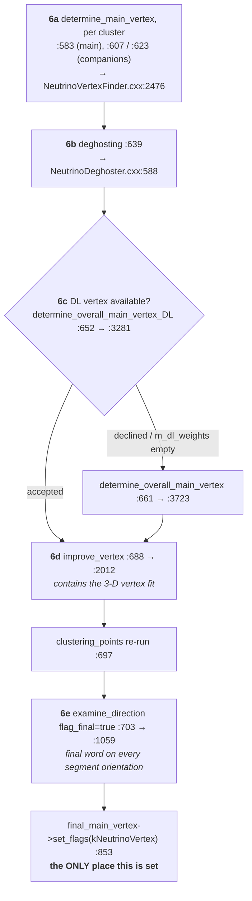

### 6a — `determine_main_vertex` (per cluster) — `NeutrinoVertexFinder.cxx:2476`

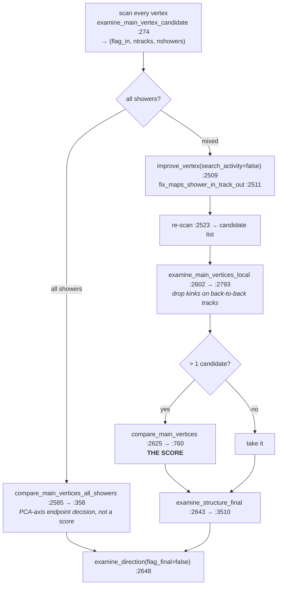

**`examine_main_vertex_candidate` `:274` — the gate.** Returns
`(flag_in, ntracks, nshowers)`.

| rule | effect | anchor |
|---|---|---|
| shower predicate: `kShowerTrajectory \|\| kShowerTopology \|\| abs(pdg)==11` | classification used everywhere below | `:297-299` |
| any strongly-directed segment pointing **into** the vertex ⇒ `flag_in=true` | **disqualified** as a neutrino-vertex candidate | `:315-324` |
| the loop **breaks early** on that | `ntracks`/`nshowers` are partial counts — noted in-code | `:290-291` |
| Michel exception: exactly 2 segments (1 track + 1 shower), ≤3 daughter showers, daughter length <30 cm ⇒ re-evaluate on the track only | rescues Michel topologies | `:334-353` |

**`examine_main_vertices_local` `:2793` — the filter.** Drops candidates that
are merely kinks on back-to-back tracks.

| rule | threshold | anchor |
|---|---|---|
| degree-1 vertices always kept | — | `:2812-2814` |
| opening angles computed at two scales | `segment_cal_dir_3vector(sg, pt, 15 cm)` and `(…, 30 cm)`, both segments >10 cm | `:2833-2845` |
| back-to-back **muon** | angle >165° at either scale, one is pdg 13, one longer than 30 cm | `:2859-2863` |
| back-to-back **proton** | angle >170°, proton/unknown pair, both >20 cm | `:2865-2870` |
| rescue | a remaining shower with daughter length >35 cm, or a track with `!dir_weak && len>6 cm` | `:2876-2905` |
| otherwise | both segments **relabelled muon**, `change_daughter_type` `:2697` propagates, `find_cont_muon_segment` `:961` walks to the chain end and that terminal vertex becomes the candidate | `:2907-2960` |

**`compare_main_vertices` `:760` — the score.** Accumulator
`std::map<VertexPtr,double> map_vertex_num` at `:763`. These are the numbers a
display must show.

| # | term | value | anchor |
|---|---|---|---|
| 0 | find `max_length_muon` = longest non-shower, non-proton segment | — | `:770-791` |
| 1 | proton in/out topology, if `n_in > n_out` | `− (n_in − n_out)/4` | `:861` |
| 1′ | else | `− (n_in − n_out)/4 + (n_in + n_out)/8` | `:863` |
| 2 | upstream-z prior | `− (z − z_min) / m_vertex_z_prior_scale` | `:881` |
| 3 | per shower segment | `+ 1/8` | `:897` |
| 4 | shower with daughter length >45 cm | `+ 1/8` | `:901` |
| 5 | per track segment | `+ 1/4` | `:904` |
| 6 | clear proton (`pdg==2212 && dirsign!=0 && !dir_weak`) | `+ 1/4` | `:912` |
| 7 | else track with direction (`dirsign!=0 && !shower`) | `+ 1/8` | `:914` |
| 8 | segment is `max_length_muon` and `max_length > 35 cm` | `+ 1/8` | `:918` |
| 9 | `inside_fiducial_volume(vtx)` | `+ 0.5` | `:927-928` |
| 10 | topology conflicts | `− calc_conflict_maps(vtx) / 4` | `:935-936` |
| — | argmax, **no tie-break** — first in vector order wins | | `:944` |

Position used is `fit().valid() ? fit().point : wcpt().point` (`:872-874`).
`m_vertex_z_prior_scale` defaults to **200 cm** (`.h:239`, jsonnet key
`vertex_z_prior_scale` in cm, doc **pr/2 §2e(iv)**).

**`calc_conflict_maps` `:543` — the penalty.** BFS from the assumed vertex
builds `map_seg_dir[sg] = {start, end}` (`:565-598`), then:

*Per-segment direction conflicts* (`:601-627`) — a segment with `dirsign!=0`
(showers only if >5 cm) pointing back toward its BFS parent: `+1.0` if not
weak, `+0.5` if weak.

*Per-vertex topology conflicts* (`:633-742`) — for vertices with ≥2 segments,
classify in/out, take direction 3-vectors over 10 cm, find the max in-out
angle:

| max in-out angle | penalty | anchor |
|---|---|---|
| < 35° | `+5.0` | `:721` |
| < 70° | `+3.0` | `:723` |
| < 85° | `+1.0` | `:725` |
| < 110° | `+0.25` | `:727` |
| `angle_beam < 60°` **and** `max_angle < 110°` | `+1.0` | `:731-732` |
| `angle_beam < 45°` **and** `max_angle < 70°` | `+3.0` | `:733` |

Beam direction is hard-coded `(0,0,1)` at `:630`. Skipped when the partner is a
shower trajectory or both are showers (`:714-716`). Plus: multiple incoming
(`:736-742`) `+ (n_in − 1)`, or `+ (n_in − 1)/2` if all incoming are showers;
shower-in with track-out (`:745-747`) `+ min(n_in_shower, n_out_tracks)`.

**`compare_main_vertices_all_showers` `:358`** is **not** a score. It is a
PCA-axis endpoint decision: collect segment interior + vertex points
(`:365-383`), `calc_PCA_main_axis` (`:390-392`), project candidates and keep
argmin/argmax (`:396-431`), build a throwaway `PR::Graph` on the min→max
Steiner path with an `inherit_from` fitter (`:467-500`), run
`segment_determine_shower_direction`, and take the endpoint the direction
points away from (`:505-517`). Overrides: no `steiner_pc` or a path ≤2 points ⇒
lower-z endpoint (`:442-465`); path >80 cm with |Δz| >40 cm ⇒ always lower-z
(`:520-527`).

### 6b — `deghosting` — `NeutrinoDeghoster.cxx:588`

`deghost_clusters` (`:74`) → `deghost_segments` (`:353`) → prune
`map_cluster_main_vertices` of vertices with no remaining edges (`:596-620`).
Deterministic ordering helpers `order_clusters` `:27`, `order_segments` `:332`.

### 6c — the global choice

**DL path first.** `determine_overall_main_vertex_DL` `:3281`. Entire body is
inside `#ifdef HAVE_PYTHON_INC` (`:3304`); returns `false` otherwise, and the
traditional path runs only when DL declines (`TaggerCheckNeutrino.cxx:660`,
`if (!flag_dl_changed)`). `m_dl_weights` empty ⇒ DL disabled entirely.

Input cloud (`:3314-3343`): all graph vertices plus all **segment interior**
fit points, `q = dQ * m_dQdx_scale + m_dQdx_offset`. Inference via
`WCPPyUtil::SCN_Vertex` (`:3352`).

The **rerank path** (default) is the one scorer in the whole chain that already
computes a full per-term decomposition — and already logs it (`:3583-3595`):

Weight constants are declared together at `:3535-3543`.

| term | formula | weight | anchor |
|---|---|---|---|
| `s_dl` | `dl_score × m_dl_vtx_score_scale`, `dl_score = sigmoid(vtx) − sigmoid(bg)` ∈ [−1,+1] | scale 1000 | `:3555`, definition comment `:3432` |
| `s_snap` | `− min(W_SNAP_MAX, snap_dis / 5 cm)` | `W_SNAP_L` = 5 cm, `:3541` | `:3560` |
| `s_fwd_z` | `− 0.25 × clamp(…)` | `W_FWD_Z` = 0.25, `:3543` | `:3565` |
| `s_clen` | `+ 2.0 × min(1, L_host / 60 cm)` | `W_CLEN` = 2.0, `W_CLEN_L` = 60 cm, `:3536-3537` | `:3574` |
| `s_isol` | `− 2.0` if `L_host < 6 cm` and host ≠ main cluster | `W_ISOL` = 2.0, `W_ISOL_L` = 6 cm, `:3538-3539` | `:3577-3579` |
| `s_main` | `+ 2.0` if host cluster == main cluster | `W_MAIN` = 2.0, `:3535` | `:3582` |
| `s_fv` | `+ 0.5` if inside fiducial volume | `W_FV` = 0.5, `:3540` | `:3585-3589` |
| **TOTAL** | `s_dl + s_snap + s_fwd_z + s_clen + s_isol + s_main + s_fv`, argmax; accept iff `>= m_dl_vtx_min_accept_score` (default **4.0**) | | `:3592`, `:3620` |

The full per-term line is already emitted at `:3603`.

DL knobs, all in `clus/inc/WireCellClus/TaggerCheckNeutrino.h`: `m_dl_weights`
(`:138`, empty = off), `m_dl_vtx_cut` (`:139`, 25 mm), `m_dl_vtx_rerank`
(`:142`, true), `m_dl_vtx_top_k` (`:143`, 5), `m_dl_vtx_min_accept_score`
(`:144`, 4.0), `m_dl_vtx_score_scale` (`:145`, 1000). Doc **pr/4** — the DL/SCN
vertex is the SBND default.

**Traditional fallback.** `determine_overall_main_vertex` `:3723`:

| # | sub-step | anchor |
|---|---|---|
| 1 | find max-length cluster, deterministic by `cluster_id` | `:3733-3761` |
| 2 | `examine_main_vertices` (may `swap_main_cluster`) | `:3764` → `NeutrinoPatternBase.cxx:2419`, `:2396` |
| 3 | `check_switch_main_cluster` (internally `compare_main_vertices_global` `:2985`) | `:3768` → `:3148` |
| 4 | `check_switch_main_cluster_2` | `:3778` → `:3242` |
| 5 | short high-dQ/dx **proton tagging** on main-vertex legs: `num_daughter_showers==1 && len<1.5 cm && median_dQdx/m_mip_dqdx_median > 1.6` ⇒ pdg 2212 | `:3805-3826` |
| 6 | prune long-muon sets to the main cluster | `:3830-3856` |

**It does not set `kNeutrinoVertex`** — only `TaggerCheckNeutrino.cxx:853` does.

`compare_main_vertices_global` `:2985` — the cross-cluster score, same shape as
the per-cluster one plus cluster-level terms:

| term | value | anchor |
|---|---|---|
| upstream-z prior | `− (z − z_min)/m_vertex_z_prior_scale` | `:3012` |
| per shower / per track segment | `+1/8` / `+1/4` | `:3029`, `:3031` |
| clear proton / else directed track | `+1/4` / `+1/8` | `:3039`, `:3040-3041` |
| vertex is in `main_cluster` | `+0.25` | `:3047` |
| inside FV **or** in main cluster | `+0.5` | `:3063-3065` |
| another candidate's `vertex_get_dir(…, 5 cm)` points here within 15° / 30° | `+0.25` / `+0.125` | `:3100-3103` |
| isolated (`delta==0`), not main cluster, cluster track length <6 cm | `− 0.25 × num_tracks` | `:3109-3126` |

Partial scores are already emitted at TRACE as `score_A` (`:3050`), `score_B`
(`:3067`), `score_E` (`:3128`).

### 6d — `improve_vertex` — `NeutrinoVertexFinder.cxx:2012`

Called twice: once inside `determine_main_vertex` with
`flag_search_vertex_activity=false` (`:2509`), and once finally with
`(true, true)` from `TaggerCheckNeutrino.cxx:688`.

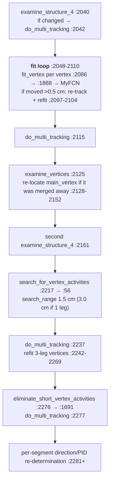

Debug hooks already present: `detv_dump("iv:entry" | "iv:examine_structure_4a/4b"
| "iv:search_vtx_act" | "iv:post_search_dmt" | "iv:post_fitloop_dmt" |
"iv:examine_vertices_a" | "iv:final_dmt", graph)` at `:2037, 2041, 2160/2164,
2218, 2237, 2113, 2278` — gated on `WCT_DET_DEBUG`.

`search_for_vertex_activities` `:56` is where short stubs at a vertex come
from: it requires `steiner_pc` (`:62`), reads `flag_steiner_terminal` (`:70`),
queries `kd_steiner_radius(search_range, vtx, "steiner_pc")` (`:98`), and
demands angular separation from the existing legs plus 2-D distance checks in
U/V/W. Those stubs are exactly what `m_fit_vertex_min_seg_length` exists to
keep out of the position fit — see §12.

### 6e — `examine_direction` final pass — `:1059`

BFS outward from the main vertex, re-deriving every segment's orientation.
Called twice: `flag_final=false` inside `determine_main_vertex` (`:2648`) and
`flag_final=true` at the very end of `visit()` (`TaggerCheckNeutrino.cxx:703`).
**The final call is authoritative** — it forces re-derivation regardless of
existing strength (`:1208`).

Writes: `dirsign()` (`:1222/:1224`), `dir_weak(true)` (`:1354`), PDG
reassignments (`:1232-1348`, `:1529-1548`), and populates
`segments_in_long_muon` / `vertices_in_long_muon` (`:1460`, `:1463`) using
`calculate_num_daughter_showers` and `find_cont_muon_segment` (`:961`).

### State after §6

One `PR::Vertex` carries `VertexFlags::kNeutrinoVertex` — set at exactly one
place, `TaggerCheckNeutrino.cxx:853`. Handed to the fitter at `:855`
(`set_main_vertex`). Every segment's final orientation is fixed. The long-muon
sets are populated. **Everything from §7 on is computed relative to this
vertex.**

### What to look at to judge §6

The scoring is the whole step, so:

* **every candidate vertex, with its full score decomposition** — the ten terms
  of `compare_main_vertices` and the conflict penalty, side by side, so that a
  wrong pick is attributable to a term rather than to "the algorithm";
* **candidates that were dropped before scoring** — `flag_in=true` from
  `examine_main_vertex_candidate`, and the back-to-back rejections from
  `examine_main_vertices_local` — with the reason;
* **`Vertex::fit_distance()`** — how far the 3-D fit moved each vertex, and
  whether the charge veto reverted it;
* the DL score decomposition next to the traditional score, on the same
  candidates, when both ran;
* the truth vertex, when available, as a reference marker.

**None of this is in any artifact today.** See §14.

### Display payload

| quantity | accessor | carried today by |
|---|---|---|
| the chosen neutrino vertex | `flags_any(kNeutrinoVertex)` | `calib-pr-*.json` `main_vertex`; Bee `vertices-global` q=15000 |
| all other vertices | graph nodes | `calib-pr-*.json` `vertices[]`; Bee q=0 |
| vertex degree | `out_degree` | `calib-pr-*.json` `degree` |
| candidate list, per-cluster and global | function-local | **nothing** |
| `compare_main_vertices` term breakdown | `map_vertex_num` `:763` | **nothing** (TRACE text only) |
| `compare_main_vertices_global` breakdown | `:2998` | **nothing** (partial TRACE `score_A/B/E`) |
| `calc_conflict_maps` penalty | return value `:543` | **nothing** |
| `(flag_in, ntracks, nshowers)` per candidate | `:274` | **nothing** |
| DL per-term score | `:3543-3591` | **nothing** (full DEBUG text at `:3583-3595`) |
| vertex fit displacement | `Vertex::fit_distance()` | **nothing** |
| `MyFCN` gate values (`ntracks`, `n_large_angles`, `enforce_two_track_fit`) | `MyFCN.cxx:180`, `:205-218`, `:220` | **nothing** |

---

## §7 EM shower clustering

> **Assemble showers.** Group segments into `PR::Shower` objects rooted at or
> near the neutrino vertex, merge over-split ones, and identify π⁰ pairs.

**Entry point:** `shower_clustering_with_nv(...)`
`clus/src/NeutrinoShowerClustering.cxx:3160`, called from
`TaggerCheckNeutrino.cxx:714`.

Twelve ordered sub-calls:

| # | call | anchor (call → impl) |
|---|---|---|
| 1 | `shower_clustering_with_nv_in_main_cluster` — BFS from the main vertex, `make_shared<Shower>`, `complete_structure_with_start_segment`, `update_shower_maps` | `:3208` → `:76` |
| 2 | `shower_clustering_connecting_to_main_vertex` | `:3217` → `:224` |
| 3 | `shower_clustering_with_nv_from_main_cluster` | `:3224` → `:464` |
| 4 | `shower_clustering_with_nv_from_vertices` | `:3231` → `:753` |
| 5 | `collect_charge_maps` | `:3242` → `NeutrinoEnergyReco.cxx:226` |
| 6 | `calculate_shower_kinematics` (pass 1) | `:3248` → `NeutrinoEnergyReco.cxx:281` |
| 7 | `examine_merge_showers` | `:3253` → `:1214` |
| 8 | `shower_clustering_in_other_clusters` | `:3261` → `:1295` |
| 9 | `calculate_shower_kinematics` (pass 2) | `:3272` → `:281` |
| 10 | `examine_showers` (also `examine_shower_1` `:1632`) | `:3277` → `:2082` |
| 11 | `id_pi0_with_vertex` | `:3285` → `:2439` |
| 12 | `id_pi0_without_vertex` | `:3294` → `:2783` |

`update_shower_maps` `:30` maintains the four maps
(`map_vertex_in_shower`, `map_segment_in_shower`, `map_vertex_to_shower`,
`used_shower_clusters`) that everything else keys on.

**State after:** an `IndexedShowerSet` of `PR::Shower`, each with a start
segment, a member set, and kinematics; π⁰ candidate pairings with masses.

**Display payload:** shower membership is visible only as per-segment colouring
(`real_cluster_id = cluster_id*1000 + segment_index`) in Bee `shower_track`.
Shower *objects*, their start segments and the π⁰ pairings are **not** carried
by any artifact.

---

## §8 Particle flow

> **The hierarchy.** Turn the shower/segment structure into a parent-child
> particle tree rooted at the neutrino vertex.

The tree is built at output time rather than in a dedicated PR stage:
`fill_bee_pf_tree` `clus/src/MultiAlgBlobClustering.cxx:697`, enabled by
`bee_pf` with visitor `TaggerCheckNeutrino:pr`. It BFSes over track-only
segments from `tf->get_main_vertex()` (`:1085`) and attaches showers from
`tf->get_showers()` (`:1092`) in three cases. Node format is a jsTree entry:
id, label `"<pdg> KE=<MeV>"`, `data.start` / `data.end`. PDG→display-name at
`:1021`; per-particle id convention at `:873-878`. Thresholds `em_ke_min` = 5
MeV, `np_ke_min` = 10 MeV. In-code comment at `:1043-1051` names the prototype
counterpart, `NeutrinoID::fill_particle_tree`.

`WCT_BEE_PF_PRINT` (`:1070`) prints the tree to the log.

**State after:** the `mc` member of `mabc-pr.zip`.

**Display payload:** `mabc-pr.zip` `mc-<run>-<subrun>-<event>.json`, rendered by
the Bee particle-flow panel. Nothing else carries it.

---

## §9 Energy reconstruction

> **Charge to energy.** Convert associated charge into kinetic energy per
> segment and per shower, then fill the summary tree.

| function | anchor |
|---|---|
| `cal_corr_factor` (position-dependent correction) | `clus/src/NeutrinoEnergyReco.cxx:14` |
| `cal_kine_charge(shower, …)` | `:194`, `:236` |
| `cal_kine_charge(segment, …)` | `:247` |
| `collect_charge_maps` | `:226` |
| `calculate_shower_kinematics` | `:281` |
| `init_tagger_info` | `clus/src/NeutrinoKinematics.cxx:18` |
| `fill_kine_tree` — SCE-corrected nu vertex `:61-74`, `push_shower_kine` `:103`, `push_segment_kine` `:132` (→ `cal_kine_charge` `:142`) | `:43`, called `TaggerCheckNeutrino.cxx:840` |

Range-based and dQ/dx-based energies come from the segment primitives
`cal_kine_range` and `segment_cal_kine_dQdx` (`PRSegmentFunctions.h:151`,
`:153`), combined per particle in `segment_cal_4mom` (`:155`).

Calibration knobs live in `PR::KineChargeOptions`
(`clus/inc/WireCellClus/NeutrinoPatternBase.h:37`), wired at
`TaggerCheckNeutrino.cxx:529-536`. Doc **pr/10**.

**State after:** `KineInfo` (`clus/inc/WireCellClus/NeutrinoTaggerInfo.h`),
including `kine_reco_Enu` and per-particle energies.

**Display payload:** `tracking-pr.root` `T_kine`; the Bee `mc` node labels carry
per-particle KE. Per-point `dQ`/`dx` is in `calib-pr-*.json` and
`T_rec_charge`. The intermediate correction factors are not carried.

---

## §10 Taggers

> **Verdicts.** Given the reconstructed neutrino candidate, decide what it is
> and whether it survives.

Order in `TaggerCheckNeutrino::visit()`:

| # | tagger | call | impl |
|---|---|---|---|
| 0 | `init_tagger_info` | `:739` | `NeutrinoKinematics.cxx:18` |
| 1 | `cosmic_tagger` | `:750` | `NeutrinoTaggerCosmic.cxx:471` |
| 2 | `numu_tagger` | `:761` | `NeutrinoTaggerNuMu.cxx:161` |
| 3 | `ssm_tagger` | `:768` | `NeutrinoTaggerSSM.cxx:573` |
| 4 | `nue_tagger` (after deriving `nue_apa`/`nue_face` from the vertex, `:788-801`) | `:805` | `NeutrinoTaggerNuE.cxx:4235` |
| 5 | `singlephoton_tagger` | `:813` | `NeutrinoTaggerSinglePhoton.cxx:2185` |
| 6 | `cluster_fc_check` → `tagger_info.match_isFC` | `:831` | `Facade::cluster_fc_check` |

`nue_tagger` is an ordered veto chain of ~20 sub-taggers, each of which can
kill the candidate; they run in the order at `NeutrinoTaggerNuE.cxx:4336-4413`
(`gap_identification` → `mip_quality` → `mip_identification` →
`pi0_identification` → `single_shower_pio_tagger` → `multiple_showers` →
`other_showers` → `shower_to_wall` → `single_shower` → `stem_length` →
`low_energy_michel` → `broken_muon_id` → `compare_muon_energy` → `angular_cut`
→ `stem_direction` → `vertex_inside_shower` → the `bad_reconstruction` family →
`track_overclustering`). Per-sub-tagger reviews are in `clus/docs/tagger/`.

**Upstream verdicts, not computed here:** TGM (`TaggerCheckTGM.cxx:313`), STM
(`TaggerCheckSTM.cxx:494`), FC (`TaggerCheckFC.cxx:205`), LM
(`match/src/QLMatching.cxx:3659`). §1 shows where they sit and
`TaggerCheckNeutrino.cxx:342-343`, `:361-364`, `:425-427` where they are read.

**State after:** `TaggerInfo` — several hundred BDT input features
(`clus/inc/WireCellClus/NeutrinoTaggerInfo.h`) — plus the BDT scores from
`numu_bdt_scorer` / `nue_bdt_scorer`.

**Display payload:** `tracking-pr.root` `T_tagger` (needs `tagger_output` in
`pipeline_names`); `nusel-evt<ID>.tsv` (built offline by
`sbnd_xin/nusel_extract.py`, **not** by C++); the per-cluster flags in the
pctree `cluster_scalar` PC (`flag_STM`, `flag_TGM`, `flag_FC`, `lm_flag`).

---

## §11 Data structures the display touches

| concept | class | header |
|---|---|---|
| PR graph — **vertices on nodes, segments on EDGES** | `PR::Graph` = `boost::adjacency_list<…, NodeBundle, EdgeBundle, GraphBundle>` | `PRGraphType.h:91`; bundles `:35`, `:52`, `:63` |
| proto-vertex | `PR::Vertex` / `VertexPtr` | `PRVertex.h:45`; flags enum `:19-24` |
| proto-segment | `PR::Segment` / `SegmentPtr` | `PRSegment.h:59`; `SegmentFlags` `:20-31` |
| shower | `PR::Shower` / `ShowerPtr`, `ShowerData` | `PRShower.h:67`, `:45`; maps `:221-233` |
| per-point fit | `PR::Fit`, `FitVector` | `PRCommon.h:119`, `:150` |
| raw point | `PR::WCPoint` | `PRCommon.h:96` |
| trajectory view | `PR::Trajectory`, `PR::TrajectoryView` | `PRTrajectory.h:30`, `:10` |
| algorithm bundle (~40 knobs) | `PR::PatternAlgorithms` | `NeutrinoPatternBase.h:82` |
| fitter | `TrackFitting` | `TrackFitting.h` |
| tagger features | `TaggerInfo`, `KineInfo` | `NeutrinoTaggerInfo.h` |
| cluster facade | `Facade::Cluster` | `Facade_Cluster.h` |

Accessors a dumper calls:

```
  Vertex:   wcpt()  fit()  fit_index()  fit_range()  flag_fix()
            fit_distance()          <- |fit.point - wcpt.point|, PRVertex.h:84
            get_graph_index()  flags_any(VertexFlags::kNeutrinoVertex)
            cluster()->get_cluster_id()     out_degree(descriptor, graph)

  Segment:  id()  get_graph_index()  fits()  wcpts()
            dirsign()  dir_weak()  particle_info()  particle_score()
            flags_any(SegmentFlags::kShowerTrajectory | kShowerTopology)
            global_indices(cloud_name)   dpcloud("associate_points")

  ParticleInfo:  pdg()  mass()  name()  charge()  kinetic_energy()
                 energy()  momentum()  four_momentum()  particle_score()
```

`VertexFlags` has **only** `kUndefined` and `kNeutrinoVertex` — there is no
per-stage flag to hang display state on.

**Determinism rule.** Never iterate pointer-keyed containers. Use
`IndexedVertexSet` / `IndexedSegmentSet` (`PRGraph.h:149-160`,
`VertexIndexCmp` / `SegmentIndexCmp`), which order by graph index. A dumper
that walks a `std::set<Vertex*>` will produce a different JSON on every run.

---

## §12 "Where is the 3-D vertex fitting?"

Two different fits, and the recollection blends them. `improve_vertex`
alternates between them, which is why they are easy to conflate.

| | **`MyFCN`** — the vertex *position* fit | **`TrackFitting`** — the trajectory fit |
|---|---|---|
| entry | `fit_vertex` `NeutrinoVertexFinder.cxx:1888` → `MyFCN::FitVertex` `clus/src/MyFCN.cxx:197` | `multi_trajectory_fit` `TrackFitting.cxx:3647` → `trajectory_fit` `:4029` → `fit_point` `:3415` |
| what moves | **one vertex** | **every point on every segment** |
| objective | Σ over segments of squared **transverse distance** from the vertex to that segment's local PCA axis | three-plane projection χ² |
| uses wire planes? | **no** — grep of `MyFCN.cxx` for `pu\|pv\|pw\|plane\|chi2` finds nothing in the objective | yes, U/V/W |
| uses charge? | **only as a post-hoc veto** (below) | yes, in the division and the dQ/dx pass |
| solver | `Eigen::BiCGSTAB` `MyFCN.cxx:270`, `solveWithGuess(b, current_position)` `:272` | Levenberg-style multi-point solve |
| points used | the segment's **raw `wcpts()`** `:67-70`, not the fit points | the association cloud |

### `MyFCN` in detail

Constructed at `NeutrinoVertexFinder.cxx:1890` as
`MyFCN(vertex, true, 0.43 cm, 1.5 cm, 0.9 cm, 6 cm)` —
`vtx_constraint_range=0.43`, `vertex_protect_dis=1.5`,
`vertex_protect_dis_short_track=0.9`, `fit_dis=6`.

`MyFCN::AddSegment` `:45` selects points in an **annulus** about the vertex:

```
                        fit_dis = 6 cm
        <--------------------------------------->
   vtx  |####|-------- points USED for the PCA ---------|
        |    |
        |<-->| vertex_protect_dis = 1.5 cm
        |    |   (0.9 cm if the segment is <= 3 cm long)
        |
   too close: excluded, because points right at the vertex
   are exactly the ones whose position the fit is solving for
```

Then: `center` = surviving point nearest the vertex (`:94`); 3×3 covariance
about `center` (`:107`), eigen-decomposed with `SelfAdjointEigenSolver`
(`:128`); eigenvalues reordered **descending** and each floored with
`+(0.15 cm)²` (`:136-138`). Normal equations: per segment build `R` with **row
0 zeroed** — no constraint along the track direction — and rows 1,2 the two
transverse axes scaled by `sqrt(λ0/λk)`; accumulate `b += RᵀD`, `A += RᵀR`
(`:250-251`). Optional isotropic prior pulling toward the current position,
`R = I · sqrt(npoints) / vtx_constraint_range` (`:258-267`). Non-NaN solver
error ⇒ `fit_flag = true` (`:274-276`). `MyFCN::UpdateInfo` `:286` writes the
result back and re-splits the attached segments' point lists
(`default_dis_cut` 4 cm).

### Three reasons a vertex does not move — what a display must surface

1. **The fit never ran.** `MyFCN.cxx:220`:
   ```
   if ((ntracks > 2 && n_large_angles > 1) ||
       (ntracks >= 2 && enforce_two_track_fit && n_large_angles >= 1))
   ```
   `ntracks = get_fittable_tracks()` (`:180`, segments with >1 surviving point
   after the annulus cut); `n_large_angles` counts segment-pair PCA-axis angles
   **>15°** (`:205-218`, threshold at `:215`). `enforce_two_track_fit` is set
   **only** for the main vertex (`NeutrinoVertexFinder.cxx:1955`) — that is the
   looser gate the main vertex gets and other vertices do not.
2. **Too few long segments.** `m_fit_vertex_min_seg_length`
   (`NeutrinoPatternBase.h:203`, default 0 = legacy include-all; jsonnet
   `fit_vertex_min_seg_length` in cm) is measured on the **wcpt path length**
   (`:1911-1918`) and exists to exclude the short vertex-activity stubs §6d
   creates. If ≤2 segments survive it, `fit_vertex` **returns false without
   fitting** (`:1935-1941`).
3. **The charge veto reverted it.** After a successful fit
   (`NeutrinoVertexFinder.cxx:1974-2003`), `get_ave_3d_charge(pos, apa, face,
   0.6 cm)` is evaluated at the old and new positions, and the move is undone
   if either holds:
   * `new < m_mip_dqdx_median·cm·5/43` **and** `new < 0.4 × old` (`:1999`)
   * `new < m_mip_dqdx_median·cm·8/43` **and** `new < 0.6 × old` (`:2001`)

   (= 5000 / 8000 electrons at the uBooNE default; the in-code comment at
   `:1992-1996` says so.)

A vertex that sits visibly off the charge with no explanation is almost always
one of these three, and **none of the three is observable in any current
artifact**.

---

## §13 Per-stage display payload — master table

Where each stage's state can be read today. "nothing" means no artifact
carries it, not that it is unavailable in memory.

| stage | quantity | carried by |
|---|---|---|
| **input** | blob point cloud, charge | pctree `3d`; Bee `clustering-global` (corrected), `img-global` (**raw**) |
| | 2-D charge tomography | pctree `ctpc_a{0,1}f0p{U,V,W}`; `tracking-pr.root` `T_proj_data`; `calib-pr-*.json` `proj[]` |
| | dead channels | Bee `channel-deadarea-*`; pctree `dead_winds_*`/`dead_gap_*`; `calib-pr-*.json` `dead[]` |
| **§3 Steiner** | points + terminal flag | pctree `steiner_pc`; `calib-pr-*.json` `steiner[]` |
| | **edges** | **nothing** |
| **§4 PR graph** | segment polylines | `calib-pr-*.json` `segments[].points[]` |
| | segment points, flat | Bee `track_fit-global` (q = `dQ*0.1−1000`) |
| | vertices | `calib-pr-*.json` `vertices[]`; Bee `vertices-global` |
| | associated points | Bee `shower_track-global`; `calib-pr-*.json` `track_shower` |
| | pre-fit vertex position; `flag_fix` (did the fit run) | **nothing** |
| | `fit_distance()` = \|fit − wcpt\| | `calib-pr-*.json` `vertices[].fit_distance` (pr/28: not a fit displacement) |
| **§5 PID/dir** | shower flag, PDG, `dirsign` | `calib-pr-*.json` `segments[]` |
| | `dir_weak`, `particle_score` | **nothing** |
| | per-point dQ, dx, chi2, 2-D projection | `calib-pr-*.json` `points[]`; `tracking-pr.root` `T_rec_charge` |
| **§6 vertex** | the chosen vertex | `calib-pr-*.json` `main_vertex`; Bee `vertices-global` q=15000 |
| | candidates, scores, penalties, DL terms | **nothing** (log text only) |
| **§7 showers** | shower membership | only as segment colouring (`real_cluster_id`) |
| | shower objects, π⁰ pairs | **nothing** |
| **§8 particle flow** | the tree | Bee `mc` jsTree |
| **§9 energy** | per-particle KE, `kine_reco_Enu` | `tracking-pr.root` `T_kine`; Bee `mc` labels |
| **§10 taggers** | BDT features + scores | `tracking-pr.root` `T_tagger`; `nusel-*.tsv` |
| | upstream flags TGM/STM/FC/LM | pctree `cluster_scalar` |
| **STM (upstream)** | fit trajectory + dQ/dx | pctree `stm_fit`/`stm_pass`/`stm_eval`; Bee `stm_fit-global`; `tracking-stm.root` |

---

## §14 What no artifact carries today

The gap list. Facts, not a plan.

1. **The pctree carries no PR-graph structure at all.** It has cluster scalars,
   blob point clouds, the Steiner skeleton and the STM fit arrays — but no
   segment, vertex or particle-flow nodes. So segment/vertex topology exists
   only in `mabc-pr.zip`, `tracking-pr.root` and `calib-pr-*.json`, and of
   those only `calib-pr-*.json` gives segments as **polylines** with per-point
   2-D projection.
2. **Every vertex-ranking score is function-local and dies at return.**
   `compare_main_vertices`' `map_vertex_num` (`NeutrinoVertexFinder.cxx:763`),
   `compare_main_vertices_global`'s (`:2998`), `calc_conflict_maps`' float
   (`:543`), `examine_main_vertex_candidate`'s tuple (`:274`), and the list of
   candidates dropped by `examine_main_vertices_local` (`:2793`) — all survive
   only as `SPDLOG_LOGGER_TRACE` text. **The DL rerank block
   (`:3543-3595`) is the one scorer that already computes and logs a complete
   per-term decomposition, and is the obvious template** for what the two
   traditional scorers would need to expose.
3. **Not dumped, directly useful:** `Vertex::fit_distance()`,
   `Segment::dir_weak()`, `Segment::particle_score()`,
   `ParticleInfo::kinetic_energy()` per segment, and the three `MyFCN` gate
   values from §12.
4. **No Steiner edge list**, so the skeleton can only be drawn as a point cloud.
5. **No per-stage snapshots.** Only the final graph is dumped. Every
   `examine_*` call, every `break_segments` split and every merge is invisible
   in the output; the only channel is `WCT_DET_DEBUG` log text.
6. **Coordinate-frame trap (doc pr/13).** `img-global` is the **only** raw-frame
   layer in the zip; `clustering-global`, `track_fit-global`,
   `shower_track-global`, `vertices-global` are all in the post-QLMatching
   corrected frame `(x_t0cor, y_cor, z_cor)`. Bee JSON keys are always `x/y/z`
   and record **nothing** about the frame, so the only way to tell them apart
   from the files alone is a point-by-point comparison. The
   `coords:['x','y','z']` key in the PR Bee sets is **inert** —
   `fill_bee_points_from_pr_graph` never reads it. Separation is up to ±121 cm
   from per-cluster T0 plus a 1.34 cm relative z step across the cathode from
   `pos_offset`. **pr/13 §5 left the fix undecided (Options 0-3); it is still
   open and is not decided here.**
7. **2-D index trap (doc pr/7).** `T_proj_data.channel` and
   `T_rec_charge.pu/pv/pw` are wire **indices**, per-APA, integer = wire centre.
8. **`tracking-pr.root` `T_proj_data` is emptied of everything but `cluster_id`
   whenever `tagger_output` also runs** — it reopens the file in UPDATE mode and
   drops the `vector<vector<int>>` StreamerInfo on close. Documented in
   `PrDisplayDump.h:13-16` and doc pr/26; it is why the display should not plan
   on that tree for the 2-D projection.

---

## §15 Hooks a display can use today

**Per-stage Bee dump.** `trace_bee` — `cfg/pgrapher/experiment/sbnd/clus.jsonnet:38-50`
(`trace_sets(pipeline, coords)`), applied at `:380` (per-APA) and `:620`
(all-APA). Default OFF, so the compiled config is byte-identical when unused.
When on, it dumps the Bee `clustering` layer **once per pipeline step**, layers
named `tr<NN>_<Type>`, right after that step runs
(`MultiAlgBlobClustering.cxx:2270`) — **after** per-step `enumerate_idents`
renumbering, so match pieces by point coordinates, never by cluster id. Note it
is currently threaded into `clus_per_face`/`clus_all_apa` but **not** `clus_pr`.

**Full-state JSON dumps.** `clus/src/PatternDebugIO.cxx` + header, triggered by
environment variables in `TaggerCheckNeutrino.cxx`:

* `WCT_DUMP_INIT_FIRST_SEGMENT=/path.json` → `:457`
* `WCT_DUMP_TAGGER_INPUTS=/path.json` → `:487`

They serialize point-cloud arrays, the Steiner graph (`num_vertices` +
`[src,tgt,weight]` edges — **the one place the edge list is written out**) and
`TrackFitting::Parameters`. Round-trip loaders feed
`clus/test/doctest_pattern_recognition.cxx`,
`doctest_tagger_check_neutrino.cxx`, `doctest_init_first_segment.cxx`.

**Debug switches.**

| env var | site |
|---|---|
| `WCT_DET_DEBUG` (`=2` for extra) | `PRGraph.cxx:13`, `TaggerCheckNeutrino.cxx:35`, `TrackFitting.cxx:30`, `NeutrinoVertexFinder.cxx:31`, `NeutrinoPatternBase.cxx:1773` |
| `WCT_TGM_DEBUG` | `TaggerCheckTGM.cxx:901` |
| `WCT_SHOWER_TOPO_DEBUG` | `PRSegmentFunctions.cxx:2543` |
| `WCT_SEP_DEBUG` | `clustering_separate.cxx:32` |
| `WCT_BEE_PF_PRINT` | `MultiAlgBlobClustering.cxx:1070` |
| `WCT_PROV_CHECK` | `PointTreeMerging.cxx:266`, `MultiAlgBlobClustering.cxx:2671` |

**Log-line contracts** other tooling already depends on — do not reword:
`"TaggerCheckNeutrino: selected main cluster "` (`TaggerCheckNeutrino.cxx:345`,
gated on by `make_pr_bee.py` and `nusel_extract.parse_prlog`) and
`"DL vertex failed"`.

**Viewer precedents to copy.**

* `sbnd_xin/ql_scan/ql_scan_viewer.py` + `serve_ql_scan.sh` — reads one
  self-contained `calib-evt<ID>.json` with nothing but the standard library.
  This is the architecture `PrDisplayDump` explicitly mirrors, and the closest
  thing to a template.
* `sbnd_xin/nusel_display/nusel_scan_viewer.py` — three projections, FV boxes,
  PMT panels, an STM dQ/dx-vs-residual-range panel. Already reads pctree and
  Bee zips.
* `wcp-porting-img/pdhd/img_plot/` — the `preprocess_event.py` → `cache/evt0.npz`
  → Bokeh-server pattern, for when a per-event JSON gets too large to read
  directly.

---

## §16 References

**Toolkit deep dives** — `clus/docs/`: `overview.md`, `pipeline_stages.md`,
`pattern_recognition.md` (its Steps 1-9 narrate `find_proto_vertex`),
`steiner_graph.md`, `track_fitting.md`, `track_shower_separation.md`,
`particle_identification.md`, `vertex_determination.md` (has an explicit
"Sequence in `TaggerCheckNeutrino::visit()`" section), `shower_clustering.md`,
`examine_direction.md`, `data_structures.md`, `bee_output.md`.

**Port reviews** — `clus/docs/patternrecognition/` (22 files, one per ported
function group), `clus/docs/tagger/` (15), `clus/docs/tgm/` (5).

**Port correspondence** — `clus/docs/porting/neutrino_id_function_map.md` is the
single highest-value citation for WCP→toolkit function mapping;
`clus/docs/porting/porting_dictionary.md` for deliberate divergences.

**sbnd_xin docs** — pr/2 (validation plan, knob round), pr/3 (PR outputs +
`nu_skip_cosmic`), pr/4 (DL vertex default), pr/6 (`is_dir_weak` divergence),
pr/7 (2-D projection index convention), pr/8 (proton direction vote, MIP
scales), pr/10 (energy), pr/13 (Bee layer coordinate frames — **§5 options
still open**), pr/20 (cathode kink veto), pr/24 (isochronous endpoints), pr/25
(cathode rejoin / direction fallback), **pr/26 (the display dump schema)**.

### Accuracy caveats in the toolkit docs

Found while verifying anchors for this doc. **Reported, not fixed** — house
rule is that unrelated pre-existing issues are mentioned, never repaired in the
same change.

* `clus/docs/vertex_determination.md:85-97` gives a `+1 / +1 / +1 / −1 / +0.5 /
  −0.5` scoring table for `compare_main_vertices`. **Those numbers do not exist
  in the code.** The real weights are the ⅛ / ¼-quantized terms in §6a above,
  plus a proton-topology term and a z-prior that the doc omits entirely.
* Same file, `:148-151`: claims `determine_overall_main_vertex` sets
  `kNeutrinoVertex`. It does not. `grep -rn kNeutrinoVertex clus/` at
  `11ef6f0b` returns exactly one `set_flags` call in the whole package —
  `TaggerCheckNeutrino.cxx:853`; every other hit is a *read*
  (`PrDisplayDump.cxx:241`, `MultiAlgBlobClustering.cxx:1012`) or the enum
  declaration (`PRVertex.h:23`).
* Same file: the `determine_overall_main_vertex_DL` signature predates the
  rerank path (omits `flag_rerank`, `dl_vtx_top_k`, `dl_vtx_min_accept_score`,
  `dl_vtx_score_scale`) — i.e. it documents a code path that is no longer the
  default.
* `clus/docs/track_fitting.md:243-253` gives a `χ² = (1/N)Σ|p−fit|²/σ²` formula
  and a `Parameters` block that do not match `TrackFitting.cxx`. The actual
  `reduced_chi2` is the W-down-weighted three-plane form at
  `TrackFitting.cxx:6851` (§2).
* `clus/docs/examine_direction.md:3` cites line ~1018; the definition is at
  `NeutrinoVertexFinder.cxx:1059`.

Where this doc and those disagree, this doc was read off the source at
`11ef6f0b` — but re-verify before relying on any single number.
