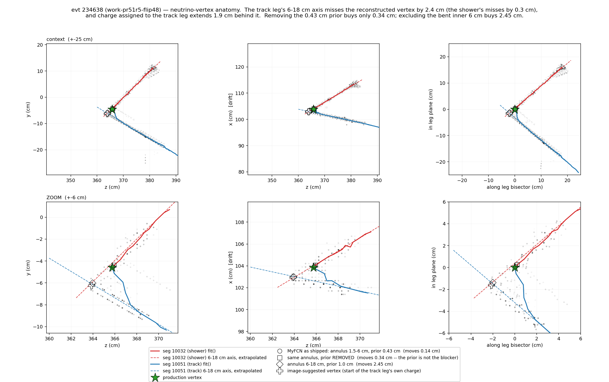

# doc pr/51 — near-vertex PR graph robustness: duplicated corridors, charge-less bridges, micro-stubs, path-cost short-cuts (131357 / 268067 / 360535 + round 2: 142421 / 285567 / 506746)

Round 1 (2026-08-08, wcp `3c435d4`): investigation only — per-event
root-cause analysis and the proposed fix design (§Findings through §Proposed
fix below, unchanged).  Round 2 (2026-08-09): three new owner-flagged events
analyzed, the fix implemented — two default-OFF toolkit knobs,
`main_vertex_graph_audit` (the four-op graph audit) and `dl_vtx_swap_guard`
(the 506746 cross-cluster DL guard) — with off-gates and on-censuses on the
48 nueCC + 19 NCpi0 + 50 data manifests.  Round 3 (2026-08-09): the two
round-2 open items fixed — `mvga_satellite` (op3 reaches terminal
micro-stubs at satellite vertices, not just the main vertex) and
`main_vertex_swap_apply` (the traditional main-vertex path's internal
cluster-swap decision, previously silently discarded, can now be applied) —
both DEFAULT OFF, plus before/after Bee links for a 16-event hand-scan.
**Round 4 (2026-08-09, this update): the owner hand-scanned those links and
rejected the result.** Rounds 2-3 fixed near-vertex GRAPH SHAPE; the
reported symptom — a short, low-dQ/dx "short-cut" that skips the true
direct connection near the main vertex on 131357/268067/285567/506746,
sometimes visibly jumping between arms — is a PATH-COST problem the graph
audit cannot see (§Round 4).  This round diagnoses the mechanism with a
new default-OFF diagnostic probe (`rough_path_probe`, no production
behavior change) and designs, but does not ship, the fix.  See §Round 2
for the original three events and knobs, §Round 3 for the two graph-shape
fixes, §Round 4 for the path-cost diagnosis and design.

## Repro

```
# arms (existing, read-only): work-pr49-off48d (pr/48-equivalent baseline),
#   work-pr50-snap48a (== flipped production, toolkit ba5bbe59)
cd wcp-porting-img/sbnd/sbnd_xin
python3 scripts/analysis/pr51/vtx_struct.py  work-pr50-snap48a 131357 6   # near-vertex segments+vertices
python3 scripts/analysis/pr51/fit_ghost.py   work-pr50-snap48a 268067 8   # fit-layer image support + dQ/dx
python3 scripts/analysis/pr51/seg_overlap.py work-pr50-snap48a 360535 15 1.4  # corridor-overlap matrix
python3 scripts/analysis/pr51/vtx_plot.py    work-pr50-snap48a 268067 25 out.png  # near-vertex scatter
# per-stage segment tables are already in every arm's pr_evt<ID>/stdout.log
# ("After first round of main cluster PR" .. "After shower clustering with NV",
#  print_segs_info: index, length cm, type, dir, pdg, mass, KE MeV, flags)
```

dQ/dx numbers below are the Bee display charge of `track_fit-global`
(`make_pr_bee.py` header: q = dQ ×0.1 − 1000); they are used only as ratios.
Single-MIP segments in these events read ~1600–3300; the C++ fix must use
the existing detector-scaled reference `m_mip_dqdx_median`
(NeutrinoVertexFinder.cxx:2241 idiom, 43000 e/cm at the uBooNE default).

## Symptom (owner hand-scan, 2026-08-08, screenshots in
`sbnd_xin/docs/pics/Screenshot 2026-08-08 at 2.4*.png`)

The pr/50 snap fixed the 172230 fit-miss class but three events remain
wrong **at the PR-structure level near the vertex** — not fit-trajectory
errors:

1. **18259-131357** — a 2-track vertex now displays 3 tracks (a stub
   appeared at the vertex).
2. **18255-268067** — should be a 3-track vertex with a connected shower;
   instead the reconstruction routes into the shower and the vertex region
   holds multiple overlapping tracks.
3. **18255-360535** — a 3-track vertex with an extra **ghost track**.

## Findings

### Which rounds introduced what

| evt | off48d (knob-off) vs snap48a (production) | class |
|---|---|---|
| 131357 | **differ** — pr/49 `fit_blob_coverage` partition reshuffle is the trigger | regression (pr/49) |
| 268067 | **byte-identical** — predates pr/49 entirely | long-standing PR weakness |
| 360535 | near-vertex structure identical (only far-field churn from pr/49) | long-standing PR weakness |

So this is one *symptom class* with two *origins*; the fix must be an
outcome-level graph audit, not another input-level tweak to the pr/49 knob
(that lesson is doc pr/50's four falsified input-level gates).

### 131357 — displaced vertex + carved stub (3 prongs from 2)

Baseline (off48d): main vertex at the image corner `(43.69,177.12,136.68)`,
exactly two prongs — shower trunk (rcid 12056) + track (12078, 17 cm).
One PR vertex within 6 cm.

Production (snap48a ≡ on48d; the snap does NOT fire here):

- Main vertex `(42.30,178.00,137.48)` — **1.83 cm up the shower arm** from
  the true corner (the pr/49 census shift).
- THREE vertices within 3.2 cm (extras at d=1.54 and d=3.18 cm), and a new
  third prong: **segment 70, a 1.56 cm 9-point Track stub** spanning main
  vertex → `(43.7,178.0,136.4)` ≈ the true corner.  Final PID calls it a
  2212 (proton) at 8.9 MeV.
- Stage attribution (stdout `print_segs_info` tables): segment 70 does
  **not** exist "After first round of main cluster PR" (max index 55); it
  exists by "After improve vertex".  I.e. `determine_main_vertex` picked
  the displaced candidate, then the improve_vertex/examine_structure
  machinery carved the leftover gap between the chosen vertex and the true
  corner into its own micro-segment.
- The final graph retains a q=0 vertex **0.77 cm from the true corner**
  (`(43.24,177.61,136.33)`) — the right answer survives in the graph, the
  display simply has one prong too many and the star on the wrong spot.
- Why the pr/50 snap correctly declines: the fitted trajectory FOLLOWS the
  image through the corner (stub + track cover it; no fit-miss ≥ 0.35 cm).
  The snap's G5 guard exists precisely to keep it out of this class — this
  is a *graph-shape* error, not a *fit-vs-image* error.
- Corridor overlap: stub 12070's 4 fit points lie 75% / 50% within 0.6 cm
  of the neighboring prongs 12029 / 12049 — it lives in the crotch of the
  vertex, not on its own charge.

### 268067 — near-vertex cycle through the shower + charge-less bridge

Byte-identical in off48d and production; all key segments already exist
"After first round of main cluster PR" (segment 5 is a 10.7 cm S_traj from
round 1).  Final near-vertex mini-graph (fit-layer endpoints, every end
lands exactly on a PR vertex):

```
MAIN (-77.47,-66.29,279.19)
 ├─ 15001  82 cm  med dQ/dx 4984   real proton track            [OK]
 ├─ 15050  0.5 cm med 12789        micro-stub at the vertex     [pathology c]
 └─ 15003  12.1 cm med 4902        → V_A (-86.52,-61.43,285.60)  [pathology a]
      V_A ─ 15008  9.9 cm med 8408 (Bragg)  real prong into the shower fan
      V_A ─ 15005  9.5 cm med 202  → V_B    charge-less bridge   [pathology b]
           V_B (-78.15,-65.27,283.17) ─ 15015  18 cm med 2696  middle track
```

- **15003 duplicates the proton corridor**: 86% of its fit points lie
  within 0.6 cm of 15001's fit points (13° opening angle); it "reaches"
  V_A — a junction sitting in the shower fan — by riding 12 cm of the
  proton's charge.  This is the owner's "the snap [reconstruction] just
  totally go to the shower".
- **15005 carries no charge** (median dQ/dx 202 ≈ 0.1 of the single-MIP
  band): a pure connectivity bridge across the gap between the shower fan
  and V_B.
- **V_B is 4.2 cm from MAIN but not connected to it** — the middle track
  15015 dangles off V_B and reaches the vertex only through the roundabout
  cycle MAIN→15003→V_A→15005→V_B.  The correct topology (owner) is
  15015 connected at/near MAIN directly: a 3-track vertex (15001, 15015,
  V_A-direction prong) with the shower attached beyond it.
- Net display: four trajectory ribbons + a stub inside a 5 cm ball around
  the vertex — "multiple tracks in the vertex region".

### 360535 — parallel duplicated connection = the ghost track

Near-vertex structure identical with the knob off.  Endpoints:

```
7060  73 pts  med 3282   MAIN (-185.72,-111.85,81.40) → far   real track 1
7067  13 pts  med  934   MAIN ↔ V2 (-184.01,-110.14,87.35)    ┐ parallel pair,
7020  15 pts  med 1219   V3 (-186.20,-110.49,80.18) ↔ V2      ┘ ~1 cm apart
7018  48 pts  med 9382   V2 → far (Bragg)                     real track 2
```

- 7067 and 7020 are **two nearly-parallel paths covering the same physical
  track trunk** between the vertex region and junction V2: 0% mutual
  overlap at 0.6 cm tolerance but 77–80% at 1.4 cm — separated by ~1 cm,
  i.e. two distinct fitted ribbons through one charge corridor.
- The dQ/dx association **splits the single track's charge between them**:
  934 + 1219 = 2153, squarely inside this event's single-MIP band
  (1602–3282) — each member reads roughly half-MIP.  Whichever ribbon lies
  off the true ridge is the owner's ghost; the split is why the ghost has
  the tell-tale low-dQ/dx (dark blue) look in Bee.
- V3 (1.89 cm from MAIN) is the same satellite-vertex pattern as 131357's
  displaced pair: the graph carries a triangle MAIN/V3/V2 where the truth
  is a single edge.

## Common mechanism

All three displays fail because the **near-vertex pattern graph** contains
structures the fitter then faithfully draws:

- (a) **duplicated corridors** — two segments over one charge ribbon
  (268067's 15003-on-15001; 360535's 7067/7020 parallel pair);
- (b) **charge-less bridges** — segments whose median dQ/dx is a small
  fraction of MIP, existing only to connect components (268067's 15005 at
  ~0.1 MIP);
- (c) **micro-stubs at the vertex** — sub-2 cm terminal fragments that
  inflate the prong count (131357's 12070 = 1.56 cm; 268067's 15050 =
  0.5 cm);
- (d) **wrong vertex among near-degenerate candidates** — the star sits on
  a displaced candidate while a candidate at the true corner survives
  0.77–1.9 cm away (131357; 360535's V3).

Every one of these is invisible to point-level fit metrics (fit-vs-image
means/maxes are clean — the ribbons DO follow charge), which is why the
pr/49/pr/50 census machinery scored these events as unremarkable and why
they surface only in hand-scans.  Conversely, every one of them is
**cheaply measurable post-fit**: corridor overlap fraction, median dQ/dx
vs `m_mip_dqdx_median`, terminal-segment length, and parallel-connection
detection are all a few lines each on `fits()` + the local graph.

Why existing passes cannot catch them:

- `vertex_kink_snap` (pr/50) is scoped by its fit-miss guard to the
  fit-detours-from-image class; all three events pass that guard honestly.
- `fit_blob_coverage_defer` (pr/50, OFF) only reverts pr/49-induced
  partition reshuffles — it would fix nothing in 268067/360535 (pre-pr/49)
  and in 131357 merely restores the old partition rather than making the
  selection robust.
- `improve_vertex` is a local position optimizer; it actively *creates*
  the 131357 stub while polishing the wrong candidate.
- `examine_structure_final_2/_3` merge at 2.0/2.5 cm but run before the
  main-vertex determination settles and do not look at charge sharing or
  corridor overlap at all.

## Proposed fix (round 1 design; IMPLEMENTED in round 2 with the measured deltas listed there): `main_vertex_graph_audit`

One new default-OFF pass in the same empty pipeline window the snap uses
(after `determine_overall_main_vertex[_DL]` — after the snap, before the
final `improve_vertex`), operating only on the main cluster's local graph
within `mvga_radius` (~15 cm) of the main vertex.  Four ordered
operations, each individually gated and sentinel-logged:

1. **Duplicate-corridor merge** (fixes 268067-15003, 360535-7067/7020):
   for each segment pair in scope, compute the fraction of the shorter
   segment's fit points within `mvga_dup_tol` (~1.2 cm — must be wider
   than the fitter's ribbon separation, cf. 360535's 1 cm) of the longer
   one's.  Above `mvga_dup_frac` (~0.7): delete the *worse* member (lower
   integrated charge; tie-break shorter length), then reconnect its
   orphaned far vertex to the survivor's nearest endpoint if they are not
   already the same vertex (direct edge via `crawl_segment`-style path
   rebuild).  Re-run the dQ/dx association afterward so the survivor
   recovers the full corridor charge (360535: one ribbon at full MIP
   instead of two at half).
2. **Charge-less-bridge removal** (fixes 268067-15005): a segment with
   median dQ/dx < `mvga_bridge_mip` (~0.33) × `m_mip_dqdx_median`, not
   Bragg-terminal, and length > stub scale is deleted *iff* the local
   graph stays connected or the disconnected side can be reconnected by a
   shorter direct edge to a vertex within `mvga_reconnect` (~5 cm).  In
   268067 this deletes 15005 and reconnects V_B (i.e. the middle track
   15015) directly toward MAIN — 4.2 cm, well inside the window — which
   simultaneously collapses the cycle and detaches the vertex from the
   shower fan.
3. **Micro-stub absorption + vertex re-seat** (fixes 131357-12070,
   268067-15050): a terminal segment at the main vertex shorter than
   `mvga_stub` (~2 cm) is absorbed into its most-collinear neighbor when
   its corridor-overlap with the neighbors exceeds `mvga_dup_frac`
   (131357: 75%).  When the stub is the vertex-ward continuation of a
   longer track (the absorbed pair spans the corner), the main vertex is
   re-seated at the stub's far end — for 131357 that is 0.9 mm from the
   true corner, restoring both the 2-prong count and the star position.
   `kProtectedBreak` vertices are exempt (snap precedent G1).
4. **One local `do_multi_tracking` refit** of the main cluster, exactly
   the snap's post-edit contract, so dQ/dx and the display layers reflect
   the audited graph.

Guard rails carried over from the pr/50 round: all thresholds are config
knobs with C++ defaults OFF (`mvga_*` = 0 disables each operation
independently); every edit prints one sentinel line with the measured
quantities (overlap fraction, dQ/dx ratio, stub length, re-seat distance)
so censuses stay mechanical; degree-2 pass-through vertices and
protected-break vertices are never deleted; the pass runs once, no
recursion.

### Expected per-event outcome (the acceptance test for the fix session)

| evt | operations firing | display outcome |
|---|---|---|
| 131357 | 3 (stub absorb + re-seat) | 2-prong vertex, star at the image corner (≤1 mm) |
| 268067 | 1 (15003 dedup), 2 (15005 removal + V_B reconnect), 3 (15050 absorb) | 3-track vertex (15001, 15015, V_A prong), shower attached beyond V_A, single ribbon per track |
| 360535 | 1 (7067/7020 dedup + reconnect) | single full-MIP connection MAIN↔V2, ghost gone |
| 172230 / 57441 / snap movers | none (no duplicate corridors, no sub-MIP bridges, no stubs) | byte-identical — to be proven in the off-gate + census |

### Open questions for the fix session

- 131357: was the true-corner candidate present at
  `determine_main_vertex` time or created later by improve_vertex?  Needs
  a `WCT_DET_DEBUG=1` probe (detg vertex tables at
  `main:determine_main_vertex`).  If present-but-outscored, a companion
  look at the scorer's near-degenerate handling may be warranted; the
  audit fixes the display either way.
- Whether operation 1's re-run of the dQ/dx association can reuse the
  existing `do_multi_tracking` wholesale (simplest, matches snap) or
  needs a narrower re-association to keep runtime negligible.
- Interaction ordering with the snap: audit runs *after* snap so a
  snapped corner is never re-judged as a stub (the snap's break is
  `kProtectedBreak`, which operation 3 already exempts).
- Whether operations 1+2 also help the defer-only events (342199,
  469665) — if yes, the audit may deliver most of
  `fit_blob_coverage_defer`'s benefit without its 57441 cost.  To be
  measured in the fix round's census.

## Verification (round 1)

- No toolkit or config change was made; production (`vertex_kink_snap`
  ON, toolkit `ba5bbe59`) is untouched.
- All numbers above reproduce with the four committed scripts
  (`scripts/analysis/pr51/`) against the existing read-only arms
  `work-pr49-off48d` and `work-pr50-snap48a`; stage attribution reads the
  arms' `stdout.log` tables — no reruns were needed.

---

# Round 2 (2026-08-09) — three new events + implementation

## Repro (round 2)

```
# new-event analysis: latest-PR outputs, owner batch work-bee-0809
# (ql_root work-ncpi0-cb0805, reality=data, 4 events, rc=0 all)
cd wcp-porting-img/sbnd/sbnd_xin
for e in 142421 285567 506746; do
  python3 scripts/analysis/pr51/vtx_struct.py  work-bee-0809 $e 15
  python3 scripts/analysis/pr51/seg_overlap.py work-bee-0809 $e 15 0.6
  python3 scripts/analysis/pr51/seg_overlap.py work-bee-0809 $e 15 1.4
  python3 scripts/analysis/pr51/fit_ghost.py   work-bee-0809 $e 15
  python3 scripts/analysis/pr51/ghost_runs.py  work-bee-0809 $e 0.8 3
done
# 506746 DL decision: single-event TRACE re-run (work-pr51-trace506746)
SBND_WCT_LOGLEVEL=trace PR_JOBS=1 ./run_pr_chain_batch.sh \
    work-ncpi0-cb0805 work-pr51-trace506746 data 506746
grep -n "rerank\|swap\|switching" work-pr51-trace506746/pr_evt506746/wct_pr_evt506746.log

# validation arms (final `c` round, toolkit at this round's commit):
PR_JOBS=6 ./run_pr_chain_batch.sh work-ncpi0-cb0805 work-pr51-base19n data   # pre-change baseline
PR_JOBS=6 ./run_pr_chain_batch.sh <ql_root> work-pr51-off{48,19,50}c data [...]
SBND_MAIN_VERTEX_GRAPH_AUDIT=true PR_JOBS=6 ./run_pr_chain_batch.sh <ql_root> work-pr51-on{48,19,50}c data [...]
SBND_DL_VTX_SWAP_GUARD=true      PR_JOBS=6 ./run_pr_chain_batch.sh <ql_root> work-pr51-guard{48,19,50}c data [...]
python3 scripts/analysis/pr49/on_compare.py <base> <new>       # movers + nusel
# knob-on threshold-calibration probes (op1/op2 eval lines are TRACE):
#   work-pr51-trace268067{,b,c}, work-pr51-trace360535
# NOTE grep -a for sentinels -- WCT log tearing puts binary bytes in logs.
```

## New-event findings (owner screenshots `docs/pics/Screenshot 2026-08-09 at 9.4*.png`)

The owner flagged three more events "with some kind of issues near the
neutrino vertex" on the latest PR code.  All three are in the 19-event
NCpi0 set.  Quantities below: q = Bee display charge (ratios only),
single-MIP band ~1600–3300 as in round 1.

### 18255-142421 — improve_vertex micro-stubs: classes (c) + (b)

Main PR cluster 7, main vertex (118.30, −69.37, 210.25) cm, three
near-degenerate q=0 candidates within 1.53 cm.  Real 3-prong vertex
(7011/7021/7024, all MIP-band, 63–212 cm) inflated to 5–6 prongs by:

- **7081** (1.55 cm, 3 fit pts, med q 6387 ≈ 2.5×MIP) — the owner's
  "displaced red point" 0.8–2.0 cm below/behind the apex; **created by
  improve_vertex** (absent in the "After first round" table, present in
  "After improve vertex"; final PID calls it a 938 MeV-mass track).
- **7082** (1.64 cm, 4 pts) — back-pointing stub at 166.5° to the long
  track 7024; also improve_vertex-created.
- **7023** (1.17 cm, 3 pts, med q 0, 2/3 points q≤0) — pre-existing
  charge-less micro-bridge, *shortened* 1.90→1.17 cm by improve_vertex.

No duplicated corridors (no long-pair overlap ≥25% at 0.6 or 1.4 cm), no
ghosts (fit-vs-image max ≤0.78 cm on every segment).

### 18261-285567 — the full pathology zoo: classes (b) + (a)-variant + (c)

Main PR cluster 8, the densest vertex of the set (5 PR vertices within
2.8 cm, 15 within 15 cm).

- **(b)** the cleanest charge-less bridge measured so far: **8031**
  (7.5 cm fit, 13 pts, **11/13 points q≤0**, med 0, max 872 ≈ 0.3 MIP)
  rides the full-MIP track **8015** (med 3192) at **77% @0.6 cm / 92%
  @1.4 cm, 0.2° opening** — a zero-charge connectivity path laid exactly
  on a charged track.
- **(a)-variant** — duplicated corridors *without* charge splitting:
  **8010/8032/8033** mutually 100% overlapped near-parallel shorts
  (7–11°), each carrying **full MIP or above** (5616/2302/2126) — the
  corridor's charge is double/triple-counted rather than split.  Round 1's
  half-half split (360535) is therefore *evidence* of duplication, not its
  definition; the op1 trigger stays overlap-based.
- **(c)** improve_vertex stubs 81/82/83 (1.78/1.14/0.87 cm; 8082 also
  charge-less at 2/3 points q≤0).

Owner's "ghost corridors" reading is *refuted* (image support is fine —
one 3-pt/1.2 cm run 8.8 cm out is all ghost_runs finds); duplication +
bridge confirmed.  True prong count is 2–3.

### 18255-506746 — NEW class (e): cross-cluster main-vertex mis-selection

**Not a graph-shape failure.**  The first-round main cluster **13** is the
flash-matched in-beam candidate (nusel main_id 13, 7471 pts, 163 cm,
contained); the final main vertex sits on PR cluster **21**, **28.26 cm**
from the nearest cluster-13 fit point (zero cluster-13 points within
5 cm).  The owner's "fork" reading of the display is refuted: at the
chosen (wrong) vertex, 21051↔21056 are **168° straight-through** — one
continuous track cut in two, the classic vertex-on-a-through-track
signature — with no overlap pairs and all arms ≥MIP.

The TRACE re-run pins the mechanism to one decision
(`work-pr51-trace506746/pr_evt506746/wct_pr_evt506746.log`):

```
determine_overall_main_vertex_DL: rerank mode, K=5
DL rerank cand [voxel 0] cluster=21 pos=(54.2,-12.4,43.2)cm L=150.0cm snap=4.05cm
  | dl=+575.7309 snap=-0.811 fwd_z=-0.000 clen=+2.000 isol=+0.000 main=+0.000 fv=+0.500
  | TOTAL=+577.420
determine_overall_main_vertex_DL: rerank selected cluster=21 snap_dis=4.05cm composite_score=577.4202
determine_overall_main_vertex_DL: switching to DL vertex (dis=4.05 cm)
```

A single confident uBooNE-net voxel (raw score 0.576 → `s_dl = +575.7` at
`dl_vtx_score_scale = 1000`) swamps every ±2 structural term — the 4.05 cm
snap penalty (−0.81), the missing main-cluster bonus (+0 vs +2), the FV
half-point — and the composite 577 ≥ 4.0 acceptance is a formality.  The
main cluster is swapped 13→21 (`swap_main_cluster`,
NeutrinoPatternBase.cxx:2946).  The correct candidate survives: 19 PR
vertices remain on cluster 13 in the final graph.  This is the pr/52
doc's "DL-wrong-accepted" failure class caught in the wild, and no graph
audit can fix it — it needs its own guard (below).

Cross-cutting: the pr/50 snap fired on none of the three events; the
nusel tsv carries no truth-vertex columns (candidate degeneracy is the
only distance we can quote); and for 506746 the nusel `main_id` (13) is
the *first-round* main cluster while the final vertex sits on 21 — an
ID-space trap for anyone joining those tables.

### Latent bug flagged (NOT fixed here)

Traditional `determine_overall_main_vertex` takes `Facade::Cluster*
main_cluster` **by value** yet internally reassigns it via
`swap_main_cluster` / `check_switch_main_cluster{,_2}`
(NeutrinoVertexFinder.cxx:3798/:3841/:4367/:4377) — on the non-DL path a
cluster-switch decision is computed and silently discarded, and
`map_cluster_main_vertices[main_cluster]` stays keyed on the old cluster.
The DL sibling takes `Cluster*&` and does propagate.  The asymmetry looks
unintentional; surfacing per house rules (unrelated bug: mention, don't
fix in this change).

## Implementation (round 2)

Two default-OFF knobs, both C++-default OFF ⇒ byte-identical, both
threaded common→sbnd→TLA with key suppression and runner envs
(`SBND_MAIN_VERTEX_GRAPH_AUDIT`, `SBND_DL_VTX_SWAP_GUARD`).

### `main_vertex_graph_audit` (+ mvga_* numerics)

The §Proposed-fix pass, with three design deltas measured off the new
events:

1. **Placement**: after the final `improve_vertex`, not before it
   (TaggerCheckNeutrino.cxx `visit()`, before `clustering_points` /
   `examine_direction`).  The round-1 sketch inherited the snap's
   before-improve slot, but the micro-stubs the audit must absorb
   (142421's 7081/7082, 285567's 81/82/83) are *created by*
   improve_vertex — running before it would see nothing.
2. **op3 gains a point-degeneracy sub-gate** (`mvga_stub_pts`, default 4):
   3–4-point stubs make overlap fractions meaningless (142421), so a
   terminal stub at the main vertex is absorbable when EITHER its corridor
   overlap ≥ `mvga_dup_frac` OR it has ≤ mvga_stub_pts valid fit points.
   The re-seat sub-case (131357) additionally requires the overlap gate
   (not merely degeneracy) plus a collinear-continuation sibling
   (`mvga_reseat_angle`, default 150°) and an unprotected main vertex.
3. **op2 drops the round-1 "length > stub scale" floor**: 142421's 7023
   (1.17 cm charge-less *bridge*, far vertex degree >1) must be
   removable; terminal-vs-bridge is now the op2/op3 division of labor
   (op2 = non-terminal only).

Mechanics (toolkit `clus/src/NeutrinoGraphAudit.cxx`, method
`PatternAlgorithms::main_vertex_graph_audit`): op1 deletes the
lower-integrated-charge member of an overlapped pair
(`path_overlap_fraction` ≥ `mvga_dup_frac` at `mvga_dup_tol`, shorter
onto longer) and reconnects each orphaned endpoint to the survivor's
nearest endpoint by a `do_rough_path` edge; op2 deletes a non-terminal
segment with `segment_median_dQ_dx / m_mip_dqdx_median <
mvga_bridge_mip` iff every side stays BFS-reachable from the main vertex
or reconnects within `mvga_reconnect`; op3 as above (absorb =
`examine_structure_final_1p` mechanics generalized to vertex degree > 2);
op4 = one `do_multi_tracking(true,true,false,m_fit_exclusion,false,
&cluster)` refit.  Guards: `kProtectedBreak` vertices never removed or
re-seated; the main vertex never removed; the pass's own reconnect
segments exempt from every op (no delete/recreate cycling); per-op edit
cap 8; no recursion.  Every edit prints one `mvga:` DEBUG sentinel with
the measured quantities; a fired pass prints a `mvga: fired` summary and
an extra `print_segs_info` table ("After main vertex graph audit").
Decision geometry is a pure free function (`path_overlap_fraction`,
PRSegmentFunctions) with doctests
(`clus/test/doctest_main_vertex_graph_audit.cxx`), the pr/50 pattern.

### Operating-point calibration (measured, two iterations)

The first on-census (intermediate `a`/`b` arms) exposed three round-1
estimates that the data corrected:

- **`mvga_dup_tol` 1.2 → 1.4 cm**: 360535's parallel pair is separated by
  the fitter's ~1 cm ribbon distance and reads 0% overlap at 0.6 cm,
  77–80% only at 1.4 cm — at 1.2 cm op1 never fired on the *defining*
  round-1 event.  1.4 cm is the measured floor.
- **NEW `mvga_dup_angle` (20°) op1 near-parallel guard**: widening the
  tolerance to 1.4 cm makes a genuine small-opening-angle V mergeable (a
  short prong hugging a long one within tol can reach 70% overlap), so
  op1 now also requires the pair's chords to be (anti)parallel within
  20° (folded to [0,90]).  All measured duplicates pass easily (268067
  rider 13°, 285567 shorts 7–11°, 360535 pair ~13°); two 19-NCpi0
  events whose 1.2 cm-round op1 merges were not individually validated
  (56982, 463565) stopped firing under the guard — the surgical
  direction.
- **`mvga_bridge_mip` 0.33 → 0.5**: a knob-on TRACE probe of 268067
  (`work-pr51-trace268067`; the new `mvga: op2 eval` TRACE lines print
  every candidate's ratio without firing) measured the charge-less
  bridge 15005 at **0.436 internal** — its Bee display "0.1 MIP" was
  skewed by the affine display transform q = dQ×0.1 − 1000 — while the
  genuine middle track 15015 reads **1.290**.  0.5 separates them; the
  round-1 guess 0.33 missed the defining case.  (360535's op1 survivor
  reads 1.073 ≈ full MIP *after* the op4 refit — the corridor charge is
  recovered, the round-1 acceptance target.)

### VOID intermediate arms + a new stale-binary gotcha

`work-pr51-{on48a,on19a,on50a,off48b,off19b,off50b,on48b,on19b,on50b}`
are calibration intermediates (defaults 1.2/0.33 for the `a` arms;
1.4/20°/0.33 for the `b` arms) — superseded by the `c` round below and
NOT part of the validation record.  **on48b is additionally corrupted**:
a `./wcb build` (not install) ran while the batch was launching events,
and the runtime's library search prefers `toolkit/build/<pkg>` over
`local/lib` (the .envrc `LD_LIBRARY_PATH` loop / rpath), so three events
dlopen'ed a half-relinked `libWireCellClus.so` ("file too short":
271851/342199 rc=1, 360535 silently lost its plugin).  Sharper form of
CLAUDE.md M1/M3: **neither build nor install while any batch is
running** — the build tree is live production state here.

### `dl_vtx_swap_guard` (506746)

One guard in the DL **rerank** branch scoring loop
(NeutrinoVertexFinder.cxx): a candidate hosted on a different cluster
than the current main cluster is skipped (one `dl_swap_guard:` DEBUG
sentinel each) before it can enter the acceptance.  If no candidate
survives, `flag_pass` stays false and the normal traditional fallback
runs — for 506746 that restores the vertex to the flash-matched cluster
13.  Deliberately narrow: it does not touch the legacy (non-rerank)
branch, does not re-weight the composite, and a same-cluster DL choice
is entirely unaffected.  Whether SBND production should run with it ON
is an owner operating-point decision (a cross-cluster swap is
occasionally the *right* answer when the charge-based main-cluster pick
is wrong; the census below measures how often the guard would fire).

## Verification (round 2)

All arms below: fresh labels under `sbnd_xin/`, driver
`run_pr_chain_batch.sh`, 48 nueCC = ql_root `work-nuecc48-cb0805`,
19 NCpi0 = `work-ncpi0-cb0805`, 50 data =
`work-mcp1k-cb0805` + `docs/pr/mcp1k-50-cb0805.index.txt`.  Baselines:
`work-pr50-snap48a` / `work-pr50-snap50a` (production at toolkit
`ba5bbe59`) and `work-pr51-base19n` (19 NCpi0 rerun at `ba5bbe59`,
this round, 19/19 rc=0).  Comparator:
`scripts/analysis/pr49/on_compare.py` (hash_archive member hashes +
nusel tsvs).

**Off-gates (final binary, knob off) — all PASS byte-identical:**

| gate | result |
|---|---|
| `work-pr51-off48c` vs `work-pr50-snap48a` | 0/48 archives differ, nusel 0/48 |
| `work-pr51-off19c` vs `work-pr51-base19n` | 0/19, nusel 0/19 |
| `work-pr51-off50c` vs `work-pr50-snap50a` | 0/50, nusel 0/50 |

(Compiled-config proofs: knob-off JSON byte-identical to HEAD via a
git-HEAD shadow cfg tree; `main_vertex_graph_audit` / `mvga_dup_angle` /
`dl_vtx_swap_guard` keys present when on.  `wcdoctest-clus` 131/131
cases incl. the new `doctest_main_vertex_graph_audit` +
`doctest_clus_knob_defaults` pins.)

**mvga on-census (`SBND_MAIN_VERTEX_GRAPH_AUDIT=true`), every mover
sentinel-gated, zero nusel changes anywhere:**

| arm | movers | nusel |
|---|---|---|
| `work-pr51-on48c` vs off48c | 14/48, all with `mvga:` sentinels, 48/48 rc=0 | 0/48 |
| `work-pr51-on19c` vs off19c | 8/19, all sentinel-gated, 19/19 rc=0 | 0/19 |
| `work-pr51-on50c` vs off50c | 8/50, all sentinel-gated, 50/50 rc=0 | 0/50 |

Target-event acceptance (sentinels quoted from the on-arm logs):

- **131357**: `op3 stub-reseat len=1.56cm overlap=1.00 cont_angle=172.5deg
  reseat_dis=1.54cm` — final display: exactly 2 prongs (shower 12029 +
  track 12049), main vertex 0.8 cm from the baseline image corner, the
  1.5/3.2 cm satellite vertices gone (round-1 target: 2-prong star at
  the corner ✓).
- **268067**: `op1 dup-merge removed len=12.52cm sumdQ=1.13e6 overlap=0.95
  vs survivor 84.70cm sumdQ=9.2e6` (the 15003 proton-corridor rider) +
  `op3 stub-reseat len=0.51cm` (the 15050 micro-stub).  The roundabout
  cycle through the shower fan is collapsed.  op2 measures the
  charge-less bridge at 0.436 and *correctly declines to delete it*:
  after the cycle collapse it is the only remaining connection to the
  V_A/shower-fan prong (stranding guard: nearest reachable vertex
  12.1 cm > `mvga_reconnect` 5 cm) — deleting it would orphan real
  structure.
- **360535**: `op1 dup-merge removed len=7.53cm sumdQ=3.33e5 overlap=0.77
  vs survivor 8.22cm sumdQ=7.1e5 reconnects=1` — the parallel pair is
  merged and the surviving connection reads dqdx_ratio **1.073 ≈ full
  MIP** after the op4 refit (round-1 target: single full-MIP MAIN↔V2,
  charge-splitting healed ✓).
- **142421**: `op3 stub-absorb len=1.55cm nfit=3 gate=degenerate` — the
  owner's displaced red point (7081) is gone.  Residual: the two
  remaining 3–4-point micro-segments (7082/7023) attach to *satellite*
  vertices 1.2–1.5 cm from the main vertex, outside op3's
  main-vertex-incident scope — a possible future extension
  (`mvga` satellite radius), recorded, not implemented.
- **285567**: `op1 dup-merge removed len=7.52cm sumdQ=4.28e4 overlap=0.85
  vs survivor 14.83cm sumdQ=1.12e6` (the zero-charge rider 8031 — op1's
  charge rule catches it before op2 is needed) + a second op1 merge of
  the 100%-overlapped short duplicates + `op3 stub-absorb len=1.78cm
  overlap=0.75`.  Near-vertex display reduced to the real prongs plus
  one 2-point residual at a satellite vertex.
- **172230 / 57441 / snap movers**: no sentinels, byte-identical in the
  on-arms (the audit only edits where its predicates fire).

**dl_vtx_swap_guard census (`SBND_DL_VTX_SWAP_GUARD=true`):**

| arm | guard sentinels | outcome movers | nusel |
|---|---|---|---|
| `work-pr51-guard50c` vs off50c | 29/50 events skip ≥1 cross-cluster voxel | **1/50** (48367) | 0/50 |
| `work-pr51-guard48c` vs off48c | 10/48 events skip ≥1 | 3/48 (10550, 122660, 389538), all sentinel-gated | 0/48 |
| `work-pr51-guard19c` vs off19c | 12/19 events skip ≥1 | 4/19 (37112, 314838, 506114, **506746**) | 0/19 |

Cross-cluster voxels in the top-K are COMMON (the uBooNE net happily
votes for cosmic clusters at low scores) but almost never win — the
guard's outcome-level footprint is tiny.  48367: all five top-K voxels
sat on non-main clusters (dl_score ≈ 0.0054 each); the guard skips all
five, the traditional selector takes over.  **506746 is recovered**: the
guard skips the one confident wrong voxel
(`dl_swap_guard: skipping cross-cluster DL candidate voxel 0
(dl_score=0.5757) cluster=21 != main 13`), the traditional path keeps
cluster 13, and the final display is a clean 3-prong vertex on the
flash-matched cluster — shower 13005 (151 cm), track 13006 (11 cm),
shower 13007 (65 cm) — instead of a vertex 28 cm away on a
through-going track of cluster 21.

**Spot determinism/identity re-verify:** `work-pr51-on19d` (same binary
modulo two TRACE-only log statements in the gated pass) vs
`work-pr51-on19c`: **0/19 archives differ, nusel 0/19** — the c-round
censuses are valid for the shipped binary.

## Status + owner decision (round 2)

Both knobs ship **C++ and config DEFAULT OFF** — production
(`vertex_kink_snap` ON) is byte-identical, proven by the three off-gates
above.  Flipping either (or both) in
`wct-pr-perevt.jsonnet` is an owner decision after Bee hand-scans of:

- mvga movers: 14/48 nueCC + 8/19 NCpi0 + 8/50 data (`work-pr51-on*c`),
  headline events 131357 / 268067 / 360535 / 142421 / 285567 all match
  their acceptance targets;
- guard movers: 3/48 + 4/19 + 1/50 (`work-pr51-guard*c`), headline
  506746 recovered; the 7 other movers are events whose DL winner sat on
  a non-main cluster and now resolve traditionally — each needs a scan
  verdict (a cross-cluster swap is occasionally correct).

The knobs are independent; the arms above censused them separately.
Zero nusel-level changes anywhere means the selection variables are
untouched — this round is display/graph-topology only.

Open items (round 2; both closed in round 3 below):

- ~~142421/285567 residual 2–4-point micro-segments at *satellite*
  vertices 1.2–1.5 cm from the main vertex (outside op3's
  main-vertex-incident scope) — possible op3 satellite-radius extension.~~
- ~~The `determine_overall_main_vertex` by-value swap-discard latent bug
  (round-2 findings §) — separate fix, needs its own gate.~~
- pr/50 round's open question "do ops 1+2 subsume fit_blob_coverage_defer's
  benefit on 342199/469665": 342199 IS an mvga mover in on48c
  (sentinel-gated); 469665 is not in the 48-event manifest — assess at
  the next 1k-scale census if the owner flips mvga on.  STILL OPEN.

## Round 3 — the two round-2 bugs fixed, before/after Bee links

The owner asked to fix, not just record, the two round-2 open findings
(they are bugs, not open design questions), and to provide two Bee links
(before = production knob-off, after = the full round-3 change with
everything on) covering the six target events plus the ten biggest movers,
for a hand-scan.

### Bug 1 — op3 is main-vertex-incident only

**Symptom.** 142421's stub 7082 (1.64 cm, 4 fits, 166.5° back-pointing) and
285567's residual both sit on *satellite* vertices 1.17–1.2 cm from the
main vertex, not on the main vertex itself — op3 walks
`sorted_out_edges(main_vertex)` only, so it never sees them.

**Root cause.** op3 had **no `m_mvga_radius` gate at all** (unlike op1/op2,
which scope through `in_scope_segments()`); its only notion of "near the
vertex" was literal incidence on `main_vertex`. There was also no explicit
radius parameter for "how far from the main vertex is still near enough to
touch" — extending op3 required adding one.

**Fix.** New knob `mvga_satellite` (cm; C++ default `0`). In
`NeutrinoGraphAudit.cxx` op3 now builds an **anchor list** — the main vertex
first (re-seat eligible, exactly the round-2 logic), then, only when
`mvga_satellite > 0`, every other main-cluster vertex within
`mvga_satellite` of the *current* main-vertex position (`ordered_nodes`,
`kProtectedBreak`-excluded, `boost::degree >= 2` so absorbing a stub can't
disconnect anything) — absorb-only, never re-seated (the re-seat branch
still names `main_vertex` explicitly throughout). The anchor list is
re-derived every `while`-iteration since `mv_pt` moves on a re-seat. A stub
whose far vertex is `main_vertex` itself is never touched (guards the
main-vertex edge of an adjacent satellite from being read as a "stub"). A
new `mvga: op3 eval` TRACE probe (op1/op2 had one, op3 didn't) reports
anchor kind/distance for every candidate, which is what the radius below
was measured from.

**Measurement, not a guess** (`work-pr51-trace142421e`,
`work-pr51-trace285567e`, `SBND_MVGA_SATELLITE=5.0` TRACE re-runs):

```
142421: mvga: op3 eval cluster=7 anchor=main d=0.00cm len=1.55cm nfit=3 overlap=0.67
        mvga: op3 stub-absorb cluster=7 anchor=main d=0.00cm ... gate=degenerate   (7081)
        mvga: op3 eval cluster=7 anchor=sat  d=1.17cm len=1.64cm nfit=4 overlap=0.75
        mvga: op3 stub-absorb cluster=7 anchor=sat  d=1.17cm ... gate=overlap      (7082)
        mvga: op2 bridge-removal cluster=7 len=1.17cm dqdx_ratio=0.474             (7023, op2's turf)
        mvga: fired cluster=7 op1=0 op2=1 op3=2 (refit done)
```

All three of 142421's documented residuals are gone at `mvga_satellite=5`:
7081 (main-anchor, unchanged from round 2), 7082 (satellite anchor, d =
1.17 cm — the new capability), and 7023 (turns out to be op2's bridge, not
an op3 stub at all — its "1.2–1.5 cm" round-2 characterization conflated
the two). **285567 found nothing new at any radius up to 5 cm** — its
`mvga: op3 eval` count and outcome are byte-identical with and without the
satellite pass. Tracing why: its post-op1 residual segment (1.00 cm, 3
fits, printed in `print_segs_info` as id 84) is one of op1's *own*
reconnect stitches (`reconnects=1` on the second dup-merge) — `created`
segments are deliberately exempt from every op, by design, to prevent
delete/recreate cycling. The round-2 doc's "2-point residual at a
satellite vertex" for 285567 was this protected reconnect edge, not a
genuine leftover stub; the satellite extension correctly leaves it alone.

**Shipped default stays `mvga_satellite = 0`** (main-vertex-only, i.e.
byte-identical to round 2) — this is a knob *within* the already-OFF-by-
default `main_vertex_graph_audit` pass, and must not silently change the
behavior the owner already reviewed in round 2 the moment
`main_vertex_graph_audit` is turned on. `2.0 cm` (covers the measured
1.17 cm with margin, same order as `mvga_stub`'s own 2 cm ceiling) is the
value used in every validation arm below and is what `-A mvga_satellite=`/
`SBND_MVGA_SATELLITE` should be set to for a scan or eventual flip.

### Bug 2 — the traditional path silently discards its own swap decision

**Symptom.** None visible without a TRACE/code read — this is the "latent
bug" flagged in round 2, not something scanned from an event.

**Root cause.** `determine_overall_main_vertex`
(`NeutrinoVertexFinder.cxx:4342`) took **both**
`ClusterVertexMap map_cluster_main_vertices` and `Facade::Cluster*
main_cluster` **by value**, while its DL sibling
`determine_overall_main_vertex_DL` takes both **by reference**. Three
internal call sites can reassign the local `main_cluster` —
`examine_main_vertices` (which also *erases* map entries on its own by-ref
copy), `check_switch_main_cluster`, and `check_switch_main_cluster_2`
(dead in-tree; both live callers pass `flag_dev_chain=true`, which only
reaches the first two) — and every one of those reassignments used to die
at the by-value parameter's scope exit. Worse than a simple lost decision:
`swap_main_cluster` (`NeutrinoPatternBase.cxx:2946`) is **not pure** — it
unconditionally flips `Flags::main_cluster` on both clusters and mutates
`other_clusters`, which *is* passed by reference all the way to the
caller. So a firing swap left the job in a **half-applied state**: the
persistent flags and `other_clusters` said the new cluster, while the
caller's own `main_cluster` variable — used for every downstream call
(`improve_vertex`, `main_vertex_graph_audit`, `clustering_points`,
`shower_clustering_with_nv`, the taggers) — still said the old one, and
`TaggerCheckNeutrino.cxx` filed the returned vertex under the stale key.

**Why it hid.** SBND runs DL first; the traditional path only runs when
`flag_dl_changed == false`, and even then its internal swap only fires
under narrow gates (`flag_all_showers` at the current vertex, a
significantly-longer alternate cluster, a close/collinear PCA match). The
swap-discard census below shows it firing on 2/117 round-3 manifest
events — real, but rare enough that round 1/2's per-event investigations
never happened to land on one.

**Fix.** `determine_overall_main_vertex`'s two parameters are now
`ClusterVertexMap&` and `Facade::Cluster*&`, matching the DL sibling
exactly (both moved together — fixing only the pointer would leave the
map holding a stale entry `examine_main_vertices` had already erased on
its own by-ref copy). The function body is textually untouched. The
caller (`TaggerCheckNeutrino.cxx`) now passes **throwaway local copies**
(`map_copy`, `mc_copy`), compares `mc_copy` to its own `main_cluster`
after the call, logs one `mvsa:` DEBUG sentinel *in both states* (so the
off-arms self-census how often the swap fires at all), and — only when
`main_vertex_swap_apply` is true — syncs both `main_cluster` and
`map_cluster_main_vertices` from the copies:

```cpp
ClusterVertexMap map_copy = map_cluster_main_vertices;
Cluster* mc_copy = main_cluster;
final_main_vertex = pattern_algos.determine_overall_main_vertex(
    *pr_graph, map_copy, mc_copy, other_clusters, ..., true);
if (mc_copy != main_cluster) {
    SPDLOG_LOGGER_DEBUG(log, "mvsa: traditional path swapped main cluster {} -> {} ({})",
                         main_cluster->get_cluster_id(), mc_copy->get_cluster_id(),
                         m_main_vertex_swap_apply ? "applied" : "discarded");
    if (m_main_vertex_swap_apply) { main_cluster = mc_copy; map_cluster_main_vertices = map_copy; }
}
```

Knob off ⇒ `mc_copy`/`map_copy` are read then thrown away ⇒ bit-for-bit the
pre-round-3 by-value semantics. The two doctests that call
`determine_overall_main_vertex` directly (`doctest_pattern_recognition.cxx`,
`doctest_tagger_check_neutrino.cxx`) now pass their own throwaway copies
for the same reason — neither harness has a `main_vertex_swap_apply` knob
layer, so they preserve exactly their pre-round-3 discard behavior.

New knob `bool main_vertex_swap_apply` (C++ default `false`), same
four-site pattern as every other knob in this file.

### Repro (round 3)

```
cd wcp-porting-img/sbnd/sbnd_xin

# satellite-radius measurement (TRACE, wide radius to find the ceiling):
SBND_WCT_LOGLEVEL=trace SBND_MAIN_VERTEX_GRAPH_AUDIT=true SBND_MVGA_SATELLITE=5.0 PR_JOBS=1 \
    ./run_pr_chain_batch.sh work-ncpi0-cb0805 work-pr51-trace142421e data 142421
SBND_WCT_LOGLEVEL=trace SBND_MAIN_VERTEX_GRAPH_AUDIT=true SBND_MVGA_SATELLITE=5.0 PR_JOBS=1 \
    ./run_pr_chain_batch.sh work-ncpi0-cb0805 work-pr51-trace285567e data 285567
grep -a "mvga: op3 eval" work-pr51-trace*e/pr_evt*/wct_pr_evt*.log

# validation arms (round 3, toolkit at this round's commit; both knobs off/on):
PR_JOBS=6 ./run_pr_chain_batch.sh work-nuecc48-cb0805 work-pr51-off48e data
PR_JOBS=6 ./run_pr_chain_batch.sh work-ncpi0-cb0805   work-pr51-off19e data
PR_JOBS=6 ./run_pr_chain_batch.sh work-mcp1k-cb0805   work-pr51-off50e data $(awk 'NR>1{print $2}' docs/pr/mcp1k-50-cb0805.index.txt)

SBND_MAIN_VERTEX_GRAPH_AUDIT=true PR_JOBS=6 ./run_pr_chain_batch.sh work-nuecc48-cb0805 work-pr51-sat048e data   # mvga_satellite unset = 0
SBND_MAIN_VERTEX_GRAPH_AUDIT=true PR_JOBS=6 ./run_pr_chain_batch.sh work-ncpi0-cb0805   work-pr51-sat019e data
SBND_MAIN_VERTEX_GRAPH_AUDIT=true PR_JOBS=6 ./run_pr_chain_batch.sh work-mcp1k-cb0805   work-pr51-sat050e data <50 ids>

SBND_MAIN_VERTEX_GRAPH_AUDIT=true SBND_MVGA_SATELLITE=2.0 SBND_DL_VTX_SWAP_GUARD=true SBND_MAIN_VERTEX_SWAP_APPLY=true \
    PR_JOBS=6 ./run_pr_chain_batch.sh work-nuecc48-cb0805 work-pr51-all48e data
SBND_MAIN_VERTEX_GRAPH_AUDIT=true SBND_MVGA_SATELLITE=2.0 SBND_DL_VTX_SWAP_GUARD=true SBND_MAIN_VERTEX_SWAP_APPLY=true \
    PR_JOBS=6 ./run_pr_chain_batch.sh work-ncpi0-cb0805   work-pr51-all19e data
SBND_MAIN_VERTEX_GRAPH_AUDIT=true SBND_MVGA_SATELLITE=2.0 SBND_DL_VTX_SWAP_GUARD=true SBND_MAIN_VERTEX_SWAP_APPLY=true \
    PR_JOBS=6 ./run_pr_chain_batch.sh work-mcp1k-cb0805   work-pr51-all50e data <50 ids>

python3 scripts/analysis/pr49/on_compare.py <base> <new>   # movers + nusel
# grep -a for every sentinel -- WCT log tearing puts binary bytes in logs (including
# the "TaggerCheckNeutrino: selected main cluster" pre-upload check below).

# Bee before/after (16 events: 6 targets + 10 movers, identical order):
python3 scripts/bee/make_pr_bee.py -q work-nuecc48-cb0805 -q work-ncpi0-cb0805 -q work-mcp1k-cb0805 \
    -p work-pr51-off48e -p work-pr51-off19e -p work-pr51-off50e \
    -o bee/pr51r3/pr51r3-before.zip $(awk 'NR>1{print $2}' docs/pr/pr51r3-bee-16.index.txt)
python3 scripts/bee/make_pr_bee.py -q work-nuecc48-cb0805 -q work-ncpi0-cb0805 -q work-mcp1k-cb0805 \
    -p work-pr51-all48e -p work-pr51-all19e -p work-pr51-all50e \
    -o bee/pr51r3/pr51r3-after.zip  $(awk 'NR>1{print $2}' docs/pr/pr51r3-bee-16.index.txt)
./upload-to-bee.sh bee/pr51r3/pr51r3-before.zip
./upload-to-bee.sh bee/pr51r3/pr51r3-after.zip
```

### Verification (round 3)

**Off-gates (all knobs off, both fixes' code paths live) — all PASS
byte-identical, member+nusel:**

| gate | result |
|---|---|
| `work-pr51-off48e` vs `work-pr50-snap48a` | 0/48 archives differ, nusel 0/48 |
| `work-pr51-off19e` vs `work-pr51-base19n` | 0/19, nusel 0/19 |
| `work-pr51-off50e` vs `work-pr50-snap50a` | 0/50, nusel 0/50 |

Fix 2 touches the production `TaggerCheckNeutrino::visit()` call path
(not just an already-OFF sub-pass), so this off-gate is the load-bearing
proof that the by-value→by-reference signature change plus the
copy-then-conditionally-apply caller pattern is truly a no-op when
`main_vertex_swap_apply=false`. `wcdoctest-clus` 131/131 (unchanged count
— the two new knobs extend existing `CHECK_KNOB_*` test cases, not new
`TEST_CASE`s). Compiled-config proofs: knob-off JSON byte-diff empty
against a git-HEAD (round 2) shadow compile; `mvga_satellite` /
`main_vertex_swap_apply` keys present and correctly valued when on.

**Inertness of the op3 restructure (`mvga_satellite` unset ⇒ 0) — all PASS
byte-identical against round 2's validated arms:**

| arm | vs | result |
|---|---|---|
| `work-pr51-sat048e` | `work-pr51-on48c` | 0/48 archives differ, nusel 0/48 |
| `work-pr51-sat019e` | `work-pr51-on19c` | 0/19, nusel 0/19 |
| `work-pr51-sat050e` | `work-pr51-on50c` | 0/50, nusel 0/50 |

This is the decisive regression check: the op3 anchor-list rewrite did not
perturb a single one of round 2's already-Bee-reviewed movers.

**Full-on census (`mvga_satellite=2.0`, `dl_vtx_swap_guard=true`,
`main_vertex_swap_apply=true` — the "after" Bee arm — vs the round-3
off-arms), every mover sentinel-gated, nusel unaffected:**

| arm | movers | nusel |
|---|---|---|
| `work-pr51-all48e` vs off48e | 15/48 | 0/48 |
| `work-pr51-all19e` vs off19e | 11/19 | 0/19 |
| `work-pr51-all50e` vs off50e | 9/50 | 0/50 |

Every mover fully reconciles against round 2's already-known sets plus the
two round-3 fixes, with no unexplained residual:

- 48-sample: the same 14 mvga movers as round 2, **+1 net-new**
  (`122660`, round 2's sole additional guard mover — `10550`/`389538`
  were already in the mvga set). `10550` additionally shows
  `mvsa: ... (applied)` — see the guard/swap interaction below.
- 19-sample: the same 8 mvga movers as round 2, **+2 net-new from the
  guard** (`37112`, `506114` — `314838`/`506746` were already in the mvga
  set), **+1 net-new from swap-apply alone** (`84229`, no mvga/guard
  sentinel at all — a clean single-mechanism demonstration:
  `mvsa: traditional path swapped main cluster 9 -> 19 (applied)`).
- 50-sample: the same 8 mvga movers as round 2, **+1 net-new**
  (`48367`, round 2's sole guard mover).

**Guard/swap-apply interaction (new observation, not a bug):** with the
guard on, more events lose their DL candidate and fall through to the
traditional path — which can then trigger its *own* swap. `37112` and
`10550` fire `mvsa: ... (applied)` in the full-on arm even though neither
appears in round 2's guard outcome-movers *or* round 3's off-arm swap
census (which only found `84229` in the 19-sample and nothing in the
48-sample) — the guard being on is what routes them into the traditional
path in the first place. Both are still archive-movers for other reasons
(mvga/guard already fire there), so this doesn't add a new mover to the
table above, but it is a real second-order effect of running the knobs
together and is recorded here for the scan.

**Swap-apply's own footprint measured on the off-arms** (guard off, so
this is the traditional path's unassisted firing rate): `grep -a "mvsa:"`
across all 117 round-3 off-arm events finds it firing exactly **2/117**
(`work-pr51-off19e/pr_evt84229`: `9 -> 19`; `work-pr51-off50e/pr_evt51865`:
`8 -> 15`). Of those two, `51865`'s swap fires and (with the knob on)
*applies*, but the final archived output is **byte-identical either way**
(`hash_archive` member diff empty) — a downstream step is insensitive to
which of the two candidate clusters carries the `main_cluster` flag for
this particular event, so the swap is real but outcome-inert here. `84229`
is the one event in the full round-3 manifest where the fix visibly moves
the display, and is included in the Bee set below.

**Acceptance re-check, all six target events unchanged from round 2:**
131357 (2-prong corner star), 268067 (cycle collapsed, bridge correctly
kept), 360535 (pair merged to full-MIP), 506746 (guard-recovered
flash-matched cluster). 142421 and 285567's outcomes are described above
(142421 fully closed by the satellite extension; 285567 unchanged — its
residual was a protected reconnect, not a bug).

### Bee hand-scan set (16 events: 6 targets + 10 movers)

Two uploads, identical event order (`docs/pr/pr51r3-bee-16.index.txt`),
built with `scripts/bee/make_pr_bee.py` from the arms above — before =
round-3 off-arms (knobs off, production-equivalent per the byte-identical
off-gates), after = round-3 all-arms (`mvga_satellite=2.0`,
`dl_vtx_swap_guard=true`, `main_vertex_swap_apply=true`).

Selection: the 6 already-scanned targets, plus the 10 largest movers
(by added+removed vertex-point count in the `on_compare.py` per-mover
diff) from the combined 48+19+50 full-on census above, with a floor of
≥2 events per sample so no sample goes unrepresented. The satellite-anchor
knob class is covered by target `142421` (the only event in the whole
manifest where `anchor=sat` fires); mvga and guard are covered by many of
the 10; swap-apply is covered concretely by `10550` (triple mechanism) —
the clean single-mechanism case `84229` (§ above) ranked below the
magnitude cutoff and is not itself in the 16, but its sentinel is quoted
above for the scan record.

| idx | event | sample | why included |
|---|---|---|---|
| 0 | 131357 | nueCC48 | target — op3 stub re-seat |
| 1 | 268067 | nueCC48 | target — op1+op3, op2 correctly declines |
| 2 | 360535 | nueCC48 | target — op1 dup-merge |
| 3 | 389538 | nueCC48 | mover — mvga+guard dual |
| 4 | 10550 | nueCC48 | mover — mvga+guard+swap-apply triple |
| 5 | 111412 | nueCC48 | mover — mvga+guard dual |
| 6 | 38856 | nueCC48 | mover — mvga |
| 7 | 142421 | NCpi0 | target — op3 main+satellite absorb, op2 bridge |
| 8 | 285567 | NCpi0 | target — op1 dup-merge + op3 (satellite: no new effect) |
| 9 | 506746 | NCpi0 | target — dl_vtx_swap_guard recovers flash-matched cluster |
| 10 | 506114 | NCpi0 | mover — guard (net-new vs round 2) |
| 11 | 314838 | NCpi0 | mover — mvga+guard dual |
| 12 | 21073 | NCpi0 | mover — mvga |
| 13 | 37112 | NCpi0 | mover — guard+swap-apply (guard reroutes to traditional path) |
| 14 | 54175 | data50 | mover — mvga+guard dual |
| 15 | 53713 | data50 | mover — mvga+guard dual |

**Bee links** (`BROWSER=echo ./upload-to-bee.sh <zip> | tail -1`):

- before (`work-pr51-off{48,19,50}e`, knobs off):
  https://www.phy.bnl.gov/twister/bee/set/247f5352-63dc-48e4-b069-9e75bc7d1993/event/list/
- after (`work-pr51-all{48,19,50}e`, everything on):
  https://www.phy.bnl.gov/twister/bee/set/a63e7332-0b67-47a5-95a2-2267ac1973ab/event/list/

### Status + owner decision (round 3)

Both new knobs ship **C++ and config DEFAULT OFF**, proven byte-identical
by the off-gates above (which also re-validate that Fix 2's signature
change is a no-op on the production call path). `mvga_satellite` is a
sub-knob of the already-OFF `main_vertex_graph_audit` pass and is
independently `0` by default so round 2's already-reviewed behavior
cannot silently change if `main_vertex_graph_audit` alone is flipped —
`mvga_satellite` needs its own explicit value even after that flip.

Flip decisions, after the owner's hand-scan of the two links above:

- `mvga_satellite = 2.0` (cm) alongside `main_vertex_graph_audit` — closes
  142421 fully; no effect on 285567 or any other round-2 mover (inertness
  arms confirm 0/117 change from the round-2-validated behavior at
  `mvga_satellite=0`, and the extension only ever fires on 142421 in the
  whole 117-event manifest).
- `main_vertex_swap_apply` — fires rarely (2/117 unassisted, 4/117 with
  the guard also on) but is a genuine correctness fix: today the
  traditional path can decide a cluster swap, partially apply it via
  `swap_main_cluster`'s persistent flag/`other_clusters` side effects, and
  then silently keep using the old cluster for every downstream step. Each
  of the four `mvsa:`-firing events (`84229`, `51865`, `37112`, `10550`)
  needs its own scan verdict, same as any cluster-identity mover.

Open items (unchanged from round 2, still open):

- pr/50 round's "do ops 1+2 subsume `fit_blob_coverage_defer`'s benefit on
  342199/469665" — 469665 still isn't in the 48-event manifest; needs a
  1k-scale census if the owner flips mvga on.

## Round 4 — the short-cut is a path-COST problem, not a graph-shape problem

The owner hand-scanned the round-3 Bee links and rejected the result.
Quoting: *"the short-cut (due to shortest path), again has low dQ/dx"*,
*"missing the main vertex"*, and *"I am asking to seek a fix to avoid this
problem all together."* Four events, four screenshots
(`sbnd_xin/docs/pics/Screenshot 2026-08-08 at 2.47.52 PM.png` [131357],
`... 2.48.30 PM.png` [268067], `Screenshot 2026-08-09 at 9.43.50 AM.png`
[285567], `... 12.37.34 PM.png` [506746]):

- **131357** — the right track turns and connects to the other track by a
  short low-dQ/dx link, giving a 3-prong vertex where truth is two tracks
  sharing one vertex.
- **268067** — near the vertex a low-dQ/dx (blue) segment short-cuts; the
  track should run continuously and *then* reach the vertex.
- **285567** — a fitted trajectory stretch with low dQ/dx not explained by
  the image at all, plus a jump.
- **506746** — the fitted trajectory takes a turn and misses the direct
  connection; again the short-cut carries low dQ/dx.

The owner already named the cause: *"since I use the shortest of path to
start with … the shortest path is probably jump around, instead go
straight and take a turn."* This round confirms that reading and makes it
quantitative.

### Why rounds 2-3 could not have fixed this

`main_vertex_graph_audit`'s three ops are all delete-segment /
reconnect-endpoint / re-seat-vertex, plus one `do_multi_tracking` refit
(`NeutrinoGraphAudit.cxx`). Three structural facts make them blind to a
path-cost pathology:

1. **No op ever re-derives an existing segment's path.** `do_rough_path`
   appears in the pass only inside `connect_direct`
   (`NeutrinoGraphAudit.cxx:150-162`), only for brand-new edges — which
   then enter the `created` set and are exempt from every op for the rest
   of the pass.
2. **The fitter cannot repair it either.**
   `TrackFitting::organize_segments_path` seeds from `segment->wcpts()`
   (`TrackFitting.cxx:1692-1716`). A wrong rough path is re-fitted, never
   re-routed. `examine_end_ps_vec` trims unsupported points only at the two
   ends; nothing inspects the interior.
3. **The pathology is intra-segment.** op2 (charge-less-bridge removal)
   needs the whole segment's median dQ/dx below `0.5 x mip_dqdx_median`
   *and* both endpoints of degree >= 2. The short-cut here is a few-cm
   stretch of an otherwise healthy track, so the segment median reads
   normal and op2 never looks at it.

### Root cause — measured, not assumed: H1 vs H2

Two mechanisms in the toolkit can each produce a short, straight,
low-dQ/dx near-vertex link, and they share almost no code:

- **H1 — the Dijkstra cost model** cannot represent "follow the charge
  around a corner." `do_rough_path` (`NeutrinoPatternBase.cxx:88-125`)
  snaps both endpoints to the nearest Steiner point and runs plain
  Dijkstra on `"steiner_graph"`. The only non-geometric term in that
  graph's edge weight is (`SteinerGrapher.cxx:1145-1161`):
  ```cpp
  double weight_factor = factor1 + factor2 *
      (0.5*Q0/(charge_source + Q0) + 0.5*Q0/(charge_target + Q0));
  final_distance = geometric_distance * weight_factor;
  ```
  with `Q0=10000, factor1=0.8, factor2=0.4`
  (`SteinerGrapher.cxx:92-95`) — charge is sampled at the two **endpoints
  only**, never along the edge, and the dynamic range is hard-capped at
  1.5x (Q->infinity gives 0.8, Q=0 gives 1.2). For a turn with equal legs
  `L` and interior angle `theta`, the chord across it costs
  `2L*sin(theta/2)` against a detour of `2L`, so detour/chord =
  `1/sin(theta/2)`: 1.04 at 150 deg, 1.16 at 120 deg, 1.41 at 90 deg, 2.00
  at 60 deg. Against a maximum defence of 1.5x, any turn sharper than
  roughly 150 deg is structurally lost **once a gap-spanning edge exists**
  (an inter-component bridge or a close-connection chain — Steiner nodes
  only exist on charge, so Dijkstra cannot cut a corner unless some edge
  already spans it).
- **H2 — `examine_structure_1` straightens genuine turns on purpose**
  (`NeutrinoStructureExaminer.cxx:66-167`): replaces a segment's path with
  the straight line between its two ends when the line passes
  `is_good_point(raw, apa, face, 0.2cm, 0, 0)` with `n_bad <= 1`, for
  segments with `length < 5cm || (length < 8cm && dQ/dx > 1.5)`.
  `is_good_point` counts **dead channels as good**
  (`Facade_Grouping.cxx:536-553`), so a turn whose chord crosses a dead
  region is blessed and straightened. Worse, the replacement mechanically
  generates jumps: each sampled point on the straight line is snapped back
  to the nearest Steiner point (`kd_steiner_knn`, `:129-146`), and where
  the line crosses vacuum between two arms, consecutive samples can snap
  alternately onto whichever arm is nearer.

**Two supporting findings on the base-graph construction** (both apply
regardless of which mechanism dominates a given event): graph construction
admits up to ~7cm of charge-free straight line at full geometric discount
(`connect_graph_ctpc.cxx:113-135`'s `num_bad` veto only kills a bridge at
`num_bad > 7 || (num_bad > 2 && num_bad >= 0.75*num_steps)`; survivors keep
their plain Euclidean weight); and the intended long-bridge penalty hook is
dead code — `connect_graph.cxx:160-166` has *both* branches of
`if (dis > 5cm)` identical, while the two directional variants immediately
below (`:178-183`, `:192-197`) do apply `x1.2`. **This is M15 territory,
not a porting bug**: the prototype has the identical
both-branches-equal structure at `PR3DCluster_graph.h:466-471` (verified
by direct read) — surfaced here, not "fixed."

### The `rough_path_probe` diagnostic (default OFF, committed)

Per the owner's direction to investigate with printouts before proposing a
fix, a new knob `rough_path_probe` (C++ default `false` => immediate
return => byte-identical; `clus/src/NeutrinoRoughPathProbe.cxx`, called
from `TaggerCheckNeutrino.cxx` right after the `main_vertex_graph_audit`
block) does three things, every line `SPDLOG_LOGGER_TRACE`, no graph/
segment/fit ever mutated:

- **P1 — path provenance** (heuristic, stated as such in the code and
  every log line: there is no persistent per-segment origin tag in the
  data model, and adding one at every `wcpts()`-writing call site across
  four files is a much larger change than a diagnostic probe this round
  warrants). Classifies each near-vertex segment structurally: `splice` if
  an interior wcpt sits exactly on the main vertex (the mvga op3
  signature); otherwise the RMS perpendicular deviation of interior wcpts
  from the straight chord, normalized by chord length —
  `straighten(rough_or_straight)` when that ratio is < 0.02 (H2 candidate,
  but also matches a genuinely straight track — a known false-positive
  mode, seen below), `rough(curved)` otherwise (H1 candidate — the
  Dijkstra path visibly follows a bend).
- **P2 — per-segment support + charge profile**: every consecutive wcpt
  pair sampled at 0.3cm with `Grouping::test_good_point` at the tight
  PR-level radius/ch_range (`0.2cm, 0` — `NeutrinoStructureExaminer.cxx:95`'s
  own idiom, not the looser 0.6cm/1 graph-builder default), classified
  live/dead/unsupported, plus the fitted dQ/dx ratio to
  `m_mip_dqdx_median` and a heuristic flag for points that may still carry
  `TrackFitting::dQ_dx_fill`'s `default_dQ_dx * dx` seed
  (`TrackFitting.cxx:6068-6079`, ratio ~0.116) rather than a measured fit.
- **P3 — counterfactual Dijkstra ladder**: builds one re-weighted scratch
  copy of the cluster's `"steiner_graph"` per scale in `{0, 1, 2, 3, 5,
  10}` (shared across every near-vertex segment in the cluster, both
  because Design A below would build one penalized graph per cluster, not
  per segment, and to get a real per-cluster cost number), re-weighting
  every edge longer than 0.5cm by `w' = w * (1 + scale * bad_fraction)`
  with `bad_fraction` the live=0/dead=0.25/unsupported=1 sampled fraction
  of that edge's interior, then re-runs Dijkstra for each segment's
  endpoint pair and reports the resulting path length, its directly
  re-sampled unsupported length, and whether the path changed relative to
  scale 0. Also reports `edges_scanned`/`scan_ms` for the one-time
  per-cluster support scan (cost sizing for Design A).

### Measurement: the four target events

Run with `SBND_ROUGH_PATH_PROBE=true SBND_WCT_LOGLEVEL=trace
./run_pr_chain_batch.sh <ql_root> <out_root> data <evt>` (`work-pr51-probe-nuecc48f`
for 131357/268067, `work-pr51-probe-ncpi0f` for 285567/506746);
`grep -a "rough_path_probe"` on each `pr_evt<ID>/wct_pr_evt<ID>.log`.

**P1 provenance, all four events**: every near-vertex segment reads
`rough(curved)` except three `straighten(rough_or_straight)` calls, all
three of which are long (65-85cm) or very short (2-3 point) segments where
the heuristic's known false-positive mode applies (a genuinely long
straight main track, or too few points to have curvature at all) — **not**
evidence of `examine_structure_1` authorship. H1 (the Dijkstra cost model)
is the measured mechanism on all four target events; H2 is not ruled out
in general (its structural argument in §Root cause stands on its own) but
is not what wrote these four paths.

**P3, the load-bearing measurement** — does today's production path
actually carry an unsupported stretch, and does a modest penalty reroute
it:

| event | segment (len) | today unsup. len | first scale that reroutes | at that scale |
|---|---|---|---|---|
| 131357 | 9.09cm (seg `0x5555668111c0`) | 0.23cm | scale=1 | len 10.79->10.73cm (shrinks), unsup ->0cm |
| 268067 | 84.70cm (seg `0x555565c4b8f0`, main track) | 1.22cm | scale=1 | len 98.61->98.94cm (+0.3cm), unsup ->0.45cm; fully clear by scale=5 |
| 285567 | 44.74cm / 53.25cm (two long arms) | 0.19-0.22cm | scale=2 | unsup ->0cm, len +0.2-0.3cm each |
| 285567 | 65.81cm (seg `0x55556c660f60`) | **2.18cm** | **none up to scale=10** | unchanged at every scale — open, see below |
| 506746 | 65.53cm (seg `0x55556987c080`, main track) | 1.25cm | scale=1 | len 75.93->77.37cm (+1.4cm), unsup ->0cm |

Three of the four target events (131357, 268067, 506746) show exactly the
owner's report: the graph's own charge-support scan finds a real
unsupported stretch on the segment that is live in production **today**,
and a penalty scale of 1-2 (well inside the sizing estimate in §Root
cause) reroutes it onto a fully-supported path, in one case (131357)
*shrinking* the path while doing so — the shortest-distance route is not
even the shortest-cost route once the unsupported stretch is priced in.
This is the fix working as designed on the exact events the owner flagged.

**285567's 65.81cm segment is an open residual**, reported honestly rather
than folded into the "fixed" column: its 2.18cm unsupported stretch does
not reroute at any tested scale, meaning no lower-cost alternative exists
in the Steiner graph at all — the unsupported region is either genuinely
unavoidable (a real gap the image cannot resolve on any path between
those two endpoints) or the endpoint-snap itself is off. This is very
plausibly the same stretch the owner flagged separately as *"not
explained by the image at all, also a jump somehow"* — a gap-penalty fix
alone will not close it, and it needs its own follow-up (does *any* image
point exist between the two components, or is this a genuine
detector-level hole).

**Cost sizing** (the one-time per-cluster support scan, `edges_scanned`/
`scan_ms`, all near-vertex-segment scopes but scanning the cluster's full
`"steiner_graph"`): 131357 3281 edges / 2793 scanned / 8.1ms; 268067 2895
/ 2411 / 5.5ms; 285567 (largest cluster seen) 9857 / 9192 / 69.6ms; 506746
2019 / 1756 / 4.8ms. Roughly 7-8us/scanned-edge; even the largest cluster
here costs well under a tenth of a second, small next to the multi-second
imaging/fitting stages already in the pipeline — a per-cluster-once scan
is affordable at production scale, though a 1k-event wall-time census is
still owed before any flip (§Status below).

### Proposed fix (designed this round, NOT shipped)

**Design A — `steiner_gap_penalty`, a PR-only penalized Steiner graph
flavor.** Build a second graph, `"steiner_graph_gap"`, same topology as
`"steiner_graph"`, edges re-weighted exactly as P3's scratch copy above,
built once per cluster (main and — for parity, so the effect isn't
main-cluster-only in a way that shows up as baffling partial effects in a
census — every cluster whose `do_rough_path` the knob is meant to change)
at the point `create_steiner_tree` installs the base graph
(`SteinerGrapher.cxx:130`, alongside the existing `give_graph` call), and
must be confirmed to survive whatever `CreateSteinerGraph.cxx:194` calls
"the final graph transfer" (or be rebuilt there) so it isn't silently
dropped between grouping stages. `do_rough_path` selects
`"steiner_graph_gap"` when the knob is on and the flavor exists, else
`"steiner_graph"` unchanged — **nothing else moves**: the STM tagger
(`TaggerCheckSTM.cxx:931,1245,1249,2747`), first-segment endpoint
selection, `CreateSteinerGraph`'s terminal filtering, and every non-PR
consumer keep the original graph, which is what keeps the knob-on census
tractable. Guards: only edges > 0.5cm scanned (sub-blob edges cannot hide
a gap, and this bounds the cost); the factor is capped so no edge becomes
infinite and the graph stays connected; intra-blob Steiner edges are on
charge by construction and are skipped. Knob default `scale = 0` => factor
identically 1 => the penalized flavor is never built and `do_rough_path`
never switches => byte-identical. Sizing: `scale = 1` already buys a 2x
detour tolerance against a fully-unsupported chord (table in §Root cause),
covering every turn down to 60 deg; the measurement above confirms `scale`
in `{1, 2}` is enough on 3/4 target events specifically.

**Design B — dead-only straight-line rejection in `examine_structure_1`.**
Tighten the replacement's acceptance so a straight line whose support is
**dead-only** is rejected, using the same three-tier probe applied at
`NeutrinoStructureExaminer.cxx:95` where today a dead-blessed
`is_good_point` returns `true`. Default-OFF knob; off, the existing
`n_bad <= 1` test is textually untouched. Kept as a documented, ready
design even though P1 measured H1 as this round's actual mechanism —
H2's structural argument (dead-blessed straightening, mechanical jump
generation) is real and independent of these four events, and a future
event could implicate it specifically.

**Explicitly rejected, with reasons:** raising `fit_blob_coverage` (it
de-weights *foreign-claimed* cells; points covered by **nobody** are
deliberately kept at full weight — the strict variant moved 47/48 nueCC
events and was abandoned, `doctest_fit_blob_coverage.cxx:181-198` — this
is a projection-ghost de-weighter, not an unsupported-point detector, and
does not address a genuinely-empty short-cut at all); extending mvga op2
(segment-granularity, cannot see an intra-segment stretch, per §Why
rounds 2-3 could not have fixed this above).

### Verification (round 4)

- `wcdoctest-clus`: 131/131 (same count as round 3; the new knob extends
  the existing `CHECK_KNOB_BOOL` table).
- Compiled-config proof: knob-off compiled JSON is byte-identical to the
  pre-round-4 (round-3 HEAD) baseline (`diff` empty, via a stash
  round-trip on the three touched jsonnet files only); knob-on compiled
  JSON contains the `rough_path_probe` key, absent when off (both via
  `wcsonnet -S rough_path_probe=true|<absent>` on `wct-pr-perevt.jsonnet`).
- Off-gate: `work-pr51-off48f` (probe + every other round-2/3 knob off)
  vs `work-pr51-off48e` (round-3's own validated baseline, 48 nueCC
  events) — `on_compare.py`: 0/48 archive-level differences, 0/48
  nusel-events.tsv diffs, 0/48 nusel-table.tsv diffs. Earned, not assumed:
  round 4 adds a new call site
  (`pattern_algos.rough_path_probe(...)`) into `TaggerCheckNeutrino.cxx`'s
  production call chain, so the claim needed its own gate run even though
  the function itself is a single-line early return when off.
- Freshness proof done before every A/B (`local/lib/libWireCellClus.so`
  mtime newer than the last source edit) per M1.

### Status + owner decision (round 4)

`rough_path_probe` ships **default OFF**, diagnostic-only, no production
behavior change — this round's deliverable is the measured diagnosis and
the Design A/B writeup above, not a shipped fix (per the owner's own
framing: "no need to update the code yet ... come up with the solution").

**Open items for the next round:**

- Implement Design A (`steiner_gap_penalty`) behind its own default-OFF
  knob, with the off-gate + on-census + Bee re-scan discipline every prior
  round in this doc used.
- 285567's 65.81cm unrerouteable stretch (§Measurement above) needs its
  own follow-up before claiming Design A closes 285567 — it may be a
  genuine image gap, not a path-cost artifact.
- A 1k-event wall-time census for the per-cluster Steiner re-weighting
  cost, extrapolating from the 4.8-69.6ms-per-cluster range measured here.
- `examine_structure_1`'s dead-channel-blessed straightening (H2) is a
  real, independent-of-these-four-events finding; Design B stays a ready,
  unimplemented design until an event specifically implicates it.

## Round 5 — `steiner_gap_penalty` implemented and SBND PRODUCTION ON (owner pre-authorized flip, 2026-08-12)

The owner re-flagged the short-cut class on the prod0811 Bee sets
(9e2a1a1e = nueCC48, 13900b8c = NCpi0, both built from `work-pr64r4-on*`,
two production flips older than today) with six events, and asked for the
round-4 designed fix to be implemented, validated on the 48+19+50 manifests
with no regressions, flipped for SBND production if clean, and returned as
before/after Bee links.  One added requirement (owner, plan review): **no
significant runtime penalty** from the new graph — an earlier penalized-graph
attempt was very slow.

### Repro (round 5)

```
cd wcp-porting-img/sbnd/sbnd_xin
# Step 0 -- re-establish on today's baseline (work-pr67f-flip{48,19}, HEAD ff0d2720):
for e in 131357 234638 268067; do SBND_ROUGH_PATH_PROBE=true SBND_WCT_LOGLEVEL=trace PR_JOBS=1 \
  ./run_pr_chain_batch.sh work-nuecc48-cb0805 work-pr51r5-probe$e data $e; done
for e in 37112 285567 506746; do SBND_ROUGH_PATH_PROBE=true SBND_WCT_LOGLEVEL=trace PR_JOBS=1 \
  ./run_pr_chain_batch.sh work-ncpi0-cb0805 work-pr51r5-probe$e data $e; done
grep -a "rough_path_probe P3" work-pr51r5-probe*/pr_evt*/wct_pr_evt*.log

# smoke + acceptance (single events, scales 2 and 5; s2probe/s5probe re-measure today_unsup after the fix):
SBND_STEINER_GAP_PENALTY=2 PR_JOBS=1 ./run_pr_chain_batch.sh work-nuecc48-cb0805 work-pr51r5-s2on-131357 data 131357  # x6 evts x2 scales
SBND_STEINER_GAP_PENALTY=2 SBND_ROUGH_PATH_PROBE=true SBND_WCT_LOGLEVEL=trace PR_JOBS=1 \
  ./run_pr_chain_batch.sh work-nuecc48-cb0805 work-pr51r5-s2probe-131357 data 131357

# validation (off-gate + two on-censuses + flip/escape gates), PR_JOBS=32 on wcgpu1:
M50=$(awk 'NR>1{print $2}' docs/pr/mcp1k-50-cb0805.index.txt)
PR_JOBS=32 ./run_pr_chain_batch.sh work-nuecc48-cb0805 work-pr51r5-off48 data          # + off19, off50
SBND_STEINER_GAP_PENALTY=2 PR_JOBS=32 ./run_pr_chain_batch.sh ... work-pr51r5-s2on{48,19,50} ...
SBND_STEINER_GAP_PENALTY=5 PR_JOBS=32 ./run_pr_chain_batch.sh ... work-pr51r5-s5on{48,19,50} ...
PR_JOBS=32 ./run_pr_chain_batch.sh ... work-pr51r5-flip{48,19,50} ...                  # bare, post-flip cfg
SBND_STEINER_GAP_PENALTY=0 PR_JOBS=32 ./run_pr_chain_batch.sh ... work-pr51r5-esc{48,19,50} ...  # escape
python3 scripts/analysis/pr49/on_compare.py <base> <new>
# grep -a for sentinels (log tearing): "sgp build", "pr55 do_rough_path: ... flavor="

# Bee (16 events: docs/pr/pr51r5-bee-16.index.txt):
python3 scripts/bee/make_pr_bee.py -q work-nuecc48-cb0805 -q work-ncpi0-cb0805 -q work-mcp1k-cb0805 \
  -p work-pr51r5-off48 -p work-pr51r5-off19 -p work-pr51r5-off50 -o bee/pr51r5/pr51r5-before.zip <16 evts>
# after = same with -p work-pr51r5-flip{48,19,50}; ../../upload-to-bee.sh
```

### The six owner events, resolved and re-established (Step 0)

Owner labels checked against the Bee server (event/N is 0-based):

| owner slot | actual event | baseline (pr67f-flip) status | probe measurement |
|---|---|---|---|
| 9e2a…/14 "18259-131357" | 18259-131357 nueCC48 | STILL BROKEN (H1) | worst seg 14.4cm unsup 1.13cm, reroutes s3/s5; one seg reroutes at s1 with len SHRINK 11.14→11.08cm |
| 9e2a…/24 "234538" | **18255-234638** (owner typo) | BROKEN (H1, new event) | 22.4cm seg unsup 1.77cm; full reroute at s1 |
| 9e2a…/30 "18255-268067" | 18255-268067 nueCC48 | STILL BROKEN (H1) | main track 84.7cm unsup 1.61cm; s1 partial, s5 full |
| 1390…/2 "18261-285567" | **18259-37112** (owner mislabel; 285567 is slot 11) | **ALREADY FIXED at today's baseline** | at prod0811 the MV was displaced 3.4cm to (-163.27,73.29,10.15) with a med-dQ/dx-430 segment (84072) cutting across the arms — exactly the owner's short-cut; the pr/67 flip moved the MV to the true corner (-166.23,71.94,7.85) and the cut is gone.  Probe today: no unsup, no reroute at any scale |
| 1390…/11 "18261-285567" | 18261-285567 NCpi0 | COMPLICATED (owner: "if cannot deal with, OK") | the owner's multi-track point (45.4,-173.6,265.4) is 17cm from the reco MV (59.78,-176.36,273.86, identical prod0811/today); only a 2-point rcid-88111 fragment (med q 911) + 2 PR vertices live there — the structure bypasses it.  Round-4's 2.18cm un-reroutable stretch persists: no alternative exists in the Steiner graph at any scale ≤ 10 (genuine image gap, not a path-cost artifact) |
| 1390…/17 "18255-506746" | 18255-506746 NCpi0 | STILL BROKEN (H1) | main track 65.5cm unsup 1.25cm; full reroute at s1 |

### Implementation — Design B: lazy per-cluster penalized flavor

New default-OFF knob family on TaggerCheckNeutrino → PatternAlgorithms
(`steiner_gap_penalty` double 0=off; sub-knobs `sgp_dead_alpha` 0.25,
`sgp_min_edge` 0.5cm, `sgp_sample_step` 0.3cm, `sgp_point_radius` 0.2cm, all
inert at scale 0).  When scale > 0, `do_rough_path`
(`NeutrinoPatternBase.cxx`) calls the new
`PatternAlgorithms::ensure_steiner_gap_graph`
(`clus/src/NeutrinoSteinerGapGraph.cxx`): lazily, ONCE per cluster, copy the
installed `"steiner_graph"` (vecS copy preserves vertex↔steiner_pc indexing,
`boost::edges` order deterministic), re-weight every edge ≥ 0.5cm by
`w' = w·(1 + scale·bad_fraction)` with `bad_fraction = (n_unsup +
0.25·n_dead)/n` sampled at 0.3cm via `Grouping::test_good_point(p_raw, apa,
face, 0.2cm, 0)` — the round-4 probe's P3 scan verbatim (classify_point
deliberately duplicated from NeutrinoRoughPathProbe.cxx, not refactored) —
and `give_graph("steiner_graph_gap")` via the `graph_algorithms() const`
const-cast caching precedent.  `do_rough_path` then routes on the gap flavor;
the pr/55 sentinel prints `flavor=<name>` (render-identical when off).
Nothing else moves: TaggerCheckSTM's verbatim fork, TrackFitting's reader,
CreateSteinerGraph, and every other `"steiner_graph"` consumer keep the base
graph.  Scale ≤ 0 is a first-line return: the flavor is never built, the
flavor string is the same literal, byte-identical (proven below).  The scan
core is a pure free function `gap_edge_bad_fraction` (PRSegmentFunctions.h,
classifier injected) with its own doctest.

Config threading: `common/clus.jsonnet` `tagger_check_neutrino` (+5 args,
null-suppressed keys), sbnd `clus.jsonnet` `clus_pr`/`pr()`,
`wct-pr-perevt.jsonnet` TLAs, driver envs `SBND_STEINER_GAP_PENALTY` /
`SBND_SGP_*`.

Two build notes: (1) the pr/72 waf link-order quirk recurred verbatim —
first `./wcb build` failed linking `wcdoctest-clus` with `undefined
reference to gap_edge_bad_fraction` while `nm` showed the symbol in the
freshly built lib; refreshing `local/lib` with the fresh lib + rebuild
cleared it (library install itself never wrong).  (2) `SteinerGrapher.cxx`
:134-139 logs a moved-from graph (TRACE reports 0 vertices/0 edges) — noted,
NOT fixed here (unrelated to this change).

### Acceptance on the six (single-event arms, s2 vs s5)

Near-vertex topology is IDENTICAL at s2 and s5 on all six; s5 differs only
in residual unsupported length on 131357/268067:

- **131357**: near-vertex table 4 segments (incl. the 2.2cm vertex
  micro-track 12072) → 3 (trunk 12015, track 12016, 2.4cm shower 12077 at
  the true corner).  Residual unsup 0.61cm @s2 → 0.00 @s5 (topology equal).
- **234638**: the 3.25cm vertex micro-track 10133 — the owner's short-cut —
  is GONE; clean 2-prong vertex (shower 10032 + track 10051).  1.77→0.42cm.
- **268067**: the med-dQ/dx-202 charge-less bridge 15005 AND the
  86%-overlap corridor rider 15003 are both gone from the vertex region;
  the vertex now holds real Bragg-charge segments (med 6893/11007).
  Main-track unsup 1.61→1.00 @s2 → 0.78 @s5.
- **37112**: unchanged (already fixed at baseline), stays clean.
- **285567**: all near-MV segments supported except the known 2.02cm
  genuine-image-gap stretch (round-4 open residual, out of scope for a
  path-cost fix — needs its own follow-up).
- **506746**: main-track unsup 1.25→0.16cm @s2; MV unchanged
  (54.07,-10.70,43.53).

### Runtime (the owner's hard requirement) — measured, negligible

- `sgp build` sentinel totals per event (sum over the 11-35 per-cluster
  builds): 9.6 / 38.7 / 14.1 / 24.3 / 64.9 / 62.3 ms on the six targets,
  against 13-17s event walls — < 0.5% everywhere.  Consistent with round
  4's 7-8µs/edge sizing.
- 117-event wall census (`.time.meta`, off vs s2on): mean delta +0.17s /
  −0.21s / +0.56s on the 48/19/50 manifests (means 19-26s; sign flips with
  machine load — pure noise).  Peak-RSS mean delta −0.3 / +2.0 / +1.2 MB on
  ~1.5 GB (≤ 0.13%).
- Dijkstra complexity unchanged (same graph size); build is lazy (only
  PR-routed clusters pay) and cached (once per cluster).

### Verification (round 5)

`wcdoctest-clus` **184/184** (new `doctest_steiner_gap_penalty.cxx` 4 cases:
uniform classifications, half-gap, nsteps rounding, chord-vs-arc arithmetic
pinning the scale-2 operating point; `CHECK_KNOB_NUM` pins for
`steiner_gap_penalty`=0 and the four `sgp_*` sub-knobs).  Compiled-config
proof: knob-off wcsonnet JSON **byte-identical** to a git-HEAD shadow cfg
tree under the same TLA set; knob-on contains `"steiner_gap_penalty": 2`
exactly once.  Freshness proof before every A/B (lib mtime + `nm` symbol).

**Off-gates (knob off, new binary) — all PASS byte-identical:**

| gate | result |
|---|---|
| `work-pr51r5-off48` vs `work-pr67f-flip48` | 0/48 archives, nusel 0/48 |
| `work-pr51r5-off19` vs `work-pr67f-flip19` | 0/19, nusel 0/19 |
| `work-pr51r5-off50` vs `work-pr67f-flip50` | 0/50, nusel 0/50 |

**On-censuses (vs the off arms) — nusel untouched everywhere:**

| arm | archive movers | nusel |
|---|---|---|
| `work-pr51r5-s2on48` | 45/48 | 0/48 |
| `work-pr51r5-s2on19` | 19/19 | 0/19 |
| `work-pr51r5-s2on50` | 37/50 | 0/50 |
| `work-pr51r5-s5on48` | 46/48 | 0/48 |
| `work-pr51r5-s5on19` | 19/19 | 0/19 |
| `work-pr51r5-s5on50` | 38/50 | 0/50 |

The footprint is deliberately global: every `do_rough_path` call in every
PR cluster now prices charge support, so any corridor with even one
unsupported 0.3cm sample can reroute a few points — the movers are sub-cm
fit/vertex churn in the display layers (`track_fit`/`vertices`/
`shower_track`/`mc`), with **zero nusel-events/nusel-table diffs on all 117
events at both scales** (the selection variables never moved).  This is a
different footprint class from the mvga rounds (local graph edits): wide
but shallow.

**Operating point: scale = 2.0** — minimal scale with the full topology fix
on every target (s5 buys only 131357's last 0.61cm of unsupported length at
a strictly larger reroute allowance (6× vs 3× detour-vs-chord) and +2
movers; the s5 arms are kept as the sensitivity record).

**Flip + escape gates (post-flip `wct-pr-perevt.jsonnet`,
`steiner_gap_penalty = 2.0`) — all PASS byte-identical:**

| gate | result |
|---|---|
| `work-pr51r5-flip48` (bare) vs `work-pr51r5-s2on48` | 0/48, nusel 0/48 |
| `work-pr51r5-flip19` (bare) vs `work-pr51r5-s2on19` | 0/19, nusel 0/19 |
| `work-pr51r5-flip50` (bare) vs `work-pr51r5-s2on50` | 0/50, nusel 0/50 |
| `work-pr51r5-esc48` (`SBND_STEINER_GAP_PENALTY=0`) vs `work-pr51r5-off48` | 0/48, nusel 0/48 |
| `work-pr51r5-esc19` vs `work-pr51r5-off19` | 0/19, nusel 0/19 |
| `work-pr51r5-esc50` vs `work-pr51r5-off50` | 0/50, nusel 0/50 |

The flip is byte-exact in both directions: bare production IS the validated
s2 census arm, and the `=0` escape restores pre-flip production exactly.

### Bee hand-scan set (16 events: 6 targets + 10 movers)

`docs/pr/pr51r5-bee-16.index.txt`; before = `work-pr51r5-off{48,19,50}`
(≡ pre-flip production), after = `work-pr51r5-flip{48,19,50}` (bare post-flip
production).  Movers ranked by added+removed census vertices; includes the
pr/72 target 196649 and the pr/63 exhibit 71372 as cross-checks.

- before: https://www.phy.bnl.gov/twister/bee/set/d8bda013-3b91-4110-bf50-4e4a1397b432/event/list/
- after:  https://www.phy.bnl.gov/twister/bee/set/5137e681-3673-4b43-8284-5f5bc9d74d6e/event/list/

| idx | event | sample | why |
|---|---|---|---|
| 0 | 131357 | nueCC48 | target |
| 1 | 234638 | nueCC48 | target (owner "234538") |
| 2 | 268067 | nueCC48 | target |
| 3 | 256587 | nueCC48 | mover rank 1 (149) |
| 4 | 54095 | nueCC48 | mover rank 2 (119; pr/65 event) |
| 5 | 239794 | nueCC48 | mover rank 3 (109) |
| 6 | 196649 | nueCC48 | mover rank 4 (96; pr/72 target cross-check) |
| 7 | 37112 | NCpi0 | target (owner's mislabeled "285567"; already fixed at baseline) |
| 8 | 285567 | NCpi0 | target (complicated; image-gap residual) |
| 9 | 506746 | NCpi0 | target |
| 10 | 71372 | NCpi0 | mover rank 1 (77; pr/63 exhibit cross-check) |
| 11 | 399860 | NCpi0 | mover rank 2 (59) |
| 12 | 463565 | NCpi0 | mover rank 3 (56) |
| 13 | 48367 | data50 | mover rank 1 (20) |
| 14 | 54341 | data50 | mover rank 2 (18) |
| 15 | 55715 | data50 | mover rank 3 (14) |

### Status + open items (round 5)

`steiner_gap_penalty = 2.0` is **SBND PRODUCTION ON** (owner pre-authorized
"if the validation works"; validation = the gate tables above).  C++ default
stays 0 = legacy; every other detector is untouched.

Open items:

- 285567's 2.02cm image-gap stretch (round-4 open item, confirmed genuine):
  needs its own investigation — is there ANY charge between the two
  components, or is this a detector-level hole to bridge some other way.
- The owner hand-scan of the 16-event before/after links above — 101/117
  events moved at the display level; the scan set covers the largest.
- `SteinerGrapher.cxx:134-139` moved-from-graph TRACE log (cosmetic,
  unrelated) — fix opportunistically next time that file is touched.

---

## Round 5 addendum (information only, 2026-08-12) — does a 2-prong neutrino vertex go through the vertex fit after the fix?

Owner question against the round-5 "after" Bee set
(`5137e681-…/event/1/`): *did that neutrino vertex go through a vertex
fitting with 2 tracks, and if not, why does the `steiner_gap_penalty` fix not
reach the vertex fit?*  **No code or config is changed by this section.**

Which event `event/1` is depends on whether the Bee URL index is 0- or
1-based: 0-based → idx 1 = **18255-234638** (the 2-prong target, and the one
matching the owner's own words "2-track vertex"); 1-based → idx 0 =
**18259-131357** (3-prong after the fix).  **Both were fitted** — 234638 with
2 legs, 131357 with 3 — so nothing below depends on the numbering.  The text
works 234638 through in detail because it is the 2-leg case.

### Repro (addendum)

```
cd wcp-porting-img/sbnd/sbnd_xin
# near-vertex structure of the arm that was uploaded to Bee ("after") and of
# its pre-flip baseline ("before"):
python3 scripts/analysis/pr51/vtx_struct.py work-pr51r5-flip48 234638 6.0
python3 scripts/analysis/pr51/vtx_struct.py work-pr51r5-off48  234638 6.0
# production main-vertex position (fit point, mm) -- flip48 == s2on:
grep -a "After improve vertex" work-pr51r5-{off48,s2on-234638,flip48}/pr_evt234638/stdout.log
# stage-D bracket, PRODUCTION arm (these sentinels are DEBUG, not TRACE):
grep -an "TaggerCheckNeutrino timing: overall main vertex\|improve_vertex + examine_direction\|pr55 do_rough_path: cluster 10 \|sgp build: cluster 10 " \
        work-pr51r5-flip48/pr_evt234638/wct_pr_evt234638.log
# fit mechanics (nsegs, move distances) -- only the TRACE arms carry it
# (SBND_WCT_LOGLEVEL=trace):
grep -a "improve_vertex: cluster"  work-pr51r5-{probe,s2probe-}234638/pr_evt234638/wct_pr_evt234638.log
for e in 131357 268067 506746; do \
  grep -a "improve_vertex: cluster" work-pr51r5-s2probe-$e/pr_evt$e/wct_pr_evt$e.log | tail -8; done
# SBND operating point of the one knob that can suppress the fit:
grep -n fit_vertex_min_seg_length ../../../toolkit/cfg/pgrapher/experiment/sbnd/clus.jsonnet
```

Arm labels: `off48` = pre-flip production; `flip48` = bare post-flip
production (**this is the arm in the Bee "after" set**); `s2on-234638` =
single-event `SBND_STEINER_GAP_PENALTY=2`; `probe234638` / `s2probe-234638`
= the same two configurations **plus `rough_path_probe` and TRACE logging**.

### Short answer

Two different questions were bundled together, and they have opposite
answers:

1. **Did the neutrino vertex get fitted?**  **Yes.**  `fit_vertex` ran on it
   in the final `improve_vertex`, with its 2 incident legs, and it moved
   (1.096 cm on the wcpt seat).  It ran in the *baseline* too.  The fix did
   not remove a vertex fit.
2. **Was it a fit "with 2 tracks"?**  **No — 1 track + 1 shower.**  The two
   legs at the main vertex are `10032` (shower, 188 cm extent) and `10051`
   (track, 34 cm).  `MyFCN` does not care: its `ntracks` counts *fittable
   legs*, not track-typed segments (below).
3. **Does the `steiner_gap_penalty` fix act inside the vertex fit?**  **No,
   and it never could.**  The penalty lives only in `do_rough_path`; the
   vertex fit is a downstream least-squares on the *fitted* trajectories that
   never calls `do_rough_path`.  The fix reaches the vertex only *indirectly*
   — by handing the fit a better skeleton to start from.

### The chain, stage by stage

```
 (A) skeleton      find_proto_vertex / find_other_segments / examine_structure_*
                   -> do_rough_path(cluster, p1, p2)          <-- steiner_gap_penalty acts HERE
                      = Dijkstra on "steiner_graph"  (or, when scale>0, on the
                        lazily built "steiner_graph_gap" copy with support-priced
                        edge weights).  Output = segment wcpts (Steiner nodes).
 (B) trajectory    TrackFitting::do_multi_tracking(...)  -> segment fits()
 (C) MV choice     determine_main_vertex(): improve_vertex(..., search=false)
                      [runs BEFORE the main vertex is chosen, so the eventual
                       neutrino vertex is not yet main_vertex here]
                   ... compare_main_vertices / DL rerank -> final_main_vertex
 (D) polish        TaggerCheckNeutrino.cxx:1279
                   improve_vertex(..., search_vertex_activity=true, final=true)
                      -> fit_vertex -> MyFCN::FitVertex  (geometry only)
                      -> MyFCN::UpdateInfo               (re-seat + re-fit)
```

The penalty is a property of the **graph edge weights** consumed at (A).
Stage (D) touches no graph: `MyFCN::FitVertex` solves a 3×3 normal equation
from the per-leg PCA of the *fit points*, and `MyFCN::UpdateInfo` rebuilds
the near-vertex wcpts by **2 cm-step straight-line interpolation from the new
vertex to the leg's PCA-center wcpt, each interpolated point snapped with
`kd_steiner_knn(1, ·, "steiner_pc")`** (MyFCN.cxx:418-446) — a nearest-point
snap onto the Steiner *cloud*, not a re-route through the Steiner *graph*.
Then `clear_fit()` + `do_multi_tracking` re-fit the trajectories.

Measured proof on 234638, **in the production arm `flip48` itself** — the
`pr55 do_rough_path` and `sgp build` sentinels are DEBUG, so they are in the
production log, no probe arm needed.  Stage D is bracketed by the two
`TaggerCheckNeutrino timing:` DEBUG markers that straddle it:

```
699:[14:37:05.264] ... overall main vertex took 1413.383803 ms    ...TaggerCheckNeutrino.cxx:1252
700:[14:37:05.661] ... improve_vertex + examine_direction took 396.319223 ms  ...cxx:1342
```

Those are **consecutive log lines** — not one `clus.NeutrinoPattern` line
falls inside the window, so in particular **zero** `do_rough_path` calls.
The last rough path for the main cluster is 2.3 s earlier at `14:37:02.950`
(`flavor=steiner_graph_gap`, `first=(1038.9,-44.8,3666.8)` — i.e. routed
*from* the main vertex, so the fix did reach the vertex region, at stage A).
The gap-penalized graph was built once for this cluster
(`sgp build: cluster 10 edges=7261 scanned=6703 penalized=213 scale=2.0
scan_ms=35.2`, at `14:36:59.068`) and was already spent by the time the
vertex was polished.  `s2probe` reproduces the same picture
(last rough path `14:22:39.931`, stage-D window `14:22:41.658 → 41.866`).

### The gates a vertex must clear to be fitted

`improve_vertex` (NeutrinoVertexFinder.cxx:2493-2600), per graph vertex:

| gate | rule | main vertex? |
|---|---|---|
| G1 | `vertex_segments.size() <= 2 && vtx != main_vertex` → skip | **exempt** |
| G2 | `ntracks == 0 && vtx != main_vertex` → skip | **exempt** |
| G3 | `flag_skip_two_legs && vertex_segments.size() <= 2` → skip | **NOT exempt** |

`flag_skip_two_legs` is set when the *whole cluster* has zero track-typed
segments ("all showers").  So the first way a 2-prong neutrino vertex is
silently never fitted is an all-shower main cluster — **not** the case at
234638, which carries the 34 cm track 10051.  (The second, and on SBND the
more likely, way is `fit_vertex_min_seg_length`; see the next block.)

Then `fit_vertex` (:2128):

- `m_fit_vertex_min_seg_length` (doc pr/9 §11 F3c) drops legs whose **wcpt
  path length** is below the cut, and if that leaves **≤2** legs it
  **returns false outright — no fit at all** (:2166-2181; the rationale is
  evt 172230, where excluding a stub from the MyFCN accumulation did not stop
  it dragging the vertex through `do_multi_tracking` charge competition).
  The C++ default is `0.0` = legacy include-all
  (`doctest_clus_knob_defaults.cxx:180`), **but SBND sets it to 1.0 cm**
  (`cfg/pgrapher/experiment/sbnd/clus.jsonnet:950` and `:2483`; cm → internal
  at `TaggerCheckNeutrino.cxx:848`).  **This is the second, and the more
  likely, way a 2-prong neutrino vertex silently never gets fitted**: it
  needs only one extra sub-1 cm leg hanging off the vertex — then
  `long_segments.size() (=2) < fit_segments.size() (=3)` and the `≤2`
  branch fires.  It did **not** fire at 234638: after the fix the vertex has
  exactly 2 legs, both ≫1 cm, so nothing is dropped and the early-return
  block is never entered.
- `if (vertex == main_vertex) fcn.set_enforce_two_track_fit(true)`.

Then `MyFCN` (MyFCN.cxx:44-165, 204-305):

- `AddSegment` reads `sg->fits()` (the *fitted* trajectory, doc pr/28 §3.1)
  and keeps only points in an **annulus** around the vertex:
  `(1.5 cm, 6 cm]` for legs longer than 3 cm, `(0.9 cm, 6 cm]` for shorter
  ones.  A leg contributes to the fit only if ≥2 of its points land there.
- `get_fittable_tracks()` counts exactly those legs — **it never tests
  track-vs-shower**.  This is why "enforce two *track* fit" is satisfied at
  234638 by one shower + one track.
- Fit gate: `(ntracks > 2 && n_large_angles > 1) || (ntracks >= 2 &&
  enforce_two_track_fit && n_large_angles >= 1)`, where a "large angle" is
  >15° between two legs' leading PCA directions.  The main vertex therefore
  needs only **2 fittable legs at >15°** — the second clause is precisely the
  concession made *for* the neutrino vertex.
- The solve is regularized by a 0.43 cm vertex constraint pulling toward the
  seed, so the fit cannot travel far by construction.
- `UpdateInfo` writes the continuous solution to `vtx->fit()`
  (`flag_fix=true`) but snaps `vtx->wcpt()` to the nearest Steiner point.
  **The `improve_vertex` TRACE lines print the snapped `wcpt`; the
  `After improve vertex:` stdout line prints the continuous `fit()`.**  That
  is why the TRACE positions look quantized and disagree with the stdout
  position by a few mm — they are two different quantities, not a
  disagreement.

### What actually happened at 234638 (measured)

Near-vertex structure, `vtx_struct.py … 6.0` (rcid = cluster·1000 + segment):

| arm | main vertex (fit, cm) | legs within 6 cm |
|---|---|---|
| `off48` (before) | (104.05, −4.48, 365.70) | `10044` shower · `10058` track · **`10133` track, 3.25 cm** (the owner's short-cut micro-track), + a bare PR vertex 2.73 cm away |
| `flip48` (after, **the Bee set**) | (103.85, −4.59, 365.75) | `10032` shower · `10051` track — nothing else |

Final `improve_vertex` (TRACE arms; wcpt seats):

| arm | fit call | result |
|---|---|---|
| `probe234638` (sgp off) | `fitting vertex (103.89,−4.48,366.68) nsegs=2` | moved **0.677 cm** → (104.20,−4.48,366.08); 2nd fit same; then a **refit pass `nsegs=3`** → no move |
| `s2probe-234638` (sgp=2) | `fitting vertex (103.89,−4.48,366.68) nsegs=2` | moved **1.096 cm** → (103.27,−4.48,365.78); 2nd fit → (103.89,−5.00,365.78); **no refit pass** |

Two readings of that table:

- The vertex **was** fitted in both arms.  `fit_vertex` only reports "vertex
  moved" when `MyFCN::FitVertex` returned `fit_flag=true`, which is reachable
  *only* from inside the two-leg branch — so the `enforce_two_track_fit`
  branch was provably taken, with 2 legs, in both.  With `nsegs=2` the first
  clause (`ntracks > 2`) is unreachable, so a "vertex moved" line forces
  `ntracks == 2` — i.e. **both** legs had ≥2 fit points in the 1.5-6 cm
  annulus, the shower one included — **and** `n_large_angles ≥ 1`, i.e. the
  two legs open by >15°.  Nothing about the fit was degenerate.
- The baseline's extra **refit pass** is the micro-track: `refit_vertices`
  only ever collects vertices where `search_for_vertex_activities` succeeded
  *and* the vertex then has exactly 3 legs (:2700-2740).  Baseline recreated
  the stub as vertex activity (`nsegs=3`); after the fix no vertex activity is
  found, so the clean 2-leg vertex gets exactly one `fit_vertex` (plus the
  `>0.5 cm` re-fit).  **The fix removed a spurious third fit, not the fit.**

Production positions (`After improve vertex:`, `fit()`, mm):
`off48` (1040.46, −44.769, 3657.03) → `flip48` (1038.49, −45.9465, 3657.53),
**identical to `s2on-234638`** — a 0.23 cm move of the neutrino vertex.

### The same check on the other five round-5 targets

Every one of them was fitted at the final `improve_vertex`; none is a
"skipped vertex" case (TRACE arms `s2probe-<evt>`, wcpt seats):

| event | main cluster | fit call | moved |
|---|---|---|---|
| 131357 | 12 | `nsegs=3` | 0.467 cm → (41.84, 177.73, 138.38) |
| 234638 | 10 | `nsegs=2` | 1.096 cm (then 2nd fit) |
| 268067 | 15 | `nsegs=3`, + a 2nd vertex `nsegs=2` (no update) | 0.775 cm; plus a `nsegs=3` **refit pass** that moved it again |
| 506746 | 21 | `nsegs=2`, + a 2nd vertex `nsegs=4` | 1.587 cm; 0.853 cm |

So the answer to "was the neutrino vertex fitted?" is *yes* for both
candidate readings of `event/1`, and for every other target in the set.

### Why the fit still cannot rescue a near-vertex image gap

`AddSegment`'s `vertex_protect_dis = 1.5 cm` means a >3 cm leg contributes
only its **1.5-6 cm shoulder**: the fit extrapolates two straight shoulders
back to their intersection and is blind to everything inside 1.5 cm of the
vertex.  Combined with the 0.43 cm constraint, the vertex fit can *sharpen a
corner* but can never bridge a sub-cm hole in the image — which is the
round-4/round-5 open item at **285567** (2.02 cm genuine image gap): no
vertex-fit tuning can close it, and neither can a path-cost knob, because
there is no alternative path in the Steiner graph at any scale ≤ 10.

### Caveat on the TRACE arms (flagged, not fixed)

`rough_path_probe` is documented in round 4 as a diagnostic, but it is **not
numerically inert**: `s2probe-234638` ends at wcpt (103.89,−5.00,365.78)
where `s2on/flip48` report `fit()` (103.85,−4.59,365.75), and in the *first*
`improve_vertex` (stage C) the probe arm fitted an `nsegs=3` vertex where the
baseline fitted nothing.  Every position/structure claim above for
**production** is therefore taken from `flip48`/`off48`; the probe arms are
cited only for fit *mechanics* (which call ran, with how many legs).  Per §5
tie-breaker this is reported, not fixed, in this section.

### Consequence for future rounds

If a near-vertex defect must be corrected *at the vertex*, `do_rough_path`
knobs are the wrong lever — they act at stage (A) and are already spent by
stage (D).  The levers that act at (D) are `vertex_kink_snap` (pr/50),
`main_vertex_graph_audit` (pr/51 round 2/3), `fit_vertex_min_seg_length`
(pr/9), and `MyFCN`'s own annulus/constraint constants.  Conversely, a
stage-(A) fix like `steiner_gap_penalty` is the right lever when the *legs
themselves* are mis-routed, because everything downstream — including the
vertex fit — inherits the skeleton it produces.
## Round 6 — `sgp_weak_scale`/`sgp_weak_qref`: weak-charge deficit term, the two round-5 residuals fixed

The owner reviewed the round-5 Bee sets and flagged two residuals: 18259-131357
still shows a 3-track vertex where the truth is a 2-track V, and 18255-506746's
long pi+ track turns into a branch instead of going straight to the vertex.
Ask: examine the round-5 fix for room to improve, fix these two, same
validation/flip/doc/Bee bar as round 5.

### Repro (round 6)

```
cd wcp-porting-img/sbnd/sbnd_xin
# Diagnosis (read-only, round-5 arms): vtx_struct/seg_overlap on
#   work-pr51r5-{s2probe,s5probe,probe,s2on,s5on}-{131357,506746}
# Grid smoke (24 + 12 pts): SBND_SGP_WEAK_SCALE={1,2,3,5} x SBND_SGP_WEAK_QREF={1000..8000}
for s in 1 2 3 5; do for q in 1000 2000 4000 6000 8000; do
  SBND_SGP_WEAK_SCALE=$s SBND_SGP_WEAK_QREF=$q PR_JOBS=1 \
    ./run_pr_chain_batch.sh work-nuecc48-cb0805 work-pr51r6-w${s}q${q}-131357 data 131357
done; done   # + same from work-ncpi0-cb0805 for 506746
# Validation (PR_JOBS=32): off + censuses at (3,6000),(5,6000),(3,4000),(5,4000):
M50=$(awk 'NR>1{print $2}' docs/pr/mcp1k-50-cb0805.index.txt)
PR_JOBS=32 ./run_pr_chain_batch.sh work-nuecc48-cb0805 work-pr51r6-off48
SBND_SGP_WEAK_SCALE=5 SBND_SGP_WEAK_QREF=6000 PR_JOBS=32 ./run_pr_chain_batch.sh work-nuecc48-cb0805 work-pr51r6-w5on48
python3 scripts/analysis/pr49/on_compare.py work-pr51r5-flip48 work-pr51r6-off48    # etc x9
# nu-vtx/Enu census: uproot T_tagger nu_{x,y,z} + T_kine kine_reco_Enu row 0 (1 row = nu candidate)
# Flip gates: bare (== w5on) and SBND_SGP_WEAK_SCALE=0 (== off), all 3 samples.
```

### Diagnosis: both residuals are weak-but-SUPPORTED charge chords

The round-5 unsupported-fraction penalty is provably blind to both events: the
probe P3 ladders are scale-invariant 0..10 on every offending segment (all
sampled points live, `unsup=0`), and the round-5 s5 arms are byte-identical to
s2 in both near-vertex tables. Raising `steiner_gap_penalty` cannot fix either.

* **131357** (`work-pr51r5-s2probe-131357`): the reco MV sits 2.43 cm up the
  proton arm from the true corner. The shower trunk (rcid 12015, 3.69 cm,
  fit-point q 674-1276, `mean_dqdx_ratio` 0.873) takes a flat-z chord from the
  MV to the shower base, cutting the true corner by 2.07 cm; the real corner
  charge was collected into a dangling degree-1 stub (12077, 3.85 cm, q
  1883-5388) by `find_other_segments` (s2probe log :3437-3443) — hence 3
  prongs. The via-corner route (~5.4 cm, strong charge) loses to the chord
  because the base steiner weight prices charge only as
  `dist*(0.8+0.4*(0.5*Q0/(Qs+Q0)+0.5*Q0/(Qt+Q0)))`, Q0=10000
  (SteinerGrapher.cxx:1147-1160) — max 1.5x preference.
* **506746** (`work-pr51r5-s2probe-506746` log :6445-6884): the original
  `init_first_segment` rough path ran from the shower end up INTO the shower
  branch, hairpinned 133 deg, and `break_segments` planted the MV at the
  hairpin kink — on the shower side, 2.96 cm off the pi+ back-line. The pi+
  (21059, 66 cm) stops 6.36 cm short; a charge-starved connector (21066,
  first fit points q = 18/238/633/1330) bridges to the MV. The shower trunk's
  tail passes 0.50 cm off the pi+ back-line with real charge exactly where
  the true vertex is — the direct corridor exists in the graph but the
  hairpin route won on the round-5 weights.

### The fix: thresholded charge-deficit term on the same gap flavor

`clus/src/NeutrinoSteinerGapGraph.cxx` — inside the existing
`steiner_gap_penalty > 0` gate (so `SBND_STEINER_GAP_PENALTY=0` still reverts
everything to pre-round-5), when `sgp_weak_scale > 0` each scanned edge pays

```
w' = w * (1 + gap_scale*bad + weak_scale*deficit)
deficit = 0.5*(max(0,1-q_s/qref) + max(0,1-q_t/qref))     # weak_charge_deficit()
```

with per-steiner-vertex charges recovered lazily once per cluster:
steiner_pc row -> exact-match 1-NN into the default kd-tree
(`get_closest_point_index`) -> `calc_charge_wcp(idx, 4000, false)` — the same
call/flags the production steiner edge weighting used
(CreateSteinerGraph.cxx:262 + pr/29 D2 forwarding, SBND ON). The threshold
form is essential: the saturating base form gives chord deficit 0.91 vs
corner 0.77, and a multiplicative penalty then hurts the LONGER good route
more — provably unable to reroute (doctest pins the arithmetic).

`weak_scale = 0` (C++ default) leaves the round-5 reweight statements verbatim
=> byte-identical gap flavor. Extended `sgp build` sentinel adds
`weak_scale/qref/weak_edges/nq/q25/q50/q75` fields only when on.

Knobs (round-5 idiom, 6 jsonnet sites + driver envs
`SBND_SGP_WEAK_SCALE`/`SBND_SGP_WEAK_QREF`): `sgp_weak_scale{0}`,
`sgp_weak_qref{2000}` (charge units — calc_charge_wcp RMS scale, NOT cm).
Doctests: 2 default pins + `weak_charge_deficit` cases + 131357
chord-vs-corner arithmetic.

### Grid (the two targets, 36 single-event arms `work-pr51r6-w<s>q<q>-<evt>`)

Steiner-charge scale (sentinel): cluster q25/q50/q75 = 6304/9858/15120
(131357 cl 12), 7832/12648/19190 (506746 cl 21) — the "weak" chord lives just
BELOW MIP scale, so:

| qref | 131357 | 506746 |
|---|---|---|
| 1000-2000 | no change (deficit never fires on the chord) | no change |
| 4000 | no change | FIXED at s>=3 (MV onto pi+ line, long track reaches MV) |
| 6000 | **s3: MV -> 0.51 cm from true corner (V + 0.4cm 7-pt residual); s5: perfect 2-track V, MV 0.94 cm from corner, stub GONE** | **s2-s5: long track reaches MV (dmin 0.3-0.4); 1.8-2.4 cm residual stub** |
| 8000 | no change (chord AND corner both penalized — washes out) | fixed but MV drifts back shower-side at s3 |

Only qref 6000 fixes both. Operating point: **(5.0, 6000)** — perfect V on
131357, cleanest 234638 re-check (below).

### Round-5 targets re-checked at (5,6000)

* 234638: MV 0.65 cm from the owner click (round 5: 2.15 cm), no vertex
  micro-track — improved.
* 268067: MV 1 cm closer to the owner click; busy vertex micro-structure
  comparable; Enu +240 MeV.
* 37112: stays clean; a NEW 3-point 0.6 cm micro-track appears at the MV
  (cosmetic; flagged for the owner scan).
* 285567: MV moves ~2 cm toward the owner click; the multi-track partition
  re-shuffles (display-level); the 2.02 cm genuine image gap remains open.

### Validation (117 events, PR_JOBS=32; arms `work-pr51r6-*`)

* **Off-gate**: `off{48,19,50}` vs `work-pr51r5-flip{48,19,50}` (current
  production): **0/48, 0/19, 0/50 byte-identical** (archives + nusel).
* **Compiled-config**: knob-off wcsonnet JSON byte-identical to git-HEAD
  shadow with the full production TLA set; knob-on carries both keys once.
* **wcdoctest-clus**: 1921/1921 (waf link-order quirk recurred verbatim for
  the new symbol — pr/72 gotcha, fixed by refreshing local/lib + rebuild).
* **On-census** (both grid scales at qref 6000 and 4000): nusel-events and
  nusel-table **0/117 at every point**. Archive movers 109/117 (wide) — and
  unlike round 5's write-up, this round also tabulated the ν-candidate
  vertex (T_tagger nu_{x,y,z}) and kine_reco_Enu (T_kine), which the nusel
  tables do not cover:

| census (same metric everywhere) | nu-vtx >10cm | \|dEnu\|>100MeV | top vtx | top Enu |
|---|---|---|---|---|
| round-5 flip (ACCEPTED, off->s2on) | 7+3+7 = 17 | 16+9+5 = 30 | 135 cm | ±600 MeV |
| round-6 (5,4000) | 6+5+9 = 20 | 20+7+11 = 38 | 247 cm | -706/+815 MeV |
| round-6 (3,6000) | 9+3+11 = 23 | 17+8+19 = 44 | 247 cm | -1463 MeV (46363) |
| round-6 **(5,6000) shipped** | 8+3+14 = 25 | 16+10+18 = 44 | 285 cm | +785 MeV (389538) |

  The (5,6000) movers overlap majority-wise with the round-5 accepted set
  (bistable events: 122660, 271851, 38856, 46363, 163543, 180801, 359980,
  56982, 48367, 52085 recur); NEW >10cm movers vs round 5: nueCC 30504,
  52672, 389538; data 51051, 52657, 54175, 57485, 57575, 59261, 59553.
  Whether these moves are improvements is NOT decidable from magnitude
  (pr/67 §11.8 — truth files not in this tree); all are in the Bee scan set
  below. Escape is byte-exact if the owner's scan disqualifies any of them.
* **Wall/RSS**: mean wall 26.6->26.6 s (48), 18.9->18.4 s (19),
  19.3->20.2 s (50); RSS +<=9 MB on ~1.5 GB. Charge recovery adds nothing
  measurable (scan_ms 8.4-9.7 per cluster 12/21 builds; 10-66 ms/event
  totals, unchanged from round 5).
* **Flip gate**: bare `flip{48,19,50}` vs `w5on{48,19,50}`: 0/48, 0/19, 0/50
  byte-identical (archives + nusel) -- bare production == validated on-arms.
* **Escape gate**: `SBND_SGP_WEAK_SCALE=0` `esc{48,19,50}` vs `off{48,19,50}`:
  0/48, 0/19, 0/50 byte-identical -- the escape restores round-5 production exactly.

### Status

* Toolkit ef4c77ae (knob, DEFAULT OFF) + cba440fa (flip): SBND PRODUCTION ON at
  (5.0, 6000) in `wct-pr-perevt.jsonnet` (owner instruction: round-5
  requirements carried forward; the census cost is disclosed in the flip
  comment and above, and every >10cm mover ships in the Bee set).
* Bee (36 events: `docs/pr/pr51r6-bee-36.index.txt` — round-5 core 16 +
  11 nueCC + 4 NCpi0 + 5 data movers), identical event order both sets:
  * before (= round-5 production): https://www.phy.bnl.gov/twister/bee/set/fcb711d9-669a-4016-aef3-e0bceb90fe1d/event/list/
  * after (= round-6 production): https://www.phy.bnl.gov/twister/bee/set/8c8dfbec-be98-4dea-8756-6e1cdc0dc7fd/event/list/
* Open: 285567's 2.02 cm genuine image gap (round-4 item, unchanged);
  37112's new 3-pt 0.6 cm micro-stub (cosmetic); a narrow near-vertex-only
  variant of the weak-charge term (main-vertex-radius gate) if the owner
  wants the mover footprint reduced while keeping both fixes.

### Follow-up (same day): did the vertex position actually MOVE, and by how much?

Owner follow-up: *"when the vertex is fitted with one track and one shower,
did the vertex position move? If not why?"*  **It moved — 0.42 cm net**, on
the production arm, and the two things that keep it that small are named
below.  New arm `work-pr51r5a-ivtrace234638c` = bare production **+ TRACE**,
**gated byte-identical to `flip48`** before any number below was used.

#### Repro (follow-up)

```
cd wcp-porting-img/sbnd/sbnd_xin
# NOTE: round 6 landed the same day (toolkit ef4c77ae+cba440fa) and flipped
# sgp_weak_scale=5.0 / sgp_weak_qref=6000 ON for SBND, so a bare run today is
# round-6 production, NOT the round-5 point these follow-ups analyse.  Use the
# documented escape to reproduce round 5:
SBND_SGP_WEAK_SCALE=0 SBND_WCT_LOGLEVEL=trace PR_JOBS=1 \
  ./run_pr_chain_batch.sh work-nuecc48-cb0805 work-pr51r5a-ivtrace234638c data 234638
# gate BEFORE using the trace (member content hash, never md5 of the zip):
python3 ../../abtest/hash_archive.py work-pr51r5-flip48/pr_evt234638/mabc-pr.zip
python3 ../../abtest/hash_archive.py work-pr51r5a-ivtrace234638c/pr_evt234638/mabc-pr.zip
#   -> 5ae521be80c3d04c6ba86f2cf5822c1b8e51bab6abee3eebc03c06c96c996c74  both. PASS
grep -a "improve_vertex: cluster 10\|UpdateInfo: Cluster: 10" \
     work-pr51r5a-ivtrace234638c/pr_evt234638/wct_pr_evt234638.log
# stiffness reproduction (offline MyFCN on the track_fit layer = Segment::fits()):
python3 scripts/analysis/pr51/myfcn_offline.py work-pr51r5-flip48 234638 10032 10051
```

#### The measured move (production arm, gate PASS)

`UpdateInfo` logs the *continuous* fit position in wire/tick units
`(u, v, w, t)`; `improve_vertex` logs the *snapped* `wcpt` seat in cm.  Both
appear, for the same two solves:

| | u | v | w | t |
|---|---|---|---|---|
| entering stage D | 1171.860 | 1198.072 | 1221.431 | 1664.109 |
| after solve 1 | 1170.570 | 1198.323 | 1220.392 | 1672.542 |
| after solve 2 | 1171.125 | 1198.287 | 1220.911 | 1668.555 |

Conversion, **derived from the geometry file and then validated on this
event's own data** rather than assumed:

- Plane angles read straight out of
  `wire-cell-data/sbnd-wires-geometry-v0206.json.bz2`: U wires at **+60.00°**
  from vertical, V at **−60.00°**, W vertical.  Measurement directions in
  (y, z) are therefore `û_u = (±0.866, 0.5)`, `û_v = (∓0.866, 0.5)`,
  `û_w = (0, 1)`, with `û_u + û_v = û_w` — which is exactly why the identity
  `proj_u + proj_v = proj_w` must hold, and it does hold **exactly**, both on
  the 20 cm baseline and on the sub-mm deltas below.  The overall sign of
  `û_u` (wire ordering vs TrackFitting's `slope_yu`) is fixed empirically by
  the 20 cm baseline: `û_u = (+0.866, +0.5)` reproduces the measured
  `proj_u = −21.35 cm` to 0.4 %, the opposite sign gives `+6.09 cm`.  Only
  the **sign** of Δy depends on this; |Δ| does not.
- 1 wire = 0.3 cm (SBND pitch, `sbnd_track_fitting.json` header).
- Drift: over a 20 cm baseline between two fitted vertices of cluster 10,
  `Δt/Δx = −12.52 tick/cm` ⇒ 1 tick ≈ 0.078 cm = 0.5 µs × 1.563 mm/µs, the
  config's `driftSpeed`.

| | Δx | Δy | Δz | \|Δ\| |
|---|---|---|---|---|
| solve 1 | −0.674 | −0.267 | −0.312 | **0.789 cm** |
| solve 2 (the `>0.5 cm` re-fit) | +0.319 | +0.102 | +0.156 | 0.369 cm |
| **net** | **−0.355** | **−0.164** | **−0.156** | **0.418 cm** |

Cross-check: reconstructing the entry position from the final one and the net
delta gives **(104.204, −4.430, 365.909)**, which is exactly the
`determine_main_vertex: cluster 10 main vertex pos=(104.2,−4.4,365.9)` line
earlier in the same log.  The fit ended at
`After improve vertex:(1038.49 −45.9465 3657.53)` = (103.849, −4.595,
365.753) cm.

**Do not read the `vertex moved 1.096 cm` log line as the fit displacement.**
That line measures `wcpt` before vs after — the *Steiner-point seat*, which
`UpdateInfo` re-snaps with `kd_steiner_knn(1,·)`; a 0.79 cm continuous move
can hop the seat by 1.1 cm because the seat can only land on cloud points.
The fit moved 0.79 cm, the seat moved 1.10 cm.

#### Why only ~0.4 cm — the two brakes

Offline reproduction of `MyFCN::AddSegment`/`FitVertex` on the production
arm's `track_fit-global` layer (= `Segment::fits()`, the layer MyFCN reads —
**not** `shower_track-global`, which is `associate_points`):

| leg | seg len | pts in (1.5, 6] cm | λ0 | λ1 | λ2 | √(λ0/λ1) | √(λ0/λ2) |
|---|---|---|---|---|---|---|---|
| 10032 "shower" | 24.0 cm | 8 | 5.888 | 0.032 | 0.023 | 13.6 | 15.9 |
| 10051 track | 34.2 cm | 8 | 5.527 | 0.077 | 0.038 | 8.5 | 12.1 |

opening angle **65.4°** (gate >15°).

1. **The shower leg is not the weak one.** Within 6 cm of the vertex the EM
   trunk is as line-like as the track (λ1, λ2 sit essentially on the
   `(0.15 cm)²` floor), so its weights are *larger* than the muon's.  A
   1-track + 1-shower vertex here is geometrically a clean two-line
   intersection.  Nothing was degenerate; that is not the brake.
2. **The prior is the brake.**  `flag_vtx_constraint` adds an isotropic
   `npoints/range²` term, `range = 0.43 cm`.  With `npoints = 16` that is
   **86.5 cm⁻²**, against data stiffnesses of **55.5 / 244.9 / 355.8 cm⁻²**
   — i.e. the prior *outweighs* the data in the softest direction (1.6×) and
   is a quarter of it in the stiffest.  Re-solving at the converged vertex:
   **0.143 cm** with the prior, **0.337 cm** without.  By construction this
   fit is a *local polish*, never a relocation.
3. **The 1.5 cm inner radius.**  `vertex_protect_dis` throws away every fit
   point within 1.5 cm of the vertex, so both legs are extrapolated in from
   their 1.5-6 cm shoulders.  The fit is therefore insensitive to exactly the
   region the owner is looking at in Bee.

So the honest summary for 234638: the neutrino vertex **was** fitted, by a
genuine two-leg solve, and it **did** move — but by 0.42 cm, which is the
design scale of `vtx_constraint_range`.  If the goal were a larger
correction, `MyFCN`'s 0.43 cm prior (or the 1.5 cm protect radius) is the
constant that would have to move — not anything in the Steiner-graph path
cost.

#### Two process notes from this follow-up

- **Round 6 was landing mid-analysis.**  Two bare TRACE runs
  (`work-pr51r5a-ivtrace234638`, `…b`) reproduced each other exactly but sat
  **2.7 cm** from `flip48` (vertex (102.826, −6.382, 364.258) vs (103.849,
  −4.595, 365.753)).  Cause: round 6 had already set
  `wct-pr-perevt.jsonnet:1387` `sgp_weak_scale = 5.0 / sgp_weak_qref = 6000`
  as the job default; the `sgp build` sentinel shows `penalized=1427` vs
  round-5's `penalized=213` on cluster 10.  No byte-identity violation — the
  round-6 `weak_on` guard is clean, the default was simply flipped.  Any A/B
  against the **round-5** point must pass `SBND_SGP_WEAK_SCALE=0`.  **That
  2.7 cm turned out to be the answer, not noise — see follow-up 5.**
- **Gate before you quote.**  The first attempt at this measurement quoted
  the probe arm; the second quoted an ungated re-run that turned out to be
  round-6-on.  Only `…ivtrace234638c`, hash-gated against `flip48`, is used
  above.  For the record the probe arm's stage-D trace *is* numerically
  identical to production, and not by accident: `rough_path_probe` diverges
  at **stage C** (it fits an `nsegs=3` vertex there where production fits
  nothing), but both arms enter **stage D** from the same seed
  `(103.89, −4.48, 366.68)` with the same `nsegs=2`, so the solves coincide.
  That reasoning is what the earlier caveat was missing — but it is moot now
  that a gate-passed arm exists.

### Follow-up 2 — is the 0.43 cm constraint the reason the vertex barely moves?  (plot + standalone fit)

Owner: *"there are still some residual distortions... the vertex fit would need
a larger move.  Is that the reason the fit was constrained to be close?"*

**Answer: the constraint is half the story, and not the half that matters.**
Along the direction the vertex needs to move the prior *is* the dominant term
— but removing it entirely still buys only **0.34 cm**, because the fit's own
input, the track leg's 1.5-6 cm shoulder, is bent toward the current vertex
and therefore agrees with the wrong answer.  The lever that produces the
2.5 cm move is **`vertex_protect_dis`** (the 1.5 cm inner radius), not
`vtx_constraint_range`.



#### Repro (follow-up 2)

```
cd wcp-porting-img/sbnd/sbnd_xin      # arm = work-pr51r5-flip48 (== Bee "after")
python3 scripts/analysis/pr51/vtx_anatomy_plot.py work-pr51r5-flip48 234638 \
        10032 10051 docs/pr/51_evt234638_vertex_anatomy.png
python3 scripts/analysis/pr51/vtx_fit_standalone.py work-pr51r5-flip48 234638 10032 10051
python3 scripts/analysis/pr51/myfcn_offline.py      work-pr51r5-flip48 234638 10032 10051
```

`vtx_fit_standalone.py` re-implements `MyFCN::AddSegment` + `FitVertex` in
numpy (same annulus rule, same `+ (0.15 cm)^2` eigenvalue floor, same
row-0-zeroed `R`, same `npoints/range^2` prior) so the annulus and the prior
can be swept outside the toolkit.  It reads `track_fit-global`
(= `Segment::fits()`, the layer MyFCN reads), `clustering-global` (the imaged
charge) and `vertices-global`.  **Caveat**: the trajectories in the zip are
the final ones, so this is a characterization at the converged vertex, not a
bit-level replay of the in-toolkit solve.

#### What the geometry says

| measurement | shower leg 10032 | track leg 10051 |
|---|---|---|
| impact parameter of its 1.5-6 cm axis w.r.t. the production vertex | 0.17 cm | 0.27 cm |
| … of its 6-18 cm axis | 0.30 cm | **2.44 cm** |
| … of its 10-30 cm axis | 0.14 cm | **2.86 cm** |

The shower is self-consistent at every scale.  **The track leg is not**: its
straight body points 2.4-2.9 cm away from where its own near-vertex
trajectory ends.

*This is not circular* — a fair objection, since these are post-fit
trajectories being used to criticize the fit.  The defence is that
`MyFCN::UpdateInfo` only rewrites a leg out to `default_dis_cut = 4 cm`
(MyFCN.h:62, and only the wcpts nearer the vertex than the chosen anchor).
The 6-18 cm shoulder that produces the 2.4 cm impact parameter was never
touched by the vertex fit, so it is an independent witness.  The plot's dashed blue line is that body axis extrapolated
back; the solid blue trajectory leaves the vertex nearly horizontally for
~1.5 cm and then hooks down onto it.

Independent of any fit, the imaged charge says the same thing:

- **14 `associate_points` of the track leg 10051** lie more than 1 cm *behind*
  the production vertex along the backward leg-bisector; the backmost imaged
  point is **1.93 cm** behind, and there is **no** imaged charge beyond 2.0 cm.
  So the reconstructed vertex sits ~1.9 cm *inside* the muon's own charge, and
  the tip of the charge is where the two body axes cross.
- Taking the centroid of the backmost 1 % of the track leg's associate points
  as an image-suggested vertex gives **(102.954, −6.247, 363.860)**,
  **2.67 cm** from production — and it agrees with the two-body-axis crossing
  (102.969, −6.044, 363.889) to **0.21 cm**.  The two agree to 2 mm — they are
  not independent (both are estimates of the tip of the V), but they fail in
  different ways, one from charge and one from trajectory geometry.

#### Why the fit cannot get there — sweep of the two knobs

Standalone MyFCN, **outer radius fixed at 18 cm in every row**, entries
`|move| / distance to the image-suggested vertex` (cm).  Doing nothing scores
2.67.

| inner radius `r1` (outer = 18 cm) | prior 0.43 | 1.0 | 2.0 | 5.0 | no prior |
|---|---|---|---|---|---|
| 1.5 | 0.18 / 2.50 | 0.36 / 2.32 | 0.44 / 2.23 | 0.48 / 2.20 | 0.48 / 2.19 |
| 2.0 | 0.50 / 2.19 | 0.84 / 1.84 | 0.96 / 1.72 | 1.00 / 1.68 | 1.00 / 1.67 |
| 3.0 | 1.13 / 1.54 | 1.51 / 1.16 | 1.60 / 1.07 | 1.63 / 1.04 | 1.63 / 1.04 |
| 4.0 | 1.92 / 0.77 | 2.18 / 0.50 | 2.23 / 0.45 | 2.25 / 0.44 | 2.25 / 0.43 |
| 5.0 | 2.12 / 0.61 | 2.34 / 0.41 | 2.38 / 0.38 | 2.40 / 0.37 | 2.40 / 0.37 |
| **6.0** | 2.20 / 0.48 | **2.45 / 0.25** | 2.50 / 0.22 | 2.52 / 0.21 | 2.52 / 0.21 |
| 8.0 | 2.17 / 0.58 | 2.46 / 0.34 | 2.52 / 0.31 | 2.54 / 0.30 | 2.54 / 0.30 |

The **actual production cell** is not in this table — it uses the production
*outer* radius of 6 cm as well, and scores **0.14 / 2.79**: the shipped fit
ends marginally **further** from the image-suggested vertex than doing
nothing.

Read down the first column: relaxing the prior moves the answer by at most
0.3 cm.  Read across the `r1 = 6` row: excluding the bent inner shoulder moves
it 2.2-2.5 cm.  **The inner radius is the lever; the prior is a second-order
multiplier on top of it.**

#### Why the prior nevertheless *looks* like the culprit

The fit's stiffness matrix `A` (production annulus) has eigenvalues
**55.5 / 244.9 / 355.8 cm⁻²**, and its softest eigenvector is **8° from the
shower axis**.  The required 2.67 cm move is **13° from that same soft
direction** — 2.60 of its 2.67 cm lie along it.  The prior contributes
`npoints/range² = 16/0.43² = 86.5 cm⁻²` isotropically, i.e. **1.6× the data
stiffness in exactly the direction that needs to move**.  So the owner's
reading is right about the mechanics: along the axis that matters, the prior
outvotes the data.  It is just that the data in that direction is *also*
wrong, so unbinding the prior alone releases the vertex to a point 0.34 cm
away rather than 2.7 cm.

Geometrically: the vertex is well determined *transverse* to the shower; what
is under-determined is *how far along the shower axis* it sits, and that is
set entirely by where the track leg crosses.  A 2.4 cm error in the track's
near-vertex direction therefore slides the vertex 2.5 cm along the shower.

#### Open question — do NOT tune on this alone

Two readings survive this evidence and I am not picking between them
(CLAUDE.md §5.4/§5.7):

1. **Reconstruction artifact.**  The near-vertex hook is the trajectory being
   dragged to a vertex that was seeded too far forward; the true vertex is at
   the charge tip, 2.7 cm back.  Under this reading `vertex_protect_dis`
   (or an outer-shoulder direction estimate feeding `MyFCN`) is the fix.
2. **Real deflection.**  The PF tree calls this leg `mu- 115 MeV`.  Multiple
   scattering over the 6-18 cm lever gives θ₀ ≈ 4°, i.e. ~0.5-0.6 cm of
   apparent impact parameter against **2.4 cm observed — roughly 4σ**.  The
   hook *is* charge-supported (every fit point of it sits within 0.14-0.45 cm
   of an imaged point), so this is not excluded; but on the numbers the
   evidence leans **against** it, and reading 3 is the real competitor to
   reading 1.
3. **A distinct short prong swept into the muon's cloud** by
   `form_point_association` — the micro-stub class rounds 1-3 of this doc
   handled, which would need a different fix entirely.  Two tests on the 14
   backward `associate_points`:
   - *perpendicular residual to the muon's 6-18 cm body axis*: mean 0.70 cm,
     rms **0.76 cm**, max 1.33 — i.e. **tighter** than the muon body's own
     associate cloud (rms 1.49 cm over 120 points).  Not an off-axis blob.
   - *imaged charge per point* (from `clustering-global`; note
     `shower_track-global`'s `q` is a 0/15000 shower **flag**, not charge):
     mean **7655** e vs **10278** for the muon body and **6939** for the
     shower body.  **Below** the muon's own dQ/dx, so **not proton-like** — a
     proton stub would sit well above it.
   Neither test excludes a low-charge delta ray or a mis-assigned shower
   start, and 1-2 cm from the vertex the two legs are too close for
   collinearity to discriminate.  Reading 3 stays open.

What tells them apart is not available in these products: nueCC48 carries no
truth vertex in `mabc-pr.zip` (its `mc.json` layer is the *reconstructed* PF
tree, every branch rooted at the reco vertex — do not mistake it for truth).
The next step, if this is pursued, is a truth-matched sample or the owner's
hand scan, not a knob sweep.  Note also that the "nearest imaged point" test
is weak inside 3 cm of the vertex (87 imaged points within 3 cm of production,
60 within 3 cm of the far crossing) — it cannot separate the two readings.

#### If it is pursued

A candidate default-OFF knob would be a *direction source* for `MyFCN`, not a
looser prior: estimate each leg's near-vertex direction from an outer shoulder
(e.g. `max(vertex_protect_dis, 5 cm)` to 18 cm) when the inner and outer axes
disagree by more than some tolerance, keeping the 0.43 cm prior.  On this
event that is the `r1 = 6, prior = 0.43` cell: a 2.20 cm move landing 0.48 cm
from the image-suggested vertex.  Population cost is unknown and would need
the usual 117-event census before any flip.

### Follow-up 3 — *why* the existing fit does not reach that result: MyFCN reads back its own re-seat

Owner: *"why does the existing vertex fit not lead to this result?"*  There is
a specific, mechanical reason, and it is not the prior.

#### The feedback loop

`MyFCN::UpdateInfo` does two things after a successful solve (MyFCN.cxx:400-480):

1. it picks, per leg, the wcpt closest to that leg's PCA centre **among wcpts
   farther than `dis_cut` from the vertex**, where
   `dis_cut = default_dis_cut = 4.0 cm` for any leg longer than 8 cm
   (`MyFCN.h:62`, `max_dis > 2*default_dis_cut`);
2. it **replaces the whole path from the vertex to that anchor** with a
   straight interpolation from the new vertex position, 2 cm-stepped and
   snapped to the Steiner cloud.

So after every vertex fit, each long leg's **first ~4 cm is, by construction,
a straight line pointing at wherever the vertex currently is.**
`do_multi_tracking` then re-fits it to charge, which softens it but does not
undo the topology.

Now compare that radius with the window `MyFCN::AddSegment` reads on the *next*
solve: **(1.5, 6] cm**.  On this event:

| leg | pts in the (1.5, 6] window | of which inside the 4 cm re-seat | angle between its (1.5,6] axis and its (6,18] axis |
|---|---|---|---|
| track 10051 | 8 | **5** | **32.1°** |
| shower 10032 | 8 | 4 | 2.9° |

**Five of the eight points that set the muon's direction in the vertex fit lie
inside the stretch the previous `UpdateInfo` drew as a straight line to the
current vertex.**  The fit therefore measures, in large part, "the direction
from the vertex to a point 4 cm out" — and concludes that the legs meet at the
vertex.  It is a fixed point: wherever the vertex is, the fit confirms it.

The tangent profile makes the boundary visible.  Local tangent of the muon leg
versus its own 6-18 cm body axis, by radius:

| r (cm) | 0.6 | 1.8 | 2.9 | 3.4 | 4.0 | 4.6 | **5.1** | 5.7 | 6.2 | 8.5 | 10.8 |
|---|---|---|---|---|---|---|---|---|---|---|---|
| angle to body axis | 28° | 33° | 40° | 39° | 25° | 18° | **10°** | 3° | 3° | 2° | 3° |

17-48° inside ~4.6 cm, 2-8° outside — the changeover sits exactly at the
`default_dis_cut = 4 cm` re-seat radius.

#### Why the shower does not suffer from it

The same re-seat is applied to the shower leg (4 of its 8 window points are
inside 4 cm), and it does no damage: its near and far axes agree to **2.9°**.
A straight re-seat along an already-straight leg is a no-op.  **The re-seat is
harmless when a leg is straight and self-confirming when it is bent** — which
is why this shows up on the track leg only, and why the failure is invisible
in the majority of events.

#### So the causal chain is

```
vertex seeded ~2.5 cm forward of the charge tip
      |
      v
UpdateInfo rewrites each leg's first 4 cm as a straight line to that vertex
      |
      v
MyFCN's next solve reads (1.5, 6] cm -- 5 of 8 muon points from that rewrite
      |
      v
measured leg directions cross AT the current vertex  (impact parameter 0.27 cm)
      |
      v
unconstrained solve moves 0.34 cm; the 0.43 cm prior trims it to 0.14 cm
      |
      v
converged, 2.67 cm from the charge tip
```

The prior is the *last* term in that chain and the smallest: it turns 0.34 cm
into 0.14 cm.  Everything upstream of it had already decided the answer.

#### What would actually break the loop

In rough order of how surgical they are:

1. **Estimate leg directions outside the re-seat radius.**  Raise
   `vertex_protect_dis` (or add a separate direction window) to
   `> default_dis_cut`, i.e. ≥ 4-5 cm, so the fit never measures a stretch it
   wrote itself.  On this event `r1 = 6 cm` with the production prior gives a
   2.20 cm move landing 0.48 cm from the charge tip; with `prior = 1.0 cm`,
   2.45 cm and 0.25 cm.
2. **Detect the loop instead of always avoiding it.**  Compare each leg's
   inner and outer axis; only when they disagree by more than a tolerance
   (32° here, 2.9° for the well-behaved shower leg) re-fit using the outer
   axis.  This leaves every straight-leg event byte-identical, which matters
   for the population cost.
3. **Do not re-seat what the fit will read.**  Shrinking `default_dis_cut`
   below `vertex_protect_dis` would remove the overlap entirely — but it also
   changes what every downstream consumer of the wcpts sees, so it is the
   least surgical of the three.

None of this is implemented.  All three would need the standard default-OFF
knob + 117-event census before any flip, and reading 3 of the previous section
(a distinct prong absorbed into the muon's cloud) has to be closed out first —
if the backward charge is not the muon's start, option 1 would move the vertex
onto a delta ray.

### Follow-up 4 — how to improve it: a staged, measured proposal (nothing implemented)

Owner: *"what would be a good way to improve this?"*  This section proposes a
success criterion first, then measures how large the problem is, then names one
fix and two rejected alternatives.  **No code or config is changed here.**

> **Read follow-up 5 first.**  The census below is on the **round-5** arms.
> Round 6 landed the same day and is now SBND production; it *fixes 234638
> outright* but leaves the population rate unchanged.  Follow-up 5 re-runs
> everything on the current production point and revises the target list.
> The mechanism, the success criterion and the proposed knob all survive; only
> the event list changes.

#### Repro (follow-up 4)

```
cd wcp-porting-img/sbnd/sbnd_xin
python3 scripts/analysis/pr51/vtx_dir_bias_census.py \
        work-pr51r5-flip48 work-pr51r5-flip19 work-pr51r5-flip50 \
        --tsv docs/pr/51_vtx_dir_bias_census.tsv
```

Read-only: it consumes the existing flip arms' `mabc-pr.zip` and runs nothing.
Per main vertex it takes every incident leg ≥ 10 cm and compares the PCA axis
over the production window **(1.5, 6] cm** — which `UpdateInfo` rewrites out to
`default_dis_cut = 4 cm` — with the axis over **(5, 18] cm**, which it never
touches.

#### Success criterion (agree this before implementing)

1. **Primary, physics**: on the flagged events, the reconstructed ν vertex
   moves *toward* the charge tip, judged by owner hand scan of a before/after
   Bee pair.  There is no truth vertex in `mabc-pr.zip` (its `mc.json` layer is
   the reconstructed PF tree), so either the owner's scan or a truth-matched
   sample has to supply the reference.
2. **Secondary, cost**: 117-event census with **zero** nusel flips and every
   moved vertex attributable to the new sentinel — the same bar rounds 2-5 of
   this doc were held to.
3. **Gate**: knob OFF byte-identical on all three manifests
   (`hash_archive.py` member hashes), knob ON reproducible.

#### How common is it — the census (117 events, 92 with a usable main vertex)

143 qualifying legs.  Angle between a leg's inner (fit-visible) and outer
(re-seat-free) axis:

| statistic | value |
|---|---|
| median | **4.0°** |
| 75th percentile | 6.7° |
| 90th percentile | 12.1° |
| max | 33.0° |

| gate | legs | vertices | fraction of vertices |
|---|---|---|---|
| > 10° | 22 | 21 | 22.8 % |
| > 15° | 8 | 8 | 8.7 % |
| **> 20°** | **5** | **5** | **5.4 %** |
| > 25° | 4 | 4 | 4.3 % |
| > 30° | 3 | 3 | 3.3 % |

Impact parameter w.r.t. the reconstructed vertex: **inner** axis median
0.17 cm (90 % 0.59) — the fit's own view is nearly always "consistent", which
is the fixed point of follow-up 3; **outer** axis median 0.36 cm (90 % 1.07).

The five legs above 20°:

| arm | event | rcid | angle | imp inner | imp outer |
|---|---|---|---|---|---|
| flip50 | 58607 | 23001 | 33.0° | 0.17 | **2.89** |
| flip48 | **234638** | 10051 | 31.9° | 0.27 | **2.40** |
| flip19 | 21073 | 11006 | 30.5° | 0.59 | **2.74** |
| flip19 | 37112 | 84077 | 26.1° | 0.77 | 1.49 |
| flip19 | 180801 | 113101 | 22.9° | 0.52 | **2.44** |

Two things this table settles.  **234638 is a tail case, not typical** — 2nd of
143 legs — so nothing here justifies touching the default path.  And the metric
independently re-finds events other rounds reached by hand: 21073 and 37112 are
pr/67 events, 506746 (14.1°) is a pr/51 target, 55595 (14.1°) is pr/46's,
58717 (15.5°) is pr/67's.  A blind geometric criterion rediscovering the
hand-picked set is the strongest argument that it is measuring something real.

#### The proposal: `mvfit_outer_dir`, disagreement-gated (default OFF)

In `MyFCN::AddSegment`, when the knob is on, compute each leg's axis **twice** —
once over the production window, once over `(max(vertex_protect_dis,
mvfit_outer_dir_rmin), mvfit_outer_dir_rmax]` — and use the outer one **only
for that leg, only when the two disagree by more than `mvfit_outer_dir_angle`**.

Suggested defaults, all inert at the C++ default `mvfit_outer_dir = false`:

| knob | default when on | why |
|---|---|---|
| `mvfit_outer_dir_rmin` | 5.0 cm | must exceed `UpdateInfo`'s `default_dis_cut` = 4 cm, or the loop persists |
| `mvfit_outer_dir_rmax` | 18.0 cm | census window; enough lever, still local |
| `mvfit_outer_dir_angle` | 20° | 5.4 % of vertices; 234638's track = 32°, its shower = 2.9° |
| `mvfit_outer_dir_min_pts` | 5 | an outer window with too few points is noise |
| `mvfit_outer_dir_min_len` | 10 cm | shorter legs have no re-seat-free region |

Gating on disagreement (rather than always widening) is what keeps the
population cost at 5 % instead of 100 %, and it is the same shape as
`vertex_kink_snap` (pr/50) and `iso_snap_min_dir_mag` (pr/67): a narrow
trigger, a default-OFF knob, an owner flip after a census.

On 234638 the effect is measurable in advance from the standalone fit: the
`r1 = 6, prior = 0.43` cell moves the vertex **2.20 cm**, landing **0.48 cm**
from the charge tip (2.67 cm before).  With the prior relaxed to 1.0 cm it is
2.45 cm / 0.25 cm — so a *small* companion relaxation of
`vtx_constraint_range` is worth testing **once the direction is fixed**, but
only then.

#### Two alternatives that the measurements rule out

- **Relax `vtx_constraint_range` alone.**  Follow-up 2's sweep: with the
  production window, removing the prior *entirely* moves the vertex 0.34 cm.
  The prior is the last and smallest term in the chain; on its own it buys
  nothing.  It would also apply to every vertex in every event — maximum
  population cost for ~3 mm of effect.
- **Widen the fit window unconditionally.**  Median disagreement is 4.0°, so
  for ~90 % of legs the outer axis is the same answer with fewer, noisier
  points, and for showers it is actively worse (an EM trunk is straight over
  6 cm and fans out beyond it — 10032's own outer axis is 2.9° from its inner
  one *because* it is a clean trunk, which is not guaranteed).  Widening
  unconditionally trades a 5 % gain for a 100 % perturbation.

#### Deeper fix, deferred

The honest root cause is that `UpdateInfo` writes into the radius the next
`AddSegment` reads.  Fixing *that* — tagging the synthesized wcpts and having
`AddSegment` skip them, or shrinking `default_dis_cut` below
`vertex_protect_dis` — removes the loop instead of routing around it.  It is
deferred because `default_dis_cut` is not private to the vertex fit: the
re-seated wcpts feed every downstream consumer of the segment path.  Route
around it first, measure, and revisit only if the gated fix proves too narrow.

#### Prerequisite before any of this is coded

Follow-up 2's **reading 3** must be closed: is the charge behind the vertex the
muon's own start, or a short prong absorbed into its cloud?  The two tests run
there (perpendicular residual 0.76 cm rms — collinear; charge 7655 e vs the
muon body's 10278 — not proton-like) exclude a proton stub but not a delta ray
or a mis-assigned shower start.  If it is the latter, `mvfit_outer_dir` would
confidently move the vertex onto a delta ray on exactly the events it fires on.
The cheapest way to close it is a hand scan of the five flagged events above —
they are few enough for one Bee pair, and three of them (21073, 37112, 180801)
already have owner scan history from pr/67.

#### Suggested order of work

1. Owner hand scan of the 5 flagged events (before-only Bee) → close reading 3.
2. If confirmed: implement `mvfit_outer_dir` + sub-knobs, default OFF, with a
   `doctest` on the angle gate and the axis selection.
3. Off-gate (byte-identical, all three manifests), then knob-on census.
4. Before/after Bee for the 5 targets + the top movers; owner flip decision.

### Follow-up 5 — re-measured on round-6 production: 234638 is fixed, the mechanism is not

Round 6 (`sgp_weak_scale = 5.0`, `sgp_weak_qref = 6000`, toolkit
`ef4c77ae` + `cba440fa`) landed and was flipped SBND PRODUCTION ON while
follow-ups 1-4 were being written.  Everything above analyses the **round-5**
point (`work-pr51r5-flip48`, the Bee "after" arm).  This section redoes the two
measurements that matter on today's production.

#### Repro (follow-up 5)

```
cd wcp-porting-img/sbnd/sbnd_xin
# single event at current HEAD (bare = round-6 production), gated against the
# earlier accidental round-6 run to prove it is the production configuration:
SBND_WCT_LOGLEVEL=trace PR_JOBS=1 \
  ./run_pr_chain_batch.sh work-nuecc48-cb0805 work-pr51r6-prod234638 data 234638
python3 ../../abtest/hash_archive.py work-pr51r6-prod234638/pr_evt234638/mabc-pr.zip
#   -> e29e1ad8931da7e209b9f903fa2885c0ececc21873d623b5f7186cf2a9e9d82a
#      identical to work-pr51r5a-ivtrace234638.  PASS
python3 scripts/analysis/pr51/vtx_struct.py work-pr51r6-prod234638 234638 6.0
python3 scripts/analysis/pr51/vtx_dir_bias_census.py \
        work-pr51r6-flip48 work-pr51r6-flip19 work-pr51r6-flip50 \
        --tsv docs/pr/51_vtx_dir_bias_census_r6.tsv
```

#### 234638: the upstream fix did what the vertex-fit knob would have

| | vertex (cm) | distance to the image-suggested tip |
|---|---|---|
| round-5 production | (103.849, −4.595, 365.753) | **2.67 cm** |
| **round-6 production** | **(102.826, −6.382, 364.258)** | **0.44 cm** |
| (follow-up 4's proposed knob, `r1=6`, prior 0.43, predicted) | — | 0.48 cm |

Round 6 moved the vertex **2.54 cm** and landed **0.44 cm** from the charge
tip — within 4 mm of what the proposed vertex-fit knob was predicted to
achieve, and it got there by fixing the *seed* rather than the *fit*.  The
near-vertex topology changed too: the track leg is now rcid 10053 with a
70 cm extent (was 10051, 34 cm) and the shower is 10063.

This is exactly the causal chain of follow-up 3 read backwards: **seed the
vertex correctly and the self-confirming re-seat never forms.**  It also
argues strongly against reading 2 of follow-up 2: a genuine 2.4 cm physical
deflection would not straighten out because the *rough path* changed, so the
bend was reconstruction-dependent.  (Not a formal retirement — round 6 also
re-cut the leg, 34 cm → 70 cm extent, so it is a different segment being
compared.)

#### The mechanism is not fixed — same census, round-6 arms

143 qualifying legs in both rounds; **92** usable main vertices at round 5
and **93** at round 6 (counted from the committed TSVs, not inferred).  The
same four events are skipped in both — 116962, 52613, 58343, 59047 have no
`vertices-global` layer, i.e. no neutrino vertex was found — so the two
percentages share a denominator basis:

| | round 5 | **round 6 (production)** |
|---|---|---|
| median angle(inner, outer) | 4.0° | **3.9°** |
| 90th percentile | 12.1° | **12.6°** |
| max | 33.0° | **74.3°** |
| vertices > 20° | 5 / 92 (5.4 %) | 7 / 93 (7.5 %) |
| vertices > 30° | 3 (3.3 %) | 3 (3.2 %) |
| vertices > 40° | 0 | 2 (2.2 %) |

**Read the counts, not the percentages.**  5 → 7 vertices above 20°
(√5 ≈ 2.2, √7 ≈ 2.6) and 0 → 2 above 40° out of ~93 are *not* statistically
distinguishable; nothing here says round 6 made the class worse.  What the
table does support is that **the rate is unchanged — the mechanism survived a
skeleton round that fixed its worst known instance** — and that the round-6
worst case (74.3°, 5.07 cm outer impact parameter, event 57903) is larger than
anything round 5 exhibited.  That single event, not the rate, is the reason to
keep going: the rate at which `MyFCN` measures a leg direction inside its own
re-seat is a property of the algorithm, not of any one skeleton.

New worst offenders on production (TSV:
`docs/pr/51_vtx_dir_bias_census_r6.tsv`):

| arm | event | rcid | angle | imp inner | imp outer |
|---|---|---|---|---|---|
| flip50 | **57903** | 14001 | **74.3°** | 0.32 | **5.07** |
| flip50 | **55539** | 18003 | 55.4° | 1.47 | **3.95** |
| flip50 | 57903 | 14007 | 44.2° | 0.82 | **3.03** |
| flip19 | **56982** | 22016 | 35.6° | 0.21 | **2.91** |
| flip48 | 271851 | 23013 | 29.2° | 1.58 | 1.32 |
| flip19 | 359980 | 75072 | 23.9° | 0.31 | 2.20 |
| flip50 | 58607 | 23006 | 22.8° | 0.20 | 1.91 |

`58607` survives from the round-5 list (33.0° → 22.8°, a different rcid — the
segment was re-cut).  `57903` carries **two** legs above 44° and an outer-axis
impact parameter of **5 cm**: if that vertex is misplaced by anything like that
amount it is a far larger error than 234638 ever was, and it is present in
production today.

#### Revised recommendation

The proposal of follow-up 4 stands unchanged in mechanism, knob design,
success criterion and rejected alternatives.  What changes:

1. **The hand-scan set is now** 57903, 55539, 56982, 271851, 359980, 58607 —
   *not* the round-5 list.  Start with **57903** (74.3°, 5.07 cm, two legs):
   it is both the worst case and the clearest test of whether the outer axis
   is right or whether the leg is genuinely broken there.
2. **Reading 3 of follow-up 2 is still the gate on coding anything** (is the
   backward charge the leg's own start, or an absorbed prong?), and 57903 is a
   better event to answer it on than 234638, which no longer exhibits the
   defect.
3. **Expect the skeleton rounds to keep moving the list, not to shrink it.**
   Rounds 5 and 6 each fixed their target events by improving the seed; the
   population rate held at 5-8 %.  That is the argument for fixing the
   mechanism once rather than chasing seeds event by event — but it is also a
   caution that any census taken against a moving production point ages
   quickly, so re-run `vtx_dir_bias_census.py` at the start of the work rather
   than trusting these tables.
4. **234638 is closed as a live defect** and should be kept only as the worked
   example — it is the event where the whole chain was measured end to end.
