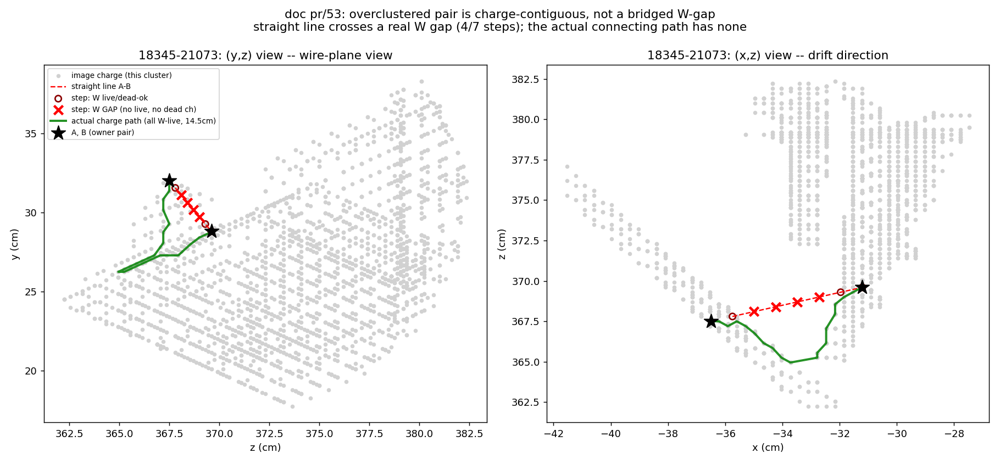
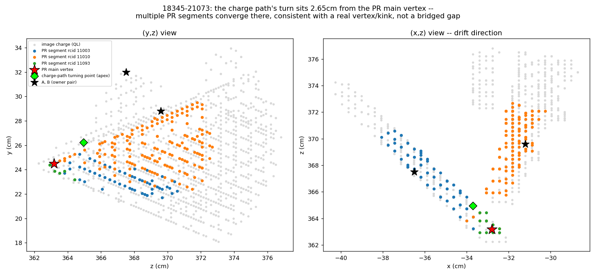

# doc pr/53 — SBND overclustering diagnosis: at least four distinct mechanisms (round 1 found two), none fixed by naive threshold tightening

Status: investigation only. No C++ or jsonnet changed. Fixes are proposed
below as default-OFF knobs for a future session; nothing in this doc is
shipped.

**Round 2 correction (below, §13):** Finding 2's original claim -- that
`clustering_isolated`'s absorb permanently over-clusters the two 18255-71372
pairs and that "no amount of tightening `protect_overclustering` or
`connect_graph_relaxed` touches these two pairs" -- is **wrong**. There is a
designed, already-production unmerge pass (`ClusteringUnmergeBundle:prassoc`,
the `unmerge_assoc` pipeline stage) that undoes exactly this merge, very early
in the PR chain, and it was empirically confirmed to work for this event: see
§13. Read §13 before acting on §4/§6's family-B conclusions.

**Round 3 (§14):** dug into whether 18345-21073 specifically can be separated
by tightening any connectivity threshold. It cannot — the connecting path has
zero missing-charge steps at any resolution or plane, so there is nothing for
a gap-tolerance threshold to reject. The path's sharp ~114° turn sits 2.65 cm
from the PR-reconstructed main vertex with three distinct PR segments
converging there — this looks like a genuine two-prong vertex, not a bridged
gap, and probably should not count as "over-clustering" for this doc's
purposes at all.

**Round 4 (§15):** with family B (round 2) and 21073 (round 3) both retired,
the owner asked whether the remaining two pairs are really "the connectivity
graph," or whether a mechanism was missed. Measured answer: missed. Neither
live pair (422851, 521075) was ever touched by `connect_graph_relaxed` or
`protect_overclustering` at all — the actual creating pass, traced with the
existing `trace_bee` diagnostic on both events, is `ClusteringNeutrino`, a
directional-extrapolation / vertex-consistency test that runs **after**
`protect_overclustering` in the per-face pipeline and shares no code with it.
§4/§6/§9/§11's whole "family A = the connectivity graph" framing, and F1–F3's
proposed fixes, target a pass that never drew either edge. Family B is also
only *partly* retired, not fully as §13 implied: a corrected, tolerance-gated
measurement across the 48-event manifest finds real residual cases, and two of
them are confirmed by the PR log itself to be exactly the reader-side skip
gate the round-4 code audit predicted. §15 has the full census, code citations,
and a revised fix map.

## Repro block

```bash
cd /nfs/data/1/xqian/toolkit-dev/toolkit/sbnd_xin   # symlink into wcp-porting-img/sbnd/sbnd_xin
S=scripts/analysis/pr53/oc53_probe.py
python3 "$S" work-ncpi0-cb0805/ql_evt21073   -36.5  32.0 367.5  -31.2  28.8 369.6  "18345-21073"
python3 "$S" work-nuecc48-cb0805/ql_evt422851 -107.9 -55.1 344.6 -110.4 -61.9 350.0 "18255-422851"
python3 "$S" work-ncpi0-cb0805/ql_evt521075  -88.0 -33.5 456.2  -84.9 -33.3 450.8  "18255-521075"
python3 "$S" work-ncpi0-cb0805/ql_evt71372  -165.2 -129.9 226.4 -155.3 -103.1 229.0 "18255-71372 p1"
python3 "$S" work-ncpi0-cb0805/ql_evt71372  -161.5 -152.1 258.5 -159.8 -144.0 287.9 "18255-71372 p2"

# Round 2: 21073 gap figure
python3 scripts/analysis/pr53/plot_21073_gap.py

# Round 2: does unmerge_assoc undo the family-B merge before the taggers run?
./run_pr_chain_batch.sh work-ncpi0-cb0805 work-oc53-71372 data 71372
grep ClusteringUnmergeBundle:prassoc work-oc53-71372/pr_evt71372/wct_pr_evt71372.log

# Round 3: 21073 vertex-context figure (uses the existing PR output from the
# unrelated earlier Bee-link task, work-bee-0809/pr_evt21073 -- no re-run needed)
python3 scripts/analysis/pr53/plot_21073_vertex_context.py

# Round 4: attribute the creating pass for each pair (needs a -trace-bee QL
# reprocessing first -- imaging/opflash reused from the existing sample dirs,
# M11; fresh work-oc53r4-trace/ tag, M13)
mkdir -p work-oc53r4-trace
ln -sfn $PWD/work-nuecc48-cb0805/evt422851 work-oc53r4-trace/evt422851
ln -sfn $PWD/work-ncpi0-cb0805/evt71372   work-oc53r4-trace/evt71372
ln -sfn $PWD/work-ncpi0-cb0805/evt521075  work-oc53r4-trace/evt521075
ln -sfn $PWD/work-ncpi0-cb0805/evt21073   work-oc53r4-trace/evt21073
SBND_WORK_ROOT=$PWD/work-oc53r4-trace SBND_INPUT_DIR=$PWD/input_files_reco1/extracted-2025fall-48evt-fsprod \
  setarch x86_64 -R ./run_ql_evt.sh data 26 -trace-bee -save-pctree -save-rcid -save-assoc   # 422851
for pair in "12:71372" "13:521075" "17:21073"; do
  idx="${pair%%:*}"
  SBND_WORK_ROOT=$PWD/work-oc53r4-trace SBND_INPUT_DIR=$PWD/input_files_reco1/extracted-ncpi0 \
    setarch x86_64 -R ./run_ql_evt.sh data "$idx" -trace-bee -save-pctree -save-rcid -save-assoc
done
python3 scripts/analysis/pr53/oc53_attrib.py work-oc53r4-trace 71372  -165.2 -129.9 226.4 -155.3 -103.1 229.0 "control p1"
python3 scripts/analysis/pr53/oc53_attrib.py work-oc53r4-trace 71372  -161.5 -152.1 258.5 -159.8 -144.0 287.9 "control p2"
python3 scripts/analysis/pr53/oc53_attrib.py work-oc53r4-trace 21073  -36.5 32.0 367.5 -31.2 28.8 369.6 "control"
python3 scripts/analysis/pr53/oc53_attrib.py work-oc53r4-trace 422851 -107.9 -55.1 344.6 -110.4 -61.9 350.0 "18255-422851"
python3 scripts/analysis/pr53/oc53_attrib.py work-oc53r4-trace 521075 -88.0 -33.5 456.2 -84.9 -33.3 450.8 "18255-521075"

# Round 4: final-product check for 521075 (no bare PR output existed before)
./run_pr_chain_batch.sh work-ncpi0-cb0805 work-oc53r4-pr data 521075

# Round 4: family-B residual census, 48-event nueCC manifest
python3 scripts/analysis/pr53/oc53_familyb_census.py work-nuecc48-cb0805 work-pr51-off48e
grep -a ClusteringUnmergeBundle:prassoc work-pr51-off48e/pr_evt234638/wct_pr_evt234638.log
grep -a ClusteringUnmergeBundle:prassoc work-pr51-off48e/pr_evt90055/wct_pr_evt90055.log
```

Verified against `work-ncpi0-cb0805` / `work-nuecc48-cb0805` (existing QL
products, M11 — no re-imaging done) at toolkit `apply-pointcloud` HEAD
`ba5bbe59`. Full output table: `docs/pr/53_pairs.tsv`. Scripts:
`scripts/analysis/pr53/{oc53_probe.py,plot_21073_gap.py,plot_21073_vertex_context.py}`.
Round-2 PR-chain output: `work-oc53-71372/` (fresh out_root, M13). Round-2 Bee
link: `bee/oc53-71372/oc53-71372.url`. Round-3 PR-level context comes from
`work-bee-0809/pr_evt21073` (produced for an unrelated Bee-link request
earlier in this session, same toolkit HEAD).

Round 4 verified at toolkit HEAD `a46a0b22` (unrelated pr/51 round-4 commit;
nothing pr/53 touches was changed). New QL trace root `work-oc53r4-trace/`
(fresh, M13; imaging/opflash symlinked from `work-nuecc48-cb0805`/
`work-ncpi0-cb0805`, M11). New bare PR output `work-oc53r4-pr/pr_evt521075`
(fresh, M13). Family-B census reuses round-3's validated bare PR arm
`work-pr51-off48e` unmodified. New scripts:
`scripts/analysis/pr53/{oc53_attrib.py,oc53_familyb_census.py}`.

Code cited below:
```bash
cd /nfs/data/1/xqian/toolkit-dev/toolkit
sed -n '349,381p' clus/src/clustering_protect_overclustering.cxx     # Separate_overclustering path test
sed -n '150,303p' clus/src/connect_graph_relaxed.cxx                 # connect_graph_relaxed path test + branches
sed -n '536,616p;696,732p' clus/src/Facade_Grouping.cxx              # is_good_point/test_good_point/get_closest_dead_chs
sed -n '290,340p;584,601p' clus/src/clustering_isolated.cxx          # small->big absorb, save_assoc_id
sed -n '245,330p' cfg/pgrapher/experiment/sbnd/clus.jsonnet          # SBND per-face pipeline order
cfg/pgrapher/experiment/sbnd/dead_regions.jsonnet                    # hand-declared W dead-gap column
```

---

## 1. Symptom (owner hand-scan, 2026-08-09)

Five point pairs across four events, flagged as over-clustering:

| event | A (x,y,z) cm | B (x,y,z) cm | owner note |
|---|---|---|---|
| 18255-422851 | (-107.9, -55.1, 344.6) | (-110.4, -61.9, 350.0) | "getting worse (overclustering), not connected" |
| 18345-21073  | (-36.5, 32.0, 367.5)   | (-31.2, 28.8, 369.6)   | "over clustering" |
| 18255-71372  | (-165.2, -129.9, 226.4)| (-155.3, -103.1, 229.0)| "over clustering gaps" |
| 18255-71372  | (-161.5, -152.1, 258.5)| (-159.8, -144.0, 287.9)| "over clustering gaps" |
| 18255-521075 | (-88.0, -33.5, 456.2)  | (-84.9, -33.3, 450.8)  | "over clustering gaps" |

Owner's framing: the SBND PR chain inherits MicroBooNE's `Protect_Over_Clustering`
graph-recreation pass. It is reasonable, but two of its assumptions do not
transfer: (1) MicroBooNE ran coherent-noise removal, which breaks isochronous
(perpendicular-to-drift) tracks, so its graph was tuned to bridge those breaks
generously; SBND does not run coherent-noise removal, so isochronous breaks
are rare. (2) SBND still has genuine U/V (induction) inefficiency for
prolonged (parallel-to-wire) topologies — but *not* on W (collection) — plus
occasional dead channels and SP mistakes. A pure-connectivity graph is
therefore also wrong; the fix needs to know *why* a gap exists, not just how
wide it is.

## 2. Method

Per pair: confirm both points are same-cluster in current-HEAD QL output
(`img-global`/`clustering-global` `cluster_id`, pctree `real_cluster_id`);
classify which mechanism drew the join via the `perblob` `assoc_cluster_id`/
`assoc_cluster_main` provenance (`ClusteringIsolated::save_assoc_id`,
`clus/src/clustering_isolated.cxx:596`); for graph-family pairs, find the true
closest-approach point pair between the two 1.5 cm-proximity components
containing A and B (not A/B themselves, which sit deep inside their own
component) and replay `Grouping::test_good_point`'s per-1cm-step scoring
exactly, using **that event's own** `ctpc_a<apa>f0p<U|V|W>` and
`dead_winds_a<apa>f0p<U|V|W>` point clouds pulled straight from its pctree
archive (not a generic radius search — see Finding 1 for why that distinction
matters). Full method and caveats are documented in the script's docstring.

## 3. Finding 1 — two mechanisms, not one, separated by `assoc_cluster_main`

| case | A assoc_id/main | B assoc_id/main | mechanism |
|---|---|---|---|
| 18345-21073  | 26/1 | 26/1 | A — connectivity graph |
| 18255-422851 | 59/1 | 59/1 | A — connectivity graph |
| 18255-521075 |  7/1 |  7/1 | A — connectivity graph |
| 18255-71372 p1 | 63/1 | 56/**0** | B — `ClusteringIsolated` |
| 18255-71372 p2 | 63/1 | 51/**0** | B — `ClusteringIsolated` |

All five are genuine over-clustering (same `real_cluster_id` in current-HEAD
output) — none is a false alarm.

## 4. Finding 2 — family B (18255-71372, both pairs): not a graph problem at all

The far endpoint of both 71372 pairs sits in a distinct *associated*
sub-cluster (`assoc_cluster_main = 0`): a 14-point and a 15-point fragment
absorbed into the 5448-point main body by `clustering_isolated`, which runs
**after** `protect_overclustering` in the SBND per-face pipeline
(`cfg/pgrapher/experiment/sbnd/clus.jsonnet:300` vs `:320`). Its small→big
absorb is:

```cpp
double small_big_dis_cut = 80 * units::cm;
...
if (min_dis < small_big_dis_cut) { /* merge, no angle test, no charge test, no path test */ }
```
(`clus/src/clustering_isolated.cxx:297,325`). `iso_cathode_guard` — the one
existing guard on this pass (doc pr/19) — defaults FALSE in SBND production,
so nothing protects it here.

Measured (exact `test_good_point` replay on the true closest-approach pair
between the main body and each fragment):

| pair | true neck | branch | steps | all-3-planes-bad | relaxed-bad (U/V/W) | would the graph reject this? |
|---|---|---|---|---|---|---|
| p1 | 27.33 cm | strong | 28 | 27/28 | 22 (27/18/19) | **yes** |
| p2 | 10.70 cm | prolonged-U | 11 | 7/11 | 5 (1/4/5) | **yes** (`num_bad[W]>=3` veto fires) |

Both bridges would be refused by `connect_graph_relaxed`'s own test — the
graph is not too permissive here, `clustering_isolated`'s absorb bypasses it
entirely at the QL stage. **§13 (round 2) found that this merge does not
survive to the final PR/Bee output: a dedicated unmerge pass reverses it
before any tagger runs.** The claim that no graph fix touches these pairs is
therefore only true of the QL-stage snapshot analyzed below, not of what the
owner would see in a Bee link generated from the full PR chain — read §13
before drawing conclusions from this section.

## 5. Which pass actually drew the join, for family A

The joins are already present at QL output (`img-global`/`real_cluster_id`),
i.e. before the PR-stage `ClusteringProtectBundle` ever runs. So the pass that
first failed to split them is `clustering_protect_overclustering.cxx`'s
`Separate_overclustering` — see Finding 7 below, it is a materially weaker
duplicate of `connect_graph_relaxed`. `protect_bundle`/`relaxed` is the second
net downstream; it was re-run fresh only for 21073 (current-HEAD PR output,
still same-cluster), not for the other three — that re-run is left to the fix
session.

Both `protect_*` passes are **splitters**: neither can create a join. The
upstream merge pass that actually drew each edge (`connect1`, `close`,
`regular`, `extend`, or `isolated` — all run before `protect_overclustering`,
`cfg/pgrapher/experiment/sbnd/clus.jsonnet:268-300`) was not identified in
this session for the three family-A events; that trace is an open item for
the fix session, not assumed here.

Before trusting a "bridged across empty space" story for family A, the direct
`connect_graph_closely` short-range test was replayed on the *actual* blob
pair nearest A and B — not the 1.5 cm proximity-component proxy used for the
family classification above — using each blob's own
`u/v/w_wire_index_min/max` and `slice_index_min/max` scalars and
`overlap_fast(offset=2)` (`clus/src/Facade_Blob.cxx:151-163`):

| case | blobA slice | blobB slice | Δslice | overlap_fast |
|---|---|---|---|---|
| 422851 | 1616–1620 | 1580–1584 | 40 | **False** (U, W miss; only V overlaps) |
| 521075 | 1868–1872 | 1912–1916 | 40 | **False** (U, W miss; only V overlaps) |
| 21073  | 2528–2532 | 2596–2600 | 64 | **False** (U, W miss; only V overlaps) |

Δslice of 40–64 (≫ the ±1/2-slice window `connect_graph_closely` uses for
inter-blob linking) confirms these are genuine long-range bridges, not an
artifact of the 1.5 cm proximity radius merging two already-close blobs. (This
checks only the direct endpoint pair, not every intermediate blob along the
full chain between them — a complete trace is left to the fix session.)

## 6. Finding 3 — family A: the path test has an arithmetic blind spot below ~3 cm

`connect_graph_relaxed.cxx` (and its weaker duplicate,
`clustering_protect_overclustering.cxx:349-381`) samples the candidate bridge
in 1 cm steps and rejects only when

```cpp
double step_dis = 1.0 * units::cm;
int num_steps = dis/step_dis + 1;
...
if (num_bad > 7 || (num_bad > 2 && num_bad >= 0.75 * num_steps)) invalidate();
```

The final step always lands on the far endpoint, which is by construction
good, so `num_bad <= num_steps - 1`. For `dis < 3 cm`, `num_steps = 3`, so
`num_bad <= 2` — **the `num_bad > 2` floor can never fire, regardless of how
empty the gap is.** (The unconditional `< 3*units::cm` MST override at
`connect_graph_relaxed.cxx:534` then re-arms any such pair a second time, past
spanning-tree sparsification, even if some other branch had rejected it.) From
3–9 cm rejection needs nearly every interior step bad; the absolute `>7` term
only starts to matter beyond that.

Measured (exact `test_good_point` replay, true closest-approach pair between
proximity components):

| case | true neck | branch | steps | all-3-planes-bad | relaxed-bad (U/V/W) | rejected? |
|---|---|---|---|---|---|---|
| 422851 | 2.33 cm | strong | 3 | 2/3 | 0 (2/0/0) | no — arithmetically impossible |
| 521075 | 2.84 cm | strong | 3 | 2/3 | 2 (2/0/2) | no — arithmetically impossible |

Cross-check that family B never reaches this graph at all (§4's numbers,
repeated for contrast): both 71372 necks *would* be rejected by this exact
test, yet they are joined — by `clustering_isolated`, downstream.

## 7. Finding 4 — 18345-21073 is a third, distinct class: charge-contiguous

A and B are in the **same** 1.5 cm-proximity component — there is no bridge to
find. A shortest-charge-path search (breadth-first over a 0.99 cm bottleneck
radius) finds a 14.5 cm geodesic connecting them for a 6.54 cm straight-line
separation, detouring through a high-charge corner near (-33, 26.4, 365) cm.
No graph tightening — closer or relaxed — can separate two points that are
already connected by continuous charge; this is an imaging (ghost charge) or
genuine-topology question, not a graph-connectivity one, and needs the
owner's screenshot to classify further. A fresh Bee link for this event
already exists from an unrelated request earlier this session (current-HEAD
`ba5bbe59` reprocessing): `sbnd_xin/bee/bee0809/bee0809.url` (bee index 0 =
21073) — use it as the visual reference instead of generating a new one.

**Why this is "no gap", precisely (round 2 detail, per owner request).** Two
different paths between A and B give two different answers:

- The **straight line A→B** (6.5 cm, 7 one-cm steps) does cross a real gap:
  4 of 7 steps have *neither* live W charge *nor* a W dead channel — a
  genuine hole in the collection plane along the direct line (exact
  `test_good_point` replay).
- The **actual charge path** that puts A and B in the same `real_cluster_id`
  — the geodesic through the 0.99 cm-bottleneck proximity graph, 14.5 cm long,
  detouring through a high-charge corner near (-33, 26.4, 365) cm — has **zero**
  W gaps: all 20 points along it have live W charge. (V is frequently on a
  dead channel there — this event has 33 dead V wires vs 2 U / 43 W — but W
  itself is continuously live along the detour.)

So A and B are not joined by a connectivity test tolerating a hole; they are
joined by real, unbroken charge that simply does not run in a straight line.
The open question is whether that detour is genuine track topology or an
imaging/ghost-charge artifact — a visual call, not a further connectivity
check. See the figure below.



*(y,z) and (x,z) projections of the img-global charge in this cluster near
the pair. Red dashed = straight line A→B, with red X marking the 4 steps that
are a true W gap (open red circles: the 3 steps that are W-ok). Solid green =
the actual 14.5 cm charge-contiguous path connecting A and B, every point
W-live. Generated by `scripts/analysis/pr53/plot_21073_gap.py`; repro command
in the block below.*

## 8. Why the MicroBooNE tuning does not transfer — quantified

SBND's dead-channel inventory, read from event 71372's own
`dead_winds_a{0,1}f0p{U,V,W}` (a per-event list, not a fixed detector
constant — quoted here as a single measured data point):

| | U | V | W |
|---|---|---|---|
| apa0 | 2 | 33 | 43 |
| apa1 | 2 | 3 | 10 |

93 dead wires out of 11276 (1984+1984+1670 wires/apa × 2 apas) = **0.82 %** in
this event. The owner's framing states MicroBooNE ran with roughly an order of
magnitude more dead/masked channels (this session did not pin that figure to a
`prototype_base/` channel-status file — flagged as unverified, but it is the
working assumption behind the existing `>7` / `0.75` tuning and is directionally
consistent with the coherent-noise-removal history). Under that assumption the
free-bad-steps allowance and the length ratio were sized for a regime SBND is
not in.

The hand-declared SBND dead-gap column (`dead_gap_a{0,1}f0pW`, W winds
832–837, all-drift x) sits at **z ≈ 249.75–251.25 cm**
(`cfg/pgrapher/experiment/sbnd/dead_regions.jsonnet`). It declares all three
planes dead across the full vertical column when a step's W projection lands
there. None of the five gaps above is near it — it is not implicated in this
scan — but it is an unconditional connectivity loosener worth naming for the
fix session's constant inventory.

## 9. Constant inventory

| constant | value | where | MicroBooNE rationale | survives in SBND? |
|---|---|---|---|---|
| `step_dis` | 1.0 cm | `connect_graph_relaxed.cxx:161` | sampling granularity | yes, but interacts badly with short necks (§6) |
| `num_bad` floor | `> 2` | `connect_graph_relaxed.cxx:731` | avoid single-step false positives | too permissive under 3 cm — see §6 |
| `num_bad` cap | `> 7` | same | tolerate ~10% dead channels | oversized at SBND's 0.82% (§8) |
| bad-step ratio | `0.75` | same | same | oversized, same reason |
| MST short-link override | `< 3 cm` | `:534` | always trust very-short bridges | compounds the floor blind spot |
| prolonged wire-angle tol (closest-pair branch) | 12.5° all 3 planes | `:253` | generic prolonged test | internally inconsistent with the 7.5° below |
| prolonged wire-angle tol (directional branches) | U/V 12.5°, W 7.5° | `:378-392,469-472` | tighter W test | inconsistent origin, not obviously SBND-motivated |
| prolonged-U/V W-veto | `num_bad[3] >= 3` | `:283,291` | — | correctly plane-aware (owner's rule 2) |
| prolonged-W veto | none (drops W, uses U+V) | `:298-301` | — | **backwards** under owner's rule 2 — see Finding 7 |
| dead-gap column | z 249.75–251.25 cm, all-drift, all-3-planes | `dead_regions.jsonnet` | n/a (SBND-specific hand patch) | correct by construction, unrelated to these 5 pairs |
| small→big absorb distance | 80 cm, no angle/charge/path test | `clustering_isolated.cxx:297` | n/a (MicroBooNE-style tail stage) | directly responsible for family B (§4) |

## 10. Other issues flagged, not fixed here

- `Separate_overclustering` (`clustering_protect_overclustering.cxx:47-49`)
  claims to mirror `connect_graph_relaxed()`. It does not: no
  `test_good_point`, no per-plane `num_bad[]`, no 12.5°/7.5° prolonged
  branches, no `flag_strong_check`. It is strictly more permissive, and it is
  the QL-stage pass that actually ran on all five pairs (§5).
- `num_bad2[]` (per-plane dead-step counts, `connect_graph_relaxed.cxx:191-193`)
  is computed and never read anywhere in the function.

## 11. Proposed fixes (future session — none implemented here)

Every knob below is default-OFF; off-path leaves the compiled config and the
graph byte-identical. Gate: `abtest/events.txt` plus the SBND 48/50-event
member+nusel manifests used in pr/48–pr/51.

**F0 — `relaxed_edge_census` (instrumentation; do this first).** Debug knob on
`connect_graph_relaxed`/`Separate_overclustering` printing, per accepted
inter-component edge: endpoints, distance, branch, `num_steps`,
`num_bad[0..3]`, `num_bad1[0]`, the four angles, component sizes. Same shape
as the existing `[iso-cathode-guard]` marker
(`clustering_isolated.cxx:337`). Turns every proposal below into a measured
detector-wide census instead of a five-event sample, and is what would resolve
21073's classification with certainty.

**F1 — `relaxed_min_interior_steps` (family A, the sub-3-cm blind spot).**
Two variants: (a) make `step_dis` configurable (SBND candidate 0.5 cm) —
simple, but **global**: doubles `num_steps` everywhere, silently rescaling
both the floor and the ratio for the long prolonged bridges SBND legitimately
needs; (b) surgical — enforce a minimum interior sample count (e.g. ≥5)
independent of `dis`, so short necks get resolved without touching long-bridge
behavior. Recommend (b), record (a) as fallback.

**F2 — `relaxed_min_bad` (the floor, not the cap) + `relaxed_bad_ratio`.** The
binding constraint at short distances is the `> 2` **floor**, not the `> 7`
cap — lowering the cap alone changes nothing for a 3-step neck. Measured
`num_bad[0]`: 521075 = 2/3, 422851 = 0/3. A floor of `>= 2` with ratio ~0.5
rejects 521075 and leaves 422851 standing — the physically correct split,
since 422851's neck has V+W live throughout with only U missing, a legitimate
induction hole under the owner's own rule 2. **F1+F2 together do not close
422851** — say so; it may need a different (ghost/topology) route.

**F3 — plane-aware W authority (owner's rule 2) — the strongest finding here.**
W has no prolonged inefficiency, so a step lacking both W charge and a W dead
channel is genuinely empty. Today the W veto (`num_bad[3] >= 3`) fires only in
the prolonged-U/V branches; the prolonged-**W** branch instead computes
`sum_bad = num_bad[2] + num_bad[1]`, dropping the W check entirely, and the
strong-check branch never examines W at all. Two readings — present both per
the escalation rule on prototype/toolkit divergence, do not pick silently:
  - *(recommended)* Backwards for SBND: extend the W veto (knob-gated, default
    off) to the strong-check and prolonged-W branches.
  - *(counter)* For a track prolonged along W, the 3-D point's projection onto
    W is geometrically degenerate, so a W miss there is not informative — a
    legitimate reason the original code drops it. If this reading is chosen,
    scope the veto to the strong-check branch only.
  Fold the 12.5°/7.5° W-angle inconsistency (closest-pair vs directional
  branches) into the same knob.

**F4 — `iso_small_big_path_check` and/or `iso_small_big_dis_cut` (family B).**
The 80 cm angle-less small→big absorb directly causes both 71372 joins. (a)
require the absorb to pass the same good-point path test the graph uses (27/28
and 7/11 bad steps ⇒ both declined) — preferred, matches the owner's "gap
provenance, not distance" framing exactly; (b) simply lower
`small_big_dis_cut` (SBND candidate 10–15 cm) — cheaper, less targeted.
`iso_cathode_guard`'s `cathode_guard_xcut` on this same absorb (doc pr/19) is
the precedent for the knob shape.

**F5 — escalation item, not a proposal.** Reconciling `Separate_overclustering`
with `connect_graph_relaxed` cannot be made knob-off-byte-identical without
full-file duplication (fork-by-duplication convention). Record as an owner
decision; do not fold into F1–F4.

## 12. Open items for the fix session

- ~~Trace which upstream merge pass … actually drew the family-A edges for
  422851, 521075, and 21073~~ — **closed by §15.3**: `ClusteringNeutrino` for
  422851/521075, `ClusteringClose` (i.e. no long-range bridge at all) for
  21073.
- ~~Re-run `protect_bundle`/`relaxed` fresh through the PR chain for 422851 and
  521075~~ — **closed by §15.4**: both remain merged in the final PR output;
  `protect_bundle` does not catch either (it is a splitter operating on one
  cluster's own graph, never a cross-cluster net — §15.4).
- Classify 21073 with F0's census once implemented, since it cannot be
  resolved by a neck/path argument. (§14/§15.3 resolved 21073's specific
  question by a different route — genuine vertex, `ClusteringClose`-joined —
  but F0 itself was never implemented and would still generalize the method.)
- Confirm the ~10% MicroBooNE dead-channel figure against a real
  `prototype_base/` source, or drop the numeric comparison to qualitative.
- **New (§15.3):** a `judge_vertex`/`ClusteringNeutrino`-focused read of the
  422851 and 521075 branches that actually fired — which threshold, is it a
  false positive on a real multi-prong topology (as 21073 turned out to be) —
  before any fix is proposed for this pass.
- **New (§15.5):** F0's census, generalized to also attribute
  `ClusteringNeutrino`/family-B-residual mechanisms, not just
  `connect_graph_relaxed`, if a broader detector-wide sweep is wanted.

---

## 13. Round 2 (2026-08-09) — `unmerge_assoc` already undoes family B; Finding 2's conclusion was premature

The owner asked how `clustering_isolated` relates to the prototype's group
concept: *"since there is no cluster group concept in the toolkit ... we keep
the association inside the cluster, so that we can separate them later. Your
first mechanism indicate that we did not separate them and then run some
other algorithm right?"*

That framing is correct about the design, and it is *not* what happened —
there **is** a separation step, and it is wired into SBND production. The
comment at `cfg/pgrapher/experiment/sbnd/clus.jsonnet:716-733` states the
intent directly:

> Second, INNER un-merge: undo the per-APA isolated GROUPING
> (`clustering_isolated` `save_assoc_id`), which merges a main cluster with
> the small clusters that are near it but NOT connected to it. The prototype
> only groups these (`Clustering_isolated` returns `main -> [(assoc, dis)]`
> and leaves `live_clusters` untouched); **the toolkit physically merges
> them**, so the STM/PR endpoint finder walks into a detached clump across
> empty space (docs 50, 51). ... Order matters: this runs AFTER
> `unmerge_bundle` so the flash grouping is undone first (outer) and the
> isolated grouping second (inner).

This is instantiated as a second `ClusteringUnmergeBundle` (name `assoc`,
reading `assoc_cluster_id`/`assoc_cluster_main` instead of the default
`real_cluster_id`) and is in SBND's default `pipeline_names`, positioned
`['switch_scope', 'unmerge_bundle', 'unmerge_assoc', 'steiner', ...]` —
**second stage of the whole PR chain**, before `steiner`, before every tagger,
before `protect_bundle`. It is gated on `save_assoc=true`, which has been the
SBND default since doc 68 specifically so `unmerge_assoc` is not a silent
no-op (`wct-clus-matching-perevt.jsonnet:153-166`).

**Empirical check.** §4/§6 above were QL-stage-only — the QL zip never runs
`unmerge_assoc` (it only runs once, inside the PR chain). Re-running event
71372 through the full current-HEAD PR chain
(`run_pr_chain_batch.sh work-ncpi0-cb0805 work-oc53-71372 data 71372`, bare =
production) and grepping its log:

```
ClusteringUnmergeBundle:prassoc cluster 19: 1828 blobs -> main 1666 + 24 associated cluster(s) holding 162 (real mode)
```

QL real_cluster_id 19 is exactly the cluster both 71372 pairs came from (§3's
table). In the **final** PR output (`mabc-pr.zip`'s `clustering-global`,
written after every tagger and `protect_bundle` has run):

| point | QL real_cluster_id | final PR `cluster_id` |
|---|---|---|
| p1 A (-165.2,-129.9,226.4) | 19 | 92 |
| p1 B (-155.3,-103.1,229.0) | 19 | **69** |
| p2 A (-161.5,-152.1,258.5) | 19 | 19 |
| p2 B (-159.8,-144.0,287.9) | 19 | **64** |

Both pairs are in **different** clusters by the time the chain finishes — the
same split confirmed as the log line above. A fresh Bee link for this
current-HEAD PR run: `sbnd_xin/bee/oc53-71372/oc53-71372.url`
(`https://www.phy.bnl.gov/twister/bee/set/94ce7def-814b-4fc1-80e1-8d77c55e47c2/event/list/`).

**Revised conclusion.** §4/§6's mechanism (the angle-less 80 cm absorb) is
real and correctly described at the QL stage, but it is not what the owner
would see in a Bee link built from the full PR chain — `unmerge_assoc` already
reverses it, well before any tagger. If 18255-71372 still shows as
over-clustered on the owner's own Bee view, the cause is **not** identified in
this doc and needs fresh investigation: candidates are (a) the owner's scan
predating `save_assoc=true`/`unmerge_assoc` (doc 68), (b) a view built from the
QL `img-global` layer rather than the PR `clustering-global` layer (the raw
QL charge layer never reflects PR-stage splits), or (c) a real bug in how
`unmerge_assoc`'s split interacts with a later stage that was not traced here.
This replaces §4/§6's implicit "nothing here needs the graph fix, needs the
`clustering_isolated` fix instead" with "confirm the symptom survives the
current-HEAD Bee link before spending F4 effort on it."

**F4 status downgraded.** Given the above, F4 (§11) should not be scheduled
ahead of confirming the symptom actually reaches a current-HEAD Bee link.
Family A (F1/F2/F3) and 21073 remain unaffected by this correction — neither
goes through `clustering_isolated`'s `assoc` grouping (both endpoints share
`assoc_cluster_main=1` in every family-A/charge-contiguous case, §3).

**Round-4 correction to the paragraph above:** the 71372 anecdote generalizes
less than this section implied. §15.5 measured, over the 48-event manifest,
that `unmerge_assoc`'s reversal is conditional on `Flags::main_cluster` still
being set when it runs — a real, log-confirmed minority of isolated-merges are
never attempted by the visitor at all and remain merged in final output.
"Family B is retired" should be read as "retired in the case this doc
originally checked, and in most — not all — decidable cases on a 48-event
sample," not as a general result. F4 is re-opened, not closed. See §15.5 for
the measurement and the two confirmed counter-examples.

---

## 14. Round 3 (2026-08-09) — 21073: can the connectivity condition be tightened to separate A/B?

Owner's question: "the blobs are not exactly connected, but close — I think
the graph connecting code judges that they should be connected. Is it
possible to reduce the condition to not connect them? This may not be
possible, since there are many other cases we need to connect."

**Short answer: no, not via any distance/gap-tolerance threshold — because
there is no gap anywhere on the path connecting them for such a threshold to
act on.** A shape-aware (kink/curvature) cut could in principle separate this
specific pair, but it would be a fundamentally different, riskier kind of
mechanism, and the evidence below suggests it targets exactly the physics
case protect_overclustering must *not* touch: a real two-prong vertex.

### 14.1 There is no gap on the connecting path, at any resolution or plane

§7 checked the W plane at the 20 geodesic waypoints. This round redid it at
**0.3 cm** resolution (finer than the 1 cm the toolkit itself uses) across
**all three planes** (the full `is_good_point`/`test_good_point` criterion
`connect_graph_relaxed` and `Separate_overclustering` both use, not just W):

```
42 sample points along the full 14.5cm geodesic (19 hops x ~2.2 samples each):
  any-plane-missing (num_bad1 style): 0/42
  all-3-planes-empty (a true "no charge anywhere" step): 0/42
```

Zero. Every one of `connect_graph_relaxed`'s thresholds (§6, §9's constant
table) is a *tolerance on how many bad steps to forgive*. With zero bad steps
present, there is nothing for `num_bad > 2`, `> 7`, the `0.75` ratio, or any
tighter replacement to reject — **the path this pair is connected by was never
subject to a bridging decision in the first place.** Tightening those
constants (F1/F2/F3, §11) cannot touch this pair; they only affect edges that
cross real holes, and this one does not cross any.

### 14.2 The connecting path is not a straight bridge — it has a sharp turn, and the turn sits on the reconstructed vertex

The geodesic's shape itself is informative: fit local direction (PCA over the
first/last 6 waypoints) on either side of its apex (the point of maximum
deviation from the A-B straight line, near (-33.71, 26.24, 364.95)) — the
incoming and outgoing directions differ by **~114°**, a sharp kink, not a
gentle curve.

Checking the current-HEAD **PR-level** output (`work-bee-0809/pr_evt21073`,
same run cited in §7) for what sits at that apex:

- The reconstructed **main vertex** (`vertices-global`, `q=15000`) is
  **2.65 cm** from the apex — closer to it than to either A (9.4 cm) or B
  (7.9 cm).
- Three distinct PR segments (`shower_track-global` `real_cluster_id` 11003,
  11010, 11093) have points within a few cm of the apex, each occupying a
  visually separate line in the figure below — not one segment with a kink in
  it, but multiple segments converging on a common point.
- A's nearest PR fit point (5.8 cm away, sparse coverage) sits on one of these
  legs; B's nearest fit point (0.5 cm away, dense coverage) sits on a
  different leg.



*(y,z) and (x,z) views. Grey = QL image charge. Blue/orange/green = three
distinct PR `real_cluster_id` segments near the apex. Red star = PR main
vertex (2.65 cm from the apex). Green diamond = the charge-path's turning
point. Black stars = A, B. The (x,z) panel especially shows a clean two-prong
"V" shape meeting at the vertex, with A on one leg and B on the other.
Generated by `scripts/analysis/pr53/plot_21073_vertex_context.py`.*

### 14.3 Interpretation

This is not "clustering bridged a gap it shouldn't have." A and B sit on two
different legs of what PatternRecognition's own vertex finder already
identifies as a common vertex a few cm from the kink. The clustering-level
`Cluster` object correctly contains both legs — that is exactly what a
clustering stage is supposed to do with a genuine multi-prong vertex; *separating*
A from B into different physics objects is the job of vertex/segment finding
downstream (§7's `shower_track-global` data shows it already does this: A and
B are on different `real_cluster_id`s once PR runs), not a job for
`protect_overclustering`.

**Could a shape-aware cut still separate them at the clustering stage?** In
principle — a test on local direction change (e.g., "does the point cloud's
tangent direction reverse by more than N° within a short arc length") could
flag this specific 114° turn. But this is a structurally different tool than
anything in `connect_graph_relaxed`/`Separate_overclustering` today (those
test *whether charge is present*, not *whether the path is straight*), and
the owner's own caveat applies with full force here: nuclear scattering
kinks, decay vertices, and Compton-scattered shower prongs all produce
similar sharp local turns and legitimately belong in one `Cluster` for
PatternRecognition to sort out. A kink-angle veto tuned to catch this apex
would need a very specific angle/arc-length/vertex-proximity combination to
avoid vetoing real vertices elsewhere, and building it correctly requires the
same kind of vertex-awareness NeutrinoVertexFinder already has — which
argues for leaving this class of case to vertex-finding rather than teaching
clustering a new, narrower copy of the same judgment.

**Conclusion for F1–F3 (§11):** none of them should be expected to move
18345-21073, and this pair should probably be pulled out of the "over-clustering"
bucket entirely for the fix-session's acceptance criteria — it looks like
correct clustering behavior on a genuine vertex, not a bug. If the owner's
hand-scan tool is coloring an entire `Cluster` one color regardless of PR
segment, that presentation choice — not the clustering algorithm — is what
makes a correctly-handled vertex look like an error.

## 15. Round 4 (2026-08-09) — the taxonomy was incomplete: a third mechanism (`ClusteringNeutrino`), and family B only partly retired

Owner's question, after rounds 2–3 retired family B (§13) and 21073 (§14): *"if
one of the two mechanisms is no longer an issue, did we miss a mechanism, or is
graph creation the sole issue?"*

**Short answer: a mechanism was missed. Neither surviving live pair goes
through the connectivity graph at all.**

### 15.1 `protect_overclustering` never draws an edge — "family A" named the net, not the creator

`clustering_protect_overclustering.cxx` has no `merge_clusters` call anywhere
in the file; its only structural operation is
`grouping->separate(cluster, b2groupid, true)` (`:540`) — a **splitter**.
`connect_graph_relaxed.cxx` is a graph *builder* (registered via
`make_graphs.cxx`), producing a named `"relaxed"` graph consumed by
`Cluster::connected_blobs(...)`; its edges are blob-to-blob **inside one
cluster**, so its only possible effect on a join is negative — keeping a
cluster whole that would otherwise split. Neither file can create the
cross-cluster edge the owner is looking at. §5 already conceded the creating
pass "was not identified" for family A; §11's F1–F3 nonetheless tune the net
(`connect_graph_relaxed`'s `num_bad` floor/cap/ratio), not the creator.

Confirmed independently: `is_good_point` — the charge-presence path test both
`protect_overclustering` and `connect_graph_relaxed` use — appears in **no
merge pass** in the SBND pipeline. Every actual joiner is pure distance ±
angle (or, for `ClusteringNeutrino`, a directional/vertex heuristic — §15.3).
Ranked by reach:

| pass | file:line | reach | test |
|---|---|---|---|
| `extend_loop` flag=1 (prolong) | `clustering_extend.cxx:101,140` | **150 cm** | Hough-direction extrapolation only |
| `isolated` small→big | `clustering_isolated.cxx:296,325` | **80 cm** | pure distance, no angle |
| `isolated` small→small (remaining) | `clustering_isolated.cxx:392` | **50 cm** | pure distance |
| `extend(flag=4)` | `clustering_extend.cxx:405` | 60→**80 cm** | escape hatch for long partners |
| `parallel_prolong` | `clustering_parallel_prolong.cxx:89` | 35→**80 cm** | isochronous-direction escape |
| `neutrino` | `clustering_neutrino.cxx:397` | **80 cm** | on *extrapolated* Hough clouds — §15.3 |
| `regular` (×2) | `clustering_regular.cxx:91` | 60 cm / 30 cm | distance-scaled angle ladder |
| `connect1` | `clustering_connect.cxx:617,653` | **unbounded** | infinite-*line* PCA distance, not a physical gap; SBND's `iso_max_dis=5cm` caps only the isochronous-relaxed branch |
| `examine_bundles(use_flash_t0=true)` | `clustering_examine_bundles.cxx:162` | **unbounded** | flash-time coincidence only, no geometry (intended — undone by `unmerge_bundle`) |

`close` (≤2 cm) and `separate`'s fragment re-absorb (0.5 cm) are the only
genuinely near-neighbor joiners; `live_dead`/`deghost`/`cathode_connect`/
`cathode_bundle_rescue` all require a structural precondition (shared dead
region, 2-view charge overlap, cathode-plane cross-TPC geometry) beyond plain
distance.

### 15.2 SBND clusters twice; only the first pass has a protection net

The per-face pipeline (`clus.jsonnet:269-323`) ends `... →
protect_overclustering → neutrino → isolated → examine_bundles`. After Q/L
charge-light matching a **second, all-APA pipeline** runs
(`clus.jsonnet:459-529`): `switch_scope, extend(60cm), regular(60cm),
regular(30cm), parallel_prolong(35cm), close, extend_loop(150cm prolong)`, then
SBND-on `cathode_connect` and `cathode_bundle_rescue`, then
`examine_bundles(use_flash_t0=true)` — **with no `protect_overclustering`
anywhere in it.** A join drawn there faces no QL-stage net at all; the only
later net is the PR-stage `protect_bundle`, which (§15.4) is also a splitter
only. Every constant and measurement in §5/§6/§9/§11 is per-face-stage; this
second pipeline was not in scope for any of them.

### 15.3 The actual creator, measured: `ClusteringNeutrino`

Using the existing `trace_bee` diagnostic (doc 51, default OFF, byte-identical
— `cfg/.../sbnd/clus.jsonnet` `trace_sets()`, runner `-trace-bee`), a new
script (`scripts/analysis/pr53/oc53_attrib.py`, reusing `stm_merge_attribution
.py`'s layer-reader/coordinate-matching) walks every clustering step in
pipeline order and reports the first step at which the owner's A/B points
share a cluster.

**Controls first** (both must reproduce the already-established answer before
trusting the tool on the unknowns): 71372 p1/p2 → `ClusteringIsolated`
(matches §4 exactly); 21073 → `ClusteringClose` (a tight, ≤2cm, iterative
near-neighbor chain — consistent with §14's "zero missing-charge steps
anywhere," not a long-range bridge). Both pass.

**The two live pairs:**

| pair | first joined at | stage |
|---|---|---|
| 422851 | `tr13_ClusteringNeutrino` | per-face, **after** `tr12_ClusteringProtectOverclustering` |
| 521075 | `tr13_ClusteringNeutrino` | per-face, **after** `tr12_ClusteringProtectOverclustering` |

Neither pair is ever in the same cluster at `tr12` — the QL-stage net runs one
step before the edge that creates the problem even exists. Repro:

```bash
cd sbnd_xin
python3 scripts/analysis/pr53/oc53_attrib.py work-oc53r4-trace 422851 \
    -107.9 -55.1 344.6 -110.4 -61.9 350.0 "18255-422851"
python3 scripts/analysis/pr53/oc53_attrib.py work-oc53r4-trace 521075 \
    -88.0 -33.5 456.2 -84.9 -33.3 450.8 "18255-521075"
```

`ClusteringNeutrino` (`clus/src/clustering_neutrino.cxx`) is not a
distance/angle bridge and shares essentially no logic with
`connect_graph_relaxed`/`protect_overclustering`: for each candidate pair it
builds an **extrapolated** point cloud from `vhough_transform` at the two
extreme points (`:407-410`, 30 cm radius), then decides the merge from a chain
of closest-point tests between clusters and their extrapolated clouds (`dis`,
`dis1`, `dis2`, `dis3`, thresholds ranging ~0.5–12 cm direct and up to
72–90 cm on the extrapolated-cloud sum, branch-dependent, `:775-970`) gated
through `Cluster::judge_vertex()` (`Facade_Cluster.cxx:2546`) — a
directional-occupancy **asymmetry** test at the candidate junction point (is
charge one-sided from the test point, the signature of a real track end, vs.
even on both sides). It never samples the bridge interior for missing charge
the way `is_good_point` does; it is a vertex-recognition heuristic, and the
pass comment block (`:377-379`, "two short ones, NC pi0 case... one short one
and one big one, CC pi0 case") makes clear it is *designed* to merge
multi-prong vertex topologies — which is exactly the class of thing the owner
is complaining looks wrong in 422851/521075. Whether the two flagged joins are
`judge_vertex` false positives or another `ClusteringNeutrino` branch entirely
is not established this round; the finding here is *which pass*, not yet
*which line inside it*.

### 15.4 Final-product check: both live pairs remain merged in production output

Reusing round-3's method (§13) on all five pairs, from a bare (=production) PR
run's final `clustering-global` layer:

| pair | A final cid | B final cid | status |
|---|---|---|---|
| 422851 | 1 | 1 | **SAME — still over-clustered in final output** |
| 521075 | 18 | 18 | **SAME — still over-clustered in final output** |
| 21073 | 11 | 11 | SAME (§14: correct — genuine vertex) |
| 71372 p1 | 92 | 69 | DIFFERENT (§13: `unmerge_assoc` split it) |
| 71372 p2 | 19 | 64 | DIFFERENT (§13: `unmerge_assoc` split it) |

421851/521075 use round-3's validated `work-pr51-off48e/pr_evt422851` (bare
off-arm) and a fresh bare run `work-oc53r4-pr/pr_evt521075` (no PR output
existed for it before). This also answers §12's open item: `protect_bundle`
(PR-stage) does **not** catch either all-APA-created join — consistent with
15.1's finding that `protect_bundle` is a splitter operating on one cluster's
own intra-cluster blob graph (`ClusteringProtectBundle.cxx:415,468` —
`connected_blobs` + `separate`, no `merge_clusters`, no `take_children`), never
a cross-cluster joiner.

### 15.5 Family B is only *partly* retired, not fully as §13 implied

Code audit: `clustering_isolated` has **one** merge site
(`clustering_isolated.cxx:596-601`) fed by four pair-generation paths
(small→big 80cm, small–small 5cm, small–small 50cm, **big↔big** 3cm); all four
record `assoc_cluster_id`/`assoc_cluster_main`, and `merge_clusters` carries
the pair through every later merge (`ClusteringFuncs.cxx:151-157`, `pcname`
defaults to `"perblob"`). Nothing is permanent by *missing* provenance.

**The permanence is reader-side.** `ClusteringUnmergeBundle.cxx:180` skips any
cluster not flagged `Flags::main_cluster` — and the immediately preceding
`unmerge_bundle` stage clears that flag on every companion it splits off
(`ClusteringUnmergeBundle.cxx:403`). An isolated-merge living inside a
flash-bundle companion, or inside a cluster that was never flash-matched at
all (most cosmics), is **never undone** — its provenance is present, correct,
and unread. Two further skip gates: `require_in_scope` (`:184`) and
`nmain==0 ⇒ unusable` with no fallback in mode `real` (`:234-242,312-319`),
which fires when `switch_scope` strands the group's representative out of
volume.

**Measured, 48-event nueCC manifest** (`work-nuecc48-cb0805` QL pctrees, which
carry the `assoc_*` arrays under SBND's `save_assoc=true` production default,
vs. round-3's validated bare PR arm `work-pr51-off48e`). New script
`scripts/analysis/pr53/oc53_familyb_census.py`: for every QL cluster spanning
>1 distinct `assoc_cluster_id` (an isolated-merge happened), match **every
point** of each pre-merge subgroup — not just its centroid — against the final
PR `clustering-global` layer within 1.5 cm, majority-vote per doc 51's
`ids_at()` idiom; a subgroup needs ≥30% of its points to land within tolerance
or the whole group is marked **ambiguous** and excluded rather than guessed.

This caution mattered in practice: an earlier centroid-only version of this
script falsely flagged a group (event 10550, QL cluster 12) as residual that
the PR log proves `unmerge_assoc` actually *did* process — a small absorbed
fragment's centroid simply landed nearer the large neighboring main cluster
than its own (sparse) split-off remnant. The per-point/tolerance version does
not make that mistake.

```
events scanned:              48
events with >=1 isolated-merge: 48
total isolated-merge groups:  459
  ambiguous (excluded):        379   <- most subgroups' points don't
                                          confidently survive to final output
                                          at 1.5cm; see caveat below
  resolved:                     76
  RESIDUAL:                      4
residual rate (of decided groups): 5.0%

materiality filter (smaller subgroup >= 10 points):
  decided: 9   resolved: 7   RESIDUAL: 2   -> 22.2%
```

**The two material RESIDUAL cases are confirmed by the PR log itself to be
exactly the predicted skip-gate mechanism**, not an artifact of the matching
method: neither QL cluster 14 (evt 234638) nor QL cluster 13 (evt 90055)
appears **at all** in `ClusteringUnmergeBundle:prassoc`'s own per-cluster log
lines for that event — `unmerge_assoc` never attempted them, exactly as
predicted by the `Flags::main_cluster` gate in §15.5's code audit.

```
$ grep -a ClusteringUnmergeBundle:prassoc work-pr51-off48e/pr_evt234638/wct_pr_evt234638.log
... cluster 3: ...   cluster 6: ...   cluster 7: ...   cluster 8: ...   cluster 10: ...   cluster 11: ...
(cluster 14 never appears)
```

**Caveat, stated plainly:** 379/459 (83%) of raw groups are undecidable by
this coordinate-matching method — most small absorbed fragments' points do not
land within 1.5 cm of *any* final-output cluster, most plausibly because
downstream fitting/Steiner/pruning stages relocate or drop them rather than
carry them forward verbatim. That is a real limitation of this measurement,
not evidence those cases are "resolved" — the 5.0%/22.2% rates are lower
bounds on the true residual rate among decidable cases, not a full-population
estimate. §13's flat "family B is retired" is corrected to: *retired only
where the absorbing/absorbed cluster still carries `Flags::main_cluster` when
`unmerge_assoc` runs; a measurable, log-confirmed minority of cases are not.*

### 15.6 Revised fix map

| mechanism | pass | §11 knob that addresses it | status |
|---|---|---|---|
| sub-3cm arithmetic blind spot | `connect_graph_relaxed` (family A per §6, not the 422851/521075 pairs) | F1 | still applicable to whatever pass F0's census eventually attributes a real short-neck bridge to |
| floor vs cap | `connect_graph_relaxed` | F2 | same caveat as F1 |
| W-plane authority | `connect_graph_relaxed`/`Separate_overclustering` | F3 | same caveat as F1 |
| `clustering_isolated` absorb, reader-side skip | `ClusteringIsolated` / `ClusteringUnmergeBundle` | F4 | **re-open** — §15.5 shows real, log-confirmed residual cases; not superseded by §13 after all, though the rate among decided cases (5-22%) is smaller than family A's apparent share |
| **`ClusteringNeutrino` vertex/extrapolation merge (422851, 521075)** | `clustering_neutrino.cxx` | **none — F1-F3 do not touch this pass, and none was proposed** | **new open item** |

F1–F3 were written against the wrong creator for the two events they were
meant to explain. They may still be correct fixes for whatever family-A-shaped
pairs F0's planned census eventually attributes to `connect_graph_relaxed`
itself, but 422851 and 521075 are not evidence for them and should not be used
to validate them. The next investigation session's first job is a `judge_vertex`
/ `ClusteringNeutrino`-focused read of the two flagged pairs (which branch,
which threshold, is it a false positive on a real 3-prong topology like
21073's) before any fix is designed for this pass — mirroring pr/51's
`H1`/`H2` discipline of measuring the creator before writing a fix.

## Verification

No production behavior change any round: no C++ or jsonnet was changed.
Round 1's numbers come from read-only analysis of existing QL products
(`work-ncpi0-cb0805`, `work-nuecc48-cb0805`) plus a stand-alone Python replay
of the toolkit's own path-test arithmetic. Round 2 additionally ran the
production PR chain once, unmodified (`run_pr_chain_batch.sh ... data 71372`,
bare = production, freshness-proofed against HEAD `ba5bbe59` per M1 in the
earlier Bee-link task this session), to check a claim empirically rather than
by code-reading alone.

Round 4 used only already-shipped, default-OFF diagnostics (`trace_bee`, doc
51) and bare (no-TLA-override) PR runs, both read-only with respect to
production behavior: four fresh `-trace-bee -save-pctree -save-rcid
-save-assoc` QL reprocessings into `work-oc53r4-trace/` (imaging/opflash
symlinked from the existing `work-nuecc48-cb0805`/`work-ncpi0-cb0805` outputs,
M11 — no re-imaging), one fresh bare PR run into `work-oc53r4-pr/` for 521075,
and two new read-only analysis scripts
(`scripts/analysis/pr53/oc53_attrib.py`, `oc53_familyb_census.py`). Toolkit
HEAD `a46a0b22` throughout (unrelated pr/51 round-4 commit; nothing pr/53
touches was changed by it). Both attribution-tool controls (71372, 21073)
reproduced the already-established §4/§14 answers before being trusted on the
unknowns (§15.3); the family-B residual measurement's two positive cases were
independently cross-checked against the PR log (§15.5).

Re-run the Repro block to reproduce every number in this doc, including all
four rounds, from a clean shell.
