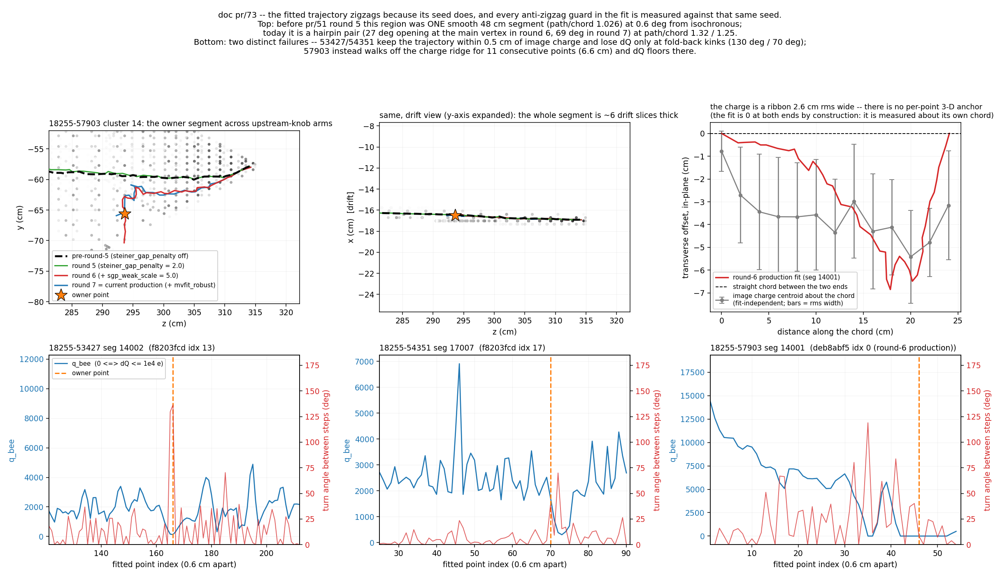

# doc pr/73 — why the fitted trajectory zigzags, and the low dQ/dx that follows

**Scope.** §§1-8 are the original **diagnosis** round: §§1-4.8 are read off Bee
archives that already existed on disk, and §4.9 adds one **default-OFF,
log-only** knob, `sgp_edge_probe`, used for six diagnostic runs (gates in §8).
**§9 is round 2**, which implements §6's recommended fix **F3a** as a second
default-OFF knob, `sgp_max_sep`. Round 2 changes no production behaviour
either: the knob ships **OFF and is not flipped**, because the validation
returned a negative result — see §9. The owner scoped round 2 to the **ISO case
(18255-57903) only**; 53427/54351 (F2/F5) were not touched.

## 0. Repro

```bash
cd /nfs/data/1/xqian/toolkit-dev/wcp-porting-img/sbnd/sbnd_xin

# the three owner cases: step size, the ribbon, the arm sweep, per-point dQ
python3 scripts/analysis/pr73/zigzag_anatomy.py --png docs/pr/73_evt57903_zigzag.png
#   -> docs/pr/73_anatomy_output.txt  (committed verbatim)

# the population
python3 scripts/analysis/pr73/zigzag_census.py work-pr51r7-on50 \
        --tsv docs/pr/73_zigzag_census_r7on50.tsv
#   -> docs/pr/73_census_output.txt   (committed verbatim)

# sec 4.9 -- the per-edge sentinel.  Two diagnostic runs of 18255-57903 with
# the default-OFF, log-only knob sgp_edge_probe on, at the two qref values
# that bracket the outcome.  Both are hash-identical to their no-probe arms.
SBND_SGP_WEAK_SCALE=5 SBND_SGP_WEAK_QREF=6000 SBND_SGP_EDGE_PROBE=true PR_JOBS=2 \
    ./run_pr_chain_batch.sh work-mcp1k-cb0805 work-pr73-probe-q6000 data 57903
SBND_SGP_WEAK_SCALE=5 SBND_SGP_WEAK_QREF=4000 SBND_SGP_EDGE_PROBE=true PR_JOBS=2 \
    ./run_pr_chain_batch.sh work-mcp1k-cb0805 work-pr73-probe-q4000 data 57903

python3 scripts/analysis/pr73/sgp_edge_map.py \
        work-pr73-probe-q6000/pr_evt57903/wct_pr_evt57903.log \
        --tsv docs/pr/73_sgp_edges_57903_q6000.tsv \
        --routes work-pr73-probe-q4000 work-pr73-probe-q6000
#   -> docs/pr/73_sgp_edge_map_output.txt  (committed verbatim)

# sec 4.10 -- the PATH-level sentinel (same knob).  Four runs: 57903 at both
# qref values, plus the two events round 6 was built to fix, at production
# settings.  All four are hash-identical to their no-probe arms.
SBND_SGP_WEAK_SCALE=5 SBND_SGP_WEAK_QREF=6000 SBND_SGP_EDGE_PROBE=true PR_JOBS=2 \
    ./run_pr_chain_batch.sh work-mcp1k-cb0805   work-pr73-path-q6000  data 57903
SBND_SGP_WEAK_SCALE=5 SBND_SGP_WEAK_QREF=4000 SBND_SGP_EDGE_PROBE=true PR_JOBS=2 \
    ./run_pr_chain_batch.sh work-mcp1k-cb0805   work-pr73-path-q4000  data 57903
SBND_SGP_WEAK_SCALE=5 SBND_SGP_WEAK_QREF=6000 SBND_SGP_EDGE_PROBE=true PR_JOBS=2 \
    ./run_pr_chain_batch.sh work-nuecc48-cb0805 work-pr73-path-131357 data 131357
SBND_SGP_WEAK_SCALE=5 SBND_SGP_WEAK_QREF=6000 SBND_SGP_EDGE_PROBE=true PR_JOBS=2 \
    ./run_pr_chain_batch.sh work-ncpi0-cb0805   work-pr73-path-506746 data 506746

python3 scripts/analysis/pr73/sgp_path_map.py \
        work-pr73-path-q4000/pr_evt57903/wct_pr_evt57903.log \
        work-pr73-path-q6000/pr_evt57903/wct_pr_evt57903.log
#   -> docs/pr/73_sgp_path_map_output.txt   (committed verbatim)
python3 scripts/analysis/pr73/sgp_fix_design.py
#   -> docs/pr/73_sgp_fix_design_output.txt (committed verbatim)

# sec 4.11 -- seed vs fit on the owner's other two points.  The probe now also
# dumps the CHOSEN route unconditionally ("sgp path sel:"), which is what makes
# the seed available on calls where the two flavors agree.
SBND_SGP_EDGE_PROBE=true PR_JOBS=2 \
    ./run_pr_chain_batch.sh work-mcp1k-cb0805 work-pr73-seed-53427 data 53427
SBND_SGP_EDGE_PROBE=true PR_JOBS=2 \
    ./run_pr_chain_batch.sh work-mcp1k-cb0805 work-pr73-seed-54351 data 54351
python3 scripts/analysis/pr73/seed_vs_fit.py work-pr73-seed-53427 53427 -24.6 -17.1 446.1
python3 scripts/analysis/pr73/seed_vs_fit.py work-pr73-seed-54351 54351 -150.3 82.4 196.2
#   -> docs/pr/73_seed_vs_fit_output.txt  (committed verbatim)

# ---- sec 9 (round 2): F3a, the sgp_max_sep excursion guard --------------
# A. the census.  No new C++: the SHIPPED sgp_edge_probe already routes the
#    base flavor and logs the very quantity F3a thresholds, so the footprint
#    is sized at zero behavioural risk BEFORE the guard exists.
SBND_SGP_EDGE_PROBE=true PR_JOBS=32 ./run_pr_chain_batch.sh work-nuecc48-cb0805 work-pr73f3a-audit48 data
SBND_SGP_EDGE_PROBE=true PR_JOBS=32 ./run_pr_chain_batch.sh work-ncpi0-cb0805   work-pr73f3a-audit19 data
SBND_SGP_EDGE_PROBE=true PR_JOBS=32 ./run_pr_chain_batch.sh work-mcp1k-cb0805   work-pr73f3a-audit50 data \
        $(awk 'NR>1{print $2}' docs/pr/mcp1k-50-cb0805.index.txt)
python3 scripts/analysis/pr73/sgp_maxsep_census.py \
        work-pr73f3a-audit48 work-pr73f3a-audit19 work-pr73f3a-audit50 \
        --tsv docs/pr/73_f3a_maxsep_census.tsv
python3 scripts/analysis/pr73/sgp_maxsep_census.py work-pr73f3a-audit48 --evt 131357
python3 scripts/analysis/pr73/sgp_maxsep_census.py work-pr73f3a-audit19 --evt 506746
python3 scripts/analysis/pr73/sgp_maxsep_census.py work-pr73f3a-audit50 --evt 57903

# B. the off / on arms (knob shipped; -1 = off, 3 = the doc's operating point)
for a in "off:-1" "on:3"; do n=${a%%:*}; v=${a#*:}
  SBND_SGP_MAX_SEP=$v PR_JOBS=32 ./run_pr_chain_batch.sh work-nuecc48-cb0805 work-pr73f3a-${n}48 data
  SBND_SGP_MAX_SEP=$v PR_JOBS=32 ./run_pr_chain_batch.sh work-ncpi0-cb0805   work-pr73f3a-${n}19 data
  SBND_SGP_MAX_SEP=$v PR_JOBS=32 ./run_pr_chain_batch.sh work-mcp1k-cb0805   work-pr73f3a-${n}50 data \
        $(awk 'NR>1{print $2}' docs/pr/mcp1k-50-cb0805.index.txt); done

# C. the verdicts
python3 scripts/analysis/pr73/f3a_57903_check.py work-pr67f-off50 work-pr74r4-flip50 work-pr73f3a-on50
python3 scripts/analysis/pr73/f3a_cost.py work-pr73f3a-off48 work-pr73f3a-on48 \
        work-pr73f3a-off19 work-pr73f3a-on19 work-pr73f3a-off50 work-pr73f3a-on50
python3 scripts/analysis/pr51/nuvtx_census.py work-pr73f3a-off50 work-pr73f3a-on50 --vtx-cm 10 --enu-mev 100
python3 scripts/analysis/pr74/pr74_pf_roots.py work-pr73f3a-off19 work-pr73f3a-on19
```

All six scripts are read-only — they open each arm's `pr_evt*/mabc-pr.zip` (or
its `wct_pr_evt*.log`) and run nothing. The `run_pr_chain_batch.sh` lines are
the only things that execute, and they write to fresh `work-pr73-{probe,path}-*` arms
(M13: no existing label is touched).

## 1. The three cases

| event | Bee | owner point (x, y, z) cm | arm holding that Bee content |
|---|---|---|---|
| 18255-53427 | `f8203fcd` / `event/13` | (−24.6, −17.1, 446.1) | `work-pr64r4-on1k` |
| 18255-54351 | `f8203fcd` / `event/17` | (−150.3, 82.4, 196.2) | `work-pr64r4-on1k` |
| 18255-57903 | `deb8abf5` / `event/0` | (−16.5, −65.6, 293.6) | `work-pr51r6-flip50` (round-6 production) |

Bee index ↔ event confirmed against `docs/pr/mcp1k50-prod0811.index.txt`
(`13 → 53427`, `17 → 54351`), following doc pr/67 §1 — the owner's links are
right. `deb8abf5` is the *before* set of doc pr/51 round 7, i.e. round-6
production; current production is round 7, arm `work-pr51r7-on50`, and both are
measured below.

The owner's reading of 57903 — "clearly isochronous, the easy answer is a
straight line between the two ends, but the fit zigzags and the fitted dQ/dx is
low in places" — is the case this doc is built around. 53427 and 54351 turn out
to be a **different** failure and are separated out in §4.4.

## 2. Answer in one line

**The fit does not create the zigzag — it fails to remove it.** `fit_point`
solves each trajectory point independently with no smoothness term and no ridge,
so along any poorly-constrained direction the answer is whatever the *seed* said;
and every anti-zigzag guard downstream measures the fitted point against that
same seed, so a zigzagging seed shields itself. On 57903 the seed changed under
pr/51 **round 6** and the smooth answer that survived round 5 intact was lost
(§4.3; round 5 moved no point by more than 1 cm, §4.8 says why).

**But that sentence is exact only for 57903.** §4.7 splits `path/chord` into a
smooth large-amplitude excursion (a **bow**) and a small-amplitude sawtooth
(**jitter**). 57903 is bow-dominated (1.225 of its 1.347); 53427 and 54351 are
almost pure jitter (1.040 of 1.055, 1.037 of 1.042). §4.11 shows that on those
two the fit **halves** the jitter it is handed (0.174 → 0.085 cm rms locally) —
there the fit is the mitigation, not the cause, and what it is handed is a
**lattice staircase**: steiner points exist only on the U×V wire-intersection
grid crossed with the time slice (quanta 0.0866 / 0.15 / 0.312 cm), so any
shortest path between two of them zigzags at that scale. Because
`multi_trajectory_fit` **pins both segment endpoints to `vertex->fit().point` and
never fits them** (`:4246-4259`), a vertex sitting off the charge ridge *forces*
a bow — no amount of interior smoothing can remove it. That is why the fix
ranking in §6 puts the seed/vertex fix ahead of trajectory smoothing.

## 3. The chain, with the code

Stage by stage, `clus/src/TrackFitting.cxx` unless stated:

1. **Imaging.** A near-isochronous stretch lands in a handful of drift slices, so
   its blobs are wide ribbons in y–z rather than points (§4.2).
2. **Seed.** `organize_segments_path` (`:8234`) turns the Steiner/shortest path
   into the trajectory seed; `organize_segments_path_3rd` (`:8571`) re-spaces it.
   Note `:8570` reassigns `low_dis_limit = 0.6*units::cm` first, so the final
   polyline — the one Bee writes and the one whose `local_dx` feeds the dQ/dx
   fit — is uniformly spaced at **0.600 cm** (§4.1).
3. **Position fit.** `fit_point` (`:3697-3942`) builds, per associated 2-D cell,
   a wire row and a time row weighted by `s_k = (Q/σ_Q) · div · quality · ghost`,
   and solves
   `A = RUᵀRU + RVᵀRV + RWᵀRW`, `b = RUᵀd_u + RVᵀd_v + RWᵀd_w`
   as an independent **3×3** system via `BiCGSTAB::solveWithGuess(b, seed)`
   (`:3926`). There is **no term coupling neighbouring points** anywhere in this
   function, and no damping. Where a plane degenerates, the code does not detect
   it geometrically: `examine_point_association` (`:2862-3334`) computes a
   statistical `PlaneData::quantity`, and where that is 0 it substitutes a
   synthetic cell **at the seed point's own projection** and drops the weight to
   `scaling_ratio = 0.05` (`:3778-3784`). The comment at `:4498-4501` states the
   consequence outright: such a point "has no 2D associations, so the solve keeps
   (regularizes around) the seed."
4. **Guards — all measured against the seed.** In
   `examine_segment_trajectory` (`:5004-5188`):
   * `temp_fine_tracking_path` is filled from `init_ps_vec`, i.e. the **pre-fit
     seed** (`:5070`);
   * the triangle-area smoothing replaces the fitted point (`:5175`,
     `fine_tracking_path[i] = temp_fine_tracking_path[i]`) only when
     `area1 > area_ratio1 * c && area1 > area_ratio2 * area2` (`:5112`, `:5140`,
     `:5168`, for the three neighbour triples), where `area1` is the sagitta of
     the *fitted* point and `area2` the sagitta of the *seed* point (SBND
     `area_ratio1 = 1.8 mm`, `area_ratio2 = 1.7`). **A seed that already zigzags
     makes `area2` large and the test never fires** — the seed shields the fit,
     and the replacement is the seed point anyway;
   * `skip_trajectory_point`'s charge veto (`:5189-5520`) reverts `p = ps_point`,
     i.e. *to the seed*;
   * the dead-plane angle veto (`:5501`) needs ≥2 planes at `quantity == 0`,
     which does not happen on any of these three events — all three planes carry
     charge.
5. **dQ/dx.** `dQ_dx_multi_fit` (`:6119-7292`) solves for dQ per point, then
   divides by `local_dx` = the half-sum of the two adjacent chords (`:6446-6463`)
   — so a zigzag inflates the denominator directly. The only `lambda`-weighted
   regulariser in the whole chain (`FᵀF`, `:7129-7177`) smooths **dQ/dx**, using
   that already-inflated `dx`; it does not regularise geometry.

## 4. Evidence



### 4.1 What is being measured

Step length on the three owner segments: min 0.599 / median 0.600 cm on all
three. 53427 seg 14002 has a max of 3.000 cm — the polyline is uniform 0.6 cm
**except across gaps**, so `path/chord` on that long segment carries a little
gap-bridging as well as zigzag. `path/chord` is otherwise a direct zigzag
measure.

`q` in the Bee `track_fit-global` layer is
`fit.dQ * dQdx_scale + dQdx_offset`, clipped at 0
(`MultiAlgBlobClustering.cxx:955-957`), and SBND uses `0.1 / −1000`
(`cfg/pgrapher/experiment/sbnd/clus.jsonnet:1768`). So
`dQ[e] = (q_bee + 1000)/0.1`, and **`q_bee == 0` means `dQ ≤ 10⁴ e` over that
0.6 cm step** — a real dQ/dx deficit, not the absence of charge. All statements
below are phrased that way.

### 4.2 18255-57903: the image is a ribbon, and the segment is one drift slice thick

Segment 14001's charge occupies **6 distinct drift slices** over a 24.10 cm
chord (slice pitch 0.3120 cm) — **4.0 cm of track per slice**. For comparison,
segment 14006 in the same cluster (26.4° out of the drift-⊥ plane, `path/chord`
1.029) occupies 62 slices, 0.54 cm of track per slice.

Selecting image points **fit-independently**, by an 8 cm cylinder about the
segment's own chord: 226 points, **drift-direction rms 0.33 cm** (one slice)
versus **in-plane transverse rms 2.60 cm**. The charge is a ribbon roughly 5 cm
wide lying in a constant-drift plane. There is no per-point 3-D anchor for
`fit_point` to hold onto.

**A caveat that must not be dropped.** Charge within 3 cm of the *zigzagging fit*
is 2 671 084 e (36.6 % of the in-band cluster charge); within 3 cm of the
*straight chord between the current two ends* it is 1 687 880 e (23.1 %). The
straight chord captures **less**, because the endpoints themselves are displaced
from the charge ridge (the ridge sits 3–5 cm off the chord along its whole
length, top-right panel). So "a straight line connecting the two ends" is not
literally the better answer for this event as currently segmented; the target is
a **smooth line through the charge ridge**, which is a stronger requirement than
straightness and is what §5 is written against.

### 4.3 The discriminator: the zigzag tracks the seed, not the fit

Same event, same fitting code, different **upstream** knobs:

| arm | what changed upstream | seg | n | chord | path | path/chord | max in-plane |
|---|---|---|---:|---:|---:|---:|---:|
| `work-pr67f-off50` | pre-round-5 (`steiner_gap_penalty` off) | 14003 | 83 | 48.13 | 49.38 | **1.026** | 2.15 |
| `work-pr51r5-flip50` | round 5 (`steiner_gap_penalty = 2.0`) | 14003 | 108 | 60.80 | 63.92 | 1.051 | 4.17 |
| `work-pr51r6-flip50` | round 6 (+ `sgp_weak_scale = 5.0`) | 14001 | 55 | 24.10 | 32.46 | **1.347** | 6.85 |
| `work-pr51r7-on50` | round 7 = current production (+ `mvfit_robust`) | 14001 | 52 | 23.36 | 30.78 | 1.318 | 3.93 |

and the vertex the segment ends on:

| arm | main vertex (x, y, z) cm | opening angle of the two legs at it | cluster-14 charge within 1.5 / 3.0 cm of any fit point |
|---|---|---:|---|
| `work-pr67f-off50` | (−16.40, −58.05, 265.90) | 154.9° (near-collinear) | 44.3 % / 57.7 % |
| `work-pr51r5-flip50` | (−20.30, −52.70, 253.54) | 176.5° (collinear) | 44.3 % / 57.5 % |
| `work-pr51r6-flip50` | (−16.50, −70.36, 293.54) | **27.2° (hairpin)** | 44.2 % / 58.5 % |
| `work-pr51r7-on50` | (−16.52, −65.92, 292.26) | 69.3° | 44.9 % / 57.5 % |

**The per-segment `path/chord` in that first table is not like-for-like** — the
arms cut the same corridor into segments at different places, so a segment can
inflate purely by absorbing a curved piece from its neighbour. Fixing the window
to the pre-round-5 segment's own z extent, [265.90, 314.03] cm, and re-measuring
every arm's polyline inside it:

| arm | npts | chord | path | `path/chord` | bow | jitter rms |
|---|---:|---:|---:|---:|---:|---:|
| `work-pr67f-off50` (pre-R5) | 83 | 48.13 | 49.38 | **1.026** | 1.90 | 0.081 |
| `work-pr51r5-flip50` (R5) | 83 | 47.57 | 49.20 | **1.034** | 1.93 | 0.082 |
| `work-pr51r6-flip50` (R6) | 54 | 23.52 | 31.86 | **1.355** | 5.91 | 0.259 |
| `work-pr51r6-flip50` (R6) | 64 | 31.33 | 37.80 | **1.206** | 5.18 | 0.303 |
| `work-pr51r7-on50` (R7) | 51 | 22.76 | 30.18 | 1.326 | 2.52 | 0.342 |
| `work-pr51r7-on50` (R7) | 60 | 28.28 | 35.40 | 1.252 | 2.94 | 0.273 |

and the pointwise divergence of the whole cluster-14 fit:

| comparison | max deviation | points moved > 1 cm |
|---|---:|---|
| pre-R5 → R5 | **0.69 cm** | **0 of 176** |
| R5 → R6 | 11.02 cm | 70 of 176 |
| pre-R5 → R6 | 10.91 cm | 72 of 176 |

Read together:

* **Round 5 is not the culprit.** It leaves the corridor alone — 0.69 cm max
  deviation, *zero* points moved by more than 1 cm — and like-for-like it costs
  1.026 → 1.034 with the bow and jitter unchanged (1.90 → 1.93 cm, 0.081 →
  0.082 cm rms). The 1.026 → 1.051 in the per-segment table is a **segmentation
  artifact**: round 5 slid the main vertex 15 cm *along* that unchanged corridor,
  so segment 14003 grew 48.13 → 60.80 cm by swallowing a curved piece that had
  belonged to 14004.
* **Round 6 is the whole regression** — see §4.8 for the mechanism.
* Before pr/51 round 5, this region was **one smooth 48 cm segment at 0.6° from
  isochronous with `path/chord` 1.026** — *more* isochronous than today's
  and smooth. **Isochronicity alone therefore does not predict the zigzag.**
  The seed does.
* Round 6 moved the main vertex 43.9 cm from where round 5 left it (30.2 cm from
  its pre-round-5 position) and converted a near-collinear vertex into a 27°
  hairpin; both resulting legs zigzag (1.36 and 1.21). Round 7 opened the hairpin to 69° and
  reduced the excursion 6.85 → 3.93 cm — but those two residuals are measured
  about different chords (24.10 vs 23.36 cm), so read that as "smaller", not as
  a factor. The like-for-like number is the bow amplitude in §4.7: 5.94 → 2.52 cm.
* **Charge coverage is flat across all four arms** (44.2–44.9 % within 1.5 cm).

The whole-cluster coverage number includes segment 14006, which no knob moves,
so it dilutes a local change. Restricting to the **changed region only** —
cluster-14 image points with z in [249.64, 314.23] cm, the union z-range of
round-6 segments 14001 and 14007, an identical 963-point / 1.043 × 10⁷ e sample
in every arm:

| arm | charge within 1.5 cm of any fit point | within 3.0 cm |
|---|---:|---:|
| `work-pr67f-off50` | 30.3 % | 47.0 % |
| `work-pr51r5-flip50` | 30.2 % | 46.8 % |
| `work-pr51r6-flip50` | 30.1 % | 48.0 % |
| `work-pr51r7-on50` | 31.0 % | 46.8 % |

Flat there too. Whatever the topology change bought elsewhere, on this event it
bought no coverage — locally or globally — and cost trajectory smoothness.

**This is a regression signal on shipped, owner-flipped SBND production knobs**
(specifically `sgp_weak_scale`, doc pr/51 round 6 — **not** round 5, §4.3/§4.8), stated here
rather than buried. It is *not* a claim that those rounds were wrong: they were
validated on other events and their gates were clean. It is a claim that this
event was collateral and that nobody looked at trajectory smoothness as a
criterion at the time. Per CLAUDE.md §5.7 this is reported, not tuned.

### 4.4 18255-53427 and 18255-54351 are a *different* failure

At both owner points the fitted trajectory is **on** the charge — nearest image
point 0.08–0.67 cm, with ~10⁵ e within 1.5 cm at every step — yet dQ collapses
about 3× and recovers:

| event | seg | dQ before → at the dip → after (e) | turn angle at the dip | nearest image point there |
|---|---|---|---:|---|
| 53427 | 14002 | 33 714 → **11 277** → 33 731 | **130° and 136°** (i = 165, 166) | 0.10 / 0.47 cm |
| 54351 | 17007 | 33 841 → **13 002** → 33 574 | **39° and 70°** (i = 70, 72) | 0.36 / 0.67 cm |

The dQ minima coincide **point for point** with fold-back kinks in the
trajectory. Geometrically these are small — sub-centimetre excursions on a 0.6 cm
step — so the `local_dx` inflation (local `path/chord` 1.108 and 1.038) cannot
account for a 3× drop on its own. The dQ *assignment* is what fails.

57903 is not like this. There the trajectory walks **off** the ridge: `q_bee`
is 0 for eleven consecutive points (i = 42…52, 6.6 cm), the nearest image point
reaches 1.19 cm, and the charge within 1.5 cm falls from 50–95 k e to 19–38 k e.

So the owner's three points are two distinct defects: **57903 = geometry**
(the trajectory leaves the charge), **53427 / 54351 = dQ assignment** (the
trajectory stays on the charge and the charge is not assigned to it). The named
suspect for the second is the compact-matrix overlap down-weighting in the dQ/dx
fit — `calculate_compact_matrix_multi` (`:5729`) and the `MU/MV/MW` diagonals it
rewrites (`:7105-7107`) — which fires exactly when consecutive 3-D points share
2-D pixels, i.e. at a fold-back. **That is a hypothesis with a probe (F5), not a
conclusion**: nothing here measures the matrix.

### 4.5 The population (50-event manifest, `work-pr51r7-on50`)

124 segments with ≥10 points and ≥5 cm chord:

| bin | n | median `path/chord` | p90 | median fold-back fraction (turn > 30°) | median `q_bee == 0` fraction |
|---|---:|---:|---:|---:|---:|
| iso < 10° | 22 | 1.070 | 1.242 | 24.8 % | 0.0 % |
| iso ≥ 10° | 102 | 1.031 | 1.111 | 9.1 % | 0.0 % |

Two bins deliberately: a finer binning produced cells of n = 4 that cannot
support a trend. Fold-back kinks are **endemic** — 9–25 % of all fitted points
turn by more than 30° between consecutive 0.6 cm steps — not an exceptional
condition of these three events.

**Negative result, stated because it constrains the fix.** Spearman rank
correlation of the `q_bee == 0` fraction against fold fraction / `path/chord` /
isochronicity is only **+0.14 / +0.26 / +0.17**, and the median is 0 % in both
bins. The zigzag ↔ dQ-hole link is solid in the named events but is **not** a
population-level effect. Anyone selling a fix on "it will fix the dQ/dx" needs
per-event evidence, not the census.

For orientation, fold fraction and `path/chord` are near-redundant (Spearman
+0.87); isochronicity against `path/chord` is +0.44.

**A second limitation of this census, from §4.7.** `path/chord` sums a bow and a
sawtooth, and the fold-back fraction sees only the sawtooth — a 40° turn at a
0.6 cm step is a 0.4 cm lateral kick, so the fold metric is blind to a 6 cm bow
entirely. The two bins above therefore merge two phenomena that need different
fixes. Any population number used to size a fix should be recomputed with the
§4.7 split; the F1 probe should emit `ratio_bow` and `ratio_jit` separately.

### 4.6 The existing isochronous guard is cluster-level; the defect is segment-level

`skip_revert_iso_xext_cut` (`:5392-5407`, SBND production 20 cm) abstains from
`skip_trajectory_point`'s charge revert when the **cluster's** drift extent is
small, on the reasoning (doc pr/28 round 10) that on an isochronous cluster the
two charge samples being compared are the same overlapping blob.

57903's cluster 14 spans **21.26 cm** in drift — 1.26 cm *above* the cut — so
`abstain = false`, the revert is active, and the zigzag survives anyway. The
extent is a max − min, so a per-cluster T0 offset cancels; the residual
blob-centre-versus-point-cloud uncertainty is about one slice (0.31 cm), which
leaves the conclusion standing but marginal.

The reason the cluster is not isochronous while the segments are: segments 14001
(1.0° from the drift-⊥ plane) and 14007 (6.3°) share cluster 14 with segment
14006, which spans 19 cm in drift by itself. **The condition that matters is a
property of the segment, and every isochronous test in the fit today is a
property of the cluster.**

### 4.7 Bow versus jitter — the three cases are not the same shape

Fit a degree-4 polynomial in arclength to each transverse component, then report
`path/chord` **of** that smooth curve (`ratio_bow`) and `path/chord` of the raw
path **about** it (`ratio_jit`); the two multiply to the total.

| arm / event | seg | chord | `path/chord` | bow amplitude | `ratio_bow` | `ratio_jit` | jitter rms |
|---|---:|---:|---:|---:|---:|---:|---:|
| `pr64r4-on1k` / 53427 | 14002 | 190.00 | 1.055 | 10.80 | 1.015 | **1.040** | 0.314 |
| `pr64r4-on1k` / 54351 | 17007 | 52.03 | 1.042 | 1.42 | 1.005 | **1.037** | 0.159 |
| `pr51r6-flip50` / 57903 | 14001 | 24.10 | 1.347 | 5.94 | **1.225** | 1.099 | 0.258 |
| `pr51r7-on50` / 57903 | 14001 | 23.36 | 1.318 | 2.52 | 1.136 | 1.159 | 0.342 |
| `pr67f-off50` / 57903 | 14003 | 48.13 | 1.026 | 1.90 | 1.005 | 1.021 | 0.081 |

* **57903 is a bow**, not a sawtooth: a monotone 5.94 cm excursion out and back,
  with only 0.26 cm rms of jitter riding on it. Round 7 more than halved the bow
  (5.94 → 2.52 cm) but raised the jitter (0.258 → 0.342 cm rms). The pre-round-5
  segment had neither (1.005 / 1.021, jitter rms 0.081 cm).
* **53427 and 54351 are jitter**, and their bows are physical: 53427's 10.80 cm
  bow is spread over a 190 cm track and costs only 1.5 % of path length — that is
  a real curving track, not a defect.

**Why this changes the fix.** `multi_trajectory_fit` sets
`init_ps.front()/back()` from `start_v->fit().point` / `end_v->fit().point`
(`:4246-4247`) and then pushes those same vertex points into `final_ps` without
ever calling `fit_point` on them (`:4253-4259`). The endpoints are *pinned*. With
the main vertex 3–5 cm off the charge ridge (§4.2, top-right panel), the
trajectory has no choice but to bow out to reach it. **Interior-only smoothing
with pinned endpoints cannot fix 57903** — it would produce a cleaner curve that
still has to arrive at the same displaced point. Fixing the vertex can.

The prototype pins endpoints the same way (`multi_track_fitting.h:369-380`), so
this is shared behaviour, not a porting divergence.

### 4.8 Why round 6 and not round 5 — the two penalties price different things

Both rounds reweight edges of the same lazily-built `"steiner_graph_gap"` flavor
consumed only by `do_rough_path` (`clus/src/NeutrinoSteinerGapGraph.cxx`), and
the per-cluster build line in the event log says how many edges each one touched.
Cluster 14, event 57903:

| round | edges | scanned | penalized | of which weak-charge |
|---|---:|---:|---:|---:|
| 5 (`steiner_gap_penalty = 2.0`) | 1115 | 1033 | **119** (11.5 %) | — |
| 6 (+ `sgp_weak_scale = 5.0`, `qref = 6000`) | 1115 | 1033 | **311** (30.1 %) | 223 |

The two terms measure different things (`:191`, `:200`):

* **Round 5 — `gap_edge_bad_fraction`** samples the chord interior and asks
  whether each sample point is *supported in 2-D*: `classify_point` (`:68-80`)
  calls `grouping->test_good_point`, and returns "unsupported" only if no plane
  has charge there. **An isochronous ghost ribbon is by construction fully
  supported in 2-D everywhere** — that is exactly what makes it a ghost. So
  `bad = 0` throughout the ribbon and round 5's penalty is a *no-op inside it*.
  The 119 penalized edges must lie elsewhere in the cluster, and indeed round 5
  moved the vertex 15 cm without moving the corridor at all (§4.3).
* **Round 6 — `weak_charge_deficit`** (`:105-111`) prices an edge by the charge
  at its two *endpoints* against `qref`:
  `0.5·[max(0, 1 − q_a/q_ref) + max(0, 1 − q_b/q_ref)]`. That **does**
  discriminate between routes inside the ribbon, because a ribbon's charge is not
  uniform — it has a bright core and a broad low-charge ghost fringe. Cluster
  14's own numbers: the log's steiner-vertex quantiles are
  q25 = 6802, q50 = 10926, q75 = 15386 against `qref = 6000` (so `qref` sits near
  the 20th percentile, and 223 of 1033 scanned edges = 22 % are weak); and image
  charge per point in the isochronous stretch has q25 = 3228 / median = 10767
  versus q25 = 4702 / median = 7068 in the rest of the cluster — a wider
  distribution with a much heavier low-charge tail, over 112 image points per
  drift slice versus 7.2.

So round 6 is the first round whose penalty can re-route the path *within* the
isochronous ribbon, and inside a ghost ribbon charge is not a reliable guide to
which route is the real track — the fringe carries genuine reconstructed charge
too.

That last sentence was written as a hypothesis. **It has since been tested with
the per-edge sentinel, and it is half confirmed and half refuted** — §4.9.

### 4.9 The hypothesis, tested: half confirmed, half refuted

§4.8's account made two predictions. A default-OFF, log-only knob
`sgp_edge_probe` (`NeutrinoSteinerGapGraph.cxx`) emits one DEBUG line per
*scanned* edge — endpoints, midpoint, `w`, `bad`, both recovered vertex charges,
`deficit` — so both can be checked. Event 57903 was re-run twice with the probe
on, at `sgp_weak_qref` 6000 and 4000; both runs are **hash-identical**
(`abtest/hash_archive.py`) to the corresponding no-probe arms
(`work-pr51r7-on50` and `work-pr51r6-w5q4on50`), so the probe is inert.

Cluster 14, 1033 scanned edges, ribbon = z ∈ [265.90, 314.03] cm (510 edges
inside, 523 outside — the ribbon is defined geometrically, from the pre-round-5
segment's extent, with no reference to any fit):

**Prediction (a) — round 5's support term is blind inside the ribbon.
CONFIRMED, and strongly.**

| | edges with `bad > 0` | mean `bad` |
|---|---:|---:|
| inside the ribbon | 4 of 510 (**0.8 %**) | 0.0030 |
| outside | 115 of 523 (**22.0 %**) | 0.0574 |

A 19× difference in mean. A ghost ribbon really is fully supported in 2-D
everywhere, so round 5's penalty cannot distinguish routes within it.

**Prediction (b) — the flipping edges are concentrated inside the ribbon.
REFUTED.** The 120 edges that are weak at `qref = 6000` but not at 4000 — the
ones that flip this event's outcome — sit *outside*:

| | flipping edges |
|---|---:|
| inside the ribbon | 21 of 510 (4.1 %) |
| outside | 99 of 523 (18.9 %) |

Only **17.5 %** of the flipping edges are inside the ribbon, against **49.4 %**
of all scanned edges — an enrichment of **0.35×**, i.e. a 3× *depletion*.

And the reason is measurable. The ribbon's steiner vertices are charge-**rich**,
not charge-poor, because a ghost is dense:

| min(q_a, q_b) | n | q10 | q25 | q50 | q75 |
|---|---:|---:|---:|---:|---:|
| inside the ribbon | 510 | 5627 | 8594 | **15264** | 25808 |
| outside | 523 | 3882 | 5315 | **7766** | 11462 |

**So the mechanism is the opposite of the guess.** Round 6 does not re-route
*within* the ghost ribbon. It taxes the charge-poor, well-resolved *rest* of the
cluster, and leaves the charge-rich ghost relatively cheap. The damage is a
global re-route that relocates the vertex **into** the ribbon, not a local
re-route inside it.

**The structural finding, which is the part that generalises.** Mean weight
multiplier `w'/w` at the SBND operating point (gap 2.0, weak 5.0):

| pricing | inside ribbon | outside | outside/inside | outcome |
|---|---:|---:|---:|---|
| round 5, gap only | 1.0060 | 1.1148 | **1.108** | corridor survives |
| round 6, qref 4000 | 1.1162 | 1.1968 | **1.072** | corridor survives |
| round 6, qref 6000 | 1.1793 | 1.3524 | **1.147** | corridor **breaks** |

Every row is > 1: **both** penalty terms under-price the ghost relative to the
rest of the cluster, in every configuration tested. That is not a tuning
accident — it is structural. A ghost ribbon is simultaneously *support*-rich (it
projects onto charge in every plane by construction, so `bad → 0`) and
*charge*-rich (it is dense, so `deficit → 0`). Both terms are built to make
badly-evidenced routes expensive, and a ghost is the one region that looks
maximally well-evidenced while carrying the least 3-D information.

**What is still NOT established.** The out/in column orders correctly — the two
surviving configurations are the two with the smallest ratio — but that is three
points against a binary outcome, and a shortest path is decided by specific edge
sequences, not by a mean over a region. A second, sharper attempt also failed to
discriminate: pricing the two competing *routes* (edges within 1.5 cm of exactly
one of them; 32 for the surviving corridor, 42 for the hairpin) gives a
hairpin:corridor ratio of 1.122 under round 5 but **0.578 at qref 4000 and 0.583
at qref 6000** — essentially identical across the two configurations whose
outcomes differ. So that observable does not explain the flip either, and the
"relative pricing" account remains a plausible story rather than a demonstrated
mechanism. Settling it needs the actual shortest-path costs on the two graphs,
i.e. a **path**-level sentinel inside `do_rough_path`, not an edge-level one.
That is the next instrument, not another argument.

### 4.10 The causal chain, measured end to end — and what a fix has to satisfy

§4.9's edge-level probe could not say why the re-pricing changes the *route*. A
**path**-level sentinel does. Under the same `sgp_edge_probe` knob,
`do_rough_path` now also routes on the untouched base flavor and prices each of
the two routes under each of the two weightings. Optimality forces
`base_on_base ≤ gap_on_base` and `gap_on_gap ≤ base_on_gap`, so two numbers
carry all the information:

* **detour** = `gap_on_base − base_on_base` — the extra *true* length the
  penalty talked the router into accepting;
* **tax** = `base_on_gap − gap_on_gap` — the penalty the base route would have
  paid had it been kept. Tax is the pressure; detour is the damage.

Four probe runs, all hash-identical to their no-probe references: 57903 at qref
6000 and 4000, plus the two events round 6 was **built to fix**, 18259-131357
and 18255-506746, at production settings.

**The chain, on 57903.** Call 0 is the end-to-end route, before any vertex
exists; everything after is downstream of it. Same endpoints in both runs:

| | qref 4000 (good) | qref 6000 (production) |
|---|---:|---:|
| base route length | 105.797 cm | 105.797 cm |
| **detour** | **+2.482 cm (+2.35 %)** | **+4.871 cm (+4.60 %)** |
| **tax** | 8.250 (7.5 %) | **18.237 (16.0 %)** |

Raising qref from 4000 to 6000 **doubles both**: twice the pressure, twice the
geometric damage, on an identical routing problem. Then, with the corridor moved
and the hairpin vertex created, call 1 routes the isochronous leg to it and
accepts a **+5.313 cm detour on a 24.58 cm path — +21.6 %**, using 13 steiner
vertices where the base route needs 5, wandering up to 10.2 cm away. **That is
the bow, delivered by the router, before the trajectory fit ever runs.** §4.7
measured the same bow at 5.94 cm on the fitted output; §3.4 explains why nothing
downstream can remove it, and §4.7 why the pinned endpoint locks it in.

**What a fix must satisfy.** The two events round 6 fixed contribute 98
do_rough_path calls that moved the route. A guard must keep all of them and
reject 57903's call 0:

| statistic | fixes, max | 57903 call 0 | margin | verdict |
|---|---:|---:|---:|---|
| detour, % of base | 40.43 % | 4.60 % | — | **inverted** |
| detour, cm | 4.18 | 4.87 | 1.17× | separates, too tight |
| **max separation from the base route** | **2.57 cm** | **4.85 cm** | **1.89×** | **separates** |

So the obvious fix — *cap the detour* — **does not work**. The fixes routinely
need 30–40 % detours on short paths (131357 cluster 110: +40.4 % on a 1.39 cm
path), which is far above anything 57903's damage needs. A **detour cap in
percent is inverted**, and in centimetres the margin is 1.17× — not shippable.

What does separate on this sample is the **geometric excursion**: how far the
penalized route ever gets from the base route. Every one of the 98 fix calls
stays within 2.57 cm; 57903's causal call goes to 4.85 cm and its downstream legs
to 10.2 and 14.2 cm.

**And the physical property behind that separation is drift-slice occupancy** —
the §4.2 quantity, measured on the clusters the router actually worked on:

| cluster | points | drift slices | points/slice | peak/median | cm of object per slice |
|---|---:|---:|---:|---:|---:|
| 57903 cl 14 — **harmed** | 1287 | 69 | 18.7 | **40.0** | 1.466 |
| 131357 cl 12 — fixed | 1806 | 142 | 12.7 | 7.2 | 0.433 |
| 506746 cl 21 — fixed | 1683 | 126 | 13.4 | 3.9 | 0.819 |

and on 57903's isochronous sub-stretch alone: **786 points in 7 slices — 112
points per slice, 6.9 cm of object per drift slice**. The harmed cluster is the
only one carrying a ghost, and it carries a large one. The fixed clusters never
exceed 0.82 cm/slice.

That closes the loop with §4.9: a ghost is support-rich *and* charge-rich, so
both penalty terms under-price it; the router is therefore free to make a large
excursion into it, and on this event it did.

**Caveat that governs the fix design: n = 3 events.** The 2.57 / 4.85 cm gap is
a candidate operating point to validate on the full manifests, not a settled
number.

> **Round-2 note on the provenance of these three rows.** They were taken from
> `work-pr73-path-*`, which §8 certifies hash-identical to a **pre-pr/74-round-4**
> configuration; the pr/74 r4 flip (2026-08-12) changed 506746's archive
> (`de99a83c…` → `6166aa0f…`). Re-measuring all three at today's baseline was
> therefore round 2's first act. **Result: null.** 131357 gives 76 calls / 34
> moved / max 2.570 cm and 506746 gives 165 / 64 / 2.218 cm — identical to the
> table above, because pr/74 r4's K6 acts in `examine_direction`, far
> downstream of the router. 57903's causal call is still 4.850 cm. The rows
> stand as written; the concern was legitimate and is measured, not assumed.
>
> **And the caveat was the right one.** §9 shows the 2.57 ↔ 4.85 separation is
> real but does **not** generalise: across 117 events, 38 events carry vetoed
> excursions *below* 57903's causal 4.850 cm and 10 carry larger ones, so no
> threshold isolates the target. See §9.4.

### 4.11 The other two events: the seed is a lattice staircase, and the fit *removes* half of it

§4.7 already separated the three cases: 57903 is a bow, 53427 and 54351 are
jitter. §4.10 traced the bow to the router. This section does the same for the
jitter, **locally at the owner's two points** (±25 fitted points ≈ ±15 cm, not
the long-track curvature), by dumping the `do_rough_path` route itself and
comparing it with the fitted output. Both probe runs are hash-identical to
production.

| 18255-53427, local (28.6 cm) | n | `path/chord` | `ratio_jit` | jitter rms | max turn |
|---|---:|---:|---:|---:|---:|
| seed, as routed (steiner points) | 45 | 1.338 | 1.308 | 0.214 | **140°** |
| seed, resampled at 0.6 cm | 66 | 1.194 | 1.184 | 0.174 | 113° |
| **fitted trajectory** | 51 | **1.050** | **1.050** | **0.085** | 94° |

| 18255-54351, local (26.7 cm) | n | `path/chord` | `ratio_jit` | jitter rms | max turn |
|---|---:|---:|---:|---:|---:|
| seed, as routed (steiner points) | 53 | 1.287 | 1.273 | 0.168 | **112°** |
| seed, resampled at 0.6 cm | 59 | 1.206 | 1.193 | 0.153 | 96° |
| **fitted trajectory** | 46 | **1.022** | **1.021** | **0.112** | 53° |

**The fit is not the culprit here — it is the mitigation.** It halves the jitter
(0.174 → 0.085 cm rms on 53427; 0.153 → 0.112 on 54351) and takes `path/chord`
from 1.19 → 1.05 and 1.21 → 1.02. §2's blanket "the fit fails to remove the
zigzag" is right for 57903's bow and **wrong for these two**: the fit removes
about half of what it is handed. What survives is a residual, not an artefact of
the fit.

**Why the seed has that shape: the Steiner cloud is a lattice.** The seed's step
lengths are not uniform (min 0.312, median 0.72–0.84, max 1.8–3.7 cm), and the
per-axis increments are *quantised*:

| axis | distinct \|Δ\| values on 53427 | quantum |
|---|---|---|
| drift x | 6 | **0.312 cm** = one drift slice (§4.2) |
| y | 34 | **0.0866 cm** = pitch/(2√3) |
| z | 10 | **0.15 cm** = pitch/2 |

with the same quanta on 54351 (x ∈ {0.312, 0.313, 0.625, 0.626}, y multiples of
0.0866, z multiples of 0.15). Those are exactly the U×V wire-intersection
lattice at the SBND 3 mm pitch, crossed with the time-slice pitch. **Steiner
points can only sit on that lattice, so a shortest path between two of them is a
staircase**, and a staircase resampled at 0.6 cm has alternating 100–140° turns
by construction. The measured seed jitter, 0.17–0.21 cm rms, is about half the
lattice spacing — the amplitude you get for free from the discreteness.

Two consequences worth stating:

* the seed jitter is **not** a routing pathology and not a charge effect. There
  is nothing to fix in `do_rough_path` for these two events: any path through a
  lattice looks like this, and the near-degeneracy (a diagonal step costs less
  than two axis steps, but only a little, and the charge weighting has just a
  ±20 % dynamic range) means the router has almost no reason to prefer the
  straight staircase over any other;
* the residual after fitting still carries fold-backs — 94° and 53° maximum turn
  between consecutive 0.6 cm steps — and §4.4 showed those coincide **point for
  point** with the ~3× dQ collapse at the owner's coordinates, on a trajectory
  that never leaves the charge (nearest image point 0.08–0.67 cm).

So for 53427 and 54351 the target is not the seed and not the position fit. It
is either (a) smoothing the lattice staircase before `dQ_dx_multi_fit` consumes
it — the staircase is known-noise, it has no physical content — or (b) making
the dQ assignment robust to a fold-back. Those are F2 and F5 respectively, and
this section is the reason F2 is worth doing *despite* being useless for 57903.

## 5. The owner's prototype question: is there special code in WCP?

**No — not in the fit.** `grep -in 'isochronous|prolonged|flag_para|degenerate|drift_dir'`
returns **0 matches in each** of the four prototype fitting files:

```
prototype_base/pid/src/PR3DCluster_trajectory_fit.h        (2166 lines)
prototype_base/pid/src/PR3DCluster_multi_track_fitting.h   (1837 lines)
prototype_base/pid/src/PR3DCluster_dQ_dx_fit.h             (1123 lines)
prototype_base/pid/src/PR3DCluster_multi_dQ_dx_fit.h       (1085 lines)
```

Everything WCP names "isochronous" sits **upstream** of the fit, in pattern
recognition and graph connection:

| prototype site | what it does |
|---|---|
| `PR3DCluster_graph.h:1445-1520` | `search_for_connection_isochronous` — anisotropic metric tolerating displacement along the degenerate direction |
| `NeutrinoID_proto_vertex.h:1597-1694` | `modify_segment_isochronous` — re-root a segment/vertex when near-isochronous |
| `NeutrinoID_proto_vertex.h:1696-1770` | `modify_vertex_isochronous` |
| `NeutrinoID_proto_vertex.h:1410-1462` | the call sites, gated on `|angle(dir, drift) − 90°| < 15°` |
| `PR3DCluster_path.h:288-315` | `get_local_extension` bails out entirely within 7.5° of isochronous |
| `PR3DCluster_graph.h:220-255, 1310-1327` | Hough radius widened 10 → 50 → 80 cm near-isochronous |

WCT already carries the first three of these
(`clus/src/NeutrinoOtherSegments.cxx:721`, gated by `iso_snap_min_dir_mag`, SBND
production 4.0 cm — doc pr/67 round 3).

Inside the prototype fit there are only two relatives, and neither is isochronous
handling:

* an explicit prior-toward-initial-position term, `PMatrix`, which was **written
  and then commented out** — `// + PMatrixT * pos_3D_init` and
  `// + PMatrixT*PMatrix` at `multi_track_fitting.h:690, 692` and
  `trajectory_fit.h:302, 304`. WCT never ported it at all: `grep -r PMatrix clus/`
  returns 0 lines. So this is **new code in both trees, not a re-enable**;
* `cal_compact_matrix{,_multi}`, which detects projection degeneracy by counting
  3-D points sharing a 2-D pixel — the one place in WCP that finds the
  isochronous condition without an angle test — and it is wired only into the
  **dQ/dx** fit, not the position fit.

Per M15: anything built here is an **addition**, not a port, and should not cite
prototype parity as justification.

## 6. Proposed fixes — shape and gate, none implemented

Ranked by what the evidence above supports. **The ranking is split by §4.7**:
57903 is a bow forced by a pinned endpoint and only F3 can reach it; 53427 and
54351 are jitter and dQ assignment, which F2 and F5 can reach. There is no single
fix for all three.

### F1 — segment-level trajectory-smoothness probe, log-only, default OFF

Emit per segment: chord, path, `path/chord`, fold-back fraction, angle out of the
drift-⊥ plane, drift-slice occupancy, and — the important one — a counter for how
often the triangle-area test was **shielded by `area2`**, i.e. `area1 >
area_ratio1 * c` held but `area1 > area_ratio2 * area2` did not. That counter is
the direct test of §3.4's claim, which is currently an inference from the code
rather than a measurement. Emit `ratio_bow` and `ratio_jit` (§4.7) separately,
not just `path/chord`. Zero footprint; this should come first regardless of what
follows.

### F3 — the fix for 57903: bound what the penalty may do to the route

*Promoted above F2 by §4.7, and given its shape by §4.10.* The endpoints are
pinned to the vertex fit points, so a vertex off the charge ridge forces the bow;
and §4.10 shows the bow is delivered by `do_rough_path` itself, at qref 6000, as
a +21.6 % detour on the isochronous leg. The fix belongs at the router.

**F3a — excursion guard on `do_rough_path` (recommended).** The path sentinel of
§4.10 is already the decision rule: route on both flavors, and if the penalized
route ever gets further than `sgp_max_sep` from the base route, keep the base
route. Knob `sgp_max_sep`, C++ default **−1 = off** (unbounded, today's
behaviour); candidate operating point **3 cm**, which on the sample measured
keeps all 98 calls the round-6 fixes needed (max 2.57 cm) and rejects 57903's
causal call (4.85 cm) and its four largest downstream legs (10.2–14.2 cm).

> **IMPLEMENTED in round 2 (§9), and the answer is NO — shipped DEFAULT OFF,
> not flipped.** F3a reaches the mechanism exactly as designed: at 3 cm it
> restores 57903's corridor to the pre-round-5 arm to three decimals. But the
> observable it thresholds does not select that event: 48 of 117 events change,
> the ν-vertex moves >10 cm on four of them (247 cm on 18255-51051), and the
> event whose vetoed excursion is nearest below the target's sits 0.8 % away.
> The negative result is about `maxsep`, not about the threshold — read §9.4
> before proposing a retune.

Why this shape and not the obvious one: **capping the detour does not work.**
§4.10 measures the fixes needing 30–40 % detours on short paths while 57903's
damage needs only 4.6 % — the percentage criterion is *inverted* — and in
centimetres the margin is 1.17×. The excursion criterion separates by 1.89×
because it measures how far the route *moves in space*, which is what makes a
trajectory unfittable, rather than how much length it adds.

Cost: one extra `shortest_path` per `do_rough_path` call on penalized clusters.
Bounded and easy to state: *the penalty may re-route, but never by more than
N cm*.

**F3b — price the ghost properly (the principled version).** §4.9 and §4.10
together say the ghost is under-priced because it is simultaneously support-rich
(`bad → 0`) and charge-rich (`deficit → 0`), and §4.10 gives the observable that
separates a ghost from a resolved track: **drift-slice occupancy** — 6.9 cm of
object per drift slice in 57903's ribbon (peak/median 40.0 for the cluster)
versus 0.43 and 0.82 cm/slice for the two clusters round 6 fixed. A third term
of the same shape as the other two, priced on local slice occupancy, would stop
the ghost being the cheapest region in the cluster. More faithful to the physics,
and more work: it needs a new per-edge quantity and its own scan.

**F3c — let the endpoint move.** Unpin `init_ps.front()/back()` for isochronous
segments and re-seat the vertex. Most invasive: it changes the vertex, hence
downstream selection. Not recommended before F3a is measured.

All three are entangled with pr/51 round 6, which is production and was validated
on other events; F3a is the only one that can be shown, *before* it is turned on,
to leave those validations intact — that is the argument for doing it first.

### F2 — seed-independent smoothing on isochronous *segments*

The criterion is per-**segment** (§4.6), not per-cluster: chord within
`traj_iso_angle` (10°) of the drift-⊥ plane **and** chord ≥ `traj_iso_min_len`
(10 cm). On such a segment, smooth only the transverse in-plane coordinate,
keeping the drift coordinate (which is well determined — 0.05 cm rms) and the
along-track parameterisation, then re-run `dQ_dx_multi_fit` on the smoothed path.

**Scope, stated honestly:** with endpoints pinned this addresses `ratio_jit`, not
`ratio_bow`. It is therefore a fix for the 53427/54351 shape and for the residual
jitter round 7 left on 57903 (0.342 cm rms) — **not** for 57903's 5.94 cm bow,
which needs F3. §4.11 gives it a target and a ceiling: the seed handed to the fit
is a **lattice staircase** (jitter 0.17–0.21 cm rms, 112–140° turns) that the fit
already halves on its own (to 0.085–0.112 cm rms, 53–94°). Smoothing the seed
before `dQ_dx_multi_fit` attacks known-noise with no physical content — the
lattice quanta are 0.0866 / 0.15 / 0.312 cm — but the headroom left is only that
last factor of two, so the case for F2 rests on the dQ recovery of §4.4, not on
the geometry.

Two further constraints from §4.2:

* the acceptance test cannot be "is it straighter" — a straight chord between the
  current endpoints *loses* charge here (23.1 % vs 36.6 %). It must be a
  charge-coverage test: accept the smoothed path only if the charge within a
  fixed tube does not drop;
* the pre-round-5 arm sets the target: jitter rms 0.081 cm is what a well-seeded
  isochronous segment looks like in this same detector and event.

All knobs default OFF ⇒ key-suppressed in jsonnet ⇒ byte-identical when off.
Gate: the standard three-manifest off-gate, a knob-on census with a per-fire
sentinel, before/after Bee.

### F4 — anisotropic prior in `fit_point` (the never-ported `PMatrix`)

Add `A += PᵀP`, `b += PᵀP·p_seed` with `P` strong only along the degenerate
direction. **Ranked last on purpose:** it pulls toward the seed, and §4.3 shows
the seed is where the zigzag comes from, so it can only damp jitter the fit adds
on top. Worth keeping on the list because it is cheap and because F1 might show
the fit *does* add meaningful jitter.

### F5 — separate item: the dQ collapse at fold-back kinks (§4.4)

Instrument `calculate_compact_matrix_multi` and the `MU/MV/MW` rewrite: log, per
point, the overlap fractions and the diagonal it lands on, then check whether the
53427/54351 dips coincide with the overlap term firing. Independent of F1–F4 and
independent of isochronicity — the census says fold-backs are endemic
everywhere.

## 7. What this doc does not establish

* Whether the fit adds jitter of its own on top of the seed. F1 measures it; §4.3
  only shows the seed dominates the *event-to-event* variation. §4.7 gives the
  jitter its own number (rms 0.08–0.34 cm) but does not attribute it.
* Where exactly the bow/jitter boundary sits. The degree-4 polynomial of §4.7 is
  a working split, not a physics model, and **it is not degree-independent**:
  sweeping the degree 2 / 4 / 6 gives `ratio_bow`/`ratio_jit` of
  1.010/1.044 → 1.015/1.040 → 1.017/1.037 for 53427 and
  1.004/1.038 → 1.005/1.037 → 1.007/1.035 for 54351 (stable), but
  **1.036/1.272 → 1.225/1.099 → 1.216/1.107 for 57903** — a quadratic cannot
  represent the excursion at all and dumps it into "jitter". Degrees ≥ 4 agree.
  The bow claim for 57903 does *not* rest on the polynomial: it rests on the raw
  transverse profile (§4.2 table — a monotone 0 → −6.8 → 0 cm excursion with
  within-bin spread ≤ 1 cm) and on the endpoint pinning at `:4246-4259`, neither
  of which involves a fit.
* Whether the compact-matrix overlap term is what collapses dQ at fold-backs
  (§4.4). Named as a suspect from code reading only.
* **Why round 6's re-pricing flips the route.** §4.9 settles *where* the
  penalised edges are (outside the ribbon, 3× depleted inside) and refutes the
  within-ribbon story, but neither the region-level nor the route-level pricing
  ratio discriminates the two outcomes. A path-level sentinel in `do_rough_path`
  — the actual shortest-path cost on each graph — is the instrument that would.
* Whether the round-5/6 vertex on 57903 is physically wrong. This doc measures
  trajectory smoothness and charge coverage; it does not adjudicate the vertex.
  Doc pr/51 §"footprint" already records 57903 as a round-7 mover.
* Anything about the other 49 events' *correctness* — the census measures
  smoothness, not truth.

## 8. Status

* Diagnosis only for reconstruction behaviour **in round 1** (round 2 ships a
  second knob, `sgp_max_sep`, also default OFF and also not flipped — §9).
  One log-only instrument shipped
  for §4.9: `sgp_edge_probe`, C++ default **false**.
  * **Compiled-config off-gate**: `wcsonnet` on `wct-pr-perevt.jsonnet` with the
    knob off is byte-identical (md5 `301ad49d…`) to the same config compiled from
    a pristine `git archive HEAD` cfg tree at `ffd32072`; with the knob on the
    *only* diff is the single added key.
  * **Output off-gate**: both probe runs are hash-identical
    (`abtest/hash_archive.py`, member content) to their no-probe references —
    `work-pr73-probe-q6000` == `work-pr51r7-on50`
    (`90055546a720ba7c…`) and `work-pr73-probe-q4000` == `work-pr51r6-w5q4on50`
    (`8c988ce392873108…`); and with the path sentinel added,
    `work-pr73-path-q6000` == `work-pr51r7-on50`, `work-pr73-path-q4000` ==
    `work-pr51r6-w5q4on50`, `work-pr73-path-131357` ==
    `work-pr51r6-w5q6000-131357` (`bcd599e604ad6900…`) and
    `work-pr73-path-506746` == `work-pr51r6-w5q6000-506746`
    (`de99a83c683dcf7b…`); and for §4.11, `work-pr73-seed-53427` and
    `work-pr73-seed-54351` == `work-pr51r7-on50`
    (`3c8e7c7bdce5621a…`, `0906e443a7128cba…`). Eight for eight: the probe is
    inert.
  * `./build/clus/wcdoctest-clus`: 194 cases / 1973 assertions, 0 failed.
    Knob default round-trip added to `doctest_clus_knob_defaults.cxx`.
  * Freshness proof (M1) done before both runs.
* Records committed: `73_evt57903_zigzag.png`, `73_anatomy_output.txt`,
  `73_census_output.txt`, `73_zigzag_census_r7on50.tsv`,
  `73_sgp_edge_map_output.txt`, `73_sgp_edges_57903_q6000.tsv`,
  `73_sgp_path_map_output.txt`, `73_sgp_fix_design_output.txt`,
  `73_seed_vs_fit_output.txt`, and the six scripts under
  `scripts/analysis/pr73/`.
* Related: doc pr/67 (isochronous coverage, `iso_snap_min_dir_mag`), doc pr/51
  rounds 5–7 (the knobs in §4.3), docs pr/49–50 (`fit_blob_coverage` — the
  precedent for a knob living inside the trajectory fit), doc pr/28 round 10
  (`skip_revert_iso_xext_cut`, §4.6).

---

## 9. Round 2 — F3a implemented as `sgp_max_sep`: it works on the target, and it is not shippable

**Status: knob shipped C++ default OFF, SBND production NOT flipped.** The
owner scoped this round to the ISO case, 18255-57903, and asked for the flip
*if validation passed*. It did not. This section records what was built, the
one number that decides it, and what to do instead.

### 9.1 What was built

`sgp_max_sep` (double, cm; C++ default **−1 = off**) in
`PatternAlgorithms::do_rough_path` (`clus/src/NeutrinoPatternBase.cxx`). When
the cap is ≥ 0 and the round-6 gap flavor is in use, the function also routes
on the untouched base flavor and, if the penalized route's one-sided
vertex-sampled Hausdorff distance to it exceeds the cap, **returns the base
route instead**. Toolkit commit `44229720`.

Three notes on the implementation, all load-bearing:

* **The off-test is `< 0`, not the `<= 0` the other `sgp_*` knobs use.** `0` is
  a meaningful cap here (reject any excursion at all), so it cannot double as
  the off value. `-1 * units::cm` stays negative through the cm→internal
  conversion.
* **The metric was shipped verbatim, not "improved".** `maxsep` is *directed*
  (gap→base) and sampled only at route **vertices**; it can miss a chord across
  a base hairpin and can over-report where the base route is sparse. It is also
  the exact expression that produced §4.10's 2.57 / 4.85 cm calibration, so
  changing it would have invalidated the only calibration in existence.
* **The guard cannot flip a feasibility verdict.** `Graphs.cxx`
  `ShortestPaths::path()` never returns fewer than two entries — unreachable
  yields `[src,dst,dst]`, `src==dst` yields `[dst,src]` — so every `size() < 2`
  a caller can observe comes from the two early returns *above* flavor
  selection. `NeutrinoGraphAudit.cxx:252,318` are therefore untouched by
  construction, not by argument.

### 9.2 The census came first, and needed no new code

The shipped `sgp_edge_probe` already routes the base flavor and already logs
`maxsep` per call. So the footprint was sized **before the guard existed**, at
zero behavioural risk, over all 117 events (`sgp_maxsep_census.py`, TSV
committed as `73_f3a_maxsep_census.tsv`, 9002 calls / 3860 route-moving):

| cap cm | fire calls | of moved | events with ≥1 fire | nueCC48 | NCπ0-19 | mcp1k-50 |
|---:|---:|---:|---:|---:|---:|---:|
| 2.0 | 491 | 12.7 % | **76/113** | 45/47 | 18/19 | 13/47 |
| **3.0** | **173** | **4.5 %** | **49/113** | 30/47 | 14/19 | 5/47 |
| 4.0 | 64 | 1.7 % | 23/113 | 13/47 | 5/19 | 5/47 |
| 5.0 | 23 | 0.6 % | 8/113 | 3/47 | 3/19 | 2/47 |
| 6.0 | 12 | 0.3 % | 4/113 | 2/47 | 1/19 | 1/47 |

Two things this settles immediately. **2 cm is excluded**: both round-6 fix
events fire there (2.570 and 2.218 cm). And **the 3 cm footprint is 49/113
events**, not the handful the n=3 sample suggested. The census turned out to be
an accurate predictor — the ON arm produced **48** archive movers.

*A discipline note, because it nearly went the other way.* A conjunction
(`maxsep > cap` **and** base route length ≥ 50 cm) cuts 49 → 14. It was
measured, and then dropped: the second parameter was chosen so the footprint
landed under a bar set before the data arrived, and it does **not** improve the
physics separation at all — the fix ceiling stays 2.570 cm at every length cut
up to 60 cm, because 131357's ceiling calls are on 75–79 cm routes, not the
short connectors the hypothesis assumed. Two fitted parameters against n=3
ground-truth events is not a calibration.

### 9.3 On the target, F3a works — completely

`f3a_57903_check.py`, all numbers in the fixed window z ∈ [265.90, 314.03] cm
(§4.3's like-for-like window), bow/jitter at degree 4:

| | segs | npts | chord | path/chord | bow cm | jitter rms | q0 run | coverage ≤1.5 cm |
|---|---:|---:|---:|---:|---:|---:|---:|---:|
| pre-R5 (the good arm) | 1 | 82 | 47.38 | **1.026** | **1.86** | **0.081** | 0 | 30.287 % |
| R7/pr74r4 = production | **2** | 51+60 | 22.76 / 28.28 | 1.326 / 1.252 | 2.52 / 2.94 | 0.342 / 0.273 | 5 | 30.995 % |
| **`sgp_max_sep=3`** | **1** | **82** | **47.38** | **1.026** | **1.86** | **0.081** | **0** | **30.287 %** |

The guard restores the corridor to the pre-round-5 answer **to three decimals
on every quantity**, including charge coverage (30.2868 % and 47.0030 % within
1.5 / 3.0 cm — identical to four decimals). The 69° hairpin is gone, the
corridor is one 47.4 cm segment again, and the 5-point `q_bee == 0` run
disappears. §4.7's claim that only a router-level fix can reach this bow is
confirmed by construction.

*One correction to the criterion.* The do-no-harm coverage floor was first
transcribed as "≥ 30.3 %" from §4.3's rounded figure; the reference arm's true
value is 30.2868 %, so the good arm failed its own floor by 0.013 points. The
bar is set from the measured value. That is a transcription fix, not a
relaxation — the floor still says "do not lose charge relative to the arm this
doc names as correct."

### 9.4 The number that decides it

**The metric does not select the target.** Ranking the 49 firing events by
their largest vetoed excursion:

| event | largest veto (cm) | |
|---|---:|---|
| 69314 | 10.001 | a *second* instance of the defect (§9.5) |
| 42280 | 7.332 | |
| 18625 | 6.040 | |
| 71372 | 5.896 | |
| … | … | 6 more above the target |
| **57903** | **4.850** | **the target** |
| 74544 | 4.810 | **0.8 % below the target** |
| 388 | 4.773 | |
| **51051** | **4.765** | **ν-vertex moves 247 cm** |

**Ten events carry larger excursions than the target's causal call, and 38 carry
smaller ones.** The nearest event below sits 0.8 % away. There is no threshold
that keeps 57903 and spares the rest — and 51051 makes the consequence concrete:
an 0.085 cm difference in the observable, and a 247 cm neutrino-vertex move.

This is a negative result about **`maxsep`**, not about the operating point.
Retuning the cap cannot fix it; §9.7 says what could.

### 9.5 The rest of the ON-arm evidence

**Good, and genuinely so:**

* **Off-gate PASS, 0/234 archives** (`mabc-pr.zip` + `pctree-*.tar.gz`, member
  content, column 1 only) and **0/117 nusel** against today's production
  (`work-pr74r4-flip{48,19,50}`). Compiled config with the knob off is
  md5-identical (`6bab01819546835bf8a5ca59eb1ac8f0`) to the same config built
  from a pristine `git archive HEAD` cfg tree; with the knob on the only diff
  is the one added key. `wcdoctest-clus` 208 cases / 2057 assertions, 0 failed.
* **Probe-reproduction gate PASS.** The restructure moved the §4.9-4.11 sentinel
  under a shared gate, so its output was re-proven: on 57903 / 131357 / 506746,
  all three log families (`sgp path:` 11/76/165, `sgp path sel:` 344/1399/2026,
  `sgp path pt:` 618/2128/2470) are byte-identical between the pre-change and
  post-change binaries, and all three archives hash to production. The six
  committed analysis scripts keep working.
* **Both round-6 fix events are byte-identical with the guard ON** — 131357
  (`bcd599e604ad6900…`) and 506746 (`6166aa0fbe917439…`). F3a does not undo
  what pr/51 rounds 5-7 shipped. This was the single most important protection
  and it holds.
* **nusel 0/117 flips** on the ON arm, all three manifests, despite 48 movers.
* **Cost is negligible.** The behaviourally-identical pair (production → off
  arm) shows +0.47 / −0.82 / −1.83 % wall with the sign flipping, which
  calibrates the noise floor; the shipped pair (off → on) shows +2.52 / +3.80 /
  −0.50 % wall, also sign-flipping, and RSS within ±0.06 % everywhere.
  `wall_s` is integer-valued at ~20-27 s, so the resolution is ~±4 %: the
  honest statement is "not resolvable above noise", which satisfies the
  standing derived-graph cost requirement.

**Not good:**

* **48 of 117 events move.** Predicted 49 by the census; the footprint did not
  collapse at the output.
* **ν-vertex > 10 cm on 4 events** — 51051 (**247 cm**), 57903 (27.5, intended),
  56982 (23.7), 463565 (14.2) — and **|ΔEnu| > 100 MeV on 14 events**, the
  largest −1411 MeV (46363) and −1133 MeV (423981). These are primary physics
  observables moving on events with no ground truth.
* **PF roots: +2 dangling on 285567** (4 → 6: a 45 MeV neutron, four gammas of
  6-17 MeV, a 21 MeV e−). This fails round 3's "must gain 0" bar outright.
* **69314 is a second instance of the defect and is only half fixed.** Its
  worst segment (140.65 cm chord, 6.0° from isochronous) improves from
  path/chord 1.122 / bow 3.88 / jitter 0.727 to 1.067 / 3.34 / 0.321 — the
  jitter more than halves — but a *new* 1.071-ratio segment appears elsewhere
  in the same cluster. So the guard is not simply "more fix" either.

That 69314 exists at all is worth stating separately: the defect §§4.2-4.10
describe is **not unique to 57903**. Across the nueCC48 production arm the worst
`path/chord` segments are consistently near-isochronous (3.7-7.6°), which is a
population-level confirmation of the doc's thesis that the diagnosis round could
not make.

### 9.6 Bee

`docs/pr/pr73f3a-bee.index.txt`. Two events, same order in both sets.

* **before** (= production): https://www.phy.bnl.gov/twister/bee/set/dcef02cc-4d5d-488f-8f49-ee3549222019/event/list/
* **after** (`sgp_max_sep=3`): https://www.phy.bnl.gov/twister/bee/set/49e62c9f-5043-4139-ae01-8f150aff39e4/event/list/

idx 0 = 57903, the corridor restored. idx 1 = 51051, the 247 cm vertex move that
the same 3 cm cap causes.

### 9.7 What to do instead

The excursion is the right *symptom* — §9.3 proves a router-level guard reaches
the bow that §4.7 showed nothing downstream can remove. What is missing is a
predicate that fires on **ghosts** rather than on **large excursions**, since
§9.4 shows those two populations overlap almost completely.

§4.10 C already named the variable and measured it: **drift-slice occupancy**.
The harmed cluster carries 1.466 cm of object per drift slice (112 points per
slice, 6.88 cm/slice on the isochronous sub-stretch); the two clusters round 6
was built to fix carry 0.433 and 0.819. That is a ~2-3× separation on a
*cluster* property, computed once, and it is the F3b direction. The natural next
round is to use it as a **gate on F3a** — cap the excursion only where the
cluster is ghost-like — rather than as a replacement penalty term. The census
TSV and the arms are on disk, so sizing it needs no new runs on the router side.

Two limits that will not go away and should be stated in any such round:

* **n = 3 ground-truth events.** 57903 is known-harmed; 131357 and 506746 are
  known-fixed. Everything else is unlabelled, and the census can prove the
  *absence* of an effect (zero fires ⇒ byte-identical output) but never the
  presence of a correct one.
* **The guard is call-granular and all-or-nothing.** A single vertex 0.01 cm
  over the cap discards the whole penalized route, including stretches that
  fixed something. At 3 cm this never bit the two fix events; at a lower
  operating point it would.

### 9.8 Round-2 gate labels

| gate | arms | result |
|---|---|---|
| compiled config, knob off | `git archive HEAD` cfg vs worktree | md5 `6bab0181…` **identical** |
| compiled config, knob on | `-A sgp_max_sep=3` | only diff is the added key |
| unit tests | `./build/clus/wcdoctest-clus` | 208 cases / 2057 assertions, rc=0 |
| probe reproduction | `work-pr73f3a-audit*` → `work-pr73f3a-repro*` | 3 events × 3 log families **identical**; 3/3 archives == production |
| off-gate | `work-pr74r4-flip{48,19,50}` → `work-pr73f3a-off{48,19,50}` | **0/234 archives, 0/117 nusel** |
| on-arm movers | `work-pr73f3a-off*` → `work-pr73f3a-on*` | **48/117** archives; 175 guard fires in 49 events |
| nusel | same | **0/117 flips** |
| shipped-fix regression | 131357, 506746 vs `work-pr74r4-flip*` | **byte-identical** |
| ν-vertex / Enu | same | >10 cm on 4; \|ΔEnu\|>100 MeV on 14 — **not attributable** |
| PF roots | same | **+2 dangling on 285567 — FAIL** |
| cost | off → on, `.time.meta` | wall not resolvable above noise; RSS ±0.06 % |

**Verdict: `sgp_max_sep` stays C++ default −1 (off) and is not enabled for SBND.**
