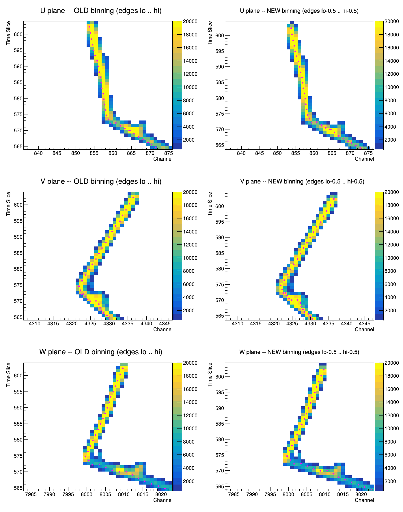

# pr/7 — Magnify-tracking projection alignment, distance axis, and row order (SBND evt 172230)

Follow-up to [pr/5](5_evt172230-proton-pid-and-direction.md), whose fix
(`743a55c6`, keep the fractional wire coordinate) removed a −0.5 channel bias but
left the drawn track still visibly left of the charge peak in the U pad.  This
doc answers the question that prompted it: **is that a display artefact, or is
something wrong in the track fitting?**

It is display.  The chain TrackFitting → dumper → GUI shares one coordinate
convention and the fit agrees with the measurement; the half bin is introduced by
the viewer's histogram axes.  Two further defects were found on the way (the
dQ/dx distance axis, and a nondeterministic T_rec_charge row order) and are fixed
here too.

## Repro

```bash
SX=.../wcp-porting-img/sbnd/sbnd_xin
OUT=/home/xqian/tmp/pr7                     # any scratch dir; PROUT keeps
mkdir -p $OUT                               # nupr_evt172230/ intact (M13)

# 1. PR chain on evt 172230 (writer output: tracking-pr.root)
PROUT=$OUT $SX/work-nuecc48-prsmoke2/run_pr3_evt.sh 172230

# 2. is the writer consistent with the measured charge? (index space)
python3 $SX/pr_proj_align.py $OUT/tracking-pr.root 5

# 3. GUI-format conversion
wire-cell-sbnd-magnify-tracking-convert -b$OUT/tracking-pr.root -f2 -o$OUT/track_com.root

# 4. old-vs-new binning, side by side (negative control; writes ./binctl.png)
root -l -b -q "$SX/pr_proj_binctl.C(\"$OUT/track_com.root\")"

# 5. the real viewer code, headless (writes a PNG; no X needed)
cd .../Magnify-tracking-SBND/scripts
root -l -b -q loadClasses.C "$SX/pr_proj_guishot.C(\"$OUT/track_com.root\",0,79,20,\"$OUT/gui.png\")"

# 6. the GUI itself
.../Magnify-tracking-SBND/magnify.sh $OUT/track_com.root
```

Toolkit `apply-pointcloud` (`b8080267`, `dc9ba62b`); viewer
`BNLIF/Magnify-tracking-SBND` `master` (`12de6c9`).  A ready-made output of steps
1–3 is in `work-nuecc48-prsmoke2/nupr_evt172230_pr7/`.

---

## 1. The convention: everything is an INDEX

`T_proj_data.channel` is a wire index and `T_rec_charge.pu/pv/pw` are the
continuous version of that same index — integer = wire **centre**, not a wire
edge:

| where | code | says |
|---|---|---|
| `clus/src/Facade_Util.cxx:550` | `wind = round((y-center)/pitch - 0.5)` | index ↔ pitch coordinate |
| `clus/src/Facade_Grouping.cxx:781` | `y = pitch*(wire+0.5) + center` | the exact inverse |
| `clus/src/TrackFitting.cxx:499` | `offset_u = -(center_u + 0.5*pitch_u)/pitch_u` | `pu` is the continuous `wind` |
| `clus/src/TrackFitting.cxx:3495` | `data_u_2D = scaling*(it->wire - offset_u)` | the fit's own 2-D target pulls `pu` onto the integer wire index |

Time is the same story: `fit.pt` is a continuous tick coordinate, and both
`T_rec_charge.pt` (`reco_pt = fit.pt / nticks_per_slice`) and
`T_proj_data.time_slice` (`wt.second / nticks_per_slice`) are the same slice
index.

`SbndPrMagnifyTrackingVisitor.cxx` publishes `base[p] + apa*nch[p] + fit.pu`
— a plain index, no display offset.  So do the STM fork
(`SbndMagnifyTrackingVisitor.cxx:466`) and the uBooNE writer
(`UbooneMagnifyTrackingVisitor.cxx:478`).

## 2. The measurement: the writer agrees with the data

`scripts/analysis/geom/pr_proj_align.py` fits the global (channel, slice) shift that best centres the
measured charge cells on the drawn polyline, in index space (charge-weighted
least squares on the perpendicular offset to the nearest polyline segment; cells
within 3 index units).  Evt 172230, cluster 5, 582 fitted points, 7577 cells:

| plane | cells | measured `dch` | measured `dt` | predicted `dch` | predicted `dt` |
|---|---|---|---|---|---|
| U | 2071 | +0.051 | +0.067 | −0.024 | +0.050 |
| V | 1734 | −0.163 | −0.057 | −0.077 | −0.031 |
| W | 2378 | −0.028 | +0.012 | −0.035 | +0.010 |

Read "zero" against the scale of the effect under diagnosis: the half-bin
mismatch is exactly **0.5** by construction, and every residual here is ≤0.16, so
the data excludes a half-bin writer offset by more than 3×.  (The V column moved
by ~0.18 between two different runs of the same event, which is the size of the
method's own systematic — still a third of what is being excluded.)
`charge_pred` — the fit's own prediction — lands where the measurement lands.
**There is no reconstruction offset.**  This is also why the best-fit dQ/dx
looked reasonable all along.

## 3. Root cause: the viewer's bin edges

`Magnify-tracking-SBND/event/Data.cc` built the projection histograms as

```cpp
h_proj_u = new TH2F("h_proj_u", "", nChannel_u, 0, nChannel_u, nTime, 0, nTime);
...
hc->SetBinContent(x+1, y+1, z);      // x = channel index, y = slice index
...
g_rec_u->SetPoint(i, us[i], t);      // polyline at the RAW index
```

With edges at `0 … n`, bin `x+1` spans `[x, x+1]` and is drawn centred on
`x+0.5`.  The polyline is drawn at `x`.  Every charge cell is therefore painted
half a channel **and** half a slice up-right of where the track is drawn — or
equivalently the track sits half a bin down-left of its own charge, on all three
pads.  It is most visible in U on this event because the track is steep in
channel there, so the horizontal half-bin is not masked by the track's own slope.

The uBooNE original gets away with `(n, 0, n)` because WCP's writer publishes
**display** coordinates:

```cpp
// prototype_base/pid/src/PR3DCluster_trajectory_fit.h:468-471
pu.push_back(offset_u + 0.5 + (slope_yu * p.y + slope_zu * p.z));
pv.push_back(offset_v + 0.5 + (slope_yv * p.y + slope_zv * p.z) + 2400);
pw.push_back(offset_w + 0.5 + (slope_yw * p.y + slope_zw * p.z) + 4800);
pt.push_back(offset_t + 0.5 + slope_x * p.x);
```

That `+ 0.5` on all four is exactly the half bin.  The WCT ports publish index
coordinates instead, and the viewer — forked from `BNLIF/Magnify-tracking` — was
never told.

### Fix

Viewer side, so that `T_rec_charge.pu` stays identical to
`T_proj_data.channel` (one convention across TrackFitting, the dumper and the
GUI).  Both axes get edges `lo-0.5 … hi-0.5`, so bin `i+1` is centred on index
`i`; `SetBinContent(x+1, y+1, …)` is unchanged.  All 12 histograms
(`h_proj_{u,v,w}`, `h_pred_{u,v,w}` and the six `*_all` variants).

Two things become *correct* under the new binning and needed no change: the
bad-channel `TLine(chid, …)` (previously drawn on the left edge of its own dead
channel) and `DrawPoint`'s `SetX(x[i])` marker.  `zoomHisto`'s `SetRangeUser`
and `GetPointIndex` take raw channel values and still land right.

### Negative control

`sbnd_xin/scripts/root/pr_proj_binctl.C` reproduces the three lines above and draws the same
U/V/W zoom (t 564–604, u 836–876, v 4307–4347, w 7983–8023) twice — old edges on
the left, new on the right:



The left column reproduces the offset seen in the GUI: the magenta markers hug
the left/lower edge of the yellow charge band.  On the right they sit on it.

`scripts/root/pr_proj_binctl.C` is a reimplementation of those three lines, so it does not
exercise `Data.cc` itself.  `sbnd_xin/scripts/root/pr_proj_guishot.C` does: it mirrors
`GuiController`'s init sequence (3×3 canvas, `Data(file, sign)`, `data->c1 =
can`, `DrawNewCluster()`) without a `TGWindow` and then calls the same public
entry points the GUI calls (`DrawDQDX`, `DrawProj`, `DrawSubclusters`,
`DrawBadCh`, `DrawPoint`, `ZoomProj`), writing a PNG.  Run clean on three files:
the new PR dump, an STM dump (`showcase-stmfit-286241/track_com_286241.root`,
which takes the single-sub-cluster path), and an OLD PR conversion — no crash,
no double free, tracks centred on the charge in all three planes.

## 4. `rec_L`: the dQ/dx "Distance from start" axis was a concatenation

`rec_L` does not exist in `tracking-pr.root`.  The convert app synthesizes it as
a running sum, reset only when `ndf` changes.  The PR writer gives every vertex
and every segment of a cluster the same `ndf`
(`SbndPrMagnifyTrackingVisitor.cxx`, `reco_ndf = cluster->get_cluster_id()`), so
the whole PR graph of a cluster is one block.  Evt 172230 cluster 5:

```
sub    -1   n= 25   len=1033.71 cm   <- the 25 vertices, pairwise hops
sub  5001   n= 10   len=   5.64 cm
 ...        25 real PR segments, 2.4 - 25.6 cm each, 231.5 cm total
inter-segment hops                     522.0 cm
                        block total rec_L 1787.29 cm
```

1787 cm of "distance from start" on a detector whose diagonal is ~540 cm, with
every real segment pushed past 1033 cm by the vertex run alone — which is why the
pr/5 screenshots read 1165–1338 cm.  The dQ/dx pad drew one `TGraph` with
`"ALP"` over the block, so the hops appeared as the long marker-free straight
lines across the pad.

### Fix (two halves)

- **Convert app** (`wire-cell-sbnd-magnify-tracking-convert.cxx`): reset
  `total_L` when `sub_cluster_id` changes, and treat a sub-cluster's first point
  as a restart so the hop is not accumulated.  PR vertices
  (`flag_vertex`, `sub_cluster_id == -1`) are point objects, not a trajectory, so
  they all sit at 0.  Max block `rec_L` 1787.29 → **25.57 cm** (the longest PR
  segment).
- **Viewer**: `Data::DisplayL()` lays the sub-clusters out end to end with a 1 cm
  gap, strictly increasing (GuiController maps a click back to a point index with
  `TMath::BinarySearch` over `g_dqdx->GetX()`), one entry per fitted point
  (`ZoomDQDX` indexes `g_dqdx` by the point index shared with `rec_u/v/w`).
  `g_dqdx` is now drawn `"AP"` — markers only — with one `"Lsame"` graph per
  sub-cluster, so nothing joins two segments.  The truth curves, the
  reduced-chi2 curve and the MC-compare pad use the same layout.

**Old converted files still open.**  `DisplayL()` sets
`off = x[i-1] + gap - L[i]` at a sub change, which differences a cumulative
`rec_L` back into per-segment increments — so the dozen existing
`track_com*.root` files render sensibly without re-converting.  Their vertex run
keeps its long prefix (evt 172230 still starts the segments near 1034 cm,
verified by rendering `nupr_evt172230_pufix/track_com_pr_evt172230.root`), but
the segments no longer stack on top of each other.

**No-op for STM dumps**, and proved with bytes rather than reasoning:
`SbndMagnifyTrackingVisitor` writes `ndf == sub_cluster_id == cid*10+pass`, so
the sub-cluster changes exactly when `ndf` does, and STM dumps have no vertex
points at all (0 of 60 on evt 349241).  Re-converting
`work-stmcamp-dbg6/nusel_evt349241/tracking-stm.root` with the old and new
binaries, in both `-f2` (data) and `-f1` (MC) mode:

```
stm_349241      rec_L  base 6982d2284e39  new 6982d2284e39  SAME
stm_349241_mc   rec_L  base 6982d2284e39  new 6982d2284e39  SAME
pr_172230       rec_L  base 4f626ca5820c  new 3633e00efea1  DIFF   (intended)
                rec_dQ / rec_dx / rec_u / rec_t              SAME  (all three files)
```

## 5. T_rec_charge row order was not reproducible

Found while A/B-ing the change below: two runs of the **same** binary on the same
event produced different `T_rec_charge` row orders (identical content — the
multiset of rows hashes the same), even under `setarch x86_64 -R`.  The order is
what the convert app turns into track blocks and what the GUI shows as "cluster
index", so the same cluster id landed at a different index every run.  That is
the explanation for the pr/5 screenshots showing "cluster id 5 (index 1)" and
"cluster id 5 (index 5)" — they are the same cluster in two runs, not a
before/after pair, and should not be read as one.

Two causes, both in `write_t_rec_data`:

1. `std::map<Facade::Cluster*, …>` and `std::set<Facade::Cluster*>` iterated
   directly (CLAUDE.md determinism rule).  Now `PR::ClusterPtrCmp` /
   `PR::ClusterPtrSet`, i.e. cluster-id order.
2. The PR graph's **vertex descriptors** themselves are not reproducible run to
   run, so even cluster-id order left the 87 vertex rows shuffled.  The writer
   now sorts each cluster's vertices by their fitted point and each cluster's
   segments by `(graph_index, first fitted point)` — content keys, so the order
   no longer depends on the graph's construction order.

Evidence (five runs, `raw` = row order included, `sorted` = content multiset):

```
prA  old binary        raw 30d245a98ba0d745   sorted 4efae0b0c5971b6b
prD  cluster-id order  raw 2588632aa350aa68   sorted 4efae0b0c5971b6b
prE  cluster-id order  raw 25ad2dfd22e5c647   sorted 4efae0b0c5971b6b
prF  content order     raw f7170b93dbe37f07   sorted 4efae0b0c5971b6b
prG  content order     raw f7170b93dbe37f07   sorted 4efae0b0c5971b6b
```

`prF == prG` bit for bit, and the content hash is unchanged from `prA`.
`mabc-pr.zip` member hash is `b101aa85594d86dc` in all five runs — the
reconstruction products are untouched.  Cluster 5's block index is now stably 0
(it was 3 in `prA` and 1 / 5 in the two pr/5 screenshots).

The underlying vertex-descriptor instability is upstream in the PR graph and is
**not** fixed here; the writer is simply made independent of it.

## 6. `paf` fallback guard

`project_fit` fell back to `apa = 0` when `fit.paf.first < 0`, but
`nticks_for(fit.paf)` then missed the map and returned 1, so such a point's
`reco_pt` would be its raw tick instead of its time slice — a factor 4 off on
SBND.  The visitor now uses the same fallback pair for both and logs the count:

```
SbndPrMagnifyTrackingVisitor: wrote 582 entries to T_rec_charge (0 with no recorded (apa,face))
```

Zero occurrences on evt 172230, so this is a guard, not a change of what is
written — confirmed by the content hash above being identical to `prA`.

## 7. Status, and what is deliberately not fixed

The row-order change in §5 touches `tracking-pr.root` for every PR event, so
"display-layer" is a checked claim, not an assumption:
`grep -rl T_rec_charge` over the toolkit and wcp-porting-img finds the three
writers, the two convert apps, `cfg/.../sbnd/clus.jsonnet` (wiring only), and
eight analysis scripts — and all eight read `tracking-stm.root`, written by the
untouched `SbndMagnifyTrackingVisitor`.  Nothing but the SBND convert app reads
`tracking-pr.root`.

**Changed** (all display-layer; no wire-cell reconstruction output changes, so no
A/B gate applies — `mabc-pr.zip` is byte-identical across every run above):

| repo | file | change |
|---|---|---|
| toolkit | `root/apps/wire-cell-sbnd-magnify-tracking-convert.cxx` | per-sub-cluster `rec_L` |
| toolkit | `root/src/SbndPrMagnifyTrackingVisitor.cxx` | content-ordered rows, `paf` guard |
| toolkit | `clus/docs/porting/porting_dictionary.md` | the `+0.5` divergence |
| viewer | `event/Data.cc`, `event/Data.h` | bin centres, `DisplayL`, per-sub dQ/dx graphs |
| wcp-porting-img | `work-nuecc48-prsmoke2/run_pr3_evt.sh` | honour `PROUT` so re-runs stay out of the record dir |
| wcp-porting-img | `scripts/analysis/geom/pr_proj_align.py`, `scripts/root/pr_proj_binctl.C`, `scripts/root/pr_proj_guishot.C` | new |

**Recorded, not fixed:**

- `UbooneMagnifyTrackingVisitor` publishes index coordinates too, so uBooNE
  Magnify-tracking pads have the same half-bin offset against the unforked
  `BNLIF/Magnify-tracking`.  That writer serves the qlport gate chain and stays
  byte-for-byte untouched (CLAUDE.md M10); the uBooNE viewer is not in this tree.
  Whoever wants it fixed should shift the uBooNE viewer's axes the same way.
- `T_bad_ch` time ranges are true intervals (`[start, end)` ticks), so under the
  new y binning a dead-channel line's two ends are half a slice off.  Negligible:
  these lines almost always span the full readout.
- The PR graph's vertex-descriptor order (§5).  Anything else that iterates it
  and cares about order has the same exposure.
- `SbndMagnifyTrackingVisitor` (STM) is untouched.  Its dumps have no vertices
  and one sub-cluster per block, so both `rec_L` and the row order are already
  well defined there; the viewer's axis fix serves it as well.
