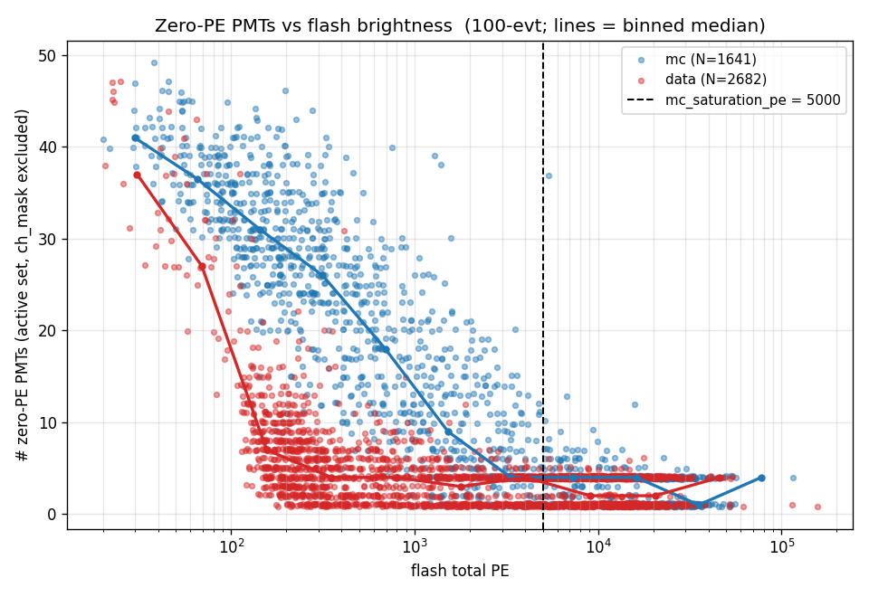
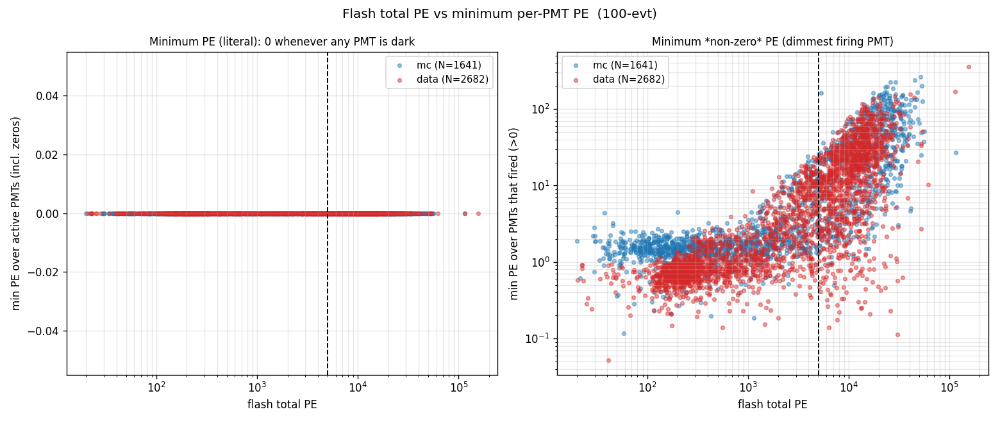
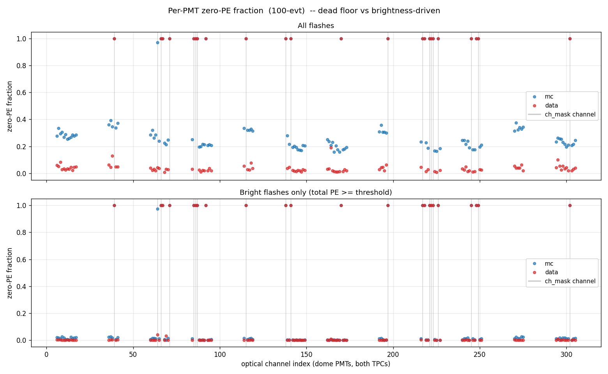
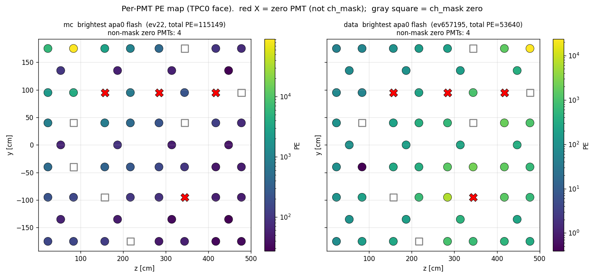

# SBND saturated-PMT analysis (MC vs data)

## Purpose

`match/docs/chisquare_flags_comparison.md` §12.1 documents a toolkit-only, **MC-only**
Q/L-matching gate, `mc_saturation_pe` (default **5000 PE**, `QLMatching.cxx:455-461`):

```cpp
if (flash->get_total_PE() > m_mc_saturation_pe && pe_det == 0 && m_data == false)
    flash_opdet_mask[idet] = 0;   // drop this channel for this flash only
```

The stated premise: the optical simulation represents a **saturated** PMT by emitting
`pe = 0`, so in a **bright** flash (total PE > 5000) a `pe = 0` PMT is taken to be a
simulated saturated channel and masked out of that flash's χ²/LASSO. Data is left
untouched (it handles dead channels via `ch_mask`).

This note tests that premise on real samples and answers three questions:

1. **MC** — does the "bright flash, some PMTs read 0 PE" situation actually occur?
2. **Data** — does the same pattern occur (data is *not* masked by the gate)?
3. Is **5000 PE** the right cut? — by plotting total PE vs the number of zero-PE PMTs
   (and vs the minimum per-PMT PE).

The yes/no question cannot be answered by the total-PE-vs-`n_zero` scatter alone: a
*saturating* PMT (fires when dim, rails to 0 when bright, sits **among** the brightest
PMTs) and a *dead/edge* PMT (~0 **always**, regardless of brightness) both produce a flat
floor of `N` zeros. So the analysis adds discriminators that separate them — per-channel
zero-fraction split by brightness, channel-identity of bright-flash zeros across MC vs
data, `ch_mask` overlap, and a spatial (y,z) PE map.

## Data layout

Per-TPC flash archives, two samples (10-evt cross-check, 100-evt primary):

| mode | path |
|------|------|
| mc   | `input_files/input-{10,100}evt-mc/opflash_apa{0,1}.tar.gz` |
| data | `input_files/input-{10,100}evt-data/opflash_apa{0,1}.tar.gz` |

Each archive holds, per event, `opflash_tensor_<EVENT>_0_array.npy` of shape
`[nflash, 313]`: column 0 = flash time (ns), columns 1–312 = per-channel PE. Archive
`apaN` carries **only TPC-N dome-PMT light** (asserted in the script: every nonzero
channel falls in that TPC's dome-PMT set; no ARAPUCAs, no opposite-TPC channels).

**PMT set.** From the semi-analytical model JSON
(`…/wire-cell-data/sbnd/photodet/semi-analytical-sbnd.json`): 120 dome PMTs (`type==1`),
60 per TPC (`x<0` ⇒ TPC0/apa0, `x≥0` ⇒ TPC1/apa1; `cathode_x = 0`). The matcher's
`ch_mask` (19 channels, identical for MC and data;
`cfg/pgrapher/experiment/sbnd/qlmatching.jsonnet`) is the separate dead-channel list.

## Method

For every flash we record total PE, the number of zero-PE PMTs over the same-TPC active
set (60 PMTs **minus `ch_mask`**), the number including `ch_mask`, and the minimum
per-PMT PE — all dumped to **`saturation_flash_dump.csv`** (4972 flashes). We also build,
per channel, the fraction of flashes reading `pe == 0`, split by total-PE band
(`saturation_perchan.csv`).

"Bright" = total PE ≥ 5000 (the gate threshold). The cross-mode comparison is reported
**excluding `ch_mask`** (the genuine "should-have-fired but 0" candidates); raw counts
including `ch_mask` are in the CSV.

Reproduce with:

```bash
python3 saturation_pe.py                 # default threshold = 5000
python3 saturation_pe.py --threshold 8000
```

## Results

### Zero-PE PMTs vs flash brightness



The number of zero-PE PMTs **decreases monotonically with brightness** and flattens to a
floor — there is **no upturn**. This is the *opposite* of saturation: as a flash
brightens, real PMTs that were sub-threshold light up, so fewer read zero. By ~5000 PE
the curve has reached its dead-channel floor (≈4 zeros for apa0, ≈1 for apa1 — see below).

Per-flash `n_zero` (active set, `ch_mask` excluded), 100-evt:

| sample | bright (≥5000) mean / median / max | dim (<5000) mean / median |
|--------|-----------------------------------|---------------------------|
| mc     | 2.89 / 4 / 37                     | 21.3 / 23                 |
| data   | 2.52 / 2 / 6                      | 5.40 / 4                  |

Dim flashes have **far more** zeros than bright ones in both modes (mc more so, because
its low-PE flash population is larger — see `flash-coincidence.md`).

**The bright-flash "live-zero" tail (the user's exact scenario).** Subtracting the
permanently-dead floor (4 PMTs on apa0, 1 on apa1 — the {67,92,170,218,248} set below)
isolates *live* PMTs reading zero in a bright flash. This small population *does* exist in
MC and is the only thing resembling the user's "big flash, but some PMTs at 0" picture —
but it is **dim, MC-favoured, and concentrated just above the 5000 cut**, decaying to zero
well before the brightest flashes:

| total PE band | mc: flashes with ≥1 live-zero | data |
|---------------|------------------------------|------|
| ≥ 5000        | 15.2 %  (mean 0.40, max 33)  | 3.6 % (mean 0.04, max 2) |
| ≥ 10000       | 7.5 %                        | 3.5 % |
| ≥ 20000       | 2.1 %                        | 2.4 % |
| ≥ 50000       | 0 %                          | 0 % |

The MC flashes with a *sizeable* live-zero count (≥5) sit at total PE ≈ 5.4k–6.9k
(median 6204) — right on the steep falling edge, where many real PMTs are still
sub-threshold. By ~20k PE essentially every live PMT fires. So these zeros are **dim live
channels near threshold, not PMTs that rail to zero from excess light**.

### Minimum per-PMT PE



The literal minimum PE over the active set (left) is **0 at every total-PE value** —
because every flash contains at least one permanently-dead PMT, the minimum is always 0,
so this observable is uninformative (as expected). The minimum *non-zero* PE (right, the
dimmest **firing** PMT) **rises** with total PE — again the opposite of a saturation
signature. `n_zero` is therefore the informative observable, not min-PE.

### Per-PMT zero fraction — the discriminator



This separates dead channels from saturation. **Top (all flashes):** live PMTs sit at a
modest zero fraction (mc ≈ 0.2–0.4, data ≈ 0.0–0.1 — driven by dim flashes); a fixed set
of channels sits at fraction **1.0** (never fire). **Bottom (bright flashes only):** every
live PMT drops to ≈ 0 — they all fire when the flash is bright — and the **only** channels
still reading zero are the same fraction-1.0 dead set, **identical in MC and data**. No
channel has a zero fraction that is *elevated specifically in bright flashes*, which is the
signature true saturation would produce.

### Channel identity of bright-flash zeros

Channels systematically dark (>50 %) in bright flashes:

- **MC** and **data** agree to Jaccard **0.96** (23/24 channels; the one difference is a
  `ch_mask` channel near the count cutoff).
- Of these, 18–19 are `ch_mask` channels. The remaining **5 are the same in both modes:
  channels {67, 92, 170, 218, 248}** — and they read `pe == 0` in **100 % of all flashes**
  (dim and bright, MC and data). They are simply **dead detectors missing from `ch_mask`**,
  not saturation. (These 5 form the floor: 4 live in apa0 → `n_zero` floor 4; 1 in apa1 →
  floor 1.)

### Auditing the `ch_mask` list

Checking the *measured* zero-fraction of every channel in the matcher's `ch_mask`
(19 channels) against the 5 unlisted dead channels:

| channels | MC zero-frac | data zero-frac | reality |
|----------|--------------|----------------|---------|
| 18 of the 19 list entries (all except 64) | 1.0000 | 1.0000 | genuinely dead in both ✓ |
| **channel 64** | 0.9728 | **0.0404** | **live in data, dead in MC** ✗ |
| {67, 92, 170, 218, 248} (not in list) | 1.0000 | 1.0000 | dead in both, but **unmasked** |

Two list problems surface:

- **5 dead channels are missing** from `ch_mask` — {67, 92, 170, 218, 248} never fire in
  either mode yet are not masked, so they enter χ²/LASSO as `(measured 0, predicted >0)`
  in data (and in dim MC flashes), and are only removed in MC bright flashes by the
  `mc_saturation_pe` gate.
- **Channel 64 is masked but live in data** — it fires in ~96 % of data flashes
  (including bright ones) but is dark in ~97 % of MC flashes. The list is masking a working
  data PMT. The direction matters: this is an MC deficiency (the channel is simulated
  dark), so masking it keeps MC/data on the *same* channel set for the χ² — defensible as a
  consistency choice, but it is *not* a "this PMT is dead" fact and discards real data
  light. Flag for the list owner.

### Spatial PE map (brightest flashes)



The four non-`ch_mask` zero PMTs (red ✗) in apa0 occupy the **identical (y,z) positions in
MC and data**, even in a 115,149-PE MC flash and a 53,640-PE data flash. A saturation
artifact would be MC-only; identical dead channels in data confirm these are dead
detectors. (Gray squares = `ch_mask` zeros.)

## Takeaways

1. **There is no PMT-saturation situation in either MC or data.** Bright flashes *do*
   contain zero-PE PMTs, but every zero-PE PMT in a bright flash is a **permanently dead
   channel** (`pe == 0` in 100 % of flashes), not a channel that rails to zero because the
   flash is bright. The §12.1 premise ("sim encodes saturation as `pe = 0`") is **not
   supported** by these samples.
2. **MC and data behave the same.** The dead-channel set is identical (Jaccard 0.96), and
   the brightness dependence is identical: more zeros when dim, fewer when bright. The
   `pe = 0`-in-bright population is not an MC-only modeling effect.
3. **5000 PE is not a saturation threshold — there is no saturation to threshold.**
   `n_zero` falls monotonically with PE (no upturn), so no total-PE value marks a
   saturation onset. The gate masks two things in bright MC flashes: (a) the permanently
   dead channels (the dominant, always-present part), and (b) a **small tail of dim *live*
   PMTs near threshold** — 15 % of MC bright flashes have ≥1, mean 0.4, clustered at
   ~5–7k PE and gone by ~20k PE. The cut therefore sits on the **steep falling edge** of
   the `n_zero` distribution: lowering it sweeps in many sub-threshold live PMTs; raising
   it to ≳ 20k would leave essentially only dead channels. 5000 is a reasonable
   "everything live should have fired by here" heuristic, but it is not sharp and not tied
   to any saturation feature.
4. **Recommended fix — correct the channel list, then retire the gate.**
   (a) Add the 5 always-dead, unmasked channels **{67, 92, 170, 218, 248}** to `ch_mask`
   (dead in 100 % of flashes in both modes). (b) Revisit **channel 64**, which is masked
   but live in data — keep it masked only if MC/data channel-set consistency is wanted over
   using its real data light. With dead channels handled directly in `ch_mask`, they are
   excluded from χ²/LASSO consistently in *both* modes and at *all* brightnesses, which
   removes the largest part of the MC/data asymmetry the gate introduces. The
   `mc_saturation_pe` gate is then **redundant** for its dominant effect; its only residual
   is (b)-style dim live PMTs in near-threshold MC flashes — a different question (whether
   to penalise a dim-but-real PMT) that **cannot be adjudicated from this measured-PE-only
   data** (see caveat). Recommendation: fix the list and **retire `mc_saturation_pe`** (or
   leave it default-OFF per the toggleable-changes convention). If kept, it is harmless but
   misnamed — a bright-flash low-PE-channel mask, not a saturation mask.

   **Status — applied** (`cfg/pgrapher/experiment/sbnd/qlmatching.jsonnet`): the 5 dead
   channels {67, 92, 170, 218, 248} were added to `ch_mask`, and `mc_saturation_pe` was set
   to `1e12` (inert) to disable the gate. Channel 64 was **left masked** — its
   data-live / MC-dead status is a consistency choice for the list owner, not a clear
   dead-channel fact, so it was not changed without direction. The C++ default (`5000`) is
   unchanged, so only the SBND config is affected.

**Caveat — measured PE only.** This analysis sees only the *measured* per-PMT PE in the
flash archives, not the matcher's *predicted* PE. The gate's literal premise is "a zero
PMT in a bright flash *should have seen light*", which is a statement about the
prediction. We can show the zeros are dead channels (always 0, identical MC/data) plus a
small dim-live tail; we cannot, from measured PE alone, decide whether that dim-live tail
*should* have fired per the optical model. The dead-channel conclusion and the absence of
a brightness-driven saturation onset are robust to this; the residual (b) treatment is the
part that would need the prediction to settle.

## Files

- `saturation_pe.py` — analysis + plotting script.
- `saturation_flash_dump.csv` — per-flash observables (4972 flashes: mc+data, 10+100 evt,
  both APAs): `mode, sample, apa, event, flash_index, time_ns, total_pe, n_active_pmt,
  n_zero_excl_chmask, n_zero_incl_chmask, min_pe_active, min_nonzero_pe`.
- `saturation_perchan.csv` — per-channel zero fraction (100-evt), all flashes and bright
  flashes, with a `in_chmask` flag.
- `pics/saturation_totPE_vs_nzero.png` — zero-PMT count vs flash brightness (the requested
  plot + binned-median threshold diagnostic).
- `pics/saturation_totPE_vs_minPE.png` — total PE vs minimum / minimum-non-zero per-PMT PE.
- `pics/saturation_zerofrac_perchan.png` — per-PMT zero fraction, dead floor vs brightness.
- `pics/saturation_pmt_map.png` — (y,z) PE map of the brightest apa0 flash, MC vs data.
